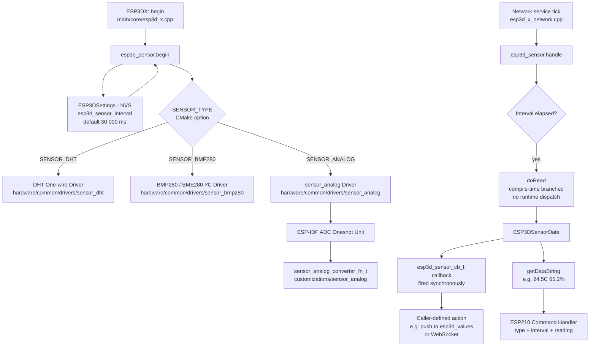
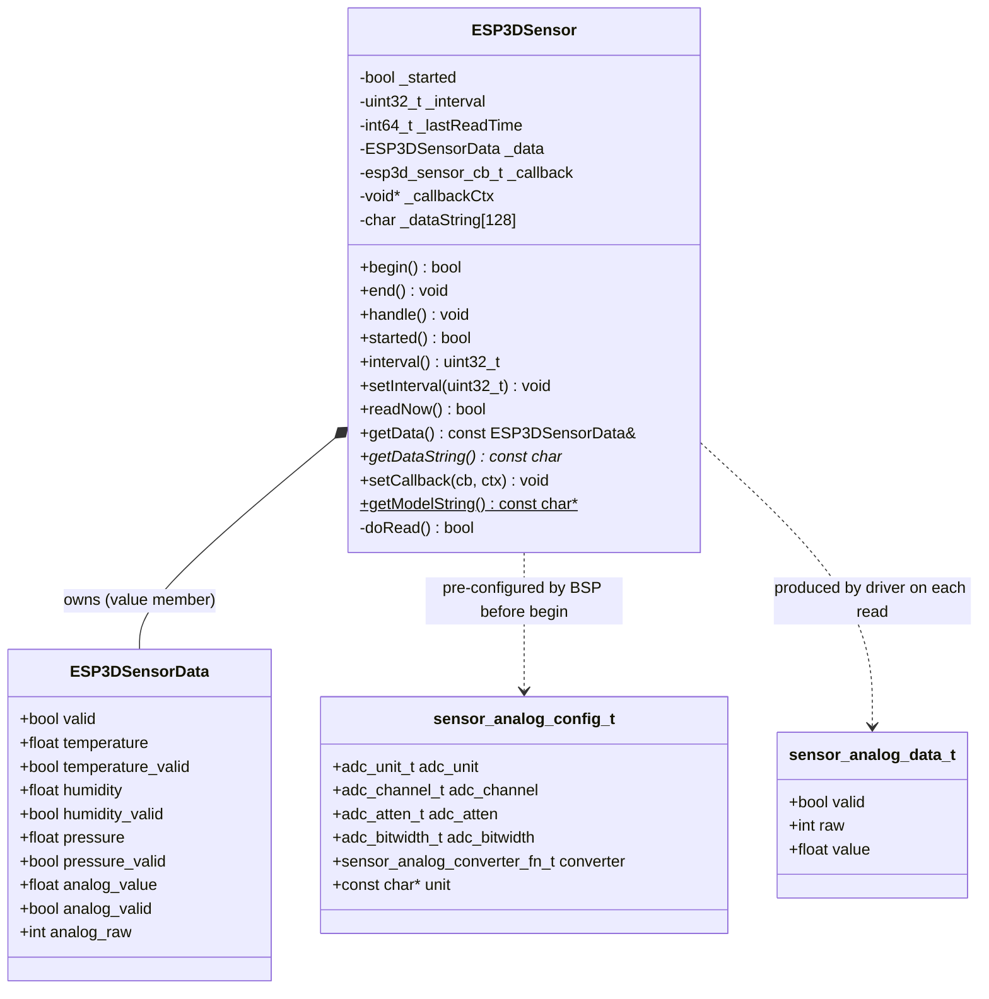
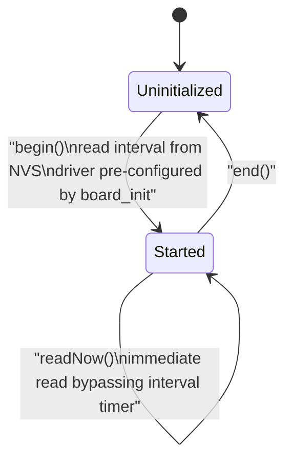
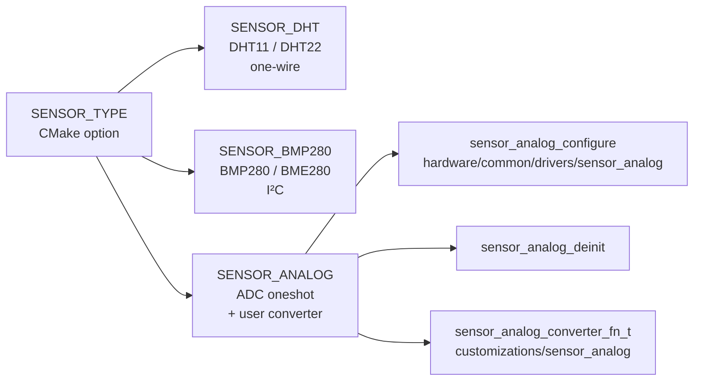
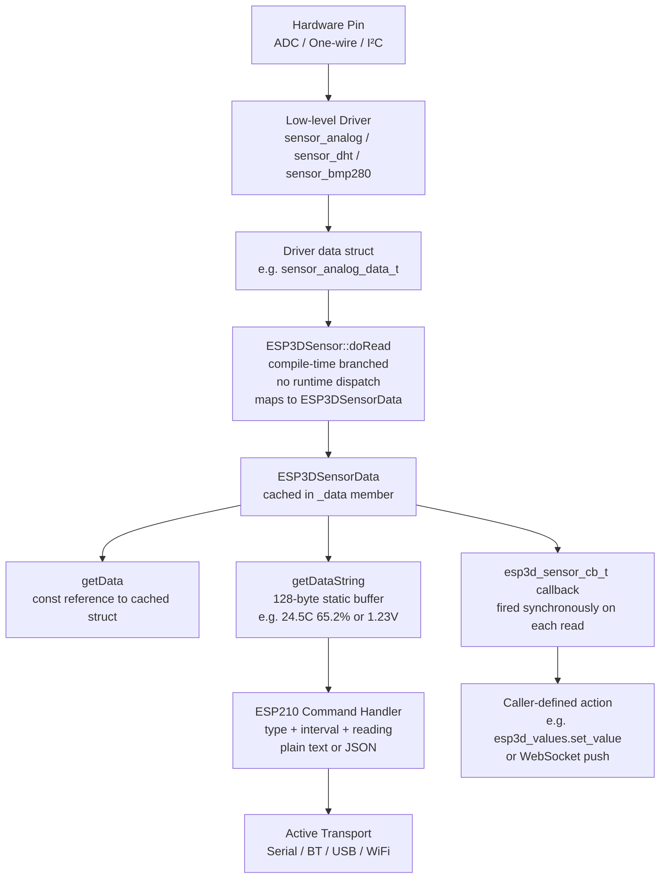
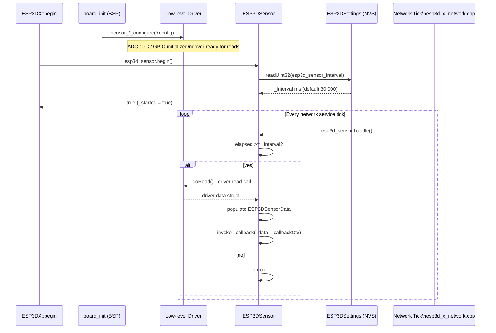
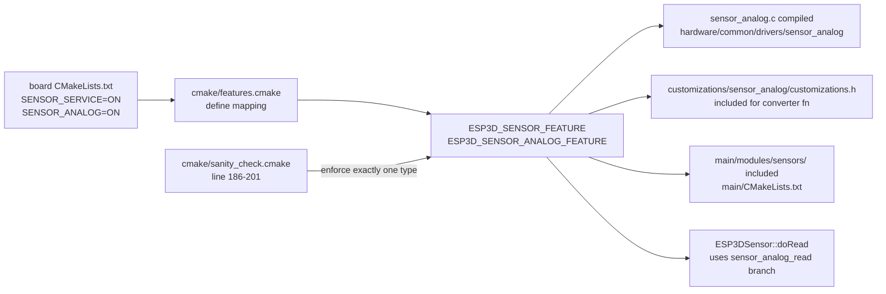

# Sensors Module

Guard: `ESP3D_SENSOR_FEATURE` (CMake option `SENSOR_SERVICE`)

> **Status: dormant / not shipping.** `SENSOR_SERVICE` is fully wired through `cmake/features.cmake` and `cmake/sanity_check.cmake`, and the runtime code (`main/modules/sensors/`, `[ESP210]`, `[ESP400]/[ESP401]` settings, the mDNS `sensor` TXT record) is complete and buildable — but **no board's `CMakeLists.txt` or `variants.py` currently sets `SENSOR_SERVICE` to `ON`**. This is reserved groundwork for a future ESP3D-X port with sensor hardware, not a bug or oversight. Nothing here applies to any currently shipping SKU.

---

## Introduction

The Sensors module (`main/modules/sensors/`) provides a unified interface for reading environmental data from one of several hardware sensor drivers compiled into the firmware at build time. A single global `esp3d_sensor` object manages the selected sensor, handles periodic polling, formats output for the `[ESP210]` command, and notifies registered callbacks on every successful reading.

The module is a **compile-time-selected, single-driver abstraction**: exactly one sensor driver is compiled per build, chosen via `SENSOR_SERVICE` + `SENSOR_DHT` / `SENSOR_BMP280` / `SENSOR_ANALOG` CMake options (enforced in `cmake/sanity_check.cmake:186-201`). It sits within the [Storage & Configuration](filesystem.md) group alongside the filesystem, update service, and config-file modules because the polling interval is a persistent setting backed by NVS via [`ESP3DSettings`](Core_Platform_and_Infrastructure.md).

---

## Architecture Overview



---

## Component Diagram



---

## Core Components

### `ESP3DSensorData` — Unified Reading Struct

**File:** `main/modules/sensors/esp3d_sensor.h`

A flat struct representing one complete sensor reading. All fields are always present regardless of which driver is compiled. Fields not produced by the active driver remain `0.0f / 0` with their `_valid` flag set to `false`.

| Field | Type | Description |
|---|---|---|
| `valid` | `bool` | `true` if the most recent read succeeded overall |
| `temperature` | `float` | Temperature in °C |
| `temperature_valid` | `bool` | `true` for DHT11, DHT22, BMP280, BME280 |
| `humidity` | `float` | Relative humidity in % |
| `humidity_valid` | `bool` | `true` for DHT11, DHT22, BME280 |
| `pressure` | `float` | Atmospheric pressure (driver-defined unit) |
| `pressure_valid` | `bool` | `true` for BMP280, BME280 |
| `analog_value` | `float` | Converted analog reading (e.g. voltage in V) |
| `analog_valid` | `bool` | `true` for ANALOG driver |
| `analog_raw` | `int` | Raw 12-bit ADC value (ANALOG driver only) |

---

### `ESP3DSensor` — Sensor Manager

**File:** `main/modules/sensors/esp3d_sensor.h` / `esp3d_sensor.cpp`

The central management class. A single global instance `esp3d_sensor` is declared at the bottom of the header. The class is `final` and non-copyable. It normalizes results from any compiled driver into the common `ESP3DSensorData` struct — the consumer never needs to know which driver was compiled in.

#### Lifecycle



#### Method Reference

| Method | Description |
|---|---|
| `begin()` | Reads polling interval from `ESP3DSettings` (NVS key `esp3d_sensor_interval`, default 30 000 ms). The low-level driver **must** already be configured by `board_init`. Returns `true` on success. |
| `end()` | Stops polling, resets internal state. |
| `handle()` | Non-blocking, interval-gated poll. Called from the network service tick. Calls `doRead()` if the interval has elapsed, then fires the callback synchronously. |
| `readNow()` | Triggers an immediate read outside the normal interval schedule. Returns `true` on success. |
| `getData()` | Returns a `const` reference to the last cached `ESP3DSensorData`. |
| `getDataString()` | Formats data as an ESP210-compatible string (e.g. `"24.5[C] 65.2[%]"`). Returns pointer to an internal 128-byte static buffer — valid until the next call. |
| `setCallback(cb, ctx)` | Register a callback invoked after every successful read. Pass `nullptr` to unregister. |
| `setInterval(ms)` | Change polling interval at runtime. `0` disables automatic polling (use `readNow()` manually). |
| `getModelString()` | **Static.** Compile-time branched. Returns `"DHT11"`, `"DHT22"`, `"BMP280"`, `"BME280"`, or `"ANALOG"`. |
| `started()` | Returns `true` if active. |
| `interval()` | Returns the current polling interval in milliseconds. |

---

### `esp3d_sensor_cb_t` — Data Callback Type

```c
typedef void (*esp3d_sensor_cb_t)(const ESP3DSensorData &data, void *user_ctx);
```

Invoked **synchronously** from the same execution context as `handle()` or `readNow()` — no observer/subscription indirection. The sensor module itself provides no `ESP3DValuesIndex` integration; that wiring must be added by the caller if UI display is needed (see [ESP3DValues Integration](#esp3dvaluesindex--esp3d_values-integration) below).

> ⚠️ **LVGL Constraint:** If the callback modifies LVGL objects, it must be called from Core 1 (the LVGL task). Use change detection before updating widgets to avoid unnecessary redraws.

---

## Supported Sensor Types



Exactly **one** driver is compiled per build. `SENSOR_SERVICE` requires selecting exactly one of `SENSOR_DHT`, `SENSOR_BMP280`, or `SENSOR_ANALOG` — enforced in `cmake/sanity_check.cmake:186-201`.

| CMake flag | Feature define | Driver path | Data populated |
|---|---|---|---|
| `SENSOR_DHT` | `ESP3D_SENSOR_DHT_FEATURE` | `hardware/common/drivers/sensor_dht/` | `temperature`, `humidity` |
| `SENSOR_BMP280` | `ESP3D_SENSOR_BMP280_FEATURE` | `hardware/common/drivers/sensor_bmp280/` | `temperature`, `pressure`, `humidity` (BME280 only) |
| `SENSOR_ANALOG` | `ESP3D_SENSOR_ANALOG_FEATURE` | `hardware/common/drivers/sensor_analog/` | `analog_value`, `analog_raw` |

### DHT Driver (`sensor_dht`)

Bit-banged one-wire protocol on a single GPIO (`sensor_dht_config_t::data_pin`). Requires an external 4.7 kΩ–10 kΩ pull-up resistor. `sensor_dht_read()` is **blocking (~4–5 ms)** and uses a FreeRTOS critical section (`portMUX`) for the timing-sensitive bit read.

> **Minimum re-read interval:** 1 s for DHT11, 2 s for DHT22. Faster polling returns stale data or read errors.

### BMP280 / BME280 Driver (`sensor_bmp280`)

I²C sensor. `sensor_bmp280_configure()` probes the bus, reads the chip ID to auto-detect BMP280 vs BME280, and loads calibration data. **Requires the I²C bus to be initialized** (e.g. via `bus_i2c_init()`) before calling. Humidity is only populated for BME280 — `ESP3DSensorData::humidity_valid` remains `false` on plain BMP280.

### Analog Driver (`sensor_analog`)

ADC oneshot read via ESP-IDF `esp_adc/adc_oneshot.h`. Configurable unit, channel, attenuation, and bit width. An optional `sensor_analog_converter_fn_t` function pointer converts the raw ADC integer to a physical unit. The `unit` field in `sensor_analog_config_t` is a display string used in `getDataString()`.

For the full analog driver API, see [analog_sensor.md](analog_sensor.md).

#### `sensor_analog_config_t`

| Field | Type | Description |
|---|---|---|
| `adc_unit` | `adc_unit_t` | `ADC_UNIT_1` or `ADC_UNIT_2` |
| `adc_channel` | `adc_channel_t` | ADC channel connected to the sensor pin |
| `adc_atten` | `adc_atten_t` | Input attenuation (affects measurable voltage range) |
| `adc_bitwidth` | `adc_bitwidth_t` | ADC resolution (typically 12-bit on ESP32-S3) |
| `converter` | `sensor_analog_converter_fn_t` | `raw int → float`. Pass `NULL` for raw value passthrough. |
| `unit` | `const char*` | Display unit label, e.g. `"V"`, `"C"`, `"%"` |

#### Default Converter (`customizations/sensor_analog/customizations.h`)

```c
static inline float sensor_analog_converter(int raw_value) {
    return (float)raw_value * 3.9f / 4095.0f;
}
```

Maps the 12-bit ADC range (0–4095) to 0–3.9 V. Replace with a board-specific function to convert to temperature, percentage, or any other unit.

---

## Data Flow



---

## Initialization & Polling Sequence



---

## `ESP3DValuesIndex` / `esp3d_values` Integration

**None by default.** Unlike most other subsystems (WiFi status, connection status, etc.), the sensor module does **not** register an `ESP3DValuesIndex` observable. There is no `sensor_*` entry in the values system, and no UI screen or LVGL widget currently subscribes to sensor data.

Sensor data is currently exposed only through ESP commands and mDNS:

| Exposure point | Detail |
|---|---|
| `[ESP210]` | Get/set polling interval (admin-only to set); returns type + interval + current formatted value as plain text or JSON (`main/core/commands/esp210.cpp:32`) |
| `[ESP400]` | Lists `esp3d_sensor_interval` among general settings (`esp400.cpp:549`) |
| `[ESP401]` | Generic settings-write; on writing `esp3d_sensor_interval` also calls `esp3d_sensor.setInterval(value32)` live (`esp401.cpp:229-230`) |
| `[ESP420]` | Includes current sensor reading (or `"OFF"` if not started) in the device info dump (`esp420.cpp:868`) |
| mDNS `sensor` TXT record | Advertises the compiled model name — see [Network & Web Services](Network_and_Web_Services.md) |

Any future UI integration (e.g. a status screen tile) would require adding a new `ESP3DValuesIndex` entry and pushing callback data into `esp3d_values` — that plumbing does not exist today. See [values.md](values.md) for the observable system API.

---

## Build Configuration



| CMake flag | Must be ON alongside `SENSOR_SERVICE` | Compiled driver |
|---|---|---|
| `SENSOR_DHT` | Yes | DHT11/DHT22 one-wire |
| `SENSOR_BMP280` | Yes | BMP280/BME280 I²C |
| `SENSOR_ANALOG` | Yes | ADC oneshot + user converter |
| _(none set)_ | — | Rejected by `cmake/sanity_check.cmake` |

---

## ESP32 Memory Constraints

The sensor module follows the project's memory constraint rules:

- **No dynamic allocation** in `handle()` or `doRead()` — all buffers are fixed.
- `_dataString[128]` is a statically-sized member buffer for `getDataString()`.
- `ESP3DSensorData` is a value member inside `ESP3DSensor` (lives in `.bss`, no heap).
- The callback is a single function pointer — no heap allocation for subscriber lists.
- `sensor_analog_config_t` is copied into driver-internal static storage during `sensor_analog_configure()` — no runtime allocation after init.

---

## Key Files

| File | Role |
|---|---|
| `main/modules/sensors/esp3d_sensor.h` / `.cpp` | `ESP3DSensor` facade — `begin()`/`handle()`/`readNow()`/`getDataString()` |
| `hardware/common/drivers/sensor_dht/sensor_dht.{h,c,config.h}` | DHT11/DHT22 one-wire driver |
| `hardware/common/drivers/sensor_bmp280/sensor_bmp280.{h,c,config.h}` | BMP280/BME280 I²C driver |
| `hardware/common/drivers/sensor_analog/sensor_analog.{h,c,config.h}` | ADC oneshot driver |
| `customizations/sensor_analog/customizations.h` | Default ADC → voltage converter (`raw * 3.9 / 4095`) |
| `main/core/commands/esp210.cpp` | `[ESP210]` — get/set interval, get current reading |
| `main/core/commands/esp400.cpp` / `esp401.cpp` | Generic settings list/write integration |
| `main/core/commands/esp420.cpp` | `[ESP420]` device info dump |
| `main/core/esp3d_x.cpp:149-155` | `esp3d_sensor.begin()` at boot |
| `main/modules/network/esp3d_x_network.cpp:107-109` | `esp3d_sensor.handle()` polling tick |
| `main/core/includes/esp3d_settings_defs.inc:711-724` | `esp3d_sensor_interval` NVS setting (default 30 000 ms) |
| `cmake/features.cmake` | Feature flag → define mapping |
| `cmake/sanity_check.cmake:186-201` | "Exactly one sensor type" enforcement |

---

## Related Documentation

| Document | Relevance |
|---|---|
| [analog_sensor.md](analog_sensor.md) | Full `sensor_analog` driver API (ADC config, deinit, data struct) |
| [Hardware_Peripheral_Drivers.md](Hardware_Peripheral_Drivers.md) | All hardware drivers: display, touch, IO expanders, physical inputs |
| [Core_Platform_&_Infrastructure.md](Core_Platform_and_Infrastructure.md) | `ESP3DSettings` (NVS), `ESP3DValues` observable system |
| [values.md](values.md) | `ESP3DValues` API — needed if adding future UI integration |
| [filesystem.md](filesystem.md) | Sibling module in Storage & Configuration group |
| [update_service.md](update_service.md) | Sibling module in Storage & Configuration group |
| [Network_&_Web_Services.md](Network_and_Web_Services.md) | mDNS `sensor` TXT record, communication transports |
| [bsp_board_initialization.md](bsp_board_initialization.md) | BSP `board_init()` — sensor driver pre-configuration per board |


## Documents de conception (depot)

- [sensors](https://github.com/luc-github/Pibot-cnc-pendant-firmware/blob/main/docs/features/sensors.md)
