# Serial Client Module

## Introduction

The **Serial Client** module (`main/modules/serial/`) implements the UART-based hardware serial transport for CNC machine communication. It is the primary CNC link in the default pendant configuration (serial/USB CNC + WiFi remote), where the pendant communicates with the CNC controller (FluidNC, grbl, grblHAL) over a direct UART connection.

The module provides a full-duplex, line-oriented UART channel, a bidirectional message queue (using the shared `ESP3DClient` infrastructure), an automatic connection handshake, a periodic ping/inactivity-timeout mechanism, and run-time controls for baud-rate change and RX/TX pin swap.

> **Build-model note:** Only one CNC transport is active at a time. When `SOCKET_CLIENT_SERVICE` is OFF (the default), serial is the CNC link. See [`connection_management.md`](https://github.com/luc-github/Pibot-cnc-pendant-firmware/blob/main/docs/architecture/connection_management.md) for the full transport-selection model and the [feature resource matrix](https://github.com/luc-github/Pibot-cnc-pendant-firmware/blob/main/docs/features/feature_resource_matrix.md) for memory constraints.

---

## Architecture Overview

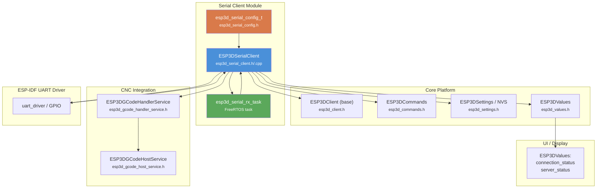

---

## File Reference

| File | Role |
|---|---|
| `main/modules/serial/esp3d_serial_config.h` | Configuration struct `esp3d_serial_config_t` |
| `main/modules/serial/esp3d_serial_client.h` | Class declaration `ESP3DSerialClient` |
| `main/modules/serial/esp3d_serial_client.cpp` | Implementation + FreeRTOS task |

---

## Core Components

### `esp3d_serial_config_t`

Defined in `esp3d_serial_config.h`. Groups all UART driver parameters into a single struct so the client can be (re-)configured without scattering constants through the code.

```c
typedef struct {
    uart_port_t   port;             // UART_NUM_0 / UART_NUM_1 / UART_NUM_2
    gpio_num_t    rx_pin;           // Physical RX GPIO
    gpio_num_t    tx_pin;           // Physical TX GPIO
    gpio_num_t    rts_pin;          // RTS GPIO (GPIO_NUM_NC if unused)
    gpio_num_t    cts_pin;          // CTS GPIO (GPIO_NUM_NC if unused)
    bool          swap_rx_tx;       // Runtime pin-swap flag
    uart_config_t uart_config;      // ESP-IDF standard UART config (baud, bits, parity…)
    size_t        rx_buffer_size;   // Driver RX ring-buffer (bytes)
    size_t        tx_buffer_size;   // Driver TX ring-buffer (bytes)
    uint16_t      rx_flush_timeout; // ms — flush partial line if no new byte arrives
    uint32_t      task_priority;    // FreeRTOS priority for the RX task
    uint32_t      task_stack_size;  // RX task stack in bytes
    BaseType_t    task_core;        // Core affinity (0 or 1)
} esp3d_serial_config_t;
```

The single global instance `esp3dSerialConfig` is populated at compile time from board-specific macros (`UART_PORT_IDX`, `UART_RX_PIN`, `UART_TX_PIN`, etc.) defined via `serial_def.h` → `board_config.h`. `loadSettings()` then overrides `baud_rate` and `swap_rx_tx` at runtime from NVS.

---

### `ESP3DSerialClient`

Declared in `esp3d_serial_client.h`, inherits from `ESP3DClient` (see [`esp3d_core.md`](esp3d_core.md)).

#### Class Diagram

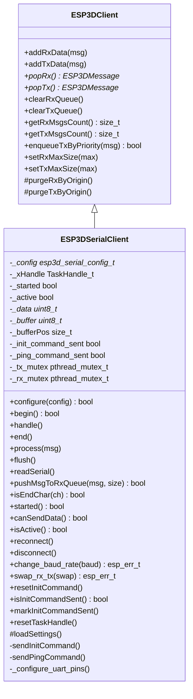

#### Key Member Roles

| Member | Type | Purpose |
|---|---|---|
| `_started` | `bool` | UART driver installed and RX task running |
| `_active` | `bool` | Processing enabled. `false` after `disconnect()`, `true` after `reconnect()` |
| `_init_command_sent` | `bool` | Init handshake sent to CNC; reset on timeout/reconnect/disconnect |
| `_ping_command_sent` | `bool` | Ping dispatched (informational; guards ping tracking) |
| `_data` | `uint8_t*` | Raw read buffer — direct output of `uart_read_bytes()` |
| `_buffer` | `uint8_t*` | Line assembly buffer — accumulates bytes until `\n`/`\r` or buffer full |
| `_bufferPos` | `size_t` | Current write position in `_buffer` |
| `_config` | ptr | Pointer to active config struct (points to `esp3dSerialConfig`) |
| `_xHandle` | `TaskHandle_t` | Handle of `esp3d_serial_rx_task`; cleared by the task before self-delete |

---

## Lifecycle Management

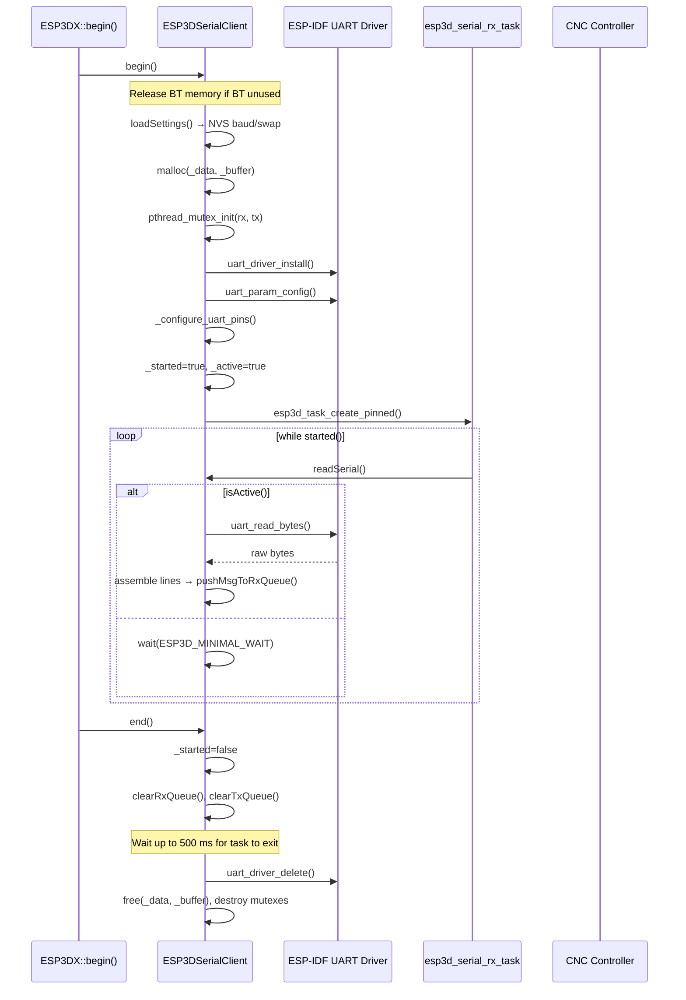

### `begin()`

1. **BT memory release** — if neither `ESP3D_BT_SERIAL_FEATURE` nor `ESP3D_BT_BLE_FEATURE` is selected, releases BT controller memory (recovers ~70 KB DRAM).
2. **Queue sizing** — RX max 4 KB (2 KB for non-CNC outputs), TX max 4 KB (to buffer a full `[ESP0]` help output in one pass at 115 200 baud).
3. **`loadSettings()`** — reads `esp3d_baud_rate` and `esp3d_swap_rx_tx` from NVS; falls back to defaults on invalid values.
4. **Buffer allocation** — two `malloc()` blocks of `rx_buffer_size` bytes each; aborts on failure, logging free heap and largest free block.
5. **Mutex init** — separate `pthread_mutex_t` for RX queue and TX queue.
6. **UART driver install** — `uart_driver_install()` with doubled ring-buffer for headroom.
7. **Pin config** — `_configure_uart_pins()` handles optional swap.
8. **Task creation** — `esp3d_task_create_pinned()` on the configured core.
9. **Initial status** — sets `connection_status = "T"` (connecting) via `ESP3DValues` if serial is the output client.

### `end()`

Gracefully shuts down in reverse order: signals the task by clearing `_started`, waits up to 500 ms for the task to self-delete (the task calls `resetTaskHandle()` before `vTaskDelete(NULL)`), force-deletes if it stalls, destroys mutexes (nulling the base-class pointer to prevent stale-mutex UB on re-entry), uninstalls the UART driver, then frees buffers.

### `disconnect()` / `reconnect()`

| Action | `disconnect()` | `reconnect()` |
|---|---|---|
| `_active` | `false` | `true` |
| `_init_command_sent` | `true` (suppress re-init) | `false` (allow re-init) |
| UART RX ring-buffer | flushed | flushed |
| Client RX queue | cleared | cleared |
| Client TX queue | **cleared** | not cleared |
| `connection_status` | `"?"` | `"T"` (connecting) |
| Immediate ping | — | yes (via `sendPingCommand()`) |

`disconnect()` clears the TX queue to prevent stale stream/script traffic from timing out on an unattended target. `reconnect()` is called from the UI retry button — it flushes stale RX data then sends a ping immediately so the CNC responds without waiting up to 10 s for the periodic ping timer.

---

## Connection State Machine

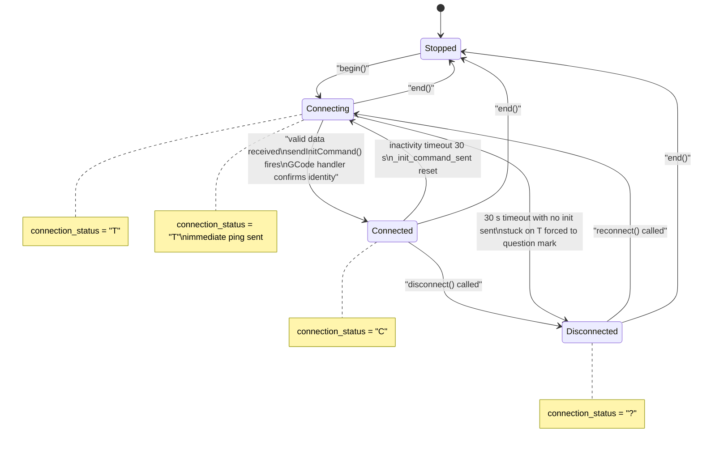

**Status codes** used in `ESP3DValuesIndex::connection_status`:

| Code | Meaning |
|---|---|
| `"T"` | Connecting / trying |
| `"C"` | Connected and identified |
| `"?"` | Disconnected / unknown |
| `"U"` | Uninitialised (before `begin()`) |

---

## Data Flow

### RX Path (CNC → Pendant)

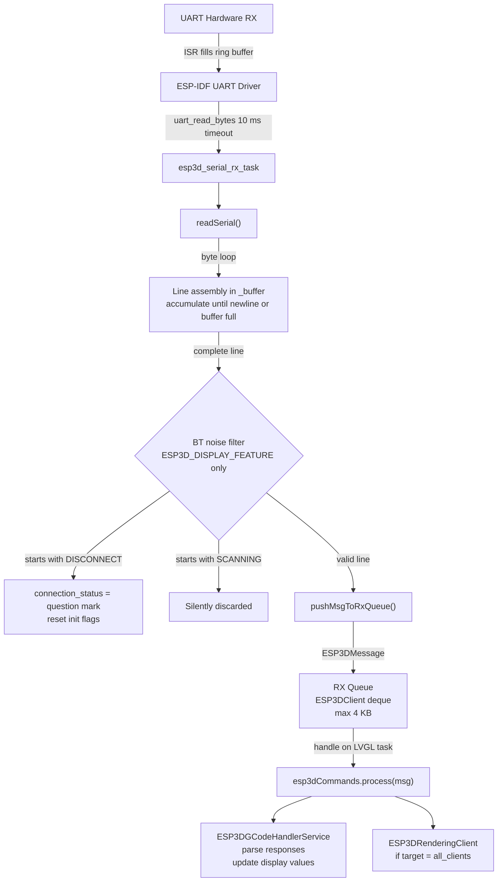

### TX Path (Pendant → CNC)

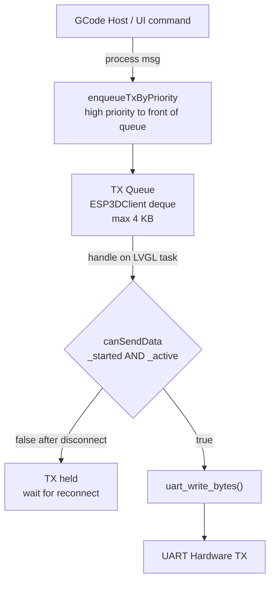

**Key design points:**
- The RX task calls `readSerial()` which blocks for up to 10 ms inside `uart_read_bytes()`. No extra `vTaskDelay` is added to minimise ACK latency during GCode streaming.
- The TX drain runs in `handle()` on the LVGL task (Core 1), gated by `canSendData()`. This prevents TX from draining while `_active == false`.
- The RX drain in `handle()` is intentionally **not** gated by `_active` so incoming firmware responses are still processed during a disconnect event.
- When the RX queue is full, `pushMsgToRxQueue()` evicts old messages by processing them immediately (`esp3dCommands.process()`) to make room, rather than silently dropping the incoming message.

---

## Ping & Inactivity Timeout

This mechanism is compiled only when `ESP3D_DISPLAY_FEATURE` is enabled and only runs when serial (or `uart_ext`) is the active output client.

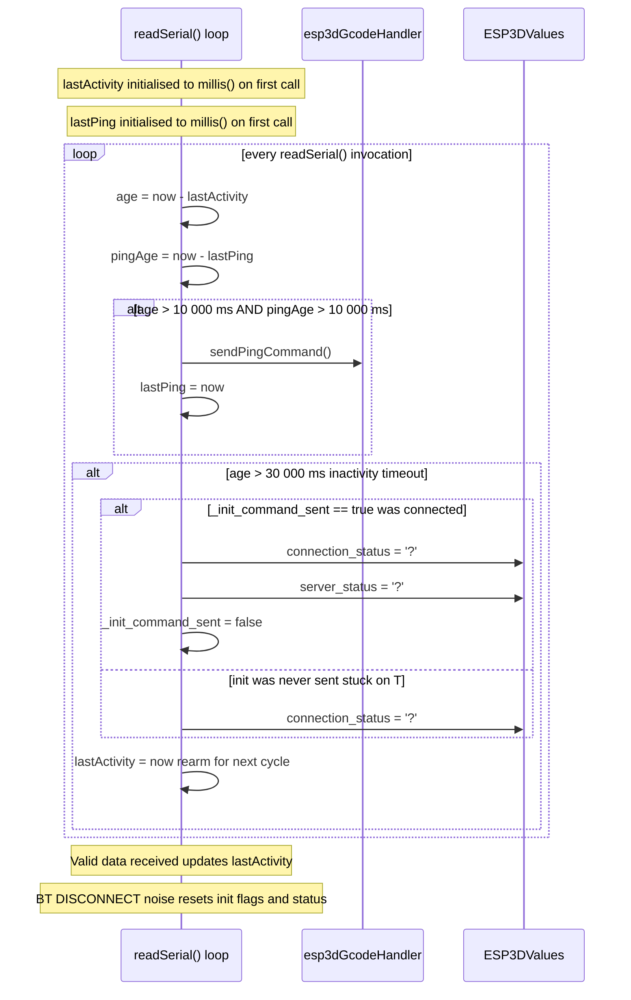

**Constants:**

| Constant | Value | Purpose |
|---|---|---|
| `ESP3D_PING_INTERVAL` | 10 000 ms | Period between automatic pings when idle |
| `ESP3D_INACTIVITY_TIMEOUT` | 30 000 ms | Declare disconnection after this many ms with no valid data |

BT module `SCANNING` lines do not update `lastActivity`, so the ping/timeout cycle operates correctly even when a Bluetooth bridge module is attached and producing periodic output.

---

## Initialization Handshake

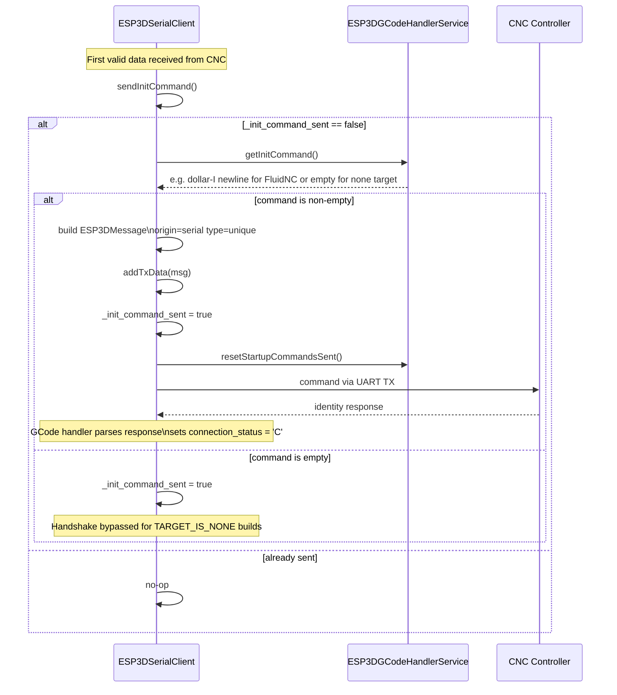

---

## Runtime Configuration

### Baud Rate Change (`change_baud_rate`)

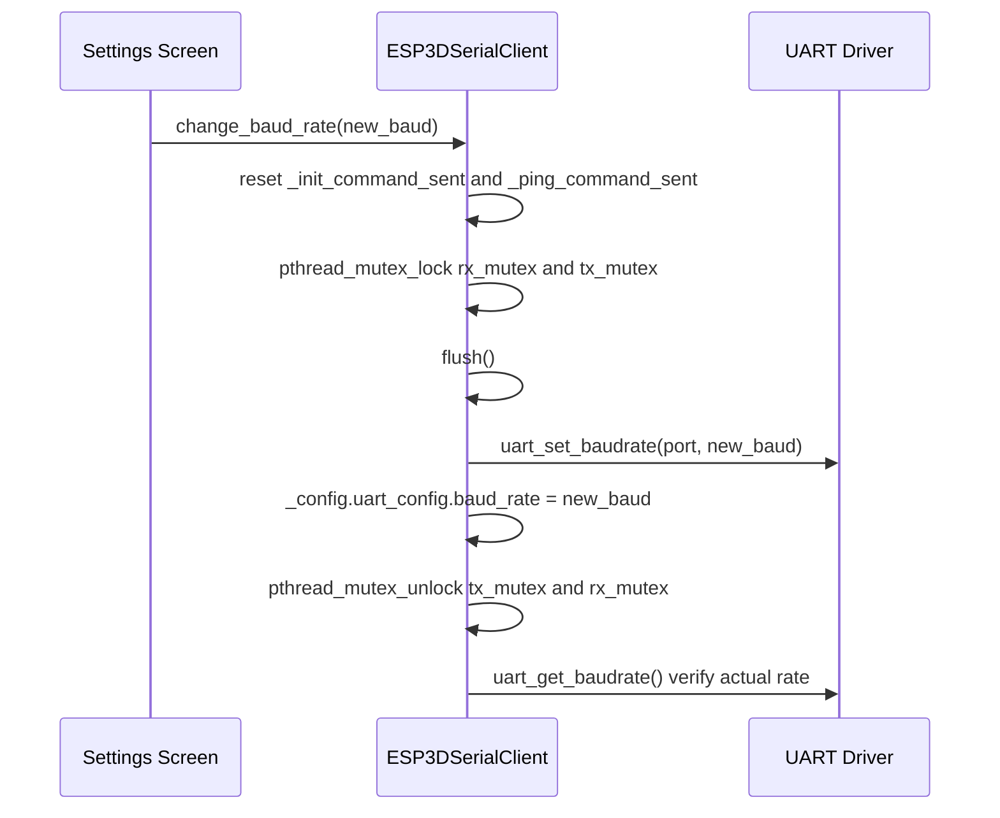

Resetting `_init_command_sent` ensures the handshake is replayed at the new baud rate once the CNC responds.

### RX/TX Pin Swap (`swap_rx_tx`)

Some cable configurations have RX and TX physically crossed. `swap_rx_tx(bool)` re-routes the GPIO signal assignments via `esp_rom_gpio_connect_out/in_signal()` without reinstalling the UART driver. The setting is persisted to NVS by the Settings screen.

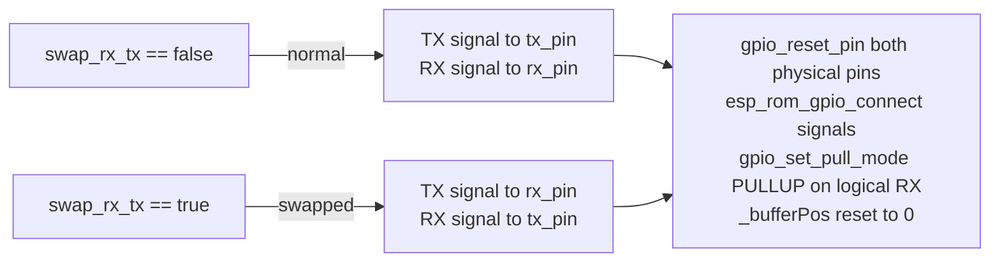

`_configure_uart_pins()` is called by both `begin()` and `swap_rx_tx()` so pin setup is always consistent.

---

## Memory Layout

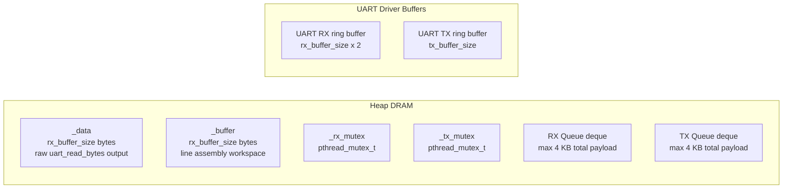

**Allocation rules (per ESP32 memory constraints):**
- Both `_data` and `_buffer` are `malloc()`'d in `begin()`. If either fails, `begin()` logs total free heap and largest free block, then returns `false`.
- Buffers are `free()`'d in `end()` before the function returns.
- `rx_buffer_size` comes from `UART_RX_BUFFER_SIZE * 2` (board config); the UART driver ring-buffer is doubled again (`rx_buffer_size * 2`) for driver headroom.
- TX queue max is 4 KB so the full `[ESP0]` help output (~2700 bytes) fits in one pass. At 115 200 baud the UART drains ~115 bytes per 10 ms tick; a 1 KB limit causes livelock where each drain cycle frees less than the next entry adds.
- See [`esp32_memory_constraints.md`](https://github.com/luc-github/Pibot-cnc-pendant-firmware/blob/main/docs/guides/esp32_memory_constraints.md) for heap, fragmentation, and WiFi-vs-BT RAM trade-offs that affect sizing decisions.

---

## Build-Time Feature Flags

| Flag | Effect on this module |
|---|---|
| `ESP3D_DISPLAY_FEATURE` | Enables BT-noise filtering, ping/timeout loop, and `connection_status` / `server_status` updates via `ESP3DValues` |
| `ESP3D_BT_SERIAL_FEATURE` / `ESP3D_BT_BLE_FEATURE` | When both absent, `begin()` calls `esp_bt_controller_mem_release(ESP_BT_MODE_BTDM)` to recover BT RAM |
| `ESP3D_UART_EXT_FEATURE` | RX message `origin` / `target` set to `uart_ext` when that client is the active output client |
| `ESP3D_DISABLE_SERIAL_AUTHENTICATION_FEATURE` | Forces `authentication_level = admin` on all incoming RX messages |
| `TARGET_IS_NONE` | Skips `swap_rx_tx` NVS read; `getInitCommand()` returns `""` (handshake bypassed) |
| `CONFIG_UART_ISR_IN_IRAM` | Sets `ESP_INTR_FLAG_IRAM` for the UART driver ISR to avoid cache-miss stalls during flash operations |

---

## Integration with Other Modules

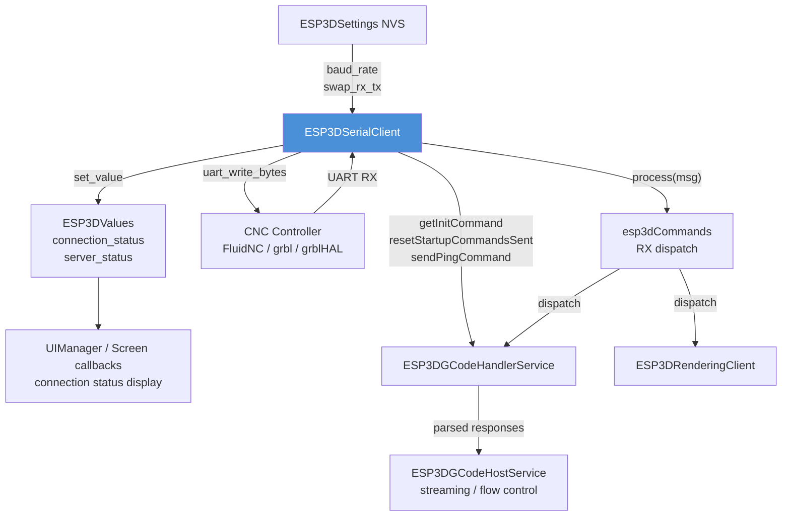

| Collaborator | Interaction |
|---|---|
| [`esp3d_core.md`](esp3d_core.md) — `ESP3DClient` | Base class — dual-deque message queues, message factory (`newMsg`, `setDataContent`, `deleteMsg`), mutex helpers, priority enqueue |
| [`esp3d_commands.md`](esp3d_commands.md) — `ESP3DCommands` | `process(msg)` called for each dequeued RX message; `getOutputClient()` checked to decide routing and noise filtering |
| [`gcode_host.md`](gcode_host.md) — `ESP3DGCodeHandlerService` | `getInitCommand()`, `sendPingCommand()`, `resetStartupCommandsSent()` — target-firmware-specific hooks |
| [`values.md`](values.md) — `ESP3DValues` | `set_value(connection_status / server_status)` for UI feedback; thread-safe `get_value()` overload used from the RX task |
| `ESP3DSettings` | `readUint32(esp3d_baud_rate)`, `readByte(esp3d_swap_rx_tx)` from NVS on `loadSettings()` |
| `ESP3DRenderingClient` | Receives CNC responses when serial is the output client (message target = `all_clients`) |
| [`bluetooth_serial`](bluetooth_serial.md) | Sibling transport module — same `ESP3DClient` base and connection-status model |
| [`socket_client.md`](socket_client.md) | Sibling transport module — same `ESP3DClient` base and connection-status model |
| [`usb_serial.md`](usb_serial.md) | Sibling transport module — same `ESP3DClient` base and connection-status model |
| [`gcode_host.md`](gcode_host.md) | Streaming flow-control details, in-flight cap mechanism, and startup command sequence |
| [`CNC_Firmware_Integration.md`](CNC_Firmware_Integration.md) | Overall CNC firmware integration overview |
| [`Communication_Transports.md`](Communication_Transports.md) | Parent module — all four transport modules in context |

---

## Global Instance

```cpp
// esp3d_serial_client.cpp — definition
ESP3DSerialClient serialClient;

// esp3d_serial_client.h — declaration for other translation units
extern ESP3DSerialClient serialClient;
```

`serialClient` is a file-scope singleton. Other modules (GCode host, commands dispatcher, UI settings screen) reference it via the `extern` declaration. The board configuration singleton `esp3dSerialConfig` is defined in the same `.cpp` file and handed to the client via `configure(&esp3dSerialConfig)` inside `loadSettings()`.
