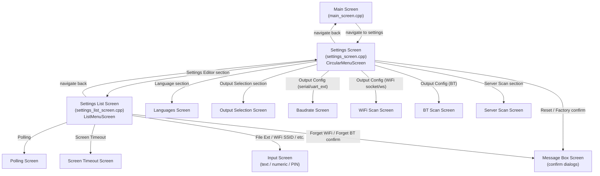
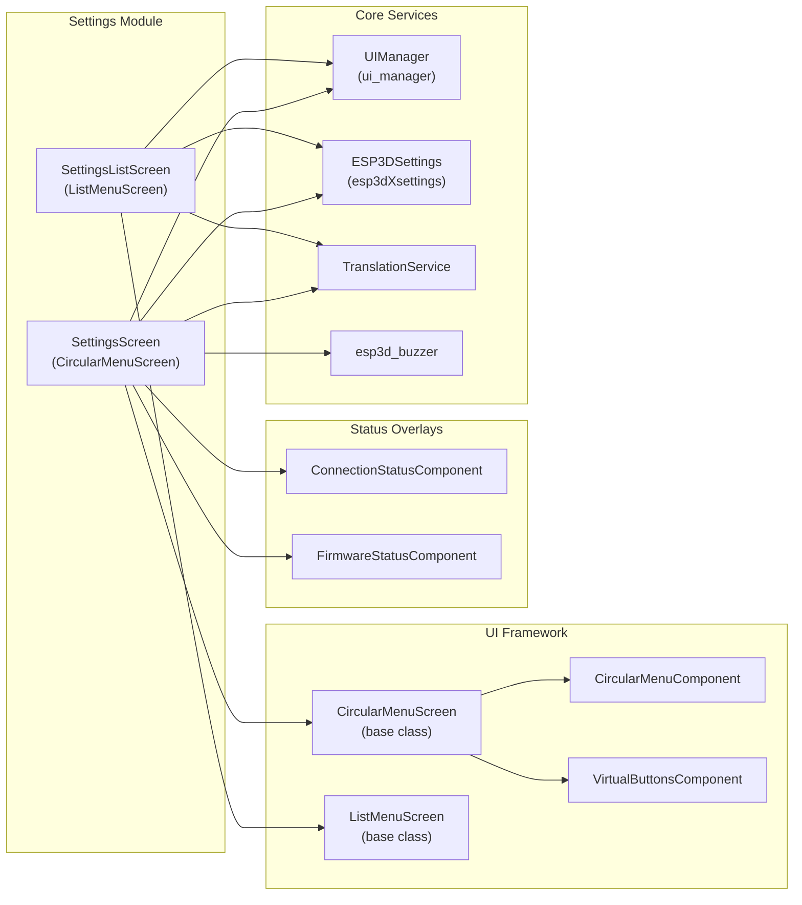
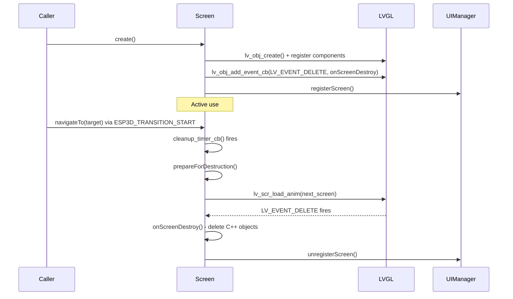
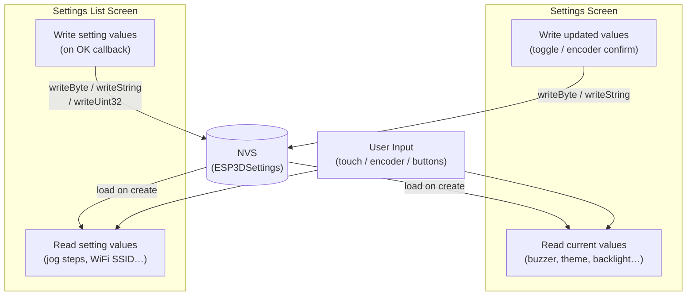

# Settings Module

## Introduction

The Settings module provides the complete user-facing configuration interface for the Pibot CNC pendant. It is composed of two complementary screens — a radial **Settings Screen** and a scrollable **Settings List Screen** — that together expose every configurable parameter, from UI appearance to CNC transport details and jog motion tuning.

Both screens run exclusively on LVGL Core 1 and follow the pendant's standard screen lifecycle: `create()` → active use → `prepareForDestruction()` → LVGL `LV_EVENT_DELETE` auto-cleanup. All changes are persisted to NVS via `ESP3DSettings` (`esp3dXsettings`) and take effect immediately or after the next restart, as documented per setting.

---

## Architecture Overview

---

## Component Relationships

---

## Screen Lifecycle

Both screens implement the same safe three-phase lifecycle pattern used throughout the UI framework:

---

## Sub-modules

| Sub-module | File | Base Class | Purpose |
|---|---|---|---|
| [Settings Screen](settings_settings_screen.md) | `settings_screen.cpp` | `CircularMenuScreen` | Radial menu hub — UI preferences, theme, output routing |
| [Settings List Screen](settings_settings_list_screen.md) | `settings_list_screen.cpp` | `ListMenuScreen` | Scrollable list editor — jog tuning, network credentials, feature toggles |

---

## Settings Screen — High-Level Summary

The **Settings Screen** (`settingsScreen` namespace) is the primary entry point from the Main Screen. It presents a `CircularMenuScreen` (radial icon menu) whose sections are conditionally compiled based on build features.

### Menu Sections (compile-time conditional)

| Section | Feature Guard | Action |
|---|---|---|
| Lock UI | — | Toggles pendant lock button visibility |
| Sound | `ESP3D_BUZZER_FEATURE` | Toggles buzzer on/off |
| Rotation | `ESP3D_DYNAMIC_ROTATION_FEATURE` | Encoder adjusts screen orientation (0°/90°/180°/270°) |
| Backlight | `ESP3D_BRIGHTNESS_CONTROL_FEATURE` | Encoder adjusts brightness 0–100% |
| Language | — | Navigates to Languages Screen |
| Theme | — | Encoder cycles through available UI themes (live preview) |
| Reset Settings | — | Confirmation → `esp3dXsettings.reset()` → restart |
| Factory Reboot | `ESP3D_FACTORY_FEATURE` | Confirmation → boot factory partition → restart |
| Settings Editor | — | Navigates to Settings List Screen |
| Output Selection | BT/WiFi/UART Ext builds | Navigates to Output Selection Screen |
| Output Configuration | — | Context-sensitive: baud rate / WiFi scan / BT scan |
| Server Scan | `ESP3D_IP_CNC_CLIENT_FEATURE` | Navigates to Server Scan Screen |

### Encoder Modes

The circular menu supports three special encoder sub-modes beyond normal section navigation:

- `ESP3D_ENCODER_THEME` — cycles themes; live-previews colors before confirming
- `ESP3D_ENCODER_ROTATION` — rotates `pending_orientation_` ±90° steps; confirmed or cancelled on Back/OK
- `ESP3D_ENCODER_BACKLIGHT` — adjusts brightness in 5% increments; saved to NVS on confirm

See [Settings Screen](settings_settings_screen.md) for full details.

---

## Settings List Screen — High-Level Summary

The **Settings List Screen** (`settingsListScreen` namespace) is a scrollable `ListMenuScreen` reached from the Settings Editor section. It exposes two categories of settings:

### Navigation Settings (open a sub-screen or dialog)

- Polling interval, Screen timeout, File extensions
- Network credentials: WiFi SSID / Password / Forget, BT PIN / BLE passkey / Forget BT Host
- IP/WebSocket transport: Server address, Server port, WebSocket path
- Per-axis Jog steps and Jog feedrates (X/Y/Z/A/B/C)

### Toggle Settings (checked on/off in place)

- Macros enabled, Probe enabled, Tool Change enabled
- Bypass Safety Focus, MPG Mode (grblHAL only), Swap RX/TX

The list preserves scroll position across navigations via `last_selected_index`. Axis names respect the grblHAL `$376` UVW naming observable (`axis_names`).

See [Settings List Screen](settings_settings_list_screen.md) for full details.

---

## Data Flow

---

## Integration Points

| System | Used By | How |
|---|---|---|
| `ESP3DSettings` (`esp3dXsettings`) | Both screens | Read/write all persistent configuration values |
| `UIManager` (`ui_manager`) | Both screens | Theme, orientation, screen registration, overlay anchoring |
| `ESP3DTranslationService` | Both screens | All labels translated at render time |
| `esp3d_buzzer` | Settings Screen | Buzzer toggle + auditory feedback |
| `ESP3DCommands` | Settings List Screen | Detect active transport type for conditional items |
| `ConnectionStatusComponent` | Settings Screen | Live transport status overlay |
| `FirmwareStatusComponent` | Settings Screen | Live CNC firmware status overlay |
| `messageBoxScreen` | Both screens | Confirmation dialogs (reset, factory, forget WiFi/BT) |
| `inputScreen` | Settings List Screen | Text/numeric/PIN editors for credentials and jog values |
| `macroManager` | Settings List Screen | Load/clear macro list when macro toggle changes |

---

## Related Documentation

- [UI Framework Core](ui_core.md) — base screen classes (`CircularMenuScreen`, `ListMenuScreen`)
- [UI Components](ui_components.md) — `CircularMenuComponent`, `VirtualButtonsComponent`, `ListMenuComponent`
- [Common Screens](common_screens.md) — `inputScreen`, `messageBoxScreen`, `languagesScreen`, `baudrateScreen`
- [CNC Shared Screens](cnc_shared.md) — sibling screens: main, jog, status, macros, firmware status
- [Core Platform](esp3d_core.md) — `ESP3DSettings`, `ESP3DValues`, `UIManager`
- [docs/architecture/screens_architecture.md](https://github.com/luc-github/Pibot-cnc-pendant-firmware/blob/main/docs/architecture/screens_architecture.md) — screen system architecture
- [docs/architecture/screen_transitions_flow.md](https://github.com/luc-github/Pibot-cnc-pendant-firmware/blob/main/docs/architecture/screen_transitions_flow.md) — transition safety patterns
