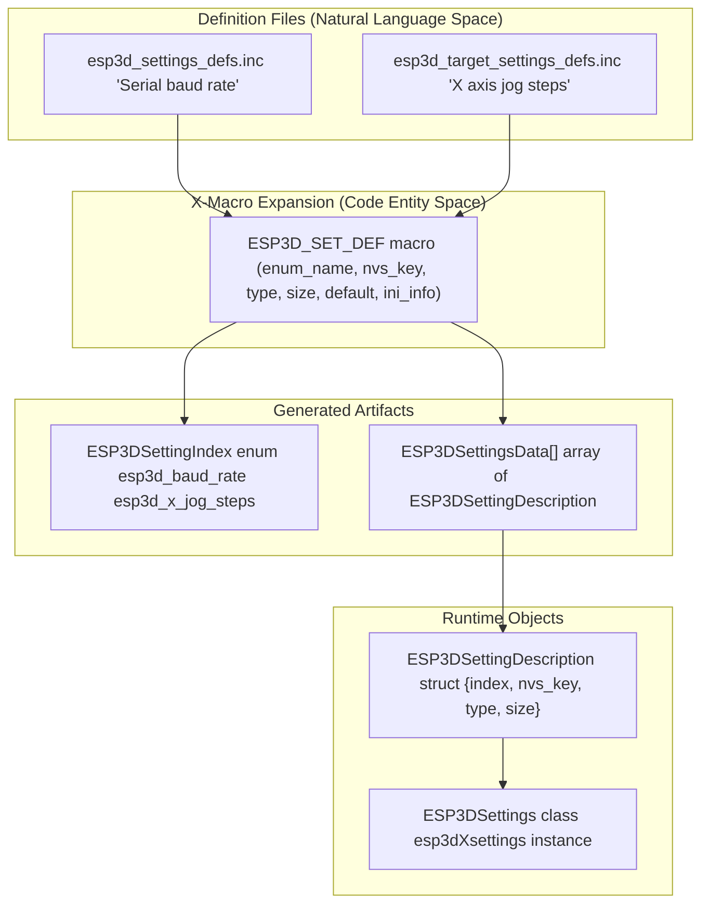
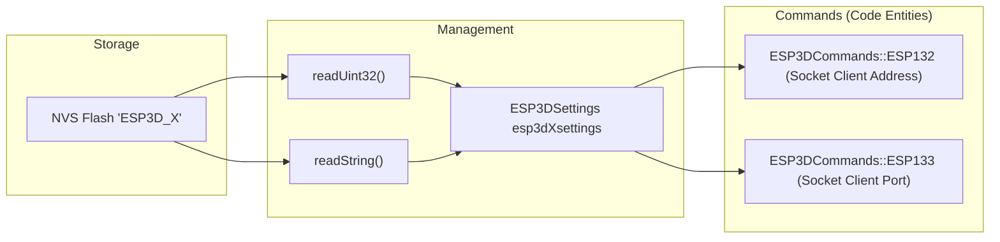

# Settings Reference
Relevant source files

- [main/core/commands/esp132.cpp](https://github.com/luc-github/Pibot-cnc-pendant-firmware/blob/cbc90b5e/main/core/commands/esp132.cpp)
- [main/core/commands/esp133.cpp](https://github.com/luc-github/Pibot-cnc-pendant-firmware/blob/cbc90b5e/main/core/commands/esp133.cpp)
- [main/core/includes/esp3d_settings_defs.inc](https://github.com/luc-github/Pibot-cnc-pendant-firmware/blob/cbc90b5e/main/core/includes/esp3d_settings_defs.inc)
- [main/target/cnc/fluidnc/esp3d_target_settings_defs.inc](https://github.com/luc-github/Pibot-cnc-pendant-firmware/blob/cbc90b5e/main/target/cnc/fluidnc/esp3d_target_settings_defs.inc)
- [main/target/cnc/grblhal/esp3d_data_type.h](https://github.com/luc-github/Pibot-cnc-pendant-firmware/blob/cbc90b5e/main/target/cnc/grblhal/esp3d_data_type.h)
- [main/target/cnc/grblhal/esp3d_target.h](https://github.com/luc-github/Pibot-cnc-pendant-firmware/blob/cbc90b5e/main/target/cnc/grblhal/esp3d_target.h)
- [main/target/cnc/grblhal/esp3d_target_settings_defs.inc](https://github.com/luc-github/Pibot-cnc-pendant-firmware/blob/cbc90b5e/main/target/cnc/grblhal/esp3d_target_settings_defs.inc)

This page provides a complete reference of all configurable settings in the PiBot CNC Pendant firmware. Each setting is identified by an `ESP3DSettingIndex` enumeration value, stored in NVS flash with a unique key (max 15 characters), and has associated metadata including type, size, default value, and optional INI file mapping.

For information about the settings architecture and X-macro pattern used to generate this data, see [4.1 Settings Architecture](https://github.com/luc-github/Pibot-cnc-pendant-firmware/blob/cbc90b5e/4.1 Settings Architecture) For validation methods and default value handling, see [4.2 Validation System](https://github.com/luc-github/Pibot-cnc-pendant-firmware/blob/cbc90b5e/4.2 Validation System) For exporting settings via the ESP400 command, see [4.4 ESP400 Command](https://github.com/luc-github/Pibot-cnc-pendant-firmware/blob/cbc90b5e/4.4 ESP400 Command)

---

## Setting Definition Structure

All settings are defined using an X-macro pattern in the following files:

- [main/core/includes/esp3d_settings_defs.inc#47-240](https://github.com/luc-github/Pibot-cnc-pendant-firmware/blob/cbc90b5e/main/core/includes/esp3d_settings_defs.inc#L47-L240) - Core system, network, and UI settings.
- [main/target/cnc/fluidnc/esp3d_target_settings_defs.inc#25-275](https://github.com/luc-github/Pibot-cnc-pendant-firmware/blob/cbc90b5e/main/target/cnc/fluidnc/esp3d_target_settings_defs.inc#L25-L275) - FluidNC target-specific settings.
- [main/target/cnc/grblhal/esp3d_target_settings_defs.inc#25-250](https://github.com/luc-github/Pibot-cnc-pendant-firmware/blob/cbc90b5e/main/target/cnc/grblhal/esp3d_target_settings_defs.inc#L25-L250) - grblHAL target-specific settings.

Each setting definition expands to multiple code artifacts:

### Definition to Code Mapping

The following diagram bridges the natural language setting definitions to their respective code entities.

Sources:[main/core/includes/esp3d_settings_defs.inc#1-26](https://github.com/luc-github/Pibot-cnc-pendant-firmware/blob/cbc90b5e/main/core/includes/esp3d_settings_defs.inc#L1-L26)[main/target/cnc/fluidnc/esp3d_target_settings_defs.inc#1-18](https://github.com/luc-github/Pibot-cnc-pendant-firmware/blob/cbc90b5e/main/target/cnc/fluidnc/esp3d_target_settings_defs.inc#L1-L18)[main/target/cnc/grblhal/esp3d_target_settings_defs.inc#1-18](https://github.com/luc-github/Pibot-cnc-pendant-firmware/blob/cbc90b5e/main/target/cnc/grblhal/esp3d_target_settings_defs.inc#L1-L18)

---

## Setting Types

Settings are strongly typed using the `ESP3DSettingType` enumeration:

| Type | C Type | Storage | Description |
| --- | --- | --- | --- |
| `byte_t` | `uint8_t` | 1 byte | Boolean flags, enumerations 0-255 |
| `integer_t` | `uint32_t` | 4 bytes | Port numbers, timeouts, baud rates |
| `string_t` | `const char*` | Variable | Hostnames, SSIDs, passwords, scripts |
| `ip_t` | `uint32_t` | 4 bytes | IPv4 addresses (stored as packed integer) |
| `float_t` | `const char*` | Max 15 chars | Floating point values stored as strings |

Sources:[main/core/includes/esp3d_settings_defs.inc#49-149](https://github.com/luc-github/Pibot-cnc-pendant-firmware/blob/cbc90b5e/main/core/includes/esp3d_settings_defs.inc#L49-L149)

---

## NVS Storage Details

Settings are stored in NVS flash with specific prefix rules to ensure uniqueness within the 15-character key limit.

| Prefix | Category | Example Key |
| --- | --- | --- |
| `sys_` | System / Version | `sys_baud` |
| `net_` | Network / Hostname | `net_hostname` |
| `sta_` | WiFi Station | `sta_ssid` |
| `ap_` | WiFi Access Point | `ap_ssid` |
| `ui_` | User Interface | `ui_lang` |
| `scr_` | Screen / Display | `scr_bright` |
| `tgt_` | Target Specific | `tgt_mpg` |
| `jog_` | Jogging Config | `jog_x_steps` |

Sources:[main/core/includes/esp3d_settings_defs.inc#12-15](https://github.com/luc-github/Pibot-cnc-pendant-firmware/blob/cbc90b5e/main/core/includes/esp3d_settings_defs.inc#L12-L15)[main/target/cnc/fluidnc/esp3d_target_settings_defs.inc#12-15](https://github.com/luc-github/Pibot-cnc-pendant-firmware/blob/cbc90b5e/main/target/cnc/fluidnc/esp3d_target_settings_defs.inc#L12-L15)

---

## Core Settings Reference

### System Settings

Settings controlling core system behavior and serial communication.

| Setting | NVS Key | Type | Size | Default | INI Section/Key | Description |
| --- | --- | --- | --- | --- | --- | --- |
| `esp3d_version` | `sys_version` | string_t | 25 | `"Invalid data"` | NO_INI | Internal version tracking |
| `esp3d_baud_rate` | `sys_baud` | integer_t | 4 | `UART_BAUD_RATE_STR` | system/Baud_rate | UART serial baud rate |
| `esp3d_spi_divider` | `sys_spi_div` | byte_t | 1 | `1` | NO_INI | SPI divider for SD card |
| `esp3d_radio_boot_mode` | `net_radio_boot` | byte_t | 1 | `1` | services/Radio_enabled | Radio enabled at boot (0=off, 1=on) |

Sources:[main/core/includes/esp3d_settings_defs.inc#47-76](https://github.com/luc-github/Pibot-cnc-pendant-firmware/blob/cbc90b5e/main/core/includes/esp3d_settings_defs.inc#L47-L76)

---

### Network and WiFi Settings

Configuration for connectivity and wireless services.

| Setting | NVS Key | Type | Size | Default | Description |
| --- | --- | --- | --- | --- | --- |
| `esp3d_radio_mode` | `net_radio_mode` | byte_t | 1 | `3` (WiFi) / `4` (BT) | 0=OFF, 1=STA, 2=AP, 3=Setup, 4=BT, 5=BLE |
| `esp3d_fallback_mode` | `sta_fallback` | byte_t | 1 | `3` | Fallback if STA connection fails |
| `esp3d_hostname` | `net_hostname` | string_t | 32 | `ESP3D_HOSTNAME` | Device network name |
| `esp3d_sta_ssid` | `sta_ssid` | string_t | 32 | `""` | WiFi Station SSID |
| `esp3d_sta_ip_mode` | `sta_ip_mode` | byte_t | 1 | `0` | 0=DHCP, 1=Static |
| `esp3d_ap_ssid` | `ap_ssid` | string_t | 32 | `"esp3dx"` | WiFi Access Point SSID |
| `esp3d_http_port` | `http_port` | integer_t | 4 | `80` | Web Server port |

Sources:[main/core/includes/esp3d_settings_defs.inc#79-240](https://github.com/luc-github/Pibot-cnc-pendant-firmware/blob/cbc90b5e/main/core/includes/esp3d_settings_defs.inc#L79-L240)

---

### UI and Display Settings

Settings for the LVGL-based touchscreen interface and power management.

| Setting | NVS Key | Type | Size | Default | Description |
| --- | --- | --- | --- | --- | --- |
| `esp3d_ui_language` | `ui_lang` | string_t | 16 | `"en"` | Language code for UI |
| `esp3d_ui_theme` | `ui_theme` | byte_t | 1 | `0` | UI Theme (0=Light, 1=Dark) |
| `esp3d_screen_brightness` | `scr_bright` | byte_t | 1 | `255` | Active backlight level (0-255) |
| `esp3d_screen_dim_brightness` | `scr_dim_bright` | byte_t | 1 | `50` | Dimmed backlight level |
| `esp3d_screen_timeout` | `scr_timeout` | integer_t | 4 | `60` | Seconds before dimming |
| `esp3d_screen_off_timeout` | `scr_off_timeout` | integer_t | 4 | `300` | Seconds before sleep |

Sources:[main/core/includes/esp3d_settings_defs.inc#630-675](https://github.com/luc-github/Pibot-cnc-pendant-firmware/blob/cbc90b5e/main/core/includes/esp3d_settings_defs.inc#L630-L675)

---

## Target-Specific Settings (FluidNC / grblHAL)

These settings are defined in target-specific `.inc` files and manage the CNC pendant behavior.

### Jog Configuration (Steps and Feedrates)

Jogging values are stored as semicolon-separated strings to allow dynamic population of UI selection menus.

| Setting | NVS Key | Type | Size | Default | Axis |
| --- | --- | --- | --- | --- | --- |
| `esp3d_x_jog_steps` | `jog_x_steps` | string_t | 128 | `"0.01;0.1;1;10;50;100"` | X |
| `esp3d_z_jog_steps` | `jog_z_steps` | string_t | 128 | `"0.01;0.1;1;10;50"` | Z |
| `esp3d_x_jog_feedrates` | `jog_x_feed` | string_t | 128 | `"100;500;1000;2000;5000"` | X |
| `esp3d_a_jog_feedrates` | `jog_a_feed` | string_t | 128 | `"60;180;360;720;1440"` | A |

Sources:[main/target/cnc/fluidnc/esp3d_target_settings_defs.inc#75-172](https://github.com/luc-github/Pibot-cnc-pendant-firmware/blob/cbc90b5e/main/target/cnc/fluidnc/esp3d_target_settings_defs.inc#L75-L172)[main/target/cnc/grblhal/esp3d_target_settings_defs.inc#90-187](https://github.com/luc-github/Pibot-cnc-pendant-firmware/blob/cbc90b5e/main/target/cnc/grblhal/esp3d_target_settings_defs.inc#L90-L187)

### UI Feature Flags and Hardware Tweaks

| Setting | NVS Key | Type | Size | Default | Description |
| --- | --- | --- | --- | --- | --- |
| `esp3d_probe_enabled` | `tgt_probe` | byte_t | 1 | `1` | Show Probe screen in UI |
| `esp3d_macros_enabled` | `tgt_macros` | byte_t | 1 | `1` | Show Macros screen in UI |
| `esp3d_change_tool_enabled` | `tgt_tool_chg` | byte_t | 1 | `1` | Show Tool Change screen in UI |
| `esp3d_mpg_enabled` | `tgt_mpg` | byte_t | 1 | `0` | grblHAL MPG token mode (grblHAL only) |
| `esp3d_swap_rx_tx` | `tgt_swap_rxtx` | byte_t | 1 | `0` | Swap UART RX/TX pins |
| `esp3d_bypass_safety_focus` | `tgt_byp_safe` | byte_t | 1 | `0` | Bypass safety focus check |

Sources:[main/target/cnc/grblhal/esp3d_target_settings_defs.inc#25-83](https://github.com/luc-github/Pibot-cnc-pendant-firmware/blob/cbc90b5e/main/target/cnc/grblhal/esp3d_target_settings_defs.inc#L25-L83)[main/target/cnc/fluidnc/esp3d_target_settings_defs.inc#25-68](https://github.com/luc-github/Pibot-cnc-pendant-firmware/blob/cbc90b5e/main/target/cnc/fluidnc/esp3d_target_settings_defs.inc#L25-L68)

---

## Settings Data Flow and Access

The following diagram illustrates the data flow from NVS storage through the `ESP3DSettings` class to specific command processors like `ESP132` (Socket Address) and `ESP133` (Socket Port).

### Command Access Flow

Sources:[main/core/commands/esp132.cpp#29-86](https://github.com/luc-github/Pibot-cnc-pendant-firmware/blob/cbc90b5e/main/core/commands/esp132.cpp#L29-L86)[main/core/commands/esp133.cpp#29-83](https://github.com/luc-github/Pibot-cnc-pendant-firmware/blob/cbc90b5e/main/core/commands/esp133.cpp#L29-L83)

---

## Runtime State Persistence

Some settings are not meant for INI configuration but are persisted to NVS to maintain UI state across reboots. These use the `NO_INI` macro.

- Jog Indices:`esp3d_x_jog_step_idx`, `esp3d_x_jog_feedrate_idx`, etc. [main/target/cnc/fluidnc/esp3d_target_settings_defs.inc#179-275](https://github.com/luc-github/Pibot-cnc-pendant-firmware/blob/cbc90b5e/main/target/cnc/fluidnc/esp3d_target_settings_defs.inc#L179-L275)
- Target Specifics:`esp3d_swap_rx_tx` is used for hardware UART configuration. [main/target/cnc/grblhal/esp3d_target_settings_defs.inc#25-30](https://github.com/luc-github/Pibot-cnc-pendant-firmware/blob/cbc90b5e/main/target/cnc/grblhal/esp3d_target_settings_defs.inc#L25-L30)

Sources:[main/target/cnc/fluidnc/esp3d_target_settings_defs.inc#179-275](https://github.com/luc-github/Pibot-cnc-pendant-firmware/blob/cbc90b5e/main/target/cnc/fluidnc/esp3d_target_settings_defs.inc#L179-L275)[main/target/cnc/grblhal/esp3d_target_settings_defs.inc#194-250](https://github.com/luc-github/Pibot-cnc-pendant-firmware/blob/cbc90b5e/main/target/cnc/grblhal/esp3d_target_settings_defs.inc#L194-L250)