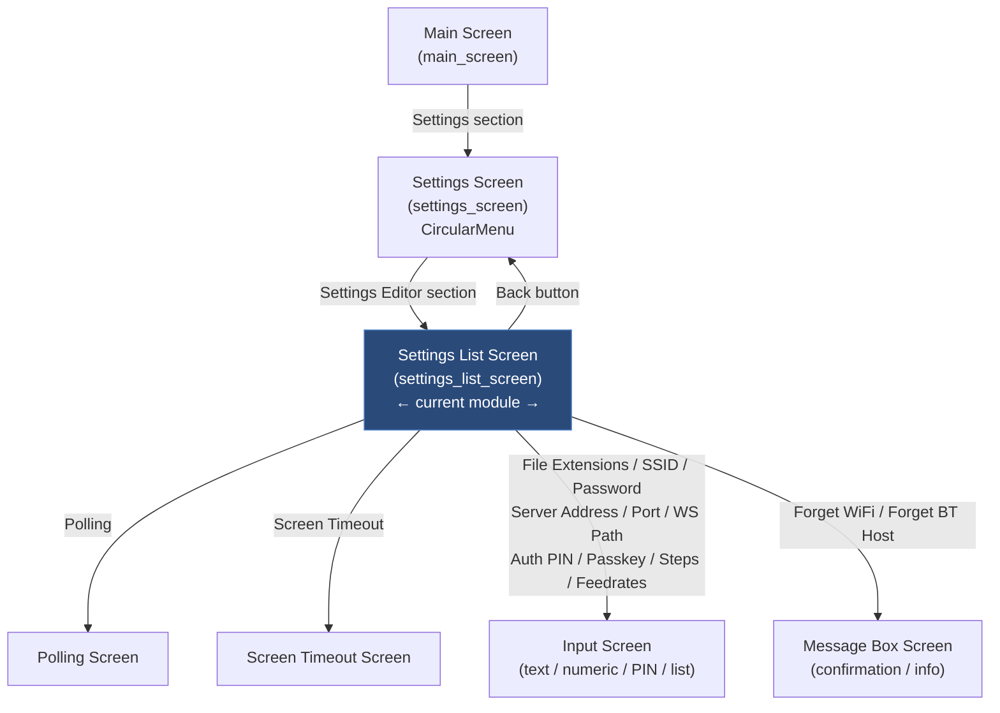
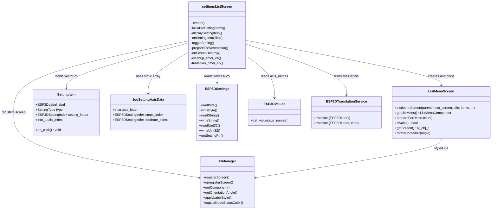
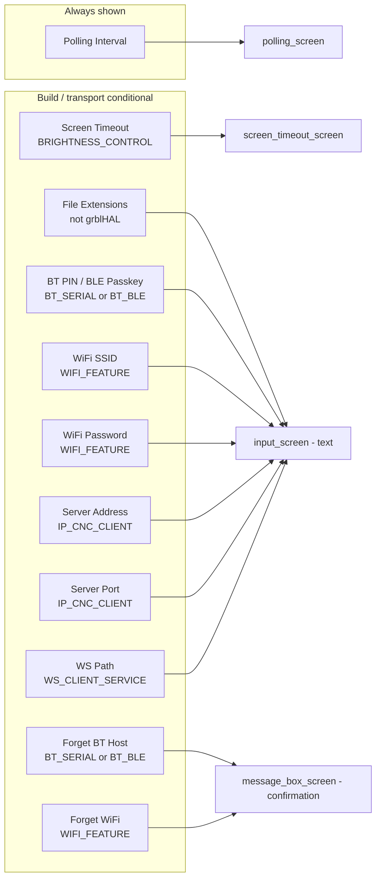
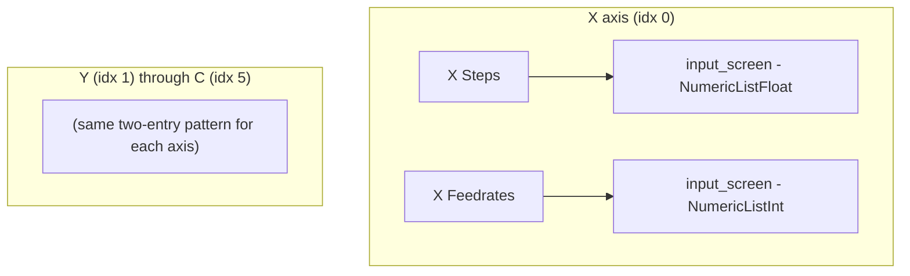
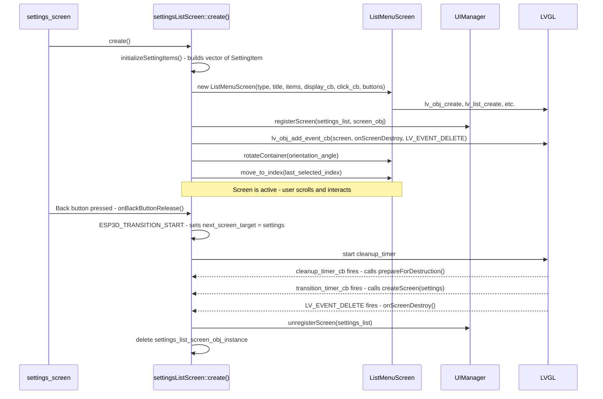
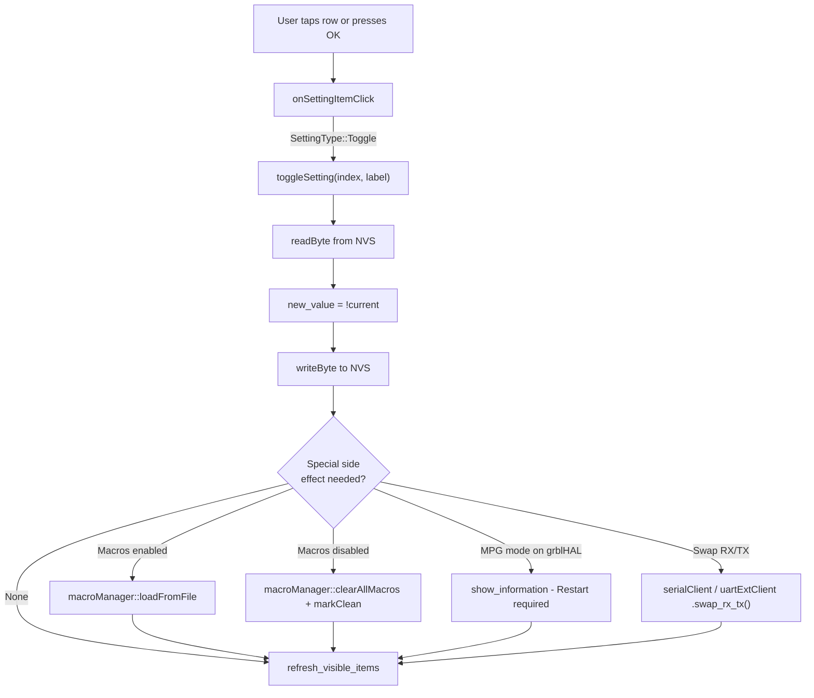
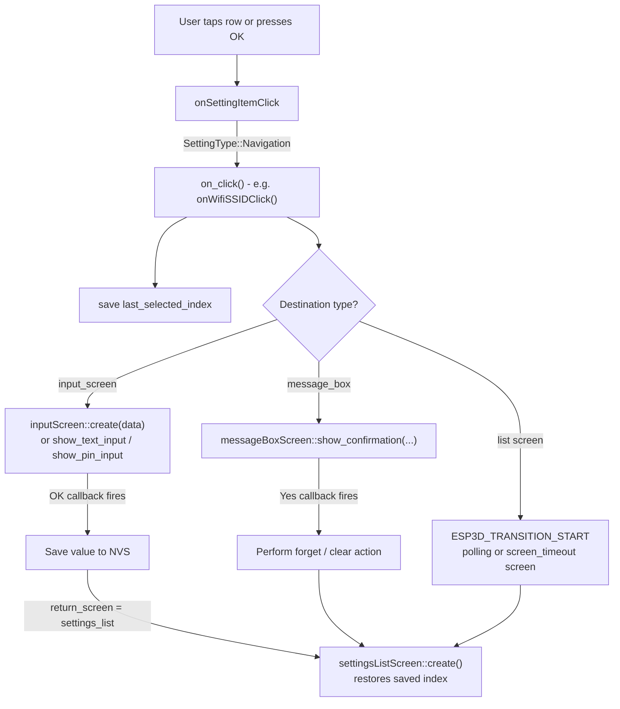
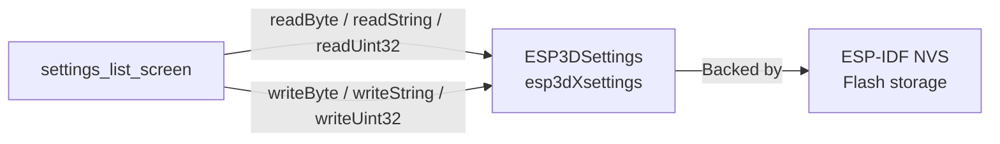
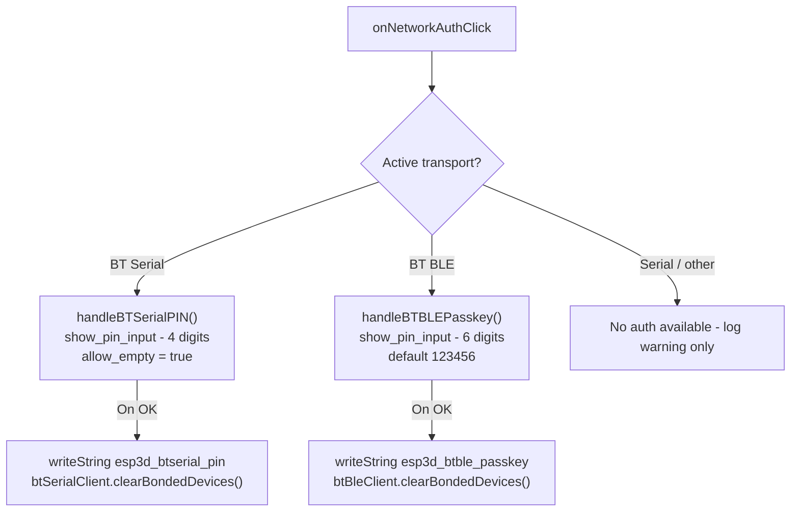

# Settings List Screen

## Overview

The **Settings List Screen** (`settings_settings_list_screen`) is a scrollable list-based UI screen that exposes all user-configurable pendant settings. It is the second layer of the settings hierarchy, reached by selecting the **Settings Editor** section from the parent [Settings Screen](settings_settings_screen.md).

The screen is built on top of [`ListMenuScreen`](ui_components.md) and presents a flat, scrollable list of heterogeneous setting entries. Each entry is one of two behavioural kinds:

| Kind | Behaviour |
|---|---|
| **Navigation** | Taps/OK opens a secondary screen (input, scan, confirmation) |
| **Toggle** | Taps/OK flips a boolean NVS value in-place; the checkmark updates immediately |

All items, their labels, and their enable/visibility are resolved at **runtime** from the active transport, build flags, and NVS values, making the list fully adaptive to the current firmware variant and connection mode.

---

## Architecture

### Position in the Screen Hierarchy



### Component Relationship Diagram



---

## Core Data Structures

### `SettingItem`

Describes a single row in the settings list. All rows are stored in a `std::vector<SettingItem>` built once at screen-creation time by `initializeSettingItems()`.

```cpp
struct SettingItem {
    ESP3DLabel        label;          // Translated display text key
    SettingType       type;           // Navigation | Toggle
    ESP3DSettingIndex setting_index;  // NVS key (toggles), or unknown_index for navigation
    void (*on_click)();               // Navigation handler; nullptr for pure toggles
    int8_t            axis_index;     // 0-5 for jog rows (X/Y/Z/A/B/C), -1 otherwise
};
```

### `SettingType` Enum

```cpp
enum class SettingType : uint8_t {
    Navigation = 0,   // Opens another screen
    Toggle     = 1    // Reads/writes a boolean NVS byte in place
};
```

### `JogSettingAxisData`

A static compile-time array mapping axis indices (0–5) to their NVS setting keys. Used by `openJogStepsEditor()` and `openJogFeedrateEditor()`.

```cpp
// Static table — one entry per axis
static const JogSettingAxisData jog_axis_configs[] = {
    {'X', esp3d_x_jog_steps, esp3d_x_jog_feedrates},
    {'Y', esp3d_y_jog_steps, esp3d_y_jog_feedrates},
    {'Z', esp3d_z_jog_steps, esp3d_z_jog_feedrates},
    {'A', esp3d_a_jog_steps, esp3d_a_jog_feedrates},
    {'B', esp3d_b_jog_steps, esp3d_b_jog_feedrates},
    {'C', esp3d_c_jog_steps, esp3d_c_jog_feedrates},
};
```

Axis display letters are resolved at runtime via `ESP3DValuesIndex::axis_names` (to honour grblHAL's `$376` UVW renaming), falling back to the static letter when the observable is unset or empty for that position.

---

## Setting Items Catalogue

All items are built into a single flat `std::vector` by `initializeSettingItems()` and presented in the order described below.

### 1 — Navigation Settings (open a secondary screen)



### 2 — Toggle Settings (in-place boolean flip)

| Label | NVS Key | Condition |
|---|---|---|
| Macros | `esp3d_macros_enabled` | Always shown |
| Probe | `esp3d_probe_enabled` | Always shown |
| Tool Change | `esp3d_change_tool_enabled` | Hidden on GRBL |
| Bypass Safety Focus | `esp3d_bypass_safety_focus` | Always shown |
| MPG Mode | `esp3d_mpg_enabled` | grblHAL only; hidden over Telnet/WebSocket transport |
| Swap RX/TX | `esp3d_swap_rx_tx` / `esp3d_uart_ext_swap_rxtx` | Serial or UART ext transport only |

When a toggle is flipped, `toggleSetting()` immediately:
1. Reads the current NVS byte.
2. Inverts it and writes it back.
3. Applies item-specific side effects (see table below).
4. Calls `refresh_visible_items()` to redraw visible rows (updates ✓/✗ symbol without a full screen reload).

Side effects per toggle:

| Toggle | Side Effect |
|---|---|
| **Macros enabled** | `macroManager::loadFromFile()` |
| **Macros disabled** | `macroManager::clearAllMacros()` + `markClean()` |
| **MPG mode** | Shows "Restart required" information dialog |
| **Swap RX/TX** | Calls `serialClient.swap_rx_tx()` or `uartExtClient.swap_rx_tx()` hot |

### 3 — Jog Settings (per-axis navigation to input)

Six axes × two parameters = up to 12 jog entries. Each opens an `input_screen` with a specialised keyboard type:

| Entry | Keyboard Type | NVS Key |
|---|---|---|
| `<Axis>` Steps | `NumericListFloat` | `esp3d_<axis>_jog_steps` |
| `<Axis>` Feedrates | `NumericListInt` | `esp3d_<axis>_jog_feedrates` |



---

## Screen Lifecycle



### Destruction Safety Pattern

The screen uses a two-flag guard to prevent double-cleanup regardless of which path (user navigation vs LVGL-initiated deletion) triggers destruction:

- `is_prepared_for_destruction_` — set once by `prepareForDestruction()`; subsequent calls are no-ops guarded by `ESP3D_PREPARE_DESTRUCTION_GUARD`.
- `cleanup_executed_` — additional idempotency guard inside the macro.

`onScreenDestroy()` (the `LV_EVENT_DELETE` callback) calls `prepareForDestruction()` itself if the normal transition path has not already done so, ensuring that LVGL-initiated destruction (e.g., from a parent screen switch) is always clean.

The selected index is persisted in the file-scope `last_selected_index` so the list re-enters at the same row when the user returns from a sub-screen.

---

## Data Flow Diagrams

### Toggle Setting Interaction



### Navigation Setting Interaction



### NVS Read / Write Path



---

## Build-Time Conditional Summary

The complete item list is gated by preprocessor flags evaluated at compile time and transport checks evaluated at screen creation time.

| Setting Item | Guard |
|---|---|
| Screen Timeout | `ESP3D_BRIGHTNESS_CONTROL_FEATURE` |
| File Extensions | `!TARGET_IS_GRBLHAL` |
| BT PIN / BLE Passkey | `ESP3D_BT_SERIAL_FEATURE` or `ESP3D_BT_BLE_FEATURE` + active transport match |
| Forget BT Host | `ESP3D_BT_SERIAL_FEATURE` or `ESP3D_BT_BLE_FEATURE` + active transport match |
| WiFi SSID / Password / Forget | `ESP3D_WIFI_FEATURE` |
| Server Address / Port | `ESP3D_IP_CNC_CLIENT_FEATURE` |
| WebSocket Path | `ESP3D_WS_CLIENT_SERVICE_FEATURE` |
| Tool Change toggle | `!TARGET_IS_GRBL` |
| MPG Mode toggle | `TARGET_IS_GRBLHAL` + serial or uart_ext transport (runtime check) |
| Swap RX/TX toggle | serial or `ESP3D_UART_EXT_FEATURE` transport (runtime check) |

---

## Key Functions Reference

### `create()`
Entry point called by `settings_screen` when the user selects the Settings Editor section. Resets all transition guards, calls `initializeSettingItems()`, allocates the `ListMenuScreen` with `std::nothrow`, registers the screen with `UIManager`, attaches the `LV_EVENT_DELETE` cleanup callback, applies rotation, and restores the previously saved selection index. Protected against double-instantiation via an explicit existence check that throws `std::runtime_error`.

### `initializeSettingItems()`
Clears and rebuilds the file-scope `setting_items_` vector in dependency order. All conditional items are evaluated here against compile-time flags and the runtime active transport. The entire body is wrapped in `try/catch(std::exception)` to catch `std::bad_alloc` on a fragmented heap — a partial list is preferable to a board reset.

### `displaySettingItem(container, item, screen_instance, user_data)`
LVGL display callback invoked by `ListMenuComponent` for each visible row during rendering or after `refresh_visible_items()`.

- **Toggle rows**: renders a ✓ (`ESP3D_INDICATOR_SUCCESS_COLOR`) or ✗ (`ESP3D_INDICATOR_ERROR_COLOR`) symbol read live from NVS, followed by the translated label. The colour is tagged with `ui_manager.tagListNodeStatusColor()` so `applyListNodeStyle()` correctly restores it when the row loses selection highlight.
- **Navigation rows**: renders the translated label; for jog entries the `%c` axis-letter placeholder is filled by `getAxisLetter(axis_index)`.

### `onSettingItemClick(item, screen_instance, user_data)`
Unified click handler called by both the OK button release path and a direct list-tap event:
1. Plays the active-item beep.
2. For **Toggle** items: calls `toggleSetting()`.
3. For **Navigation** items: calls `on_click()`.

### `toggleSetting(index, label)`
Reads the byte at `index` from NVS, inverts it, writes it back, applies any item-specific side effects, then calls `refresh_visible_items()` on the active `ListMenuComponent` to redraw only the visible rows without recreating the screen.

### `getAxisLetter(axis_idx)`
Resolves the display letter for a jog axis row. Reads `ESP3DValuesIndex::axis_names` from the observable system; falls back to `jog_axis_configs[axis_idx].axis_letter` when the observable is empty or shorter than `axis_idx`. This makes grblHAL UVW naming transparent across the entire settings UI.

### `openJogStepsEditor(axis_idx)` / `openJogFeedrateEditor(axis_idx)`
Generic helpers used by the six per-axis click callbacks (`onXStepsClick`, …, `onCFeedrateClick`). They save `last_selected_index`, read the current NVS value into a stack buffer, then build and pass an `InputScreenData` struct to `inputScreen::create()`, encoding the axis index as `user_data` (via `reinterpret_cast<intptr_t>`) for the save callback.

### `cleanup_timer_cb` / `transition_timer_cb`
Standard two-stage deferred transition used throughout the CNC UI layer. `cleanup_timer_cb` calls `prepareForDestruction()` to disable input and stop LVGL updates on the outgoing screen; `transition_timer_cb` then calls `createScreen(next_screen_target)`. See [Screen Transitions Architecture](https://github.com/luc-github/Pibot-cnc-pendant-firmware/blob/main/docs/architecture/screens_architecture.md) for the full pattern.

### `onScreenDestroy(e)`
`LV_EVENT_DELETE` handler attached to the LVGL screen object. Calls `prepareForDestruction()` as a safety net if the normal transition path has not already done so, then calls `ui_manager.unregisterScreen()` and `delete`s the `ListMenuScreen` C++ object.

---

## Network Authentication Sub-Flow

When the active transport is BT Serial or BT BLE, `onNetworkAuthClick()` reads the active transport from `esp3dCommands.getOutputClient()` and dispatches to the appropriate handler:



`onForgetBTHostClick()` shows a `message_box_screen` confirmation. On **Yes** the handler:
1. Calls `disconnect()` on the active BT client.
2. Calls `clearTargetDevice()` and `clearBondedDevices()`.
3. Writes an empty string to the PIN/Passkey NVS key.

---

## LVGL Threading Constraints

This screen runs entirely on **Core 1** (the LVGL task). All callbacks (`displaySettingItem`, `onSettingItemClick`, `toggleSetting`, `onScreenDestroy`, timer callbacks) are invoked from the LVGL task context and must not block.

Key constraints respected by this module:

- NVS reads/writes in callbacks are synchronous but brief — no heap-heavy operations occur in the per-frame display path.
- `std::vector` allocation in `initializeSettingItems()` happens once at screen creation, not per render frame.
- `refresh_visible_items()` redraws only the visible LVGL objects, avoiding a full list rebuild and minimising GPU load.
- Transition timers defer screen switching out of the LVGL event callback stack using `lv_timer_create`, avoiding re-entrant deletion.

For the general LVGL threading model and safety rules see [CLAUDE.md — LVGL Constraints](https://github.com/luc-github/Pibot-cnc-pendant-firmware/blob/main/CLAUDE.md).

---

## Related Modules

| Module | Relationship |
|---|---|
| [settings_settings_screen](settings_settings_screen.md) | Parent screen; navigates here via the "Settings Editor" circular menu section |
| [ui_components — ListMenuScreen](ui_components.md) | Base class providing the scrollable list UI and virtual button bar |
| [modal_dialog_screens — input_screen](modal_dialog_screens.md) | Used for all text / numeric / PIN / list input dialogs launched from this screen |
| [modal_dialog_screens — message_box_screen](modal_dialog_screens.md) | Used for Forget WiFi and Forget BT Host confirmation dialogs |
| [settings_selection_screens — polling_screen](settings_selection_screens.md) | Sub-screen for polling interval selection |
| [settings_selection_screens — screen_timeout_screen](settings_selection_screens.md) | Sub-screen for screen backlight timeout selection |
| [macro_system](macro_system.md) | `macroManager::loadFromFile()` and `clearAllMacros()` called on Macros toggle |
| [esp3d_core — ESP3DSettings](esp3d_core.md) | NVS read/write backend for all persisted settings |
| [values — ESP3DValues](values.md) | `axis_names` observable read by `getAxisLetter()` for dynamic axis letter resolution |
| [translations](translations.md) | `esp3dTranslationService.translate()` for all displayed labels and formatted jog titles |
| [screens_architecture](https://github.com/luc-github/Pibot-cnc-pendant-firmware/blob/main/docs/architecture/screens_architecture.md) | General screen lifecycle, safe transition patterns, and two-stage timer model |


## Documents de conception (depot)

- [settings_list_screen](https://github.com/luc-github/Pibot-cnc-pendant-firmware/blob/main/docs/ux_flows/fluidnc/settings_list_screen.md)
- [settings_list_screen](https://github.com/luc-github/Pibot-cnc-pendant-firmware/blob/main/docs/ux_flows/grblhal/settings_list_screen.md)
