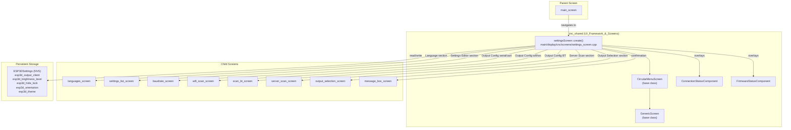
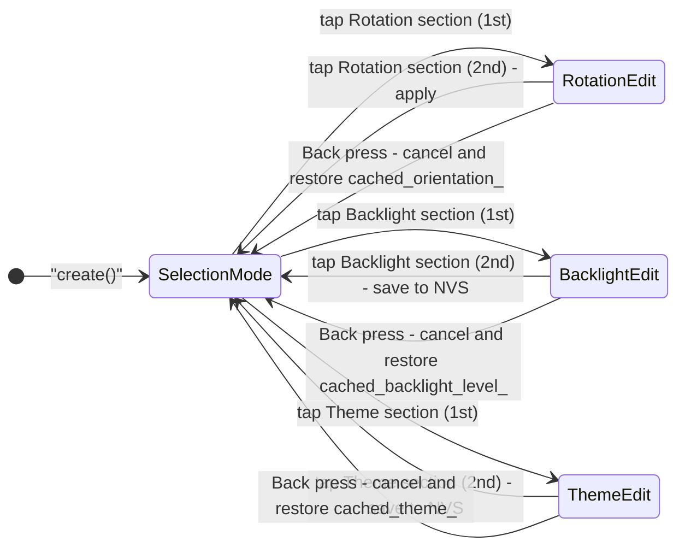
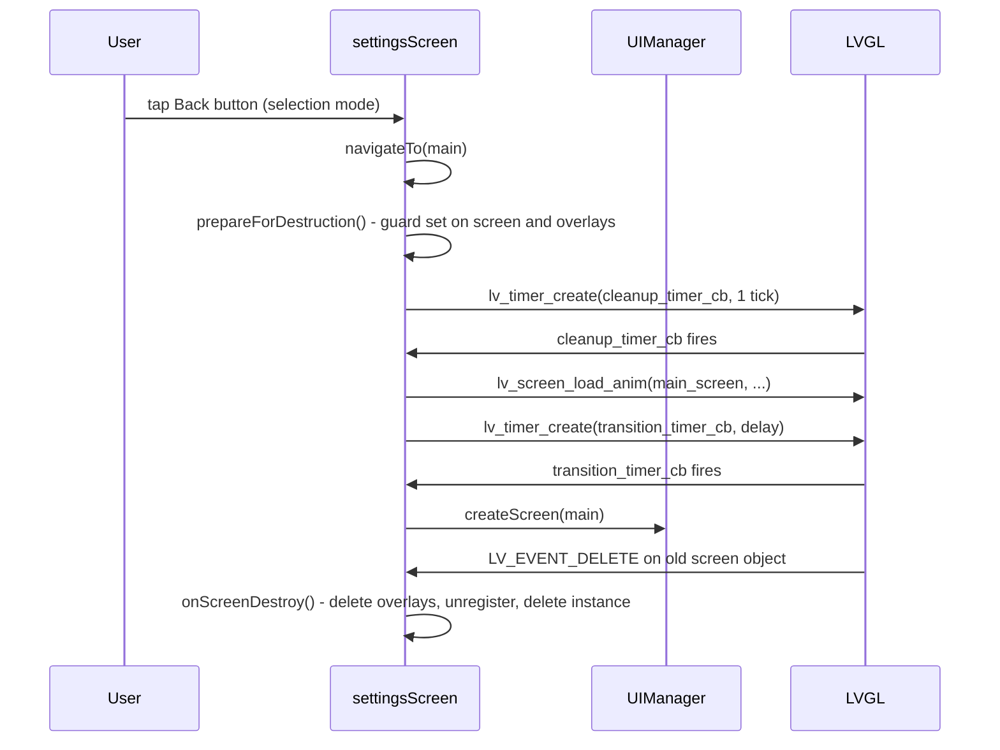
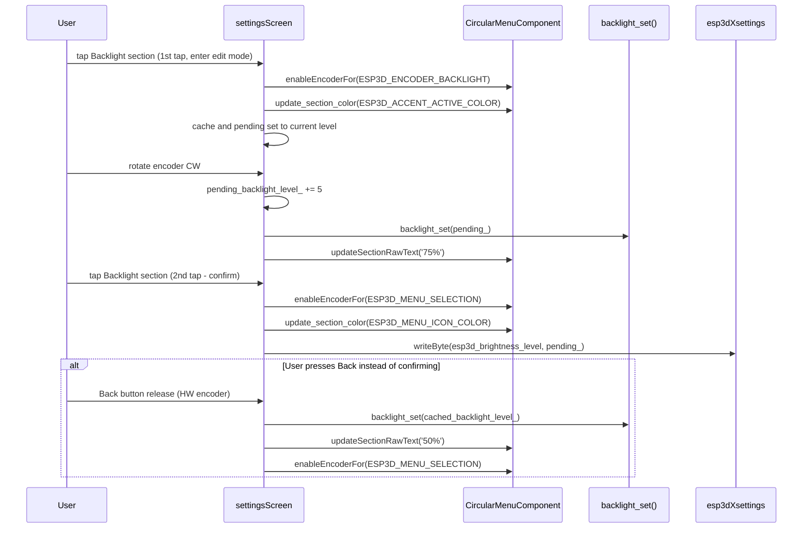
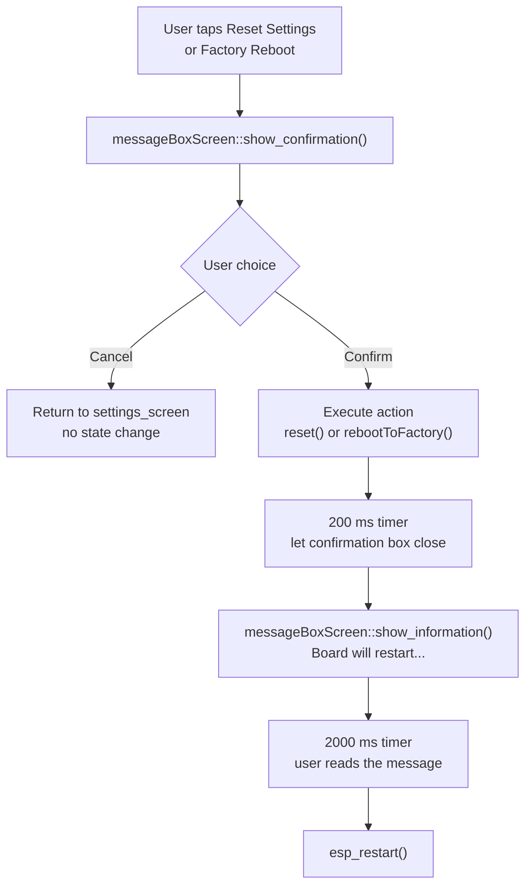
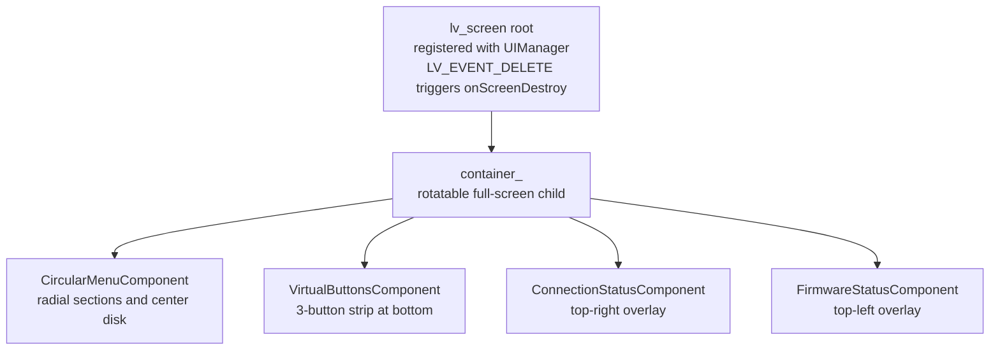
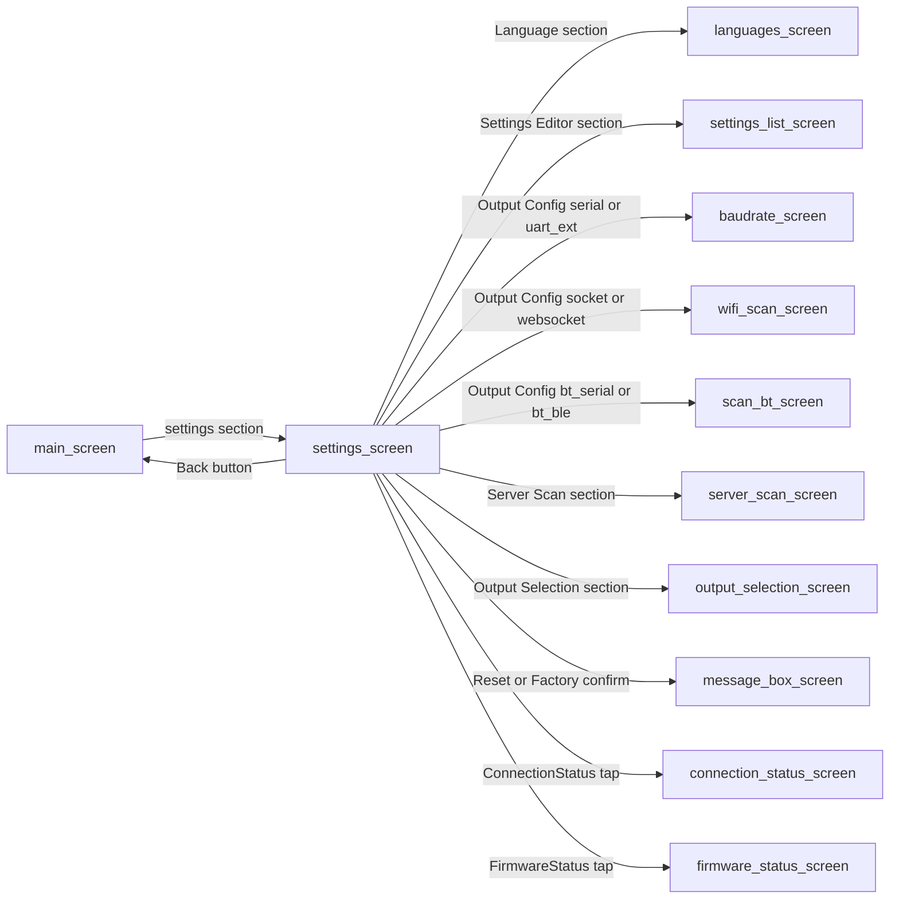

# settings_settings_screen

## Introduction

`settings_settings_screen` is the **top-level pendant configuration screen**. It presents a
circular (radial) menu where each pie-slice section maps to one configurable aspect of the
pendant — from cosmetic choices (theme, language, backlight) to transport wiring (serial baud
rate, Bluetooth device scan, WiFi server scan) and destructive actions (factory reset, factory
reboot).

**Source file:** `main/display/cnc/screens/settings_screen.cpp`

The screen is built on [`CircularMenuScreen`](architecture/screen_base_infrastructure.md) and
therefore inherits the standard radial navigation, two-phase tear-down, and encoder/touch-drag
infrastructure. It also hosts two overlay components — `ConnectionStatusComponent` and
`FirmwareStatusComponent` — consistent with other CNC working screens.

---

## Architecture Overview

---

## Section Map

The circular menu is composed of sections that are included or excluded at **compile time** via
preprocessor flags. Sections are assigned sequential IDs (the `SettingsSections` enum) starting
from 0; the total count is `ESP3D_TOTAL_SECTIONS`.

| Section enum | Default ID | Compile guard | Label key | Behavior |
|---|---|---|---|---|
| `ESP3D_SECTION_LOCK_UI` | 0 | always | `show_lock_ui` / `hide_lock_ui` | Toggle UI lock visibility (persisted to NVS, icon updated in-place) |
| `ESP3D_SECTION_SOUND` | 1 | `ESP3D_BUZZER_FEATURE` | `enable_sound` / `disable_sound` | Toggle buzzer on/off (persisted) |
| `ESP3D_SECTION_ROTATION` | 2 | `ESP3D_DYNAMIC_ROTATION_FEATURE` | `orientation` | Enter rotation edit mode; encoder cycles 0→90→180→270 degrees |
| `ESP3D_SECTION_BACKLIGHT` | 3 | `ESP3D_BRIGHTNESS_CONTROL_FEATURE` | raw `"N%"` | Enter backlight edit mode; encoder steps ±5% (0–100%) |
| `ESP3D_SECTION_LANGUAGE` | +0 | always | `ui_language` | Navigate to `languages_screen` |
| `ESP3D_SECTION_THEME` | +1 | always | `theme` + theme name | Enter theme-selection edit mode; live preview on encoder step |
| `ESP3D_SECTION_RESET_SETTINGS` | +2 | always | `reset_settings` | Confirmation dialog then `esp3dXsettings.reset()` + `esp_restart()` |
| `ESP3D_SECTION_FACTORY_REBOOT` | +3 | `ESP3D_FACTORY_FEATURE && ESP3D_SHOW_MENU_FACTORY` | `factory_reboot` | Confirmation dialog then `esp3dCommands.rebootToFactory()` + `esp_restart()` |
| `ESP3D_SECTION_SETTINGS_EDITOR` | +n | always | `settings_editor` | Navigate to `settings_list_screen` |
| `ESP3D_SECTION_OUTPUT_SELECTION` | +n+1 | `ESP3D_BT_SERIAL_FEATURE or ESP3D_BT_BLE_FEATURE or ESP3D_WIFI_FEATURE or ESP3D_UART_EXT_FEATURE` | dynamic | Navigate to `output_selection_screen` |
| `ESP3D_SECTION_OUTPUT_CONFIGURATION` | +n+2 | always | dynamic per client type | Navigate to `baudrate_screen`, `wifi_scan_screen`, or `scan_bt_screen` depending on `esp3d_output_client` |
| `ESP3D_SECTION_SERVER_SCAN` | +n+3 | `ESP3D_IP_CNC_CLIENT_FEATURE` | `server_scan` | Navigate to `server_scan_screen`; hidden unless `socket_client` or `websocket_client` is active output |

### Output Configuration Dynamic Routing

The `ESP3D_SECTION_OUTPUT_CONFIGURATION` section navigation target is resolved at runtime by
reading `esp3d_output_client` from NVS:

| `ESP3DClientType` | Target screen |
|---|---|
| `serial` | `baudrate_screen` |
| `uart_ext` (if `ESP3D_UART_EXT_FEATURE`) | `baudrate_screen` |
| `socket_client` (if `ESP3D_IP_CNC_CLIENT_FEATURE`) | `wifi_scan_screen` |
| `websocket_client` (if `ESP3D_WS_CLIENT_SERVICE_FEATURE`) | `wifi_scan_screen` |
| `bt_serial` / `bt_ble` (if `ESP3D_BT_*_FEATURE`) | `scan_bt_screen` |

---

## Encoder Modes

The encoder can be **repurposed** from menu navigation to value-editing for three sections. The
active mode is tracked inside `CircularMenuComponent::encoderEnabledFor()` and queried by
`onEncoderEvent`.

| Mode constant | Value | Active when | Encoder direction effect |
|---|---|---|---|
| `ESP3D_MENU_SELECTION` | base | default | Navigate to adjacent section |
| `ESP3D_ENCODER_ROTATION` | `ESP3D_MENU_SELECTION + 1` | Rotation section toggled on | Cycle orientation 0/900/1800/2700 (tenths-of-degrees), wrapping |
| `ESP3D_ENCODER_BACKLIGHT` | `ESP3D_MENU_SELECTION + 2` | Backlight section toggled on | Adjust brightness ±5% (clamped 0–100%) |
| `ESP3D_ENCODER_THEME` | `ESP3D_MENU_SELECTION + 3` | Theme section toggled on | Cycle to next/previous theme with live preview |

The **section enters edit mode** on first tap and **exits/saves on second tap**; the Back button
cancels and restores the prior cached value. Section arc and icon colors change to
`ESP3D_ACCENT_ACTIVE_COLOR` while active to provide visual feedback.

---

## Virtual Buttons

Three virtual buttons are defined at the bottom of the screen:

| Button slot | Icon (selection mode) | Icon (edit mode, touch-only) | Press behavior | Release behavior |
|---|---|---|---|---|
| Button 0 (OK) | confirm icon | confirm icon | `simulate_click(current_section)` on the circular menu | `releaseSection(current_section)` |
| Button 1 (rotate CW) | hidden | `arrow_up_b` | Emits `+1` encoder step via `emitEncoderStep(1)` | No action |
| Button 2 (Back / rotate CCW) | `back_b` | `arrow_down_b` | Selection mode: beep. HW encoder edit: no-op. Touch-only edit: emits `-1` encoder step | Selection mode: navigate to `main_screen`. HW encoder edit: cancel and restore cached value |

`ShowEncoderControls(bool state)` is called after every section press/release to show/hide
button 1 and swap button 2's icon between `back_b` and `arrow_down_b`, keeping the button strip
consistent with the current encoder mode. This function is a no-op on hardware-encoder builds
(`ESP3D_HARDWARE_ENCODER_FEATURE`).

---

## Function Reference

### `create()`

Entry point called by the screen router when `ESP3DScreenType::settings` is requested.

1. Resets all static transition-guard flags via `ESP3D_TRANSITION_RESET`.
2. Throws `std::runtime_error` if an instance already exists (indicates a screen-management bug).
3. Builds the static `settings_menu_sections[]` array (compile-time filtered by feature flags).
4. Creates a `CircularMenuScreen` with `std::nothrow`; validates with `isValid()`.
5. Pre-initializes the theme section text before `showMenu()` renders it (avoids a plain
   "Theme" label flash on first boot while the static sections array is still `Translatable`).
6. Calls `showMenu()` to render the radial menu.
7. Registers the screen with `UIManager` and attaches the `LV_EVENT_DELETE` handler
   (`onScreenDestroy`) to the root LVGL object for safe auto-cleanup.
8. Calls `onScreenCreated()` to apply runtime-known initial state to each section.
9. On touch-only builds, hides button 1 initially (only shown during value editing).
10. Creates `ConnectionStatusComponent` and `FirmwareStatusComponent` overlays with
    `std::nothrow`; logs and skips gracefully if allocation fails.

### `onScreenDestroy(lv_event_t *e)`

LVGL `LV_EVENT_DELETE` handler registered on the root screen object.

- If `prepareForDestruction()` was not already called (emergency path), calls it now.
- Deletes `firmware_status_component` and `connection_status_component`.
- Calls `ui_manager.unregisterScreen(ESP3DScreenType::settings)`.
- Deletes `settings_screen_obj_instance` and nulls all static pointers.

### `onMenuSectionPress(int32_t section_id)`

Called by `CircularMenuComponent` on any section press event.

- Guards against invalid screen state and transition locks (`isActionAllowed`).
- Plays `ESP3D_SELECTION_BEEP`.

### `onMenuSectionRelease(int32_t section_id, uint32_t duration_ms)`

The primary action dispatcher. Handles all section-specific logic on release.

| Section | Action taken |
|---|---|
| `LOCK_UI` | Toggles `ui_manager.getHideLock()` and updates section icon + label in-place |
| `SOUND` | Toggles `esp3d_buzzer.enable()` and updates section icon + label in-place |
| `ROTATION` | Toggles `ESP3D_ENCODER_ROTATION` mode; on exit applies pending orientation via `ui_manager.setOrientationFromAngle()` |
| `BACKLIGHT` | Toggles `ESP3D_ENCODER_BACKLIGHT` mode; on exit writes `esp3d_brightness_level` to NVS if changed |
| `LANGUAGE` | `navigateTo(ESP3DScreenType::languages)` |
| `THEME` | Toggles `ESP3D_ENCODER_THEME` mode; on exit calls `ui_manager.setTheme()` if changed |
| `RESET_SETTINGS` | Opens confirmation `message_box_screen`; on confirm: `esp3dXsettings.reset()` then information box then 2 s timer then `esp_restart()` |
| `FACTORY_REBOOT` | Opens confirmation `message_box_screen`; on confirm: `esp3dCommands.rebootToFactory()` then information box then 2 s timer then `esp_restart()` |
| `SETTINGS_EDITOR` | `navigateTo(ESP3DScreenType::settings_list)` |
| `OUTPUT_SELECTION` | `navigateTo(ESP3DScreenType::output_selection)` |
| `OUTPUT_CONFIGURATION` | Reads `esp3d_output_client` from NVS; routes to `baudrate`, `wifi_scan`, or `scan_bt` |
| `SERVER_SCAN` | `navigateTo(ESP3DScreenType::server_scan)` |

After every release, `ShowEncoderControls` is called to sync button visibility with the new
encoder mode.

### `onEncoderEvent(int32_t direction, int32_t step, int32_t total_steps)`

Dispatches encoder steps based on the current encoder mode:

- **`ESP3D_ENCODER_ROTATION`**: Increments or decrements `pending_orientation_` by 900
  (tenths-of-degrees), wrapping at the [0, 2700] boundary. Calls `setCenterTextRotation` for
  live preview.
- **`ESP3D_ENCODER_BACKLIGHT`**: Adjusts `pending_backlight_level_` by `direction * 5`, clamped
  to [0, 100]. Calls `backlight_set()` and updates the section raw text label.
- **`ESP3D_ENCODER_THEME`**: Calls `ui_manager.nextTheme(false)` or `previousTheme(false)`,
  updates the theme section text, and forces a redraw of virtual buttons and circular menu for a
  complete live preview via `lv_obj_invalidate`.
- **`ESP3D_MENU_SELECTION`** (default): No action here; the base class handles section
  navigation automatically.

### `onBackButtonPress(int32_t button_idx, void *user_data)`

- **Selection mode**: plays `ESP3D_BACK_BEEP`.
- **Edit mode, HW encoder**: plays no beep; the cancel action fires on release.
- **Edit mode, touch-only**: emits `-1` encoder step via
  `VirtualButtonsComponent::emitEncoderStep(-1)` (button 2 doubles as CCW rotate).

### `onBackButtonRelease(int32_t button_idx, uint32_t duration_ms, void *user_data)`

- **Touch-only, edit mode**: no-op on release (action already taken on press).
- **HW encoder, edit mode**: resets encoder to `ESP3D_MENU_SELECTION` and restores cached
  values:
  - **Rotation**: restores `cached_orientation_` via `updateOrientation` +
    `setCenterTextRotation`.
  - **Backlight**: restores `cached_backlight_level_` via `backlight_set()` and updates label.
  - **Theme**: restores `cached_theme_` via `ui_manager.setTheme(cached_theme_, false)` and
    forces theme-color refresh on virtual buttons and circular menu.
- **Selection mode**: calls `navigateTo(RETURN_SCREEN)` (`ESP3DScreenType::main`).

### `onOKButtonPress(int32_t button_idx, void *user_data)`

Simulates a section press on `get_current_section()` via
`CircularMenuComponent::simulate_click`.

### `onOKButtonRelease(int32_t button_idx, uint32_t duration_ms, void *user_data)`

Releases the simulated section press via `CircularMenuComponent::releaseSection`.

### `onRotatePress(int32_t button_idx, void *user_data)`

Touch-only builds only (`!ESP3D_HARDWARE_ENCODER_FEATURE`).

Emits `+1` encoder step via `VirtualButtonsComponent::emitEncoderStep(1)`. Button 1 acts as the
clockwise encoder substitute when in value-edit mode.

### `cleanup_timer_cb(lv_timer_t *timer)`

First stage of the two-phase teardown. Calls `prepareForDestruction()` on the screen and all
overlay components, starts the LVGL load animation toward the target screen, then arms
`transition_timer_cb` with `ESP3D_TRANSITION_SCREEN_DELAY_MS`.

### `transition_timer_cb(lv_timer_t *timer)`

Second stage of teardown. Fires after the LVGL animation completes. Calls
`createScreen(next_screen_target)` to instantiate the destination screen and clears
`transition_in_progress_`.

---

## Lifecycle and Teardown

The `is_prepared_for_destruction_` flag is a one-way latch. Once set, all section press,
encoder, and button callbacks return early without touching LVGL objects. The `cleanup_executed_`
flag prevents `prepareForDestruction()` from running twice when both an explicit navigation and
the LVGL delete event arrive.

---

## Data Flow: Value-Edit Mode (Backlight Example)

---

## Reset / Factory-Reboot Confirmation Flow

Both destructive actions use a two-step message-box pattern to prevent accidental execution:

`prepareForDestruction` is passed to `show_confirmation` so the settings screen is safely torn
down before the message box renders over it.

---

## Initial Section State (`onScreenCreated`)

After the radial menu is rendered, `onScreenCreated()` applies runtime-known overrides that
cannot be encoded in the static `settings_menu_sections[]` array:

| Section | Initialization |
|---|---|
| `LOCK_UI` | Icon and label set to match `ui_manager.getHideLock()` |
| `SOUND` | Icon and label set to match `esp3d_buzzer.enabled()` |
| `BACKLIGHT` | Raw text label set to `"N%"` from `backlight_get_current()` |
| `THEME` | Arc color set to `ESP3D_ACCENT_SELECT_COLOR`; label updated to current theme name via `getCurrentThemeName()` |
| `OUTPUT_SELECTION` | Icon and label set to match current `esp3d_output_client` |
| `OUTPUT_CONFIGURATION` | Icon and label set to match current `esp3d_output_client` |
| `SERVER_SCAN` | Hidden (`UIItemType::Hidden`) for all clients except `socket_client` / `websocket_client` |

---

## Overlay Components

Both overlay components are created with `std::nothrow`. If allocation fails, the screen remains
fully functional but without that overlay indicator.

### `ConnectionStatusComponent`

Displays the live connection state (transport + server) as a small icon in the top corner.
Tapping it navigates to `connection_status_screen` with
`return_screen = ESP3DScreenType::settings`. See
[`grbl_module_connection_status.md`](grbl_module_connection_status.md) for the detailed
interface reference; the settings screen uses the same component as other CNC screens.

### `FirmwareStatusComponent`

Displays the live firmware state icon. Tapping it navigates to `firmware_status_screen` and
returns to `settings_screen` on Back.

Both overlays pass `prepareForDestruction` as their `prepare_parent_screen_destruction` hook so
that navigating away from the settings screen via an overlay tap correctly tears down the
settings screen before the overlay's target screen opens.

---

## Static State Variables

| Variable | Type | Purpose |
|---|---|---|
| `settings_screen_obj_instance` | `CircularMenuScreen *` | Sole instance pointer; null between navigations |
| `connection_status_component` | `ConnectionStatusComponent *` | Connection overlay instance |
| `firmware_status_component` | `FirmwareStatusComponent *` | Firmware overlay instance |
| `transition_timer` | `lv_timer_t *` | Second-phase teardown timer handle |
| `cleanup_timer` | `lv_timer_t *` | First-phase teardown timer handle |
| `is_prepared_for_destruction_` | `bool` | One-way latch set by `prepareForDestruction()` |
| `cleanup_executed_` | `bool` | Prevents double execution of cleanup |
| `next_screen_target` | `ESP3DScreenType` | Destination screen stored before transition starts |
| `cached_orientation_` | `int32_t` | Orientation at the moment rotation edit mode was entered |
| `pending_orientation_` | `int32_t` | Working orientation value during rotation edit |
| `cached_backlight_level_` | `int` | Brightness at the moment backlight edit mode was entered |
| `pending_backlight_level_` | `int` | Working brightness value during backlight edit |
| `cached_theme_` | `Theme` | Theme at the moment theme edit mode was entered |

---

## LVGL Object Hierarchy

---

## Navigation Map

---

## Dependencies

| Dependency | Role |
|---|---|
| [`CircularMenuScreen`](architecture/screen_base_infrastructure.md) | Base class — radial menu, orientation, virtual buttons, two-phase teardown |
| [`ConnectionStatusComponent`](grbl_module_connection_status.md) | Live connection-state overlay; same component as jog/status/probe screens |
| `FirmwareStatusComponent` (`cnc/components/firmware_status.h`) | Live firmware-state overlay |
| [`messageBoxScreen`](https://github.com/luc-github/Pibot-cnc-pendant-firmware/blob/main/docs/architecture/screens_architecture.md) | Confirmation and information dialogs for Reset Settings and Factory Reboot |
| `UIManager` (`esp3d_ui.h`) | Theme management (`getTheme`, `setTheme`, `nextTheme`, `previousTheme`, `getCurrentThemeName`), orientation (`setOrientationFromAngle`, `getOrientationAngle`), hide-lock state |
| `ESP3DSettings` / `esp3dXsettings` | NVS read/write for `esp3d_output_client`, `esp3d_brightness_level` |
| `esp3d_buzzer` | Buzzer on/off toggle and enabled-state query |
| `backlight_set` / `backlight_get_current` | Hardware backlight control (requires `ESP3D_BRIGHTNESS_CONTROL_FEATURE`) |
| `esp3dCommands.rebootToFactory()` | OTA partition switch for factory reboot (requires `ESP3D_FACTORY_FEATURE`) |
| `ESP3DTranslationService` | Run-time label translation for confirmation and information message text |
| LVGL | All rendering, timers, and event delivery |

---

## Related Documentation

- [`screen_base_infrastructure.md`](architecture/screen_base_infrastructure.md) — `GenericScreen`, `CircularMenuScreen`, two-phase teardown pattern
- [`screens_architecture.md`](https://github.com/luc-github/Pibot-cnc-pendant-firmware/blob/main/docs/architecture/screens_architecture.md) — full screen connection map and hardware matrix
- [`screen_transitions_flow.md`](https://github.com/luc-github/Pibot-cnc-pendant-firmware/blob/main/docs/architecture/screen_transitions_flow.md) — timer-based transition protocol detail
- [`settings_settings_list_screen.md`](settings_settings_list_screen.md) — child screen for advanced pendant settings (jog steps/feedrates, network parameters, polling, etc.)
- [`grbl_module_connection_status.md`](grbl_module_connection_status.md) — `ConnectionStatusComponent` API reference
- [`ui_style_guide.md`](https://github.com/luc-github/Pibot-cnc-pendant-firmware/blob/main/docs/ui_resources/ui_style_guide.md) — theme token reference (`ESP3D_ACCENT_ACTIVE_COLOR`, `ESP3D_ACCENT_SELECT_COLOR`, etc.)
- [`theme_palette.md`](https://github.com/luc-github/Pibot-cnc-pendant-firmware/blob/main/docs/ui_resources/theme_palette.md) — semantic color token definitions for the theme system
