# Socket Client Module

## Overview

The Socket Client module (`main/modules/socket_client/`) implements the **WiFi TCP transport** for the pendant's CNC controller link. It is one of four independent CNC communication transports — alongside [Serial](serial_client.md), [BT Serial](bluetooth_serial.md), and [BT BLE](bluetooth_ble.md) — and is used exclusively when `SOCKET_CLIENT_SERVICE` is enabled at build time.

When active, the module establishes a persistent raw TCP connection (Telnet-style) to a CNC controller running FluidNC, grbl, or grblHAL. It handles all connection lifecycle events — WiFi not ready, host unreachable, half-open connections, graceful reconnection — within a single self-healing FreeRTOS task, without requiring the network layer to restart it on each reconnect.

> **Build exclusivity:** `SOCKET_CLIENT_SERVICE` and `SOCKET_SERVER_SERVICE` / WebUI / SSDP / WS services are mutually exclusive. See `cmake/sanity_check.cmake` and [`feature_resource_matrix.md`](https://github.com/luc-github/Pibot-cnc-pendant-firmware/blob/main/docs/features/feature_resource_matrix.md) before changing transport policy.

---

## Architecture

### Module Position in the System

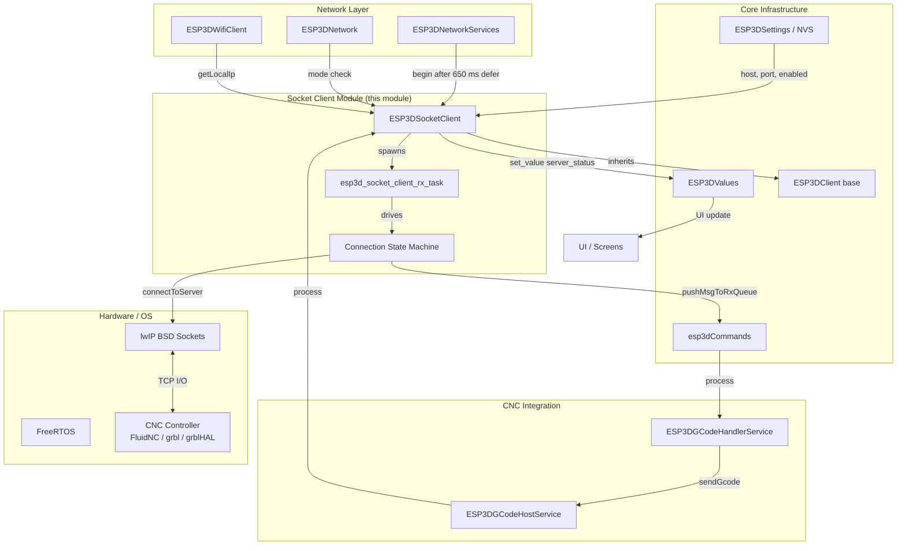

### Component Relationships

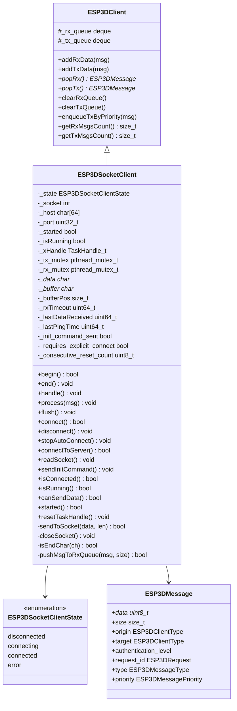

---

## Connection State Machine

The TCP connection lifecycle is governed by the `ESP3DSocketClientState` enum. Transitions are driven exclusively by the RX task loop.

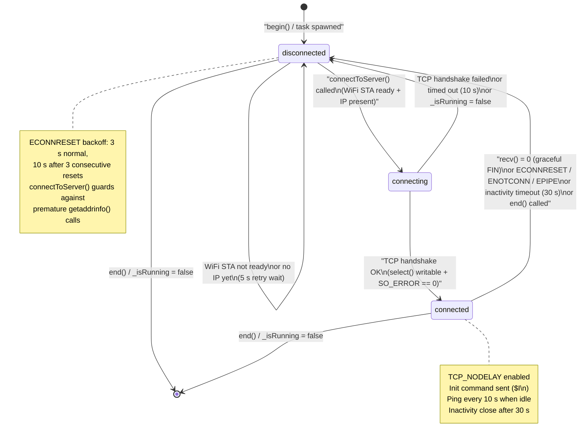

---

## Data Flow

### RX Path: CNC Controller → Pendant

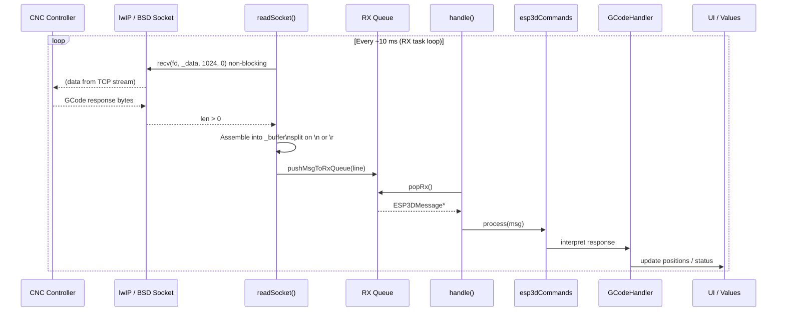

### TX Path: Pendant → CNC Controller

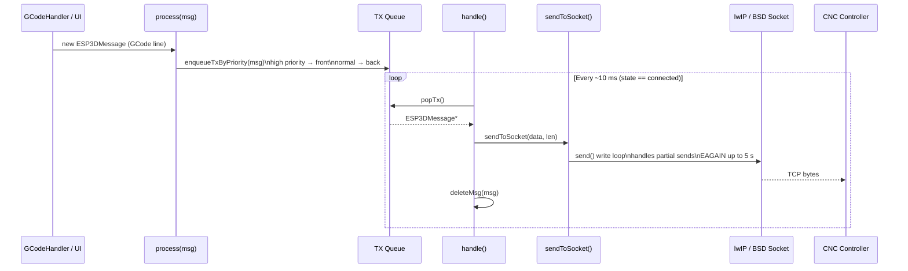

---

## Self-Healing Connection Loop

The RX task (`esp3d_socket_client_rx_task`) never exits unless `end()` is called. It implements all retry and reconnect logic internally, requiring no external orchestration.

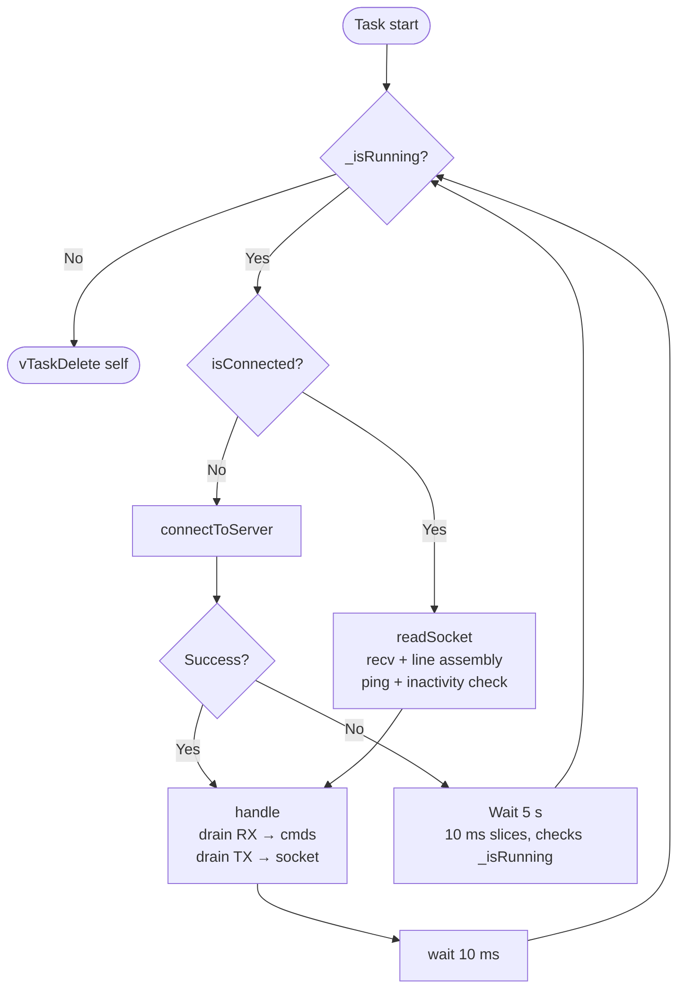

### connectToServer() Detail

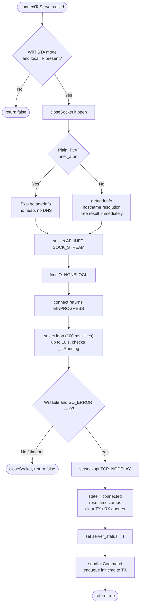

---

## Keep-Alive and Inactivity Detection

The module maintains a two-tier watchdog to detect dead TCP connections that the lwIP stack cannot detect on its own (e.g. silent power cuts where no TCP FIN/RST is sent):

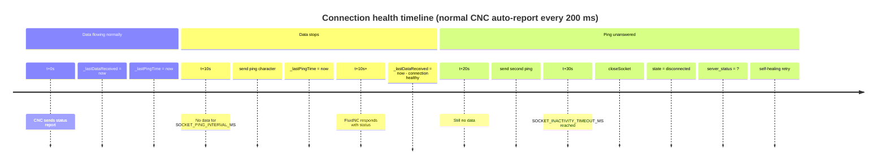

| Constant | Value | Purpose |
|---|---|---|
| `SOCKET_PING_INTERVAL_MS` | 10 000 ms | Send `?` if no data received for this duration |
| `SOCKET_INACTIVITY_TIMEOUT_MS` | 30 000 ms | Close connection if still no data after pings |
| `RX_FLUSH_TIMEOUT_MS` | 1 500 ms | Flush incomplete line buffer (prompts without `\n`) |
| `SEND_EAGAIN_TIMEOUT_MS` | 5 000 ms | Max time to retry a blocked `send()` (WiFi TX congestion) |
| `RESET_BACKOFF_THRESHOLD` | 3 | Consecutive resets before triggering longer backoff |
| `RESET_BACKOFF_LONG_MS` | 10 000 ms | Extended backoff to let remote Telnet server close stale session |

---

## Lifecycle: begin() / end()

### begin() Flow

`begin()` is called by `ESP3DNetworkServices` after a 650 ms defer once WiFi STA acquires an IP. It can also be triggered directly by the `[ESP134] ON` command.

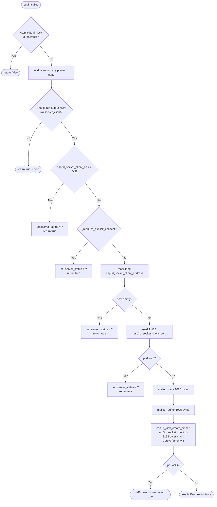

### end() Flow

`end()` is idempotent and safe to call from any task context, including from within the RX task itself (self-call path, e.g. when `[ESP134] OFF` arrives over the TCP socket).

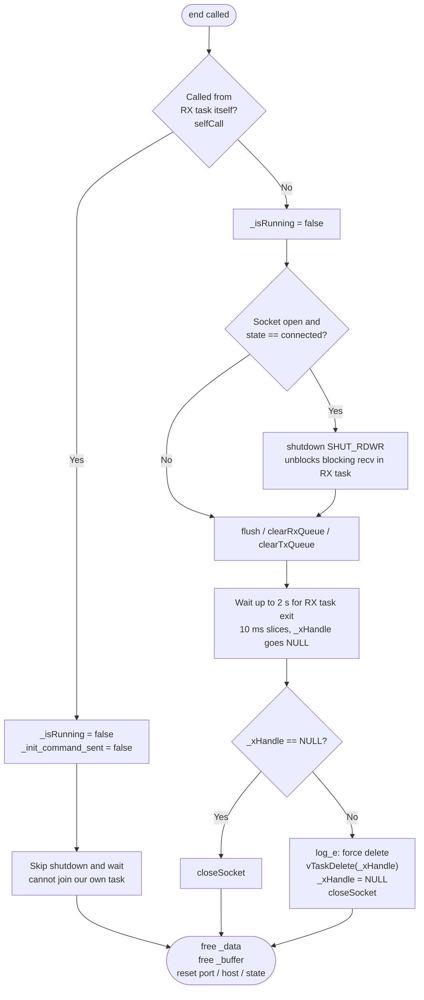

> **Mutex safety:** Mutexes are initialised **once** in the constructor and destroyed only in the destructor. `begin()` and `end()` must not re-initialise or destroy them — the RX task may hold a mutex while `end()` runs from another context, and `pthread_mutex_destroy()` on a held mutex causes a deadlock (Interrupt WDT on CPU1).

---

## Message Routing

Received bytes are assembled into lines, wrapped in `ESP3DMessage`, and routed according to whether the socket client is the configured output transport:

| Condition | `target` field | Effect |
|---|---|---|
| Socket client IS the output client | `ESP3DClientType::all_clients` | Broadcasts the response to all consumers (serial terminal, WebUI, etc.) — mirrors the serial client's behaviour |
| Socket client is NOT the output client | `ESP3DClientType::stream` | Routes only to the GCode host, avoiding duplicate forwarding |

- **Authentication level:** set to `admin` — WiFi LAN is treated as a trusted network.
- **`request_id.id`:** set to the socket file descriptor so the command router can correlate replies.

### RX Queue Eviction Policy

When the RX queue is full, the module evicts (processes) old messages to make room rather than silently dropping incoming data:

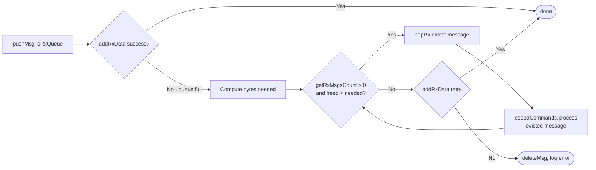

---

## Configuration

### NVS Settings

| Setting Index | Type | Description |
|---|---|---|
| `esp3d_socket_client_on` | `uint8_t` | Enable flag: `1` = ON, `0` = OFF |
| `esp3d_socket_client_address` | `string` (max 63 chars) | Target CNC controller IP address or hostname |
| `esp3d_socket_client_port` | `uint32_t` | Target TCP port (typically 23 for Telnet / FluidNC) |

Settings are read from NVS via `ESP3DSettings` on each `begin()` call. They can be changed at runtime via the Settings screen (`settings_list_screen`) or `[ESP134]` commands and take effect on the next `connect()` call.

### Build-Time Constants (`tasks_def.h`)

| Constant | Typical Value | Description |
|---|---|---|
| `ESP3D_SOCKET_CLIENT_TASK_SIZE` | 8192 bytes | RX task stack — larger than socket server (4096) because `getaddrinfo()`/DNS needs ~3–4 KB of lwIP stack depth |
| `ESP3D_SOCKET_TASK_PRIORITY` | 5 | FreeRTOS task priority (shared with socket server) |
| `ESP3D_SOCKET_TASK_CORE` | 0 (Core 0) | Pinned to Core 0; LVGL/UI runs on Core 1 |
| `ESP3D_SOCKET_CLIENT_QUEUE_MAX_BYTES` | 2048 bytes | TX and RX queue byte caps |
| `ESP3D_NETSERVICE_SOCKET_CLIENT_DEFER_MS` | 650 ms | Delay before `begin()` is called after WiFi STA acquires an IP |

### Build Feature Flag

```cmake
# CMakeLists.txt
option(SOCKET_CLIENT_SERVICE "Enable TCP socket client (WiFi CNC)" OFF)
```

When `ON`, `cmake/sanity_check.cmake` forbids `SSDP_SERVICE`, `WEBUI_SERVER`, `WS_SERVER_SERVICE`, and `WS_CLIENT_SERVICE` from being active simultaneously. See [`feature_resource_matrix.md`](https://github.com/luc-github/Pibot-cnc-pendant-firmware/blob/main/docs/features/feature_resource_matrix.md) for the full compatibility matrix.

---

## API Reference

### Public Interface (`ESP3DSocketClient`)

| Method | Description |
|---|---|
| `begin()` | Read settings, allocate buffers, spawn RX task. Called by `ESP3DNetworkServices` or `[ESP134] ON`. Returns `true` on success or configured no-op. Atomic flag prevents concurrent reentry. |
| `end()` | Tear down connection, stop RX task, free all buffers. Idempotent. Safe from any task context including the RX task itself. |
| `handle()` | Drain one RX message → `esp3dCommands`; drain one TX message → socket. **Single-caller design:** must be called only from the RX task loop. |
| `process(msg)` | Enqueue an outgoing message into the TX queue (priority-aware). Called by the command router to forward GCode to the CNC controller. |
| `flush()` | No-op (API compatibility with `ESP3DClient`). TX is drained in `handle()`. |
| `connect()` | Clear `_requires_explicit_connect` and call `begin()`. Triggered by `[ESP134] ON`. |
| `disconnect()` | Call `end()` and set `server_status = '?'`. Triggered by `[ESP134] OFF`. |
| `stopAutoConnect()` | Stop any active connection and set `_requires_explicit_connect = true`. Called from `wifi_scan_screen` when SSID/password changes to prevent auto-reconnect to the wrong network. |
| `connectToServer()` | Resolve host (fast IPv4 path via `inet_aton`, fallback to `getaddrinfo`), create non-blocking socket, wait for TCP handshake with 100 ms select slices. Internal — called from RX task loop. |
| `readSocket()` | `recv()` → line assembly → `pushMsgToRxQueue`. Also handles ping keep-alive and inactivity timeout. Internal. |
| `sendInitCommand()` | Enqueue the GCode handler init command (e.g. `$I\n`) once per TCP connection to trigger firmware identification. Internal. |
| `isConnected()` | `true` when `_state == ESP3DSocketClientState::connected`. |
| `isRunning()` | `true` while the RX task loop should keep running. |
| `canSendData()` | `true` when started, connected, and the socket fd is valid. |
| `started()` | `true` between a successful `begin()` and the next `end()`. |
| `resetTaskHandle()` | Called by the RX task immediately before `vTaskDelete(NULL)` to null `_xHandle`. |

### Global Singleton

```cpp
extern ESP3DSocketClient esp3dSocketClient;
```

Defined in `esp3d_socket_client.cpp`. Referenced by:
- `ESP3DNetworkServices` — calls `begin()` / `end()` on network transitions
- `[ESP134]` command handler — for `connect()` / `disconnect()` / `stopAutoConnect()`
- `wifi_scan_screen` — calls `stopAutoConnect()` on SSID/password change
- `settings_list_screen` — reads `host()` / `port()` for display

---

## server_status Observable

The socket client writes to `ESP3DValuesIndex::server_status` to drive the connection indicator in the UI:

| Value | Set by | Meaning |
|---|---|---|
| `"T"` | `connectToServer()` | **Trying** — TCP link up, waiting for firmware identification (`$I` response) |
| `"C"` | GCode handler | **Connected** — firmware identified, fully operational |
| `"?"` | `begin()` / `end()` / error paths | **Unknown / disconnected** — no active connection, or waiting for configuration |

See [`connection_management.md`](https://github.com/luc-github/Pibot-cnc-pendant-firmware/blob/main/docs/architecture/connection_management.md) for the full status lifecycle across all transports.

---

## Integration with Other Modules

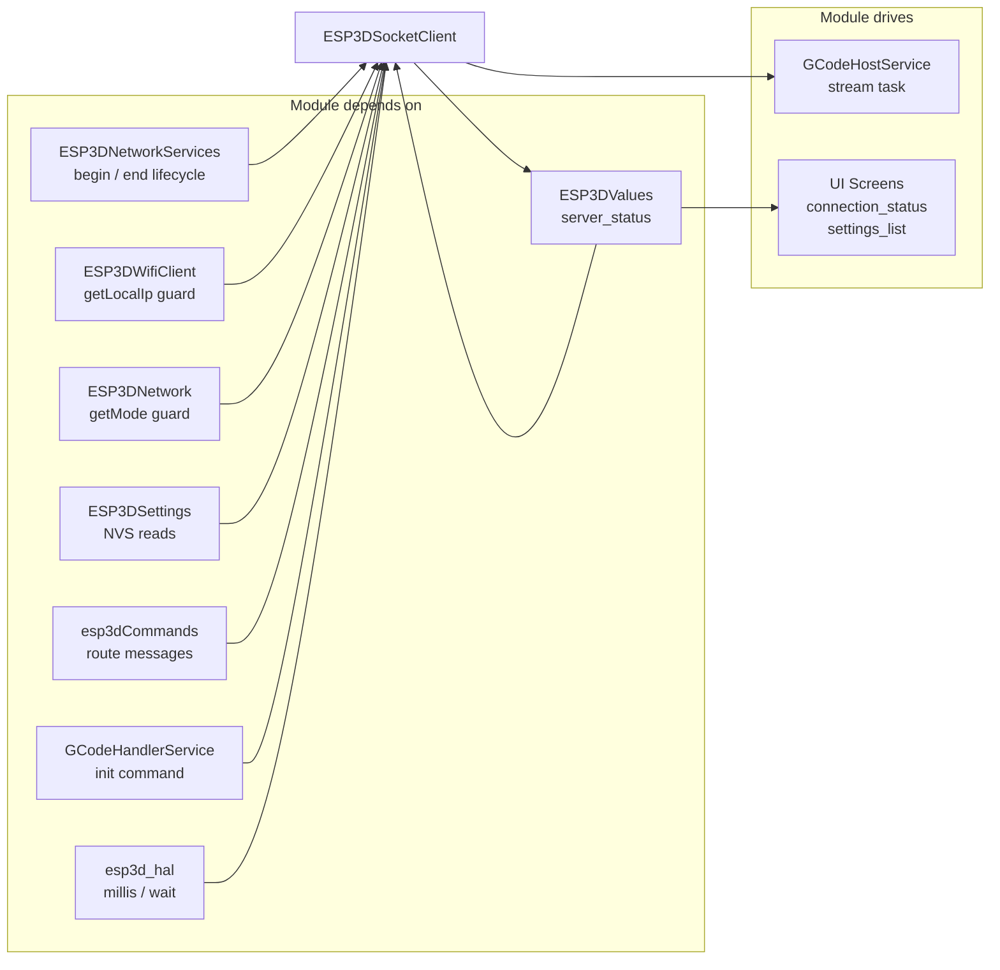

| Module | Interaction |
|---|---|
| [`ESP3DNetworkServices`](Network_and_Web_Services.md) | Calls `begin()` after WiFi IP acquired (650 ms defer); calls `end()` on network teardown |
| [`ESP3DWifiClient`](wifi.md) | `getLocalIp()` checked in `connectToServer()` to guard against premature `getaddrinfo()` before lwIP is ready |
| [`ESP3DNetwork`](network.md) | `getMode()` checked to confirm WiFi STA mode is active before attempting TCP connect |
| [`ESP3DSettings`](settings.md) | NVS reads for host address, port, and enable flag during `begin()` |
| [`esp3dCommands`](esp3d_commands.md) | Receives parsed CNC responses via `process()`; `getOutputClient()` determines message broadcast scope |
| [`GCodeHandlerService`](gcode_host.md) | Provides `getInitCommand()` for post-connect handshake; `resetStartupCommandsSent()` restarts the startup sequence on reconnect |
| [`GCodeHostService`](gcode_host.md) | Sends GCode lines to the socket client via `process()`; flow-controlled by the GCode streaming state machine |
| [`ESP3DValues`](values.md) | `set_value(server_status, ...)` drives the UI connection indicator |
| [`connection_status_screen`](connection_status_screen.md) | Subscribes to `server_status` to show transport state in the UI |
| [`settings_list_screen`](settings_settings_list_screen.md) | Reads host/port from settings and calls `stopAutoConnect()` when they are changed |

---

## Memory Considerations

This module follows the project-wide ESP32 memory rules (see [`esp32_memory_constraints.md`](https://github.com/luc-github/Pibot-cnc-pendant-firmware/blob/main/docs/guides/esp32_memory_constraints.md)):

- **Dynamic buffers:** Two `malloc()` calls in `begin()`, each 1025 bytes — `_data` (raw `recv()` destination) and `_buffer` (line-assembly accumulator). Both are checked for failure with logging of free heap and largest free block.
- **Queue byte caps:** TX and RX queues are capped at `ESP3D_SOCKET_CLIENT_QUEUE_MAX_BYTES` (2048 bytes) to bound worst-case heap reservation.
- **Stack size:** 8192 bytes, versus 4096 for the socket server. The extra space is required because `getaddrinfo()` / DNS resolution uses ~3–4 KB of lwIP internal stack depth.
- **Fast path for plain IPs:** `inet_aton()` is attempted before `getaddrinfo()`. For direct IP addresses (the common CNC Telnet target), this avoids all heap allocation and DNS round-trip entirely.
- **`getaddrinfo()` result:** Freed immediately after copying the resolved address — no heap reference escapes the connect path.
- **No allocation in hot path:** `readSocket()` reuses the statically-allocated `_data` and `_buffer` on every recv iteration.

---

## Concurrency and Thread Safety

| Resource | Protection mechanism |
|---|---|
| `_tx_queue` | `_tx_mutex` (pthread non-recursive mutex, initialised in constructor, destroyed in destructor) |
| `_rx_queue` | `_rx_mutex` (same pattern) |
| `_socket` fd | Invalidated to `FREE_SOCKET_HANDLE` **before** `close()`. `sendToSocket()` re-validates the fd on each loop iteration to detect concurrent closure by `end()` or WiFi teardown |
| `begin()` reentry | `std::atomic_flag` — RAII `BeginLockRelease` ensures the flag is cleared on all exit paths |
| `_isRunning` | Written by `end()`, read by the RX task loop — single-bit boolean; read is atomic on all ESP32 targets |
| `_state` | Written only by the RX task; read from other tasks for status display only (value is 8-bit and reads are observationally safe for display purposes) |

> **Single-caller design:** `handle()`, `readSocket()`, and `sendToSocket()` are called exclusively from the RX task. This eliminates the need for a write mutex on the TX drain path and guarantees GCode bytes from two messages can never interleave on the wire.

---

## Related Documentation

- [`connection_management.md`](https://github.com/luc-github/Pibot-cnc-pendant-firmware/blob/main/docs/architecture/connection_management.md) — Connection status lifecycle across all transports, `server_status` values
- [`gcode_host.md`](gcode_host.md) — GCode host service architecture and startup sequence
- [`serial_client.md`](serial_client.md) — Serial transport (ping/inactivity pattern mirrored here)
- [`socket_server.md`](socket_server.md) — Counterpart server-side TCP transport (mutually exclusive with this module)
- [`websocket_client.md`](websocket_client.md) — WebSocket transport (alternative to socket client; also mutually exclusive)
- [`network.md`](network.md) — Network orchestrator and radio mode management
- [`wifi.md`](wifi.md) — WiFi STA/AP lifecycle
- [`feature_resource_matrix.md`](https://github.com/luc-github/Pibot-cnc-pendant-firmware/blob/main/docs/features/feature_resource_matrix.md) — Feature compatibility and WiFi/CNC SKU model
