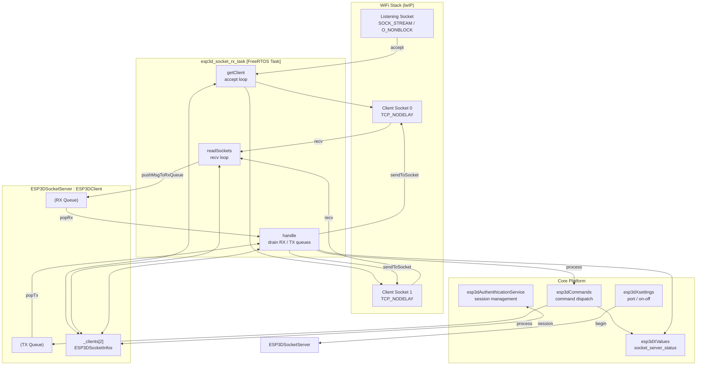
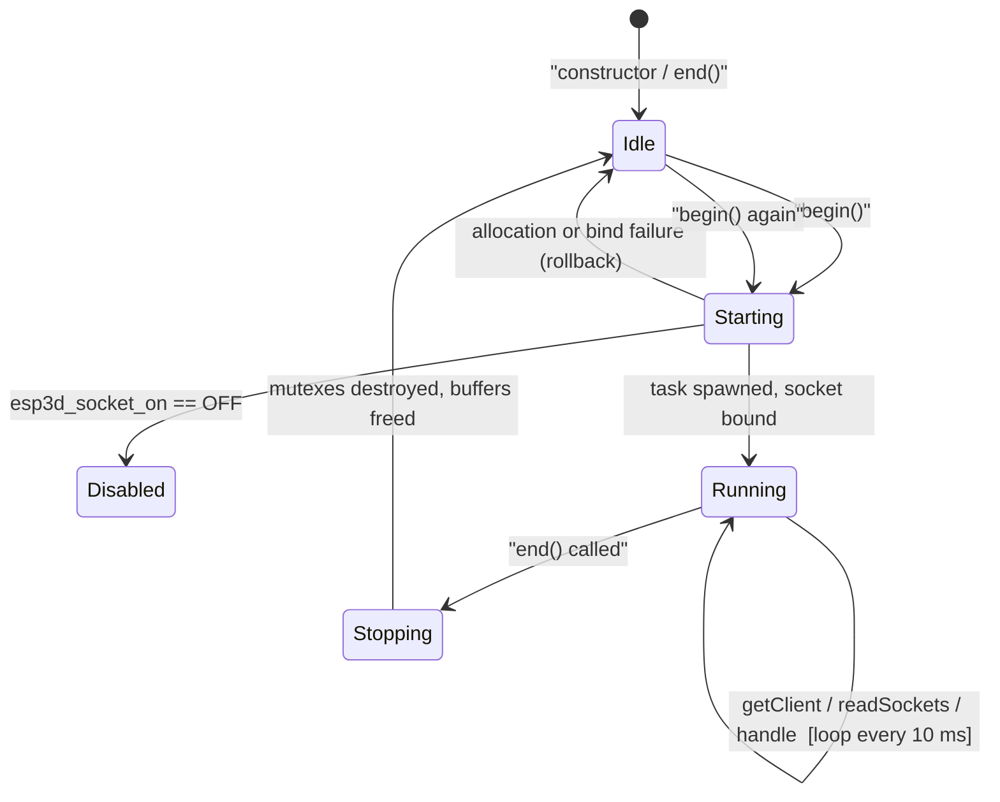
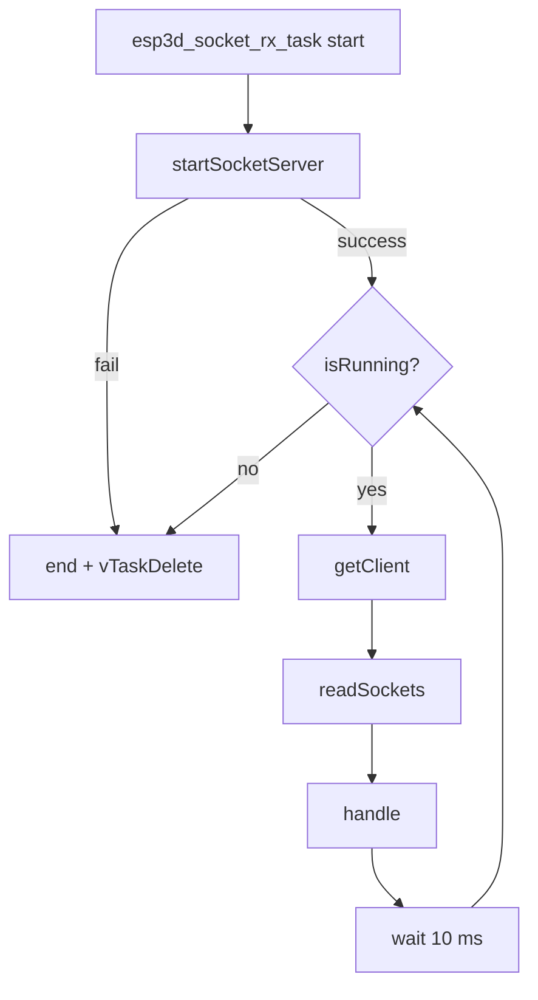
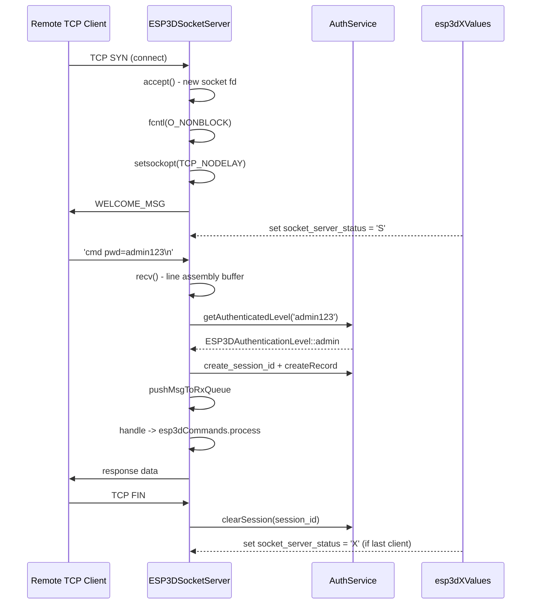
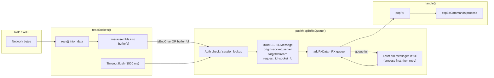
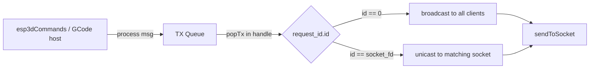
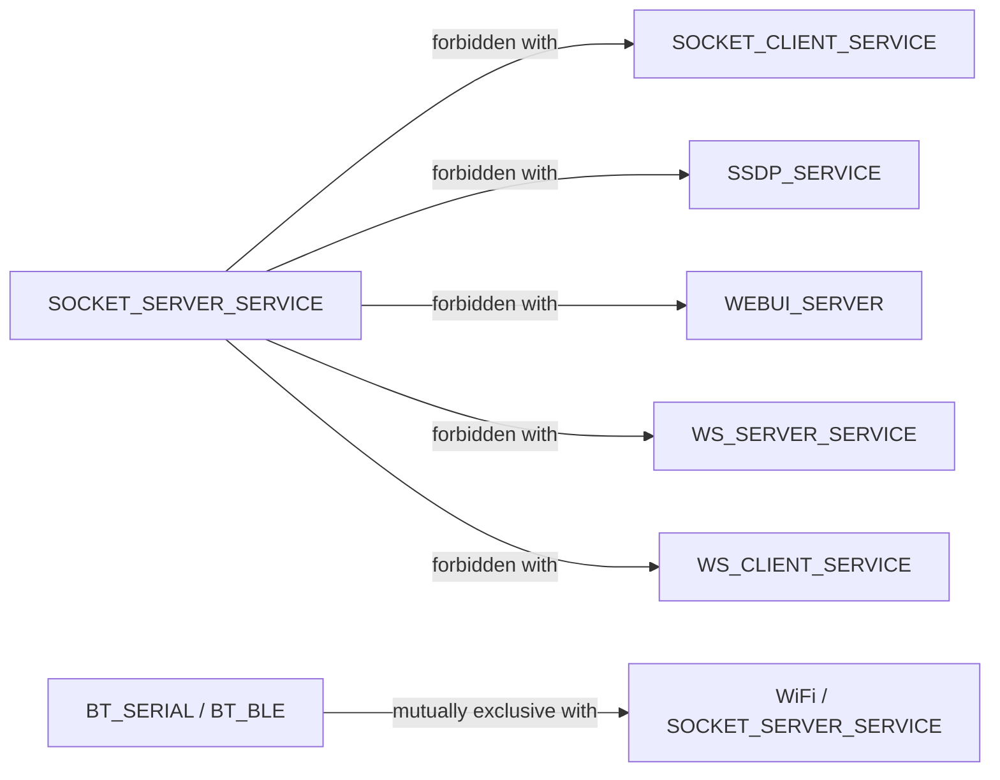
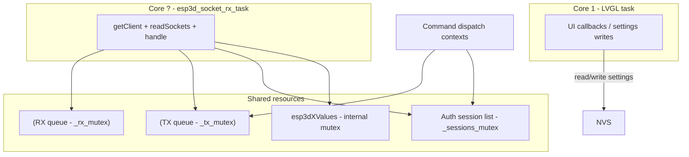

# Socket Server Module

## Introduction

The **socket_server** module (`main/modules/socket_server/`) implements a passive TCP socket server that accepts inbound connections from external tools — typically a PC-side terminal, a host script, or a debug client — and relays GCode commands to the CNC firmware while streaming firmware responses back to every connected client.

It is the **mirror opposite** of the [socket_client](socket_client.md) module: the socket client dials out to a remote CNC controller over WiFi, while the socket server *listens* and lets remote clients dial in. Only one of these two transports can be active in a given firmware build; see [Build Constraints](#build-constraints).

The server exposes a classic **telnet-style TCP interface**: plain text lines in, plain text responses out. It supports up to **two simultaneous clients**, non-blocking I/O, optional per-session authentication, and a bounded EAGAIN retry policy designed for ESP32's congested WiFi TX buffers.

---

## Architecture Overview



---

## Component Structure

### `ESP3DSocketInfos` (struct)

Defined in `esp3d_socket_server.h`. One instance exists **per client slot** in the `_clients[]` array.

| Field | Type | Description |
|---|---|---|
| `socket_id` | `int` | lwIP socket file descriptor; `FREE_SOCKET_HANDLE` (-1) when the slot is empty |
| `source_addr` | `struct sockaddr_storage` | Client IP address and port captured at `accept()` time |
| `session_id` | `char[25]` | Authentication session token *(only present when `ESP3D_AUTHENTICATION_FEATURE` is enabled)* |

### `ESP3DSocketServer` (class)

Extends [`ESP3DClient`](https://github.com/luc-github/Pibot-cnc-pendant-firmware/blob/main/docs/architecture/connection_management.md) which provides the dual-deque (RX/TX) message queuing infrastructure.

**Capacity constants:**

| Constant | Value | Meaning |
|---|---|---|
| `ESP3D_MAX_SOCKET_CLIENTS` | `2` | Maximum simultaneous TCP clients |
| `RX_FLUSH_TIME_OUT` | `1500 ms` | Force-flush partial line if no newline arrives within this window |
| `SEND_EAGAIN_TIMEOUT_MS` | `5000 ms` | Maximum time to retry a blocked `send()` before giving up |

**Key private members:**

| Member | Type | Description |
|---|---|---|
| `_listen_socket` | `int` | Main server socket (non-blocking); -1 when closed |
| `_clients[2]` | `ESP3DSocketInfos[]` | Client slot array |
| `_data` | `char*` | Shared raw receive buffer (`ESP3D_SOCKET_RX_BUFFER_SIZE + 1` bytes) |
| `_buffer` | `char**` | Per-client line-assembly buffers (2 x `ESP3D_SOCKET_RX_BUFFER_SIZE + 1`) |
| `_port` | `uint32_t` | TCP port read from NVS settings on `begin()` |
| `_started` | `bool` | True after `begin()` succeeds and the task is running |
| `_isRunning` | `bool` | Controls the RX task main loop; set to `false` by `end()` |
| `_xHandle` | `TaskHandle_t` | FreeRTOS task handle; `NULL` when the task has exited |
| `_tx_mutex` / `_rx_mutex` | `pthread_mutex_t` | Queue protection mutexes (created in `begin()`, destroyed in `end()`) |

---

## Lifecycle



### `begin()`

1. Reads `esp3d_socket_on` from NVS; if **OFF**, returns `true` immediately (`_started` stays `false`).
2. Sets RX queue max size to **4096 bytes**.
3. Creates `_rx_mutex` and `_tx_mutex` (pthreads).
4. Reads `esp3d_socket_port` from NVS into `_port`.
5. Allocates `_data` (raw read buffer) and `_buffer[0..1]` (line assembly buffers). On any allocation failure the entire allocation is rolled back.
6. Spawns `esp3d_socket_rx_task` pinned to `ESP3D_SOCKET_TASK_CORE`.
7. Sets `esp3dXValues` status to `"X"` (listening, no clients).

### `end()`

Handles both the normal external-call path and a self-call from within the RX task (start-failure path):

1. Sets `_isRunning = false` to signal the task loop to exit.
2. Closes all client sockets (`closeAllClients()`), which immediately unblocks any blocked `sendToSocket()` EAGAIN retry loop.
3. Clears RX and TX queues.
4. Clears all `socket_server` authentication sessions (if feature enabled).
5. Waits up to **1000 ms** for the RX task handle to become `NULL`; force-deletes if it does not.
6. Destroys both mutexes and NULLs their pointers in the base class.
7. Closes the listening socket.
8. Frees `_data` and `_buffer`.
9. Sets status to `"."` (stopped).

---

## FreeRTOS Task

```c
static void esp3d_socket_rx_task(void *pvParameter)
```

Pinned to `ESP3D_SOCKET_TASK_CORE`, stack `ESP3D_SOCKET_TASK_SIZE`, priority `ESP3D_SOCKET_TASK_PRIORITY`.



**`startSocketServer()`** performs:
- `socket(AF_INET, SOCK_STREAM, IPPROTO_IP)` — creates the TCP socket
- `fcntl(O_NONBLOCK)` — non-blocking so `accept()` never stalls the loop
- `bind()` to `INADDR_ANY : _port`
- `listen()` with backlog 1

---

## Client Connection Flow



### Authentication (optional)

When `ESP3D_AUTHENTICATION_FEATURE` is enabled:

- **First message** from a new client **must** include `pwd=<password>` as a parameter.
- The password is evaluated by `esp3dAuthenthicationService.getAuthenticatedLevel()`.
- On success: a 24-character session ID is created, stored in `client->session_id`, and a session record is inserted into the authentication service.
- On failure: `ERROR_MSG` is sent back, the message is **dropped** (the socket stays open for retry).
- Subsequent messages use the cached session record; no repeated password check.
- Sessions are cleared on `closeSocket()` and on `end()`.

When `ESP3D_AUTHENTICATION_FEATURE` is **disabled**, every message receives `ESP3DAuthenticationLevel::admin` automatically.

For the full authentication lifecycle, see [authentication_lifecycle.md](https://github.com/luc-github/Pibot-cnc-pendant-firmware/blob/main/docs/architecture/authentication_lifecycle.md).

---

## Data Flow

### RX Path (Receive to Command Dispatch)



**Line framing:** Characters accumulate in `_buffer[s]` until `'\n'` or `'\r'` is detected (`isEndChar()`) or the buffer is full (`ESP3D_SOCKET_RX_BUFFER_SIZE`). A 1500 ms idle timeout also triggers a flush, ensuring partial commands are not lost.

### TX Path (Response to Send)



**`sendToSocket()` internals:**
- Loops until all `len` bytes are written.
- On `EAGAIN`/`EWOULDBLOCK` (WiFi TX buffers full): sleeps `ESP3D_MINIMAL_WAIT` ms per retry, bounded by a **5000 ms deadline**. After the deadline, the send is abandoned and `false` is returned.
- Before every retry, re-validates that the socket fd is still owned by a client slot — prevents writing to a recycled file descriptor after a concurrent `closeAllClients()`.
- `send()` returning 0 is treated as a fatal stream error.

---

## Status Values

The server reports its state through the `ESP3DValuesIndex::socket_server_status` observable (see [connection_management.md](https://github.com/luc-github/Pibot-cnc-pendant-firmware/blob/main/docs/architecture/connection_management.md)):

| Status token | Meaning |
|---|---|
| `"."` | Server not started (disabled or after `end()`) |
| `"X"` | Listening, no clients connected |
| `"S"` | At least one client connected |
| `"F"` | Authentication failure on last connection attempt |

The [connection_status_screen](https://github.com/luc-github/Pibot-cnc-pendant-firmware/blob/main/docs/architecture/screens_architecture.md) subscribes to this value to display the server state in the UI.

---

## Settings

Both settings are managed by `ESP3DSettings` and stored in NVS.

| Setting index | Type | Description |
|---|---|---|
| `esp3d_socket_on` | `uint8_t` | `ESP3DState::on` to enable the server; any other value skips `begin()` |
| `esp3d_socket_port` | `uint32_t` | TCP port the server binds to (typically 23 for telnet-style access) |

These settings are editable from the UI via the settings list screen (`onServerPortClick` / `onServerAddressClick`). See [screens_architecture.md](https://github.com/luc-github/Pibot-cnc-pendant-firmware/blob/main/docs/architecture/screens_architecture.md) for the UI flow.

---

## Build Constraints

The socket server is guarded by the `SOCKET_SERVER_SERVICE` CMake option and is subject to the mutual-exclusion rules enforced in `cmake/sanity_check.cmake`.



- **`SOCKET_SERVER_SERVICE` + `SOCKET_CLIENT_SERVICE`** — two concurrent WiFi TCP transports exceed available DRAM on this board.
- **WiFi + Bluetooth** — hardware restriction; no PSRAM on the target board.

For the default PiBot CNC pendant build, `SOCKET_SERVER_SERVICE` is **OFF** (WebUI + SSDP are active instead). Enable it only when using the pendant as a telnet endpoint without a web interface.

See `docs/features/feature_resource_matrix.md` for the full compatibility matrix.

---

## Memory Layout

All buffers are heap-allocated in `begin()` and freed in `end()` with full rollback on any partial failure.

```
_data                 ->  char[ESP3D_SOCKET_RX_BUFFER_SIZE + 1]   (shared raw recv buffer)
_buffer               ->  char*[2]                                  (pointer array, calloc)
  _buffer[0]          ->  char[ESP3D_SOCKET_RX_BUFFER_SIZE + 1]   (line buffer for client 0)
  _buffer[1]          ->  char[ESP3D_SOCKET_RX_BUFFER_SIZE + 1]   (line buffer for client 1)
_rx_mutex             ->  pthread_mutex_t  (stack, initialized in begin())
_tx_mutex             ->  pthread_mutex_t  (stack, initialized in begin())
_clients[0..1]        ->  ESP3DSocketInfos (stack, zeroed in constructor)
```

`calloc` is used for the `_buffer` pointer array specifically so that the rollback loop in `begin()` can safely call `free(_buffer[s])` on un-initialized slots (they are guaranteed to be `NULL`). For ESP32 memory constraint guidance, see `docs/guides/esp32_memory_constraints.md`.

---

## Concurrency Model



- **RX and TX queues** are protected by dedicated pthread mutexes registered with the base class via `setRxMutex()` / `setTxMutex()`.
- **Authentication session list** is protected by `esp3dAuthenthicationService`'s internal `_sessions_mutex`.
- **`esp3dXValues`** has its own internal mutex; `set_value()` is safe to call from any task.
- `_clients[]`, `_data`, and `_buffer` are **only accessed from the RX task**; no external locking is needed for them.
- `end()` waits for the RX task to exit (up to 1000 ms) **before** destroying mutexes and freeing buffers, preventing use-after-free.

---

## Relationships to Other Modules

| Module | Relationship |
|---|---|
| [socket_client.md](socket_client.md) | Sibling transport — mutually exclusive at build time; the client dials out, the server accepts inbound connections |
| [connection_management.md](https://github.com/luc-github/Pibot-cnc-pendant-firmware/blob/main/docs/architecture/connection_management.md) | `ESP3DClient` base class provides dual-deque message queues and mutex helpers |
| [gcode_host_architecture.md](https://github.com/luc-github/Pibot-cnc-pendant-firmware/blob/main/docs/architecture/gcode_host_architecture.md) | Ultimately receives routed commands from the server's RX queue via `esp3dCommands` |
| [gcode_host_streaming_flow.md](https://github.com/luc-github/Pibot-cnc-pendant-firmware/blob/main/docs/architecture/gcode_host_streaming_flow.md) | Streaming flow that produces TX messages directed at specific socket fds |
| [authentication_lifecycle.md](https://github.com/luc-github/Pibot-cnc-pendant-firmware/blob/main/docs/architecture/authentication_lifecycle.md) | Session creation, lookup, and teardown per connected client |
| [screens_architecture.md](https://github.com/luc-github/Pibot-cnc-pendant-firmware/blob/main/docs/architecture/screens_architecture.md) | `connection_status_screen` subscribes to `socket_server_status`; `settings_list_screen` edits port/enable settings |
| [websockets_protocol.md](https://github.com/luc-github/Pibot-cnc-pendant-firmware/blob/main/docs/architecture/websockets_protocol.md) | Alternative WebSocket-based transport; cannot coexist with socket server in the same build |
| `docs/features/feature_resource_matrix.md` | Full WiFi / CNC transport compatibility matrix and resource ticket accounting |
| `docs/guides/esp32_memory_constraints.md` | Heap fragmentation guidance relevant to the multi-buffer allocation strategy |

---

## API Reference

### Public Methods

| Method | Description |
|---|---|
| `bool begin()` | Read settings, allocate resources, spawn task. Returns `true` on success or when the server is intentionally disabled. |
| `void end()` | Signal task exit, close all sockets, destroy mutexes, free buffers. Safe to call from any task including the RX task itself. |
| `void handle()` | Drain one RX message (to `esp3dCommands`) and one TX message (to sockets). Called every 10 ms from the RX task. |
| `void process(ESP3DMessage* msg)` | Enqueue an outbound message by priority; calls `flush()` after enqueue. |
| `void flush()` | No-op (retained for API compatibility with `ESP3DClient`). |
| `bool startSocketServer()` | Create, bind, and listen on the TCP socket. Called once by the RX task. |
| `bool getClient()` | Accept one pending connection, configure it (non-blocking, TCP_NODELAY), send welcome message. |
| `void readSockets()` | Non-blocking `recv` on all active client sockets; assemble lines into per-client buffers. |
| `bool pushMsgToRxQueue(uint index, const uint8_t* msg, size_t size)` | Auth-check and enqueue a complete received line into the RX queue. |
| `uint clientsConnected()` | Return the count of currently active client slots. |
| `bool isConnected()` | Return `true` if at least one client is connected. |
| `bool isRunning()` | Return `true` while the task loop is active. |
| `bool started()` | Return `true` after a successful `begin()`. |
| `uint32_t port()` | Return the currently configured TCP port. |
| `ESP3DSocketInfos* getClientInfos(uint index)` | Return a pointer to the client info struct for slot `index`, or `nullptr` if the slot is empty. |
| `void closeAllClients()` | Close every active client socket (called by `end()` and on forced teardown). |
| `void resetTaskHandle()` | Set `_xHandle = NULL`; called by the RX task immediately before `vTaskDelete(NULL)`. |

---

## Compile-Time Macros

| Macro | Default | Effect |
|---|---|---|
| `ESP3D_MAX_SOCKET_CLIENTS` | `2` | Maximum simultaneous TCP clients |
| `DISABLE_TELNET_WELCOME_MESSAGE` | *(not defined)* | Define to suppress the welcome banner sent on client connect |
| `ESP3D_AUTHENTICATION_FEATURE` | build-time | Enables password-based per-session authentication |
| `KEEPALIVE_IDLE` | `5` | TCP keep-alive idle seconds (defined; `setsockopt` call not yet applied) |
| `KEEPALIVE_INTERVAL` | `5` | TCP keep-alive interval seconds (reserved for future use) |
| `KEEPALIVE_COUNT` | `1` | TCP keep-alive retry count (reserved for future use) |

---

## Known Limitations and Design Notes

- **`SO_REUSEADDR` commented out** — the workaround for "address already in use" after a quick restart is commented out with a reference to ESP-IDF issue `#6394`. A rapid `end()` → `begin()` cycle may experience a brief port-unavailable window depending on lwIP's TIME_WAIT state.
- **TCP keep-alive not applied** — the `KEEPALIVE_*` constants are defined but the corresponding `setsockopt(SO_KEEPALIVE, ...)` calls are absent. Stale clients are detected only when `recv()` or `send()` fails or returns 0.
- **Broadcast semantics** — a TX message with `request_id.id == 0` is sent to **all** connected clients. The GCode host sets the correct socket fd in `request_id` so responses are unicast; command acknowledgments from `[ESP...]` commands may be broadcast depending on origin.
- **Queue eviction on RX full** — when the RX queue is full, the oldest messages are eagerly processed by `esp3dCommands` rather than discarded, preserving command ordering under backpressure at the cost of extra latency on the processing path.
- **IPv4 only** — the server binds `AF_INET` / `INADDR_ANY` only. IPv6 is not supported.
