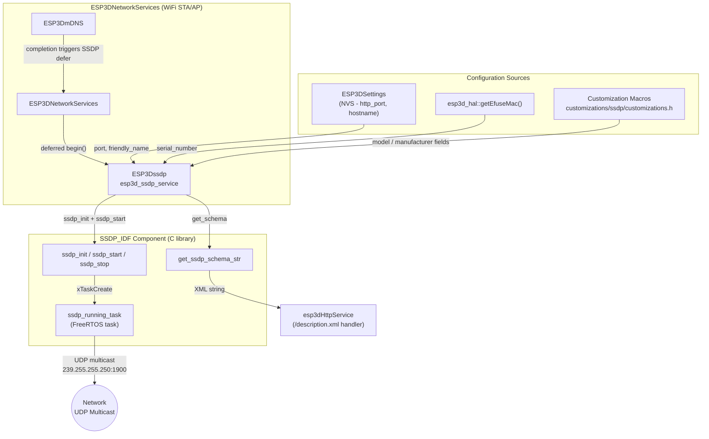
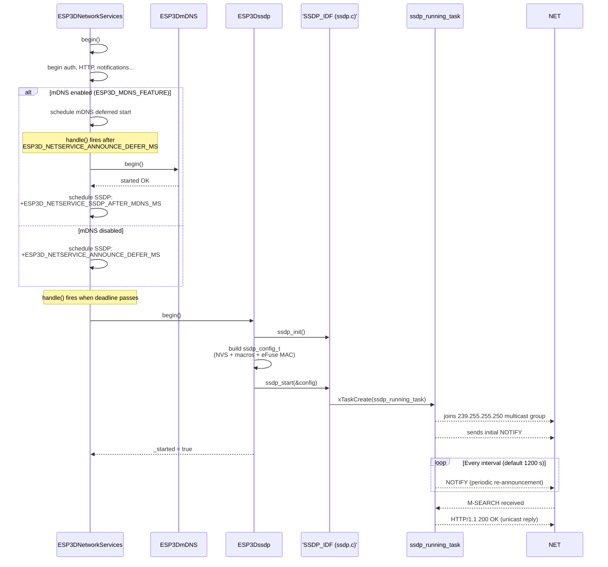
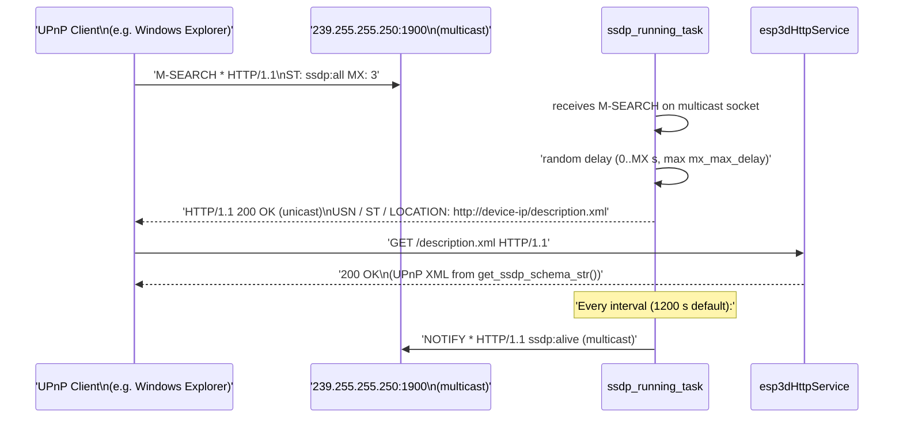

# SSDP Service — ESP3D-X Reference

Build guard: `ESP3D_SSDP_FEATURE`  
CMake option: `SSDP_SERVICE` (default **ON**)  
Global instance: `esp3d_ssdp_service`

---

## Overview

The SSDP (Simple Service Discovery Protocol) module broadcasts the device's presence on the local network using the UPnP-based SSDP standard over UDP multicast. It enables automatic discovery by Windows Network Explorer, UPnP-aware clients, and any tool that listens on the SSDP multicast address (`239.255.255.250:1900`).

The module is a thin wrapper around the `SSDP_IDF` component (a FreeRTOS-native, IDF-compatible SSDP library). `ESP3Dssdp` configures the library from NVS settings and firmware identity macros, then delegates the UDP multicast loop to a self-contained `SSDP_IDF` FreeRTOS task. No polling is needed from the application: `handle()` is a no-op.

SSDP complements [mDNS](mdns.md) as the second network-announcement service. When both are enabled, SSDP starts **after** mDNS has finished initializing, with a configurable stagger delay, to spread RAM allocation peaks.

---

## Architecture



---

## Component Layers

| Layer | File(s) | Language | Role |
|---|---|---|---|
| Application wrapper | `main/modules/ssdp/esp3d_ssdp.h` / `.cpp` | C++ | Lifecycle management, config assembly |
| Protocol library | `components/SSDP_IDF/ssdp.c` / `include/ssdp.h` | C | UDP multicast, NOTIFY, M-SEARCH response |
| Customization | `customizations/ssdp/customizations.h` | C (macros) | Board/product identity overrides |
| Network orchestration | `main/modules/network/esp3d_network_services.cpp` | C++ | Deferred startup and shutdown sequencing |

---

## Startup Flow

SSDP is always started in a **deferred** manner to avoid RAM-allocation contention with other services that initialize earlier (HTTP, auth, mDNS).



---

## SSDP_IDF Task Behaviour

The `ssdp_running_task` runs as an independent FreeRTOS task for the entire lifetime of the SSDP service. It:

1. Creates a UDP multicast socket and joins the SSDP multicast group (`239.255.255.250:1900`).
2. Enters a `select()` loop with a 2-second timeout.
3. On receiving a datagram, calls `onPacket()`:
   - Parses `M-SEARCH` requests (device discovery from clients).
   - Replies with a unicast `HTTP/1.1 200 OK` response containing UPnP device description fields.
   - Respects the `MX` header by applying a random delay capped at `mx_max_delay` (default 10 000 ms).
4. Sends periodic `NOTIFY` datagrams every `interval` seconds (default 1 200 s = 20 minutes) to keep the device visible in client caches.
5. On socket error, closes and re-opens the socket automatically (self-healing loop).

---

## Configuration Fields

The `ssdp_config_t` struct maps directly to UPnP device description fields. `SDDP_DEFAULT_CONFIG()` sets safe defaults; `ESP3Dssdp::begin()` overrides the fields below.

### Fields overridden at runtime by `begin()`

| Field | Source | Example |
|---|---|---|
| `friendly_name` | `esp3dWifiClient.getHostName()` (NVS hostname) | `"pendant-001"` |
| `serial_number` | `esp3d_hal::getEfuseMac()` as decimal string | `"3927502938"` |
| `port` | NVS setting `esp3d_http_port` | `80` |
| `model_name` | `ESP3D_MODEL_NAME` macro **or** `TFT_TARGET` | `"pibot_pendant_v1_0"` |
| `model_number` | `ESP3D_MODEL_NUMBER` macro **or** `ESP3D_X_VERSION` | `"2.0.0.a14"` |
| `model_url` | `ESP3D_MODEL_URL` macro **or** `ESP3D_X_FW_URL` | GitHub firmware URL |
| `model_description` | `ESP3D_MODEL_DESCRIPTION` macro (optional) | `"ESP32 CNC Pendant"` |
| `manufacturer_name` | `ESP3D_MANUFACTURER_NAME` macro | `"Espressif Systems"` |
| `manufacturer_url` | `ESP3D_MANUFACTURER_URL` macro | `"https://www.espressif.com"` |
| `device_type` | Hardcoded to `"rootdevice"` | `"rootdevice"` |

### Fields kept at default values

| Field | Default value | Notes |
|---|---|---|
| `task_priority` | `tskIDLE_PRIORITY + 5` | FreeRTOS task priority |
| `stack_size` | `4096` bytes | Task stack size |
| `core_id` | `tskNO_AFFINITY` | Floats between Core 0 and Core 1 |
| `ttl` | `2` | IP TTL for multicast packets |
| `interval` | `1200` s | NOTIFY re-announcement interval |
| `mx_max_delay` | `10000` ms | Max random M-SEARCH response delay |
| `schema_url` | `"description.xml"` | URL path served by HTTP service |
| `presentation_url` | `"/"` | Device UI URL |
| `server_name` | `"SSDPServer/1.0"` | HTTP Server header value |
| `uuid_root` / `uuid` | `NULL` | Auto-generated from MAC by SSDP_IDF |
| `services_description` | `NULL` | UPnP service list (not used) |
| `icons_description` | `NULL` | UPnP icon list (not used) |

---

## Customizing Device Identity

Override macros in `customizations/ssdp/customizations.h` to change how the device identifies itself to discovery clients. All macros are optional; fallbacks are used when undefined.

```c
// #define ESP3D_MODEL_NAME        "My CNC Pendant"       // fallback: TFT_TARGET
// #define ESP3D_MODEL_NUMBER      "v2.0"                 // fallback: ESP3D_X_VERSION
// #define ESP3D_MODEL_URL         "https://example.com"  // fallback: ESP3D_X_FW_URL
// #define ESP3D_MODEL_DESCRIPTION "ESP32 Pendant"        // optional, Windows ignores it

#define ESP3D_MANUFACTURER_NAME  "Espressif Systems"   // already set in default customizations
#define ESP3D_MANUFACTURER_URL   "https://www.espressif.com"
```

Board-specific overrides (e.g. for `pibot_pendant_v1_0`) are placed in that board's own `customizations/ssdp/customizations.h`.

---

## Schema XML

The SSDP_IDF library builds an XML device description string (the UPnP schema) from the `ssdp_config_t` fields at `ssdp_start()` time. `ESP3Dssdp::get_schema()` exposes this string so the HTTP service can serve it at `/description.xml` when a discovery client fetches the URL carried in the SSDP response's `LOCATION` header.

```
ESP3Dssdp::get_schema()
  └── get_ssdp_schema_str()        ← C function from SSDP_IDF
        └── returns pre-built XML string stored in task config buffer
```

The URL path (`"description.xml"`) is baked into the SSDP response via the `schema_url` config field and matches the handler registered in `esp3dHttpService`.

---

## Build Integration

### CMake option

Defined in `CMakeLists.txt`:

```cmake
OPTION(SSDP_SERVICE "SSDP service" ON)
```

### Compile define

Set by `cmake/features.cmake` when both `WIFI_SERVICE` and `SSDP_SERVICE` are ON:

```cmake
if(WIFI_SERVICE)
    if(SSDP_SERVICE)
        add_compile_options(-DESP3D_SSDP_FEATURE=1)
    endif()
endif()
```

SSDP requires WiFi to be present — the define is nested inside the `WIFI_SERVICE` block and is **not** set when WiFi is disabled.

### Mutual exclusion with `SOCKET_CLIENT_SERVICE`

`cmake/sanity_check.cmake` enforces a hard build error if both are enabled simultaneously:

```cmake
if(WIFI_SERVICE AND SOCKET_CLIENT_SERVICE)
    if(SSDP_SERVICE)
        message(FATAL_ERROR "SSDP_SERVICE cannot be enabled with SOCKET_CLIENT_SERVICE. ...")
    endif()
endif()
```

**Rationale:** When `SOCKET_CLIENT_SERVICE` is ON, WiFi STA is reserved exclusively for the outgoing TCP connection to the CNC controller (FluidNC / grblHAL over TCP). Running SSDP multicast simultaneously creates lwIP stack contention and increases the minimum-free-heap risk. See [Network_&_Web_Services.md](Network_and_Web_Services.md) and the feature resource matrix (`docs/features/feature_resource_matrix.md`) §2.1 for the full analysis.

### Default build profiles

| Profile | `SOCKET_CLIENT_SERVICE` | `SSDP_SERVICE` |
|---|---|---|
| Serial/USB CNC + WiFi remote (**default**) | OFF | **ON** |
| WiFi TCP CNC (socket client) | ON | OFF (blocked by sanity check) |

---

## Data Flow — Discovery Sequence



---

## Integration With Network Services

`esp3d_ssdp_service` is owned and driven by `ESP3DNetworkServices`. The relevant control flow in `esp3d_network_services.cpp`:

```
ESP3DNetworkServices::begin()
  ├─ ESP3D_MDNS_FEATURE ON  → defers mDNS; after mDNS done, defers SSDP by ESP3D_NETSERVICE_SSDP_AFTER_MDNS_MS
  └─ ESP3D_MDNS_FEATURE OFF → defers SSDP by ESP3D_NETSERVICE_ANNOUNCE_DEFER_MS

ESP3DNetworkServices::handle()   ← called every 10 ms from networkTask
  └─ _ssdp_defer_pending && millis() >= deadline → esp3d_ssdp_service.begin()

ESP3DNetworkServices::end()
  └─ _ssdp_defer_pending = false        ← cancels any pending deferred start
     esp3d_ssdp_service.end()           ← stops running service if started
```

The defer mechanism prevents RAM-allocation peaks. Auth, HTTP, mDNS, and SSDP each allocate task stacks and heap buffers. Staggering their starts allows the allocator to service each request from a less-fragmented heap. See `docs/guides/esp32_memory_constraints.md` for the general fragmentation model.

---

## `ESP3Dssdp` Class API

Declared in `main/modules/ssdp/esp3d_ssdp.h`.

| Method | Description |
|---|---|
| `bool begin()` | Initialises SSDP_IDF, assembles `ssdp_config_t`, starts multicast task. Returns `true` on success. Calls `end()` first if already started. |
| `void handle()` | **No-op.** The SSDP_IDF task is self-contained; no application-level polling is required. |
| `void end()` | Calls `ssdp_stop()`, sets `_started = false`. Called by the destructor and by `ESP3DNetworkServices::end()`. |
| `const char* get_schema()` | Returns the pre-built UPnP XML schema string generated by SSDP_IDF. Used by the HTTP service to respond to `GET /description.xml`. |
| `bool started()` | Returns `_started`. Inline accessor. |

---

## Related Documentation

| Document | Relevance |
|---|---|
| [mdns.md](mdns.md) | Parallel discovery service; SSDP starts after mDNS when both are enabled |
| [Network_&_Web_Services.md](Network_and_Web_Services.md) | Parent module overview; network service orchestration |
| [network.md](network.md) | `ESP3DNetwork` — WiFi lifecycle that must be up before SSDP starts |
| [wifi.md](wifi.md) | WiFi STA/AP driver layer; provides the network interface SSDP uses |

---

## Files

| File | Role |
|---|---|
| `main/modules/ssdp/esp3d_ssdp.h` | `ESP3Dssdp` class declaration; global `esp3d_ssdp_service` |
| `main/modules/ssdp/esp3d_ssdp.cpp` | `begin()` / `end()` / `get_schema()` implementation |
| `customizations/ssdp/customizations.h` | Optional product-identity macros (`ESP3D_MODEL_NAME`, etc.) |
| `components/SSDP_IDF/include/ssdp.h` | `ssdp_config_t`, `SDDP_DEFAULT_CONFIG()`, C API declarations |
| `components/SSDP_IDF/ssdp.c` | `ssdp_running_task`, multicast socket, NOTIFY / M-SEARCH logic |
| `main/modules/network/esp3d_network_services.cpp` | Deferred start / stop sequencing |
| `cmake/features.cmake` | `ESP3D_SSDP_FEATURE` compile define |
| `cmake/sanity_check.cmake` | Mutual-exclusion check with `SOCKET_CLIENT_SERVICE` |
