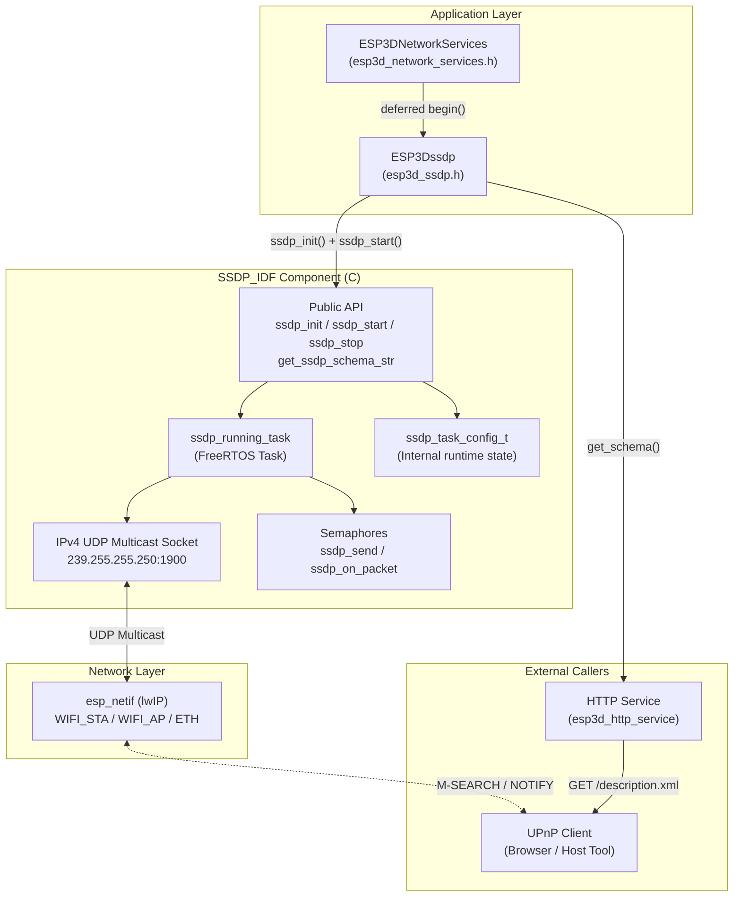
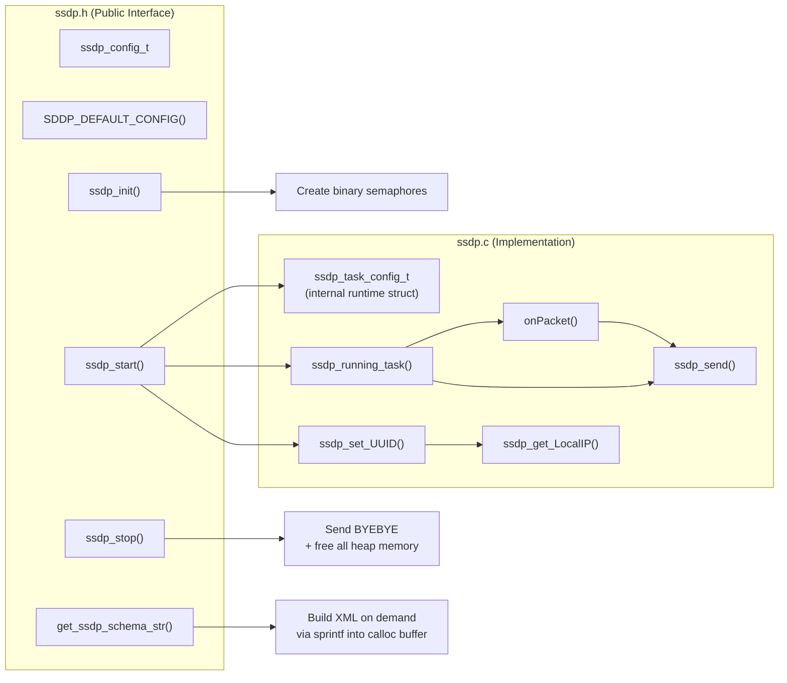
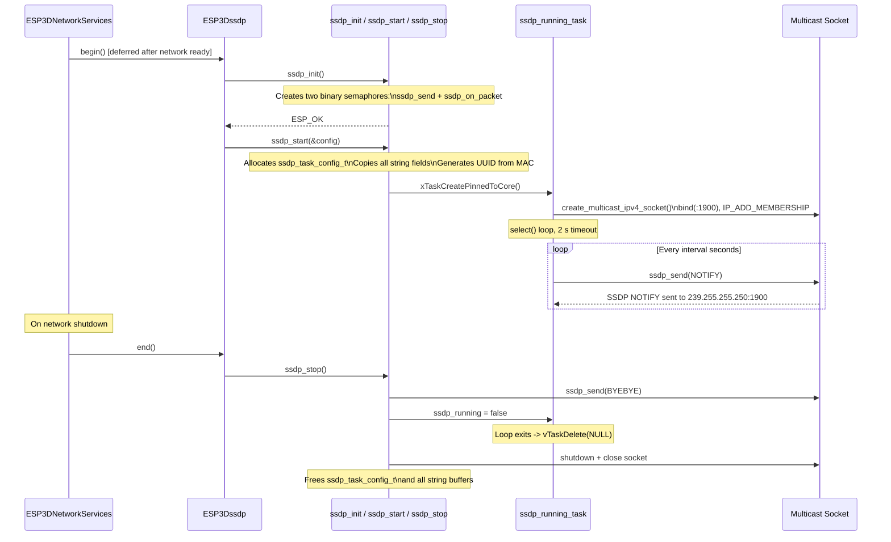
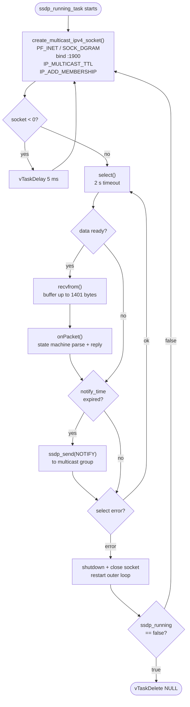
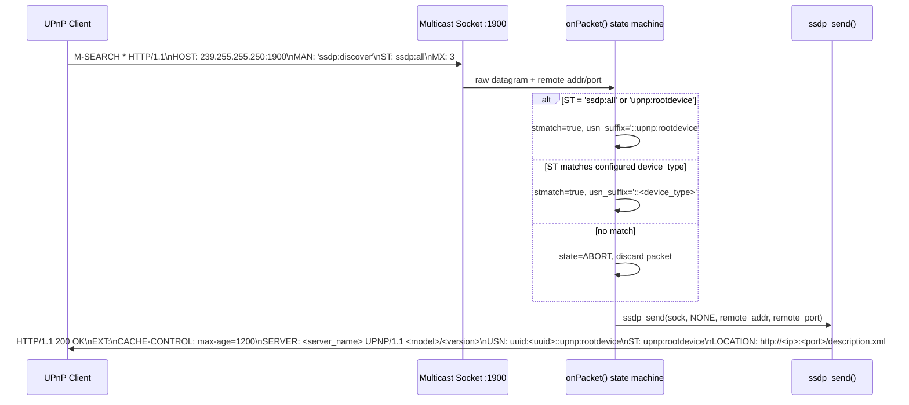
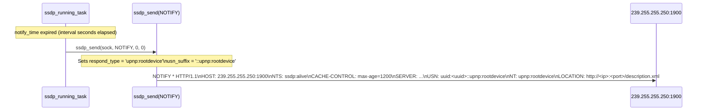
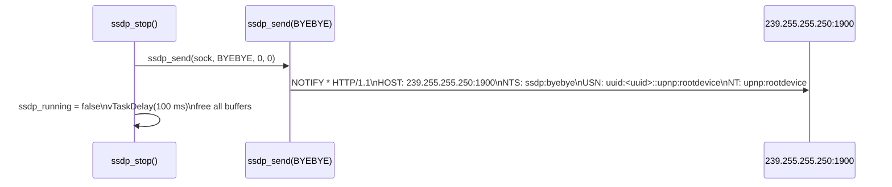
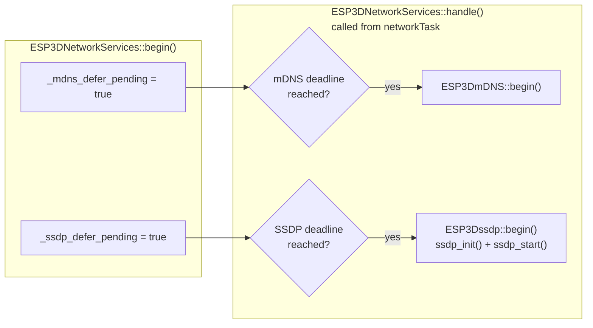

# SSDP Service

The SSDP Service module provides a complete, self-contained implementation of the **Simple Service Discovery Protocol (SSDP)** for ESP-IDF. SSDP is the discovery layer of the UPnP protocol stack. It enables the pendant to advertise itself on the local network so that host tools, browsers, and control panels can automatically discover the device's HTTP endpoint without requiring manual IP address entry.

The module is structured in two layers:

- **`components/SSDP_IDF/`** — A portable, pure-C ESP-IDF component that implements the SSDP wire protocol using lwIP sockets, FreeRTOS tasks, and semaphores.
- **`main/modules/ssdp/esp3d_ssdp.h`** (`ESP3Dssdp`) — A thin C++ wrapper that integrates the component into the application's service lifecycle, reading device identity from ESP3DSettings and coordinating startup through `ESP3DNetworkServices`.

> **Build constraint:** `SSDP_SERVICE` is enabled by default for the serial/USB CNC + WiFi remote configuration. It is **mutually exclusive** with `SOCKET_CLIENT_SERVICE` — see `cmake/sanity_check.cmake`. Do not enable both. Refer to [feature_resource_matrix.md](https://github.com/luc-github/Pibot-cnc-pendant-firmware/blob/main/docs/features/feature_resource_matrix.md) before changing transport policy.

---

## Architecture Overview



---

## Component Structure



---

## Two-Layer Design

| Layer | File | Language | Role |
|---|---|---|---|
| **Application wrapper** | `main/modules/ssdp/esp3d_ssdp.h` | C++ | Reads settings, integrates with `ESP3DNetworkServices`, manages deferred start |
| **Protocol component** | `components/SSDP_IDF/ssdp.c/.h` | C | Implements the SSDP wire protocol, owns the FreeRTOS task and socket |

The wrapper calls `ssdp_init()` once during firmware boot and `ssdp_start()` when the network is ready, passing a populated `ssdp_config_t`. The component is stateless from the wrapper's perspective — all runtime state lives inside the internal `ssdp_task_config_t` heap allocation, which is fully freed by `ssdp_stop()`.

---

## Configuration Reference — `ssdp_config_t`

Defined in `components/SSDP_IDF/include/ssdp.h`. All string fields are **copied** into internal heap buffers during `ssdp_start()` so caller-owned strings can be freed immediately after the call returns.

### Task Parameters

| Field | Type | Default | Description |
|---|---|---|---|
| `task_priority` | `unsigned` | `tskIDLE_PRIORITY + 5` | FreeRTOS task priority |
| `stack_size` | `size_t` | `4096` | Stack size in bytes for the SSDP task |
| `core_id` | `BaseType_t` | `tskNO_AFFINITY` | CPU core affinity (`0`, `1`, or `tskNO_AFFINITY`) |

### Protocol Parameters

| Field | Type | Default | Description |
|---|---|---|---|
| `ttl` | `uint8_t` | `2` | UDP multicast TTL (hops) |
| `port` | `uint16_t` | `80` | HTTP port advertised in SSDP LOCATION header |
| `interval` | `uint32_t` | `1200` | Periodic NOTIFY interval in seconds |
| `mx_max_delay` | `uint16_t` | `10000` | Maximum MX response delay in milliseconds |

### Device Identity

| Field | Type | Max Length | Description |
|---|---|---|---|
| `uuid_root` | `const char*` | 27 chars | Root prefix for MAC-derived UUID (must match `SSDP_UUID_ROOT` length exactly) |
| `uuid` | `const char*` | 36 chars | Full UUID override; if set, `uuid_root` is ignored |
| `device_type` | `const char*` | 64 chars | UPnP device type (e.g. `"Basic"`) |
| `friendly_name` | `const char*` | 64 chars | Human-readable device name shown in discovery results |
| `serial_number` | `const char*` | 32 chars | Device serial number |

### URLs

| Field | Type | Max Length | Description |
|---|---|---|---|
| `schema_url` | `const char*` | 64 chars | Path to UPnP XML schema (e.g. `"description.xml"`) |
| `presentation_url` | `const char*` | 128 chars | Browser landing page URL |
| `manufacturer_url` | `const char*` | 128 chars | Manufacturer website |
| `model_url` | `const char*` | 128 chars | Model information URL |

### Device Details

| Field | Type | Max Length | Description |
|---|---|---|---|
| `manufacturer_name` | `const char*` | 64 chars | Manufacturer display name |
| `model_name` | `const char*` | 64 chars | Model name |
| `model_number` | `const char*` | 32 chars | Model number / firmware version |
| `model_description` | `const char*` | 64 chars | Short device description |
| `server_name` | `const char*` | 64 chars | SERVER header string (e.g. `"SSDPServer/1.0"`) |
| `services_description` | `const char*` | 256 chars | Raw XML `<serviceList>` content |
| `icons_description` | `const char*` | 256 chars | Raw XML `<iconList>` content |

**Default configuration macro:**

```c
ssdp_config_t cfg = SDDP_DEFAULT_CONFIG();
// Override as needed:
cfg.port          = 80;
cfg.friendly_name = "Pibot Pendant";
cfg.model_name    = "PibotCNC";
ssdp_start(&cfg);
```

---

## Lifecycle and Process Flow



---

## Internal Task Architecture

`ssdp_running_task` is the core of the component. It runs a **select-based socket loop** with a 2-second timeout, handling both incoming discovery packets and outgoing periodic notifications. If the socket fails (e.g. network down), the loop closes it and retries socket creation from scratch.



### Semaphore Protection

Two binary semaphores prevent concurrent send operations or concurrent packet processing:

| Semaphore | Guards | Held during |
|---|---|---|
| `ssdp_send_xSemaphore` | `ssdp_send()` | Entire datagram construction + `sendto()` |
| `ssdp_on_packet_xSemaphore` | `onPacket()` | Full M-SEARCH parse + response dispatch |

Both are taken with a 10-tick timeout. Failure to acquire is logged as an error and the operation is silently skipped for that cycle.

---

## SSDP Message Flow

### M-SEARCH Discovery (Incoming)

When a UPnP client sends an M-SEARCH datagram to `239.255.255.250:1900`, `onPacket()` parses it using a character-by-character state machine (`METHOD -> URI -> PROTO -> KEY -> VALUE`) and dispatches a unicast HTTP/1.1 response back to the querying host.



### Periodic NOTIFY (Outgoing)

Every `interval` seconds the task sends an unsolicited `ssdp:alive` advertisement to the SSDP multicast group, allowing all UPnP clients on the subnet to refresh their device table without polling.



### BYEBYE (Shutdown)

Sent once during `ssdp_stop()` to signal removal from the network before the socket is closed. This allows UPnP clients to immediately remove the device from their lists rather than waiting for the cache to expire.



---

## UUID Generation

The device UUID is derived deterministically from the ESP32's fused MAC address. `ssdp_set_UUID()` reads the MAC via `esp_efuse_mac_get_default()` and appends the lower three bytes (indices 2, 1, 0) as hex digits to a configurable root prefix.

```
Default root:  "38323636-4558-4dda-9188-cda0e6"
MAC bytes 2-0:  XX  YY  ZZ
Result UUID:   "38323636-4558-4dda-9188-cda0e6XXYYZZ"
```

This ensures each physical device has a unique, stable UUID without requiring NVS storage. UUID selection priority:

1. `configuration->uuid` set (exactly 36 chars) — used verbatim.
2. `configuration->uuid_root` set (exactly 27 chars) — combined with MAC suffix.
3. Neither set — `SSDP_UUID_ROOT` default prefix + MAC suffix.

---

## UPnP XML Schema

`get_ssdp_schema_str()` dynamically builds the UPnP device description XML that HTTP clients retrieve from the LOCATION URL (typically `GET /description.xml`). The XML follows the UPnP 1.1 device schema:

```xml
<?xml version="1.0"?>
<root xmlns="urn:schemas-upnp-org:device-1-0">
  <specVersion><major>1</major><minor>0</minor></specVersion>
  <URLBase>http://<ip>:<port>/</URLBase>
  <device>
    <deviceType>urn:schemas-upnp-org:device:<device_type>:1</deviceType>
    <friendlyName>...</friendlyName>
    <presentationURL>...</presentationURL>
    <serialNumber>...</serialNumber>
    <modelName>...</modelName>
    <modelDescription>...</modelDescription>
    <modelNumber>...</modelNumber>
    <modelURL>...</modelURL>
    <manufacturer>...</manufacturer>
    <manufacturerURL>...</manufacturerURL>
    <UDN>uuid:...</UDN>
    <serviceList>...</serviceList>
    <iconList>...</iconList>
  </device>
</root>
```

> **Memory note:** The schema buffer is allocated fresh on every call and the previous allocation is freed first. The caller must **not** free the returned pointer and must not cache it across calls. Verify available heap before calling in low-memory conditions.

---

## Integration with Network Services

`ESP3DNetworkServices` owns all discovery services (mDNS and SSDP) and manages their deferred startup. Both are flagged pending at `begin()` and actually started only once the network interface is confirmed ready.



See [mdns.md](mdns.md) for the companion mDNS service that runs alongside SSDP. For the full network lifecycle, see [connection_management.md](https://github.com/luc-github/Pibot-cnc-pendant-firmware/blob/main/docs/architecture/connection_management.md).

---

## Build Constraints

| Condition | SSDP state | Notes |
|---|---|---|
| `SOCKET_CLIENT_SERVICE=OFF` (default) | **Enabled** | Serial/USB CNC + WiFi remote configuration |
| `SOCKET_CLIENT_SERVICE=ON` | **Forbidden** | `sanity_check.cmake` hard-blocks this combination |
| Bluetooth mode active | **N/A** | WiFi stack absent; SSDP does not compile or start |

When `SOCKET_CLIENT_SERVICE` is ON, the WiFi stack is fully committed to the TCP CNC link. Running SSDP multicast on the same interface increases fragmentation risk and can cause `EAGAIN` errors on the lwIP stack. See [esp32_memory_constraints.md](https://github.com/luc-github/Pibot-cnc-pendant-firmware/blob/main/docs/guides/esp32_memory_constraints.md) for the fragmentation playbook and [feature_resource_matrix.md](https://github.com/luc-github/Pibot-cnc-pendant-firmware/blob/main/docs/features/feature_resource_matrix.md) for the full feature compatibility matrix.

---

## Memory Considerations

The SSDP component performs multiple `calloc()` allocations during `ssdp_start()` — one per string field in `ssdp_config_t` plus a 1401-byte UDP receive buffer. All are freed by `ssdp_stop()`.

| Allocation | Approximate size |
|---|---|
| `ssdp_task_config_t` struct | ~200 bytes |
| UDP datagram receive buffer | 1401 bytes |
| UUID buffer | 37 bytes |
| All string fields combined (typical) | ~600 bytes |
| FreeRTOS task stack | 4096 bytes (configurable via `stack_size`) |
| Schema buffer (on demand, per call) | ~500–800 bytes |
| Per-send datagram buffer | Dynamic; freed immediately after `sendto()` |

**Key rules:**

- If any allocation fails inside `ssdp_start()`, `err_start` becomes `ESP_ERR_NO_MEM` and the function returns — but **partial allocations are not freed** by `ssdp_start()` itself. Always call `ssdp_stop()` on a failed `ssdp_start()` to release partial state.
- The schema buffer is freed and reallocated on every call to `get_ssdp_schema_str()`. Do not cache the returned pointer across calls.

---

## API Summary

### Low-level C API (`components/SSDP_IDF/`)

| Function | Returns | Description |
|---|---|---|
| `ssdp_init()` | `esp_err_t` | Creates the two binary semaphores. Call once before `ssdp_start()`. Returns `ESP_ERR_NO_MEM` on allocation failure. |
| `ssdp_start(config)` | `esp_err_t` | Validates and copies all config fields, allocates runtime state, spawns the FreeRTOS task. Returns `ESP_ERR_INVALID_STATE` if already running or not initialized. |
| `ssdp_stop()` | `esp_err_t` | Sends BYEBYE, signals the task loop to exit, closes the socket, frees all allocated memory. Safe to call after a partially-failed `ssdp_start()`. |
| `get_ssdp_schema_str()` | `const char*` | Returns the dynamically built UPnP XML description. Returns `NULL` if SSDP is not started or allocation fails. Caller must not free the pointer. |

### Application-layer C++ wrapper (`ESP3Dssdp`)

| Method | Description |
|---|---|
| `begin()` | Calls `ssdp_init()` + `ssdp_start()` with settings sourced from ESP3DSettings |
| `handle()` | No-op — protocol is fully driven by the internal FreeRTOS task |
| `end()` | Calls `ssdp_stop()` |
| `get_schema()` | Delegates to `get_ssdp_schema_str()` |
| `started()` | Returns the `_started` flag |

---

## Related Documentation

| Document | Relationship |
|---|---|
| [mdns.md](mdns.md) | Peer discovery service managed alongside SSDP by `ESP3DNetworkServices` |
| [connection_management.md](https://github.com/luc-github/Pibot-cnc-pendant-firmware/blob/main/docs/architecture/connection_management.md) | Network lifecycle that gates SSDP startup |
| [feature_resource_matrix.md](https://github.com/luc-github/Pibot-cnc-pendant-firmware/blob/main/docs/features/feature_resource_matrix.md) | Feature compatibility matrix; WiFi/CNC usage model and net "tickets" design |
| [features.md](https://github.com/luc-github/Pibot-cnc-pendant-firmware/blob/main/docs/features/features.md) | Hardware / connectivity / services × SKU matrix |
| [esp32_memory_constraints.md](https://github.com/luc-github/Pibot-cnc-pendant-firmware/blob/main/docs/guides/esp32_memory_constraints.md) | Heap fragmentation playbook; Serial CNC + WiFi remote fragmentation section |
