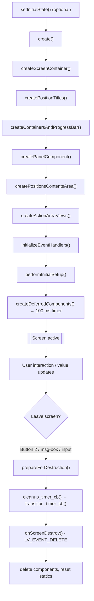
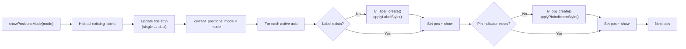
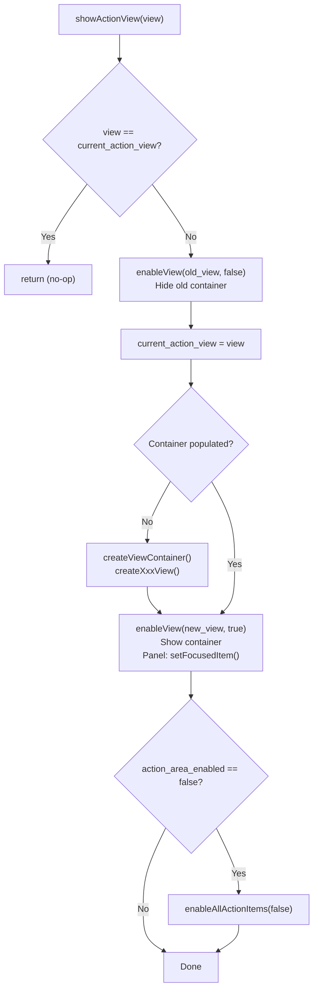
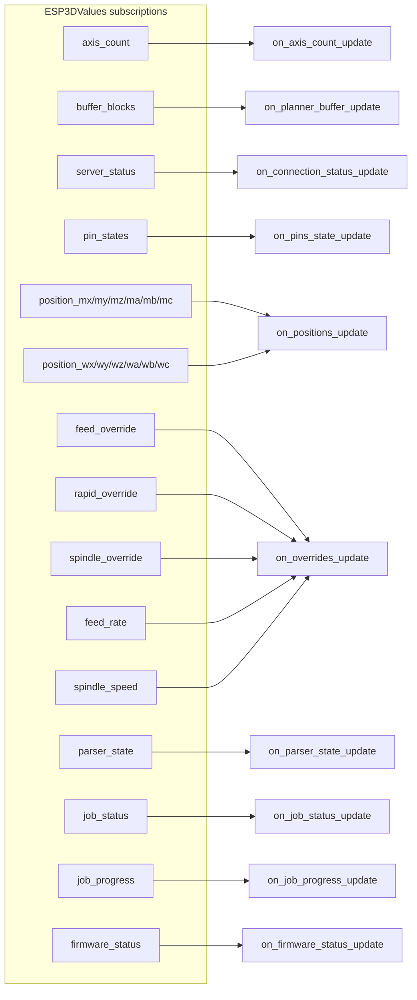
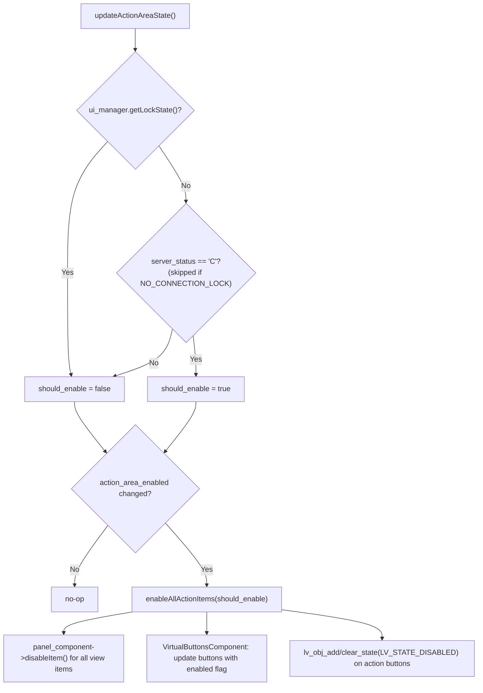

# Status Screen

**File:** `main/display/cnc/screens/status_screen.cpp`  
**Namespace:** `statusScreen`  
**Module group:** `cnc_shared` → `status_screen`

---

## Overview

The status screen is the primary operational view of the CNC pendant. It presents real-time machine state across three independent areas:

| Area | Content | Controlled by |
|---|---|---|
| **Positions** | 6-axis MPos/WPos display + limit-pin indicators | Hardware switch (or touch title strip) |
| **Actions** | 5 rotating sub-views (overrides, rapid, GC status, spindle/coolant, job) | Hardware potentiometer (or icon button row) |
| **Buttons** | Physical/virtual buttons with two behavioural modes | Button 1 (cycles Navigation ↔ Control) |

All content is created once with **lazy loading** and toggled show/hide to minimise memory and LVGL object churn on constrained ESP32 hardware.

---

## Layout

```
┌─────────────────────────────────────┐  ← ESP3D_CIRCULAR_MENU_DIAMETER
│  [FW Status]          [Conn Status] │  ← deferred overlay components
│  ┌─────────────────────────────────┐│
│  │     MPos  /  WPos  (title)      ││  ← title strip (touch zone on touch-only)
│  ├─────────────────────────────────┤│
│  │  X  -123.456   |  -123.456      ││
│  │  Y   456.789   |   456.789      ││  ← Positions area (ESP3D_STATUS_PANEL_HEIGHT)
│  │  Z   -12.345   |   -12.345      ││
│  │  ■ ■ ■  (pin indicators)        ││
│  ├─────────────────────────────────┤│
│  │ [pot/icon bar] ──────────────── ││  ← progress bar / view selector band
│  │  ┌──────────────────────────┐   ││
│  │  │  Action view (one of 5)  │   ││  ← Actions area (lazy views)
│  │  └──────────────────────────┘   ││
│  └─────────────────────────────────┘│
│   [BTN0]        [BTN1]       [BTN2] │  ← Virtual buttons row
└─────────────────────────────────────┘
```

---

## Enumerations

### `PositionsAreaMode`

Controls what is displayed in the positions area. Driven by the hardware 4-position switch (positions 0–3), or by tapping the title strip in touch-only builds (cycles 0–2; lock is excluded from touch cycling).

| Value | Enum | Switch pos | Display |
|---|---|---|---|
| `none` | 0 | — | Initial sentinel; nothing shown yet |
| `mpos_only` | 1 | 0 | MPos only, large font |
| `wpos_only` | 2 | 1 | WPos only, large font |
| `mpos_and_wpos` | 3 | 2 | Both columns, medium font |
| `locked` | 4 | 3 | Renders as `mpos_and_wpos` + UI lock engaged |

### `ButtonsAreaMode`

Cycles via Button 1 press/release.

| Value | Button 0 | Button 1 | Button 2 |
|---|---|---|---|
| `navigation` | SET (toggle panel edit) | SWITCH (cycle mode) | BACK (→ main screen) |
| `control` | STOP (`$X`) | SWITCH (cycle mode) | PAUSE (`!`) or RESUME (`~`) based on `firmware_status` |

### `ActionAreaView`

Controlled by potentiometer (0–100 % mapped in a repeating 50-unit cycle, 10 units per view). Touch-only builds use a row/column of 5 icon buttons instead.

| Value | Index | Pot range | Content |
|---|---|---|---|
| `overrides` | 0 | 0–9 % | Feed + Spindle override buttons + reset |
| `rapid_gcodes` | 1 | 10–19 % | Rapid override (25 / 50 / 100 %) |
| `gc_status` | 2 | 20–29 % | WCS selector, Feed rate, Spindle speed, GC info |
| `spindle_coolant` | 3 | 30–39 % | M3/M4/M5 (spindle) + M7/M8/M9 (coolant) |
| `job_status` | 4 | 40–49 % | Job status label + job progress bar + planner buffer bar |
| `none` | 255 | — | No view active (pre-init sentinel) |

---

## State Variables

### Core mode state

| Variable | Type | Description |
|---|---|---|
| `current_positions_mode` | `PositionsAreaMode` | Active positions display mode |
| `current_buttons_mode` | `ButtonsAreaMode` | Active buttons behavioural mode |
| `current_action_view` | `ActionAreaView` | Active action sub-view |
| `axis_count` | `uint32_t` | Active axis count (1–6, from `ESP3DValuesIndex::axis_count`) |
| `potentiometer_value` | `int32_t` | Last known potentiometer value (0–100) |
| `action_area_enabled` | `bool` | Whether action items are enabled (false = locked or disconnected) |
| `lock_state_on_entry` | `bool` | User lock state captured on screen entry; restored when leaving switch position 3 |

### Preset / resume state

| Variable | Type | Description |
|---|---|---|
| `preset_action_view_` | `int8_t` | Pre-configured view to show on `create()` (−1 = potentiometer decides) |
| `preset_buttons_mode_` | `int8_t` | Pre-configured buttons mode on `create()` (−1 = navigation) |
| `potentiometer_shift_` | `int32_t` | Calculated unit offset applied to potentiometer readings when a preset view is active |
| `resume_action_view_` | `int8_t` | View to restore when returning from an input/message-box screen; **not** reset by `prepareForDestruction()` so it survives the destroy/recreate cycle |

### Display optimisation state

| Variable | Description |
|---|---|
| `last_wpos_display_update_ms` / `last_mpos_display_update_ms` | Separate throttle timestamps for WPos and MPos groups (250 ms minimum) |
| `wpos_update_pending` / `mpos_update_pending` | Flush flags: set when a group is throttled; cleared by the flush timer |
| `position_flush_timer` | 300 ms one-shot timer that drains pending position updates |
| `last_planner_display_update_ms` | Throttle timestamp for planner buffer bar (500 ms minimum) |
| `last_known_pin_states[8]` | Last seen pin-states string; skips LVGL style calls when unchanged |

---

## Key Data Structures

### `InputScreenContext`

Holds the strings and range for the numeric input screen (feed rate, spindle speed). Using a struct avoids multiple heap-allocated `std::string` temporaries in hot paths.

```cpp
struct InputScreenContext {
    std::string title_buffer;
    std::string value_buffer;
    std::string unit_buffer;
    int32_t min_value;
    int32_t max_value;
};
```

### `ViewItemMapping`

Maps an `ActionAreaView` to the panel item IDs that belong to it, used by `enableView()` and `enableAllActionItems()` to batch enable/disable panel items without view-specific `switch` statements.

```cpp
struct ViewItemMapping {
    ActionAreaView view;
    int32_t *item_ids;
    size_t item_count;
};
```

---

## Screen Lifecycle



### `create()` — entry point

1. Resets all transition-guard state.
2. Creates `GenericScreen` (container, virtual buttons, screen object).
3. Creates title labels (`MPos` / `WPos` / dual).
4. Creates the positions area and action area containers plus the pot progress bar / icon row.
5. Creates `PanelComponent` (focusable item navigation).
6. Calls `createPositionsContentsArea()` — initialises label pointer arrays to `nullptr`; actual labels are lazy.
7. Calls `createActionAreaViews()` — registers view containers but does not populate them; views are lazy.
8. `initializeEventHandlers()` — registers switch, potentiometer, and encoder LVGL events; subscribes to all `ESP3DValues`.
9. `performInitialSetup()` — reads initial axis count, potentiometer and switch positions, applies any `preset_action_view_` / `preset_buttons_mode_`, calls `showPositionsMode()` and the first `showActionView()`.
10. `createDeferredComponents()` — schedules a 100 ms timer that creates `FirmwareStatusComponent` and `ConnectionStatusComponent`.
11. Registers `onScreenDestroy` on `LV_EVENT_DELETE`.
12. Applies display rotation.

### `prepareForDestruction()`

Called once before the LVGL object tree is deleted. Guards via `cleanup_executed_` / `is_prepared_for_destruction_` flags.

- Resets `preset_action_view_`, `preset_buttons_mode_`, `potentiometer_shift_`, `last_active_override_item_id_`.
- Removes LVGL event callbacks from the active screen.
- Calls `prepareForDestruction()` on `PanelComponent`, `FirmwareStatusComponent`, `ConnectionStatusComponent`, and `GenericScreen`.
- Unsubscribes all `ESP3DValues` subscriptions.
- Deletes `position_flush_timer` and `deferred_components_timer` if they are still live.

### `onScreenDestroy()` — `LV_EVENT_DELETE`

Emergency cleanup if `prepareForDestruction()` was not already called. Then:

- Deletes `panel_component`, `firmware_status_component`, `connection_status_component`.
- Unregisters the screen from `UIManager`.
- Deletes `status_screen_obj_instance`.
- Resets all static pointers and value variables to safe defaults.

---

## Lazy Loading — Positions Area

Labels are **not** created at screen construction. `createPositionsContentsArea()` only zeros the pointer arrays. `showPositionsMode()` creates whichever label objects are needed for the requested mode on first call, then reuses them on subsequent calls.



### Dual vs. single mode label sets

| Mode | Axis letter label | Value label | Extra |
|---|---|---|---|
| `mpos_only` / `wpos_only` | `axis_name_labels[i]` (large font) | `position_axis_labels[i]` (large font) | — |
| `mpos_and_wpos` / `locked` | `axis_name_mpos_labels[i]` (medium font) | `position_mpos_labels[i]` + `position_wpos_labels[i]` (medium font each) | WPos column at `ESP3D_CIRCULAR_MENU_DIAMETER/2 + ESP3D_CONTAINER_PAD` |

---

## Lazy Loading — Action Views

`showActionView()` creates a view's LVGL objects the first time it is requested, then hides/shows the container on subsequent switches.



---

## Hardware Input Handling

### Switch → `switch_event_cb`

Receives `LV_EVENT_SWITCH_PRESSED` with a `control_event_t` carrying `btn_id` (0–3).

| btn_id | PositionsAreaMode | Notes |
|---|---|---|
| 0 | `mpos_only` | — |
| 1 | `wpos_only` | — |
| 2 | `mpos_and_wpos` | — |
| 3 | `locked` | Forces `userSetLockState(true)`; restores `lock_state_on_entry` on exit |

Lock/unlock transitions trigger `updateActionAreaState()` which enables or disables all panel items and virtual buttons.

### Potentiometer → `potentiometer_event_cb`

Receives `LV_EVENT_POTENTIOMETER_CHANGED` with `steps` (0–100). Maps to a view via `mapPotentiometerToView()` (50-unit repeating cycle, 10 units/view). Calls `showActionView()` on view change; updates the progress bar always.

**Touch-only potentiometer emulation:** A row (portrait) or column (landscape) of 5 icon buttons (`pot_view_selector`) replaces the progress bar. Each button directly selects its corresponding view by synthesising a `LV_EVENT_POTENTIOMETER_CHANGED` event and suppressing intermediate beeps.

### Encoder → `encoder_event_handler`

Forwards `LV_EVENT_KEY` to `PanelComponent::handleEncoderEvent()`. Calls `updateMCodeButtonsState()` after each step to keep M-code button colours in sync with focus position.

**Touch-only encoder emulation:** When `encoder_emulation_active_` is true, Button 1 emits `+1` step and Button 2 emits `−1` step via `VirtualButtonsComponent::emitEncoderStep()`. The pot icon row is hidden during editing via `ShowEncoderControls()`.

### Button 0 — SET / STOP

| Mode | Release action |
|---|---|
| `navigation` | Toggle `PanelComponent` between `PANEL_NAVIGATION_MODE` and `PANEL_EDITING_MODE`; show/hide encoder controls |
| `control` | Send `$X` (alarm unlock) |

### Button 1 — SWITCH (always)

Press/release: advance `current_buttons_mode` mod 2, call `updateButtonsArea()`. In touch encoder-emulation mode: press emits `+1` encoder step.

### Button 2 — BACK / PAUSE-RESUME

| Mode | Release action |
|---|---|
| `navigation` | Navigate to `RETURN_SCREEN` (main) via `ESP3D_TRANSITION_START` macro |
| `control` | If `firmware_status` starts with `"HOLD"`: send `GRBL_RT_CYCLE_START`; otherwise send `GRBL_RT_FEED_HOLD` with high priority |

---

## Panel Events — `onPanelEvent`

`PanelComponent` delivers four callback types:

| Type | Meaning | Typical action |
|---|---|---|
| `ON_FOCUS` | Encoder moved focus to this item | Deactivate previous item, return panel to `NAVIGATION_MODE`, call `ShowEncoderControls(false)` |
| `ON_ACTIVE` | Item entered edit mode | Highlight button, call `ShowEncoderControls(true)` (overrides, WCS) or send G-code immediately (rapid, M-codes, reset buttons) |
| `ON_CHANGE` | Encoder step while in edit mode | Send realtime G-code byte (feed/spindle override step, WCS preview update) |
| `ON_STANDBY` | Item exited edit mode | Deactivate button, call `ShowEncoderControls(false)`, send final WCS command if changed |

### WCS edit flow

1. `ON_ACTIVE` (wcs_item): saves `active_wcs_command` from current parser state; clears `pending_wcs_command`.
2. `ON_CHANGE` (wcs_item): cycles G54→G59; updates `pending_wcs_command` and the WCS label only — no G-code sent yet.
3. `ON_STANDBY` (wcs_item): if `pending_wcs_command != active_wcs_command`, sends the G-code.

---

## G-code Commands Sent

| Action | Command | Priority |
|---|---|---|
| Feed override +10 % | `GRBL_RT_FEED_INC_10` | high |
| Feed override −10 % | `GRBL_RT_FEED_DEC_10` | high |
| Feed override reset | `GRBL_RT_FEED_100_PERCENT` | normal |
| Spindle override +10 % | `GRBL_RT_SPINDLE_INC_10` | high |
| Spindle override −10 % | `GRBL_RT_SPINDLE_DEC_10` | high |
| Spindle override reset | `GRBL_RT_SPINDLE_100_PERCENT` | high |
| Rapid 25 % | `GRBL_RT_RAPID_25_PERCENT` | normal |
| Rapid 50 % | `GRBL_RT_RAPID_50_PERCENT` | normal |
| Rapid 100 % | `GRBL_RT_RAPID_100_PERCENT` | high |
| Spindle CW | `M3` | normal |
| Spindle CCW | `M4` | normal |
| Spindle off | `M5` | normal |
| Coolant mist toggle | `GRBL_RT_COOLANT_MIST_TOGGLE` | high |
| Coolant flood toggle | `GRBL_RT_COOLANT_FLOOD_TOGGLE` | high |
| Both coolant off (M9) | mist toggle + flood toggle | high × 2 |
| Status request | `GRBL_RT_STATUS_REPORT` | normal |
| Alarm unlock | `$X` | normal |
| Feed hold (pause) | `GRBL_RT_FEED_HOLD` | high |
| Cycle start (resume) | `GRBL_RT_CYCLE_START` | normal |
| WCS select | `G54`…`G59` | normal |
| Feed rate | `F<value>` | normal |
| Spindle speed | `S<value>` | normal |

---

## Value Subscriptions

All subscriptions are registered in `initializeEventHandlers()` and removed in `prepareForDestruction()`.



### Callback behaviour details

| Callback | Key behaviour |
|---|---|
| `on_axis_count_update` | Clamps to 1–6; calls `updatePositionsAreaMode()` which re-runs `showPositionsMode()` |
| `on_positions_update` | **Throttled**: 250 ms per group (WPos/MPos tracked separately). Pending updates flushed by `position_flush_timer`. Only updates `lv_label_set_text()` on already-visible labels; layout changes deferred to mode-change paths. |
| `on_pins_state_update` | **Change detection**: compares against `last_known_pin_states`; skips all LVGL style operations if string is identical. Fires at up to 10 Hz from the CNC status poll; change detection prevents redundant `lv_obj_set_style_*` calls. |
| `on_connection_status_update` | Maps `"C"` → `systemSetLockState(false)`; any other value → `systemSetLockState(true)`. Calls `updateActionAreaState()`. |
| `on_overrides_update` | Routes by `ESP3DValuesIndex`: updates `feed_override_item_id` text (`F: X%`), `spindle_override_item_id` text (`S: X%`), `rapid_override_label`, `feed_value_label`, or `spindle_value_label`. |
| `on_parser_state_update` | Extracts WCS (`extractWCS`), feed (`F` value), spindle (`S` value); updates respective labels; calls `updateMCodeButtonsState()`. |
| `on_job_status_update` | Updates `job_status_label` text. |
| `on_job_progress_update` | Updates `job_progress_label` text and `job_progress_bar` value with animation. |
| `on_planner_buffer_update` | **Throttled**: 500 ms. Sets `planner_progress_bar` value; calls `updatePlannerProgressBarStyle()` to colour bar green/orange/red (≥73 % → green, ≥40 % → orange, <40 % → red). |
| `on_firmware_status_update` | If `current_buttons_mode == control`, calls `updateButtonsArea()` to switch Button 2 icon between PAUSE and RESUME. |

---

## Action Area — Enable / Disable Logic



`gc_info_btn` is always re-enabled after the batch disable because it is read-only (opens a message box; sends no G-code).

---

## M-Code Button Colours

View 3 (`spindle_coolant`) shows M3/M4/M5 and M7/M8/M9 buttons. Their background colour reflects the current machine state parsed from `ESP3DValuesIndex::parser_state` via `esp3dGcodeHandler.parseMCodes()`.

| State | Background | Icon colour |
|---|---|---|
| Active | `ESP3D_ACCENT_ACTIVE_COLOR` | `text_on_active` token |
| Inactive | `ESP3D_SCREEN_BACKGROUND_COLOR` | `text_primary` token |

Default rules when parser state is ambiguous:
- No spindle M-code reported → M5 shown as active.
- No coolant M-code reported → M9 shown as active.
- M7 and M8 can coexist; M9 excludes both.

`updateMCodeButtonsState()` is called from `on_parser_state_update`, `encoder_event_handler`, `showActionView()`, and `enableAllActionItems()`.

---

## Potentiometer Mapping Detail

```
pot_value (0–100)
     ↓
If preset_action_view_ != -1:
    pot_value += potentiometer_shift_
    pot_value = ((pot_value % 50) + 50) % 50   ← wrap into 0–49
     ↓
cycle_pos = pot_value % 50
 0– 9  → overrides
10–19  → rapid_gcodes
20–29  → gc_status
30–39  → spindle_coolant
40–49  → job_status
```

`potentiometer_shift_` is computed in `performInitialSetup()` as:

```
potentiometer_shift_ = (preset_action_view_ - natural_view) * 10
```

so that the potentiometer's physical resting position maps to the preset view without requiring the user to move the knob.

---

## Screen Transition Safety

Screen transitions follow the project-wide `ESP3D_TRANSITION_START` / `ESP3D_CLEANUP_TIMER_BODY` / `ESP3D_TRANSITION_TIMER_BODY` macro chain (see [screen_transitions_flow.md](https://github.com/luc-github/Pibot-cnc-pendant-firmware/blob/main/docs/architecture/screen_transitions_flow.md)):

1. `cleanup_timer_cb` fires after `ESP3D_TRANSITION_SCREEN_DELAY_MS`: calls `prepareForDestruction()`, schedules `transition_timer`.
2. `transition_timer_cb` fires after the second delay: calls `createScreen()` on the target screen.
3. `onScreenDestroy` fires when LVGL destroys the old screen object tree.

The `is_prepared_for_destruction_` and `cleanup_executed_` guards prevent double-cleanup if the user triggers a second transition before the first timer fires.

When the screen leaves to an input or message-box screen, `resume_action_view_` is set to `current_action_view` before calling `prepareForDestruction()`. On recreation, `performInitialSetup()` reads `resume_action_view_` and converts it to `preset_action_view_` so the same view is restored automatically.

---

## Deferred Component Creation

`createDeferredComponents()` schedules a one-shot `lv_timer` at `ESP3D_DEFERED_SCREEN_CREATION_DELAY_MS` (100 ms) to create:

- `FirmwareStatusComponent` — top-left corner overlay; shows firmware state string. See [firmware_status.md](firmware_status.md).
- `ConnectionStatusComponent` — top-right corner overlay; shows transport/server state. See [grbl_module_connection_status.md](grbl_module_connection_status.md).

The timer handle is stored in `deferred_components_timer` so `prepareForDestruction()` can cancel it if the screen is destroyed before it fires (e.g. rapid navigation).

---

## Public API

### `setInitialState(ActionView view, ButtonsMode buttons_mode)`

Pre-configures the view and buttons mode that `create()` will apply. Must be called before `create()`. Pass −1 to either parameter to use defaults (potentiometer-driven view, navigation mode).

| Parameter | Type | Default | Description |
|---|---|---|---|
| `view` | `ActionView` (maps to `ActionAreaView`) | −1 | View to show on screen entry |
| `buttons_mode` | `ButtonsMode` (maps to `ButtonsAreaMode`) | −1 | Buttons mode on entry |

Called by `main_screen.cpp` when launching the status screen from a specific context (e.g. a running job → `job_status` view in `control` mode).

### `create()`

Creates and activates the status screen. Throws `std::runtime_error` on critical allocation failures (screen container, panel component). Non-critical failures (firmware/connection status components) are logged but do not abort creation.

---

## Axis Letter Resolution

`axisLetterAt(uint32_t i)` resolves the display letter for axis index `i`:

1. Reads `ESP3DValuesIndex::axis_names` (populated from grblHAL `$376` UVW response).
2. Falls back to `"XYZABC"` if unset (FluidNC, grblHAL ≤3 axes).

Pin state matching in `updatePinsStates()` also uses `axisLetterAt()` to correctly match grblHAL `|Pn:` reports against renamed UVW axes.

---

## Conditional Compilation

| Feature flag | When OFF | When ON |
|---|---|---|
| `ESP3D_HARDWARE_ENCODER_FEATURE` | No physical encoder; encoder emulation via Button 1/2 when editing | Physical encoder events routed through `encoder_event_handler` |
| `ESP3D_HARDWARE_POTENTIOMETER_FEATURE` | No physical potentiometer; 5 icon buttons replace progress bar for view selection | Potentiometer `steps` drives `mapPotentiometerToView()` + progress bar |
| `ESP3D_HARDWARE_SWITCH_FEATURE` | No physical switch; title strip becomes a touch button cycling `mpos_only` → `wpos_only` → `mpos_and_wpos` | 4-position switch drives `PositionsAreaMode` directly |
| `ESP3D_NO_CONNECTION_LOCK_FEATURE` | `on_connection_status_update` locks the action area when disconnected | Action area state is independent of connection status |

---

## LVGL Performance Constraints

Following the project-wide LVGL constraints (single-threaded on Core 1):

| Technique | Where applied |
|---|---|
| **Throttled callbacks** | `on_positions_update` (250 ms, separate WPos/MPos timestamps); `on_planner_buffer_update` (500 ms) |
| **Flush timer** | `position_flush_timer` (300 ms one-shot) drains pending position updates that were throttled |
| **Change detection** | `on_pins_state_update` — skips all `lv_obj_set_style_*` calls when pin string is identical |
| **Lazy object creation** | Positions labels and action view containers created on first use only |
| **Show/hide instead of create/delete** | All position label sets and all 5 view containers are hidden, not destroyed, on mode/view change |
| **Deferred heavy components** | `FirmwareStatusComponent` and `ConnectionStatusComponent` created 100 ms after screen creation |
| **Sound suppression** | `ESP3D_SAVE_SOUND_STATE_AND_DISABLE` wraps view-switch sequences that would otherwise trigger multiple overlapping beeps |

---

## Dependencies

| Component | Role | Reference |
|---|---|---|
| `GenericScreen` | Base screen container + virtual buttons | [screen_base_infrastructure.md](architecture/screen_base_infrastructure.md) |
| `PanelComponent` | Focusable item navigation + encoder dispatching | [screens_architecture.md](https://github.com/luc-github/Pibot-cnc-pendant-firmware/blob/main/docs/architecture/screens_architecture.md) |
| `FirmwareStatusComponent` | Top-left state overlay | [firmware_status.md](firmware_status.md) |
| `ConnectionStatusComponent` | Top-right connection overlay | [grbl_module_connection_status.md](grbl_module_connection_status.md) |
| `VirtualButtonsComponent` | Physical/virtual button management + switch/pot emulation | [Input_system.md](https://github.com/luc-github/Pibot-cnc-pendant-firmware/blob/main/docs/architecture/Input_system.md) |
| `inputScreen` | Numeric/text input modal (feed rate, spindle speed) | [screens_architecture.md](https://github.com/luc-github/Pibot-cnc-pendant-firmware/blob/main/docs/architecture/screens_architecture.md) |
| `messageBoxScreen` | Information/confirmation modal (GC info) | [screens_architecture.md](https://github.com/luc-github/Pibot-cnc-pendant-firmware/blob/main/docs/architecture/screens_architecture.md) |
| `ESP3DValues` / `esp3dXValues` | Observable system — all CNC state | [connection_management.md](https://github.com/luc-github/Pibot-cnc-pendant-firmware/blob/main/docs/architecture/connection_management.md) |
| `esp3dGcodeHandler` | G-code send + parser helpers (`parseMCodes`, `extractValue`, `extractWCS`) | [gcode_host_architecture.md](https://github.com/luc-github/Pibot-cnc-pendant-firmware/blob/main/docs/architecture/gcode_host_architecture.md) |
| `UIManager` / `ui_manager` | Theme tokens, lock state, screen registration | [screens_architecture.md](https://github.com/luc-github/Pibot-cnc-pendant-firmware/blob/main/docs/architecture/screens_architecture.md) |
| `ESP3DTranslationService` | Label translation | [screens_architecture.md](https://github.com/luc-github/Pibot-cnc-pendant-firmware/blob/main/docs/architecture/screens_architecture.md) |


## Documents de conception (depot)

- [status_screen](https://github.com/luc-github/Pibot-cnc-pendant-firmware/blob/main/docs/ux_flows/fluidnc/status_screen.md)
- [status_screen](https://github.com/luc-github/Pibot-cnc-pendant-firmware/blob/main/docs/ux_flows/grblhal/status_screen.md)
