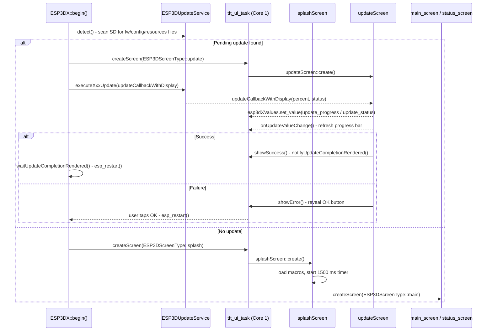
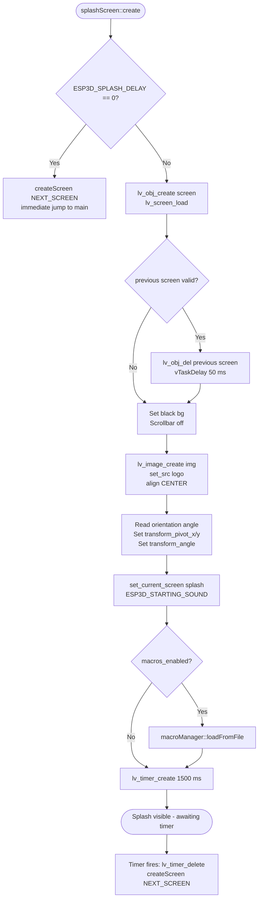
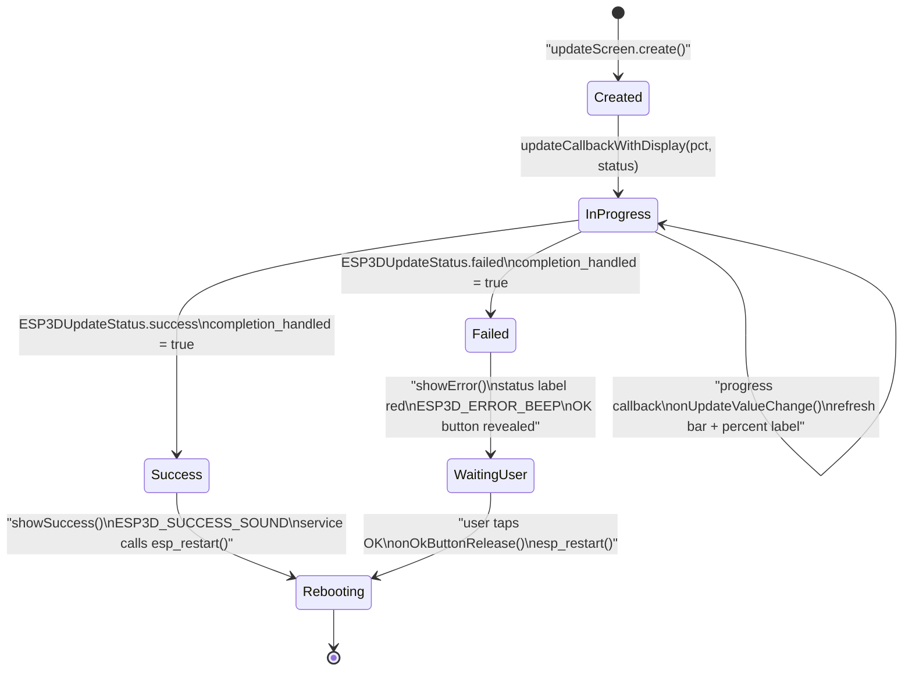
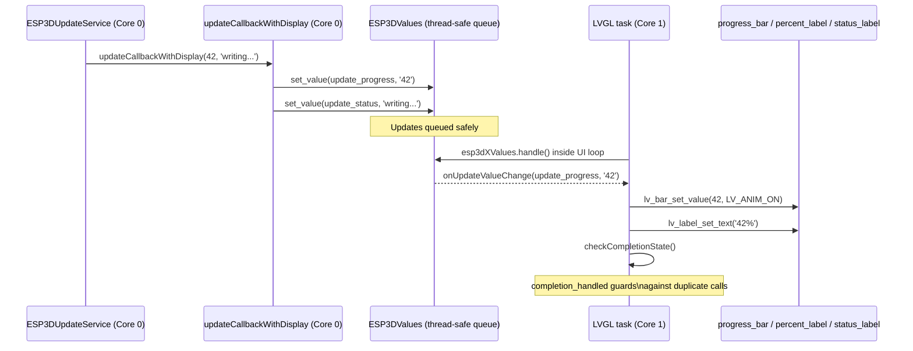

# System Lifecycle Screens

## Introduction

The **system lifecycle screens** module comprises the two screens that bracket the firmware's operational life: the **splash screen** shown immediately at first boot, and the **update screen** displayed whenever a firmware, resources, or configuration update is being applied from the SD card. Both screens exist outside the normal CNC-workflow navigation tree — they are entered unconditionally by the boot sequence and exited only once their one-time mission is complete (transition to main, or reboot).

**Source files:**
- `main/display/screens/splash_screen.cpp`
- `main/display/screens/update_screen.cpp`

---

## Role in the Overall Boot Sequence

The two screens occupy distinct, non-overlapping phases of the device lifecycle:



---

## Module Architecture

```mermaid
graph TD
    subgraph system_lifecycle_screens["system_lifecycle_screens (this module)"]
        SS[splashScreen\nsplash_screen.cpp]
        US[updateScreen\nupdate_screen.cpp]
    end

    subgraph ui_core["UI Core (see ui_core.md)"]
        XUI[ESP3DXUi\nesp3dXui]
        UIM[UIManager\nui_manager]
        GS[GenericScreen]
    end

    subgraph common_screens["Common Screens (see common_screens.md)"]
        VB[VirtualButtonsComponent]
    end

    subgraph core_platform["Core Platform (see core_platform.md)"]
        VAL[ESP3DValues\nesp3dXValues]
        SET[ESP3DSettings\nesp3dXsettings]
        TR[ESP3DTranslationService\nesp3dTranslationService]
    end

    subgraph storage["Storage and Update (see storage_and_configuration.md)"]
        UPD[ESP3DUpdateService\nesp3dUpdateService]
        MM[macroManager]
    end

    SS -->|set_current_screen| XUI
    SS -->|loadFromFile| MM
    SS -->|readByte macros_enabled| SET
    SS -->|lv_timer_create createScreen| GS

    US -->|new GenericScreen| GS
    US -->|getVirtualButtons| VB
    US -->|subscribe / unsubscribe| VAL
    US -->|set_value update_progress| VAL
    US -->|getPendingUpdate / getStatus| UPD
    US -->|updateCallbackWithDisplay| UPD
    US -->|translate| TR
    US -->|registerScreen / unregisterScreen| UIM
    US -->|waitUpdateCompletionRendered| XUI
    US -->|applyLabelStyle| UIM
```



---

## Splash Screen

### Purpose

The splash screen is the very first screen the user sees after power-on. Its goals are:

1. Give a branded "loading" moment while background initialisation completes.
2. Load the macro list from the SD/Flash file (`macroManager::loadFromFile`) while the logo is visible.
3. Transition automatically to the main operational screen.

### Configuration

| Symbol | Effect |
|---|---|
| `ESP3D_SPLASH_DELAY` | If `0`, the splash screen is **skipped entirely** — `create()` immediately calls `createScreen(NEXT_SCREEN)` and returns. Otherwise the logo is shown for approximately 1 500 ms. |
| `ESP3D_STARTING_SOUND` | Macro emitted on successful screen creation; triggers the buzzer startup melody. |
| `ESP3DSettingIndex::esp3d_macros_enabled` | NVS byte. If set, `macroManager::loadFromFile()` is called during the splash delay. |

### Screen Layout

```
┌─────────────────────────────────────┐
│                                     │
│                                     │
│           ┌───────────┐             │
│           │  [LOGO]   │  (centered) │
│           └───────────┘             │
│                                     │
│  Black background, no scrollbar     │
└─────────────────────────────────────┘
```

The logo image (`logo`) is sourced from the `ui_resources` partition at runtime. Its rotation is aligned to the current display orientation via `ui_manager.getOrientationAngle()` using LVGL's `transform_angle` / `transform_pivot` styles applied directly to the image widget — this avoids rotating the entire screen object.

### Creation Flow



### Lifecycle Callbacks

| Callback | Trigger | Action |
|---|---|---|
| `onDestroy` | `LV_EVENT_DELETE` on the screen object | Logs heap free size; calls `ui_manager.debugPrintAllInstances()` in debug builds. Does **not** perform any resource cleanup — no subscriptions or heap allocations are made by this screen. |

### Timer Safety

The module guards against re-entrant timer creation:

```cpp
if (transition_timer) {
    lv_timer_delete(transition_timer);
    transition_timer = nullptr;
}
```

The timer callback is a lambda that deletes itself (`lv_timer_delete(transition_timer)`) before calling `createScreen`, avoiding a use-after-free if `create()` is invoked again unexpectedly.

---

## Update Screen

### Purpose

The update screen handles the visual feedback for all SD-card-triggered update types:

| Update Type | `ESP3DUpdateType` | Title Translation Key |
|---|---|---|
| Firmware binary | `firmware` | `ESP3DLabel::firmware_update` |
| UI resources partition | `resources` | `ESP3DLabel::resources_update` |
| Resource patches | `resource_patches` | `ESP3DLabel::resources_update` |
| Theme colours | `theme_colors` | `ESP3DLabel::resources_update` |
| Configuration INI | *(all other)* | `ESP3DLabel::settings_update` |

Protected by the compile-time feature flag `ESP3D_UPDATE_FEATURE`.

### Screen Layout

```
┌──────────────────────────────────────┐
│  [Title: "Firmware Update" / ...]    │  ← title_label (montserrat_14)
│                                      │
│  ┌────────────────────────────────┐  │
│  │░░░░░░░░░░░░░░░░░░░░░░░░░░░░░░░│  │  ← progress_bar (animated)
│  └────────────────────────────────┘  │
│                  42%                 │  ← percent_label
│                                      │
│          Please wait…                │  ← status_label
│       (or error / success msg)       │
│                                      │
│  [     ]  [    OK    ]  [     ]      │  ← VirtualButtonsComponent
│   hidden   (error only)   hidden     │
└──────────────────────────────────────┘
```

All font references in this screen are forced to `lv_font_montserrat_14` — a font compiled into the firmware binary itself — rather than the custom XIP fonts loaded from the `ui_resources` partition. This is intentional: a **resources update** erases and rewrites that partition while the screen is live, making XIP font pointers unsafe. The OK button image also uses a statically compiled `ok_b_static` symbol for the same reason.

### State Machine



### Progress Callback Chain

External callers (`ESP3DUpdateService`, running on Core 0 / the boot task) report progress via `updateCallbackWithDisplay`. The update screen never touches LVGL objects directly from Core 0 — all mutations are routed through the `ESP3DValues` queue and executed on Core 1 by the LVGL task.



### Boot-Sequence Synchronisation

`ESP3DXUi` provides two semaphore-backed methods used to coordinate the boot task with the LVGL task:

| Method | Signalled when | Consumer |
|---|---|---|
| `waitFirstFrameRendered(timeout_ms)` | First LVGL render pass after screen creation | Boot task waits before calling `executeXxxUpdate()` to guarantee the screen is visible |
| `waitUpdateCompletionRendered(timeout_ms)` | After `isCompletionHandled()` is `true` and the final state is painted | Boot task waits before calling `esp_restart()` to guarantee the user sees the result |

`isCompletionHandled()` is the public predicate the LVGL task polls between render cycles to decide when to call `notifyUpdateCompletionRendered()`.

### Lifecycle Callbacks

| Callback | Trigger | Action |
|---|---|---|
| `onScreenDestroy` | `LV_EVENT_DELETE` on screen object | Unsubscribes both `update_progress` and `update_status`; calls `ui_manager.unregisterScreen`; deletes the `GenericScreen` instance; nullifies all widget pointers. |
| `onOkButtonPress` | Virtual button press (index 1, centre) | Plays `ESP3D_SELECTION_BEEP`. |
| `onOkButtonRelease` | Virtual button release (index 1, centre) | `esp_hal::wait(100)` then `esp_restart()`. |

### Resource Management Notes

- The `GenericScreen` instance is heap-allocated with `new (std::nothrow)` to avoid an abort on allocation failure; the code checks the pointer and returns gracefully instead of throwing.
- `completion_handled` is reset to `false` at the start of every `create()` call, ensuring the flag is correct even if the screen is recreated.
- All four widget pointers (`progress_bar`, `status_label`, `title_label`, `percent_label`) are explicitly nullified in `onScreenDestroy` before the `GenericScreen` destructor runs, preventing stale-pointer use in any lingering value callback.

---

## Dependency Map

| Dependency | Module | Purpose |
|---|---|---|
| `GenericScreen` | [common_screens](common_screens.md) | Screen container + virtual button strip |
| `VirtualButtonsComponent` | [common_screens](common_screens.md) | Three-button bottom bar; centre button shown/hidden dynamically |
| `UIManager` / `ui_manager` | [ui_core](ui_core.md) | Screen registration, style application, orientation angle |
| `ESP3DXUi` / `esp3dXui` | [ui_core](ui_core.md) | Current-screen tracking; boot-sequence semaphores |
| `ESP3DValues` / `esp3dXValues` | [core_platform](Core_Platform_and_Infrastructure.md) | Thread-safe value bus bridging Core 0 progress updates to Core 1 LVGL mutations |
| `ESP3DSettings` / `esp3dXsettings` | [core_platform](Core_Platform_and_Infrastructure.md) | NVS byte read for `esp3d_macros_enabled` |
| `ESP3DTranslationService` | [core_platform](Core_Platform_and_Infrastructure.md) | All user-visible strings translated at runtime |
| `ESP3DUpdateService` / `esp3dUpdateService` | [storage_and_configuration](Storage_and_Configuration.md) | Update type/status query; receives `updateCallbackWithDisplay` as progress hook |
| `macroManager` | [cnc_shared](cnc_shared.md) | Macro list loaded from file during splash delay |
| `esp3d_log` / `esp3d_log_e` | [core_platform](Core_Platform_and_Infrastructure.md) | Heap and state logging throughout both screens |

---

## Design Decisions

### Why the splash screen does not use `GenericScreen`

The splash screen has no button strip, no container, and no subscription to any value system. Using `GenericScreen` would add unnecessary memory overhead during the brief startup window when heap pressure is at its highest. A raw `lv_obj_create(NULL)` screen is sufficient and incurs no additional allocations.

### Why the update screen uses firmware-embedded fonts and images

During a **resources partition update** the `ui_resources` flash partition is erased and rewritten while the update screen is live. Any pointer into that partition (XIP font, image descriptor from `esp3d_resources.cpp`) references memory that is actively being modified, which would cause data corruption or a flash-cache coherency fault. The update screen is the only screen in the project that:

- Overrides `ui_manager.applyLabelStyle()` with a hard `lv_font_montserrat_14` reference (compiled into the firmware ELF).
- Uses a statically compiled `ok_b_static` image symbol (generated into `res_320_240/ok_b_static.c` or `res_480_320/ok_b_static.c` at build time).

See `docs/ui_resources/development.md` for the `ui_resources` partition binary format and update mechanisms.

### Why progress updates go through `ESP3DValues`

The update executes on Core 0 (the boot task), while all LVGL object mutations must happen on Core 1 (the LVGL task) to comply with LVGL's single-thread constraint. Posting values through `ESP3DValues` provides a thread-safe FIFO that is drained by `esp3dXValues.handle()` inside the LVGL task loop, eliminating any explicit mutex or `xTaskNotify` in the screen's own code. See `docs/architecture/screens_architecture.md` for the broader LVGL threading model.

### Completion guard (`completion_handled`)

`checkCompletionState()` is called from every `onUpdateValueChange` invocation. Without the `completion_handled` guard, a rapid burst of progress callbacks near 100 % (followed by a trailing status update) could invoke `showSuccess()` or `showError()` multiple times, corrupting widget state or triggering a double `esp_restart()`.


## Documents de conception (depot)

- [screens_architecture.md](https://github.com/luc-github/Pibot-cnc-pendant-firmware/blob/main/docs/architecture/screens_architecture.md)
