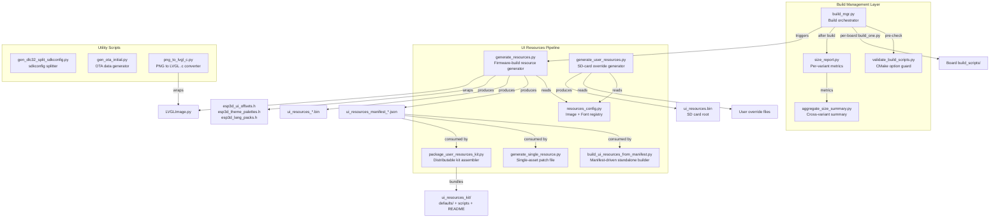
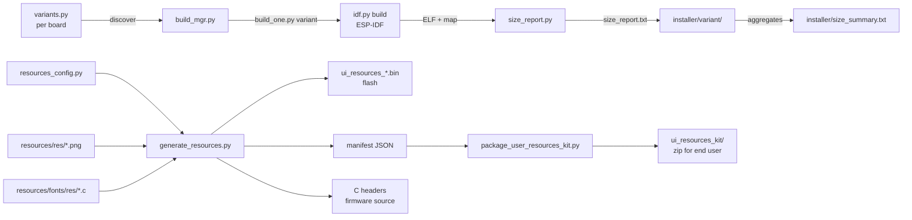
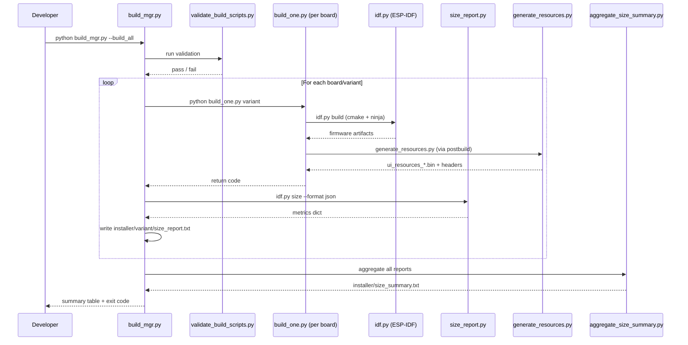

# Tools — Build Scripts

## Introduction

The `tools/build_scripts/` module is the central Python toolchain for building, validating, sizing, and packaging the Pibot CNC pendant firmware. It coordinates multi-board, multi-variant ESP-IDF builds; enforces CMake configuration consistency; measures and reports binary sizes; and drives the entire UI resource generation pipeline that produces the `ui_resources` flash partition consumed by LVGL at runtime.

The module is designed to be run by developers on the host machine — never on the target ESP32. All scripts are Python 3 and operate via subprocess calls to `idf.py` (ESP-IDF 5.x) and LVGL tooling.

---

## Architecture Overview

The module splits into three functional layers that collaborate through well-defined file and data interfaces:



### Key Data Flows



---

## Sub-Modules

### 1. Build Management

Core build orchestration and quality-enforcement scripts.

| Script | Role |
|---|---|
| `build_mgr.py` | Top-level entry point. Discovers all board/variant pairs from `boards/*/build_scripts/variants.py`, provides interactive and CLI modes, delegates builds to per-board `build_one.py`, and collects size metrics. |
| `validate_build_scripts.py` | Run automatically before every build. Cross-checks that all CMake options used in board build scripts exist in `CMakeLists.txt` and that `ROOT_CMAKE_OPTIONS` lists every option declared there. |
| `size_report.py` | Calls `idf.py size --format json` after each successful build, parses the JSON (with a plain-text fallback), and writes human-readable `size_report.txt` per variant under `installer/`. |
| `aggregate_size_summary.py` | Walks all `installer/<variant>/size_report.txt` files after a full run and produces an aligned table `installer/size_summary.txt` comparing DRAM/IRAM/Flash across all variants. |

→ See **[tools_build_scripts_build_management.md](tools_build_scripts_build_management.md)** for full details.

---

### 2. UI Resources Pipeline

Scripts that build, customize, and distribute the `ui_resources` flash partition. This partition stores LVGL-format images, serialized font blobs, theme palette data, and language packs — loaded at runtime from flash without LVGL needing to include them as C arrays.

| Script | Role |
|---|---|
| `resources_config.py` | Single source of truth: declares every `ImageConfig` and `FontConfig` entry with its source file, LVGL color format, and variant group filter (`shared`, `cnc`, `fluidnc`, `wifi`, `bt`, …). |
| `generate_resources.py` | The firmware-build-time generator. Converts PNGs via `LVGLImage.py`, serializes font `.c` files into blobs, assembles the binary partition with ESP3 header + directory + data, and emits three C headers. Also produces a JSON manifest for downstream tools. |
| `generate_user_resources.py` | User-facing SD-card update generator. Rebuilds a full `ui_resources.bin` with custom PNGs/fonts from an `--overrides` folder layered on top of the repo defaults. Output is always named `ui_resources.bin` for the firmware update service to recognize. |
| `generate_single_resource.py` | Produces a single-asset SD-card patch file (`.bin` for images, `.fnt` for fonts). The firmware's `/esp3dres/` update path validates, writes in-place, and renames the file to `.ok` or `.bad`. |
| `build_ui_resources_from_manifest.py` | Repo-independent standalone builder. Takes only a manifest JSON + a defaults folder (+ optional overrides folder) — no `resources_config.py` needed. Designed for end users who received a kit. |
| `package_user_resources_kit.py` | Assembles a self-contained distributable kit: the manifest, flat copies of all default assets, standalone builder scripts, converters, and a README copied from `docs/user documentation/`. |

→ See **[tools_build_scripts_ui_resources.md](tools_build_scripts_ui_resources.md)** for full details.

---

### 3. Utility Scripts

Standalone helper utilities that address specific one-off build tasks.

| Script | Role |
|---|---|
| `gen_dlc32_split_sdkconfig.py` | Transforms the DLC32 MAX LCD's shared `sdkconfig.8mb.bt` / `.wifi` base configs into three transport-specific variants (`bt_serial`, `bt_ble`, `serial`) by enabling/disabling Bluetooth sub-stacks and Wi-Fi via regex-based key manipulation. |
| `gen_ota_initial.py` | Generates the 8 KB `ota_data_initial.bin` that tells the ESP-IDF bootloader to boot the `ota_0` (app0) partition on first power-up, with valid CRC32 in `esp_ota_select_entry_t`. |
| `png_to_lvgl_c.py` | Converts one or many PNGs to LVGL v9 `.c` image sources (not the `ui_resources` partition path — the statically-compiled icon set under `main/display/cnc/<fw>/<resolution>/images/`). Supports batch regeneration for a new display resolution with optional scaling. |

→ See **[tools_build_scripts_utilities.md](tools_build_scripts_utilities.md)** for full details.

---

## Partition Binary Format

All resource generators (`generate_resources.py`, `generate_user_resources.py`, `build_ui_resources_from_manifest.py`) produce a binary with the identical layout so the firmware's `esp3d_resources_init()` accepts any of them:

```
Offset  Size   Content
------  -----  -------
0       4      Magic: 'ESP3'
4       12     Variant key (ASCII, NUL-padded): e.g. 'wifi_grblhal\0'
16      2      num_images  (uint16_t LE)
18      2      num_fonts   (uint16_t LE, includes palettes + lang slots)
20      4      data_section_offset (uint32_t LE)
24      N×20   Image directory entries (id, cf, flags, w, h, stride, reserved, offset, size)
...     M×16   Font directory entries (id, reserved, offset, size, slot_size)
...     pad    Alignment to 4 bytes
[dso]   ...    Image pixel blobs (4-byte aligned, tightly packed)
...     ...    Font blobs (equal padded slots)
...     ...    Language pack slots (LANG_SLOT_SIZE each, 3 total)
...     ...    Theme palette slots (PALETTE_BLOB_SIZE + THEME_NAME_SIZE each)
```

Resources are resolved at runtime **by 16-bit djb2 ID** (hashed from the resource name), not by byte offset — making the layout upgrade-safe even when assets change size.

---

## Build Workflow



---

## Relationship to Other Modules

- **Board Support Packages**: Each board under `boards/*/build_scripts/` provides `variants.py`, `common.py`, and `build_one.py` — consumed and orchestrated by `build_mgr.py`. See the board-specific documentation for per-board variant definitions.
- **UI Framework & Screens**: The C headers produced by `generate_resources.py` (`esp3d_ui_offsets.h`, `esp3d_theme_palettes.h`, `esp3d_lang_packs.h`) are compiled directly into the firmware and consumed by `main/display/esp3d_resources.cpp`. See the [UI Framework & Screens](UI_Framework_and_Screens.md) module for how those resources are loaded at runtime.
- **Storage & Configuration**: The `ui_resources` partition binary is written to flash by `ESP3DUpdateService` (see `main/modules/update/esp3d_update_service.cpp`) when an SD card update is triggered. See the [Storage & Configuration](Storage_and_Configuration.md) module for the update service.
- **[Tools — UI Studio](tools_ui_studio.md)**: UI Studio uses the same `resources_config.py` and resource pipeline for live preview and export.

---

## Common Invocations

```bash
# Interactive build (prompts for board, variant, action)
python tools/build_scripts/build_mgr.py

# Build all variants across all boards
python tools/build_scripts/build_mgr.py --build_all

# Build one board
python tools/build_scripts/build_mgr.py --build_board pibot_pendant_v1_0

# Build one specific variant (disambiguate with board/variant if needed)
python tools/build_scripts/build_mgr.py --build_variant 4mb_bt_fluidnc

# List all available targets
python tools/build_scripts/build_mgr.py --list

# Validate CMake options without building
python tools/build_scripts/validate_build_scripts.py

# Generate UI resources for a specific variant + board
python tools/build_scripts/generate_resources.py \
    --variant 4mb_bt_fluidnc \
    --resolution res_320_240 \
    --partition-csv boards/pibot_pendant_v1_0/partitions_4mb.csv

# Build a customized ui_resources.bin for SD-card flashing
python tools/build_scripts/generate_user_resources.py \
    --variant 4mb_bt_fluidnc \
    --resolution res_320_240 \
    --partition-csv boards/pibot_pendant_v1_0/partitions_4mb.csv \
    --overrides my_custom_icons/ \
    --out ui_resources.bin

# Generate a single-asset SD patch file
python tools/build_scripts/generate_single_resource.py image \
    --name wifi_client \
    --png my_wifi_client.png \
    --manifest build/4mb_bt_fluidnc/ui_resources_manifest_4MB_bt_fluidnc.json

# Generate OTA data initial binary
python tools/build_scripts/gen_ota_initial.py --output ota_data_initial_4MB.bin
```


## Documents de conception (depot)

- [tools.md](https://github.com/luc-github/Pibot-cnc-pendant-firmware/blob/main/docs/guides/tools.md)
- [board_build_guidelines.md](https://github.com/luc-github/Pibot-cnc-pendant-firmware/blob/main/docs/guides/board_build_guidelines.md)
