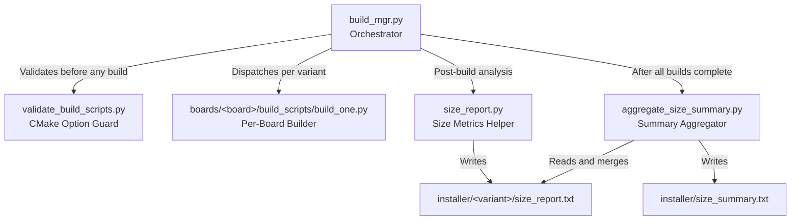
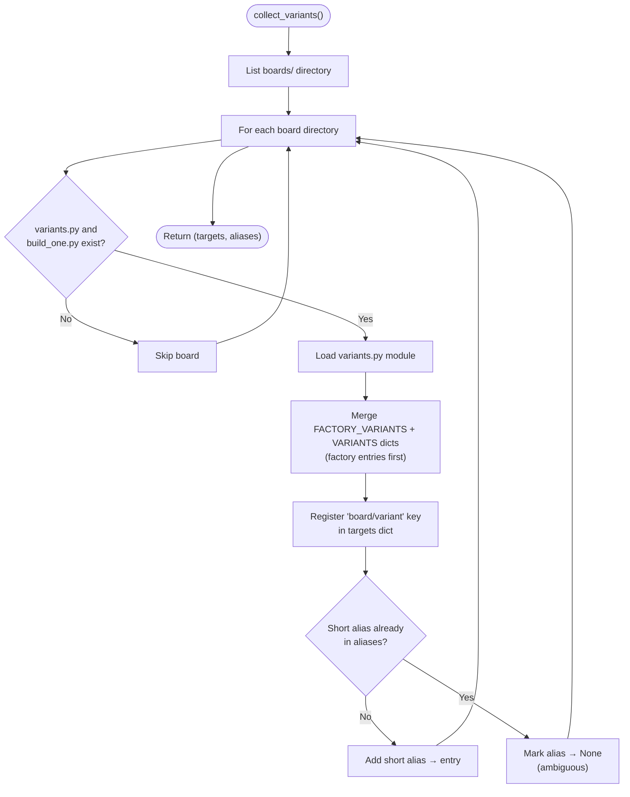
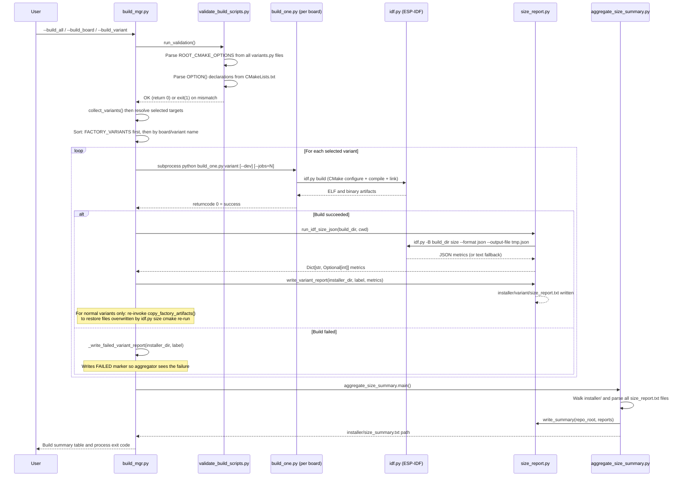
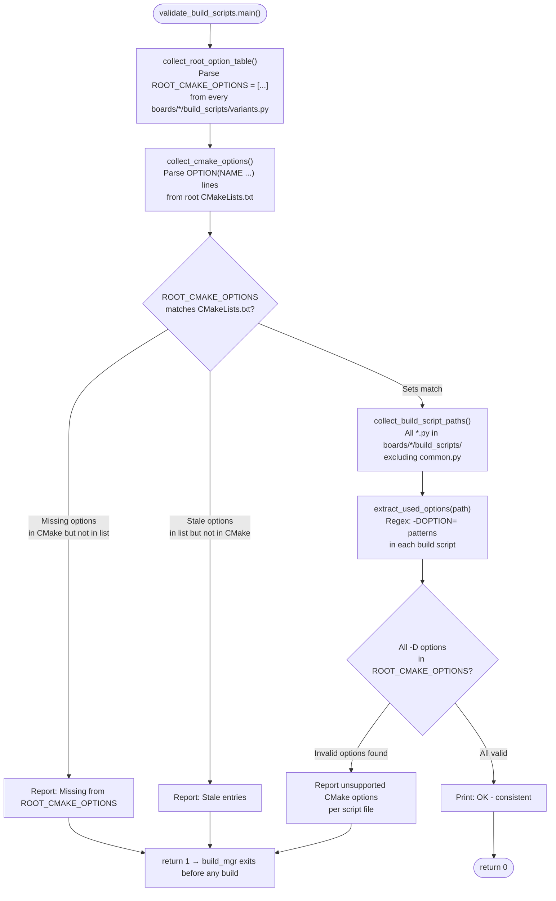
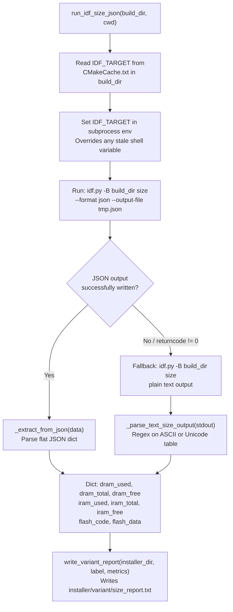
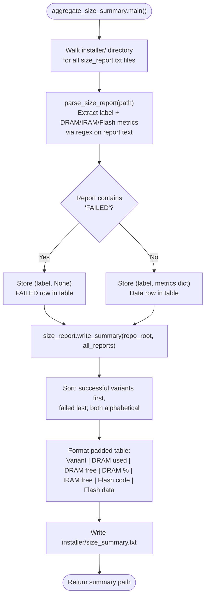
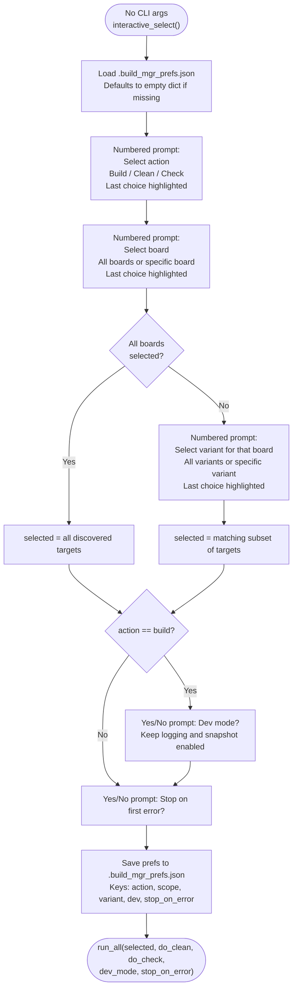

# Build Management — Build Scripts

## Introduction

The `tools_build_scripts_build_management` module is the central orchestration layer for building, cleaning, validating, and reporting on all board-specific firmware variants in the Pibot CNC Pendant project. It provides both a command-line and an interactive terminal interface to manage multi-board, multi-variant ESP-IDF firmware builds, enforce CMake option consistency across all board build scripts, and collect post-build memory and flash size reports.

This module is part of the broader [`tools_build_scripts`](tools_build_scripts.md) toolkit. For UI resource generation see [`tools_build_scripts_ui_resources`](tools_build_scripts_ui_resources.md). For other build utilities see [`tools_build_scripts_utilities`](tools_build_scripts_utilities.md).

---

## Architecture

The module is composed of four Python scripts that work together as a pipeline:



### Component Roles

| Script | Role |
|---|---|
| `build_mgr.py` | Top-level orchestrator: CLI and interactive mode, variant discovery, build dispatch, summary generation |
| `validate_build_scripts.py` | Pre-build guard: verifies `ROOT_CMAKE_OPTIONS` in every board's `variants.py` is consistent with root `CMakeLists.txt` |
| `size_report.py` | Post-build helper: runs `idf.py size`, parses results (JSON with text fallback), writes per-variant reports |
| `aggregate_size_summary.py` | Standalone aggregator: re-reads all `size_report.txt` files from disk and writes a unified `size_summary.txt` |

---

## Variant Discovery

Board variants are **not hardcoded** in `build_mgr.py`. The manager discovers them dynamically by scanning the `boards/` directory for each board's `build_scripts/variants.py`. This keeps the orchestrator decoupled from board-specific details.



Each discovered target is stored under two keys:

- **Full key**: `"board_name/variant_name"` — always unambiguous, usable directly on the CLI.
- **Alias key**: `"variant_name"` — a short-form alias. Set to `None` (ambiguous) if the same variant name appears on multiple boards; the user must use the full `board/variant` form in that case.

Board `variants.py` files define two dicts consumed during discovery:

| Dict | Purpose |
|---|---|
| `FACTORY_VARIANTS` | Factory firmware variants (bootloader, partitions, OTA initial image) |
| `VARIANTS` | Normal application firmware variants |

See the [Board Support Packages](Board_Support_Packages.md) documentation for the structure of per-board `variants.py`, `common.py`, and `build_one.py`.

---

## Build Pipeline

### Full Orchestration Flow



### Variant Sort Order

`run_all()` sorts selected targets so that **factory variants are always built before normal variants**. This ensures bootloader, partition table, and OTA initial-image artifacts exist before any normal installer attempts to bundle them.

```python
# Sort key in run_all(): factory variants → 0, others → 1; then board name, then variant name
selected = sorted(selected, key=lambda e: (0 if "factory" in e[2] else 1, e[1], e[2]))
```

---

## CMake Option Validation

Before any build or check, `build_mgr.py` unconditionally runs `validate_build_scripts.py` (skipped only for `--list`). This prevents wasted compile time when a build script references a CMake option that does not exist in `CMakeLists.txt`, which would silently produce a misconfigured firmware.



**Validation exclusions**: `PROD_BUILD` is excluded from the check. It is managed directly by `build_mgr.py` itself (injected at dispatch time, not via board `ROOT_CMAKE_OPTIONS`).

### What Is Validated

| Check | Source A | Source B | Error Condition |
|---|---|---|---|
| Option completeness | `CMakeLists.txt` `OPTION(...)` names | `ROOT_CMAKE_OPTIONS` lists in all `variants.py` | Option in CMake but not in any board list |
| Option staleness | `ROOT_CMAKE_OPTIONS` in `variants.py` | `CMakeLists.txt` `OPTION(...)` names | Option in board list but removed from CMake |
| Script correctness | `-D<OPTION>=` used in any `*.py` build script | `ROOT_CMAKE_OPTIONS` union set | Script uses an option not declared in CMake |

---

## Size Reporting

After each successful build, `build_mgr.py` collects memory and flash usage metrics via `size_report.py` and writes a human-readable report.

### Metrics Collection Flow



### Chip Architecture Handling

The size reporter transparently handles two ESP32 RAM architectures:

| Architecture | Representative Chips | JSON Key | Mapped To |
|---|---|---|---|
| Separate DRAM + IRAM | ESP32 | `dram_total`, `iram_total` | `dram_*` and `iram_*` separately |
| Combined DIRAM | ESP32-S3, ESP32-C3 | `diram_total` | Mapped to `dram_*` (the constrained heap budget) |

### IDF_TARGET Isolation

`run_idf_size_json()` reads the target chip directly from `CMakeCache.txt` and injects it as `IDF_TARGET` into the subprocess environment. This prevents cross-contamination when building multiple boards (which may target different chips) in a single session without clearing shell variables between boards.

### Per-Variant Report Format

Written to `installer/<variant>/size_report.txt`:

```
Size report for pibot_pendant_v1_0/8mb_wifi_fluidnc
======================================================================
DRAM         used=      80,596  total=     180,736  free=     100,140 (44.59%)
IRAM         used=      65,400  total=     131,072  free=      65,672 (49.90%)
Flash Code         648,880
Flash Data          72,400
======================================================================
```

When a build fails, a `FAILED` marker is written instead so the aggregator can detect it:

```
Size report for pibot_pendant_v1_0/8mb_wifi_fluidnc
======================================================================
FAILED
======================================================================
```

### Aggregated Summary

`aggregate_size_summary.py` operates entirely from on-disk `size_report.txt` files. It can be run standalone after a partial or interrupted batch build to regenerate `installer/size_summary.txt` without rebuilding.



Example aggregated output:

```
Firmware size summary
================================================================
              Variant | DRAM used | DRAM free | DRAM % | IRAM free | Flash code | Flash data
----------------------------------------------------------------
pibot_pendant.../8mb_wifi_fluidnc |    80,596 |   100,140 |  44.6% |    65,672 |    648,880 |     72,400
esp32_3248s035c/4mb_wifi_grbl     |    75,200 |   105,536 |  41.6% |    70,144 |    601,200 |     68,800
================================================================
Generated: 2 ok, 0 failed
```

---

## Interactive Mode

When invoked with no CLI arguments, `build_mgr.py` presents a numbered interactive prompt. Choices from the previous session are restored as defaults (indicated with `<-- last` next to the option and a bracketed default index in the prompt).



Preferences are stored at `tools/build_scripts/.build_mgr_prefs.json`. The file is created automatically on first interactive run and is gitignored.

---

## CLI Reference

```bash
python tools/build_scripts/build_mgr.py [MODE FLAG] [MODIFIERS]
```

### Mode Flags (mutually exclusive)

| Flag | Description |
|---|---|
| *(no flag)* | Launch interactive mode |
| `--list` / `--list-all` | List all discovered boards and variants |
| `--build_all` | Build all variants across all boards |
| `--build_board BOARD` | Build all variants for one board |
| `--build_variant VARIANT` | Build one variant; use `board/variant` if ambiguous |
| `--clean_all` | Remove build + installer dirs for all variants (no rebuild) |
| `--clean_board BOARD` | Clean all variants for one board |
| `--clean_variant VARIANT` | Clean one variant |
| `--check_all` | Validate scripts + `idf.py reconfigure` for all variants (no compilation) |
| `--check_board BOARD` | Check all variants for one board |
| `--check_variant VARIANT` | Check one variant |

### Modifier Flags

| Flag | Description |
|---|---|
| `--dev` | Dev mode: keeps dev tools enabled (logging, snapshot). Default: `PROD_BUILD=ON` disables all dev tools |
| `--stop_on_error` | Exit immediately after first build failure |
| `--jobs N` | Pass `-j N` to `idf.py`/ninja. Reduce if GCC internal-compiler-error crashes occur under memory pressure |

### Usage Examples

```bash
# List all available boards and variants
python tools/build_scripts/build_mgr.py --list

# Build all variants in production mode across all boards
python tools/build_scripts/build_mgr.py --build_all

# Build one board, stop immediately if any variant fails
python tools/build_scripts/build_mgr.py --build_board pibot_pendant_v1_0 --stop_on_error

# Build a variant by short name (only works if unique across all boards)
python tools/build_scripts/build_mgr.py --build_variant 8mb_wifi_fluidnc

# Build a variant on a specific board using the unambiguous full form
python tools/build_scripts/build_mgr.py --build_variant pibot_pendant_v1_0/8mb_wifi_fluidnc

# Build with dev tools enabled and 4 parallel compile jobs
python tools/build_scripts/build_mgr.py --build_all --dev --jobs 4

# Clean all boards (removes build + installer dirs; does NOT rebuild)
python tools/build_scripts/build_mgr.py --clean_all

# CMake-only check: validate scripts and reconfigure without compiling
python tools/build_scripts/build_mgr.py --check_all

# Re-aggregate size reports from disk without rebuilding
python tools/build_scripts/aggregate_size_summary.py
```

---

## Directory and File Conventions

```
tools/build_scripts/
├── build_mgr.py                    # Orchestrator (this module)
├── validate_build_scripts.py       # CMake option guard (runs before every build)
├── size_report.py                  # Size reporting helpers (idf.py size wrapper)
├── aggregate_size_summary.py       # Standalone disk-based report aggregator
└── .build_mgr_prefs.json           # Interactive mode preferences (auto-created, gitignored)

boards/
└── <board_name>/
    └── build_scripts/
        ├── variants.py             # Defines FACTORY_VARIANTS, VARIANTS, ROOT_CMAKE_OPTIONS
        ├── common.py               # Board helpers: build_variant, check_variant, installer_dir_for
        └── build_one.py            # Entry point invoked by build_mgr per variant

installer/                          # Generated artifacts (gitignored)
├── <variant_name>/
│   ├── size_report.txt             # Per-variant memory/flash report (or FAILED marker)
│   └── *.bin, *.json, ...          # Flashable firmware files produced by CMake
└── size_summary.txt                # Aggregated table across all variants
```

---

## Key Design Decisions

### Validation Before Every Build

`validate_build_scripts.py` is invoked unconditionally before dispatching any build or check operation (but not before `--list`). This catches `ROOT_CMAKE_OPTIONS` drift early — before any variant is compiled — rather than silently building with wrong feature flags after a `CMakeLists.txt` option rename.

### Factory-First Build Ordering

`run_all()` sorts selected targets so all factory variants complete before any normal firmware variant. Factory builds produce the bootloader binary, partition table, and OTA initial image that firmware installers bundle. Without this ordering, a normal installer could package stale or missing factory components.

### Factory Artifact Restoration After Size Reporting

Running `idf.py size` internally re-triggers CMake, which may re-execute firmware post-build hooks and overwrite factory artifacts copied into the normal firmware's installer directory. For **normal** variants only (those whose `cwd` is the repo root), `build_mgr.py` re-invokes `copy_factory_artifacts()` from the board's `common.py` after size collection to restore them. Factory variants themselves must never call this — their own installer directory has no cross-board factory artifact relationship.

### IDF_TARGET Isolation in Size Reporting

Multi-board sessions build different chips (ESP32, ESP32-S3, ESP32-C3) in sequence. If `IDF_TARGET` is set in the shell from a previous board, `idf.py size` would reject the mismatch and fail. `size_report.py` reads the actual target from `CMakeCache.txt` and forces it in the subprocess environment, making size collection immune to shell state between boards.

### Disk-Based Aggregation

`aggregate_size_summary.py` reads `size_report.txt` files from disk rather than collecting live metrics. This enables re-running the aggregation after a partial or interrupted batch build without rebuilding, and allows partial builds where only a subset of variants are refreshed while others retain their last written report.

---

## Relationships to Other Modules

| Module | Relationship |
|---|---|
| [Board Support Packages](Board_Support_Packages.md) | Each board's `build_scripts/` directory is the discovery source for `collect_variants()`. The `variants.py`, `common.py`, and `build_one.py` files define the per-board side of this build system. |
| [tools_build_scripts_ui_resources](tools_build_scripts_ui_resources.md) | Sibling module for generating UI resource partitions (images, fonts, themes). Operated independently from firmware builds but writes artifacts under the same `installer/` convention. |
| [tools_build_scripts_utilities](tools_build_scripts_utilities.md) | Sibling module containing supporting utilities: OTA initial image generation, sdkconfig splitting, and PNG-to-LVGL conversion. |
