# tools_build_scripts_ui_resources

The **UI Resources Build Scripts** module is the complete toolchain that converts raw source assets (PNG icons, lv_font_conv `.c` files, theme palette INI files, language pack `.lng` files) into the binary `ui_resources` flash partition consumed by the firmware at runtime. It also produces every derived artifact the firmware and end users depend on: stable-ID C headers, JSON manifests for downstream tools, SD-card update binaries, and self-contained distribution kits — all with no manual offset management.

---

## Table of Contents

1. [Overview](#1-overview)
2. [Architecture](#2-architecture)
3. [Component Reference](#3-component-reference)
   - 3.1 [resources_config.py — Asset Registry](#31-resources_configpy--asset-registry)
   - 3.2 [generate_resources.py — Build-Time Partition Generator](#32-generate_resourcespy--build-time-partition-generator)
   - 3.3 [generate_user_resources.py — SD-Card Full Update Builder](#33-generate_user_resourcespy--sd-card-full-update-builder)
   - 3.4 [generate_single_resource.py — Individual Slot Patcher](#34-generate_single_resourcepy--individual-slot-patcher)
   - 3.5 [build_ui_resources_from_manifest.py — Standalone Manifest Builder](#35-build_ui_resources_from_manifestpy--standalone-manifest-builder)
   - 3.6 [package_user_resources_kit.py — Kit Packager](#36-package_user_resources_kitpy--kit-packager)
4. [Partition Binary Format](#4-partition-binary-format)
5. [Resource Group System](#5-resource-group-system)
6. [Resource ID System](#6-resource-id-system)
7. [Board Override System](#7-board-override-system)
8. [Data Flow: Build Pipeline](#8-data-flow-build-pipeline)
9. [Data Flow: SD Update Mechanisms](#9-data-flow-sd-update-mechanisms)
10. [Partition Layout Algorithm](#10-partition-layout-algorithm)
11. [Generated C Headers](#11-generated-c-headers)
12. [Usage Reference](#12-usage-reference)
13. [Dependencies and Relationships](#13-dependencies-and-relationships)

---

## 1. Overview

The firmware renders its entire UI from assets stored in a dedicated `ui_resources` flash partition — icons, fonts, theme color palettes, and language packs. This module contains all the Python tooling that:

- **Defines** which assets exist and which firmware/transport combinations include them (`resources_config.py`).
- **Builds** the binary partition at firmware compile time (`generate_resources.py`).
- **Rebuilds** the partition from user-supplied PNG/font overrides without touching the repository (`generate_user_resources.py`, `build_ui_resources_from_manifest.py`).
- **Patches** a single icon or font slot without reflashing the whole partition (`generate_single_resource.py`).
- **Packages** a self-contained end-user kit from the build outputs (`package_user_resources_kit.py`).

The firmware resolves every resource by a stable 16-bit djb2 ID looked up in the partition's own binary directory — no compiled-in offsets — so partition layouts can change between builds without requiring a firmware recompile.

> **See also:**
> - [UI Resources Development Reference](https://github.com/luc-github/Pibot-cnc-pendant-firmware/blob/main/docs/ui_resources/development.md) — binary format details, `esp3d_resources.h/.cpp` API, partition tables.
> - [UI Resources Guide](https://github.com/luc-github/Pibot-cnc-pendant-firmware/blob/main/docs/guides/ui_resources_guide.md) — step-by-step workflows for modifying icons/fonts, regenerating, and flashing.
> - [Theme Palette Reference](https://github.com/luc-github/Pibot-cnc-pendant-firmware/blob/main/docs/ui_resources/theme_palette.md) — the 26 semantic color tokens and their roles.
> - [Build Management Scripts](tools_build_scripts_build_management.md) — `build_mgr.py` that orchestrates this module.

---

## 2. Architecture

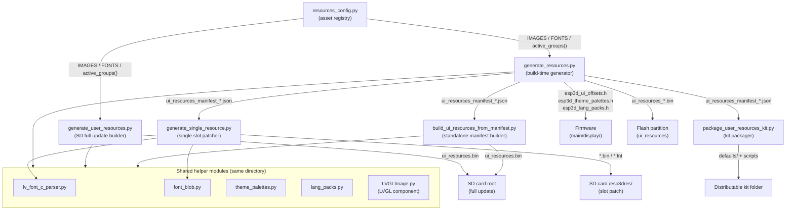

---

## 3. Component Reference

### 3.1 `resources_config.py` — Asset Registry

**File:** `tools/build_scripts/resources_config.py`

**Purpose:** Single source of truth for every image and font asset in the `ui_resources` partition. Defines which assets exist, where their sources live, what LVGL format they use, and which firmware/transport group controls their inclusion.

#### Data Structures

**`ImageConfig`**

```python
@dataclass
class ImageConfig:
    resource_subdir: str          # subfolder under resources/<resolution>/
    source_file:     str          # PNG filename
    format_type:     str          # LVGL color format ('I4', 'RGB565', ...)
    group:           str          # inclusion group (see §5)
    output_name:     Optional[str] = None  # override output symbol name
```

**`FontConfig`**

```python
@dataclass
class FontConfig:
    source_file:     str          # .c filename (lv_font_conv output)
    group:           str          # inclusion group
    output_name:     Optional[str] = None  # override output symbol name
```

The `.c` file is parsed (not compiled) by `lv_font_c_parser.py` and re-serialized into a position-independent blob format by `font_blob.py` — no compiler toolchain dependency at build time.

#### Asset Inventory

| List | Count | Groups Covered |
|------|-------|----------------|
| `FONTS` | 3 | `shared` |
| `IMAGES` | ~80 | `shared`, `cnc`, `fluidnc`, `grblhal`, `grbl`, `wifi`, `bt`, `sound`, `light`, `emulation` |

**Defined fonts:**

```python
FONTS = [
    FontConfig("orbitron_10.c", "shared", output_name="small_font"),
    FontConfig("orbitron_14.c", "shared", output_name="medium_font"),
    FontConfig("orbitron_22.c", "shared", output_name="large_font"),
]
```

**Image groups (sample):**

| Group | Example Images |
|-------|---------------|
| `grblhal` | `logo_grblhal/logo.png`, `read_only_s.png` |
| `fluidnc` | `logo_fluidnc/logo.png` |
| `grbl` | `logo_grbl/logo.png` |
| `cnc` | `M3_b`, `M4_b`, `Alarm_s`, `Home_s`, `Jog_s`, `Hold_feed_b`, `Soft_reset_b`, … |
| `shared` | `Settings_m`, `Files_m`, `back_b`, `Ok_b`, `Lock_b`, `Edit_b`, `Play_b`, `Stop_b`, … |
| `wifi` | `Wifi_s`, `No_wifi_s`, `Connect_telnet_b`, `scan_wifi_b`, `scan_server_b` |
| `bt` | `bluetooth_m`, `bluetooth_ble_m`, `Connect_bt_b`, `Disconnect_bt_b` |
| `sound` | `sound_m`, `no_sound_m` |
| `light` | `light_m` |
| `emulation` | `Arrow_up_b`, `Arrow_down_b`, `Snowflake_mini_b`, `Code_mini_b`, … |

#### Group Selection Function

```python
GROUPS_ALWAYS = {"shared", "sound", "light", "emulation"}

GROUPS_BY_FW = {
    "fluidnc": {"fluidnc", "cnc"},
    "grblhal": {"grblhal", "cnc"},
    "grbl":    {"grbl", "cnc"},
}

GROUPS_BY_TRANSPORT = {
    "wifi":      {"wifi"},
    "bt":        {"bt"},
    "bt_serial": {"bt"},
    "bt_ble":    {"bt"},
    "serial":    set(),
}

def active_groups(fw: str, transport: str) -> set:
    groups = set(GROUPS_ALWAYS)
    groups |= GROUPS_BY_FW.get(fw, set())
    groups |= GROUPS_BY_TRANSPORT.get(transport, set())
    return groups
```

---

### 3.2 `generate_resources.py` — Build-Time Partition Generator

**File:** `tools/build_scripts/generate_resources.py`

**Purpose:** Converts source assets into the complete `ui_resources` binary partition and all derived C headers at firmware compile time. Called by each board's `build_scripts/common.py` during `idf.py build`.

#### Key Functions

| Function | Description |
|----------|-------------|
| `main()` | CLI entry point; orchestrates all phases |
| `parse_variant(variant)` | Parses `"8mb_wifi_grblhal"` → `{mem, transport, fw}` |
| `convert_png_to_bin(png, fmt, out_dir)` | Invokes `LVGLImage.py --ofmt BIN`, returns raw bytes |
| `parse_lvgl_bin_header(data)` | Reads the 12-byte LVGL 9.x image binary header |
| `resolve_board_source(board_root, rel_path, default)` | Path resolution with board override priority |
| `read_ui_resources_partition_size(csv_path)` | Reads partition budget from `partitions_*.csv` |
| `djb2_id(name)` | Stable `uint16_t` ID from lowercase djb2 hash |
| `make_variant_key(transport, fw)` | Collision-free 12-byte ASCII partition header key |
| `check_id_collisions(names, kind)` | Aborts build if two names share a 16-bit djb2 ID |
| `align4(offset)` | Rounds up to 4-byte boundary |
| `symbol_name(name)` | `"ok_b"` → `"OK_B"` for C symbol generation |

#### Processing Phases

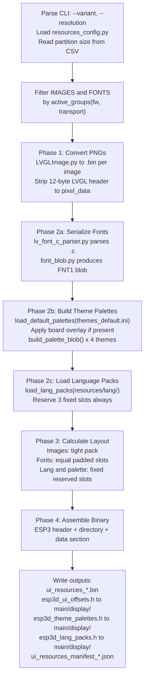

#### Outputs

| Output File | Destination | Consumer |
|-------------|-------------|----------|
| `ui_resources_{mem}MB_{transport}_{fw}.bin` | `build/<variant>/` | Flash programmer |
| `esp3d_ui_offsets.h` | `build/<variant>/` + `main/display/` | Firmware C++ (image/font IDs, X-macros) |
| `esp3d_theme_palettes.h` | `build/<variant>/` + `main/display/` | Firmware C++ (fallback palette values) |
| `esp3d_lang_packs.h` | `build/<variant>/` + `main/display/` | Firmware C++ (lang slot IDs) |
| `ui_resources_manifest_*.json` | `build/<variant>/` | `generate_single_resource.py`, `package_user_resources_kit.py` |

#### Operation Modes

| Mode | Condition | Behavior |
|------|-----------|----------|
| **Normal build** | `--partition-csv` provided | Enforces partition size limit; fonts get equal padded slots absorbing all remaining space |
| **Size estimation** | `--partition-csv` omitted | No size limit enforced; fonts packed tight; prints tight-fit size and recommended size (+10%/8 KB, rounded to 4 KB) |

#### CLI Usage

```bash
# Normal build with partition size enforcement
python tools/build_scripts/generate_resources.py \
    --variant 8mb_wifi_grblhal \
    --resolution res_480_320 \
    --partition-csv boards/dlc32_max_lcd/partitions_8mb.csv

# With board-level asset overrides
python tools/build_scripts/generate_resources.py \
    --variant 4mb_bt_fluidnc \
    --resolution res_320_240 \
    --partition-csv boards/pibot_pendant_v1_0/partitions_4mb.csv \
    --board-resources boards/pibot_pendant_v1_0/resources \
    --out build/4mb_bt_fluidnc/

# Estimate partition size for a new board (no CSV required)
python tools/build_scripts/generate_resources.py \
    --variant 8mb_serial_fluidnc \
    --resolution res_800_480

# List known variants
python tools/build_scripts/generate_resources.py --list-variants

# Dry run: show which images would be included without converting
python tools/build_scripts/generate_resources.py \
    --variant 8mb_wifi_grblhal --resolution res_480_320 --dry-run
```

---

### 3.3 `generate_user_resources.py` — SD-Card Full Update Builder

**File:** `tools/build_scripts/generate_user_resources.py`

**Purpose:** Generates a `ui_resources.bin` for SD-card delivery, with user-supplied PNG/font/theme overrides applied on top of the repo defaults. The output filename is exactly what the firmware scans for at the SD card root.

#### Override Resolution

For each asset, the script looks for a match by filename in `--overrides` first; if not found, falls back to the repo's `resources/` tree. Font overrides accept either a replacement `.c` (lv_font_conv output) or a pre-serialized `.fnt` blob — the stem match is tried first (`orbitron_14.fnt` before `orbitron_14.c`).

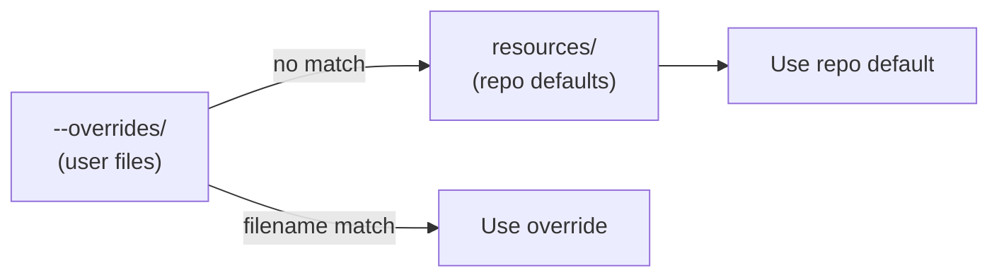

#### Override Types

| Asset Type | Override Format | Lookup Key |
|------------|----------------|------------|
| Image | `.png` | `source_file` from `ImageConfig` |
| Font | `.fnt` (pre-serialized blob) | `<stem>.fnt` — tried first |
| Font | `.c` (lv_font_conv) | `source_file` from `FontConfig` |
| Theme | `esp3dtheme.ini` | Fixed filename; partial overlay merged onto defaults |
| Language | `*.lng` | Matched by target slot number |

#### Key Differences from `generate_resources.py`

| Aspect | `generate_resources.py` | `generate_user_resources.py` |
|--------|------------------------|------------------------------|
| Source resolution | `resources/` tree only | `--overrides/` first, then `resources/` |
| Partition size | From `--partition-csv` (required) | From `--partition-csv` (required) |
| Output name | `ui_resources_{mem}MB_{transport}_{fw}.bin` | Always `ui_resources.bin` |
| C headers | Written + copied to `main/display/` | Not written |
| JSON manifest | Written | Not written |
| Board overrides | `--board-resources` flag | N/A (user's `--overrides` serves this role) |

#### `symbol_name(name)` Helper

```python
def symbol_name(name: str) -> str:
    return name.upper()
```

Converts an asset name like `"ok_b"` to `"OK_B"`. The same helper exists in `generate_resources.py`; the copy here is used for verbose output labels during user builds.

#### CLI Usage

```bash
# Rebuild stock binary for a variant (no overrides)
python tools/build_scripts/generate_user_resources.py \
    --variant 8mb_wifi_grblhal \
    --resolution res_480_320 \
    --partition-csv boards/dlc32_max_lcd/partitions_8mb.csv \
    --out ui_resources.bin

# With custom icons and a custom font
python tools/build_scripts/generate_user_resources.py \
    --variant 8mb_wifi_grblhal \
    --resolution res_480_320 \
    --partition-csv boards/dlc32_max_lcd/partitions_8mb.csv \
    --overrides ~/my_icons/ \
    --out ui_resources.bin

# Dry run: show which files are overridden before converting
python tools/build_scripts/generate_user_resources.py \
    --variant 8mb_wifi_grblhal --resolution res_480_320 \
    --partition-csv boards/dlc32_max_lcd/partitions_8mb.csv \
    --overrides ~/my_icons/ --dry-run
```

---

### 3.4 `generate_single_resource.py` — Individual Slot Patcher

**File:** `tools/build_scripts/generate_single_resource.py`

**Purpose:** Generates a single-resource patch file for the `/esp3dres/` SD-card mechanism. No full partition reflash required — the firmware validates the patch against the partition directory and writes only the changed slot in-place.

#### Subcommands

| Command | Output | SD Card Path | Firmware Action |
|---------|--------|--------------|-----------------|
| `list` | Console listing | — | — |
| `image` | `<name>.bin` with `ESPI` header | `/esp3dres/<name>.bin` | Validate ID + size, write pixel data, rename `.ok`/`.bad` |
| `font` | `<name>.fnt` with `ESPF` header | `/esp3dres/<name>.fnt` | Validate ID + blob size vs slot_size, write blob, rename `.ok`/`.bad` |

#### Patch File Headers

**Image patch header (`ESPI`, 20 bytes, little-endian):**

| Field | Type | Description |
|-------|------|-------------|
| magic | `4s` | `b'ESPI'` |
| id | `u16` | djb2 hash of image name |
| cf | `u8` | LVGL color format byte |
| reserved | `u8` | 0 |
| w | `u16` | Width in pixels |
| h | `u16` | Height in pixels |
| stride | `u16` | Row stride in bytes |
| reserved2 | `u16` | 0 |
| data_size | `u32` | Pixel data byte count |

**Font patch header (`ESPF`, 12 bytes, little-endian):**

| Field | Type | Description |
|-------|------|-------------|
| magic | `4s` | `b'ESPF'` |
| id | `u16` | djb2 hash of font name |
| reserved | `u16` | 0 |
| data_size | `u32` | Font blob byte count |

#### Slot Size Validation

The manifest's `slot_size` is the maximum blob the firmware will accept for an in-place write:

- **Manifest with `slot_size`**: `len(blob) <= slot_size` — allows custom fonts of any size up to the reserved headroom.
- **Old manifest without `slot_size`**: `len(blob) == data_size` exactly — no headroom was reserved in that partition build.

#### CLI Usage

```bash
# List available resources in a manifest
python tools/build_scripts/generate_single_resource.py list \
    --manifest build/8mb_wifi_grblhal/ui_resources_manifest_8MB_wifi_grblhal.json

# Generate an image patch
python tools/build_scripts/generate_single_resource.py image \
    --name wifi_client \
    --png ~/my_wifi.png \
    --manifest build/8mb_wifi_grblhal/ui_resources_manifest_8MB_wifi_grblhal.json \
    --out wifi_client.bin

# Generate a font patch from a lv_font_conv .c file
python tools/build_scripts/generate_single_resource.py font \
    --name medium_font \
    --font ~/orbitron_14_custom.c \
    --manifest build/8mb_wifi_grblhal/ui_resources_manifest_8MB_wifi_grblhal.json

# Generate a font patch from a pre-serialized .fnt blob
python tools/build_scripts/generate_single_resource.py font \
    --name medium_font \
    --font ~/orbitron_14.fnt \
    --manifest build/8mb_wifi_grblhal/ui_resources_manifest_8MB_wifi_grblhal.json
```

---

### 3.5 `build_ui_resources_from_manifest.py` — Standalone Manifest Builder

**File:** `tools/build_scripts/build_ui_resources_from_manifest.py`

**Purpose:** Repo-independent partition builder driven entirely by a JSON manifest produced at firmware build time. Does **not** import `resources_config.py`. Designed to be distributed as part of the `ui_resources_kit/` — users need no repository clone.

#### Design Principles

- **No group logic**: the manifest already encodes the fully resolved asset list for one specific build.
- **Sanity checks before write**: PNG dimensions are verified against manifest expectations (requires Pillow); font bpp is validated before serialization. A mismatch aborts with a clear error.
- **Layout recomputed from actual blobs**: same algorithm as `generate_resources.py` (tight image pack, equal padded font slots), so a no-overrides run produces a byte-for-byte identical partition.
- **Partial override**: supply only the files you want to change; everything else falls through from `--overrides` to `--defaults`.

#### Source Resolution Order

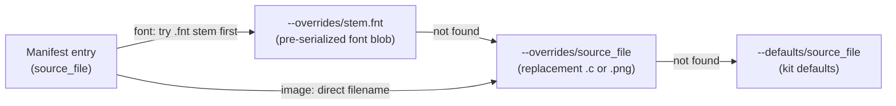

#### CLI Usage

```bash
# Full rebuild with custom overrides
python build_ui_resources_from_manifest.py \
    --manifest ui_resources_manifest_8MB_wifi_grblhal.json \
    --defaults defaults/ \
    --overrides my_custom_files/ \
    --out ui_resources.bin

# Validate sources and print plan without writing
python build_ui_resources_from_manifest.py \
    --manifest ui_resources_manifest_8MB_wifi_grblhal.json \
    --defaults defaults/ \
    --dry-run

# Point at an external LVGLImage.py when running outside the repo
python build_ui_resources_from_manifest.py \
    --manifest ui_resources_manifest_8MB_wifi_grblhal.json \
    --defaults defaults/ \
    --lvgl-image-script /path/to/LVGLImage.py \
    --out ui_resources.bin
```

---

### 3.6 `package_user_resources_kit.py` — Kit Packager

**File:** `tools/build_scripts/package_user_resources_kit.py`

**Purpose:** Assembles a self-contained distribution folder from a completed build. Called automatically by `build_mgr.py` after `generate_resources.py` succeeds.

#### Kit Contents

```
ui_resources_kit/
├── ui_resources_manifest_*.json          <- from generate_resources.py
├── build_ui_resources_from_manifest.py   <- standalone builder
├── generate_single_resource.py           <- slot patcher
├── lv_font_c_parser.py                   <- font .c parser
├── font_blob.py                          <- font blob serializer
├── theme_palettes.py                     <- palette helpers
├── lang_packs.py                         <- language pack helpers
├── LVGLImage.py                          <- LVGL image converter
├── ttf_to_fnt.py                         <- TTF to .fnt converter
├── font_c_to_fnt.py                      <- .c to .fnt converter
├── image_c_to_bin.py                     <- .c to .bin converter
├── requirements_font_tools.txt           <- deps for font converters
├── README.md                             <- from docs/user documentation/ui_resources_customization.md
└── defaults/
    ├── ok_b.png, back_b.png, ...         <- all default PNGs for this variant
    ├── orbitron_10.c, ...                <- all default font .c files
    ├── themes_default.ini                <- default (or board-baked) theme palettes
    ├── en.lng, ...                       <- default language packs (if any)
    ├── Orbitron-*.ttf, FontAwesome*.ttf  <- source TTFs (discovered from .c Opts: comments)
    └── OFL.txt                           <- font license (when TTFs from ttf_dir)
```

#### Board Override Baking

When the build used `--board-resources`, the board's theme overlay is **merged into** `defaults/themes_default.ini` rather than shipping as a separate overlay layer, so users see the board's shipped appearance as their baseline.

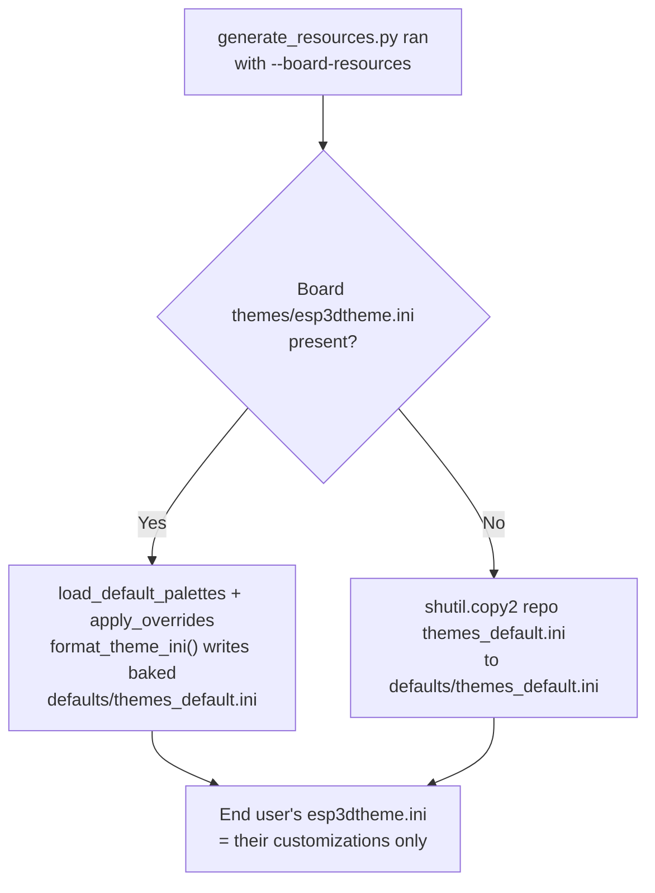

#### TTF Discovery

The packager inspects each default font `.c` file's `Opts:` comment (via `font_opts.py`) to discover which source TTF/WOFF files were used, then copies those files from `resources/fonts/ttf/` or LVGL's built-in font directory into `defaults/`. This allows kit users to regenerate any font at a different size or merge in an icon font without resupplying files the kit already contains.

#### CLI Usage

```bash
python tools/build_scripts/package_user_resources_kit.py \
    --variant 8mb_wifi_grblhal \
    --manifest build/8mb_wifi_grblhal/ui_resources_manifest_8MB_wifi_grblhal.json \
    --out installer/8mb_wifi_grblhal/ui_resources_kit
```

---

## 4. Partition Binary Format

The `ui_resources` partition uses a custom binary format read by `esp3d_resources_init()` at firmware boot. All integers are **little-endian**.

### Layout Overview

```
Offset 0:
  [0..3]   'ESP3' magic (4 bytes)
  [4..15]  variant_key (12 bytes, ASCII null-padded)

Offset 16 — Directory Header (8 bytes):
  [16..17] num_images (u16)
  [18..19] num_fonts  (u16)  — includes fonts + lang slots + palettes
  [20..23] data_section_offset (u32)

Offset 24 — Image Directory (N x 20 bytes each)
After images — Font Directory (M x 16 bytes each)
  (covers font blobs, language slots, and palette slots)

Padding to 4-byte boundary.

Offset data_section_offset — Data Section:
  · Image pixel blobs   (tightly packed, each 4-byte aligned)
  · Font FNT1 blobs     (equal padded slots)
  · Language pack blobs (fixed LANG_SLOT_SIZE slots x 3)
  · Theme palette blobs (fixed slots x 4 themes)
```

### Image Directory Entry (20 bytes)

| Offset | Field | Type | Description |
|--------|-------|------|-------------|
| 0 | `id` | `u16` | djb2 hash of the image name |
| 2 | `cf` | `u8` | LVGL color format byte |
| 3 | `reserved` | `u8` | — |
| 4 | `w` | `u16` | Width in pixels |
| 6 | `h` | `u16` | Height in pixels |
| 8 | `stride` | `u16` | Row stride in bytes |
| 10 | `reserved2` | `u16` | — |
| 12 | `data_offset` | `u32` | Offset from `data_section_offset` |
| 16 | `data_size` | `u32` | Pixel data size in bytes |

Struct format: `<HBBHHHHII`

### Font/Palette/Language Directory Entry (16 bytes)

| Offset | Field | Type | Description |
|--------|-------|------|-------------|
| 0 | `id` | `u16` | djb2 hash of the slot name |
| 2 | `reserved` | `u16` | — |
| 4 | `data_offset` | `u32` | Offset from `data_section_offset` |
| 8 | `data_size` | `u32` | Actual blob size (must be <= `slot_size`) |
| 12 | `slot_size` | `u32` | Total bytes reserved for this slot |

Struct format: `<HHIII`

### Slot Types in the Font Directory

| Name | Content | Size Policy |
|------|---------|-------------|
| `small_font`, `medium_font`, `large_font` | FNT1 font blob | Equal padded slots absorbing all space remaining after images, lang, and palettes |
| `lang1`, `lang2`, `lang3` | Language pack blob or empty | Fixed `LANG_SLOT_SIZE` each — always reserved even when no `.lng` source exists |
| `theme1`, `theme2`, `theme3`, `theme4` | Theme palette blob | Fixed `align4(PALETTE_BLOB_SIZE + THEME_NAME_SIZE)` each |

---

## 5. Resource Group System

Groups determine which assets are bundled into a given firmware build variant. The variant string (`<mem>mb_<transport>_<fw>`) fully determines the active group set.

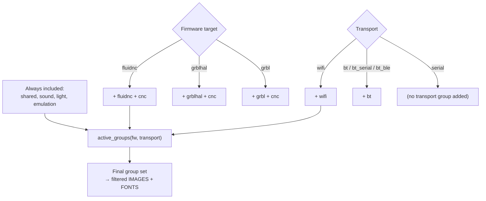

### Group Definitions

| Group | When Included | Notes |
|-------|--------------|-------|
| `shared` | Always | Generic UI elements (buttons, icons, navigation) |
| `cnc` | Any CNC firmware | CNC-specific status icons, jog, alarm, probe |
| `fluidnc` | `fw == "fluidnc"` | FluidNC logo; FluidNC-specific icons |
| `grblhal` | `fw == "grblhal"` | grblHAL logo; read-only status icon |
| `grbl` | `fw == "grbl"` | GRBL legacy logo |
| `wifi` | Transport is `wifi` | WiFi status, scan, and telnet connect icons |
| `bt` | Transport is any BT type | Bluetooth classic and BLE icons |
| `sound` | Always | Built unconditionally; firmware gates via `#ifdef BUZZER_SERVICE` |
| `light` | Always | Built unconditionally; firmware gates via `#ifdef TFT_BRIGHTNESS_CONTROL` |
| `emulation` | Always | Built unconditionally; firmware gates via `#ifdef EMULATE_INPUT_HARDWARE` |

---

## 6. Resource ID System

Every image and font is identified at runtime by a stable 16-bit ID derived from its name using the djb2 hash. The firmware resolves resources by ID — partition positions and sizes are read from the directory at boot, not compiled in.

```python
def djb2_id(name: str) -> int:
    """Stable uint16_t ID from lowercase djb2 hash of the asset name."""
    h = 5381
    for c in name.lower():
        h = ((h << 5) + h) + ord(c)
    return h & 0xFFFF
```

### ID Collision Prevention

`check_id_collisions()` runs in `generate_resources.py` for images and for fonts/palettes/lang separately. Any collision aborts the build with an explicit error naming both colliding strings. Collision is avoided by renaming one asset.

### Variant Key Format

The 12-byte variant key is embedded in the partition binary header and emitted as `RESOURCES_VARIANT` in `esp3d_ui_offsets.h`. The firmware checks this at boot to detect a partition built for a different firmware variant.

| Condition | Key Format | Example |
|-----------|-----------|---------|
| `transport_fw` fits in 12 bytes | Used verbatim | `wifi_grblhal` |
| `transport_fw` longer than 12 bytes | First 8 chars + 4 hex digits of djb2(full) | `bt_seria3f2a` |

The hash suffix prevents two full strings sharing the same 8-character prefix from receiving identical keys.

---

## 7. Board Override System

Individual boards can supply their own asset files (custom logo, board-specific icons, different font) without modifying the shared `resources/` tree. The override path is implicitly resolution-scoped, so a `logo.png` override in the FluidNC subfolder does not affect the grblHAL subfolder.

### Path Resolution

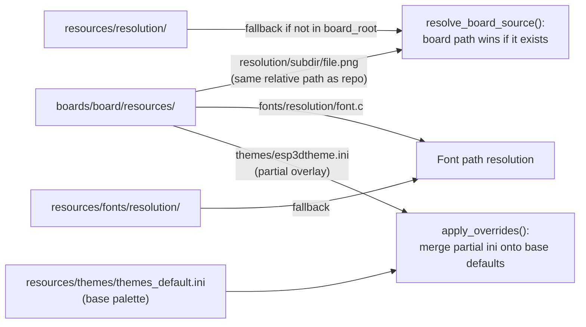

### Override Path Scoping

The `rel_path` passed to `resolve_board_source()` carries the resolution and subdir components:

```
<resolution>/<resource_subdir>/<source_file>
e.g.  res_320_240/logo_fluidnc/logo.png
```

So `boards/pibot_pendant_v1_0/resources/res_320_240/logo_fluidnc/logo.png` overrides the FluidNC logo only at the 320×240 resolution and only for the FluidNC subdir. No other variant or resolution is affected.

### CLI Flag

```bash
--board-resources boards/<board>/resources
```

If the directory does not exist, the flag is silently ignored and the build continues with repo defaults (a warning is printed). The board's `build_scripts/common.py` only passes the flag when the directory is confirmed to exist.

---

## 8. Data Flow: Build Pipeline

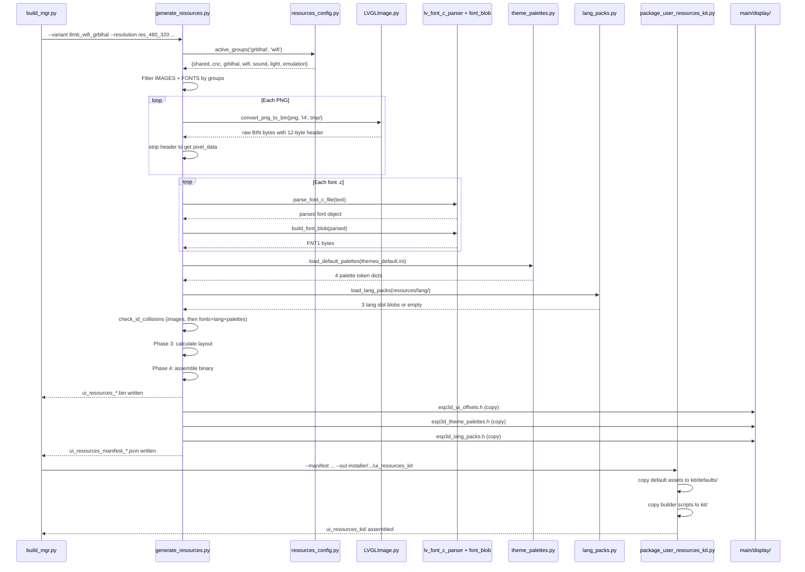

---

## 9. Data Flow: SD Update Mechanisms

Three independent update paths cover different scope and depth trade-offs. All are applied automatically by the firmware at boot — no user interaction beyond placing the file on the SD card.

```mermaid
flowchart TD
    subgraph U1["Full partition update via generate_user_resources.py"]
        A1["generate_user_resources.py\nwith --overrides folder"]
        A2["ui_resources.bin"]
        A3["SD card root /"]
        A4["Firmware: ESP3DUpdateService\nflash entire partition then reboot"]
        A1 --> A2 --> A3 --> A4
    end

    subgraph U2["Full partition update via kit (no repo needed)"]
        B1["build_ui_resources_from_manifest.py\n--defaults kit/defaults/ --overrides ..."]
        B2["ui_resources.bin"]
        B3["SD card root /"]
        B4["Same firmware detection path"]
        B1 --> B2 --> B3 --> B4
    end

    subgraph U3["Single slot patch"]
        C1["generate_single_resource.py\nimage or font subcommand"]
        C2["*.bin or *.fnt patch file"]
        C3["SD card /esp3dres/"]
        C4["Firmware: validate ID and size\nwrite slot in-place\nrename .ok or .bad"]
        C1 --> C2 --> C3 --> C4
    end

    subgraph U4["Theme-only update"]
        D1["esp3dtheme.ini\n(partial token overrides)"]
        D2["SD card root /"]
        D3["Firmware: merge tokens\ninto palette slots in partition"]
        D1 --> D2 --> D3
    end
```

### Update Path Comparison

| Path | Scope | Requires Repo | Binary Format | Validation |
|------|-------|---------------|---------------|------------|
| `generate_user_resources.py` | Entire partition | Yes | Full partition binary | Partition size check |
| `build_ui_resources_from_manifest.py` | Entire partition | No (kit only) | Full partition binary | Dimension + bpp + size checks |
| `generate_single_resource.py` | Single slot | Manifest only | `ESPI`/`ESPF` patch file | ID + slot_size check |
| `esp3dtheme.ini` on SD | Palette slots only | No | INI text file | Token key validation |

---

## 10. Partition Layout Algorithm

The layout algorithm is **identical** across `generate_resources.py`, `generate_user_resources.py`, and `build_ui_resources_from_manifest.py`. This guarantees that a no-overrides user build produces a byte-for-byte identical partition to the firmware build's output.

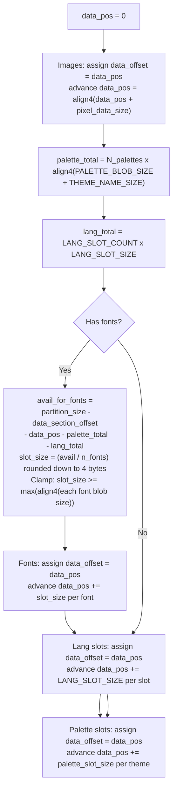

### Design Rationale

| Element | Sizing Strategy | Reason |
|---------|----------------|--------|
| Images | Tight pack | Size is deterministic from pixel dimensions + format; override always matches |
| Fonts | Equal padded slots absorbing all remaining space | A custom font blob rarely matches the original byte size; headroom allows in-place SD update without repack |
| Language slots | Fixed `LANG_SLOT_SIZE`, reserved before font split | Prevents font slot-splitting from eating into space needed for language updates |
| Palette slots | Fixed `PALETTE_BLOB_SIZE + THEME_NAME_SIZE` | Extra bytes allow a later SD `esp3dtheme.ini` update to add a display name in-place without repack |

**Degenerate case:** if the partition is so tight that `slot_size < max(font_blob_sizes)`, the slot is clamped to the minimum needed and a `TIGHT (no headroom)` warning is printed. An SD font update that grows even 1 byte would then require a full partition repack via `generate_user_resources.py` or `build_ui_resources_from_manifest.py`.

---

## 11. Generated C Headers

### `esp3d_ui_offsets.h`

Contains stable image/font IDs and X-macros. **No raw offsets or sizes** — those live in the partition directory and are read at boot by `esp3d_resources_init()`. Automatically copied from `build/<variant>/` to `main/display/`.

```c
// Variant key — firmware checks this against the partition header at boot.
#define RESOURCES_VARIANT "wifi_grblhal"

// Canonical icon size for this resolution (from generic_img dimensions).
#define RESOURCES_ICON_SIZE 48U

// Image IDs (stable djb2 hash — independent of partition layout).
#define IMG_ID_OK_B    0x3A2FU  // ok_b  48x48  LV_COLOR_FORMAT_I4
#define IMG_ID_BACK_B  0x1C10U  // back_b  48x48  LV_COLOR_FORMAT_I4
// ...

// X-macro — iterate all images:
// #define X(name, SYM, id)  ...
// ESP3D_IMAGES_LIST
// #undef X
#define ESP3D_IMAGES_LIST         \
    X(ok_b, OK_B, IMG_ID_OK_B)   \
    X(back_b, BACK_B, IMG_ID_BACK_B) \
    // ...

// Font IDs.
#define FONT_ID_SMALL_FONT  0x1B7EU
// ...

// X-macro — iterate all fonts:
#define ESP3D_FONTS_LIST                                      \
    XFONT(small_font, SMALL_FONT, FONT_ID_SMALL_FONT) \
    // ...
```

### `esp3d_theme_palettes.h`

Compiled-in fallback palette values used if the partition is absent or corrupt. Generated from the same `themes_default.ini` used to build the palette blobs — the two can never diverge.

```c
#define ESP3D_THEME_PALETTE_COUNT  4U
#define ESP3D_THEME_TOKEN_COUNT   26U

#define ESP3D_THEME_PALETTE_ID_THEME1  0x...U
// ...

// Brace initializer for ThemeTokens[4] — field order matches TOKEN_ORDER.
#define ESP3D_THEME_PALETTES_FALLBACK_INIT { \
    { 0xRRGGBBAA, /* ... 26 tokens */ },  /* theme1 */ \
    /* theme2, theme3, theme4 ... */       \
}
```

### `esp3d_lang_packs.h`

djb2 IDs for the three language slot positions in the partition's font directory.

```c
#define ESP3D_LANG_SLOT_COUNT  3U
#define ESP3D_LANG_SLOT_SIZE   <N>U

#define ESP3D_LANG_SLOT_ID_LANG1  0x...U
#define ESP3D_LANG_SLOT_ID_LANG2  0x...U
#define ESP3D_LANG_SLOT_ID_LANG3  0x...U

#define ESP3D_LANG_SLOT_IDS_INIT { \
    ESP3D_LANG_SLOT_ID_LANG1,      \
    ESP3D_LANG_SLOT_ID_LANG2,      \
    ESP3D_LANG_SLOT_ID_LANG3       \
}
```

---

## 12. Usage Reference

### Normal Firmware Build (automatic via `build_mgr.py`)

```
idf.py build
  └─ board's build_scripts/common.py
       ├─ generate_resources.py   -> partition binary + C headers + manifest
       └─ package_user_resources_kit.py  -> distributable kit folder
```

### Customize Icons/Fonts via SD Card (repo required)

```bash
# Place replacement PNGs (same filename) in ~/my_icons/
python tools/build_scripts/generate_user_resources.py \
    --variant 8mb_wifi_grblhal \
    --resolution res_480_320 \
    --partition-csv boards/dlc32_max_lcd/partitions_8mb.csv \
    --overrides ~/my_icons/ \
    --out ui_resources.bin
# Copy ui_resources.bin to SD card root, insert, power on.
```

### Customize via the Distributable Kit (no repo needed)

```bash
# Unzip the ui_resources_kit for your board variant.
# Place replacement files in overrides/
python build_ui_resources_from_manifest.py \
    --manifest ui_resources_manifest_8MB_wifi_grblhal.json \
    --defaults defaults/ \
    --overrides overrides/ \
    --out ui_resources.bin
# Copy ui_resources.bin to SD card root, insert, power on.
```

### Patch a Single Icon (no full rebuild)

```bash
python tools/build_scripts/generate_single_resource.py image \
    --name wifi_client \
    --png ~/my_wifi.png \
    --manifest build/8mb_wifi_grblhal/ui_resources_manifest_8MB_wifi_grblhal.json
# Copy wifi_client.bin to SD card /esp3dres/ — firmware patches slot on next boot.
```

### Estimate Partition Size for a New Board

```bash
python tools/build_scripts/generate_resources.py \
    --variant 8mb_wifi_grblhal \
    --resolution res_800_480
# Output: "Recommended size: NNNN bytes (0xNNNN) — use in partitions_*.csv"
```

---

## 13. Dependencies and Relationships

### Internal Dependencies (same `tools/build_scripts/` directory)

| Module | Used By | Purpose |
|--------|---------|---------|
| `lv_font_c_parser.py` | `generate_resources.py`, `generate_user_resources.py`, `build_ui_resources_from_manifest.py`, `generate_single_resource.py` | Parse lv_font_conv `.c` output into a structured font object |
| `font_blob.py` | Same as above | Serialize parsed font into a position-independent `FNT1` binary blob |
| `theme_palettes.py` | `generate_resources.py`, `generate_user_resources.py`, `build_ui_resources_from_manifest.py`, `package_user_resources_kit.py` | Load, overlay, serialize, and format theme color palettes |
| `lang_packs.py` | `generate_resources.py`, `generate_user_resources.py`, `build_ui_resources_from_manifest.py` | Load and serialize language pack `.lng` files; define `LANG_SLOT_COUNT` / `LANG_SLOT_SIZE` |
| `font_opts.py` | `package_user_resources_kit.py` | Parse `Opts:` comments in `.c` files to discover source TTF filenames for kit bundling |
| `build_mgr.py` | — | Calls `generate_resources.py` and `package_user_resources_kit.py` as build steps |

### External Dependencies

| Tool | Source | Required For |
|------|--------|-------------|
| `LVGLImage.py` | `components/lvgl/scripts/` | PNG to LVGL BIN conversion (all generators) |
| Pillow (Python) | `pip install Pillow` | PNG dimension validation in `build_ui_resources_from_manifest.py` and `generate_single_resource.py` |
| `partitions_*.csv` | `boards/<board>/` | Partition size budget read by all partition generators |

### Firmware Runtime Relationship

The C headers emitted by this module are `#include`d by the UI resource loader. The partition binary is mapped by `esp3d_resources_init()` at boot using the ID-based directory.

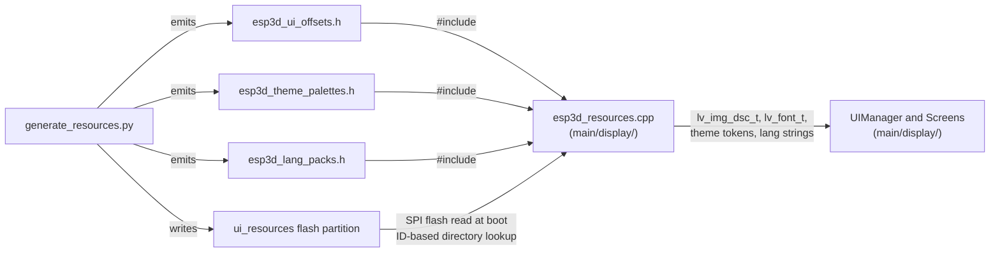

> **Related modules:**
> - [Build Management Scripts](tools_build_scripts_build_management.md) — `build_mgr.py` and `validate_build_scripts.py` that wrap this module.
> - [Tools Resource Generation](tools_resource_generation.md) — font and image converters (`ttf_to_fnt.py`, `font_c_to_fnt.py`, `image_c_to_bin.py`) bundled into the kit.
> - [UI Framework and Screens](UI_Framework_and_Screens.md) — `esp3d_resources.cpp` that reads the partition at runtime.
> - [Board Support Packages](Board_Support_Packages.md) — per-board `build_scripts/common.py` that invokes this module and supplies `--board-resources`.
