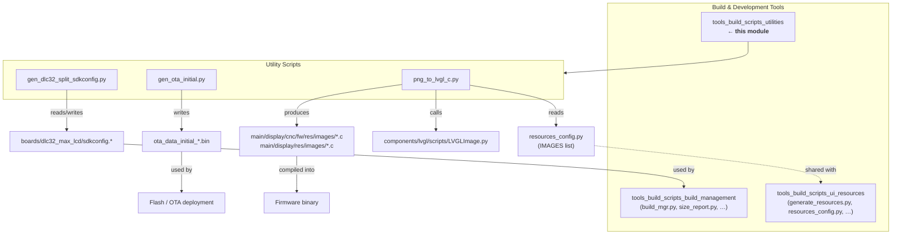
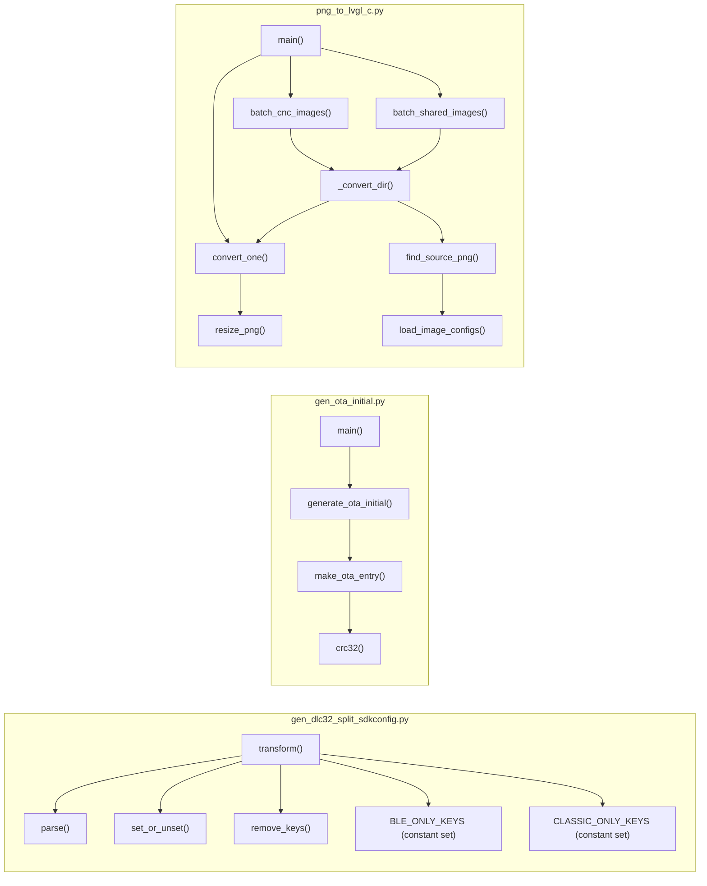
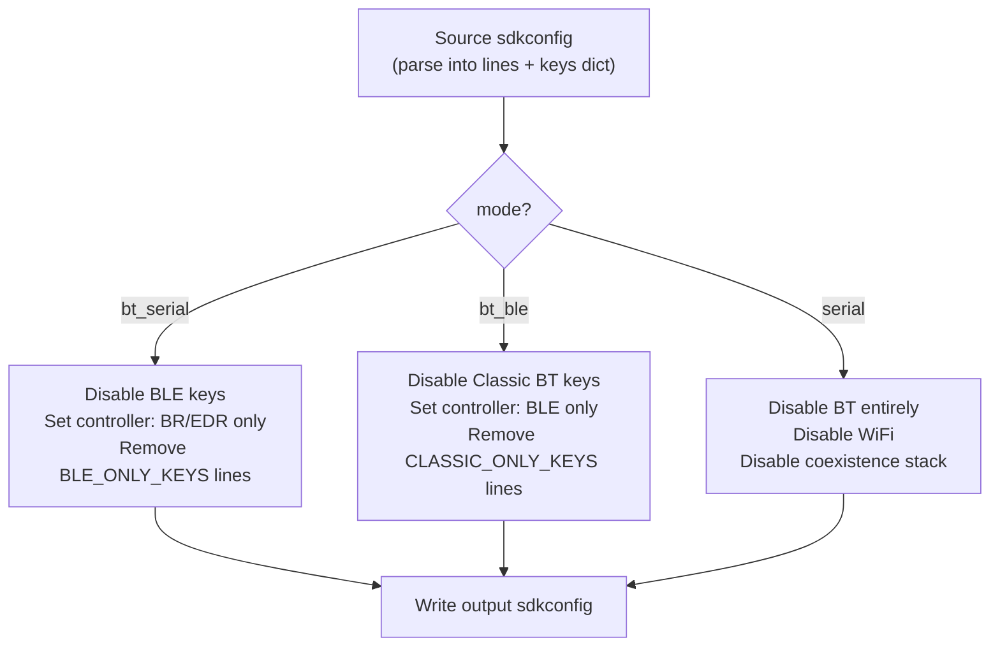
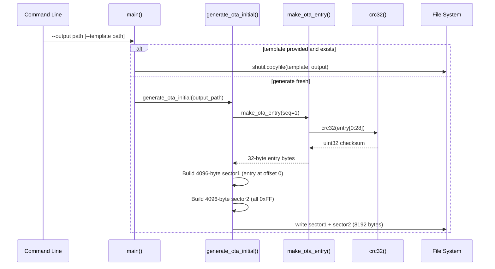
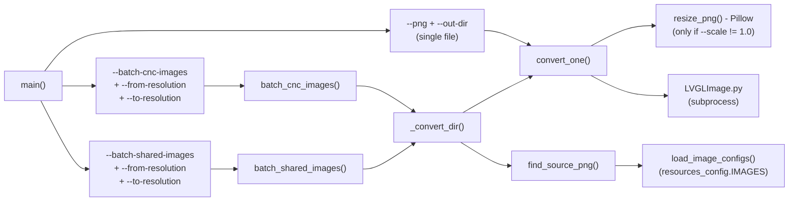
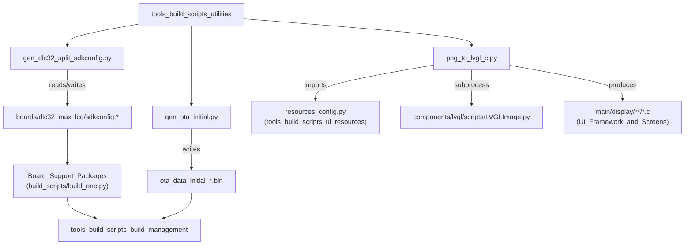
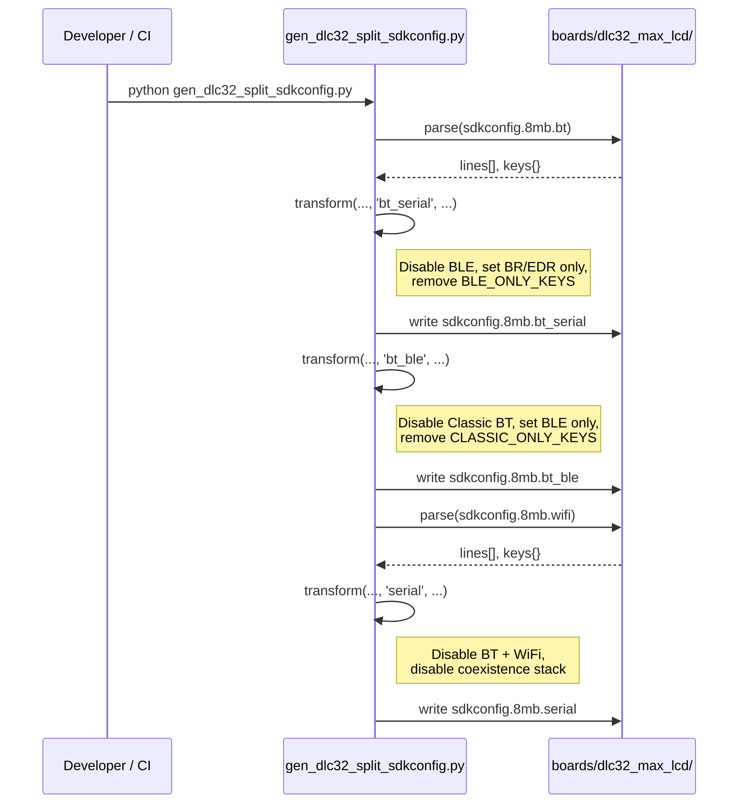
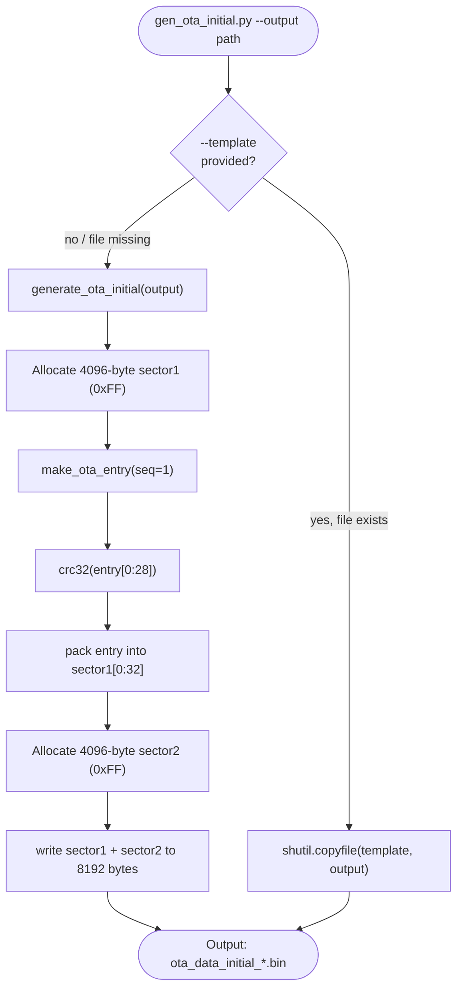
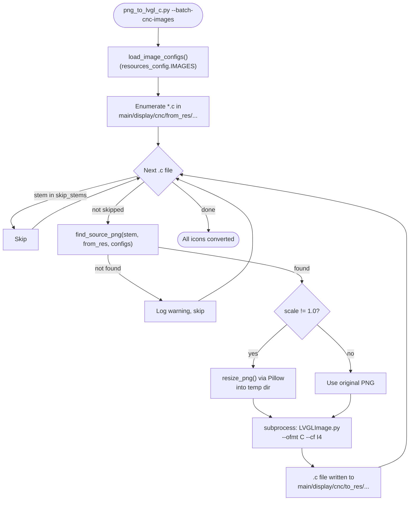
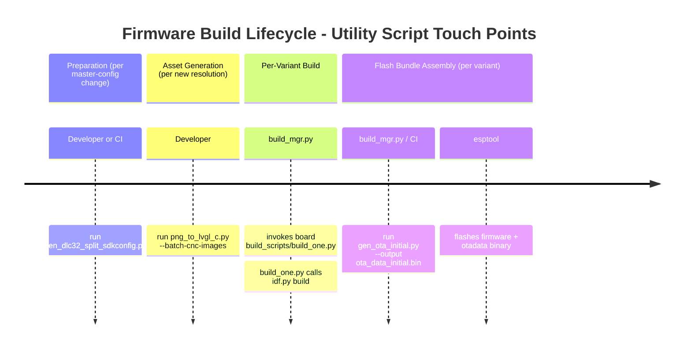

# tools_build_scripts_utilities

## Introduction

The `tools_build_scripts_utilities` module is a focused collection of three standalone build-time helper scripts that address specific, orthogonal concerns in the firmware release pipeline. They sit alongside—but are independent of—the larger build management system (see [tools_build_scripts_build_management.md](tools_build_scripts_build_management.md)) and the UI resource pipeline (see [tools_build_scripts_ui_resources.md](tools_build_scripts_ui_resources.md)).

| Script | Purpose |
|---|---|
| `gen_dlc32_split_sdkconfig.py` | Derives per-transport `sdkconfig` variants for the DLC32 MAX LCD board from a master BT/WiFi config |
| `gen_ota_initial.py` | Generates the 8 KB `otadata` binary that tells the ESP-IDF bootloader to boot `ota_0` on first power-up |
| `png_to_lvgl_c.py` | Converts PNG icon files into LVGL v9 C image sources (`.c`) for the **statically-compiled** icon sets |

All three scripts are pure Python 3, require no firmware build environment, and can be invoked directly from the command line or called from CI pipelines and board-level `build_scripts/` wrappers (see [Board_Support_Packages.md](Board_Support_Packages.md)).

---

## Architecture Overview



---

## Component Relationships



---

## Script Reference

### 1. `gen_dlc32_split_sdkconfig.py`

**Location:** `tools/build_scripts/gen_dlc32_split_sdkconfig.py`

#### Purpose

The DLC32 MAX LCD board supports three distinct radio transport modes — Classic Bluetooth Serial, BT BLE, and plain Serial/WiFi. Each mode requires a different ESP-IDF `sdkconfig` because the Bluetooth controller stack options are mutually exclusive and carry a significant RAM cost. Maintaining three separate hand-edited `sdkconfig` files would cause drift; this script derives the `bt_serial`, `bt_ble`, and `serial` variants programmatically from a single authoritative source file.

#### Inputs and Outputs

| Source file | Mode argument | Output file |
|---|---|---|
| `sdkconfig.8mb.bt` | `bt_serial` | `sdkconfig.8mb.bt_serial` |
| `sdkconfig.8mb.bt` | `bt_ble` | `sdkconfig.8mb.bt_ble` |
| `sdkconfig.8mb.wifi` | `serial` | `sdkconfig.8mb.serial` |

All paths are relative to `boards/dlc32_max_lcd/`.

#### Transform Modes



#### Key Functions

**`parse(path: Path) → (lines, keys)`**
Reads the sdkconfig file into a list of raw lines and a dictionary mapping each `CONFIG_*` key to its `(state, value, line_index)` tuple. Recognises both `KEY=value` and `# CONFIG_KEY is not set` forms.

**`transform(source, mode, out)`**
Top-level entry point. Calls `parse`, applies mode-specific mutations via `set_or_unset` and `remove_keys`, then writes the result to `out`.

**`set_or_unset(lines, keys, key, enable)`**
Patches a single line in-place: sets it to `KEY=y` when `enable=True`, or `# KEY is not set` when `False`. No-ops if the key is absent — safe for config options that may not exist in older IDF versions.

**`remove_keys(lines, keys, key_set)`**
Returns a filtered line list with the lines corresponding to `key_set` members removed. Used to strip keys that are entirely meaningless for the selected controller mode (e.g. `CONFIG_BT_GATTS_ENABLE` when Classic BT is off).

#### Constant Key Sets

| Constant | Content |
|---|---|
| `BLE_ONLY_KEYS` | ~50 `CONFIG_BT_*` / `CONFIG_BTDM_BLE_*` / `CONFIG_GATTS_*` keys that only apply when BLE is active |
| `CLASSIC_ONLY_KEYS` | ~40 `CONFIG_BT_SPP_*` / `CONFIG_BT_A2DP_*` / `CONFIG_BTDM_CTRL_BR_EDR_*` keys that only apply when Classic BT is active |

#### Direct Invocation

```bash
# Regenerate all three dlc32_max_lcd variants from their sources
python tools/build_scripts/gen_dlc32_split_sdkconfig.py
```

Running the script directly executes the three canonical transforms shown in the table above (the `if __name__ == "__main__"` block at the bottom of the file).

---

### 2. `gen_ota_initial.py`

**Location:** `tools/build_scripts/gen_ota_initial.py`

#### Purpose

When a board has no factory partition (the common case in this project's partition tables), the ESP-IDF bootloader must find a valid `otadata` sector to know which application slot to boot. This script synthesises a minimal, correct 8 KB `otadata` binary that points to `ota_0` (`app0`). Without this file the bootloader falls back to an undefined state.

#### OTA Data Binary Format

The ESP-IDF `otadata` region is two 4 KB sectors, each holding one `esp_ota_select_entry_t` (32 bytes, little-endian):

```
Offset  Size  Field          Notes
------  ----  -----------    -----------------------------------------------
 0       4    ota_seq        Sequence number. 1 → ota_0 (odd = slot 0)
 4      20    seq_label      Unused, filled 0xFF
24       4    ota_state      OTA_IMG_VALID = 0xFFFFFFFF
28       4    crc            CRC32 of bytes [0:28], Ethernet polynomial
```

Only sector 1 (offset 0) receives a valid entry (`seq=1`); sector 2 is left as `0xFF`.

#### Data Flow



#### Key Functions

**`crc32(data: bytes) → int`**
Implements the standard Ethernet CRC32 (polynomial `0xEDB88320`) used by ESP-IDF's OTA integrity check. Pure Python; no external dependencies.

**`make_ota_entry(seq: int) → bytes`**
Builds the 32-byte `esp_ota_select_entry_t` struct. Sets `ota_state` to `0xFFFFFFFF` (`OTA_IMG_VALID`) and appends the CRC of the first 28 bytes.

**`generate_ota_initial(output_path: str)`**
Assembles the two 4 KB sectors and writes the resulting 8192-byte binary. Creates missing parent directories automatically.

**`main()`**
CLI entry point. Accepts `--output`/`-o` (required) and an optional `--template`/`-t` path. The template path is useful when a board vendor supplies a pre-validated `otadata` image that should be used verbatim instead of a generated one.

#### Usage

```bash
# Generate a fresh otadata binary
python tools/build_scripts/gen_ota_initial.py \
    --output build/ota_data_initial_8MB.bin

# Use a board-specific template if present, fall back to generation otherwise
python tools/build_scripts/gen_ota_initial.py \
    --output build/ota_data_initial_8MB.bin \
    --template boards/esp32_3248s035r/ota_data_template.bin
```

#### Slot Selection Logic

| `seq` value | Boot slot |
|---|---|
| Odd (1, 3, …) | `ota_0` / `app0` |
| Even (2, 4, …) | `ota_1` / `app1` |

Setting `seq=1` always boots `ota_0`, which is the expected default after a factory flash.

---

### 3. `png_to_lvgl_c.py`

**Location:** `tools/build_scripts/png_to_lvgl_c.py`

#### Purpose

The firmware embeds two distinct sets of icon images:

- **Static (compiled-in) icons** — small icon sets baked directly into the firmware image, stored under `main/display/cnc/<fw>/<resolution>/images/` and `main/display/<resolution>/images/`. These are referenced from C++ source files as `extern const lv_image_dsc_t icon_name;`.
- **Dynamic (partition) resources** — large sets managed by the `ui_resources` partition pipeline (`generate_resources.py` / `resources_config.py`).

This script handles **only** the static icon sets. It is a thin wrapper around the official LVGL tool `components/lvgl/scripts/LVGLImage.py`, adding resolution-aware batch conversion and optional PIL-based resizing.

> ⚠️ Do **not** use this script to add icons to the `ui_resources` partition. Use `generate_resources.py` / `resources_config.py` for that (see [tools_build_scripts_ui_resources.md](tools_build_scripts_ui_resources.md)).

#### Supported Modes



#### Directory Layout Produced

```
main/display/
├── <to_resolution>/images/           ← --batch-shared-images target
│   ├── icon_a.c
│   ├── icon_b.c
│   └── conditionals/<group>/
│       └── icon_c.c
└── cnc/
    ├── <to_resolution>/images/       ← shared CNC icons
    │   └── alarm_off_b.c
    ├── fluidnc/<to_resolution>/images/
    ├── grbl/<to_resolution>/images/
    └── grblhal/<to_resolution>/images/
```

#### Key Functions

**`convert_one(png_path, out_dir, cf, scale) → Path`**
Core conversion step. Optionally resizes the PNG in a temporary directory (via `resize_png`), then calls `LVGLImage.py` in a subprocess with `--ofmt C --cf <cf>`. Returns the path of the produced `.c` file. Exits with an error if the LVGL script is not found or the conversion fails.

**`resize_png(src, dst, scale)`**
Opens the source PNG as RGBA, scales it by `scale` using `Image.LANCZOS`, and writes the result to `dst`. Requires `Pillow`.

**`load_image_configs() → list[ImageConfig]`**
Imports `resources_config.IMAGES` from the sibling `resources_config.py`. Returns the image configuration list shared with the `ui_resources` pipeline. Used solely for PNG source path resolution — it does not write to the partition.

**`find_source_png(stem, from_resolution, image_configs) → Path | None`**
Maps a `.c` file's stem (e.g. `alarm_off_b`) to its original PNG under `resources/<from_resolution>/` by matching against the `output_name` or `source_file` stem in `image_configs`. Case-insensitive. Returns `None` (with a warning) if no match is found.

**`batch_cnc_images(from_resolution, to_resolution, scale)`**
Iterates over all `*.c` files under the CNC image directories for the source resolution, resolves their PNG sources, and regenerates them for the target resolution. The `logo` stem is skipped (it is a fixed-size splash image handled separately).

**`batch_shared_images(from_resolution, to_resolution, scale)`**
Same as `batch_cnc_images` but operates on the root-level `main/display/<resolution>/images/` tree, including `conditionals/<group>/` subfolders (recursive scan).

**`_convert_dir(src_dir, dst_dir, from_resolution, image_configs, scale, skip_stems, recursive)`**
Internal helper. Enumerates `.c` files in `src_dir` (recursively if `recursive=True`), resolves the PNG source for each, and calls `convert_one`. Preserves sub-folder structure relative to `src_dir`.

#### CLI Reference

```bash
# Single file, no resize
python tools/build_scripts/png_to_lvgl_c.py \
    --png resources/res_320_240/Ok_b/ok_b.png \
    --out-dir /tmp/out

# Single file, scale 2x before conversion
python tools/build_scripts/png_to_lvgl_c.py \
    --png resources/res_320_240/Ok_b/ok_b.png \
    --out-dir /tmp/out \
    --scale 2

# Batch: regenerate CNC static icons for a new resolution
python tools/build_scripts/png_to_lvgl_c.py \
    --batch-cnc-images \
    --from-resolution res_320_240 \
    --to-resolution res_800_480 \
    --scale 2

# Batch: regenerate shared (non-CNC) static icons
python tools/build_scripts/png_to_lvgl_c.py \
    --batch-shared-images \
    --from-resolution res_320_240 \
    --to-resolution res_800_480 \
    --scale 2
```

#### Dependencies

| Dependency | Required for | Notes |
|---|---|---|
| `Pillow` (PIL) | `--scale != 1.0` | Not needed for plain conversion at native size |
| `components/lvgl/scripts/LVGLImage.py` | All conversions | Must be present in the cloned repo |
| `resources_config.py` | Batch modes | Read-only; shares `IMAGES` list with the UI resource pipeline |

---

## Module Dependency Map



---

## Process Flows

### DLC32 Config Split Flow



### OTA Binary Generation Flow



### PNG-to-LVGL Batch Conversion Flow



---

## Integration with the Build Pipeline

These utilities are invoked at specific, infrequent points in the overall build lifecycle:



`gen_dlc32_split_sdkconfig.py` and `png_to_lvgl_c.py` are **infrequently run** (only when their authoritative sources change). `gen_ota_initial.py` is run **per build variant** as part of assembling the flash bundle, driven by `build_mgr.py` (see [tools_build_scripts_build_management.md](tools_build_scripts_build_management.md)).

---

## Related Documentation

| Document | Relationship |
|---|---|
| [tools_build_scripts_build_management.md](tools_build_scripts_build_management.md) | Orchestrates multi-variant builds; consumes the OTA binary from `gen_ota_initial.py` and the sdkconfigs from `gen_dlc32_split_sdkconfig.py` |
| [tools_build_scripts_ui_resources.md](tools_build_scripts_ui_resources.md) | Manages the `ui_resources` partition pipeline; shares `resources_config.IMAGES` read by `png_to_lvgl_c.py` |
| [Board_Support_Packages.md](Board_Support_Packages.md) | Each board's `build_scripts/` wrappers trigger the build chain that depends on these utility outputs |
| [dlc32_max_lcd.md](dlc32_max_lcd.md) | DLC32 MAX LCD board — the only board that uses `gen_dlc32_split_sdkconfig.py` |
| [UI_Framework_&_Screens.md](UI_Framework_and_Screens.md) | Consumes the static `.c` icon files produced by `png_to_lvgl_c.py` |
