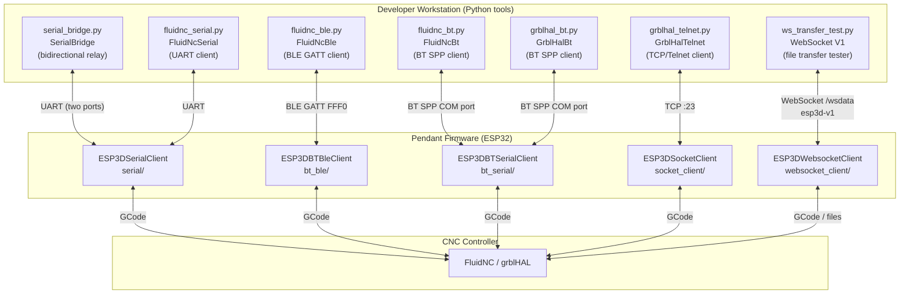
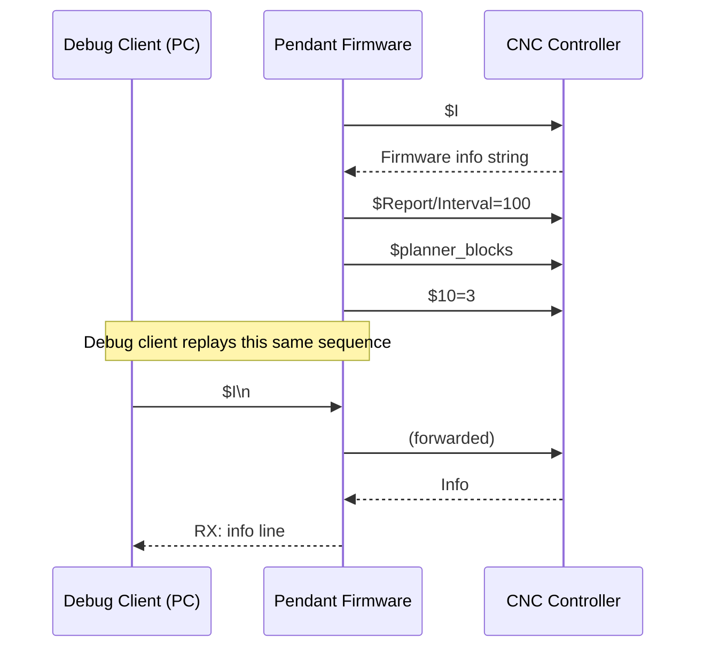
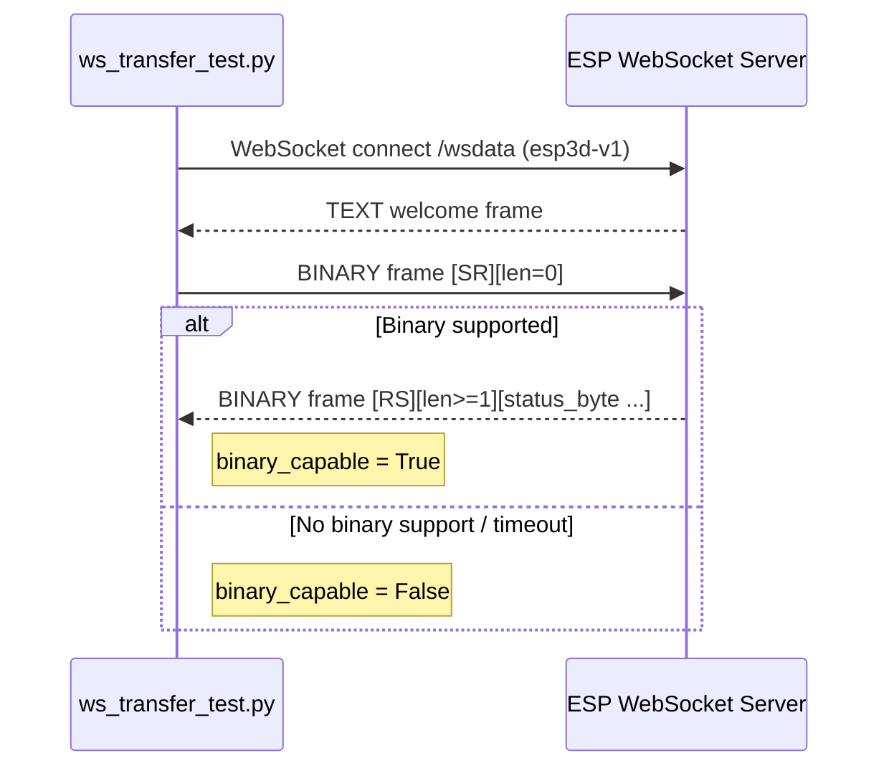

# tools_communication_clients

## Introduction

The `tools_communication_clients` module provides **PC-side developer tools** for testing, debugging, and validating the communication transports of the Pibot CNC Pendant firmware. Each tool mirrors one of the firmware's transport channels, letting a developer reproduce the exact protocol sequences the pendant uses — without needing a second physical pendant or CNC machine.

The tools live in the `tools/` directory tree and are **standalone Python scripts** that run on any desktop/laptop. They are not compiled into the firmware; they interact with the pendant or with a CNC controller over USB, Bluetooth, Telnet (TCP), or WebSocket depending on the tool.

> **Related firmware module:** [Communication_Transports](Communication_Transports.md) — the embedded implementations these tools exercise.

---

## Architecture Overview



Each tool connects to **one transport** and uses the same protocol framing the firmware uses, making them suitable for:

- Validating a transport after a code change
- Replaying the pendant's startup/init sequence manually
- Capturing raw traffic for debugging
- Testing binary file transfer (WebSocket V1 protocol)

---

## Sub-modules

> **Generated sub-module documentation files:**
> - [tools_communication_clients_serial_bridge.md](tools_communication_clients_serial_bridge.md) — Serial Bridge
> - [tools_communication_clients_bt_clients.md](tools_communication_clients_bt_clients.md) — Bluetooth Clients (BLE + BT SPP)
> - [tools_communication_clients_websocket.md](tools_communication_clients_websocket.md) — WebSocket V1 Transfer Test

### 1. Serial Bridge — `tools/bridge/serial_bridge.py`

> **Detailed reference:** [tools_communication_clients_serial_bridge.md](tools_communication_clients_serial_bridge.md)

A bidirectional serial relay that simultaneously connects **two** serial (USB/UART) ports and relays data between them in both directions. Primary use-case: inserting a PC between the pendant and the CNC controller to observe or inject traffic without modifying firmware.

| Class | Responsibility |
|---|---|
| `SerialBridge` | Opens two `pyserial` ports, spawns three threads (Port1→Port2, Port2→Port1, keyboard), processes G-code commands line-by-line |

Key capabilities:
- Color-coded console output (green = Port1→Port2, blue = Port2→Port1, yellow = keyboard injection)
- Interactive keyboard input with port-switching shortcuts (`Ctrl+A`/`B`/`S`, or type `1`/`2`)
- Built-in G-code shortcut commands (`status`, `home`, `unlock`, `reset`)
- Cross-platform (Windows `msvcrt`, Unix `select`)

**Quick start:**
```bash
pip install pyserial
python tools/bridge/serial_bridge.py /dev/ttyUSB0 /dev/ttyUSB1
python tools/bridge/serial_bridge.py --list          # enumerate available ports
```

---

### 2. Bluetooth Clients — `tools/bt_client/`

> **Detailed reference:** [tools_communication_clients_bt_clients.md](tools_communication_clients_bt_clients.md)

Three Tkinter GUI terminals covering every Bluetooth transport the firmware supports:

| Script | Class | Protocol | Target firmware |
|---|---|---|---|
| `fluidnc_ble.py` | `FluidNcBle` | BLE GATT (service `0xFFF0`) | `ESP3DBTBleClient` — FluidNC |
| `fluidnc_bt.py` | `FluidNcBt` | BT Classic SPP (COM port) | `ESP3DBTSerialClient` — FluidNC |
| `grblhal_bt.py` | `GrblHalBt` | BT Classic SPP (COM port) | `ESP3DBTSerialClient` — grblHAL |

All three share the same UI pattern: connection bar, scrolled log (color-coded RX/TX/INFO/ERR), real-time single-byte command buttons, a manual command entry, and a raw hex sender.

The BLE client (`FluidNcBle`) additionally provides:
- Async BLE scanning via `bleak` with RSSI sorting and service-UUID filtering
- GATT Device Name query for unnamed devices
- MTU-aware chunked writes (20-byte BLE default)
- Sequenced init flow replay matching the pendant's startup behavior

**Quick start:**
```bash
pip install pyserial bleak
python tools/bt_client/fluidnc_ble.py        # BLE
python tools/bt_client/fluidnc_bt.py COM5    # BT SPP — FluidNC
python tools/bt_client/grblhal_bt.py COM5    # BT SPP — grblHAL
```

---

### 3. Serial Client — `tools/serial_client/fluidnc_serial.py`

A Tkinter GUI terminal for observing and replaying the pendant's FluidNC serial connection over a USB/UART port. The pendant's UART0 (`GPIO1/GPIO3`) is the same port used for flashing and appears as a standard COM device on the host PC.

| Class | Key methods |
|---|---|
| `FluidNcSerial` | `_connect()`, `_recv_loop()`, `_send_raw()`, `_send_text_direct()`, `_send_full_sequence()` |

The UI is identical in structure to the BT Serial clients. It targets `ESP3DSerialClient` in the firmware.

**Init sequence replayed** (matching pendant startup):

| Button | Command sent |
|---|---|
| `$I (identify)` | `$I\n` |
| `$Report/Interval=100` | `$Report/Interval=100\n` |
| `$planner_blocks` | `$planner_blocks\n` |
| `$10=3 (full reports)` | `$10=3\n` |

**Real-time single-byte commands:** `?`, `!`, `~`, `0x18` (reset), `0x85` (jog cancel)

**Quick start:**
```bash
pip install pyserial
python tools/serial_client/fluidnc_serial.py /dev/ttyUSB0 115200
```

---

### 4. Telnet Client — `tools/telnet_client/grblhal_telnet.py`

A Tkinter GUI terminal that connects to a grblHAL controller over a raw TCP socket (default port 23 — telnet). This exercises the same TCP path the firmware uses when `SOCKET_CLIENT_SERVICE` is enabled (`ESP3DSocketClient`).

| Class | Key methods |
|---|---|
| `GrblHalTelnet` | `_connect()`, `_recv_loop()`, `_send_raw()`, `_send_text()`, `_send_hex()` |

**grblHAL-specific real-time bytes exposed:**

| Button | Byte |
|---|---|
| Status report all | `0x87` |
| MPG toggle | `0x8B` |
| AR toggle | `0x8C` |
| Soft reset | `0x18` |
| Feed hold / cycle start / jog cancel | `!` / `~` / `0x85` |

**Quick start:**
```bash
python tools/telnet_client/grblhal_telnet.py 192.168.1.100 23
```

---

### 5. WebSocket Transfer Test — `tools/websocket/ws_transfer_test.py`

> **Detailed reference:** [tools_communication_clients_websocket.md](tools_communication_clients_websocket.md)

A command-line tool implementing the full **ESP3D WebSocket Protocol V1** binary file-transfer layer on the `/wsdata` endpoint (subprotocol `esp3d-v1`). It exercises `ESP3DWebsocketClient` and `ESP3DWsDataService`.

| Operation | CLI sub-command | Description |
|---|---|---|
| Probe binary support | `status` | Send `SR`, await `RS` — confirms V1 capability |
| List files | `list <path>` | Send `[ESP720]`/`[ESP740]` command, receive JSON or text |
| Upload | `upload <local> <remote_dir>` | `SU → US → UP/PU × N → EU → UE` |
| Download | `download <remote_dir> <name>` | `SD → DS → DP/PD × N → ED → DE` |
| Round-trip | `roundtrip <local> <remote_dir>` | Upload + download + MD5 comparison |

**Quick start:**
```bash
pip install websockets
python tools/websocket/ws_transfer_test.py --host 192.168.1.100 --port 8282 status
python tools/websocket/ws_transfer_test.py --host 192.168.1.100 --port 8282 list /
python tools/websocket/ws_transfer_test.py --host 192.168.1.100 --port 8282 upload myfile.nc /fs
```

---

## Tool Comparison Matrix

| Tool | Transport | GUI | Target firmware | Firmware config flag |
|---|---|---|---|---|
| `serial_bridge.py` | UART (two ports) | CLI | `ESP3DSerialClient` | Always available |
| `fluidnc_serial.py` | UART (single port) | Tkinter | `ESP3DSerialClient` | Always available |
| `fluidnc_ble.py` | BLE GATT `0xFFF0` | Tkinter | `ESP3DBTBleClient` | `BT_BLE_SERVICE` |
| `fluidnc_bt.py` | BT Classic SPP | Tkinter | `ESP3DBTSerialClient` | `BT_SERIAL_SERVICE` |
| `grblhal_bt.py` | BT Classic SPP | Tkinter | `ESP3DBTSerialClient` | `BT_SERIAL_SERVICE` |
| `grblhal_telnet.py` | TCP (Telnet) | Tkinter | `ESP3DSocketClient` | `SOCKET_CLIENT_SERVICE` |
| `ws_transfer_test.py` | WebSocket `/wsdata` | CLI | `ESP3DWebsocketClient` + `ESP3DWsDataService` | `WS_CLIENT_SERVICE` |

> ⚠️ **Mutual exclusion:** The firmware's `cmake/sanity_check.cmake` forbids enabling both `SOCKET_CLIENT_SERVICE` and WebUI/SSDP services simultaneously. Bluetooth (BLE/SPP) and WiFi are also mutually exclusive on boards without PSRAM. See [feature_resource_matrix.md](https://github.com/luc-github/Pibot-cnc-pendant-firmware/blob/main/docs/features/feature_resource_matrix.md) before selecting a transport.

---

## Protocol Sequences

### Firmware Startup Init (Serial / BT clients)

All serial and BT clients provide a "Full sequence" button that replays the pendant's startup G-code handshake:



### WebSocket V1 Binary Probe (SR/RS)



---

## Dependencies

| Tool | Python packages |
|---|---|
| `serial_bridge.py` | `pyserial` |
| `fluidnc_serial.py` | `pyserial` |
| `fluidnc_bt.py` | `pyserial` |
| `grblhal_bt.py` | `pyserial` |
| `fluidnc_ble.py` | `bleak` |
| `grblhal_telnet.py` | stdlib only (`socket`, `threading`, `tkinter`) |
| `ws_transfer_test.py` | `websockets` |

All tools require **Python 3.9+** and are cross-platform (Windows / Linux / macOS).

---

## Directory Layout

```
tools/
├── bridge/
│   └── serial_bridge.py          # Bidirectional serial relay
├── bt_client/
│   ├── fluidnc_ble.py            # BLE GATT debug terminal
│   ├── fluidnc_bt.py             # BT Serial debug terminal (FluidNC)
│   └── grblhal_bt.py             # BT Serial debug terminal (grblHAL)
├── serial_client/
│   └── fluidnc_serial.py         # UART debug terminal (FluidNC)
├── telnet_client/
│   └── grblhal_telnet.py         # TCP/Telnet debug terminal (grblHAL)
└── websocket/
    └── ws_transfer_test.py       # WebSocket V1 file transfer tester
```

---

## See Also

- [Communication_Transports](Communication_Transports.md) — firmware implementations exercised by these tools
- [Network_&_Web_Services](Network_and_Web_Services.md) — WebSocket server, HTTP, and mDNS services
- [tools.md](https://github.com/luc-github/Pibot-cnc-pendant-firmware/blob/main/docs/guides/tools.md) — general `tools/` directory guide (from `docs/guides/tools.md`)
- [websockets_protocol.md](https://github.com/luc-github/Pibot-cnc-pendant-firmware/blob/main/docs/architecture/websockets_protocol.md) — WebSocket V1 binary protocol reference
- [tools_build_scripts](tools_build_scripts.md) — build automation scripts (sibling module)
