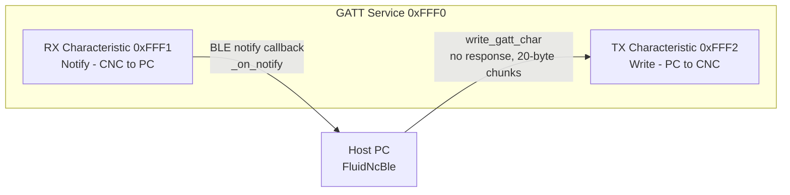
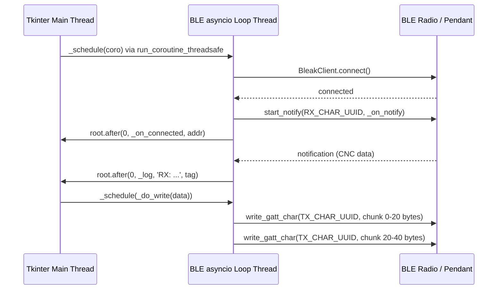
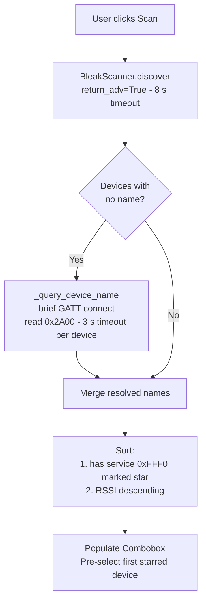
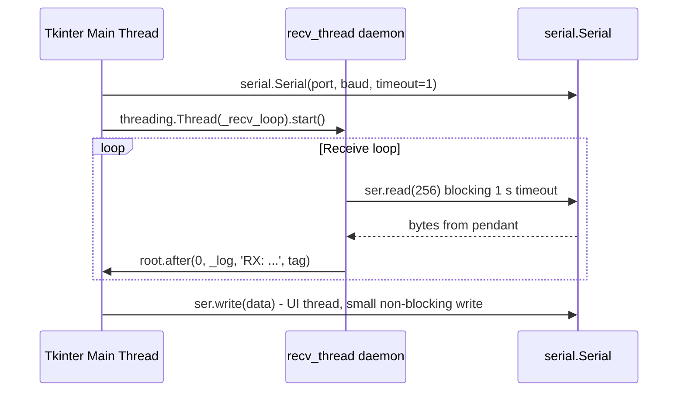
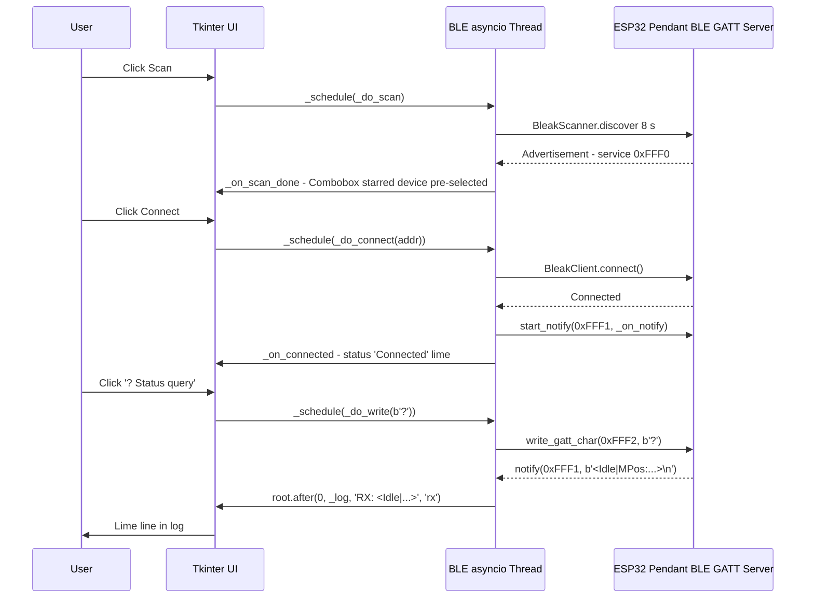
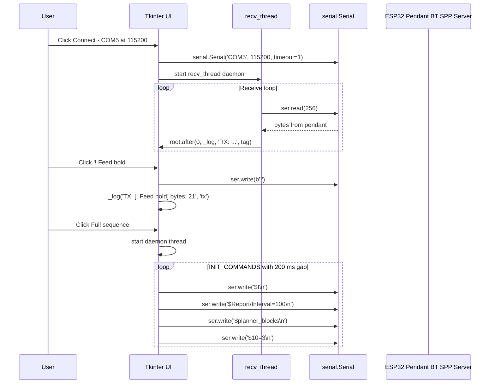
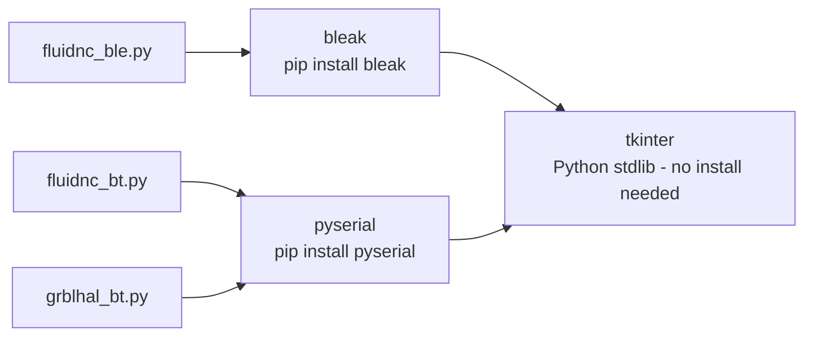

# Bluetooth Debug Client Tools (`tools/bt_client/`)

## Introduction

The `tools_communication_clients_bt_clients` module provides three lightweight, **developer-side desktop GUI tools** for testing and debugging the pendant's Bluetooth communication transports directly from a host PC. Each tool mirrors a specific CNC firmware × transport technology combination, allowing developers to simulate the pendant connection, inspect raw traffic, and replay firmware-specific initialisation sequences — without flashing or rebuilding the pendant firmware.

| Tool file | Transport | Firmware target | Dependency |
|---|---|---|---|
| `fluidnc_ble.py` | BLE (GATT) | FluidNC | `bleak` |
| `fluidnc_bt.py` | BT Classic SPP | FluidNC | `pyserial` |
| `grblhal_bt.py` | BT Classic SPP | grblHAL | `pyserial` |

All three tools share a common design pattern: a **Tkinter GUI** on the main thread, a **background receive thread** (or dedicated asyncio loop thread for BLE), and colour-coded terminal logging.

> **Scope** — these are host-side development utilities only. They do not run on the ESP32. For the on-device transport implementations see [`tools_communication_clients.md`](tools_communication_clients.md) and the firmware modules documented in [`Communication_Transports.md`](Communication_Transports.md).

---

## Architecture Overview

```mermaid
graph TD
    subgraph "Host PC - tools/bt_client/"
        BLE["fluidnc_ble.py\nFluidNcBle"]
        BTF["fluidnc_bt.py\nFluidNcBt"]
        BTG["grblhal_bt.py\nGrblHalBt"]
    end

    subgraph "Transport Library"
        BLEAK["bleak\nBLE GATT client"]
        PYSERIAL_F["pyserial\nSerial port"]
        PYSERIAL_G["pyserial\nSerial port"]
    end

    subgraph "Radio / OS"
        BT_RADIO["Bluetooth Radio\n(BLE advertisement + GATT)"]
        COM_PORT["OS COM Port\n(BT Classic SPP pairing)"]
    end

    subgraph "Pendant Firmware - ESP32"
        BLE_FW["esp3d_bt_ble_client\nBLE GATT server\nservice 0xFFF0"]
        SPP_FW["esp3d_bt_serial_client\nSPP server"]
    end

    BLE   --> BLEAK      --> BT_RADIO --> BLE_FW
    BTF   --> PYSERIAL_F --> COM_PORT  --> SPP_FW
    BTG   --> PYSERIAL_G --> COM_PORT  --> SPP_FW
```



### Design Principles Shared by All Three Tools

- **Single-window Tkinter GUI** — no external UI framework required; runs anywhere Python 3 is installed.
- **Non-blocking I/O** — receive work runs in a daemon thread (SPP tools) or in a dedicated asyncio event loop thread (BLE tool); the Tkinter main thread is never blocked.
- **Colour-coded log** — cyan TX, green RX, dim grey for pendant internal log lines starting with `[`, yellow info, red errors.
- **Timestamped entries** — every log line is prefixed with `HH:MM:SS`.
- **CLI pre-seeding** — all tools accept optional positional arguments to pre-fill connection fields so they can be launched straight into a known configuration.
- **Graceful dependency check** — missing Python packages are caught at import time and displayed as a native dialog before exit; no cryptic tracebacks for the user.

---

## Module Components

### 1. `FluidNcBle` — BLE GATT Client for FluidNC (`fluidnc_ble.py`)

#### Purpose
Connects to the pendant's BLE transport (`ESP3DBTBleClient`) and exercises the full FluidNC startup flow over BLE. Useful for verifying GATT notification delivery, write-without-response chunking, and service discovery from a PC.

#### BLE Service & Characteristic Map



| UUID | Direction | GATT property | Description |
|---|---|---|---|
| `0000fff0-0000-1000-8000-00805f9b34fb` | — | Primary Service | FluidNC BLE service |
| `0000fff1-0000-1000-8000-00805f9b34fb` | CNC → PC | Notify | RX — pendant sends CNC responses |
| `0000fff2-0000-1000-8000-00805f9b34fb` | PC → CNC | Write (no-resp) | TX — host sends G-code / commands |
| `00002a00-0000-1000-8000-00805f9b34fb` | scan only | Read | Generic Access / Device Name (name resolution during scan) |

#### Threading Model



- The BLE asyncio loop runs permanently in a daemon thread (`_ble_thread`), started once at construction.
- All BLE coroutines are submitted from the UI thread via `_schedule()` → `asyncio.run_coroutine_threadsafe`.
- All UI updates from the BLE thread use `root.after(0, …)` to marshal back to the Tkinter thread safely.

#### MTU-Aware Write Chunking
BLE write-without-response is bounded by the negotiated ATT MTU. `FluidNcBle` uses a conservative **20-byte default** (the minimum guaranteed payload by the BLE spec) and splits every write:

```python
mtu = 20  # safe BLE default
for i in range(0, len(data), mtu):
    chunk = data[i: i + mtu]
    await self._client.write_gatt_char(TX_CHAR_UUID, chunk, response=False)
```

#### BLE Scan Flow



#### Key Methods

| Method | Description |
|---|---|
| `_start_scan` / `_do_scan` | Passive+active BLE scan, name resolution, service filtering |
| `_query_device_name` | Briefly connects and reads GATT Device Name (0x2A00) for unnamed devices |
| `_toggle_connect` / `_do_connect` | Connect with `disconnected_callback`; starts notify on RX char |
| `_do_disconnect` | Graceful disconnect; clears `_client` reference |
| `_on_notify` | BLE notification handler; accumulates bytes in `_rx_buf`, flushes on `\n` |
| `_do_write` | Async write with 20-byte MTU chunking |
| `_send_raw` | Sends pre-built `bytes` (used for real-time single-byte commands) |
| `_send_text_direct` | Sends a named UTF-8 text command appended with `\n` |
| `_send_text` | Reads the command entry field and sends as text + `\n` |
| `_send_full_sequence` | Replays `INIT_COMMANDS` in a daemon thread with 300 ms gaps |
| `_send_hex` | Parses space-separated hex tokens and calls `_send_raw` |

---

### 2. `FluidNcBt` — BT Classic SPP Client for FluidNC (`fluidnc_bt.py`)

#### Purpose
Connects to the pendant's BT Serial transport (`ESP3DBTSerialClient`) via the OS COM port created when a Classic Bluetooth SPP device is paired. Reproduces the pendant startup sequence to validate the full FluidNC handshake over SPP.

#### Threading Model



- `_recv_loop` runs in a daemon thread; reads up to 256 bytes at a time, line-buffers on `\n`, dispatches to the UI via `root.after`.
- All writes are synchronous on the UI thread. Serial writes are small (single command lines) and do not block the UI perceptibly.

#### FluidNC Init Sequence
The tool replicates the exact command sequence sent by the pendant on startup:

| Order | Command | Purpose |
|---|---|---|
| 1 | `$I` | Identify firmware build info |
| 2 | `$Report/Interval=100` | Set auto-report interval to 100 ms |
| 3 | `$planner_blocks` | Query planner buffer size |
| 4 | `$10=3` | Enable full status reports |

The **▶ Full sequence** button runs these with 200 ms inter-command gaps in a daemon thread to avoid blocking the UI.

#### Key Methods

| Method | Description |
|---|---|
| `_refresh_ports` | Enumerates available serial ports via `serial.tools.list_ports` |
| `_connect` | Opens `serial.Serial`, starts `_recv_loop` thread |
| `_disconnect` | Stops receive loop, closes port, resets UI state |
| `_recv_loop` | Daemon thread: reads, line-buffers, dispatches to UI |
| `_send_raw` | Writes raw bytes (used for real-time single-byte commands) |
| `_send_text_direct` | Writes a named UTF-8 text command + `\n` |
| `_send_text` | Reads the command entry field, sends as text + `\n` |
| `_send_hex` | Parses space-separated hex tokens, calls `_send_raw` |
| `_send_full_sequence` | Replays `INIT_COMMANDS` in a daemon thread with 200 ms gaps |

---

### 3. `GrblHalBt` — BT Classic SPP Client for grblHAL (`grblhal_bt.py`)

#### Purpose
Connects to the pendant's BT Serial transport when the pendant targets **grblHAL** firmware. grblHAL uses additional single-byte real-time commands beyond the standard grbl set — notably MPG and Auto-Report mode toggles. This tool exposes those grblHAL-specific commands directly via dedicated buttons.

#### grblHAL Real-time Command Set

| Button label | Byte value | grblHAL meaning |
|---|---|---|
| `0x87 — Status report all` | `\x87` | Extended status report (all fields) |
| `0x8B — MPG toggle` | `\x8B` | Toggle MPG (Manual Pulse Generator) mode |
| `0x8C — AR toggle` | `\x8C` | Toggle Auto-Report mode |
| `0x18 — Soft reset` | `\x18` | Soft reset (same as standard grbl) |
| `! — Feed hold` | `!` | Feed hold |
| `~ — Cycle start` | `~` | Cycle start / resume |
| `0x85 — Jog cancel` | `\x85` | Cancel jog |
| `? — Status query` | `?` | Inline status query |

> **Note:** `0x8B` (MPG toggle) is particularly important for pendant workflows. grblHAL requires the MPG token to be claimed before accepting jog commands from an external pendant. This button lets developers confirm the token handshake without a physical pendant present.

#### Threading Model
Identical to `FluidNcBt`: a daemon receive thread reads from the serial port and dispatches lines to the UI thread via `root.after`. All writes are synchronous on the UI thread.

#### Key Methods

| Method | Description |
|---|---|
| `_refresh_ports` | Enumerates COM ports via `serial.tools.list_ports` |
| `_connect` / `_disconnect` | Open/close `serial.Serial`, manage receive thread |
| `_recv_loop` | Daemon thread: reads, line-buffers, dispatches (all RX displayed as lime — no dim-log distinction) |
| `_send_raw` | Writes raw bytes with hex-formatted log line |
| `_send_text` | Reads entry field, sends as UTF-8 text + `\n` |
| `_send_hex` | Parses space-separated hex tokens, calls `_send_raw` |

---

## Cross-Tool Feature Comparison

| Feature | `fluidnc_ble.py` | `fluidnc_bt.py` | `grblhal_bt.py` |
|---|:---:|:---:|:---:|
| Tkinter GUI | ✓ | ✓ | ✓ |
| Colour-coded timestamped log | ✓ | ✓ | ✓ |
| Manual text command entry | ✓ | ✓ | ✓ |
| Hex byte sender | ✓ | ✓ | ✓ |
| Single-byte real-time commands | ✓ | ✓ | ✓ |
| Clear log button | ✓ | ✓ | ✓ |
| CLI argument pre-seeding | ✓ | ✓ | ✓ |
| Missing-dependency dialog | ✓ | ✓ | ✓ |
| BLE device scanner (RSSI + service filter) | ✓ | — | — |
| GATT device name resolution (0x2A00) | ✓ | — | — |
| asyncio event loop thread | ✓ | — | — |
| MTU-aware 20-byte write chunking | ✓ | — | — |
| Notify subscription on RX characteristic | ✓ | — | — |
| COM port enumeration | — | ✓ | ✓ |
| Baud rate selector (9600–921600) | — | ✓ | ✓ |
| FluidNC init sequence replay | ✓ | ✓ | — |
| Dim log style for pendant `[…]` lines | ✓ | ✓ | — |
| grblHAL MPG / AR toggle buttons | — | — | ✓ |

---

## Data Flow Diagrams

### BLE Client (`fluidnc_ble.py`)



### SPP Clients (`fluidnc_bt.py` / `grblhal_bt.py`)



---

## Firmware Transport Counterparts

These desktop tools exercise the corresponding on-device firmware modules:

| Desktop tool | Firmware module | Source path |
|---|---|---|
| `fluidnc_ble.py` | `ESP3DBTBleClient` | `main/modules/bt_ble/esp3d_bt_ble_client.cpp` |
| `fluidnc_bt.py` | `ESP3DBTSerialClient` | `main/modules/bt_serial/esp3d_bt_serial_client.cpp` |
| `grblhal_bt.py` | `ESP3DBTSerialClient` | `main/modules/bt_serial/esp3d_bt_serial_client.cpp` |

The BLE GATT server on the firmware side registers the same service (`0xFFF0`) and characteristics (`0xFFF1` notify, `0xFFF2` write) that `fluidnc_ble.py` connects to. The SPP server exposed by `ESP3DBTSerialClient` is what the OS pairs with and presents as a COM port to `fluidnc_bt.py` and `grblhal_bt.py`.

See [`bluetooth_ble.md`](bluetooth_ble.md) and [`bluetooth_serial.md`](bluetooth_serial.md) for the on-device lifecycle, FreeRTOS task details, and connection state machine.

> **Build constraint reminder** — Bluetooth and WiFi are mutually exclusive on this board (no PSRAM). A pendant build with a BT transport active will have WiFi disabled. See `cmake/sanity_check.cmake` and the feature resource matrix in the project docs.

---

## Dependencies & Installation



| Tool | Install command | Minimum Python |
|---|---|---|
| `fluidnc_ble.py` | `pip install bleak` | 3.8 |
| `fluidnc_bt.py` | `pip install pyserial` | 3.6 |
| `grblhal_bt.py` | `pip install pyserial` | 3.6 |

`tkinter` is part of the Python standard library. On Debian/Ubuntu Linux it may need a separate package: `sudo apt install python3-tk`.

---

## Usage

### `fluidnc_ble.py`

```bash
# Interactive — open GUI, scan for devices manually
python tools/bt_client/fluidnc_ble.py

# Pre-seed with a known MAC address (skips the scan step)
python tools/bt_client/fluidnc_ble.py AA:BB:CC:DD:EE:FF

# Pre-seed with a device label as shown in the scan combobox
python tools/bt_client/fluidnc_ble.py "FluidNC BLE  [AA:BB:CC:DD:EE:FF]"
```

**Typical workflow:**
1. Click **Scan** — collects BLE advertisements for 8 s, resolves names via GATT for unnamed devices.
2. Devices advertising service `0xFFF0` are marked **★** and sorted to the top; select one.
3. Click **Connect** — subscribes to notifications on `0xFFF1` (RX characteristic).
4. Use **Real-time commands** for instant single-byte control (`?`, `!`, `~`, soft reset, jog cancel).
5. Use individual **Init sequence** buttons or **▶ Full sequence** to replay the pendant startup flow.
6. Type arbitrary G-code or `$` commands in the **Command** field and press Enter or **Send**.
7. Use the **Hex** field for raw byte injection (e.g. `18` for `\x18` soft reset).

### `fluidnc_bt.py`

```bash
# Interactive
python tools/bt_client/fluidnc_bt.py

# Pre-seed COM port only (baud defaults to 115200)
python tools/bt_client/fluidnc_bt.py COM5

# Pre-seed COM port and baud rate
python tools/bt_client/fluidnc_bt.py COM5 115200
```

**Platform note:** On Windows, pair the pendant via *Bluetooth & devices → Add device*. After pairing, a new COM port appears in Device Manager under *Ports (COM & LPT)*. On Linux/macOS, use the BlueZ stack (`rfcomm bind`) or BlueZ's D-Bus API to create a `/dev/rfcomm*` device and select it in the dropdown.

### `grblhal_bt.py`

```bash
# Interactive
python tools/bt_client/grblhal_bt.py

# Pre-seed COM port
python tools/bt_client/grblhal_bt.py COM5

# Pre-seed COM port and baud rate
python tools/bt_client/grblhal_bt.py COM5 115200
```

**grblHAL MPG token workflow:**
1. Connect to the pendant's SPP COM port.
2. Click **0x8B — MPG toggle** to claim the MPG pendant token.
3. The firmware responds with a status report confirming MPG mode is active.
4. Send jog commands or use `?` to poll status.
5. Click **0x8B** again to release the token when finished.

---

## Log Colour Scheme

All three tools use the same colour convention:

| Colour | Tag | Meaning |
|---|---|---|
| Cyan | `tx` | Data sent by the PC to the pendant |
| Lime green | `rx` | CNC firmware responses received from the pendant |
| Dim grey `#606060` | `rx_log` | Pendant internal log lines starting with `[` — FluidNC tools only |
| Yellow | `info` | Connection events, scan results, sequence headings |
| Red | `err` | Errors, connection loss, invalid input |

---

## Related Documentation

- [`tools_communication_clients.md`](tools_communication_clients.md) — parent module; all communication client tools overview
- [`tools_communication_clients_serial_bridge.md`](tools_communication_clients_serial_bridge.md) — `tools/bridge/serial_bridge.py`
- [`bluetooth_ble.md`](bluetooth_ble.md) — on-device `ESP3DBTBleClient` firmware module (GATT server lifecycle, FreeRTOS task)
- [`bluetooth_serial.md`](bluetooth_serial.md) — on-device `ESP3DBTSerialClient` firmware module (SPP server lifecycle, GAP/SPP callbacks)
- [`Communication_Transports.md`](Communication_Transports.md) — all transport modules overview
- [`tools_firmware_simulator.md`](tools_firmware_simulator.md) — PC-side CNC firmware simulator (serial, complementary tool)
