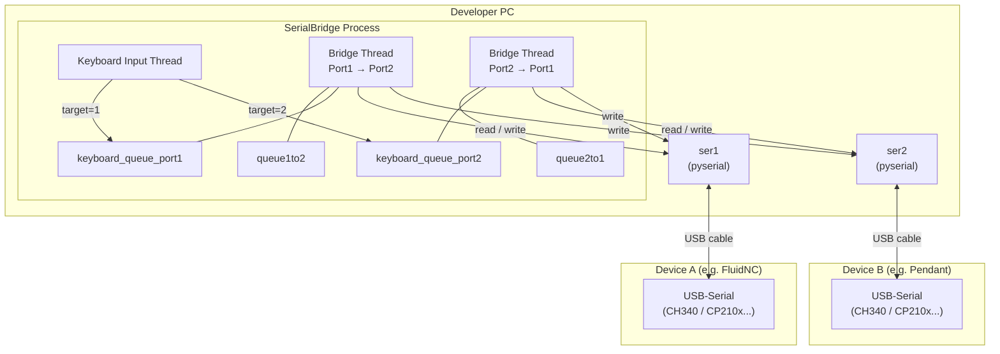
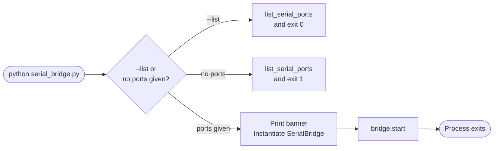
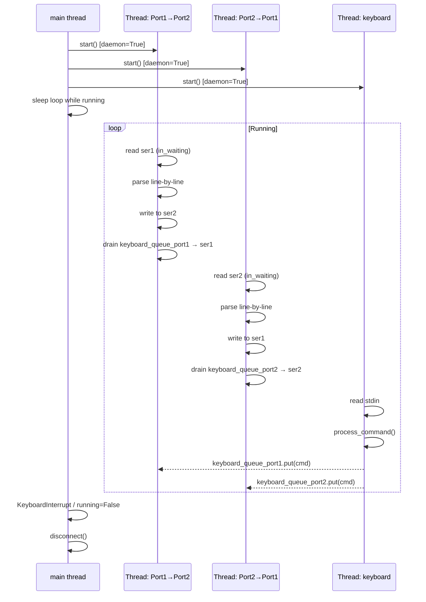
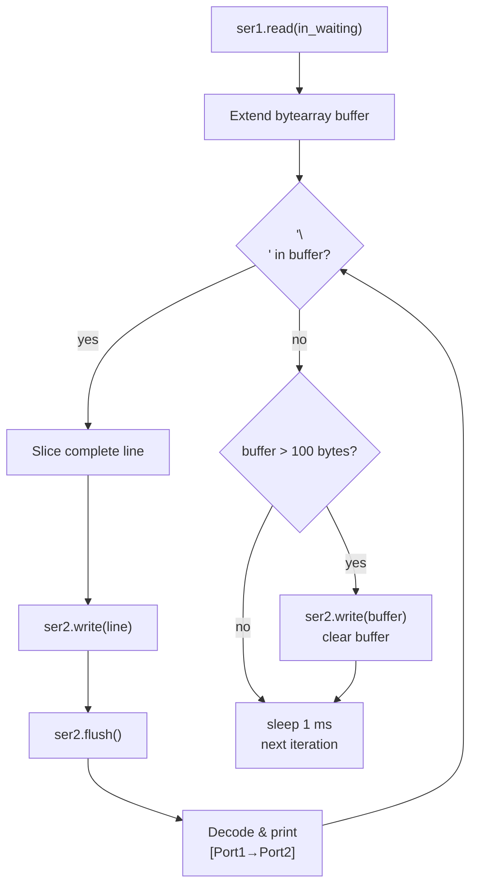
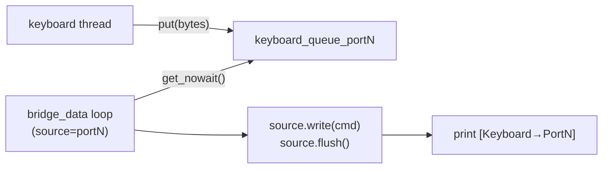
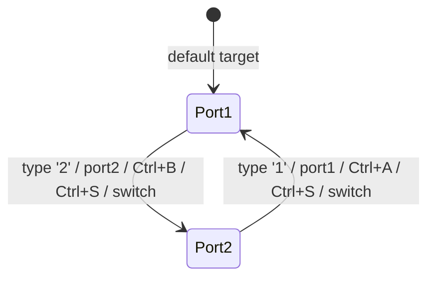
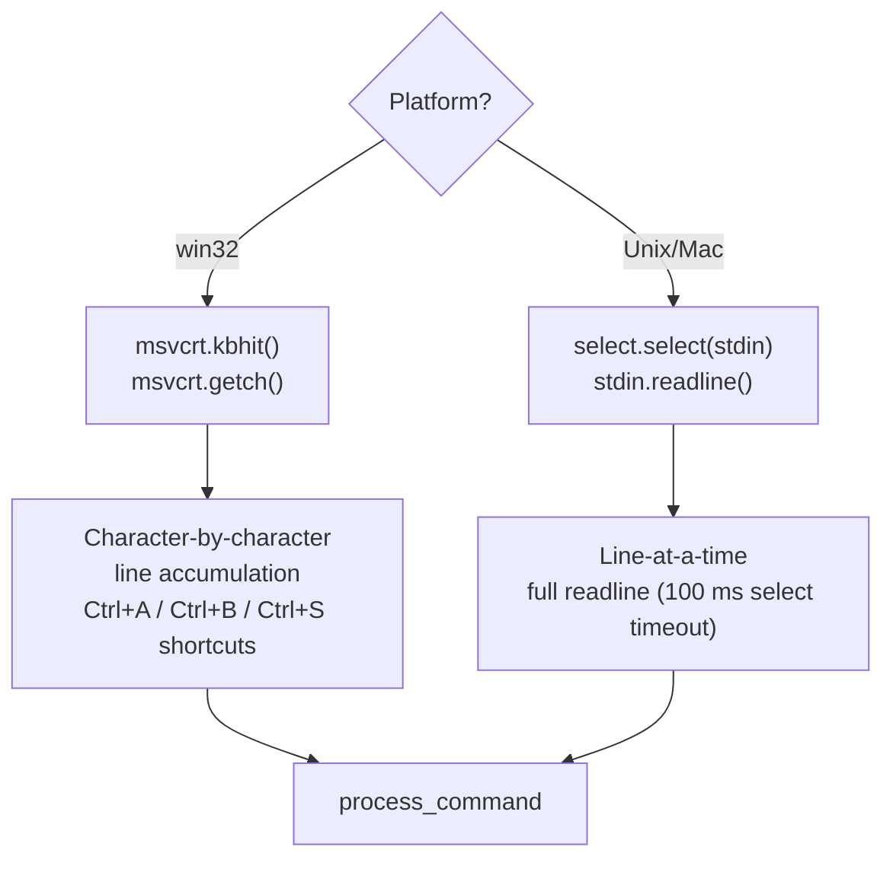
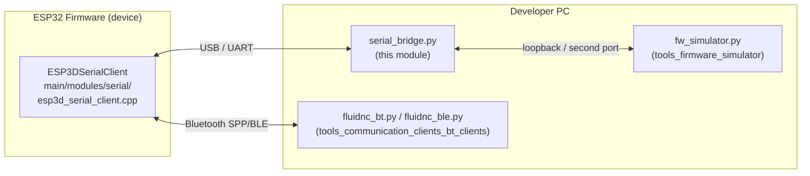

# Serial Bridge Tool

The **Serial Bridge** is a PC-side development and debugging utility that creates a transparent, bidirectional data channel between two serial/USB ports. Its primary use case is connecting two FluidNC (or compatible CNC firmware) devices simultaneously, allowing engineers to observe, relay, and inject G-code traffic during integration testing without deploying firmware changes.

It is one of several communication client tools in the project; see [tools_communication_clients_bt_clients.md](tools_communication_clients_bt_clients.md) for Bluetooth equivalents and [tools_communication_clients_websocket.md](tools_communication_clients_websocket.md) for WebSocket-based testing.

---

## Table of Contents

1. [Module Purpose](#1-module-purpose)
2. [Architecture Overview](#2-architecture-overview)
3. [Component Reference](#3-component-reference)
4. [Threading Model](#4-threading-model)
5. [Data Flow](#5-data-flow)
6. [Keyboard Input & Command Processing](#6-keyboard-input--command-processing)
7. [Configuration & CLI](#7-configuration--cli)
8. [Platform Considerations](#8-platform-considerations)
9. [Serial Line Settings](#9-serial-line-settings)
10. [Usage Examples](#10-usage-examples)
11. [Relationship to Firmware](#11-relationship-to-firmware)

---

## 1. Module Purpose

| Aspect | Detail |
|---|---|
| **File** | `tools/bridge/serial_bridge.py` |
| **Language** | Python 3 |
| **External dependency** | `pyserial` |
| **Primary use** | Bidirectional relay between two CNC-attached serial ports on a developer PC |
| **Secondary use** | Manual G-code injection into a live device without a separate terminal emulator |

The tool is intentionally a standalone script with no dependency on the firmware build system. It is invoked directly by a developer during hardware bring-up, integration testing, or protocol debugging.

---

## 2. Architecture Overview



The bridge runs three concurrent threads inside a single Python process. All inter-thread coordination uses `queue.Queue` objects — no shared mutable state is accessed without the queue's implicit synchronisation.

---

## 3. Component Reference

### `SerialBridge` class

Central orchestrator. Instantiated once by `main()` and driven by `start()`.

| Member | Type | Purpose |
|---|---|---|
| `port1_name` / `port2_name` | `str` | OS port identifiers (`COM3`, `/dev/ttyUSB0`, ...) |
| `baudrate` | `int` | Baud rate applied to both ports (default `115200`) |
| `timeout` | `float` | Per-read timeout in seconds (default `0.1`) |
| `keyboard_input` | `bool` | Whether to spawn the keyboard thread |
| `running` | `bool` | Shared stop flag; set to `False` to gracefully terminate all threads |
| `ser1` / `ser2` | `serial.Serial` | pyserial handles for the two ports |
| `queue1to2` / `queue2to1` | `Queue` | Carry data between bridge threads |
| `keyboard_queue_port1` / `keyboard_queue_port2` | `Queue` | Commands typed by the user, routed to the appropriate port |
| `target_port` | `int` (1 or 2) | Which port receives keyboard-injected commands |
| `command_history` | `list[str]` | Accumulates sent commands for session reference |

#### Key methods

| Method | Responsibility |
|---|---|
| `connect()` | Opens both serial ports with 8N1, no flow control. Returns `False` on failure. |
| `disconnect()` | Closes both ports; safe to call on a partially-connected state. |
| `bridge_data(source, dest, ..., keyboard_queue)` | Main loop of one bridge thread; reads from `source`, writes to `dest`, drains the matching keyboard queue. |
| `keyboard_input_thread()` | Reads user input, dispatches to `process_command()`. Cross-platform implementation. |
| `process_command(command)` | Routes special keywords (`help`, `exit`, `switch`, `status`, `home`, `unlock`, `reset`) or passes raw text to `send_command()`. |
| `send_command(command, target_port)` | Appends `\n`, encodes to UTF-8 bytes, and puts into the appropriate keyboard queue. |
| `start()` | Spawns threads and blocks until `running` becomes `False`. |

---

### `main()` function

Entry point. Parses CLI arguments using `argparse`, displays a configuration banner, and calls `bridge.start()`.



---

### `list_serial_ports()` helper

Uses `serial.tools.list_ports.comports()` to enumerate available ports and print device name, description, manufacturer, and serial number. Returns a `list[str]` of device paths.

---

## 4. Threading Model



All three threads are daemon threads. If the main thread exits for any reason (e.g. unhandled exception), the OS tears down the daemon threads automatically — no explicit `join()` is needed.

---

## 5. Data Flow

### Port-to-port relay



> **Design note — line-by-line buffering.** FluidNC responds to and sends G-code line-by-line (LF-terminated). The bridge accumulates bytes until a newline is found before forwarding, which keeps log output coherent. The 100-byte overflow guard prevents the buffer from growing without bound if a device sends a very long line without a trailing newline.

### Keyboard injection



Keyboard commands are always written to the **source** port of the thread that owns that keyboard queue, keeping the directionality unambiguous.

---

## 6. Keyboard Input & Command Processing

### Port selection model



### Built-in command dispatch

| Input | Sends to device | Note |
|---|---|---|
| `status` | `?` + `\n` | FluidNC/grbl real-time status request |
| `home` | `$H` + `\n` | Homing cycle |
| `unlock` | `$X` + `\n` | Alarm unlock |
| `reset` | `0x18` (Ctrl+X) | Soft reset — no newline appended |
| `switch` / `1` / `2` | — | Changes `target_port` only |
| `help` | — | Prints command reference to stdout |
| `exit` | — | Sets `running = False` |
| *(anything else)* | raw text + `\n` | Forwarded as a G-code command |

### Cross-platform keyboard handling



The Windows path accumulates characters manually to support Ctrl-key detection and backspace handling. The Unix path uses `select` with a 100 ms timeout for a simpler readline approach. As a result, on Unix all port switching must be done with text commands (`1`, `2`, `switch`) rather than Ctrl shortcuts.

---

## 7. Configuration & CLI

### Arguments

| Argument | Default | Description |
|---|---|---|
| `port1` | *(required)* | First serial port path |
| `port2` | *(required)* | Second serial port path |
| `-b` / `--baudrate` | `115200` | Baud rate (must match device firmware setting) |
| `-t` / `--timeout` | `0.1` | Read timeout in seconds |
| `--no-keyboard` | `False` | Disables the keyboard input thread; pure relay mode |
| `--list` | `False` | Enumerate available ports and exit |

### Dependency

```bash
pip install pyserial
```

No other runtime dependencies beyond the Python standard library.

---

## 8. Platform Considerations

| Feature | Windows | Linux / macOS |
|---|---|---|
| Keyboard character capture | `msvcrt.kbhit()` + `msvcrt.getch()` | `select.select([sys.stdin], ...)` + `readline()` |
| Ctrl+key shortcuts | `Ctrl+A` (Port1), `Ctrl+B` (Port2), `Ctrl+S` (switch) | Not supported; use `1`, `2`, `switch` text commands |
| Port path format | `COM3`, `COM10`, ... | `/dev/ttyUSB0`, `/dev/ttyACM0`, ... |
| Terminal raw mode | Not required | Not required |

---

## 9. Serial Line Settings

Both ports are opened with identical fixed settings, matching the FluidNC / ESP32 UART default:

| Parameter | Value |
|---|---|
| Byte size | 8 bits |
| Parity | None |
| Stop bits | 1 |
| XON/XOFF flow control | Disabled |
| RTS/CTS flow control | Disabled |
| DTR/DSR flow control | Disabled |

These settings match the firmware-side serial transport configured in `main/modules/serial/esp3d_serial_config.h`. The baud rate is the only field that may need to be adjusted via `-b` to match a non-default firmware configuration.

---

## 10. Usage Examples

### List available ports

```bash
python tools/bridge/serial_bridge.py --list
```

### Basic bridge (Linux)

```bash
python tools/bridge/serial_bridge.py /dev/ttyUSB0 /dev/ttyUSB1
```

### Basic bridge (Windows)

```bash
python tools/bridge/serial_bridge.py COM3 COM4
```

### Custom baud rate

```bash
python tools/bridge/serial_bridge.py /dev/ttyUSB0 /dev/ttyUSB1 -b 250000
```

### Silent bridge — no keyboard, suited for scripted piping

```bash
python tools/bridge/serial_bridge.py COM3 COM4 --no-keyboard
```

### Interactive session — typical workflow

```
╔════════════════════════════════════════════╗
║   FluidNC Serial Bridge - Bidirectional    ║
╚════════════════════════════════════════════╝

✓ Connected to /dev/ttyUSB0
✓ Connected to /dev/ttyUSB1
Bridge active!

G-code [Port1]> status          <- sends '?' to Port1
[Port1→Port2] <Idle|MPos:0.000,0.000,0.000|FS:0,0>

G-code [Port1]> 2               <- switch target to Port2
   -> Switched to Port2 (/dev/ttyUSB1)

G-code [Port2]> $I              <- send info request to Port2
[Port2→Port1] [VER:3.7.8 FluidNC]

G-code [Port2]> exit
✓ Serial bridge closed.
```

---

## 11. Relationship to Firmware

The serial bridge operates entirely on the PC side — it has no build-time dependency on the ESP-IDF firmware. Its role in the development workflow is:



- **`ESP3DSerialClient`** (`main/modules/serial/esp3d_serial_client.cpp`) — the embedded counterpart that owns the UART on the ESP32 and runs `esp3d_serial_rx_task` in its own FreeRTOS task. The bridge connects to this device over USB.
- **`fw_simulator.py`** ([tools_firmware_simulator.md](tools_firmware_simulator.md)) — can be used as the second endpoint of the bridge instead of a physical device, enabling fully virtual integration tests with simulated FluidNC, grbl, or other firmware responses.
- **BT clients** ([tools_communication_clients_bt_clients.md](tools_communication_clients_bt_clients.md)) — alternative transport clients when testing over Bluetooth SPP (`fluidnc_bt.py`, `grblhal_bt.py`) or BLE (`fluidnc_ble.py`) instead of UART.
- **WebSocket test** ([tools_communication_clients_websocket.md](tools_communication_clients_websocket.md)) — used when the CNC transport is over WiFi TCP/WebSocket instead of serial.

> **Transport exclusivity reminder:** In the default firmware build, serial (UART) is the CNC transport and WiFi serves the WebUI/remote interface. `SOCKET_CLIENT_SERVICE` and serial are mutually exclusive at the build level, enforced by `cmake/sanity_check.cmake`. Refer to `docs/architecture/connection_management.md` for the full connection model.
