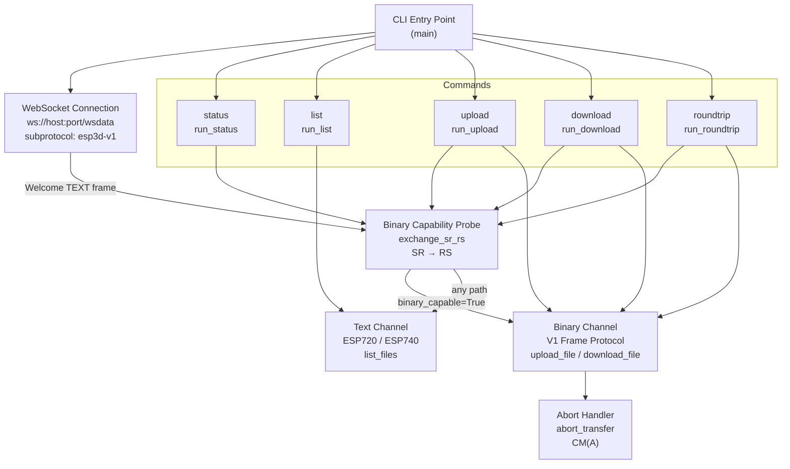
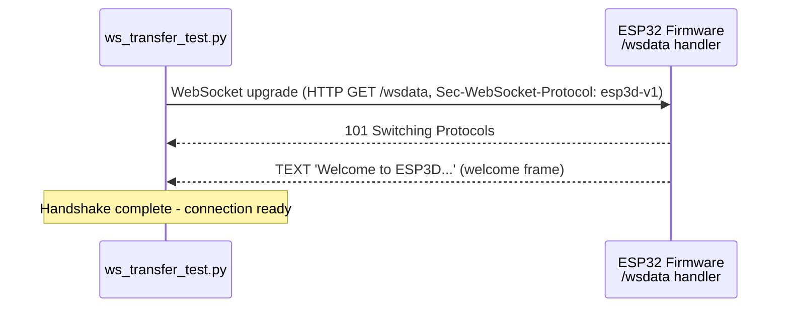
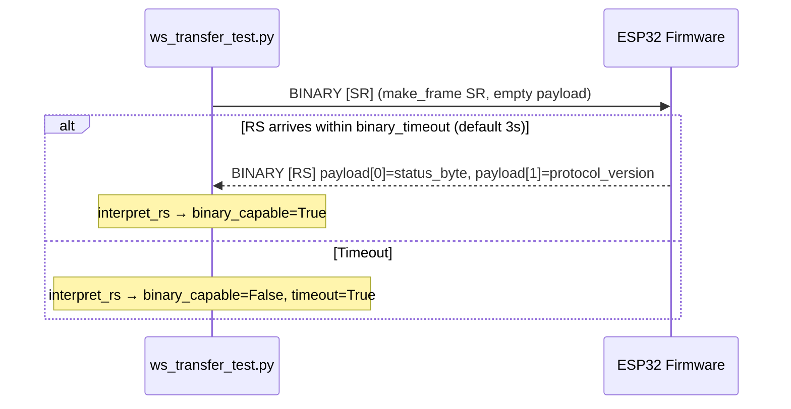
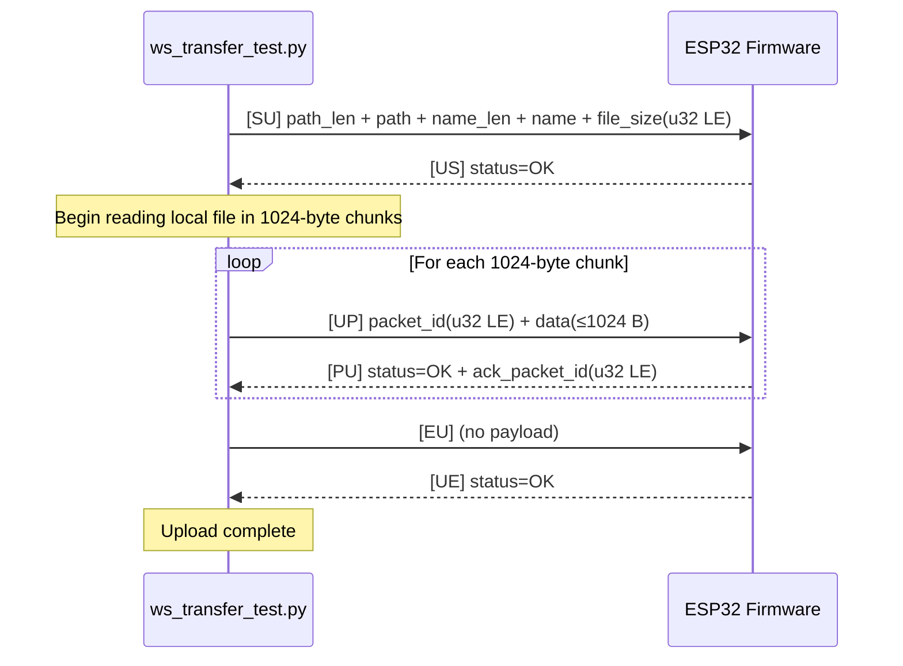
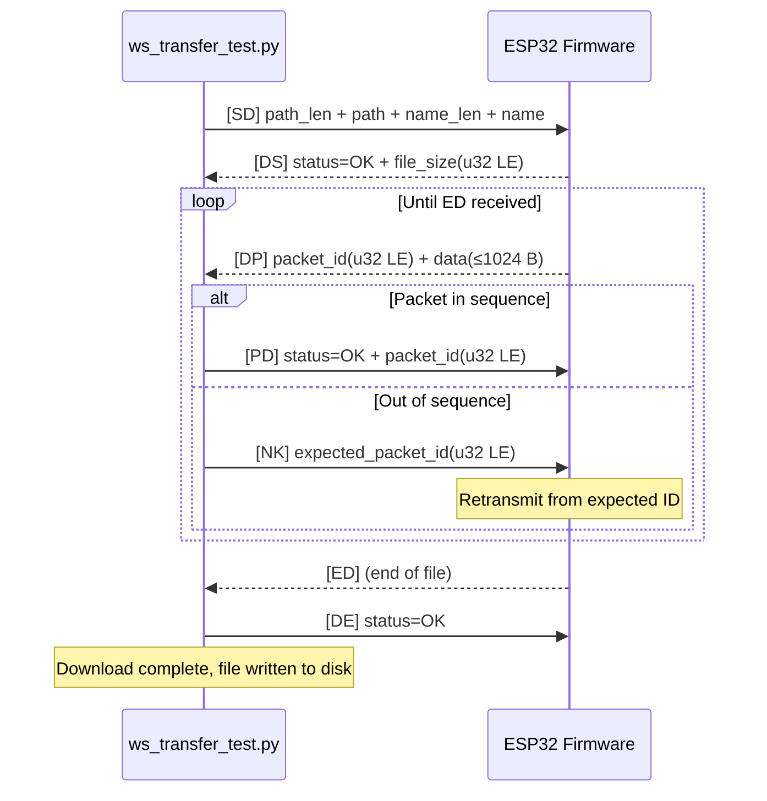
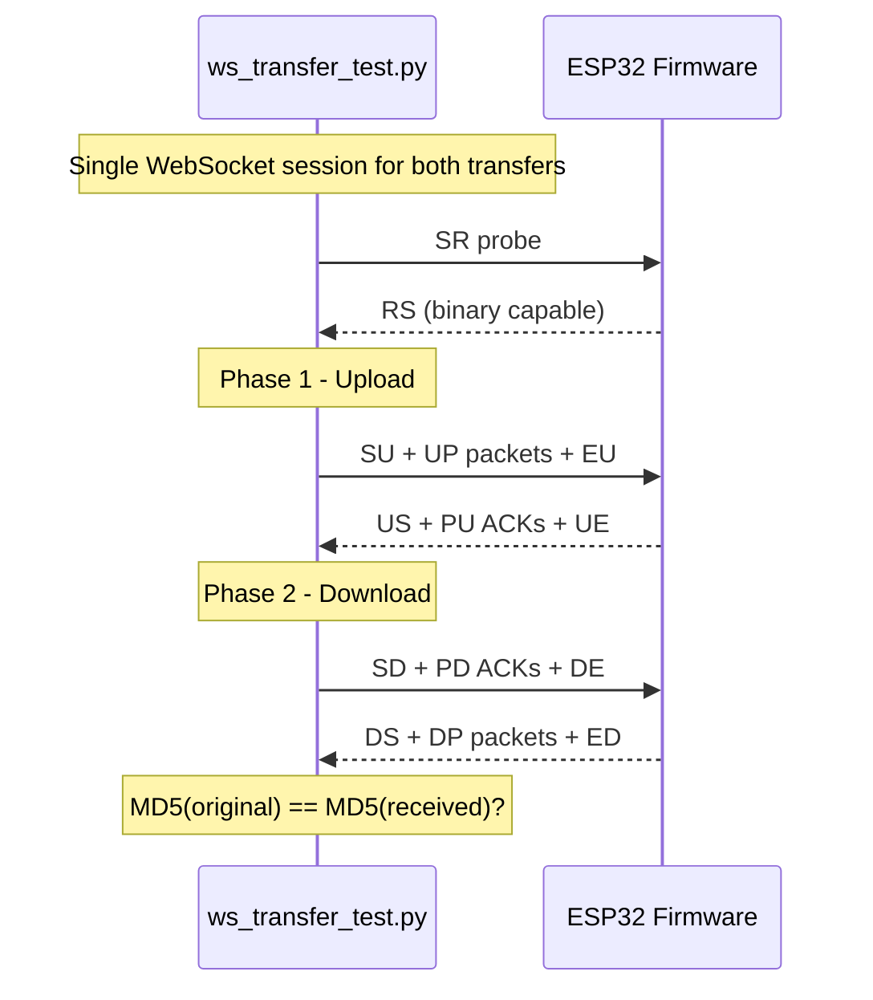
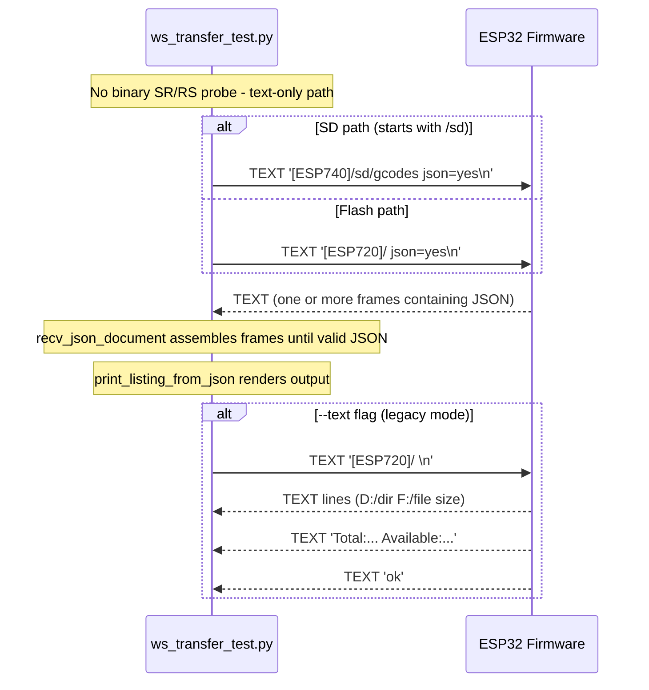
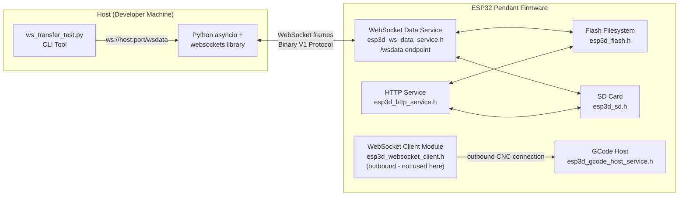
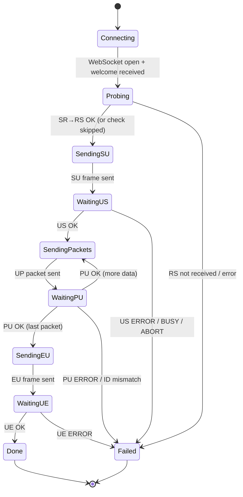
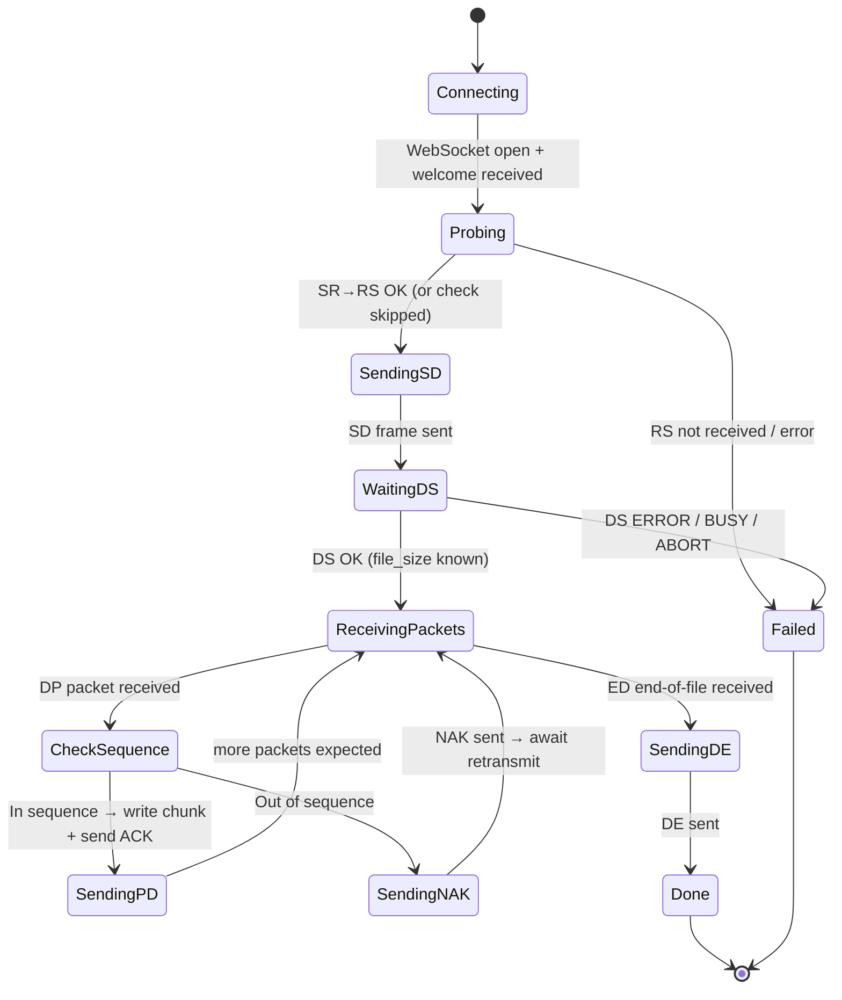

# Tools — Communication Clients: WebSocket (`tools_communication_clients_websocket`)

## Introduction

The `tools_communication_clients_websocket` module provides a standalone Python development and testing tool — `tools/websocket/ws_transfer_test.py` — that implements the **ESP3D WebSocket Protocol V1** binary file transfer protocol. It targets the `/wsdata` WebSocket endpoint exposed by the firmware's data WebSocket service and is the primary host-side reference implementation for binary upload, download, and protocol capability probing.

This tool is used during development to validate the firmware's WebSocket binary channel, benchmark transfer integrity, and debug file I/O on both the internal flash filesystem and the SD card — all over a standard Wi-Fi TCP connection to a live pendant device.

> **Scope boundary:** This tool targets `/wsdata` with subprotocol `esp3d-v1` (binary V1 protocol) exclusively. The WebUI socket at `/ws` with subprotocol `webui-v3` uses a different binary stream format for live status updates and is not covered here. See [`tools_communication_clients_serial_bridge`](tools_communication_clients_serial_bridge.md) and [`tools_communication_clients_bt_clients`](tools_communication_clients_bt_clients.md) for the other communication client tools in this family.

---

## Architecture Overview



---

## Module Components

### File Structure

```
tools/websocket/
└── ws_transfer_test.py     # Single-file tool — all logic self-contained
```

### Key Functions

| Function | Role |
|---|---|
| `main` | CLI argument parser and command dispatcher |
| `run_status` | Opens WebSocket, runs SR/RS probe, reports capability |
| `run_list` | Opens WebSocket, sends ESP720/ESP740 text commands, parses response |
| `run_upload` | Opens WebSocket, optionally probes, then uploads a local file |
| `run_download` | Opens WebSocket, optionally probes, then downloads a remote file |
| `run_roundtrip` | Upload + download in one session, then MD5 comparison |
| `upload_file` | Core upload state machine (SU→US→UP/PU loop→EU→UE) |
| `download_file` | Core download state machine (SD→DS→DP/PD loop→ED/DE) |
| `abort_transfer` | Sends CM(A) abort command to interrupt an in-progress transfer |
| `exchange_sr_rs` | Sends SR binary frame, awaits RS response, returns parsed info dict |
| `ensure_binary_file_transfer` | Wraps `exchange_sr_rs`; raises `WsTransferError` on failure |
| `interpret_rs` | Parses RS payload fields (state, version, progress) |
| `make_frame` | Builds 4-byte header + payload binary frame |
| `parse_frame` | Decodes incoming binary frame into (opcode, payload) |
| `recv_binary` | Awaits next binary WebSocket message; skips interleaved text frames |
| `recv_text_responses` | Collects text frames until end marker, timeout, or error stop |
| `recv_json_document` | Accumulates text frames until valid JSON is assembled |
| `list_files` | Sends ESP720/ESP740 command; handles JSON or legacy text response |

---

## Protocol Reference

### Transport Layer

The tool connects using the [`websockets`](https://pypi.org/project/websockets/) Python library:

| Parameter | Value |
|---|---|
| URL | `ws://<host>:<port>/wsdata` |
| Subprotocol | `esp3d-v1` |
| First frame | TEXT welcome message from the server |
| Subsequent frames | Binary (V1 protocol) or TEXT (ESP command responses) |

### Binary Frame Format

Every binary message (in both directions) is a fixed 4-byte header followed by an optional payload:

```
┌──────────────┬──────────────────────┬─────────────────────┐
│  Opcode[2B]  │  Payload Length[2B]  │  Payload[N bytes]   │
│  ASCII chars │  Little-Endian u16   │  (protocol-specific)│
└──────────────┴──────────────────────┴─────────────────────┘
```

- **Opcode**: 2 ASCII characters (e.g., `SR`, `US`, `DP`)
- **Payload Length**: uint16 little-endian — number of bytes in the payload
- **Payload**: 0 to N bytes, format depends on opcode

### Opcode Table

| Opcode | Direction | Meaning |
|---|---|---|
| `SR` | Client → Server | Status Request (probe) |
| `RS` | Server → Client | Status Response |
| `SU` | Client → Server | Start Upload |
| `US` | Server → Client | Upload Start ACK |
| `UP` | Client → Server | Upload Packet |
| `PU` | Server → Client | Upload Packet ACK |
| `EU` | Client → Server | End Upload |
| `UE` | Server → Client | Upload End ACK |
| `SD` | Client → Server | Start Download |
| `DS` | Server → Client | Download Start ACK |
| `DP` | Server → Client | Download Packet |
| `PD` | Client → Server | Download Packet ACK |
| `ED` | Server → Client | End Download |
| `DE` | Client → Server | Download End ACK |
| `NK` | Client → Server | Negative ACK (request retransmit) |
| `CM` | Client → Server | Command (e.g., `A` = abort) |

### Status Byte Values

The first byte of most ACK payloads is a status indicator:

| Byte | ASCII | Meaning |
|---|---|---|
| `O` (0x4F) | OK | Operation accepted / succeeded |
| `E` (0x45) | ERROR | General I/O or path error |
| `B` (0x42) | BUSY | Another transfer already in progress |
| `A` (0x41) | ABORT | Transfer was aborted |
| `U` (0x55) | UPLOAD | Server currently in an upload transfer |
| `D` (0x44) | DLOAD | Server currently in a download transfer |

### Packet Size

Upload packets carry exactly `PACKET_SIZE = 1024` data bytes per `UP` frame (the last packet may be shorter). This constant must match `ESP3D_WS_TRANSFER_PACKET_SIZE` on the firmware side.

---

## Data Flow Diagrams

### (1) Connection Handshake



### (2) Binary Capability Probe (SR → RS)



The `RS` payload when state is `OK`:
```
Byte 0    : status byte (S_OK = 'O')
Byte 1    : protocol version (1 = V1)
```

When state is `UPLOAD` or `DLOAD` (a resumable transfer is in progress), the RS payload carries extended progress data:
```
Byte 0    : status byte (S_UPLOAD or S_DLOAD)
Bytes 1-4 : total bytes (uint32 LE)
Bytes 5-8 : done bytes (uint32 LE)
Bytes 9-12: last packet ID (uint32 LE)
```

### (3) File Upload Flow



**SU payload layout:**
```
Byte 0       : len(path)
Bytes 1..N   : path (UTF-8)
Byte N+1     : len(filename)
Bytes N+2..M : filename (UTF-8)
Bytes M+1..  : file_size (uint32 little-endian)
```

### (4) File Download Flow



### (5) Round-Trip Test Flow



### (6) File Listing Flow (Text Channel)



---

## Component Interaction Diagram



> **Note:** This tool connects to the firmware's **WebSocket server** (`esp3d_ws_data_service`). The separate **WebSocket client** (`esp3d_websocket_client`) is an outbound transport used by the pendant to connect to a CNC controller and is unrelated to this tool. See [`websocket_client`](websocket_client.md) for the firmware-side outbound client and [`Network_&_Web_Services`](Network_and_Web_Services.md) for the full server-side architecture.

---

## Error Handling

### `WsTransferError`

A typed exception class that wraps all expected protocol-level failures. The `_run_async()` wrapper catches it and exits with code `1` after printing to `stderr`. This separates clean protocol rejections (wrong path, file missing, server busy) from unexpected Python or network errors.

### ACK Failure Reasons

| Status | Meaning | Detected At |
|---|---|---|
| `E` ERROR | File missing, path invalid, or I/O error | SU, SD, UP, EU responses |
| `B` BUSY | Another transfer already in progress | SU, SD responses |
| `A` ABORT | Transfer was aborted | SU, SD responses |
| Opcode mismatch | Unexpected response opcode received | Any ACK step |
| Empty payload | ACK frame arrived with no status byte | Any ACK step |
| Packet ID mismatch | ESP acknowledged a different packet ID than sent | UP/PU loop |
| Frame too short | Frame header under 4 bytes | `parse_frame` |

### Text Response Error Stops

The `recv_text_responses` helper recognises these strings from the ESP as terminal error conditions (no trailing `ok` is expected after them):

- `No SD` — SD card missing or not mounted
- `SD busy` — SD card in use by another operation
- `Flash not available` / `Flash partition not mounted`
- `Cannot open :` (prefix match)
- `Path incorrect` / `Path inccorrect` (firmware typo variant also handled)

---

## CLI Reference

### Installation

```bash
pip install websockets
```

### Global Options

| Option | Default | Description |
|---|---|---|
| `--host` | `192.168.1.100` | IP address of the ESP32 pendant |
| `--port` | `8282` | WebSocket port |
| `--binary-timeout` | `3.0` | Seconds to wait for SR→RS binary response |
| `--skip-binary-check` | false | Skip SR/RS probe before upload/download/roundtrip |

### Commands

#### `status` — Binary Capability Probe

```bash
python ws_transfer_test.py --host 192.168.1.100 --port 8282 status
python ws_transfer_test.py --host 192.168.1.100 --port 8282 --binary-timeout 5 status
```

Performs the two-step verification:
1. WebSocket upgrade to `/wsdata` with subprotocol `esp3d-v1` — checks the data endpoint is present and the server accepts the subprotocol
2. SR → RS binary probe — confirms the server responds to the V1 binary protocol

#### `list` — Directory Listing

```bash
# Flash root — json=yes by default (structured, fast)
python ws_transfer_test.py --host 192.168.1.100 --port 8282 list /
python ws_transfer_test.py --host 192.168.1.100 --port 8282 list /fs   # alias for /

# SD card subdirectory
python ws_transfer_test.py --host 192.168.1.100 --port 8282 list /sd/gcodes

# Print the raw JSON document instead of formatted output
python ws_transfer_test.py --host 192.168.1.100 --port 8282 list / --raw-json

# Legacy line-by-line text mode (no json=yes)
python ws_transfer_test.py --host 192.168.1.100 --port 8282 list / --text
```

Uses `[ESP720]` for flash paths and `[ESP740]` for SD paths. `/fs` is normalised to `/` for ESP720 compatibility.

#### `upload` — File Upload

```bash
python ws_transfer_test.py --host 192.168.1.100 --port 8282 upload myfile.txt /fs
python ws_transfer_test.py --host 192.168.1.100 --port 8282 --skip-binary-check upload myfile.txt /fs
```

Runs the SR/RS probe first (unless `--skip-binary-check`), then streams the file in 1024-byte packets with per-packet acknowledgement.

#### `download` — File Download

```bash
# Save as ./test.txt in the current directory (default)
python ws_transfer_test.py --host 192.168.1.100 --port 8282 download /fs test.txt

# Save to an explicit local path
python ws_transfer_test.py --host 192.168.1.100 --port 8282 download /fs test.txt ./received.txt
```

Runs SR/RS probe first (unless `--skip-binary-check`), streams packets with per-packet ACK, sends NAK for any out-of-sequence packet.

#### `roundtrip` — Integrity Test

```bash
python ws_transfer_test.py --host 192.168.1.100 --port 8282 roundtrip myfile.txt /fs
```

In a single WebSocket session: uploads the file, downloads it back to a `.received` temporary file, computes MD5 of both files, prints pass/fail, and removes the temporary file on success. Exits with code `1` on MD5 mismatch.

---

## Process Flow: Internal State Machines

### Upload State Machine



### Download State Machine



---

## Dependencies

### External (Python)

| Package | Purpose |
|---|---|
| `websockets` | Async WebSocket client (`pip install websockets`) |
| `asyncio` | Coroutine runtime for all async I/O operations |
| `argparse` | CLI argument parsing |
| `hashlib` | MD5 checksum computation for roundtrip comparison |
| `struct` | Binary packing/unpacking of frame headers and payload fields |
| `json` | Parsing ESP720/ESP740 JSON directory listings |
| `os`, `sys` | File I/O, path utilities, and process exit codes |

### Firmware-Side Counterparts

| Firmware Component | Documentation | Relationship |
|---|---|---|
| `esp3d_ws_data_service.h` | [`websocket_server`](websocket_server.md) | The `/wsdata` server endpoint this tool connects to |
| `esp3d_websocket_client.h` | [`websocket_client`](websocket_client.md) | Outbound WS transport for CNC — separate, not tested here |
| `esp3d_flash.h` | [`Storage_&_Configuration`](Storage_and_Configuration.md) | Flash filesystem accessed server-side during upload/download |
| `esp3d_sd.h` | [`Storage_&_Configuration`](Storage_and_Configuration.md) | SD card accessed server-side during upload/download |
| `esp3d_ws_service.h` | [`Network_&_Web_Services`](Network_and_Web_Services.md) | Underlying WebSocket server infrastructure |

---

## Related Modules

| Module | Documentation | Notes |
|---|---|---|
| Serial Bridge | [`tools_communication_clients_serial_bridge`](tools_communication_clients_serial_bridge.md) | Host ↔ serial bridge for UART debugging |
| BT Clients | [`tools_communication_clients_bt_clients`](tools_communication_clients_bt_clients.md) | BLE/SPP Bluetooth test clients |
| Firmware Simulator | [`tools_firmware_simulator`](tools_firmware_simulator.md) | Mock CNC firmware for offline testing |
| WebSocket Server | [`Network_&_Web_Services`](Network_and_Web_Services.md) | Firmware WS server (`/wsdata`, `/ws`) |
| WebSocket Client | [`websocket_client`](websocket_client.md) | Firmware-side outbound WS transport to CNC |
| Communication Transports | [`Communication_Transports`](Communication_Transports.md) | All firmware transport modules overview |

---

## Usage Notes

### Path Conventions

| Location | Tool path argument | ESP command used |
|---|---|---|
| Flash root | `/` or `/fs` | `ESP720` with path `/` |
| Flash subdirectory | `/subdir` | `ESP720` with path `/subdir` |
| SD root | `/sd` | `ESP740` with path `/sd` |
| SD subdirectory | `/sd/gcodes` | `ESP740` with path `/sd/gcodes` |

> `/fs` is automatically normalised to `/` for `ESP720` flash listings, matching the firmware's VFS root convention.

### Interleaved Text Frames

The firmware may send unsolicited TEXT frames (status updates, log lines) at any time during a binary transfer. The `recv_binary` helper transparently skips and prints these frames so they never corrupt the binary protocol state machine.

### Binary Probe Timeout

The default `--binary-timeout` of 3 seconds is intentionally short. If the server is running a build without the data handler enabled, the RS frame will never arrive and a long timeout would stall the tool. Increase to 5–10 seconds only when debugging slow or congested network conditions.

### Build Flag Dependency

The `/wsdata` binary transfer capability is only present in firmware builds where the WebSocket data service is compiled in. Consult `docs/features/feature_resource_matrix.md` and the project `CMakeLists.txt` options to confirm the target build includes this service before running upload or download commands.
