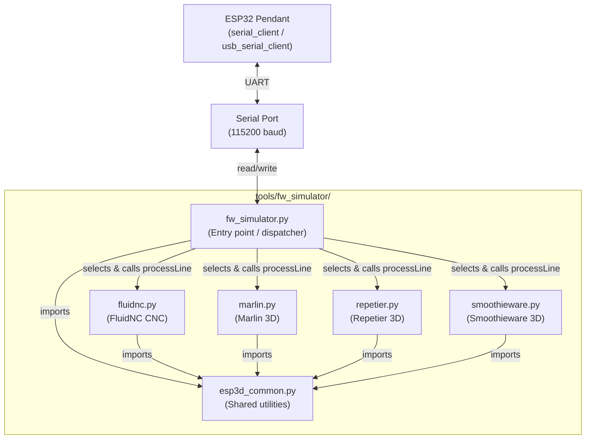
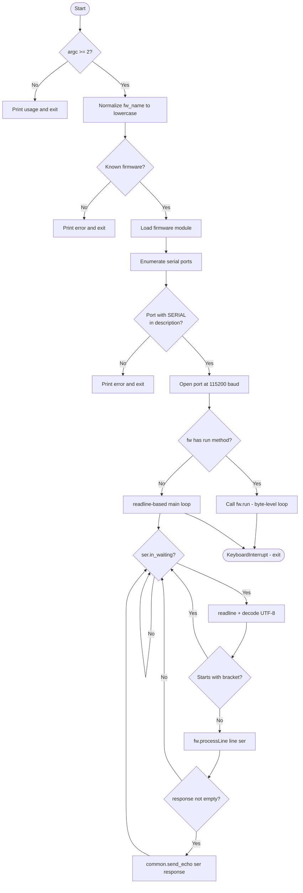
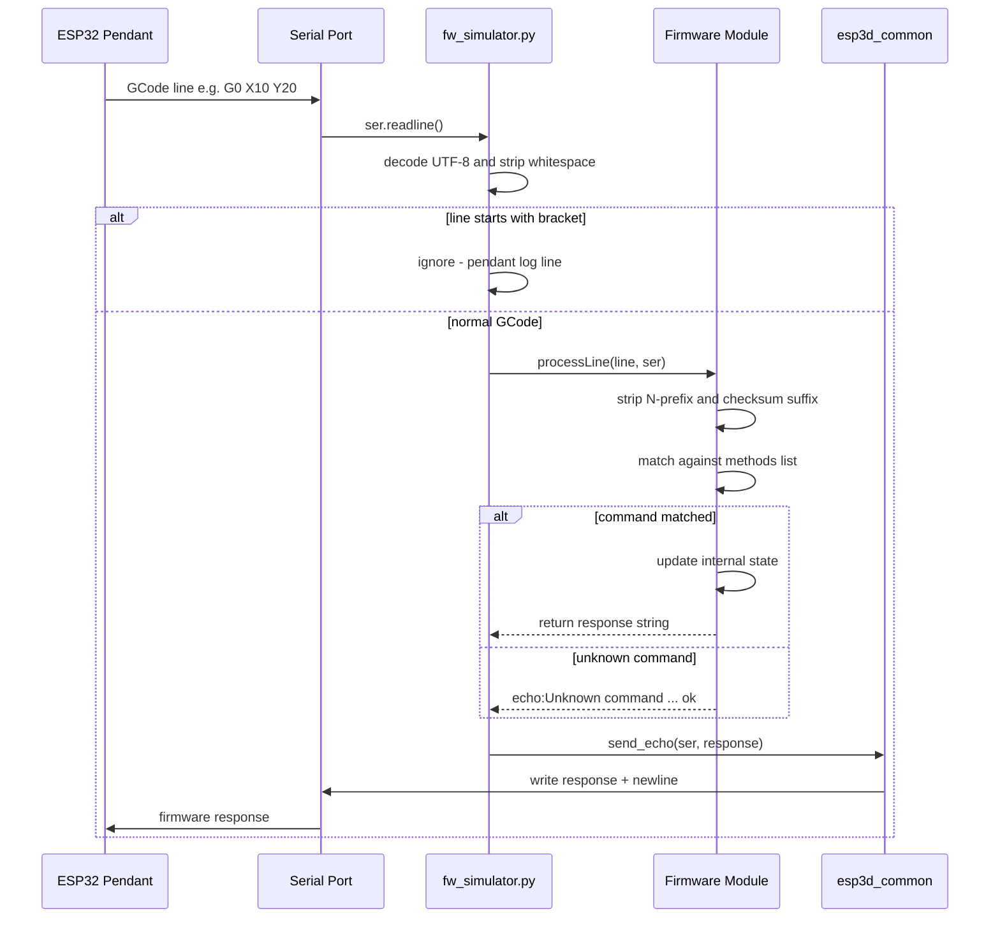
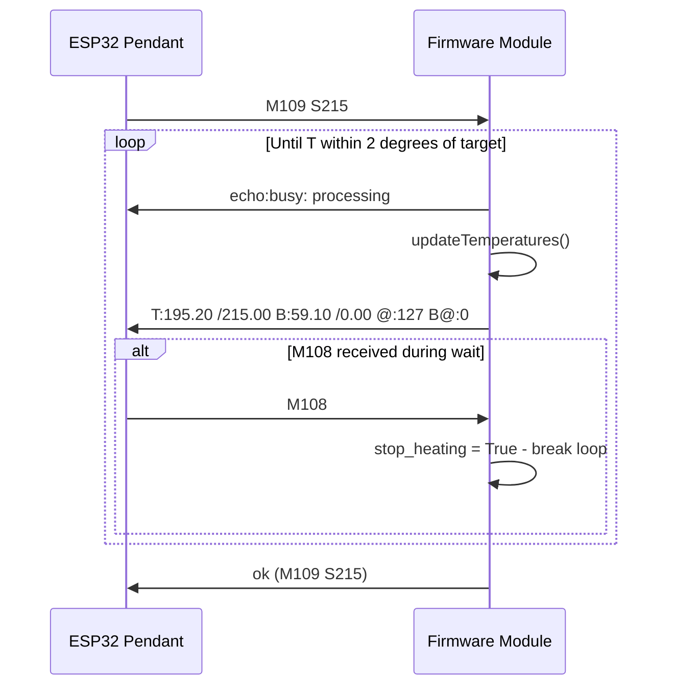
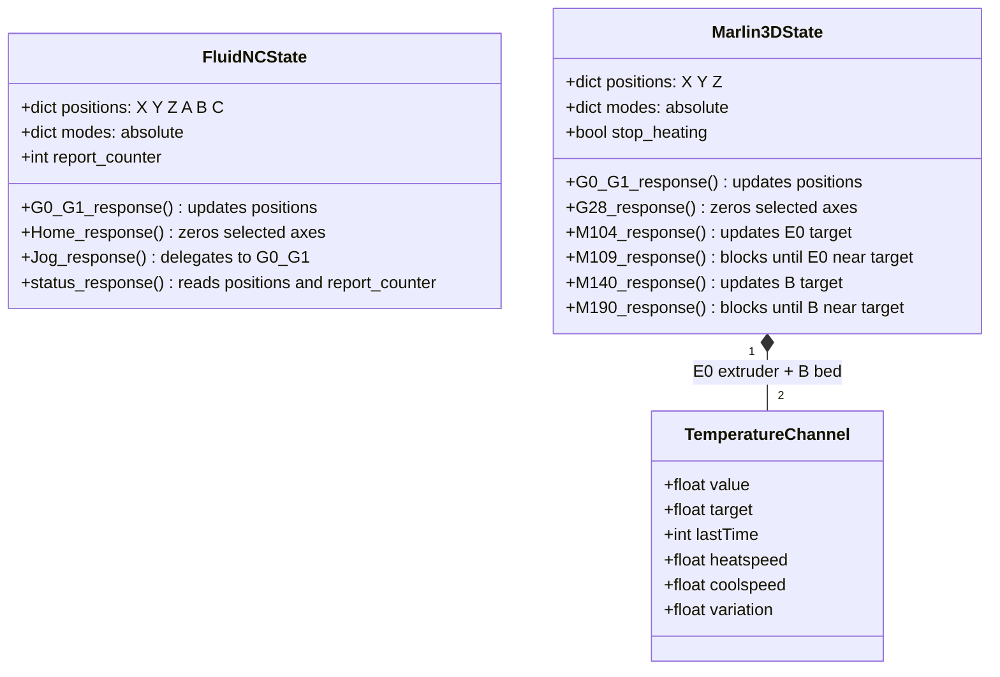
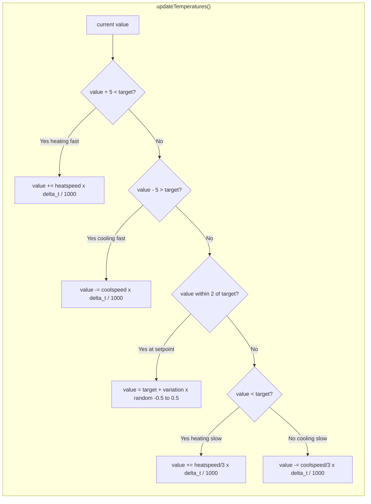
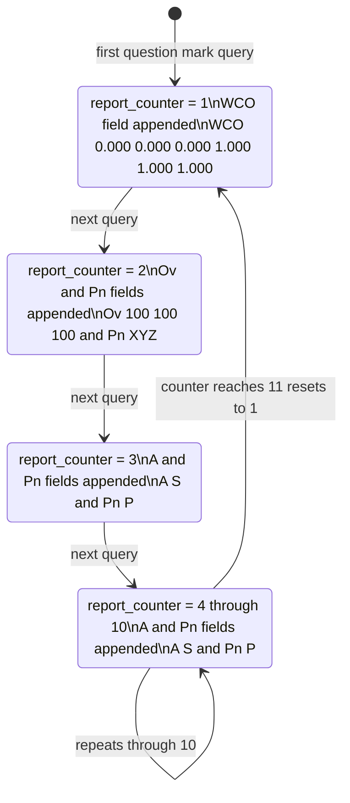
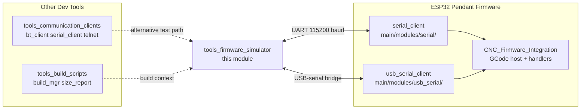

# Firmware Simulator (`tools/fw_simulator`)

The firmware simulator is a **PC-side development tool** that impersonates CNC and 3D-printer firmware over a physical or virtual serial port. It lets developers exercise the pendant firmware end-to-end—including GCode dispatch, position updates, temperature feedback, and status polling—without needing real CNC hardware connected.

It is part of the broader [Build & Development Tools](tools_build_scripts.md) family and pairs naturally with the [Communication Clients](tools_communication_clients.md) (BT, serial, telnet, WebSocket) that can be used on the same workstation.

---

## Table of Contents

1. [Purpose and Scope](#1-purpose-and-scope)
2. [Module Architecture](#2-module-architecture)
3. [File Overview](#3-file-overview)
4. [Entry Point – `fw_simulator.py`](#4-entry-point--fw_simulatorpy)
5. [Common Utilities – `esp3d_common.py`](#5-common-utilities--esp3d_commonpy)
6. [Firmware Modules](#6-firmware-modules)
   - 6.1 [FluidNC (`fluidnc.py`)](#61-fluidnc-fluidncpy)
   - 6.2 [Marlin (`marlin.py`)](#62-marlin-marlinpy)
   - 6.3 [Repetier (`repetier.py`)](#63-repetier-repetierpy)
   - 6.4 [Smoothieware (`smoothieware.py`)](#64-smoothieware-smoothiewarepy)
7. [GCode Command Coverage](#7-gcode-command-coverage)
8. [Data Flow](#8-data-flow)
9. [State Management](#9-state-management)
10. [Temperature Simulation Model](#10-temperature-simulation-model)
11. [FluidNC Status Report Rotation](#11-fluidnc-status-report-rotation)
12. [Adding a New Firmware Module](#12-adding-a-new-firmware-module)
13. [Usage](#13-usage)
14. [Relationship to Other Modules](#14-relationship-to-other-modules)

---

## 1. Purpose and Scope

The pendant firmware running on the ESP32 communicates with the CNC/3D-printer controller via one of several transports (serial, USB-serial, Bluetooth, socket). During development it is impractical to have live CNC hardware connected on every workstation. The firmware simulator fills this gap:

- Accepts the same GCode and proprietary command set the real firmware would accept.
- Tracks machine state (positions, motion mode, temperatures) and generates realistic, protocol-correct responses.
- Mirrors log lines from the pendant to the console so the developer can monitor both sides of the conversation.
- Supports the pendant's line-based serial protocol as well as the real-time single-byte command model used by Grbl-family firmwares.

**Scope:** Development/testing only. The simulator runs on a workstation (Python 3) and communicates with the ESP32 pendant over a real or virtual serial port pair (e.g. `socat` on Linux).

---

## 2. Module Architecture



Each **firmware module** is a self-contained plugin. The dispatcher (`fw_simulator.py`) owns the serial port and the read loop; firmware modules only implement command processing and state logic.

---

## 3. File Overview

| File | Role |
|---|---|
| `fw_simulator.py` | CLI entry point. Scans serial ports, opens the connection, selects the firmware plugin, and runs the main read loop. |
| `esp3d_common.py` | Shared ANSI-color helpers, millisecond timer, and `send_echo()` / `wait()` utilities used by all firmware modules. |
| `fluidnc.py` | Simulates **FluidNC** (CNC, 6-axis). Implements `processLine()` and the full Grbl-compatible status report format. |
| `marlin.py` | Simulates **Marlin** (3D printing). Implements `processLine()` plus temperature physics for extruder and heated bed. |
| `repetier.py` | Simulates **Repetier** (3D printing). Structurally identical to `marlin.py`; same GCode surface. |
| `smoothieware.py` | Simulates **Smoothieware** (3D printing). Structurally identical to `marlin.py`; same GCode surface. |

---

## 4. Entry Point – `fw_simulator.py`

### `main()`

```
python fw_simulator.py <firmware>
```

where `<firmware>` is one of: `marlin`, `repetier`, `smoothieware`, `grbl`, `fluidnc`.

**Startup sequence:**



### Port detection

The dispatcher iterates `serial.tools.list_ports.comports()` and selects the first port whose **description** contains the string `"SERIAL"` (case-sensitive). On Linux this is typically a USB-serial adapter; on Windows it matches COM ports exposed by the pendant's USB bridge. The port is opened at a fixed baud rate of **115 200**.

### Log-line filtering

Lines that begin with `[` are silently ignored. This covers:
- ESP3D log lines: `[esp...]`
- ANSI escape sequences: `[0;...`, `[1;...`

This prevents the pendant's own debug output from being fed back into the GCode processor.

### Optional `run()` protocol

If the selected firmware module exports a `run(ser)` function, the dispatcher delegates the entire event loop to it. This supports firmwares (e.g. Grbl real-time commands) that require byte-level rather than line-level reading.

---

## 5. Common Utilities – `esp3d_common.py`

### `bcolors`

ANSI terminal color constants used across all modules for console output:

| Constant | Color | Used for |
|---|---|---|
| `COL_BLUE` | Blue | Lines received from the pendant |
| `COL_GREEN` | Green | Status / info messages from the simulator |
| `COL_RED` | Red | Error messages |
| `COL_PURPLE` | Purple | Lines received during `wait()` delays |
| `COL_ORANGE` | Orange | (available, not currently assigned) |
| `COL_CYAN` | Cyan | (available, not currently assigned) |
| `BOLD` / `UNDERLINE` | — | Text decorations |
| `END_COL` | Reset | Terminates color sequences |

### `current_milli_time()`

Returns `round(time.time() * 1000)` — a millisecond-precision timestamp used by the `wait()` spin-loops and by the Marlin-family temperature simulation.

### `wait(durationms, ser)`

Spins for `durationms` milliseconds while draining any incoming serial data and printing each received line in purple. Used by firmware modules to simulate command execution delay without blocking the serial RX path.

### `send_echo(ser, msg)`

Writes `msg + "\n"` to the serial port (UTF-8 encoded), flushes, and prints the message to stdout without color markers.

---

## 6. Firmware Modules

### 6.1 FluidNC (`fluidnc.py`)

Simulates **FluidNC v3.x** — the Grbl-based CNC firmware used with the pendant. Unlike the 3D-printer modules, FluidNC:
- Tracks **six axes**: X, Y, Z, A, B, C.
- Reports status in the Grbl real-time format (`<Status|MPos:...|FS:...|Bf:...|WCO:...|...>`).
- Responds to `$`-prefixed commands (`$H`, `$J=`, `$I`).
- Uses a rotating **report counter** to cycle optional status fields across successive `?` queries.

#### Supported commands

| Command prefix | Handler | Description |
|---|---|---|
| `G0` | `G0_G1_response()` | Rapid move (6-axis) |
| `G1` | `G0_G1_response()` | Linear move (6-axis) |
| `G90` | `G90_response()` | Absolute positioning mode |
| `G91` | `G91_response()` | Relative positioning mode |
| `$H` | `Home_response()` | Home all or selective axes |
| `$J=` | `Jog_response()` | Jog move (strips G90/G91/G21 prefixes) |
| `$I` | `info_response()` | Return firmware version string |
| `?` | `status_response()` | Real-time status report |
| Any `M`, `G`, `N`, `$` | — | Generic `ok (cmd)` acknowledgment |

#### Status report format

```
<Idle|MPos:X,Y,Z,A,B,C|FS:0,0|Bf:15,128|[WCO|Ov|A:S|Pn]>
```

Optional fields rotate on a 10-report cycle (see [§11](#11-fluidnc-status-report-rotation)).

#### `ok()` helper

Strips `N<num>` line-numbering prefix and `*<checksum>` suffix when present, then returns `ok <N>` or `ok (cmd)`.

---

### 6.2 Marlin (`marlin.py`)

Simulates **Marlin** — the dominant 3D-printer firmware. Tracks 3-axis position (X, Y, Z) and two temperature channels (E0 extruder, B heated bed) with physics-based heat/cool simulation.

#### Supported commands

| Command prefix | Handler | Description |
|---|---|---|
| `G0` / `G1` | `G0_G1_response()` | Move (3-axis, absolute or relative) |
| `G28` | `G28_response()` | Home (with 3-second busy simulation) |
| `G29 V4` | `G29_V4_response()` | Auto bed leveling (4×4 grid, ~48 s total) |
| `G90` | `G90_response()` | Absolute mode |
| `G91` | `G91_response()` | Relative mode |
| `M104` | `M104_response()` | Set extruder temperature (non-blocking) |
| `M105` | `M105_response()` | Query temperatures |
| `M106` | `M106_response()` | Fan on |
| `M107` | `M107_response()` | Fan off |
| `M109` | `M109_response()` | Set extruder temperature and **wait** |
| `M114` | `M114_response()` | Query current position |
| `M140` | `M140_response()` | Set bed temperature (non-blocking) |
| `M190` | `M190_response()` | Set bed temperature and **wait** |
| `M220` | `M220_response()` | Set feed rate percentage |
| `M108` | (in-loop detection) | Cancel heating wait (during M109/M190) |

#### Temperature response format

```
ok T:210.25 /215.00 B:59.80 /60.00 @:127 B@:0
```

---

### 6.3 Repetier (`repetier.py`)

Simulates **Repetier** firmware. The implementation is **structurally identical** to `marlin.py` — same GCode coverage, same temperature simulation, same command-dispatch table. The distinction matters because the pendant firmware may apply Repetier-specific response parsing. Having a dedicated module keeps the door open for Repetier-specific divergence without touching the Marlin module.

---

### 6.4 Smoothieware (`smoothieware.py`)

Simulates **Smoothieware**. Again structurally identical to `marlin.py`. Smoothieware was a popular 3D-printer / CNC hybrid firmware; the simulation provides the same Marlin-compatible GCode surface so the same pendant UI flows can be tested.

---

## 7. GCode Command Coverage

| Command | FluidNC | Marlin | Repetier | Smoothieware |
|---|:---:|:---:|:---:|:---:|
| G0 / G1 (move) | ✓ (6-axis) | ✓ (3-axis) | ✓ (3-axis) | ✓ (3-axis) |
| G28 (home) | `$H` variant | ✓ | ✓ | ✓ |
| G29 V4 (bed leveling) | — | ✓ | ✓ | ✓ |
| G90 (absolute mode) | ✓ | ✓ | ✓ | ✓ |
| G91 (relative mode) | ✓ | ✓ | ✓ | ✓ |
| M104 (set extruder temp) | — | ✓ | ✓ | ✓ |
| M105 (query temps) | — | ✓ | ✓ | ✓ |
| M106 / M107 (fan) | — | ✓ | ✓ | ✓ |
| M108 (cancel wait) | — | ✓ | ✓ | ✓ |
| M109 (wait extruder temp) | — | ✓ | ✓ | ✓ |
| M114 (query position) | — | ✓ | ✓ | ✓ |
| M140 (set bed temp) | — | ✓ | ✓ | ✓ |
| M190 (wait bed temp) | — | ✓ | ✓ | ✓ |
| M220 (feed rate %) | — | ✓ | ✓ | ✓ |
| ? (status report) | ✓ | — | — | — |
| $H (home) | ✓ | — | — | — |
| $J= (jog) | ✓ | — | — | — |
| $I (firmware info) | ✓ | — | — | — |
| Any other M / G / N / $ | Generic ok | Generic ok | Generic ok | Generic ok |

---

## 8. Data Flow



### Busy / blocking commands

Some commands (homing, bed leveling, wait-for-temperature) block until a condition is met. During the wait loop the module:
1. Calls `send_busy(ser, n)` which sends periodic `echo:busy: processing` messages.
2. Drains incoming serial bytes so the pendant heartbeat is not missed.
3. For M109/M190: checks for `M108` cancel commands received during the wait.



---

## 9. State Management

Each firmware module maintains module-level global state that persists across command calls within a session:



> **Note:** State is global per Python process. Restarting the simulator resets all positions to 0 and temperatures to room temperature.

---

## 10. Temperature Simulation Model

The three 3D-printer modules (Marlin, Repetier, Smoothieware) share identical temperature physics implemented in `updateTemperatures(entry, timestp)`:



### Default channel parameters

| Channel | heatspeed | coolspeed | variation |
|---|---|---|---|
| E0 (extruder) | 0.6 °C/s | 0.8 °C/s | ± 0.25 °C |
| B (heated bed) | 0.2 °C/s | 0.8 °C/s | ± 0.25 °C |

- The bed heats more slowly than the extruder (larger thermal mass).
- A random variation term is applied when within ± 2 °C of the target to simulate realistic sensor noise.
- When target = 0, the channel cools toward room temperature (20 °C).

---

## 11. FluidNC Status Report Rotation

The FluidNC `?` command response varies across successive queries to exercise different pendant UI paths. The `report_counter` variable cycles 1 → 10 and selects which optional status fields are appended to each response:



**Full status response anatomy:**

```
<Idle|MPos:0.000,0.000,0.000,0.000,0.000,0.000|FS:0,0|Bf:15,128|WCO:...|Ov:...|A:S|Pn:P>
  ^    ^                                          ^      ^          ^       ^      ^    ^
  |    6-axis machine position (X Y Z A B C)      |      |          |       |      |    Pin state
  |                                          Feed+Speed  |          |       |      Accessory state
  Machine status                           Planner buffer     WCO offset  Overrides
```

---

## 12. Adding a New Firmware Module

To add support for a new firmware (e.g. `grblhal`):

**1.** Create `tools/fw_simulator/grblhal.py` and import the common module:

```python
import esp3d_common as common
```

**2.** Define module-level state:

```python
positions = {"X": 0.0, "Y": 0.0, "Z": 0.0}
modes = {"absolute": True}
```

**3.** Implement handler functions with the standard signature:

```python
def my_cmd_response(cmd, line, ser):
    # cmd  = stripped command string (no N-prefix, no checksum)
    # line = raw original line (used for N-number extraction in ok())
    # ser  = serial.Serial instance (for blocking commands that need to read/write)
    return "response string\n"
```

**4.** Define the `methods` dispatch list:

```python
methods = [
    {"str": "G0", "fn": G0_G1_response},
    {"str": "G1", "fn": G0_G1_response},
    # ...
]
```

**5.** Implement `processLine(line, ser)` following the standard pattern:

```python
def processLine(line, ser):
    time.sleep(0.01)
    cmd = line
    if line.startswith("N"):
        p = line.find(' ')
        cmd = line[p+1:]
        p = cmd.rfind('*')
        cmd = cmd[:p]
    for method in methods:
        if cmd.startswith(method["str"]):
            return method["fn"](cmd, line, ser)
    if line.startswith(("M", "G", "N", "$")):
        return ok(line)
    if "[esp" in line or "[0;" in line or "[1;" in line:
        return ""
    return 'echo:Unknown command: "' + line + '"\nok'
```

**6.** Register the name in `fw_simulator.py`:

```python
elif fw_name == "grblhal":
    fw = grblhal
```

> If the firmware requires byte-level (non-line) reading (e.g. for real-time single-byte commands), implement `run(ser)` instead of `processLine()`. The dispatcher will call `run()` in preference if it exists.

---

## 13. Usage

### Prerequisites

```bash
pip install pyserial
```

### Running

```bash
cd tools/fw_simulator
python fw_simulator.py <firmware>
```

| Argument | Simulates |
|---|---|
| `fluidnc` | FluidNC CNC (6-axis, Grbl-compatible) |
| `marlin` | Marlin 3D printer |
| `repetier` | Repetier 3D printer |
| `smoothieware` | Smoothieware |
| `grbl` | Grbl (referenced in dispatcher, module not included in this tree) |

### Example session (FluidNC)

```
Serial ports detected:
 - /dev/ttyUSB0: USB SERIAL converter
Found /dev/ttyUSB0 for TFT
Open port /dev/ttyUSB0
Now Simulating: fluidnc
```

### Console color key

| Color | Meaning |
|---|---|
| Blue | Lines received from the ESP32 pendant |
| Purple | Lines received during blocking wait loops |
| (default) | Responses sent back to the pendant |
| Green | Simulator status messages |
| Red | Error conditions |

### Virtual serial port pair (no hardware)

On Linux, a null-modem pair can be created with `socat` to run the simulator without physical hardware:

```bash
# Create the pair
socat -d -d pty,raw,echo=0,link=/tmp/ttyFW pty,raw,echo=0,link=/tmp/ttyPendant

# Terminal 1: start the simulator (auto-detects /tmp/ttyFW if description matches)
python fw_simulator.py fluidnc

# Terminal 2: connect the pendant or a test client to /tmp/ttyPendant
```

---

## 14. Relationship to Other Modules



| Related module | Relationship |
|---|---|
| [serial_client](serial_client.md) | The primary transport on the pendant side that connects to the simulator's serial port. The simulator replaces the physical CNC controller from this module's perspective. |
| [CNC Firmware Integration](CNC_Firmware_Integration.md) | The GCode host service and per-firmware response parsers (`cnc_fluidnc`, `cnc_grbl`, `cnc_grblhal`) running on the ESP32 that the simulator exercises end-to-end. |
| [usb_serial](usb_serial.md) | Alternative transport; the simulator can also be reached via a USB-serial VCP adapter connected to the pendant's USB OTG port. |
| [tools_communication_clients](tools_build_scripts.md) | Alternative test clients (BT, telnet, WebSocket) that can inject GCode into the same pendant pipeline independently of the serial simulator. |
| [tools_build_scripts](tools_build_scripts.md) | Build management context; the simulator is a development-time companion tool, not a build artifact or flashed component. |

> **Scope boundary:** The simulator tests the **communication and GCode parsing** path only. LVGL UI rendering, hardware-specific BSP initialisation, and FreeRTOS scheduling are not exercised by this tool. For UI-level testing see the [UI Framework & Screens](UI_Framework_and_Screens.md) documentation and the factory test applications in [Board Support Packages](bsp.md).


## Documents de conception (depot)

- [tools.md](https://github.com/luc-github/Pibot-cnc-pendant-firmware/blob/main/docs/guides/tools.md)
