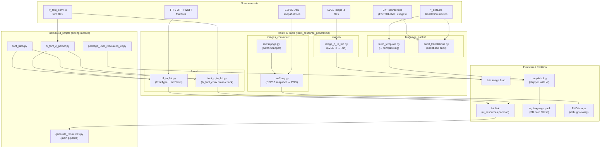
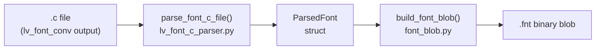
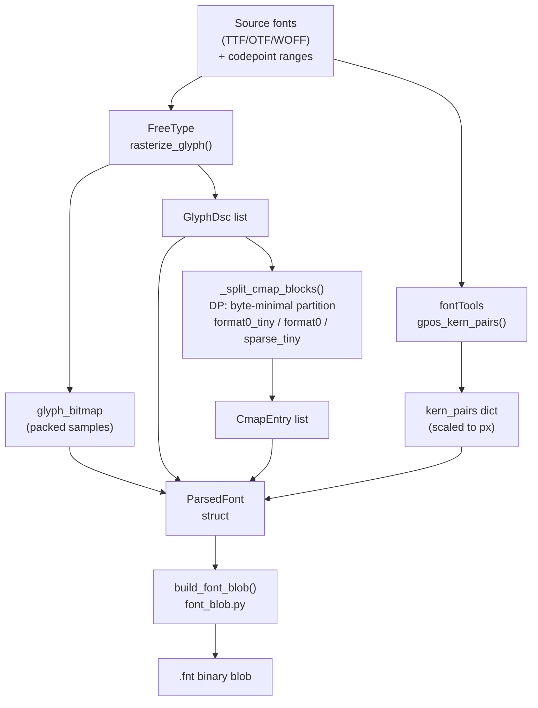
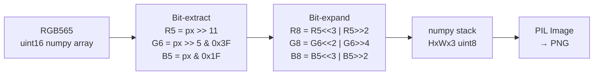
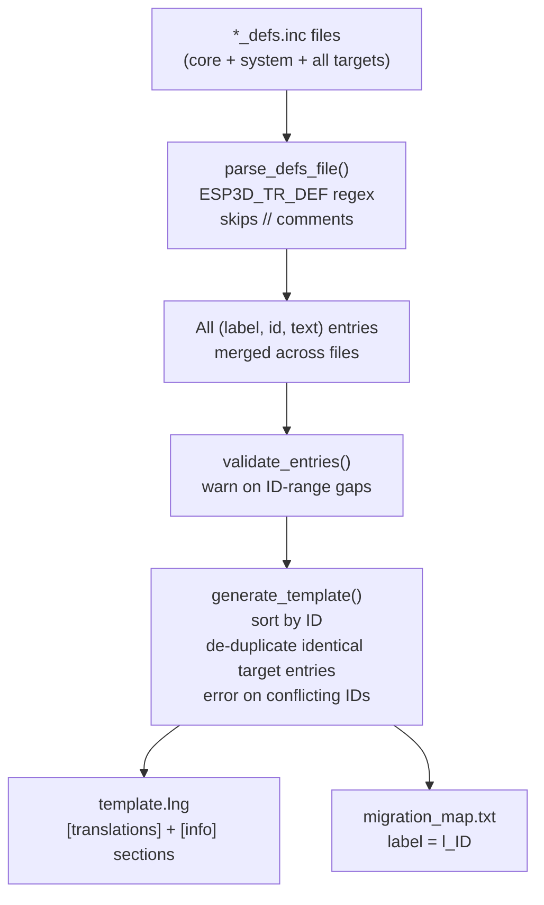
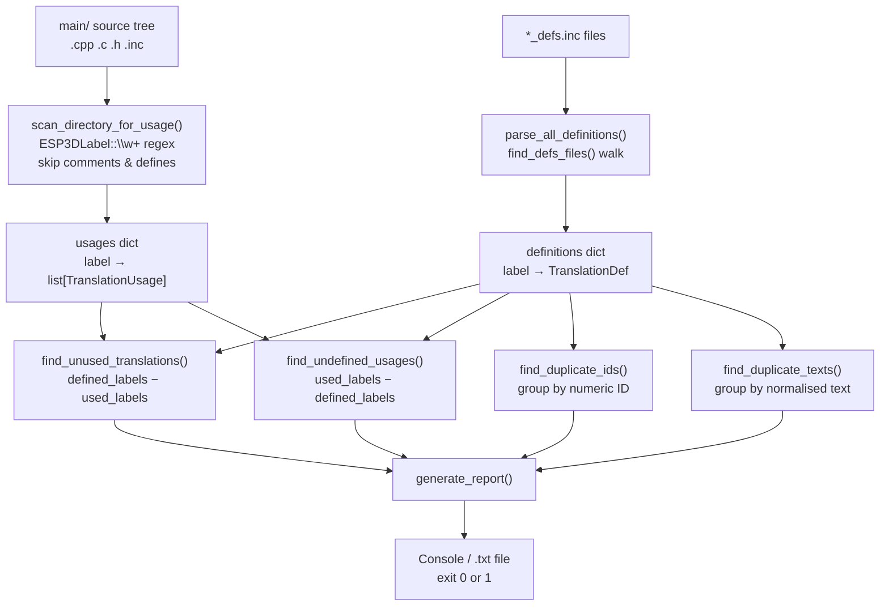
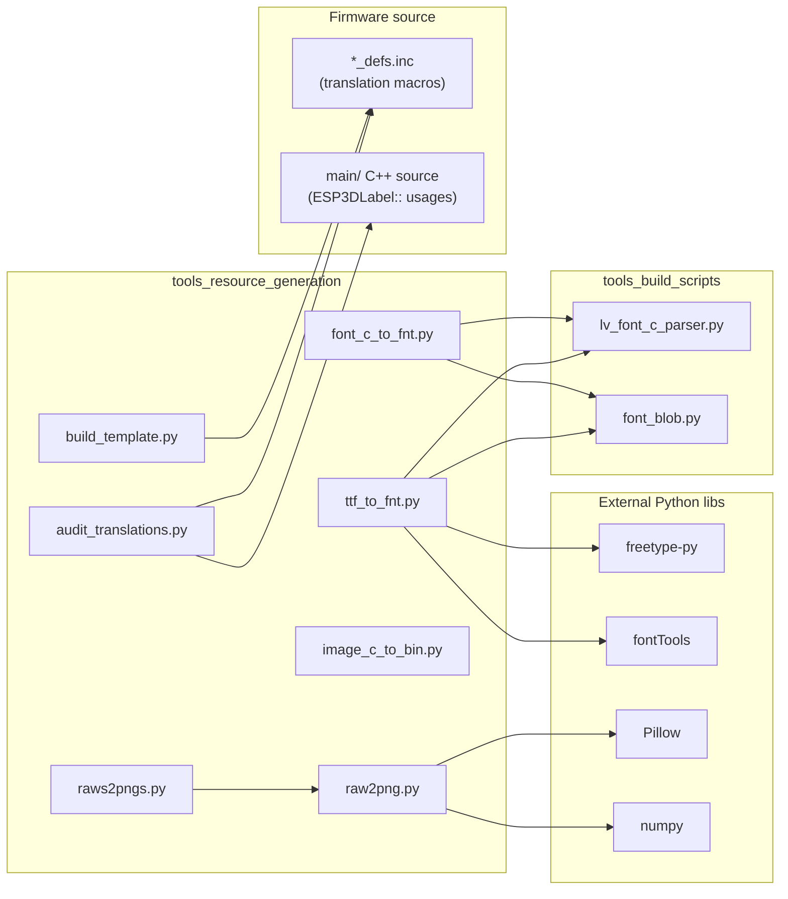
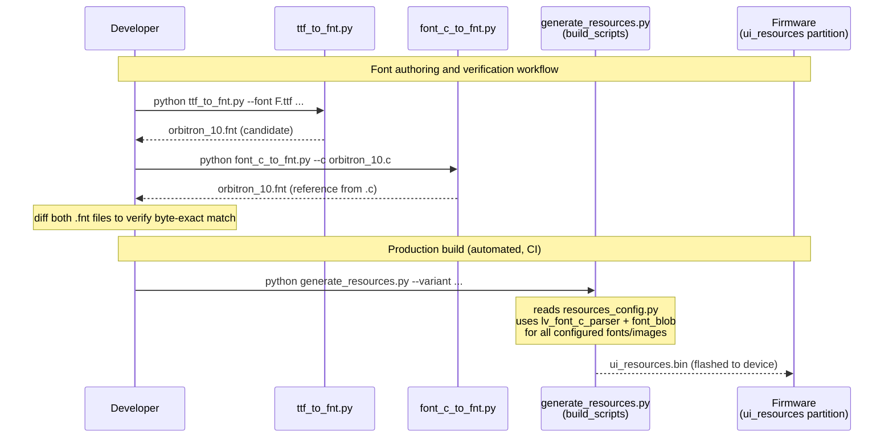
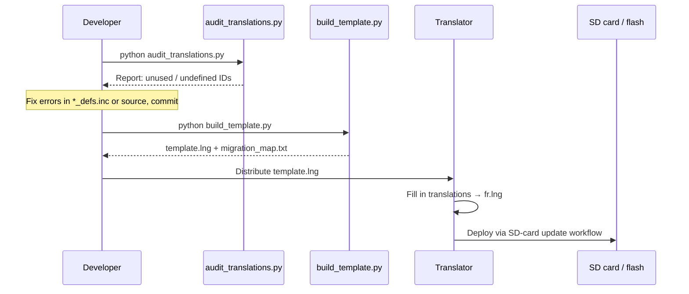

# Tools: Resource Generation

Developer-facing offline tooling for generating, converting, and auditing the
three categories of UI assets consumed by the firmware at runtime: **fonts**,
**images**, and **language packs**.

These scripts run on a host PC, not on the ESP32. They produce binary artefacts
that are either flashed inside the `ui_resources` partition or deployed via the
SD-card update workflow documented in
[`docs/ui_resources/development.md`](https://github.com/luc-github/Pibot-cnc-pendant-firmware/blob/main/docs/ui_resources/development.md).

---

## Module Overview

```
tools/
├── fonts/                        # Font conversion tools
│   ├── font_c_to_fnt.py          # LVGL .c  → .fnt blob (cross-check path)
│   └── ttf_to_fnt.py             # TTF/OTF  → .fnt blob (primary authoring path)
├── images/                       # Image conversion tools
│   └── image_c_to_bin.py         # LVGL image .c → .bin (cross-check path)
├── images_converter/             # Snapshot diagnostic tools
│   ├── raw2png.py                # Single ESP32 .raw snapshot → PNG
│   └── raws2pngs.py              # Batch wrapper around raw2png.py
└── language_packs/               # Localisation tooling
    ├── audit_translations.py     # Detect unused / undefined translation IDs
    └── build_template.py         # Generate template.lng from *_defs.inc
```

Three tool families, three asset kinds:

| Family | Asset kind | Runtime consumer |
|--------|-----------|-----------------|
| `fonts/` | `.fnt` binary blob | `esp3d_resources.cpp` → LVGL font loader |
| `images/` + `images_converter/` | `.bin` image / PNG snapshot | UI icons; screen snapshot debug |
| `language_packs/` | `.lng` / `template.lng` | `ESP3DTranslationService` |

---

## Architecture



---

## Component Groups

### 1. Font Tools (`tools/fonts/`)

Produce `.fnt` binary blobs that are registered in the `ui_resources`
partition and loaded at runtime by `esp3d_resources.cpp`.
See [development.md](https://github.com/luc-github/Pibot-cnc-pendant-firmware/blob/main/docs/ui_resources/development.md) for the blob format specification and
[ui_resources_guide.md](https://github.com/luc-github/Pibot-cnc-pendant-firmware/blob/main/docs/guides/ui_resources_guide.md) for the end-to-end workflow.

Both tools share the same output format via the shared library pair from
[tools_build_scripts.md](tools_build_scripts.md):

| Shared lib | Role |
|------------|------|
| `lv_font_c_parser.py` | Parses `lv_font_conv`-generated `.c` files into a `ParsedFont` struct |
| `font_blob.py` | Serialises a `ParsedFont` into the binary `.fnt` blob |

The tools locate these files automatically: first looking in
`tools/build_scripts/`, then falling back to the same directory (flat
`ui_resources_kit` layout produced by `package_user_resources_kit.py`).

#### `font_c_to_fnt.py` — LVGL C → .fnt

Converts an existing `lv_font_conv`-generated `.c` file **directly** to a
`.fnt` blob without a manifest entry or Node.js toolchain. Its primary use
is as a **cross-check reference** against `ttf_to_fnt.py`.

```bash
python font_c_to_fnt.py --c orbitron_10.c --out orbitron_10.fnt
```

**Process flow:**



#### `ttf_to_fnt.py` — TTF/OTF → .fnt

Pure-Python TTF/OTF/WOFF → `.fnt` converter using **FreeType** for
rasterisation and **fontTools** for GPOS kerning. No Node.js or
`lv_font_conv` required. Supports merging multiple source fonts into a single
output (e.g. Orbitron for text glyphs + FontAwesome for icon glyphs).

```bash
# Single font
python ttf_to_fnt.py --font Orbitron-Bold.ttf --range "32-126,176,192-253" \
    --size 10 --bpp 4 --out orbitron_10.fnt

# Merged: icon subset from a second font in the same .fnt
python ttf_to_fnt.py --size 14 --bpp 4 \
    --font Orbitron-Bold.ttf   --range "32-126,176,192-253" \
    --font FontAwesome.woff    --range "61451,61452,61787" \
    --out orbitron_14.fnt
```

Key implementation details verified byte-exact against `lv_font_conv`:

| Detail | Implementation |
|--------|---------------|
| FreeType load flags | `FT_LOAD_FORCE_AUTOHINT \| FT_LOAD_TARGET_LIGHT` |
| Advance width | `linearHoriAdvance / 65536 * 16` (unhinted, 1/16 px fixed-point) |
| `line_height` / `base_line` | Derived from rendered ink extents, not face metrics |
| `underline_position/thickness` | Design-unit metrics, truncated toward zero |
| Cmap splitting | DP algorithm ported from `lv_font_conv`'s `cmap_build_subtables.js` |
| Kerning source | GPOS PairPos Format 1 & 2 via fontTools (not legacy `kern` table) |
| Glyph packing | Tight rows, byte-aligned glyph start (`stride=1`, `align=1`) |
| Multi-font merging | Earlier `--font` args win on duplicate codepoints; glyph IDs are global, sorted by codepoint |

**Process flow:**



---

### 2. Image Tools (`tools/images/`)

#### `image_c_to_bin.py` — LVGL image .c → .bin

Converts an LVGL `lv_image_dsc_t` `.c` file into the 12-byte header + raw
pixel payload `.bin` that `LVGLImage.py --ofmt BIN` would produce. Use case:
**diff-check** a committed `.c` icon against its source PNG without
re-running the full icon pipeline.

```bash
python image_c_to_bin.py --c back_b.c --out back_b.bin
```

**Binary header layout (12 bytes, little-endian):**

```
Offset  Size  Field
  0       1   magic  = 0x19
  1       1   cf     (color format code, see table below)
  2       2   flags  (u16)
  4       2   w      (u16, pixels)
  6       2   h      (u16, pixels)
  8       2   stride (u16, bytes per row)
 10       2   reserved
 12       ?   raw pixel data (palette + pixels for indexed; pixels only otherwise)
```

Supported `LV_COLOR_FORMAT_<NAME>` values:
`UNKNOWN`, `RAW`, `RAW_ALPHA`, `L8`, `I1`–`I8`, `A1`–`A8`, `ARGB8888`,
`XRGB8888`, `RGB565`, `ARGB8565`, `RGB565A8`, `RGB888`.

---

### 3. Image Converter Tools (`tools/images_converter/`)

These tools deal with **screen snapshots** captured by the firmware at
runtime (triggered through the factory app or debug hooks) and stored on SD
card as `.raw` files. See `gfx_snapshot_begin` / `gfx_snapshot_end` in the
board-specific factory `gfx.c` files for the capture side.

#### `raw2png.py` — Single snapshot converter

`ESP32RawConverter` wraps the full conversion pipeline; `main()` provides the
CLI.

```bash
python raw2png.py screen.raw                   # → screen.png
python raw2png.py screen.raw -o debug.png      # explicit output name
python raw2png.py -d ./screenshots/            # built-in batch mode
```

**ESP32 RAW file format:**

```
Offset  Size  Field
  0       4   Signature: b'E3D\x00'
  4       4   Width   (uint32 LE)
  8       4   Height  (uint32 LE)
 12       4   Format  (uint32 LE): 0 = RGB565, 1 = RGB888
 16       4   Reserved
 20       ?   Pixel data
              RGB565: 2 bytes/pixel  → total = w × h × 2
              RGB888: 4 bytes/pixel  → total = w × h × 4
```

**RGB565 → RGB888 conversion:**



#### `raws2pngs.py` — Batch processor

`BatchRawProcessor` invokes `raw2png.py` as a subprocess for each `.raw` file
found in the configured input directory.

```bash
python raws2pngs.py                            # convert raw/ → png/
python raws2pngs.py --script ../raw2png.py     # custom script path
python raws2pngs.py --list                     # list files, no conversion
python raws2pngs.py --clean                    # remove all PNG output
```

**Expected directory layout:**

```
working_dir/
├── raw/         ← input .raw files (copied from SD card)
│   ├── snap_001.raw
│   └── snap_002.raw
├── png/         ← output PNGs (auto-created)
│   ├── snap_001.png
│   └── snap_002.png
├── raw2png.py
└── raws2pngs.py
```

---

### 4. Language Pack Tools (`tools/language_packs/`)

The firmware's translation system relies on two artefacts:

- **`*_defs.inc` files** — define every `ESP3DLabel` enum value alongside its
  default English text via `ESP3D_TR_DEF(label, id, "text")` macros.
- **`.lng` language pack files** — key-value files (`l_<id>=<translated text>`)
  loaded at runtime by `ESP3DTranslationService`.

For the runtime architecture see `ESP3DTranslationService` in
[Core_Platform_&_Infrastructure.md](Core_Platform_and_Infrastructure.md).

#### Translation ID ranges

| Range | Category | Source file |
|-------|----------|-------------|
| `0 – 499` | Core UI translations | `esp3d_translations_defs.inc` |
| `500 – 999` | CNC system translations | `esp3d_system_translations_defs.inc` |
| `1000+` | Target firmware translations | `esp3d_target_translations_defs.inc` (one per target) |

> **Note on target range:** Multiple target `.inc` files may reuse the same
> `1000`-range IDs with identical label/text because only one CNC target is
> compiled at a time. `build_template.py` merges all targets into the
> template (de-duplicating identical entries, erroring on conflicting ones)
> so a single `.lng` file can serve any firmware build.

#### `build_template.py` — Generate `template.lng`

```bash
cd tools/language_packs
python build_template.py
# → template.lng        (for distribution to translators)
# → migration_map.txt   (label → numeric ID lookup aid)
```

**Process flow:**



**Output `template.lng` structure:**

```ini
[translations]
# Core translations (0-499)
l_0=English
l_1=Settings
...
# System translations (500-999)
l_500=Position
...
# Target translations (1000+)
l_1000=FluidNC
...

[info]
code=<code>
name=<name>
target_slot=<1|2|3>
creator=<creator>
creation_date=<creation_date>
maintainer=<maintainer>
last_update=<last_update>
target_language=<target_language>
target_version=3.0
```

#### `audit_translations.py` — Codebase translation audit

Detects four classes of issues by cross-referencing definition files against
all C++/C/H source files under `main/`:

| Issue class | Description | Exit |
|------------|-------------|------|
| **Unused** | `ESP3D_TR_DEF` entry with no `ESP3DLabel::xxx` in source | 0 (warn) |
| **Undefined** | `ESP3DLabel::xxx` in source but missing from `.inc` | 1 (error) |
| **Duplicate IDs** | Same numeric ID in two different `ESP3D_TR_DEF` entries | 1 (error) |
| **Duplicate texts** | Same default English text in multiple entries (may be intentional) | 0 (info) |

```bash
cd tools/language_packs
python audit_translations.py                        # default paths
python audit_translations.py \
    --main-dir ../../main --defs-dir ../../main/display
python audit_translations.py -o report.txt          # save report
python audit_translations.py -e unused.csv          # export unused IDs to CSV
```

The scanner intentionally skips:
- Lines starting with `//`, `/*`, or `*` (comments)
- Lines starting with `#define` (macro definition sites)
- Labels `unknown_index` and `label` (enum sentinels)
- Lines containing `ESP3D_TR_DEF` (definition sites, not usage sites)

**Audit data-flow:**



---

## Dependency Map



---

## Integration with the Main Resource Pipeline

These tools are **authoring and debugging aids**, not part of the automated
build pipeline. The relationship to the main pipeline in
[tools_build_scripts.md](tools_build_scripts.md):



For language packs:



---

## Quick Reference

### Font tools

```bash
# TTF → .fnt  (primary authoring path; no Node.js required)
python tools/fonts/ttf_to_fnt.py \
    --font Orbitron-Bold.ttf --range "32-126,176,192-253" \
    --size 10 --bpp 4 --out orbitron_10.fnt

# LVGL .c → .fnt  (cross-check / reference, no Node.js required)
python tools/fonts/font_c_to_fnt.py \
    --c resources/fonts/res_320_240/orbitron_10.c \
    --out orbitron_10_ref.fnt
```

### Image tools

```bash
# LVGL image .c → .bin  (cross-check against source PNG)
python tools/images/image_c_to_bin.py --c resources/icons/back_b.c
```

### Snapshot converter

```bash
# Single file
python tools/images_converter/raw2png.py snap_001.raw

# Batch (run from images_converter/; expects a raw/ sub-directory)
python tools/images_converter/raws2pngs.py
```

### Language pack tools

```bash
cd tools/language_packs
python build_template.py                           # generate template.lng
python audit_translations.py                       # audit the whole codebase
python audit_translations.py -o audit_report.txt   # save report to file
python audit_translations.py -e unused.csv         # export unused IDs to CSV
```

---

## Related Documentation

| Document | Topic |
|----------|-------|
| [development.md](https://github.com/luc-github/Pibot-cnc-pendant-firmware/blob/main/docs/ui_resources/development.md) | `.fnt` / `.bin` binary blob format, `ui_resources` partition layout, full build pipeline |
| [ui_resources_guide.md](https://github.com/luc-github/Pibot-cnc-pendant-firmware/blob/main/docs/guides/ui_resources_guide.md) | End-to-end guide: add/modify icons and fonts, regenerate and flash the partition |
| [tools_build_scripts.md](tools_build_scripts.md) | `generate_resources.py`, `resources_config.py`, `package_user_resources_kit.py` |
| [theme_palette.md](https://github.com/luc-github/Pibot-cnc-pendant-firmware/blob/main/docs/ui_resources/theme_palette.md) | Colour token system (separate resource type in the same partition) |
| [ui_style_guide.md](https://github.com/luc-github/Pibot-cnc-pendant-firmware/blob/main/docs/ui_resources/ui_style_guide.md) | LVGL style system; where generated icons and fonts are applied |
| [Core_Platform_&_Infrastructure.md](Core_Platform_and_Infrastructure.md) | `ESP3DTranslationService` runtime (language pack consumer) |
