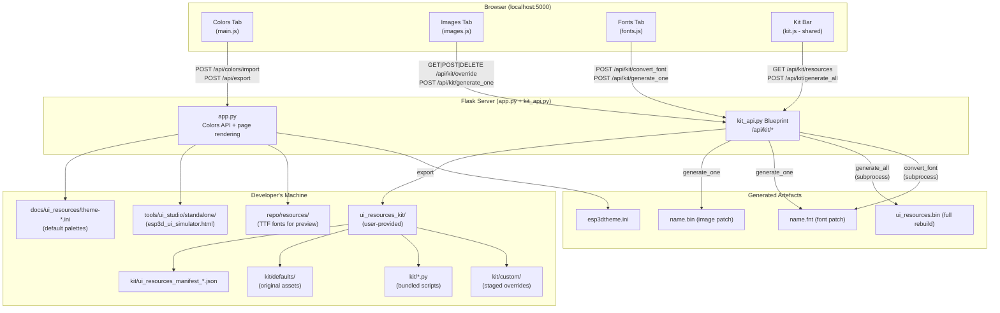
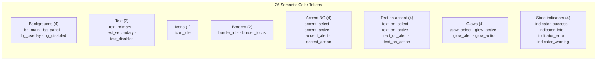
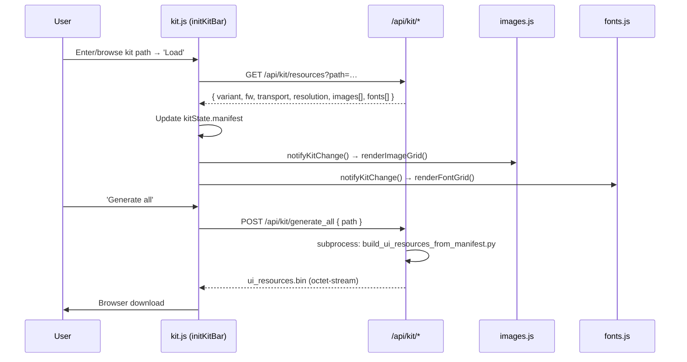
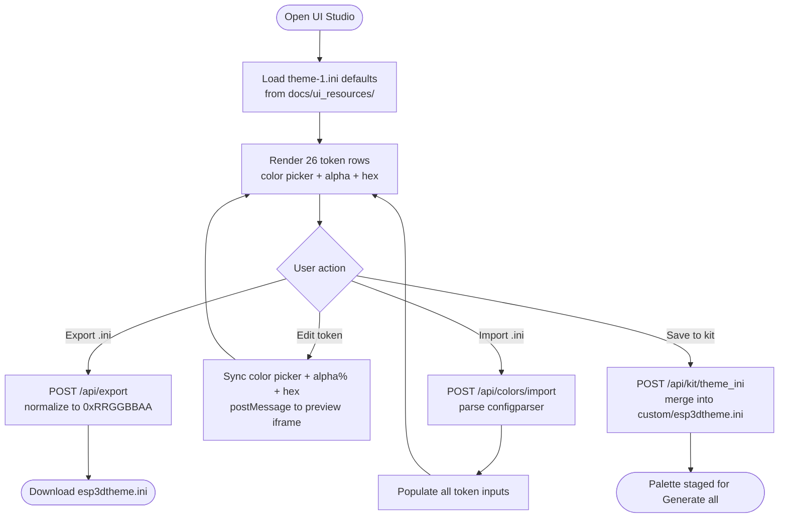
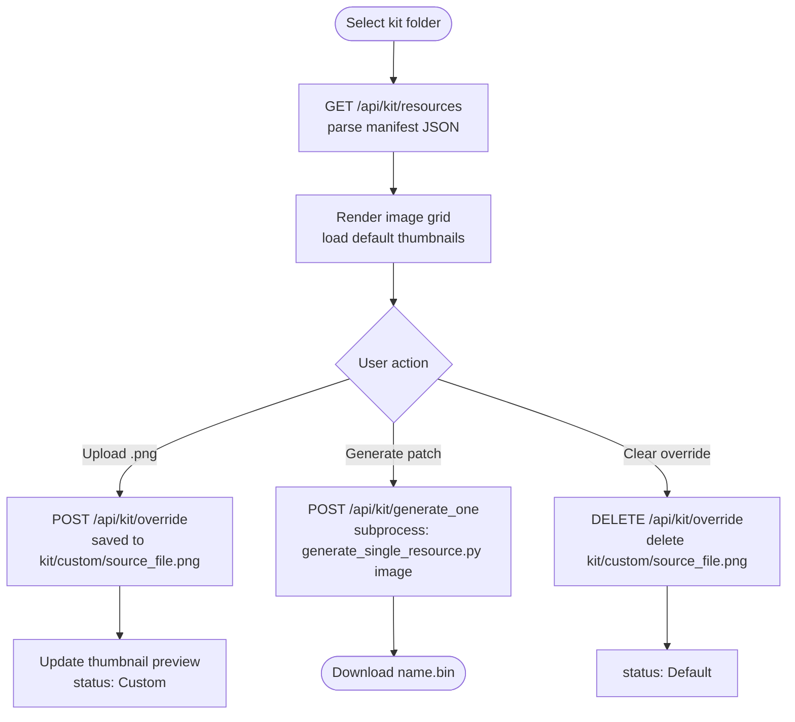
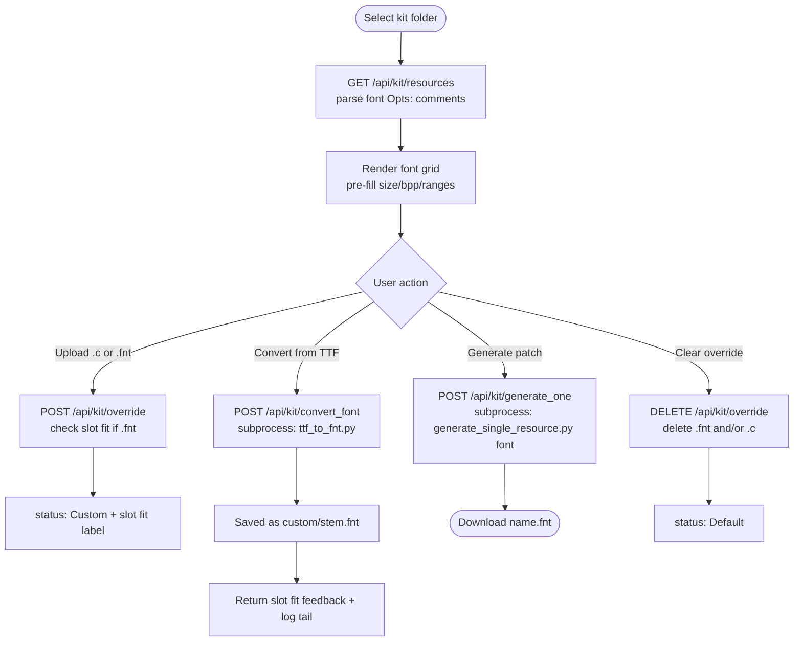
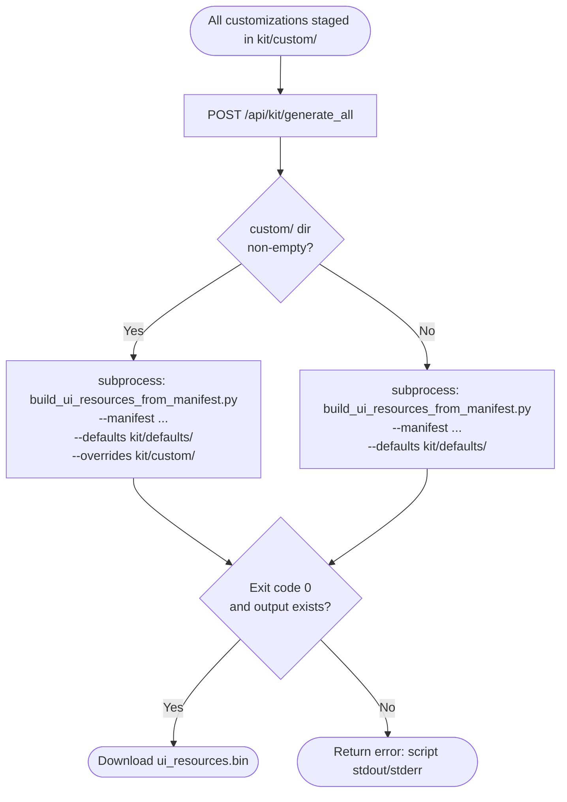
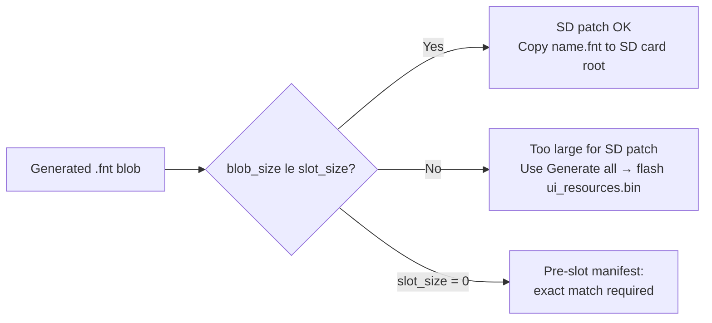
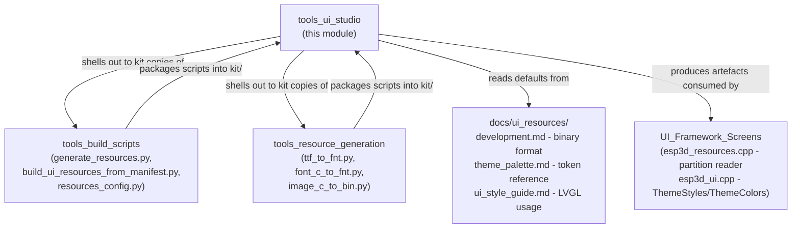

# UI Studio — Developer Customization Tool

`tools/ui_studio/` is a **local Flask web application** that gives developers and end-users a
browser-based GUI to customize the three kinds of UI resources baked into the pendant's
`ui_resources` flash partition: **theme colors**, **images**, and **fonts**.

It runs entirely on the developer's machine — no cloud, no device connection needed. After
editing, it produces the artefacts consumed by the [UI resources pipeline](https://github.com/luc-github/Pibot-cnc-pendant-firmware/blob/main/docs/ui_resources/development.md):

| Output artefact | Where it goes |
|---|---|
| `esp3dtheme.ini` | SD card root → applied at boot; or saved into the kit for full rebuild |
| `<name>.bin` | SD card for individual image patch |
| `<name>.fnt` | SD card for individual font patch |
| `ui_resources.bin` | Flash via USB (full rebuild including all customizations) |

> **Related documentation**
> - [UI Resources Development Reference](https://github.com/luc-github/Pibot-cnc-pendant-firmware/blob/main/docs/ui_resources/development.md) — binary format, partition layout, update mechanisms
> - [Theme Palette Reference](https://github.com/luc-github/Pibot-cnc-pendant-firmware/blob/main/docs/ui_resources/theme_palette.md) — all 26 semantic tokens, per-theme values, RGBA format
> - [UI Style Guide](https://github.com/luc-github/Pibot-cnc-pendant-firmware/blob/main/docs/ui_resources/ui_style_guide.md) — LVGL `ThemeStyles`, `apply*` functions, per-screen inventory
> - [UI Resources Customization (User Doc)](https://github.com/luc-github/Pibot-cnc-pendant-firmware/blob/main/docs/user%20documentation/ui_resources_customization.md) — end-user guide to the SD kit

---

## Architecture Overview



---

## Module Structure

```
tools/ui_studio/
├── app.py                    ← Flask entry point + Colors tab backend
├── kit_api.py                ← Blueprint: Images & Fonts tab backend (/api/kit/*)
├── templates/
│   └── index.html            ← Jinja2 template: three-tab layout
├── static/
│   └── js/
│       ├── main.js           ← Colors tab: token editing, import/export, live preview
│       ├── kit.js            ← Shared: kit path selection, "Generate all" button
│       ├── images.js         ← Images tab: grid rendering, override upload, patch gen
│       └── fonts.js          ← Fonts tab: grid rendering, TTF conversion, patch gen
└── standalone/
    └── esp3d_ui_simulator.html ← Embedded live preview iframe (Colors tab)
```

---

## Component Details

### `app.py` — Main Application + Colors Backend

The Flask application root. Handles:

1. **Page rendering** (`GET /`) — Reads `docs/ui_resources/theme-1.ini` as the default palette,
   passes the 26 token definitions and their default values into the Jinja2 template.

2. **Static asset serving** for the live preview:
   - `GET /preview/<filename>` → `tools/ui_studio/standalone/` (hosts `esp3d_ui_simulator.html`)
   - `GET /resources/<filename>` → `repo/resources/` (the repository's TTF assets referenced by the simulator)

3. **Colors API**:
   - `POST /api/colors/import` — Accepts an uploaded `esp3dtheme.ini`, parses it with
     `configparser`, returns the token dict and detected theme number as JSON.
   - `POST /api/export` — Accepts a JSON body `{ tokens: {...}, theme: 1..4 }`, validates all
     26 tokens, normalizes each to `0xRRGGBBAA` format, and streams back an `esp3dtheme.ini`
     file attachment.

4. **Jinja2 filters**: `csshex` (→ `#rrggbb`) and `alphapct` (→ `0-100`) for template use.

#### Token Groups

The 26 semantic tokens are organized into 8 named groups matching `esp3dtheme.ini.example`:



See [theme_palette.md](https://github.com/luc-github/Pibot-cnc-pendant-firmware/blob/main/docs/ui_resources/theme_palette.md) for the full token reference with per-theme values and design conventions.

---

### `kit_api.py` — Images & Fonts Kit Blueprint

Registered at `/api/kit`. Operates on a **user-provided `ui_resources_kit/` folder** (the
standalone kit shipped alongside each firmware release — see
[development.md](https://github.com/luc-github/Pibot-cnc-pendant-firmware/blob/main/docs/ui_resources/development.md) for the kit packaging process).

The kit folder contract:

| Path | Role |
|---|---|
| `ui_resources_manifest_*.json` | Exactly one manifest (image + font list, dimensions, slot sizes) |
| `defaults/` | Flat directory of default PNG images and lv_font_conv `.c` files |
| `custom/` | Created by the tool; staged overrides (PNG, `.c`, `.fnt`, `esp3dtheme.ini`) |
| `generate_single_resource.py` | Bundled kit script: single resource → patch blob |
| `build_ui_resources_from_manifest.py` | Bundled kit script: full `ui_resources.bin` rebuild |
| `ttf_to_fnt.py` | Bundled kit script: TTF/OTF/WOFF → `.fnt` blob |

> **Design principle**: `kit_api.py` is a thin orchestration wrapper. It stages files and
> shells out to the kit's own bundled scripts for all conversion and validation logic. It
> never duplicates binary-format or font-rendering logic — the kit scripts fail loudly on
> any mismatch, which is surfaced to the user verbatim.

#### Internal Helper Functions

| Helper | Purpose |
|---|---|
| `_resolve_kit(path_str)` | Validate kit folder, locate unique manifest, return `(kit_dir, manifest, manifest_path)` |
| `_entries(manifest, kind)` | Return `manifest["images"]` or `manifest["fonts"]` |
| `_font_fit(entry, blob_size)` | Compute patch-vs-slot size feedback: `patchable` bool + byte sizes |
| `_parse_font_opts(kit_dir, source_file)` | Parse the `Opts:` comment in a default `.c` file to recover original `size`/`bpp`/sources |
| `_extra_bundled_fonts(defaults_dir, used)` | Discover additional font files in `defaults/` not already used by a font entry (e.g. icon fonts) |
| `_font_override_paths(custom_dir, source_file)` | Return `[stem.fnt, source_file]` — the `.fnt` wins when both exist |
| `_remember_kit_path(kit_dir)` | Persist last kit path to `.work/last_kit_path.txt` |
| `_script_error(result)` | Extract `ERROR` lines from subprocess output for readable error messages |

---

### `static/js/kit.js` — Shared Kit State

Defines the shared singleton `kitState = { path, manifest }` and the
`kitListeners` subscriber list used by both `images.js` and `fonts.js`.



**Startup behavior**: On page load, `initKitBar()` calls `GET /api/kit/last`. If a remembered
path exists it auto-loads silently (errors are logged, not alerted — the remembered path may
have been deleted or moved since last session).

---

### `static/js/main.js` — Colors Tab

Manages the 26-token color editor. Three synchronized controls per token:

```
[color picker]  ↔  [alpha % input]  ↔  [hex input (0xRRGGBBAA)]
                                              ↑ source of truth on export
```

#### Color Format Conversion Functions

| Function | Purpose |
|---|---|
| `iniHexToCssHex(iniHex)` | `0xRRGGBB[AA]` → `#rrggbb` for `<input type=color>` |
| `cssHexToIniHex(cssHex)` | `#rrggbb` → `0xRRGGBB` (RGB part only) |
| `alphaPercentFromIniHex(iniHex)` | Extract alpha byte as 0–100% |
| `setHexAlphaPercent(hexInput, percent)` | Overwrite alpha byte in a hex input |
| `buildIniHex(rgb6, alpha)` | Combine RGB + alpha byte → `0xRRGGBBAA` |
| `parseIniHex(iniHex)` | Parse to `{ rgb, alpha }` — tolerates missing alpha (treats as FF) |

#### Live Preview

An `<iframe>` embeds `esp3d_ui_simulator.html` from `tools/ui_studio/standalone/`. Token
changes are pushed into the iframe via `postMessage`:

```javascript
previewFrame.contentWindow.postMessage({ type: "esp3d-preview-update", tokens }, "*");
```

The iframe's script listens for this message and redraws the simulated pendant UI using the
supplied palette — no page reload required.

#### Kit Integration (Save to Kit)

The "Save to kit" button (`save-theme-kit-btn`) calls `POST /api/kit/theme_ini` to stage the
current palette as `custom/esp3dtheme.ini` inside the loaded kit folder. This file is then
picked up automatically by "Generate all" and baked into `ui_resources.bin`.

Multiple themes can be accumulated: each `POST` merges the new `[themeN]` section into the
existing file, so themes 1–4 can each be customized in separate editing sessions.

---

### `static/js/images.js` — Images Tab

Renders a card grid, one card per image entry in `kitState.manifest.images`.

Each card shows:
- A thumbnail loaded from `GET /api/kit/default_file?kind=image&source_file=…`
- Image name, dimensions, and format
- A file upload input (`.png` only)
- Override status (`Default` / `Custom`)
- **"Generate patch (.bin)"** — invokes `POST /api/kit/generate_one` and triggers a browser
  download of the resulting `.bin` patch file

On upload, the preview thumbnail is immediately replaced using `URL.createObjectURL()` so the
user sees the change before generating the patch.

---

### `static/js/fonts.js` — Fonts Tab

Renders a card grid, one card per font entry in `kitState.manifest.fonts`. More complex than
images because fonts can be supplied in three forms:

1. **lv_font_conv `.c` replacement** — upload the raw C file produced by `lv_font_conv`
2. **Pre-serialized `.fnt` blob** — upload a `.fnt` file from `ttf_to_fnt.py` / `font_c_to_fnt.py`
3. **Convert from TTF/WOFF/OTF in-browser** — fill in the "Convert from TTF/WOFF…" panel and click **Convert & stage**

#### Slot Size Feedback (`fontFitLabel`)

For patch-via-SD, the generated `.fnt` blob must fit inside the slot reserved in the
**already-flashed** partition. If it doesn't fit, the patch cannot be applied via SD card —
only a full `ui_resources.bin` rebuild (via "Generate all") will work, as it recomputes slot
sizes. The `fontFitLabel()` function surfaces this distinction visually:

```
orbitron_14 — 18.3 KB / 24.0 KB slot (SD patch OK)
orbitron_14 — 26.1 KB exceeds the 24.0 KB slot: use Generate all (full rebuild)
```

#### TTF Conversion Panel

Pre-filled from the original generation parameters (`Opts:` comment in the default `.c`),
the panel exposes:

- **Size (px)** — free to adjust; the tool will report blob size vs. slot after conversion
- **bpp** — 1 / 2 / 4 / 8
- Up to **2 source rows**, each with:
  - A "Keep the bundled `<font>`" checkbox (for fonts already shipping in `defaults/`)
  - A file upload for a replacement TTF/OTF/WOFF
  - A Unicode ranges field (e.g. `32-126,176,192-253`)

An optional second row is offered for any additional font files discovered in `defaults/`
(e.g. an icon font), enabling users to merge symbol glyphs into any font.

---

## Data Flow Diagrams

### Colors Tab: Edit → Export / Apply



### Images Tab: Override → Patch



### Fonts Tab: Convert → Patch



### Full Rebuild Flow



---

## REST API Reference

### Colors Endpoints (app.py)

| Method | Path | Request | Response |
|---|---|---|---|
| `GET` | `/` | — | HTML page (index.html with token defaults) |
| `GET` | `/preview/<filename>` | — | Static file from `standalone/` |
| `GET` | `/resources/<filename>` | — | Static file from repo `resources/` |
| `POST` | `/api/colors/import` | multipart `file` (`.ini`) | `{ tokens: {…}, theme: 1..4 }` |
| `POST` | `/api/export` | `{ tokens: {…}, theme: 1..4 }` | `esp3dtheme.ini` attachment |

### Kit Endpoints (kit_api.py — prefix `/api/kit`)

| Method | Path | Request | Response |
|---|---|---|---|
| `GET` | `/last` | — | `{ path: string\|null }` |
| `POST` | `/browse` | — | `{ path: string\|null }` (native OS folder picker) |
| `GET` | `/resources?path=…` | — | `{ variant, fw, transport, resolution, images[], fonts[] }` |
| `GET` | `/default_file?path=…&kind=…&source_file=…` | — | Raw file (PNG or `.c` text) |
| `POST` | `/override` | multipart `path`, `kind`, `source_file`, `file` | `{ ok, fit? }` |
| `DELETE` | `/override?path=…&source_file=…` | — | `{ ok }` |
| `POST` | `/generate_one` | `{ path, kind, name }` | `.bin` or `.fnt` attachment |
| `POST` | `/convert_font` | multipart `path`, `source_file`, `size`, `bpp`, `file0/1`, `ranges0/1`, `default_font0/1` | `{ ok, stored_as, fit, log[] }` |
| `GET` | `/theme_ini?path=…` | — | `{ sections: ["themeN", …] }` |
| `POST` | `/theme_ini` | `{ path, theme: 1..4, tokens: {…} }` | `{ ok, sections }` |
| `DELETE` | `/theme_ini?path=…` | — | `{ ok }` |
| `POST` | `/generate_all` | `{ path }` | `ui_resources.bin` attachment |

---

## Color Value Format

All color values use the `0xRRGGBBAA` format defined in [theme_palette.md](https://github.com/luc-github/Pibot-cnc-pendant-firmware/blob/main/docs/ui_resources/theme_palette.md):

```
0xRRGGBBAA
  ^^^^^^^^
  ||||||||
  ||||++++── Alpha: last byte = LVGL opacity (0x00 = transparent, 0xFF = opaque)
  ++++────── RGB: standard 6-digit hex
```

The tool's color inputs (`<input type=color>`) only expose the RGB portion. A separate
alpha percentage slider controls the `AA` byte. The `hex` input accepts the full
`0xRRGGBBAA` string and is the single source of truth used on export.

**Conversion chain** (bidirectional):

```
<input type=color>  "#3ca0ff"
       ↕  cssHexToIniHex / iniHexToCssHex
hex input           "0x3CA0FFCC"
       ↕  alphaPercentFromIniHex / setHexAlphaPercent
alpha input         "80"  (percent)
```

---

## Font Slot Size and Patch Compatibility

Individual SD patches are applied to an **already-flashed** `ui_resources.bin` whose slot
sizes are fixed. A font `.fnt` blob that exceeds the slot reserved for it cannot be applied
as a patch — but it is still valid for a full rebuild (where slots are recomputed from actual
sizes).



The `slot_size` field comes from the manifest JSON. A value of `0` means the kit was built
before slot-based patchability was introduced; in that case, the blob must exactly match the
stored `data_size`.

---

## Running UI Studio

```bash
# From the repo root
cd tools/ui_studio
python app.py
# Serving on http://127.0.0.1:5000
```

**Dependencies**: Flask (server), tkinter (optional — native OS folder picker for the Images/Fonts kit bar).

For font conversion via the Fonts tab, the kit's `requirements_font_tools.txt` dependencies
must also be installed in this Python environment (`freetype-py`, `fonttools`). No Node.js
or `lv_font_conv` is needed.

---

## Relationship to Related Modules



The scripts bundled inside each `ui_resources_kit/` are copies (packaged at kit-build time
by `package_user_resources_kit.py` in [tools_build_scripts](tools_build_scripts.md)) of the
repo's `tools/build_scripts/` and `tools/fonts|images/` scripts. UI Studio always calls the
**kit's own copies**, never the repo's originals, so the tool remains self-contained and
works without a full repo clone on the end-user's machine.

---

## Key Design Decisions

| Decision | Rationale |
|---|---|
| Local Flask server (not a desktop app) | Works on any OS without a native GUI framework; the browser provides a rich UI with no extra desktop dependencies |
| Kit-centric for Images/Fonts | The kit resolves all variant-specific paths and includes all scripts; UI Studio needs no knowledge of board configs or build systems |
| `custom/` lives inside the user's kit dir | Customizations persist across sessions and are visible/manageable outside the tool; no hidden app state |
| Subprocess for all conversion | Avoids duplicating binary-format or font-rendering logic; errors from kit scripts are surfaced verbatim |
| Colors tab reads repo `docs/ui_resources/` directly | The repo defaults are canonical; no duplication in the tool itself |
| `postMessage` for live preview | The iframe loads the same simulator HTML used for design validation; token changes are pushed without a page reload |
| `.fnt` override wins over `.c` | Consistent with `build_ui_resources_from_manifest.py`; a pre-serialized blob skips re-parsing the C source, matching the flashing pipeline's own precedence rule |
| `theme_ini` merges sections | Lets the user customize themes 1–4 across separate editing sessions into a single `custom/esp3dtheme.ini` that "Generate all" will pick up |
