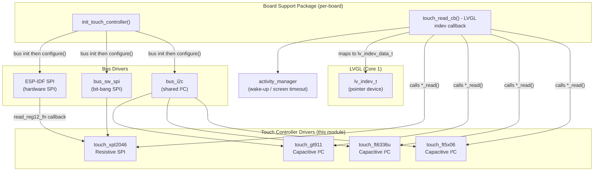
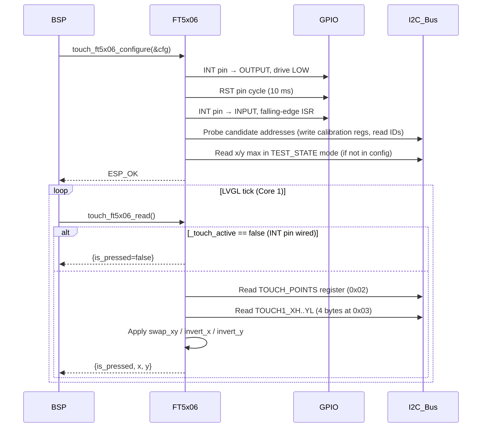
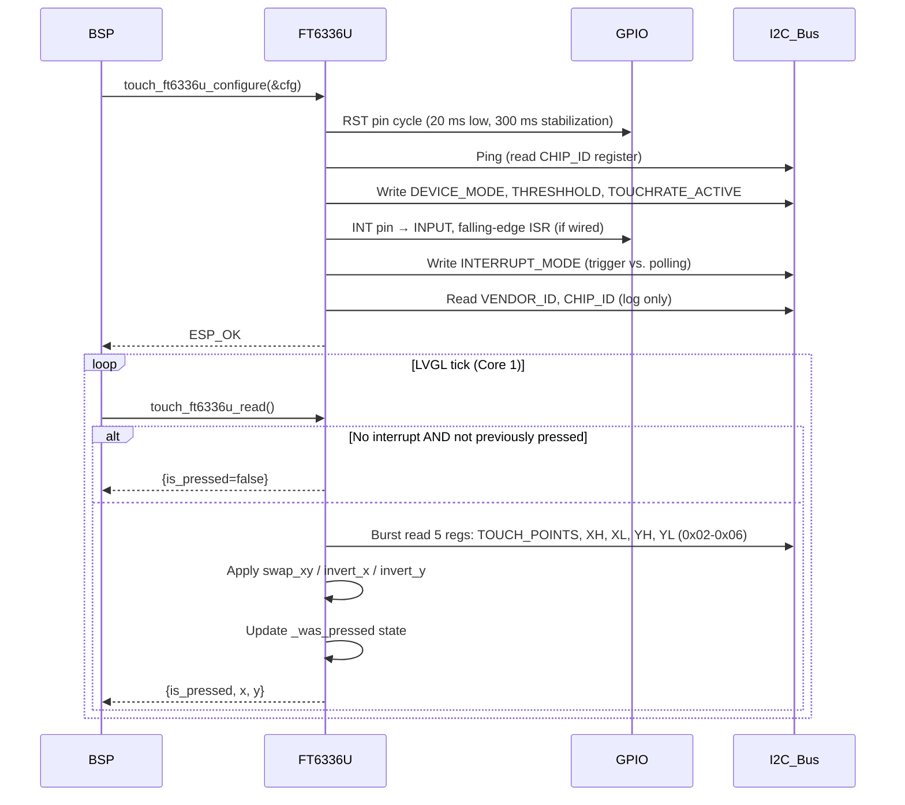
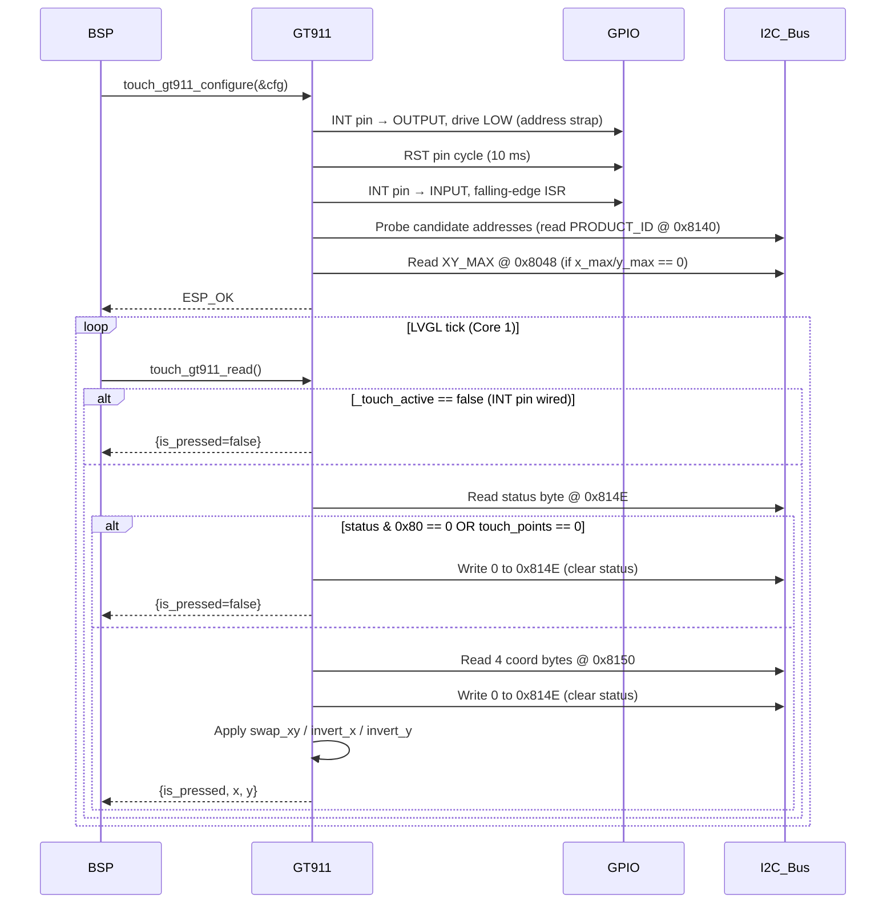
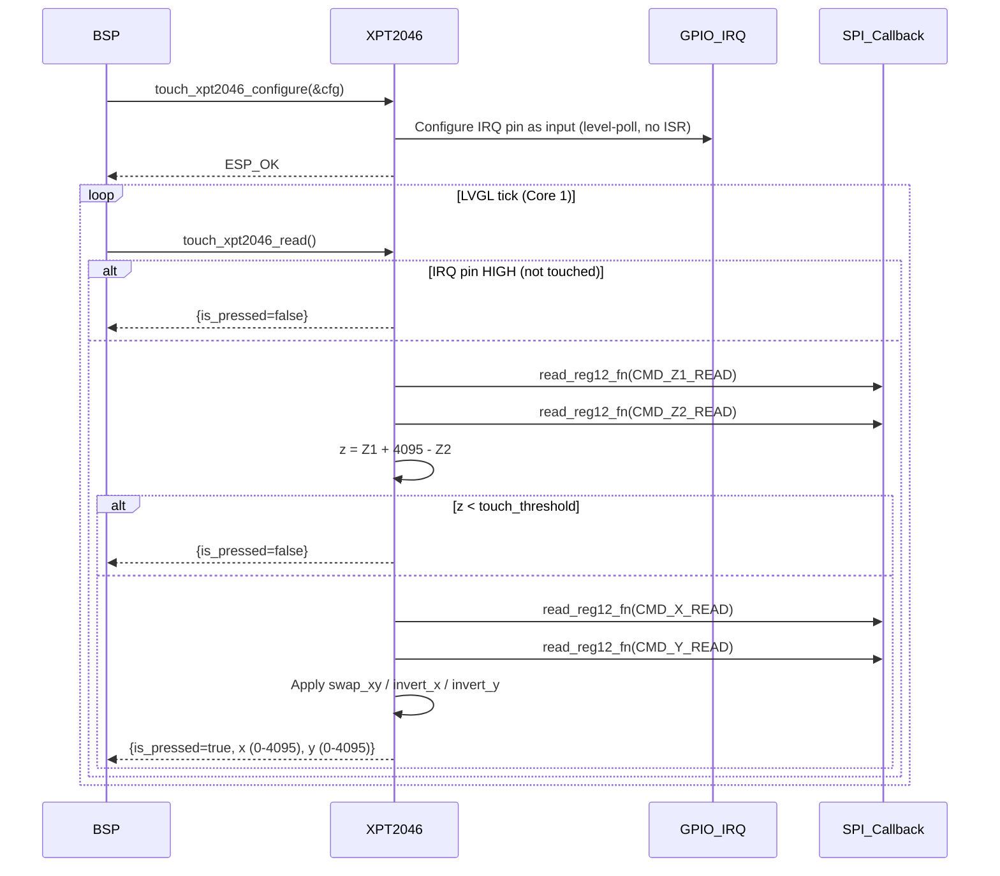
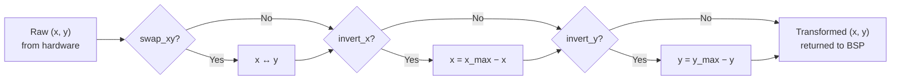
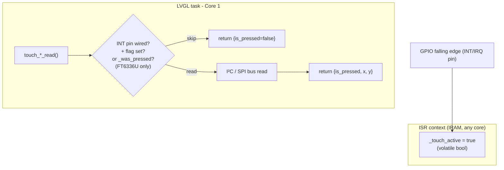

# Touch Controllers

The `touch_controllers` module provides a unified set of low-level hardware drivers for all touchscreen controllers used across the supported board SKUs. Each driver is self-contained, statically allocated, and exposes a consistent C API so that the board-level BSP can call it the same way regardless of the underlying chip.

Four controllers are supported:

| Driver | Technology | Bus | Boards |
|---|---|---|---|
| **FT5x06** | Capacitive (I²C) | I²C | `esp32s3_hmi43v3`, `esp32s3_zx3d50ce02s_usrc_4832` |
| **FT6336U** | Capacitive (I²C) | I²C | `pibot_pendant_v1_0` |
| **GT911** | Capacitive (I²C) | I²C | `esp32_3248s035c`, `esp32s3_4827s043c`, `esp32s3_8048s043c`, `esp32s3_8048s050c`, `esp32s3_8048s070c`, `esp32s3_bzm_tft35_gt911`, `esp32s3_8048_touch_lcd_7` |
| **XPT2046** | Resistive (SPI) | SPI (HW or SW) | `esp32_2432s028r`, `esp32_3248s035r` |

---

## Architecture



The drivers sit between the raw bus layer and LVGL. The BSP owns the bus (I²C or SPI) and the LVGL input-device registration; the driver owns the chip-level protocol, GPIO interrupt wiring, and coordinate transforms.

---

## Source Layout

```
hardware/common/drivers/
├── touch_ft5x06/
│   ├── touch_ft5x06.c          # Driver implementation
│   ├── touch_ft5x06.h          # Public header
│   └── touch_ft5x06_config.h   # touch_ft5x06_config_t / touch_ft5x06_data_t
├── touch_ft6336u/
│   ├── touch_ft6336u.c
│   ├── touch_ft6336u.h
│   └── touch_ft6336u_config.h
├── touch_gt911/
│   ├── touch_gt911.c
│   ├── touch_gt911.h
│   └── touch_gt911_config.h
└── touch_xpt2046/
    ├── touch_xpt2046.c
    ├── touch_xpt2046.h
    └── touch_xpt2046_config.h

boards/<board>/components/bsp/
├── board_init.c                # init_touch_controller(), touch_read_cb()
└── touch_xpt2046_def.h         # Board-specific SPI read callback (XPT2046 boards only)
```

---

## Unified API

All four drivers implement the same conceptual API. Types are driver-prefixed but structurally identical.

### Configuration

```c
// Configure and initialize the controller.
// Must be called once after the underlying bus is up.
// Returns ESP_OK on success, ESP_ERR_* otherwise.
esp_err_t touch_ft5x06_configure (const touch_ft5x06_config_t  *config);
esp_err_t touch_ft6336u_configure(const touch_ft6336u_config_t *config);
esp_err_t touch_gt911_configure  (const touch_gt911_config_t   *config);
esp_err_t touch_xpt2046_configure(const touch_xpt2046_config_t *config);
```

### Read (called every LVGL tick from `touch_read_cb`)

```c
touch_ft5x06_data_t  touch_ft5x06_read (void);
touch_ft6336u_data_t touch_ft6336u_read(void);
touch_gt911_data_t   touch_gt911_read  (void);
touch_xpt2046_data_t touch_xpt2046_read(void);
```

All return the same logical structure:

```c
typedef struct {
    bool    is_pressed; // true when a touch is detected
    int16_t x;          // X coordinate (after transforms), -1 when not pressed
    int16_t y;          // Y coordinate (after transforms), -1 when not pressed
} touch_<driver>_data_t;
```

### Deinitialization

```c
void touch_ft5x06_deinit (void);
void touch_ft6336u_deinit(void);
void touch_gt911_deinit  (void);
void touch_xpt2046_deinit(void);
```

Removes the GPIO ISR handler (where applicable) and clears the initialized state. The bus itself is not torn down — that remains the BSP's responsibility.

### Accessors

```c
uint16_t touch_<driver>_get_x_max(void);
uint16_t touch_<driver>_get_y_max(void);
```

Return the effective touch-resolution limits **after** any `swap_xy` transform. Used by the BSP when scaling touch coordinates to display pixel coordinates.

---

## Configuration Structures

### Common fields (all I²C drivers)

| Field | Type | Description |
|---|---|---|
| `i2c_port` | `i2c_port_t` | ESP-IDF I²C port number |
| `i2c_clk_speed` | `int` | I²C clock frequency in Hz |
| `rst_pin` | `int8_t` | GPIO for hardware reset, `-1` if not wired |
| `int_pin` | `int8_t` | GPIO for interrupt, `-1` if not wired |
| `swap_xy` | `bool` | Swap X ↔ Y before returning data |
| `invert_x` | `bool` | Invert X axis (`x_max − x`) |
| `invert_y` | `bool` | Invert Y axis (`y_max − y`) |
| `x_max` | `uint16_t` | Touch resolution width; `0` = read from device |
| `y_max` | `uint16_t` | Touch resolution height; `0` = read from device |

### Driver-specific fields

#### `touch_ft5x06_config_t` and `touch_gt911_config_t`

```c
uint8_t i2c_addr[3];  // Candidate I²C addresses, 0-terminated
```

Both controllers can be factory-strapped to different I²C addresses. The driver probes each candidate in order and uses the first one that responds.

#### `touch_ft6336u_config_t`

```c
uint8_t i2c_addr;     // Single fixed I²C address
```

#### `touch_xpt2046_config_t`

The XPT2046 is resistive and SPI-based, so its configuration differs significantly:

```c
typedef struct {
    int8_t irq_pin;                              // IRQ pin, -1 if not wired
    touch_xpt2046_read_reg12_fn_t read_reg12_fn; // Board SPI read callback
    uint16_t touch_threshold;                    // Pressure threshold (Z1+4095-Z2)
    bool swap_xy;
    bool invert_x;
    bool invert_y;
    uint16_t x_max;
    uint16_t y_max;
} touch_xpt2046_config_t;
```

The `read_reg12_fn` callback decouples the driver from the SPI bus ownership: on most boards the XPT2046 shares the display's SPI bus, so the transaction must be issued by board-level code. The callback performs a 16-bit SPI transfer and returns the 12-bit ADC result.

---

## Per-Driver Details

### FT5x06 (Capacitive, I²C, 8-bit register addresses)



**Interrupt strategy:** ISR sets `_touch_active = true` (IRAM-safe, volatile). `read()` skips the I²C transaction when the flag is clear and an INT pin is wired. The flag is cleared at the start of each read cycle.

**Address probing:** up to three candidate addresses are tried in order. The driver writes FT5x06 vendor threshold registers during probing; the first address that acknowledges all writes is adopted.

**Auto-detection of limits:** if `x_max` or `y_max` is `0` in the config, the driver switches the chip into `TEST_STATE` (register `0x00 = 0x40`), reads the hardware limits from registers `0x0C–0x0F`, then returns to `OP_STATE`.

---

### FT6336U (Capacitive, I²C, 8-bit register addresses)



**Hybrid interrupt + polling strategy:** the FT6336U does not reliably fire a release interrupt. A `_was_pressed` flag ensures registers are re-read every cycle until `touch_points == 0` is confirmed, providing a reliable release transition. When no INT pin is wired, the chip is configured in polling mode (`INTERRUPT_MODE = 0`) and all reads are unconditional.

---

### GT911 (Capacitive, I²C, 16-bit register addresses)



**Address strapping:** the GT911 reads the INT pin level during its reset sequence to choose between I²C addresses `0x5D` and `0x14`. Driving INT LOW before releasing RST straps the device to `0x5D`. After reset, the pin is reconfigured as a floating interrupt input. The driver then probes both candidates to confirm which address was selected.

**Status register handshake:** after each read, register `0x814E` must be written `0x00` to acknowledge the data and re-arm the interrupt. Skipping this causes the controller to stall at the last reported coordinates.

---

### XPT2046 (Resistive, SPI)



**SPI ownership:** the XPT2046 shares the display SPI bus on all known boards. The driver cannot own the bus because the SPI host must be time-multiplexed. Instead, the board defines a `touch_xpt2046_spi_read_reg12` inline function in `touch_xpt2046_def.h` and passes it as `read_reg12_fn` in the config.

**Two SPI strategies across boards:**
- `esp32_2432s028r`: the XPT2046 is on its own bit-banged (software) SPI bus — the callback delegates to `bus_sw_spi_read_reg16`.
- `esp32_3248s035r`: the XPT2046 shares a hardware SPI bus with the display — the callback issues a raw `spi_device_transmit`.

**Raw ADC coordinates:** unlike the I²C drivers, XPT2046 returns raw 12-bit ADC values (0–4095). The BSP's `touch_read_cb` applies a linear calibration mapping (`TOUCH_CALIBRATION_X_MIN/MAX`) to convert these to display pixel coordinates.

---

## Coordinate Transform Pipeline

All four drivers apply the same optional transform chain internally, in this order:



These transforms handle physical panel mounting orientation. The BSP may then apply a second linear scaling step when the touch controller's native resolution differs from the display's pixel resolution (e.g. `esp32s3_4827s043c` scales GT911 native touch coordinates to display pixel coordinates using `get_x_max()` / `get_y_max()`).

---

## BSP Integration Pattern

Every board follows the same two-function pattern regardless of which driver is selected.

### `init_touch_controller()` — called once from `board_init()`

```c
static esp_err_t init_touch_controller(void) {
    // 1. Initialize the bus (I²C or SPI) — owned by the BSP
    esp_err_t ret = bus_i2c_init(I2C_PORT, SDA_PIN, SCL_PIN, I2C_FREQ_HZ);
    if (ret != ESP_OK) { return ret; }

    // 2. Call the driver configure with a board-specific default config struct
    ret = touch_gt911_configure(&touch_gt911_default_config);
    if (ret != ESP_OK) { return ret; }

    return ESP_OK;
}
```

> **Note:** `esp32s3_hmi43v3` is an exception — its FT5x06 shares an I²C bus that is initialized elsewhere in board_init, so `init_touch_controller()` calls `touch_ft5x06_configure()` directly without calling `bus_i2c_init`.

### `touch_read_cb()` — registered as the LVGL pointer input device callback

```c
static void touch_read_cb(lv_indev_t *indev, lv_indev_data_t *data) {
    static bool last_pressed_state        = false;
    static bool touch_consumed_for_wakeup = false;

    touch_<driver>_data_t touch_data = touch_<driver>_read();

    if (touch_data.is_pressed) {
        if (!last_pressed_state) {
            // Transition: released → pressed
            if (activity_process_event()) {          // Wake-up gate
                data->state   = LV_INDEV_STATE_PRESSED;
                data->point.x = touch_data.x;       // (scaled if needed)
                data->point.y = touch_data.y;
                touch_consumed_for_wakeup = false;
            } else {
                touch_consumed_for_wakeup = true;    // Suppress wake-up press
                data->state = LV_INDEV_STATE_RELEASED;
            }
            last_pressed_state = true;
        } else {
            // Sustain press
            data->state   = touch_consumed_for_wakeup
                                ? LV_INDEV_STATE_RELEASED
                                : LV_INDEV_STATE_PRESSED;
            data->point.x = touch_data.x;
            data->point.y = touch_data.y;
        }
    } else {
        if (last_pressed_state) {
            // Transition: pressed → released
            if (!touch_consumed_for_wakeup) {
                activity_process_event();            // Extend screen-on timer
            }
            last_pressed_state        = false;
            touch_consumed_for_wakeup = false;
        }
        data->state = LV_INDEV_STATE_RELEASED;
    }
}
```

**Wake-up consumption:** the first touch press after the screen has timed out is intercepted by `activity_process_event()`, which wakes the display and returns `false`. The BSP masks that press from LVGL so a tap that only wakes the screen does not also activate a UI element underneath the finger.

This callback runs on **LVGL's task (Core 1)**. The driver's `read()` functions are therefore always called from Core 1 and must not block for more than the I²C timeout (50 ms maximum). All ISR handlers are placed in IRAM (`IRAM_ATTR`) and only set a volatile flag — they never touch I²C or SPI directly.

---

## Interrupt Handling Summary



The **XPT2046** has no ISR: the IRQ pin is polled synchronously with `gpio_get_level()` inside `read()` because resistive controllers do not latch a state register — the raw ADC must always be read while the finger is still pressing.

---

## Memory Footprint

All driver state is **statically allocated** — no `malloc` or `new` is used anywhere in this module. Each driver holds:

- One copy of its `config_t` struct
- A handful of scalar state variables (`_is_initialized`, `_i2c_addr`, `_x_max`, `_y_max`, `_touch_active`, and for FT6336U `_was_pressed`)

Only one driver is compiled into any given firmware image (the BSP for each board includes exactly one touch driver component), so RAM consumption is that of a single driver — typically under 64 bytes of `.bss`.

---

## Board-to-Driver Matrix

| Board | Driver | Bus | I²C Address(es) |
|---|---|---|---|
| `esp32_2432s028r` | XPT2046 | Software SPI | — |
| `esp32_3248s035c` | GT911 | I²C | `0x5D`, `0x14` (probed) |
| `esp32_3248s035r` | XPT2046 | Hardware SPI | — |
| `esp32s3_4827s043c` | GT911 | I²C | `0x5D`, `0x14` (probed) |
| `esp32s3_8048_touch_lcd_7` | GT911 | I²C | `0x5D`, `0x14` (probed) |
| `esp32s3_8048s043c` | GT911 | I²C | `0x5D`, `0x14` (probed) |
| `esp32s3_8048s050c` | GT911 | I²C | `0x5D`, `0x14` (probed) |
| `esp32s3_8048s070c` | GT911 | I²C | `0x5D`, `0x14` (probed) |
| `esp32s3_bzm_tft35_gt911` | GT911 | I²C | `0x5D`, `0x14` (probed) |
| `esp32s3_hmi43v3` | FT5x06 | I²C | `0x38`, `0x3B` (probed) |
| `esp32s3_zx3d50ce02s_usrc_4832` | FT5x06 | I²C | `0x38`, `0x3B` (probed) |
| `pibot_pendant_v1_0` | FT6336U | I²C | `0x38` (fixed) |

---

## Related Documentation

- **BSP board initialization** (bus init, LVGL registration, display flush): [bsp_board_initialization.md](bsp_board_initialization.md)
- **Bus drivers** (I²C, software SPI): [bus_drivers.md](bus_drivers.md)
- **Display drivers** (SPI panel drivers that share the bus with XPT2046): [bsp_display_drivers_spi.md](bsp_display_drivers_spi.md)
- **Display driver architecture** (panel types, RGB/I80, rotation): [display_drivers.md](https://github.com/luc-github/Pibot-cnc-pendant-firmware/blob/main/docs/architecture/display_drivers.md)
- **LVGL UI system and screen architecture**: [screens_architecture.md](https://github.com/luc-github/Pibot-cnc-pendant-firmware/blob/main/docs/architecture/screens_architecture.md)
- **Input system** (activity manager, screen timeout, wake-up): [Input_system.md](https://github.com/luc-github/Pibot-cnc-pendant-firmware/blob/main/docs/architecture/Input_system.md)
