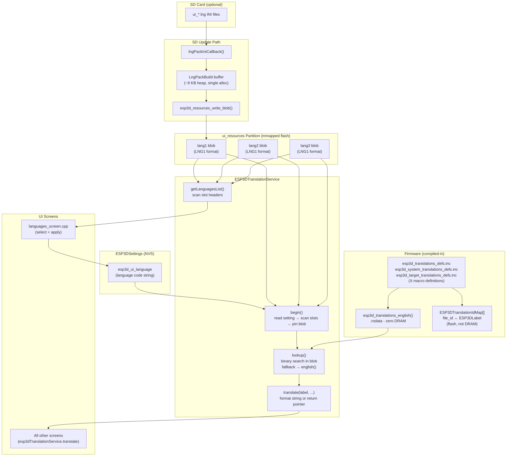
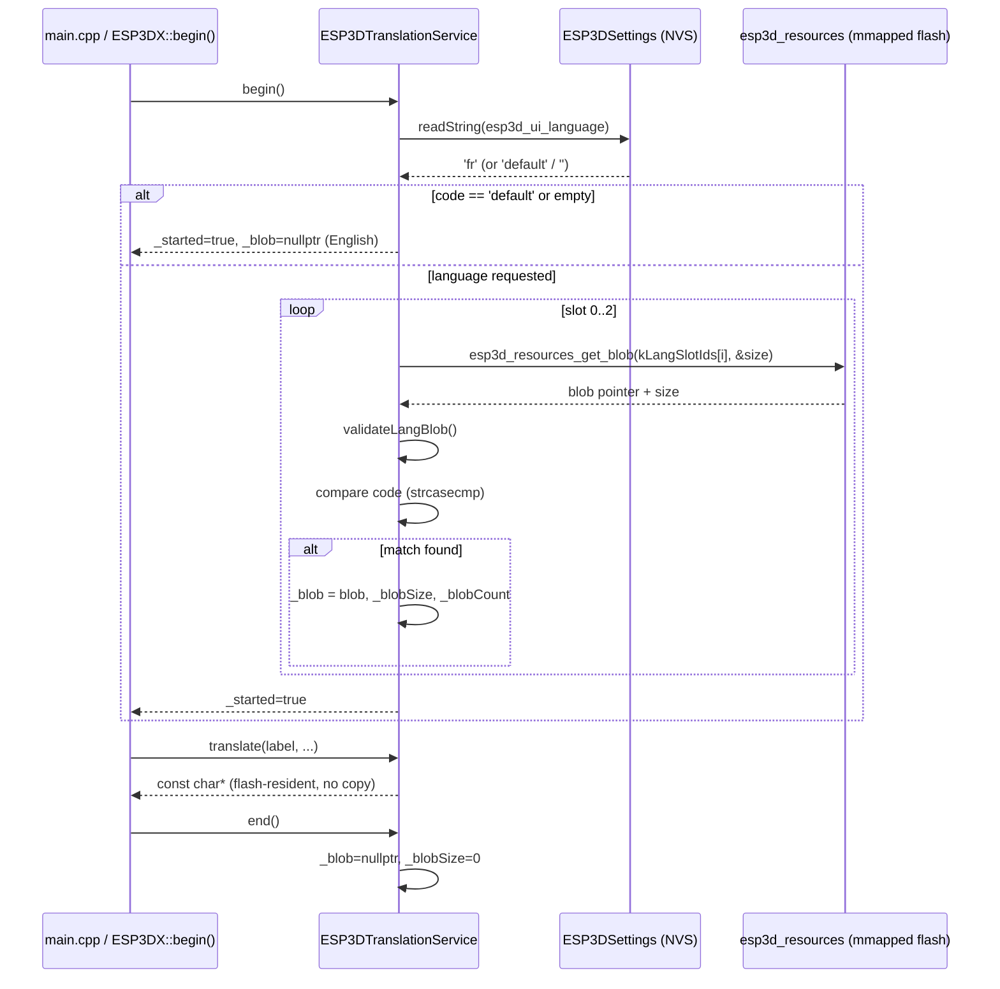
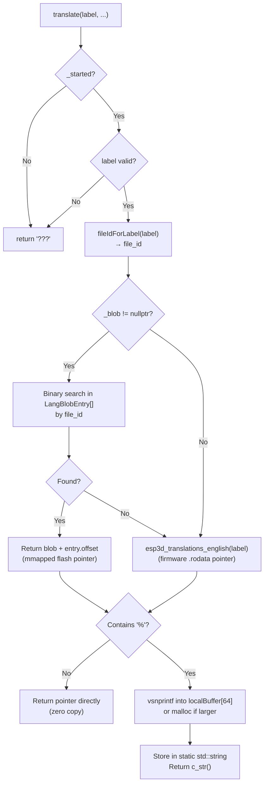
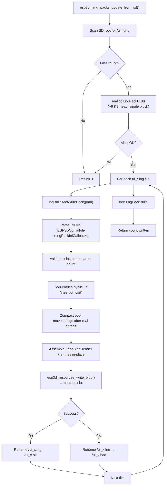

# Translation Service Module

The **Translation Service** provides runtime multi-language UI support for the ESP3D-X pendant firmware. It serves translated strings from memory-mapped LNG1 blobs stored in the `ui_resources` flash partition, with a per-label fallback to English strings compiled directly into firmware `.rodata`. No heap copy of any string is ever made during normal operation.

---

## Table of Contents

1. [Architecture Overview](#architecture-overview)
2. [Key Files](#key-files)
3. [LNG1 Binary Blob Format](#lng1-binary-blob-format)
4. [ID Map System](#id-map-system)
5. [Service Lifecycle](#service-lifecycle)
6. [Translation Lookup Flow](#translation-lookup-flow)
7. [Language List Management](#language-list-management)
8. [SD Card Language Pack Update](#sd-card-language-pack-update)
9. [Data Structures](#data-structures)
10. [Public API Reference](#public-api-reference)
11. [Configuration Constants](#configuration-constants)
12. [Memory Considerations](#memory-considerations)
13. [Authoring a Language Pack](#authoring-a-language-pack)
14. [Related Modules](#related-modules)

---

## Architecture Overview

The translation system operates across three layers:



At startup `begin()` reads the persisted language code from NVS, scans the three partition slots, and pins the matching blob pointer. All subsequent `translate()` calls do a binary search in that blob; labels not present in the blob fall back to the compiled-in English table. No string data is ever copied to DRAM.

---

## Key Files

| File | Purpose |
|---|---|
| `main/modules/translations/esp3d_translation_service.h` | `ESP3DTranslationService` class declaration |
| `main/modules/translations/esp3d_translation_service.cpp` | Service implementation, blob validation, SD update path |
| `main/display/esp3d_translations_id_map.h` | `ESP3DTranslationIdEntry`, `ESP3DTranslationIdMap[]`, lookup helpers |
| `main/display/esp3d_lang_packs.h` | Generated slot-count and djb2 ID constants (`ESP3D_LANG_SLOT_*`) |
| `main/display/esp3d_translations_list.h` | `ESP3DLabel` enum (one value per translatable string) |

The `.inc` files included by `esp3d_translations_id_map.h` are X-macro tables generated by the build system:

| `.inc` file | Scope |
|---|---|
| `esp3d_translations_defs.inc` | Common UI labels |
| `esp3d_system_translations_defs.inc` | System/communication labels |
| `esp3d_target_translations_defs.inc` | CNC-target-specific labels |

---

## LNG1 Binary Blob Format

Every language slot in the `ui_resources` partition stores exactly one LNG1 blob. The format is little-endian and must match `tools/build_scripts/lang_packs.py`.

### Byte Layout

```
┌─────────────────────────────────────────────┐  offset 0
│  LangBlobHeader  (40 bytes, packed)          │
│    magic[4]   = "LNG1"                       │
│    code[8]    = language code, NUL-padded    │
│    name[24]   = display name UTF-8, NUL-pad  │
│    count      = uint16_t  number of entries  │
│    reserved   = uint16_t  (must be 0)        │
├─────────────────────────────────────────────┤  offset 40
│  LangBlobEntry × count  (4 bytes each)       │
│    file_id   = uint16_t  (sorted ascending)  │
│    offset    = uint16_t  → string in blob    │
│  …                                           │
├─────────────────────────────────────────────┤  offset 40 + count×4
│  String pool                                 │
│  NUL-terminated UTF-8 strings               │
│  Last byte of blob MUST be NUL              │
└─────────────────────────────────────────────┘  offset blobSize-1
```

### Struct Definitions

```cpp
#pragma pack(push, 1)
struct LangBlobHeader {
    char magic[4];      // 'LNG1'
    char code[8];       // language code, NUL-padded (e.g. "fr")
    char name[24];      // display name, NUL-padded UTF-8
    uint16_t count;     // number of entries
    uint16_t reserved;
};
struct LangBlobEntry {
    uint16_t file_id;   // l_X numeric id
    uint16_t offset;    // byte offset from blob start to NUL-terminated string
};
#pragma pack(pop)

static_assert(sizeof(LangBlobHeader) == 40, "LNG1 header must be 40 bytes");
static_assert(sizeof(LangBlobEntry)  ==  4, "LNG1 entry must be 4 bytes");
```

### Validation Rules (enforced by `validateLangBlob()`)

| Rule | Detail |
|---|---|
| Minimum size | ≥ `sizeof(LangBlobHeader)` (40 bytes) |
| Magic | `hdr->magic == "LNG1"` |
| Non-empty | `hdr->count > 0` |
| Entries fit | `40 + count × 4 ≤ blobSize` |
| NUL-terminated | `blob[blobSize - 1] == 0` |
| Sorted | `entries[i].file_id > entries[i-1].file_id` (strict ascending) |
| Valid offsets | Each `entry.offset` ≥ entriesEnd and < blobSize |

---

## ID Map System

Every translatable string has two identifiers that must stay in sync:

| Identifier | Type | Used in |
|---|---|---|
| `ESP3DLabel` | C++ enum value | Source code — passed to `translate()` |
| `file_id` (l_X) | `uint16_t` | `.lng` files on SD, LNG1 blob entries |

The mapping is maintained in `ESP3DTranslationIdMap[]`, a compile-time table generated from X-macros:

```cpp
// X-macro definition format (in .inc files)
// ESP3D_TR_DEF(label_name, file_id, english_text)
ESP3D_TR_DEF(language, 0, "Language")
ESP3D_TR_DEF(yes,      1, "Yes")
...

// Expanded into:
static const ESP3DTranslationIdEntry ESP3DTranslationIdMap[] = {
    {0, ESP3DLabel::language},
    {1, ESP3DLabel::yes},
    ...
};
```

The service uses an O(1) fast path: `fileIdForLabel()` checks whether `ESP3DTranslationIdMap[idx].label == label` (true when the table is generated in enum order), falling back to a linear scan only if that assumption breaks.

```cpp
static uint16_t fileIdForLabel(ESP3DLabel label) {
    uint16_t idx = static_cast<uint16_t>(label);
    if (idx < ESP3DTranslationIdMapSize &&
        ESP3DTranslationIdMap[idx].label == label) {
        return ESP3DTranslationIdMap[idx].file_id;   // O(1)
    }
    return getFileIdFromLabel(label);                // O(n) fallback
}
```

---

## Service Lifecycle



### `begin()` Steps

1. Clear all state (`_blob = nullptr`, `_blobSize = 0`, `_blobCount = 0`).
2. Read `ESP3DSettingIndex::esp3d_ui_language` from NVS.
3. If the stored code is empty or `"default"`: mark started and return — English is used.
4. Iterate the three partition slots (`lang1`, `lang2`, `lang3`):
   - Retrieve the blob pointer via `esp3d_resources_get_blob()`.
   - Validate with `validateLangBlob()`.
   - Compare the blob's `code` field (case-insensitive) to the requested code.
   - On match: store `_blob`, `_blobSize`, `_blobCount` and break.
5. If no slot matched: log an error and fall back to English (`_blob` stays `nullptr`).
6. Set `_started = true`.

### `end()` Steps

Clears `_blob`, `_blobSize`, `_blobCount`. Does not touch NVS; the language preference is preserved across restarts.

---

## Translation Lookup Flow



The binary search runs on the sorted `LangBlobEntry` array in O(log n). Labels present in the blob return a direct pointer into mmapped flash. Labels absent from the blob (e.g., added to the firmware after the pack was built) transparently fall through to English.

---

## Language List Management

`getLanguagesList()` scans all three partition slots to build the lists returned by `getLanguagesLabels()` and `getLanguagesValues()`. The "English (default)" entry is always inserted first with the value `"default"`.

```
_values = ["default", "fr", "de"]
_labels = ["English (default)", "Français", "Deutsch"]
```

These vectors are consumed by `languages_screen.cpp` to populate the language selection UI. After the user confirms a choice, the screen writes the selected code to NVS (`esp3d_ui_language`) and triggers a reboot. `begin()` on the next boot pins the new blob.

---

## SD Card Language Pack Update

When the update service finds `.lng` files on the SD card, it calls `esp3d_lang_packs_update_from_sd()` (compiled in only when `ESP3D_SD_CARD_FEATURE` is enabled). This converts INI-format packs into LNG1 blobs and writes them to the appropriate partition slot.

### .lng File Format

```ini
[info]
code        = fr
name        = Français
target_slot = 1          ; 1, 2, or 3 — must not be 0

[translations]
l_0  = Langue
l_1  = Oui
l_2  = Non
...
```

- Section and key names are case-insensitive.
- String values support escape sequences: `\n`, `\t`, `\r`, `\\`.
- Unknown `l_X` IDs (not present in this firmware build) are silently skipped.
- Duplicate IDs keep the first occurrence.
- The code `"default"` is reserved and rejected.

### Update Sequence



### Pool Compaction

`LngPackBuild` pre-allocates the pool starting at `kLngPoolStart` (worst-case entries region = `40 + ESP3DTranslationIdMapSize × 4`). After parsing, the real entry count is known and the pool is shifted left by `memmove` to eliminate the unused gap. This avoids any secondary allocation.

```
Before compaction:
[header 40B][entries×MAX][unused gap][pool strings]
                         ↑ kLngPoolStart

After compaction:
[header 40B][entries×actual][pool strings]
```

String offsets are adjusted by the shift amount before being written into the final blob.

### File Naming After Update

| Result | Renamed to |
|---|---|
| Success | `/ui_x.ok` |
| Failure | `/ui_x.bad` |

If the destination name already exists it is shifted to a numbered variant (`/ui_x.ok1`, `/ui_x.ok2`, …) before renaming, using the same pattern as the main update service.

---

## Data Structures

### `LangBlobHeader` (internal, `esp3d_translation_service.cpp`)

| Field | Type | Size | Description |
|---|---|---|---|
| `magic` | `char[4]` | 4 B | Must be `"LNG1"` |
| `code` | `char[8]` | 8 B | Language code, NUL-padded (e.g. `"fr"`) |
| `name` | `char[24]` | 24 B | Display name, NUL-padded UTF-8 |
| `count` | `uint16_t` | 2 B | Number of `LangBlobEntry` records |
| `reserved` | `uint16_t` | 2 B | Reserved, must be 0 |
| **Total** | | **40 B** | Verified by `static_assert` |

### `LangBlobEntry` (internal, `esp3d_translation_service.cpp`)

| Field | Type | Size | Description |
|---|---|---|---|
| `file_id` | `uint16_t` | 2 B | Numeric l_X id; array sorted ascending |
| `offset` | `uint16_t` | 2 B | Byte offset from blob start to NUL string |
| **Total** | | **4 B** | Verified by `static_assert` |

### `ESP3DTranslationIdEntry` (`esp3d_translations_id_map.h`)

| Field | Type | Description |
|---|---|---|
| `file_id` | `uint16_t` | Numeric l_X id used in `.lng` files and LNG1 blobs |
| `label` | `ESP3DLabel` | Internal enum value used in source code |

### `LngPackBuild` (internal anonymous namespace, SD update only)

| Field | Type | Description |
|---|---|---|
| `entries[]` | `LangBlobEntry[ESP3DTranslationIdMapSize]` | Accumulates parsed entries |
| `blob[]` | `uint8_t[ESP3D_LANG_SLOT_SIZE]` | Working buffer (8 192 B); becomes the final blob |
| `poolPos` | `uint32_t` | Write cursor into `blob` (starts at `kLngPoolStart`) |
| `count` | `uint16_t` | Number of valid entries accumulated |
| `slot` | `int` | Target slot (1–3) from `[info]` `target_slot` |
| `code[9]` | `char` | Language code from `[info]` |
| `name[25]` | `char` | Display name from `[info]` |

Allocated as a single `malloc(sizeof(LngPackBuild))` (~9 KB) for the entire update pass, then freed immediately after.

---

## Public API Reference

### `ESP3DTranslationService`

#### Lifecycle

| Method | Returns | Description |
|---|---|---|
| `begin()` | `bool` | Read NVS language setting, scan partition slots, pin active blob. Returns `true` on success (including English fallback). |
| `handle()` | `void` | No-op; exists for consistency with other service modules. |
| `end()` | `void` | Release blob reference (`_blob = nullptr`). NVS setting is preserved. |

#### Translation Access

| Method | Returns | Description |
|---|---|---|
| `translate(ESP3DLabel label, ...)` | `const char*` | Translate `label` with optional `printf`-style formatting. For strings without `%` the mmapped pointer is returned directly (zero copy). |
| `getRawTranslation(ESP3DLabel label)` | `const char*` | Return raw translation string without formatting. `%d`/`%s` specifiers are kept verbatim (used by the `[ESP460]` command dump). |
| `getEntry(ESP3DLabel label)` | `const char*` | Return the l_X key string for a label (e.g. `"l_0"`). Used by WebUI/ESP3D command handlers. |

#### Language Management

| Method | Returns | Description |
|---|---|---|
| `getLanguagesList()` | `uint16_t` | Scan all partition slots and populate internal label/value vectors. Returns total count including the built-in English entry. |
| `getLanguagesLabels()` | `std::vector<std::string>` | Display names (e.g. `"Français"`). Call `getLanguagesList()` first. |
| `getLanguagesValues()` | `std::vector<std::string>` | Code values stored in NVS (e.g. `"fr"`). Call `getLanguagesList()` first. |
| `getLanguageCode()` | `const char*` | Currently active language code (`"default"` when English). |

#### Status

| Method | Returns | Description |
|---|---|---|
| `started()` | `bool` | `true` after a successful `begin()` call. |

### Global Instance

```cpp
extern ESP3DTranslationService esp3dTranslationService;
```

All screens call `esp3dTranslationService.translate(ESP3DLabel::some_label)` directly.

### C Helper (SD update)

```cpp
// Defined in esp3d_translation_service.cpp, guarded by ESP3D_SD_CARD_FEATURE
uint8_t esp3d_lang_packs_update_from_sd();
```

Scans the SD root for `/ui_*.lng` files, converts each to a LNG1 blob, writes it to the slot specified by `target_slot` in the file's `[info]` section, and renames the file to `.ok` or `.bad`. Returns the number of packs successfully written.

### C English Fallback

```cpp
// Defined in esp3d_translations_init.cpp (generated from X-macros)
const char* esp3d_translations_english(ESP3DLabel label);
```

Returns a pointer into firmware `.rodata` for any label. Called by `lookup()` when the active blob has no entry for that label, or when no blob is loaded (English mode).

---

## Configuration Constants

All constants in `main/display/esp3d_lang_packs.h` are auto-generated by `tools/build_scripts/generate_resources.py` and must not be edited manually.

| Constant | Value | Description |
|---|---|---|
| `ESP3D_LANG_SLOT_COUNT` | `3` | Number of language slots in the `ui_resources` partition |
| `ESP3D_LANG_SLOT_SIZE` | `8192` | Maximum blob size per slot in bytes |
| `ESP3D_LANG_SLOT_ID_LANG1` | `0x68B8` | djb2 resource ID for slot 1 |
| `ESP3D_LANG_SLOT_ID_LANG2` | `0x68B9` | djb2 resource ID for slot 2 |
| `ESP3D_LANG_SLOT_ID_LANG3` | `0x68BA` | djb2 resource ID for slot 3 |
| `ESP3D_LANG_SLOT_IDS_INIT` | `{0x68B8, 0x68B9, 0x68BA}` | Initializer for the `kLangSlotIds[]` array |

The service maps slot index to resource ID via:

```cpp
static const uint16_t kLangSlotIds[ESP3D_LANG_SLOT_COUNT] = ESP3D_LANG_SLOT_IDS_INIT;
```

The NVS key for the active language is `ESP3DSettingIndex::esp3d_ui_language` (a short string, e.g. `"fr"` or `"default"`).

---

## Memory Considerations

The translation service is designed to operate within the severe heap constraints of the ESP32 (as low as ~10 KB free in Bluetooth mode).

| Aspect | Strategy |
|---|---|
| String storage | Pointers directly into mmapped flash or `.rodata` — no DRAM copies |
| ID map table | Stored in flash (not DRAM) as a `static const` array |
| Language lists | `std::vector<std::string>` built only during `getLanguagesList()` calls |
| `translate()` formatting | Uses a `char localBuffer[64]` on the stack for short strings; falls back to `malloc` only when the formatted result exceeds 63 bytes (freed immediately after copying to `static std::string`) |
| SD update buffer | Single `malloc(sizeof(LngPackBuild))` ≈ 9 KB; allocated only during update, freed immediately after |
| Slot validation | `validateLangBlob()` validates entirely within the mmapped region; no data is copied to DRAM |

**Critical**: `translate()` returns a `static std::string::c_str()` pointer when formatting is needed. This pointer is invalidated by the next call to `translate()` with a format specifier. Callers must use the result immediately or copy it before making another formatted translation call.

---

## Authoring a Language Pack

1. **Obtain the string list** — run `tools/language_packs/build_template.py` to generate a `.lng` template containing all `l_X` keys with their English defaults.

2. **Fill in translations** — edit the `[translations]` section. Supported escape sequences: `\n`, `\t`, `\r`, `\\`.

3. **Set metadata** in the `[info]` section:
   ```ini
   [info]
   code        = fr           ; short language code (≤7 chars, not "default")
   name        = Français     ; display name shown in the language picker (≤23 chars)
   target_slot = 1            ; 1, 2, or 3 — which slot to write
   ```

4. **Audit** with `tools/language_packs/audit_translations.py` to detect missing or unknown keys.

5. **Deploy via SD card** — copy the file as `/ui_mypack.lng` to the SD card root (the name must start with `ui_` and end with `.lng`). On the next boot, the update service will convert it and rename it to `/ui_mypack.ok`. The language code written to this slot can then be selected from **Settings → Language**.

6. **Deploy via build system** — place the `.lng` file in the resource manifest so `generate_resources.py` includes it at build time. See `docs/ui_resources/development.md` for the full pipeline.

---

## Related Modules

| Module | Relationship |
|---|---|
| [`esp3d_core`](esp3d_core.md) | `ESP3DSettings` (NVS) stores the active language code; `ESP3DX::begin()` calls `esp3dTranslationService.begin()` |
| [`values`](values.md) | `ESP3DValues` observable system triggers UI refreshes after language change |
| [`Build,_Resource_&_Development_Toolchain`](Build_and_Development_Tools.md) | `generate_resources.py` generates `esp3d_lang_packs.h`; `build_template.py` and `audit_translations.py` support pack authoring |
| [`Storage_&_Configuration`](Storage_and_Configuration.md) (via `config_file` module) | `ESP3DConfigFile` parses `.lng` INI files from SD; `esp3d_sd` provides directory iteration for the update scan |


## Documents de conception (depot)

- [development.md](https://github.com/luc-github/Pibot-cnc-pendant-firmware/blob/main/docs/ui_resources/development.md)


## Documents de conception (depot)

- [language_packs](https://github.com/luc-github/Pibot-cnc-pendant-firmware/blob/main/docs/user%20documentation/language_packs.md)
