# UI Components Module

## Introduction

The `ui_components` module (`main/display/components/`) provides the reusable, self-contained LVGL widget building blocks that power every screen in the Pibot CNC Pendant firmware. Rather than duplicating navigation and input logic screen by screen, this module centralises six distinct component types behind a consistent lifecycle and encoder-handling contract.

**Primary consumers:** [`common_screens`](https://github.com/luc-github/Pibot-cnc-pendant-firmware/blob/main/docs/architecture/screens_architecture.md), `cnc_shared` screens (jog, status, macros, settings), and firmware-specific screens (FluidNC, grbl, grblHAL).  
**Primary dependencies:** [`ui_core`](https://github.com/luc-github/Pibot-cnc-pendant-firmware/blob/main/docs/ui_resources/ui_style_guide.md) (`UIManager`, `ThemeStyles`, theme tokens), Core Platform (FreeRTOS, LVGL), and [`Input_system`](https://github.com/luc-github/Pibot-cnc-pendant-firmware/blob/main/docs/architecture/Input_system.md) (hardware encoder/button events).

> ⚠️ **LVGL threading constraint:** All component methods must be called from Core 1 (the LVGL task). The only exception is `RotaryBaseComponent::handleEncoderEvent()`, which uses a FreeRTOS mutex to safely accumulate encoder steps from the ISR before dispatching them on the LVGL task.

---

## Architecture Overview

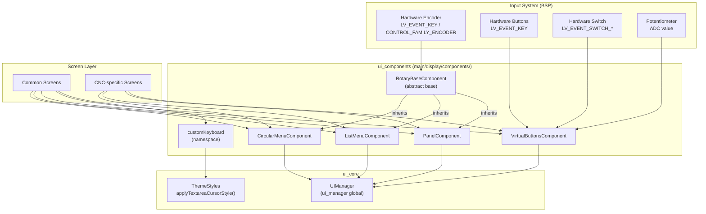

---

## Component Hierarchy

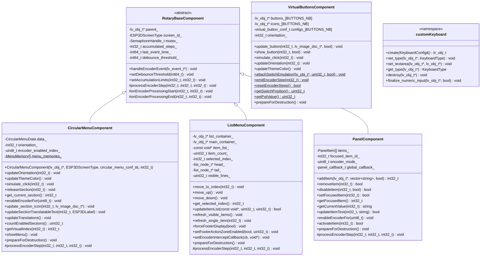

---

## Components

### 1. RotaryBaseComponent

**File:** `main/display/components/rotary_base_component.h`

The abstract foundation all encoder-driven components build on. It handles the ISR-to-LVGL-task boundary safely using a FreeRTOS mutex, accumulates rapid encoder ticks with configurable debouncing, and dispatches them in a controlled batch through the pure virtual `processEncoderStep()`.

**Key responsibilities:**
- Thread-safe step accumulation from encoder ISR events (`handleEncoderEvent`)
- Debounce filtering (configurable threshold, default tuned for pendant hardware)
- Batch dispatch: calls `onEncoderProcessingStart` → `processEncoderStep` per step → `onEncoderProcessingEnd`
- Stores `screen_id_` so derived classes can persist per-screen state

**Design contract for derived classes:**

| Method | Required | Purpose |
|---|---|---|
| `processEncoderStep(direction, step_number, total_steps)` | **Yes** | Handle one encoder tick |
| `onEncoderProcessingStart(direction, total_steps)` | No | Pre-batch UI prep (e.g. suppress animations) |
| `onEncoderProcessingEnd(direction, total_steps)` | No | Post-batch finalisation (e.g. persist state) |

**Encoder event dispatch flow:**

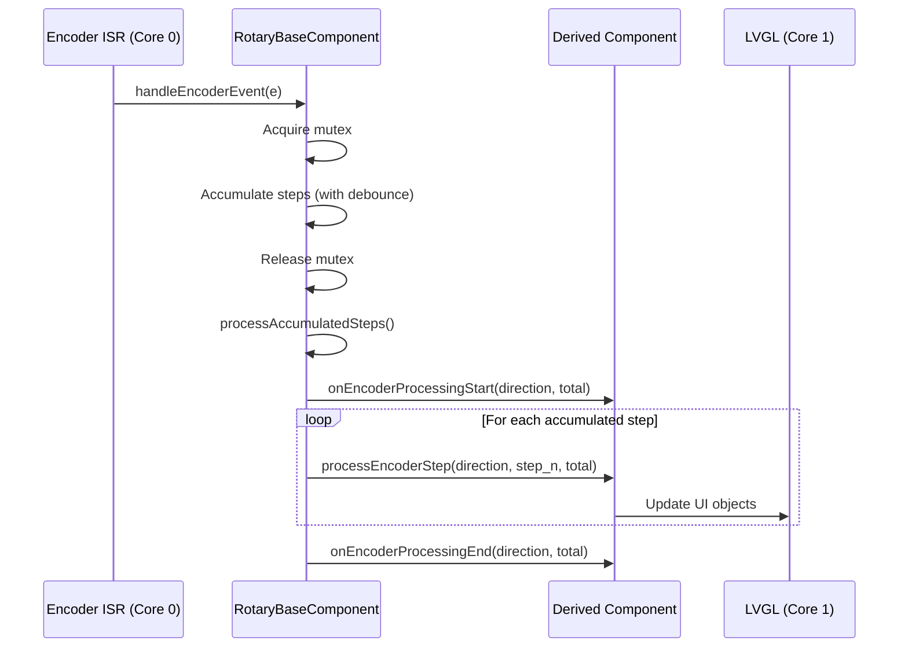

---

### 2. CircularMenuComponent

**File:** `main/display/components/circular_menu_component.h`

A radial section-based menu rendered on a circular canvas. Sections are evenly distributed around the ring; a highlighted arc and centre label indicate the current selection. Supports both hardware encoder navigation and — when `ESP3D_HARDWARE_ENCODER_FEATURE` is not set — an angular drag-handle for touch-only boards.

**Configuration macros:**

| Macro | Description |
|---|---|
| `TRANSLATABLE_SECTION(icon, label, press_cb, release_cb, lockable)` | Section using `ESP3DLabel` translation |
| `RAW_TEXT_SECTION(icon, text, press_cb, release_cb, lockable)` | Section using a raw string label |
| `TRANSLATABLE_CUSTOM_SECTION(...)` | Translatable section with custom colour and colour mode |
| `RAW_TEXT_CUSTOM_SECTION(...)` | Raw-text section with custom colour and colour mode |

**Key types:**

```c
// Single section descriptor
typedef struct {
    UIItemType       type;                // Image | Hidden
    const void      *img_path;            // lv_image_dsc_t pointer
    TextType         text_type;           // Translatable | Raw
    ESP3DLabel       translatable_label;
    std::string      raw_text;
    void (*on_press)(int32_t section_id);
    void (*on_release)(int32_t section_id, uint32_t duration_ms);
    bool             isLockable;
    uint32_t         color;               // RGB
    MenuColorType    color_mode;          // Theme | CustomDarker
    bool             enabled;             // v2.1: runtime enable/disable
} circular_menu_section_conf_t;
```

**Section enable/disable (v2.1):** The `enabled` field hides a section from the visual layout without removing it from the configuration array. Use `countEnabledSections()` to get the visual count and `getVisualIndex(section_id)` to map a config index to its visual layout position.

**Section memory:** The last active section for each `ESP3DScreenType` is saved in the static `menu_memories_` vector, so returning to a screen restores the previous selection automatically.

**Colour modes:**

| `MenuColorType` | Normal state | Pressed state |
|---|---|---|
| `Theme` | `ESP3D_MENU_ICON_COLOR` (theme token) | Lighter theme shade |
| `CustomDarker` | `color` field | Darker shade of `color` field |

**Section lifecycle:**

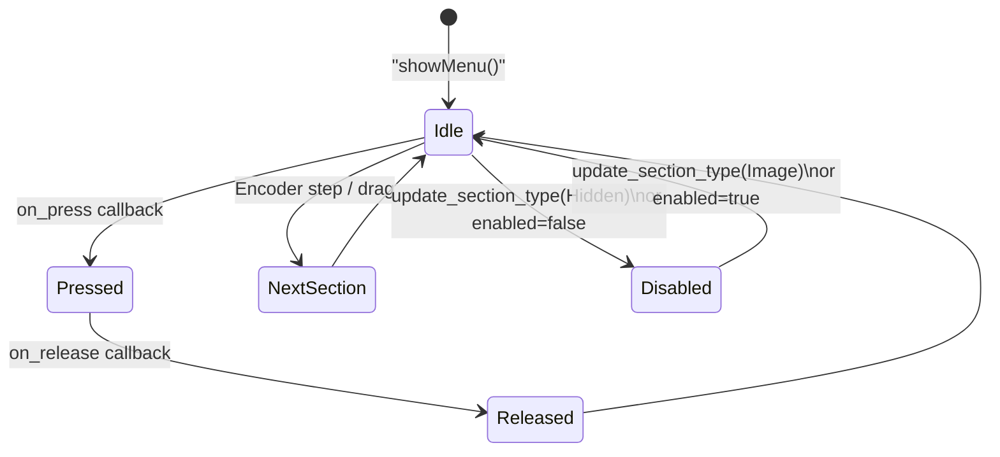

**Encoder index modes:**

| `encoder_enabled_index_` | Behaviour |
|---|---|
| `ESP3D_MENU_SELECTION (0)` | Encoder rotates the selection between sections |
| Other index | Encoder sends value-edit events via `on_encoder_event` callback |

**Touch-only drag handle (no hardware encoder):** When `ESP3D_HARDWARE_ENCODER_FEATURE` is not defined, a drag handle is rendered near the centre of the ring. In selection mode the handle tracks the absolute finger angle and directly selects whichever section's arc slice contains that angle (`getSectionAtAngle()`). In value-edit submode it falls back to relative delta stepping via `processEncoderStep()`.

---

### 3. ListMenuComponent

**File:** `main/display/components/list_menu_component.h`

A vertically scrollable list backed by a minimal linked-list virtual renderer. Only the visible rows are materialised as LVGL objects (`list_node_t`); scrolling reuses nodes via `add_node` / `remove_head` / `remove_tail` to stay memory-efficient on the constrained ESP32 heap.

**Virtual rendering window:**

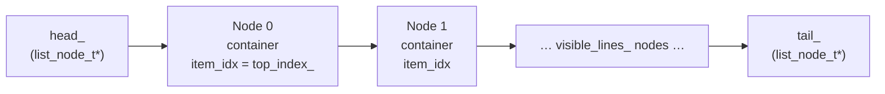

**Layout zones:**

```
┌──────────────────────────────────┐
│  ▲   Title Text                  │  ← title_container_  (optional UP button)
├──────────────────────────────────┤
│  Item 0   (selected highlight)   │
│  Item 1                          │  ← list_container_   (visible_lines_ nodes)
│  Item N                          │
├──────────────────────────────────┤
│  [action zone]        ▼          │  ← footer_container_ (optional)
└──────────────────────────────────┘
```

**Display and click callbacks:**

```c
// Renders one item into a list node container
void (*display_cb)(lv_obj_t *node_container,
                   const void *item, void *user_data, void *extra);

// Called when an item is clicked / confirmed
void (*click_cb)(const void *item, void *user_data, void *extra);
```

**Encoder intercept:** An optional `encoder_intercept_cb_t` can capture encoder steps before the default move-up/move-down logic runs, enabling reorder mode (used in the macros screen).

**Footer modes:**

| API | Effect |
|---|---|
| `forceFooterDisplay(true)` | Show footer even when the list fits on one page |
| `update_footer_text(text)` | Set an action symbol / label in the footer |
| `setFooterActionZoneEnabled(true, n)` | Split footer: left tappable action zone + right DOWN arrow; wires switch emulation when n ≥ 2 |

---

### 4. PanelComponent

**File:** `main/display/components/panel_component.h`

A panel of arbitrary LVGL objects (`PanelItem`) that the encoder can navigate between and edit. Unlike the list, items are laid out manually by the parent screen; the component only manages focus, value cycling, and the two encoder modes.

**Encoder modes:**

| Constant | Value | Encoder behaviour |
|---|---|---|
| `PANEL_NAVIGATION_MODE` | 0 | Move focus between items |
| `PANEL_EDITING_MODE` | 1 | Cycle the focused item's value list |

**Unified callback:**

```c
typedef void (*panel_callback_t)(
    int32_t           item_id,
    PanelCallbackType type,    // ON_CHANGE | ON_FOCUS | ON_ACTIVE | ON_STANDBY
    const std::string &value,  // current raw value (populated for ON_CHANGE only)
    int32_t           direction
);
```

**Item state machine:**

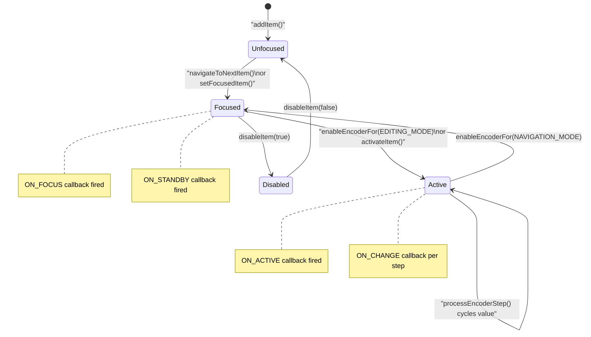

---

### 5. VirtualButtonsComponent

**File:** `main/display/components/virtual_buttons_component.h`

Renders `BUTTONS_NB` on-screen buttons (defined per-board in `board_config.h`) that mirror their hardware counterparts. Also acts as the gateway for touch-only emulation of hardware features absent on lower-end boards.

**Configuration macros:**

| Macro | Position | HW button ID |
|---|---|---|
| `BUTTON_1(icon, press_cb, release_cb, lockable)` | Left (`ESP3D_BOTTOM_BUTTON_POSITION_LEFT`) | 0 |
| `BUTTON_2(icon, press_cb, release_cb, lockable)` | Centre (`ESP3D_BOTTOM_BUTTON_POSITION_CENTER`) | 1 |
| `BUTTON_3(icon, press_cb, release_cb, lockable)` | Right (`ESP3D_BOTTOM_BUTTON_POSITION_RIGHT`) | 2 |
| `BUTTON_1_OK(press_cb, release_cb)` | Left | 0 — pre-wired OK icon |
| `BUTTON_x_EMPTY()` | Any | -1 (no HW mapping) |

**Colour modes:**

| `ButtonColorType` | Description |
|---|---|
| `Theme` | Uses `ESP3D_MENU_ICON_COLOR` theme token |
| `CustomDarker` | Custom RGB; pressed = darker shade |
| `CustomFilled` | Custom RGB with filled background |

**Touch-only emulation static helpers:**

| Method | Purpose |
|---|---|
| `attachSwitchEmulation(target, cycle_count, affordance)` | Makes any LVGL object tap-to-cycle the virtual switch. No-op when `ESP3D_HARDWARE_SWITCH_FEATURE` is set. |
| `emitEncoderStep(steps)` | Injects a synthetic encoder step event — used by value-edit screens on touch-only hardware |
| `resetEncoderSteps()` | Resets the accumulated step counter |
| `getSwitchPosition()` | Returns current switch position (HW or emulated) |
| `getPotValue()` | Returns current potentiometer ADC value (HW or emulated) |

**Hardware button event flow:**

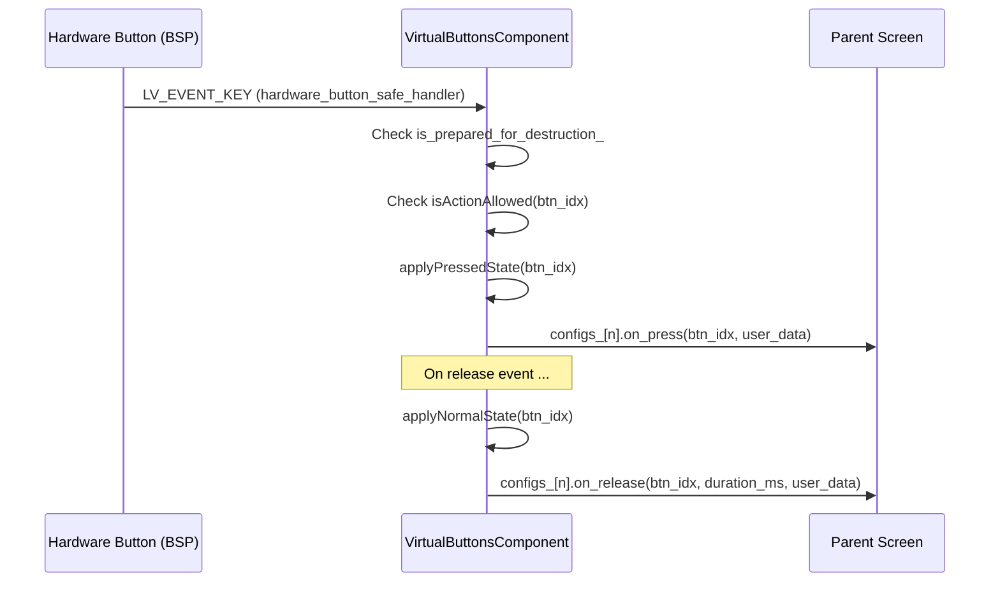

---

### 6. customKeyboard (Namespace)

**Files:** `main/display/components/custom_keyboard_component.h/.cpp`

A stateless factory namespace that creates LVGL `lv_buttonmatrix` keyboards linked to a target `lv_textarea`. Keyboard data (type, callbacks, textarea reference) is stored in the buttonmatrix's `user_data` as the internal `KeyboardData` struct.

**`KeyboardConfig` — creation parameters:**

```cpp
struct KeyboardConfig {
    lv_obj_t*    parent;               // Parent container for keyboard
    lv_obj_t*    textarea;             // Target textarea to write to
    KeyboardType initial_type;         // Initial keyboard layout
    on_ok_cb_t   on_ok;               // Reserved (OK handled by physical button)
    on_cancel_cb_t on_cancel;         // Reserved (Cancel handled by physical button)
    void*        user_data;
    bool         allow_leading_zeros;  // true = PIN mode (preserve "0042" as-is)
};
```

**Keyboard types:**

| `KeyboardType` | Rows | Description |
|---|---|---|
| `NumericIntPos` | 4 | 0–9, backspace, cursor arrows |
| `NumericFloatNeg` | 4 | 0–9, `.`, `-`, backspace, cursor arrows |
| `NumericListFloat` | 4 | 0–9, `.`, `;` list separator, backspace, cursor arrows |
| `NumericListInt` | 4 | 0–9, `;` list separator, backspace, cursor arrows |
| `AlphanumericABC` | 5 | A–Z uppercase + `[abc]` + `[1#]` toggles |
| `Alphanumericabc` | 5 | a–z lowercase + `[ABC]` + `[1#]` toggles |
| `AlphanumericNum` | 5 | 0–9 + symbols + return-to-letter toggle (remembers last letter mode) |

**Keyboard type state machine:**

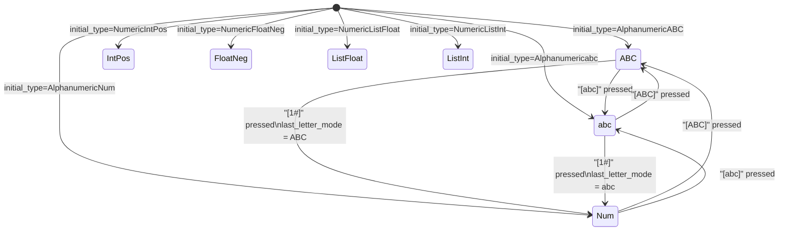

**Button visual classes:**

| Class | Background | Text colour | When applied |
|---|---|---|---|
| Normal character | `ESP3D_SCREEN_BACKGROUND_COLOR` (dark) | `ESP3D_SCREEN_BACKGROUND_TEXT_COLOR` (light) | Default state |
| System button | `ESP3D_SCREEN_BACKGROUND_TEXT_COLOR` (light) | `ESP3D_SCREEN_BACKGROUND_COLOR` (dark) | Backspace, arrows, `ABC`, `abc`, `1#`, space, `;` |
| Pressed (any) | `ESP3D_ACCENT_SELECT_COLOR` | Light | `LV_STATE_PRESSED` |

**Numeric input validation (`validate_numeric_input`) — rules applied in order after each keystroke:**

1. Empty input → `"0"` (unless PIN mode / `allow_leading_zeros`)
2. Remove duplicate decimal points (keep first)
3. Leading `.` → prefix with `"0"` (e.g. `"."` → `"0."`)
4. Leading `"-."` → change to `"-0."`
5. Strip leading zeros unless preceding `.` or in PIN mode (e.g. `"01"` → `"1"`, `"0.5"` stays)
6. `"-"` alone → `"-0"`

**`finalize_numeric_input(textarea, allow_leading_zeros)` — normalises edge cases on OK press:**

| Input | Output |
|---|---|
| `""`, `"."`, `"-."` | `"0"` |
| `"-0"`, `"-0."`, `"0."` | `"0"` |
| `"-0.000…"` (all zeros, negative) | `"0"` |
| `"123."` (trailing decimal point) | `"123"` |
| Any value in PIN mode (`allow_leading_zeros=true`) | No change |

---

## Data Flow: Encoder Event to UI Update

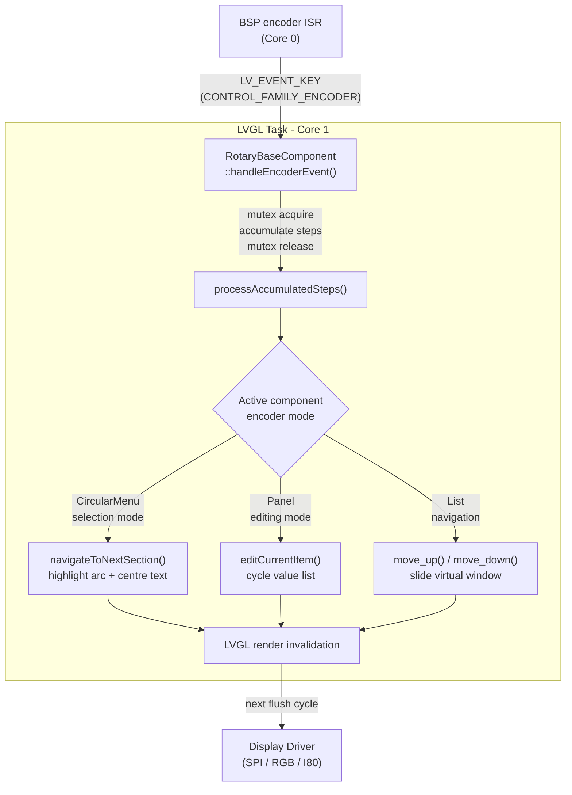

---

## Lifecycle and Destruction Safety

All components share a two-phase destruction pattern to prevent use-after-free inside LVGL event callbacks:

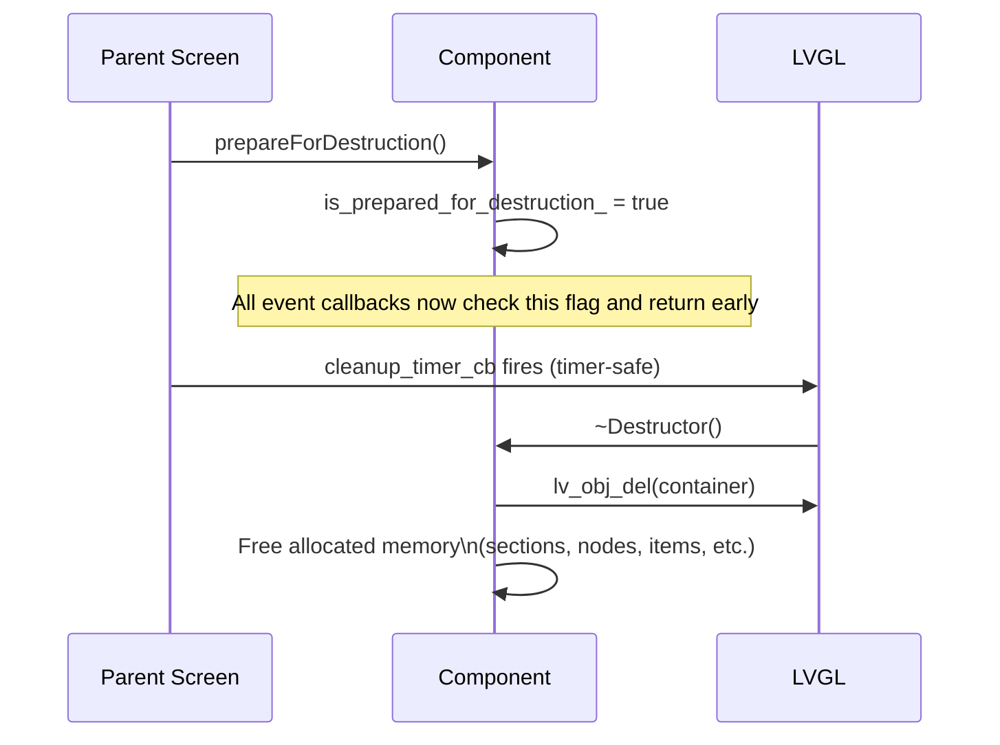

> ⚠️ **Never destroy component objects directly inside LVGL event callbacks.** Always use a `cleanup_timer_cb` — see [`screen_transitions_flow.md`](https://github.com/luc-github/Pibot-cnc-pendant-firmware/blob/main/docs/architecture/screen_transitions_flow.md) for the canonical pattern used by all screens.

The `is_valid_` flag guards against operating on partially-constructed components in case the constructor throws (e.g. allocation failure on a fragmented heap).

---

## Integration Pattern: Multiple Components on One Screen

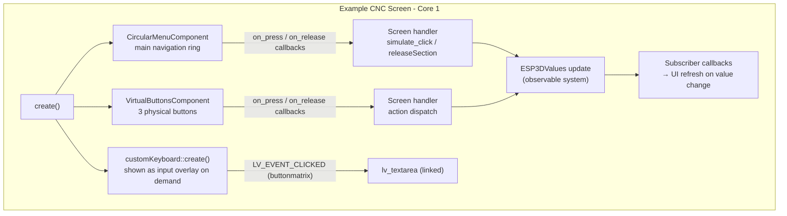

---

## Cross-References

| Topic | Document |
|---|---|
| Screen creation, registration, and navigation overview | [`screens_architecture.md`](https://github.com/luc-github/Pibot-cnc-pendant-firmware/blob/main/docs/architecture/screens_architecture.md) |
| Safe timer-based screen transitions | [`screen_transitions_flow.md`](https://github.com/luc-github/Pibot-cnc-pendant-firmware/blob/main/docs/architecture/screen_transitions_flow.md) |
| Hardware encoder / button / switch / potentiometer BSP | [`Input_system.md`](https://github.com/luc-github/Pibot-cnc-pendant-firmware/blob/main/docs/architecture/Input_system.md) |
| Theme tokens, `ThemeStyles`, `apply*` style functions | [`ui_style_guide.md`](https://github.com/luc-github/Pibot-cnc-pendant-firmware/blob/main/docs/ui_resources/ui_style_guide.md) |
| Theme colour tokens (`ESP3D_*` constants, 26 semantic tokens) | [`theme_palette.md`](https://github.com/luc-github/Pibot-cnc-pendant-firmware/blob/main/docs/ui_resources/theme_palette.md) |
| Image and font resources loaded by components | [`development.md`](https://github.com/luc-github/Pibot-cnc-pendant-firmware/blob/main/docs/ui_resources/development.md) |
| `UIManager`, `ESP3DXUi`, display driver integration | [`display_drivers.md`](https://github.com/luc-github/Pibot-cnc-pendant-firmware/blob/main/docs/architecture/display_drivers.md) |
