# ui_core — UI Framework Core

## Introduction

`ui_core` is the foundational layer of the ESP3D TFT display system. It provides centralized management for every piece of UI-level state: LVGL task lifecycle, screen and component registries, theme system (color tokens + LVGL styles), display orientation, language selection, UI lock, and flash-partition resource loading.

All screens, reusable components, and CNC-firmware UI modules in `ui_components`, `common_screens`, and `cnc_shared` build on top of `ui_core`. It runs exclusively on **Core 1** — the single thread that owns LVGL — and is the only valid source of `lv_style_t` objects used in the rest of the UI.

**Source files:**

| File | Role |
|------|------|
| `main/display/esp3d_x_ui.h/.cpp` | LVGL FreeRTOS task runner (`ESP3DXUi`) |
| `main/display/esp3d_ui.h/.cpp` | Centralized state manager + style registry (`UIManager`) |
| `main/display/esp3d_resources.cpp` | Partition mmap, image/font/blob loader |
| `main/display/esp3d_snapshot.h` | Screen-capture state (`snapshot_state_t`) |
| `main/display/esp3d_translations_id_map.h` | Numeric file-ID ↔ `ESP3DLabel` enum lookup |

---

## Architecture Overview

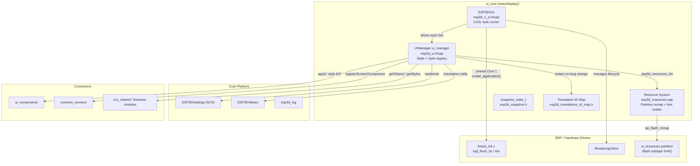

See [Core_Platform_&_Infrastructure.md](Core_Platform_and_Infrastructure.md) for `ESP3DSettings`, `ESP3DValues`, and `esp3d_log` details. See [Hardware_Peripheral_Drivers.md](Hardware_Peripheral_Drivers.md) for BSP and `RenderingClient` details.

---

## Component Detail

### 1. `ESP3DXUi` — LVGL Task Runner

**Files:** `esp3d_x_ui.h`, `esp3d_x_ui.cpp`  
**Global instance:** `esp3dXui`

`ESP3DXUi` owns the FreeRTOS task (`tft_ui_task`) that drives LVGL on **Core 1**. Nothing in the UI runs outside this task context.

#### Lifecycle

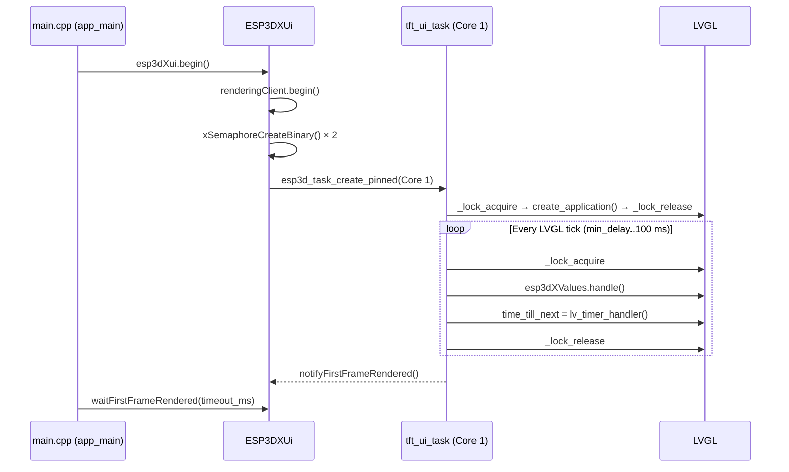

**Task configuration constants:**

| Constant | Purpose |
|----------|---------|
| `LVGL_TASK_CORE` | Pinned CPU core (always Core 1) |
| `LVGL_TASK_PRIORITY` | FreeRTOS priority |
| `LVGL_TASK_STACK_SIZE` | Stack size in bytes |
| `LVGL_TICK_PERIOD_MS` | Minimum delay between timer handler calls |

#### Boot Synchronization Semaphores

| Method | Signaled when | Used by |
|--------|---------------|---------|
| `waitFirstFrameRendered(ms)` | After the first `lv_timer_handler()` pass following `create_application()` | Boot sequence — safe to perform post-splash actions once the display is live |
| `waitUpdateCompletionRendered(ms)` | After `updateScreen::isCompletionHandled()` returns true | Boot sequence — waits for the update result screen to be visible before rebooting |

> ⚠️ **LVGL lock rule:** Every `lv_obj_*` / `lv_style_*` call must occur inside `_lock_acquire(lvgl_lock)` / `_lock_release(lvgl_lock)`, or from within an LVGL event/timer callback (which already executes inside the task). Violating this causes race conditions on the single-threaded LVGL renderer.

---

### 2. `UIManager` — Centralized State Manager

**Files:** `esp3d_ui.h`, `esp3d_ui.cpp`  
**Global instance:** `ui_manager`

`UIManager` is the singleton that all screens and components interact with for UI state. It owns the theme configuration (tokens + styles), the active screen/component registries, and all persistent UI settings.

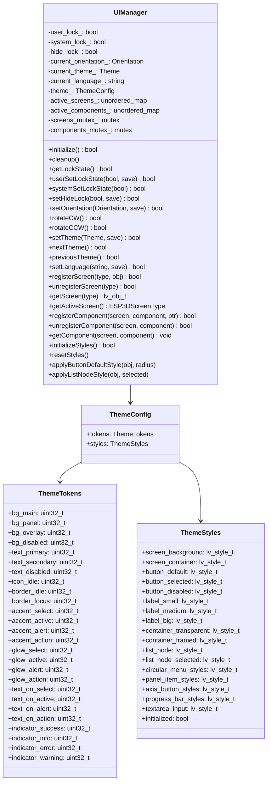

#### 2.1 Initialization Sequence

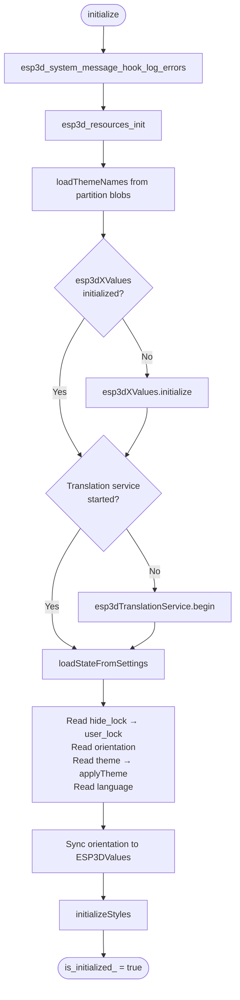

#### 2.2 Lock State (Dual-Source)

The UI is considered **locked** when either `user_lock_` or `system_lock_` is true. Each source is independent:

| Source | Setter | Persisted | Subject to `hide_lock_` |
|--------|--------|-----------|------------------------|
| `user_lock_` | `userSetLockState()` | Yes (NVS) | Yes — forced to false when `hide_lock_` is set |
| `system_lock_` | `systemSetLockState()` | No (runtime only) | No |
| `hide_lock_` | `setHideLock()` | Yes (NVS) | — forces `user_lock_ = false` when activated |

> **`ESP3D_NO_CONNECTION_LOCK_FEATURE` builds:** `systemSetLockState()` is a no-op. The system lock never engages — useful for UI testing while the CNC is disconnected.

#### 2.3 Screen & Component Registry

Only **one** screen may be active at a time. All component types are **globally unique** (one instance per type across all screens).

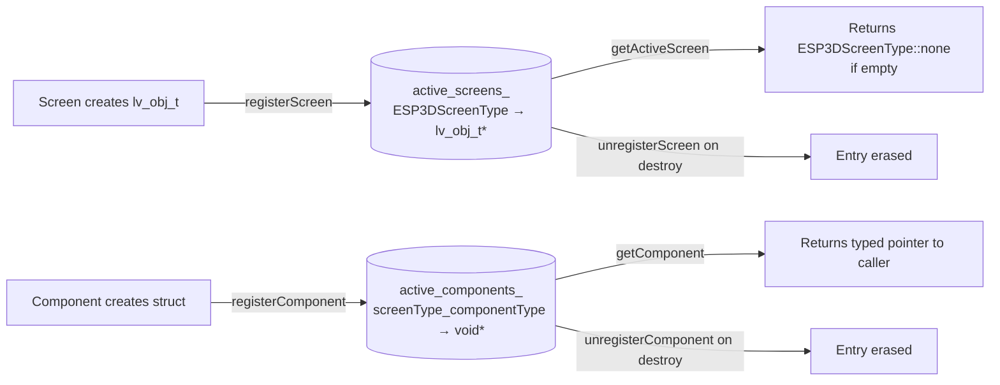

Both maps use `std::mutex` (separate `screens_mutex_` and `components_mutex_`) for thread-safe access from any task. Component keys are the string `"screenType_componentType"`.

#### 2.4 Orientation

```
Deg0 (0°) → rotateCW → Deg90 (90°) → rotateCW → Deg180 (180°) → rotateCW → Deg270 (270°) → rotateCW → Deg0
```

Angles are persisted to NVS and synchronized to `ESP3DValues` (index `orientation`) so screens can react to rotation events via the observable system. See [values.md](values.md) for how `ESP3DValues` notifies observers.

#### 2.5 Language

`setLanguage(code)` stores the locale string in NVS and calls `esp3dTranslationService.end()` followed by `esp3dTranslationService.begin()` to reload the `.lng` binary pack. See [translations.md](translations.md) for the full translation pipeline and binary format.

---

### 3. Theme System

#### 3.1 ThemeTokens — Semantic Color Vocabulary

26 RGBA tokens stored in DRAM (104 bytes total, format `0xRRGGBBAA`). The low byte is the LVGL opacity:

| Group | Tokens | Typical use |
|-------|--------|-------------|
| **Backgrounds** | `bg_main`, `bg_panel`, `bg_overlay`, `bg_disabled` | Screen fills, panels, semi-transparent overlays, disabled controls |
| **Text** | `text_primary`, `text_secondary`, `text_disabled` | Values, labels, hints on dark backgrounds |
| **Icons** | `icon_idle` | Circular/virtual menu icon recolor in resting state |
| **Borders** | `border_idle`, `border_focus` | Idle borders; encoder/touch focus ring |
| **Accent fills** | `accent_select`, `accent_active`, `accent_alert`, `accent_action` | Selected, running, error, back/undo states |
| **Glows** | `glow_select`, `glow_active`, `glow_alert`, `glow_action` | LVGL `outline` simulating neon halos (darker shade of matching accent) |
| **Text on accent** | `text_on_select`, `text_on_active`, `text_on_alert`, `text_on_action` | Text/icons drawn on each accent background |
| **State indicators** | `indicator_success`, `indicator_info`, `indicator_error`, `indicator_warning` | Connection dots, status labels on dark background |

**Token access helpers** (inline, zero overhead):

```cpp
lv_color_t color = esp3d_token_lv_color(tokens.accent_select); // RGBA → lv_color_t (RGB)
lv_opa_t   opa   = esp3d_token_opa(tokens.accent_select);       // RGBA → alpha byte
uint32_t   rgb   = esp3d_token_rgb(tokens.accent_select);       // RGBA → 0xRRGGBB
```

For the authoritative per-theme token values, token naming conventions, and design rationale see [`docs/ui_resources/theme_palette.md`](https://github.com/luc-github/Pibot-cnc-pendant-firmware/blob/main/docs/ui_resources/theme_palette.md).

#### 3.2 Palette Storage and Fallback

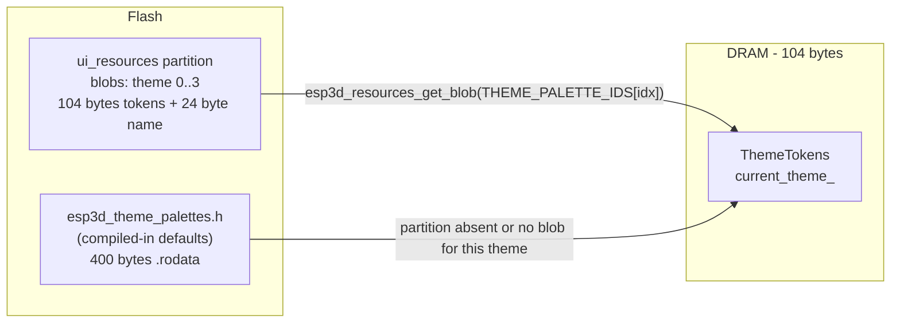

`applyTheme()` attempts to load tokens from the partition blob first. If unavailable (old partition, absent partition, corrupted entry), it silently falls back to the compiled-in palette — the system remains fully functional. Contrast checks using BT.601 luminance are logged after loading to flag insufficient foreground/background separation.

#### 3.3 Theme Name

Each partition palette blob may append an optional 24-byte display name after the 104-byte color block. `loadThemeNames()` reads these once at `initialize()`. If absent, `getThemeName()` returns `"Theme 1"` … `"Theme 4"`.

#### 3.4 SD-Card Theme Update

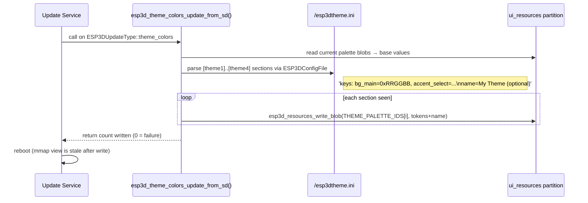

INI values accept either `0xRRGGBB` (6 hex digits, alpha appended as `0xFF`) or `0xRRGGBBAA` (8 digits, explicit alpha). Partial sections and missing keys are legal — missing keys keep the current partition values. See [`docs/ui_resources/theme_palette.md`](https://github.com/luc-github/Pibot-cnc-pendant-firmware/blob/main/docs/ui_resources/theme_palette.md) and the `esp3dtheme.ini.example` preset files for the full ini schema.

#### 3.5 ThemeStyles — LVGL Style Registry

`initializeStyles()` allocates ~40 `lv_style_t` structs in DRAM from the active `ThemeTokens`. All screens and components **must** use `UIManager`'s `apply*Style()` methods rather than `lv_style_init()` directly. This guarantees a single `setTheme()` call atomically refreshes all styles:

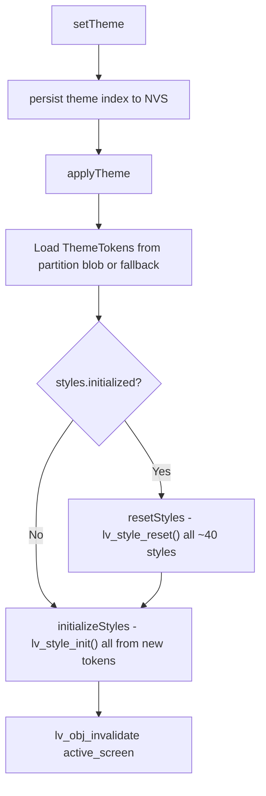

**Style categories and their `apply*` API:**

| Category | Key methods |
|----------|-------------|
| Screen | `applyScreenBackgroundStyle`, `applyScreenContainerStyle`, `applyRotaryContainerStyle`, `applyFramedContainerStyle` |
| Buttons | `applyButtonDefaultStyle(obj, radius)`, `applyButtonSelectedStyle(obj, state)`, `applyButtonDisabledStyle(obj)` |
| Labels | `applyLabelStyle(obj, LabelFontSize::small/medium/big)` |
| Containers | `applyTransparentContainerStyle`, `applyFramedContainerStyle` |
| Status indicators | `applyStatusIndicatorStyle`, `applyStatusClickableAreaStyle`, `applyStatusPressCircleStyle` |
| Circular menu | `applyCircularMenuContainerStyle`, `applyCircularMenuOuterCircleStyle`, `applyCircularMenuInnerCircleStyle`, `applyCircularMenuCenterRingStyle`, `applyCircularMenuCenterLabelStyle`, `applyCircularMenuOuterArcStyle`, `applyCircularMenuInnerArcStyle`, `applyCircularMenuClickZoneStyle`, `applyCircularMenuHandleStyle` |
| Panel items | `applyPanelItemStyle(obj, PanelItemStyleState::Default/Focused/Active)` |
| List menu | `applyListContainerStyle`, `applyListHeaderStyle`, `applyListNodeStyle(obj, selected)`, `tagListNodeStatusColor`, `tagListNodeNonSelectable` |
| Jog / Probe | `applyAxisButtonStyle(obj, active)`, `applyPinLabelStyle(obj, inverted)`, `applyProgressBarStyle`, `applyPotentiometerBarStyle` |
| Status screen | `applySpindleButtonStyle(obj, active)`, `applyPinIndicatorStyle(obj, active)`, `applyJobProgressBarStyle` |
| Probe screen | `applyParamButtonStyle(obj, focused)` |
| Generic / modal | `applyTitleSectionStyle`, `applyMessageListStyle`, `applyContentBoxStyle`, `applyTextareaInputStyle`, `applyTextareaCursorStyle`, `applySpinnerStyle`, `applyMessageBoxStyle` |

> **Style sharing rule:** Styles are shared objects — do **not** call `lv_obj_remove_style_all()` on a styled widget. Use `lv_obj_remove_style(obj, &style, part)` to remove a specific style while leaving others intact.

For the full per-screen style inventory, visual review checklist, and design decisions see [`docs/ui_resources/ui_style_guide.md`](https://github.com/luc-github/Pibot-cnc-pendant-firmware/blob/main/docs/ui_resources/ui_style_guide.md).

#### 3.6 `applyListNodeStyle` — Special Propagation Logic

`applyListNodeStyle()` handles a LVGL inheritance edge case: class styles block token inheritance through child labels. The method directly sets `text_on_active` (selected node) or `text_primary` (unselected) on child label objects. Two LVGL user flags gate per-node behavior:

| Flag | Meaning |
|------|---------|
| `LV_OBJ_FLAG_USER_1` | Node uses status color (e.g. indicator) — skip text recolor |
| `LV_OBJ_FLAG_USER_2` | Node is non-selectable — skip selected styling |

#### 3.7 Sound State During Operations

When `ESP3D_BUZZER_FEATURE` is enabled, `saveSoundStateAndDisable()` / `restoreSoundState()` suppress buzzer activity during silent operations. A reference counter (`sound_state_locker_count`) allows nested calls:

```cpp
ESP3D_SAVE_SOUND_STATE_AND_DISABLE   // → saveSoundStateAndDisable()
// ... silent operation ...
ESP3D_RESTORE_SOUND_STATE            // → restoreSoundState()
```

---

### 4. Resource System — `esp3d_resources.cpp`

The resource system memory-maps the entire `ui_resources` flash partition and resolves images, fonts, and blobs into LVGL-ready descriptors at boot. See [`docs/ui_resources/development.md`](https://github.com/luc-github/Pibot-cnc-pendant-firmware/blob/main/docs/ui_resources/development.md) for the full binary format specification, partition table configuration, and build pipeline integration.

#### 4.1 Partition Binary Layout

```
Offset 0
┌───────────────────────────────────────────┐
│  PartitionHeader  (24 bytes)              │
│  magic="ESP3", variant_key[12],           │
│  num_images, num_fonts, data_section_off  │
├───────────────────────────────────────────┤
│  ImageDirEntry[num_images]  (20 B each)   │
│  id, cf, w, h, stride,                    │
│  data_offset, data_size                   │
├───────────────────────────────────────────┤
│  FontDirEntry[num_fonts]  (16 B each)     │
│  id, data_offset, data_size, slot_size    │
│  (theme palette blobs share this space)   │
├───────────────────────────────────────────┤  ← data_section_offset
│  DATA SECTION                             │
│  ├─ Image pixel data  (XIP read)         │
│  ├─ Font blobs (header+bitmaps, XIP)     │
│  └─ Theme palette blobs (104 B + name)   │
└───────────────────────────────────────────┘
```

`variant_key` (12 bytes, null-padded ASCII) must match the `RESOURCES_VARIANT` compile-time constant. A mismatch is logged and all resources remain at their compiled-in fallbacks — the system stays functional.

#### 4.2 Image Resolution

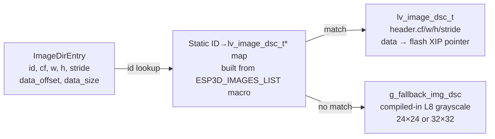

All image descriptors default to `g_fallback_img_dsc` (a resolution-matched L8 grayscale placeholder selected by `RESOURCES_ICON_SIZE` at compile time). Images found in the partition directory overwrite the default descriptor in-place.

#### 4.3 Font Loading — XIP + Shadow Pattern

Font glyph bitmaps stay in flash (read via XIP cache — zero DRAM copy). Only the small pointer-resolution structures live in DRAM:

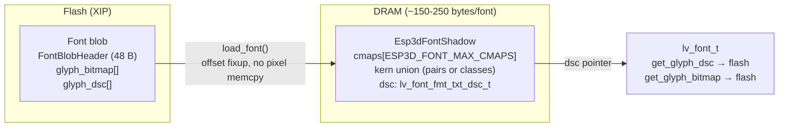

`ESP3D_FONT_MAX_CMAPS = 5` is tuned to the medium font's 5 cmap ranges. `load_font()` validates every table offset against `font_size` before constructing any pointer — a corrupt blob with a valid magic is rejected rather than producing an out-of-bounds flash read at render time.

Two `static_assert` guards validate layout assumptions:
- `LV_FONT_FMT_TXT_LARGE == 0` — required for cmap/kern binary layout
- `sizeof(lv_font_fmt_txt_glyph_dsc_t) == 8` — required for glyph descriptor array stride

#### 4.4 Blob Access (Theme Palettes)

Theme palette blobs are stored in `FontDirEntry` slots, sharing the same directory and ID namespace as fonts. `esp3d_resources_get_blob(id, &size)` returns a const pointer directly into the mmapped partition — valid as long as the partition is mapped and no `esp3d_resources_write_blob()` call has invalidated it.

#### 4.5 Fallback Strategy

| Resource | Fallback when partition is unavailable |
|----------|----------------------------------------|
| Image not in directory | `g_fallback_img_dsc` — build-resolution L8 grayscale placeholder |
| Font not in directory | `lv_font_montserrat_14` (built into LVGL) |
| Theme palette blob absent | `THEME_PALETTES[]` compiled-in FLASH defaults (400 bytes `.rodata`) |
| Partition absent or wrong variant | All images/fonts stay at fallback; system remains functional |

#### 4.6 SD Patch Mechanism

Individual resource overrides can be applied without a full firmware reflash via files placed in `/esp3dres/` on the SD card:

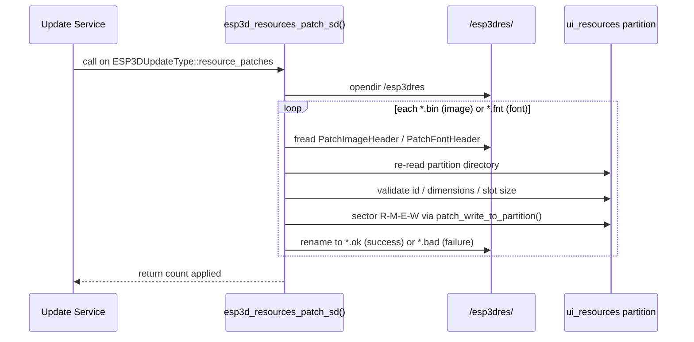

- `*.bin` image patch: must match `cf`, `w`, `h`, `stride`, and `data_size` of the existing directory entry.
- `*.fnt` font patch: blob must fit within `slot_size` (padded slots allow smaller replacements). The `data_size` field in the directory is updated atomically via a separate sector write after the data is written.
- Power loss between the data write and the rename leaves the file un-renamed; the patch is safely re-applied on the next boot.

See [`docs/guides/ui_resources_guide.md`](https://github.com/luc-github/Pibot-cnc-pendant-firmware/blob/main/docs/guides/ui_resources_guide.md) for the end-to-end SD-card update workflow.

---

### 5. Snapshot System — `esp3d_snapshot.h`

When `ESP3D_SNAPSHOT_FEATURE` is enabled, `snapshot_state_t` tracks a live screen capture across multiple BSP flush callbacks:

| Field | Type | Purpose |
|-------|------|---------|
| `file` | `FILE*` | Open output file receiving raw pixel rows |
| `error` | `volatile bool` | Error flag set from the flush callback on write failure |
| `expected_pixels` | `uint32_t` | Total frame pixels for completion detection |
| `captured_pixels` | `volatile uint32_t` | Counter incremented per flush call |
| `mutex` | `SemaphoreHandle_t` | Serializes concurrent access to the state struct |
| `initialized` | `volatile bool` | Guards the flush hook against uninitialized state access |
| `ongoing` | `volatile bool` | Active-capture flag; guards the BSP flush hook path |

The global instance `g_snapshot` is declared in `esp3d_snapshot.h` and consumed by both the BSP flush callback and `esp3d_snapshot_deinit()` in `main/core/esp3d_lvgl.cpp`.

---

### 6. Translation ID Map — `esp3d_translations_id_map.h`

Provides bidirectional lookup between the numeric file IDs used in `.lng` binary packs and the strongly-typed `ESP3DLabel` enum used throughout the UI source.

```cpp
// Flash-stored lookup table (X-macro generated from .inc definition files)
static const ESP3DTranslationIdEntry ESP3DTranslationIdMap[];

// Bidirectional API (inline, linear scan):
ESP3DLabel label = getLabelFromFileId(file_id);            // .lng numeric ID → enum
uint16_t   id    = getFileIdFromLabel(ESP3DLabel::btn_ok); // enum → .lng numeric ID
```

The table is stored in `.rodata` (flash) to avoid DRAM pressure. An unknown file ID returns `ESP3DLabel::unknown_index`; an unknown label returns `UINT16_MAX`.

See [translations.md](translations.md) for the full `.lng` binary format and `ESP3DTranslationService` pipeline.

---

## Data Flow Diagrams

### Full Initialization Flow

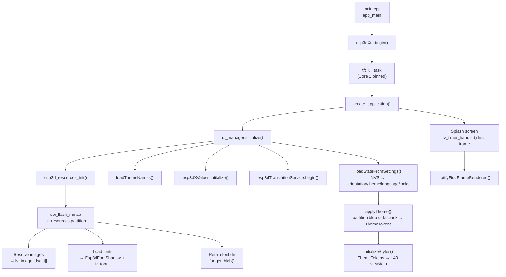

### Theme Change Flow

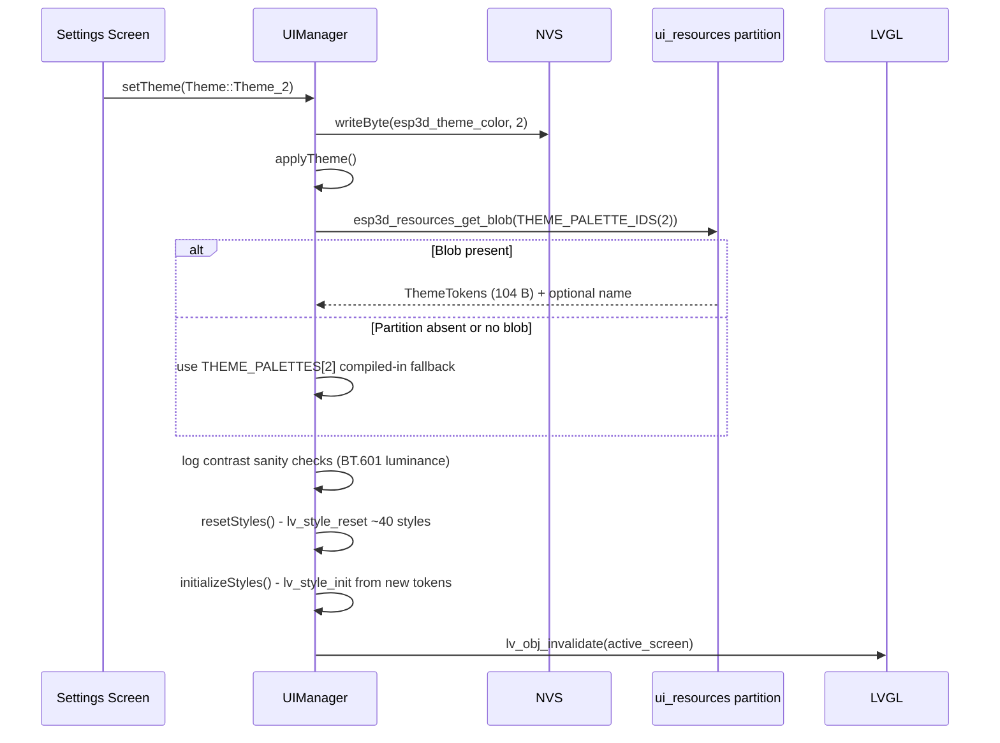

### Resource SD Patch Flow

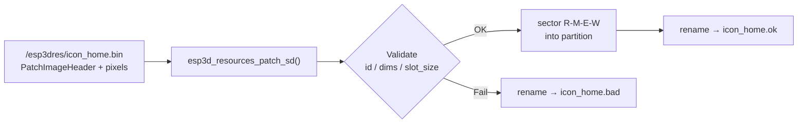

---

## Integration with Other Modules

| Module | Relationship |
|--------|-------------|
| [Core_Platform_&_Infrastructure.md](Core_Platform_and_Infrastructure.md) | `UIManager` reads/writes NVS via `esp3dXsettings`; notifies `ESP3DValues` on orientation change; uses `esp3d_log` macros throughout |
| [Hardware_Peripheral_Drivers.md](Hardware_Peripheral_Drivers.md) | `ESP3DXUi` starts the `RenderingClient`; BSP `lvgl_flush_cb` / `increase_lvgl_tick` are provided by each board's `board_init.c` |
| [values.md](values.md) | `esp3dXValues.handle()` is called inside the LVGL tick loop to propagate observable value changes to UI widgets without polling |
| [translations.md](translations.md) | `UIManager::setLanguage()` restarts `ESP3DTranslationService`; `ESP3DTranslationIdMap` maps numeric IDs from `.lng` packs to `ESP3DLabel` enum values used in all UI source |

---

## Critical Constraints

| Rule | Rationale |
|------|-----------|
| All `lv_obj_*` / `lv_style_*` calls must be inside `_lock_acquire` / `_lock_release` or within LVGL event/timer callbacks | LVGL is strictly single-threaded on Core 1 |
| Never destroy LVGL objects inside an event callback | Use `lv_timer_create()` cleanup timers — see [`docs/architecture/screen_transitions_flow.md`](https://github.com/luc-github/Pibot-cnc-pendant-firmware/blob/main/docs/architecture/screen_transitions_flow.md) |
| `initializeStyles()` / `resetStyles()` only from the LVGL task or before it starts | `lv_style_*` APIs are not thread-safe |
| Never call `lv_obj_remove_style_all()` on widgets styled via `apply*Style()` | Styles are shared objects; removing all strips them from the shared pool, affecting all other widgets using the same style |
| `esp3d_resources_init()` is idempotent — safe to call multiple times | Guarded by `g_img_base != nullptr` check |
| After `esp3d_resources_write_blob()`, the mmap view is stale | The update service must reboot immediately after a successful write |
| All `calloc`/`malloc` in the resource and theme update paths must be checked | System operates on constrained heap (as low as 10 KB free in BT mode); any allocation failure must be logged with total free and largest block |
| `LV_FONT_FMT_TXT_LARGE == 0` must hold | Required for the font blob binary layout assumed by `load_font()`; validated at build time via `static_assert` |

---

## Related Documentation

| Document | Content |
|----------|---------|
| [`docs/architecture/screens_architecture.md`](https://github.com/luc-github/Pibot-cnc-pendant-firmware/blob/main/docs/architecture/screens_architecture.md) | Screen base types, `GenericScreen` / `CircularMenuScreen` / `ListMenuScreen` inheritance and registration patterns |
| [`docs/architecture/screen_transitions_flow.md`](https://github.com/luc-github/Pibot-cnc-pendant-firmware/blob/main/docs/architecture/screen_transitions_flow.md) | Timer-based safe screen transition patterns; cleanup timer idiom for safe object destruction |
| [`docs/ui_resources/development.md`](https://github.com/luc-github/Pibot-cnc-pendant-firmware/blob/main/docs/ui_resources/development.md) | `ui_resources` partition binary format (byte-map), `esp3d_resources.h` full API, `generate_resources.py`, SD-card update mechanisms |
| [`docs/ui_resources/theme_palette.md`](https://github.com/luc-github/Pibot-cnc-pendant-firmware/blob/main/docs/ui_resources/theme_palette.md) | Authoritative 26-token reference; per-theme RGBA values; design conventions |
| [`docs/ui_resources/ui_style_guide.md`](https://github.com/luc-github/Pibot-cnc-pendant-firmware/blob/main/docs/ui_resources/ui_style_guide.md) | `ThemeStyles` architecture; full `apply*` catalog; per-screen style inventory and visual review checklist |
| [`docs/guides/ui_resources_guide.md`](https://github.com/luc-github/Pibot-cnc-pendant-firmware/blob/main/docs/guides/ui_resources_guide.md) | How to add/modify icons and fonts; regenerate `ui_resources.bin`; SD-card update and no-PC workflow |
| [`docs/guides/esp3d_log_guide.md`](https://github.com/luc-github/Pibot-cnc-pendant-firmware/blob/main/docs/guides/esp3d_log_guide.md) | `esp3d_log` / `esp3d_log_d` macros and hook registration used by `esp3d_system_message_hook_log_errors()` |
| [`docs/guides/esp32_memory_constraints.md`](https://github.com/luc-github/Pibot-cnc-pendant-firmware/blob/main/docs/guides/esp32_memory_constraints.md) | Heap fragmentation guidance; why `largest_free_block` matters more than total free heap |


## Documents de conception (depot)

- [Lvgl refresh optimization guide](https://github.com/luc-github/Pibot-cnc-pendant-firmware/blob/main/docs/guides/Lvgl%20refresh%20optimization%20guide.md)
- [ui_resources_customization](https://github.com/luc-github/Pibot-cnc-pendant-firmware/blob/main/docs/user%20documentation/ui_resources_customization.md)
