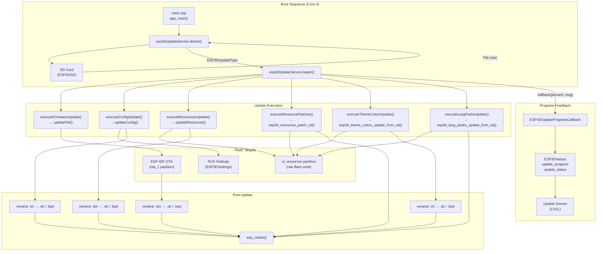
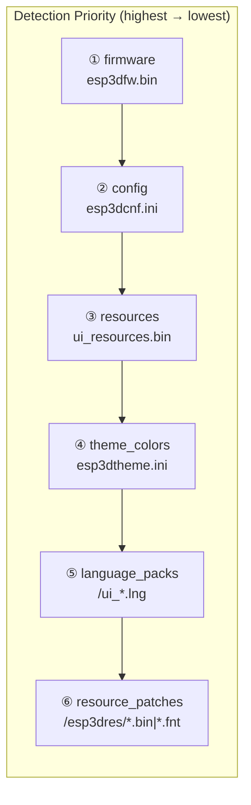
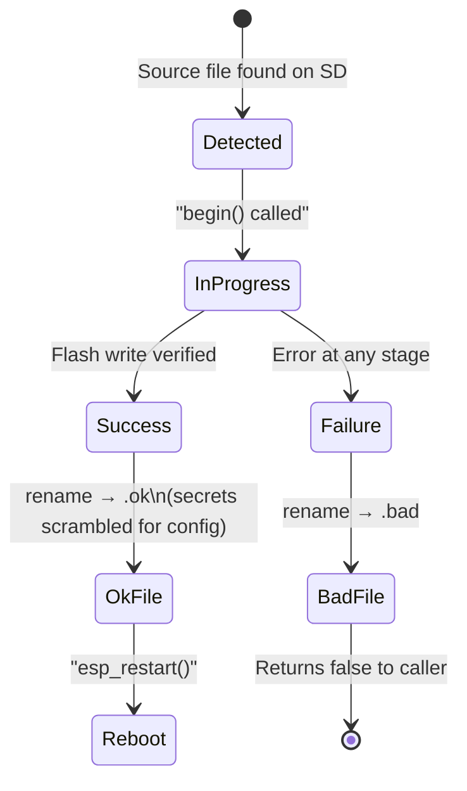
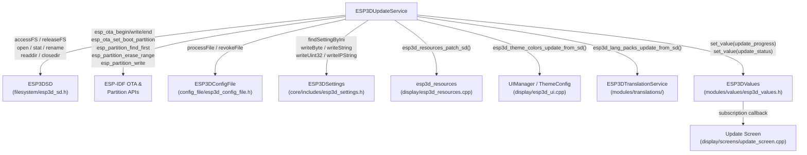
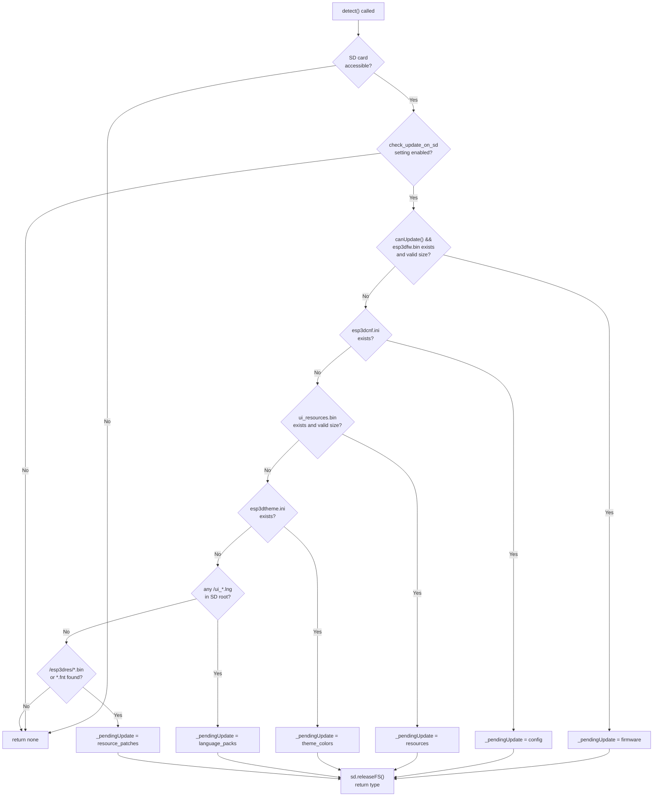
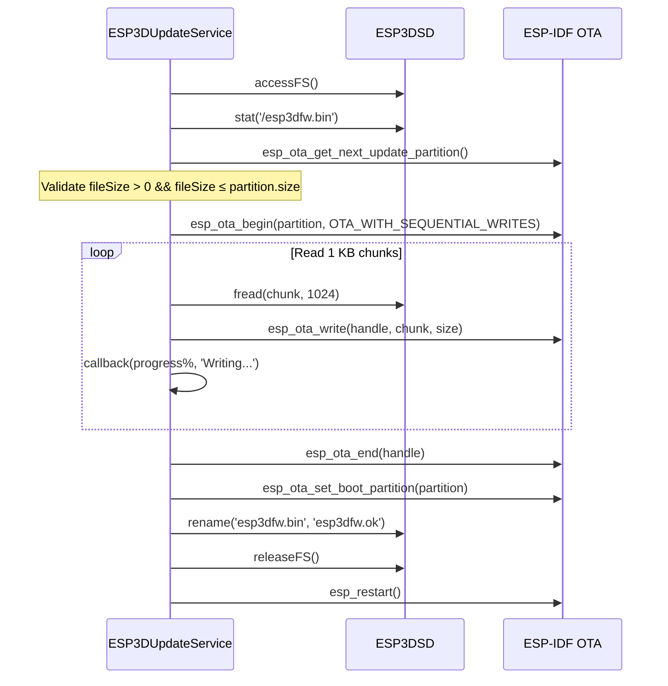
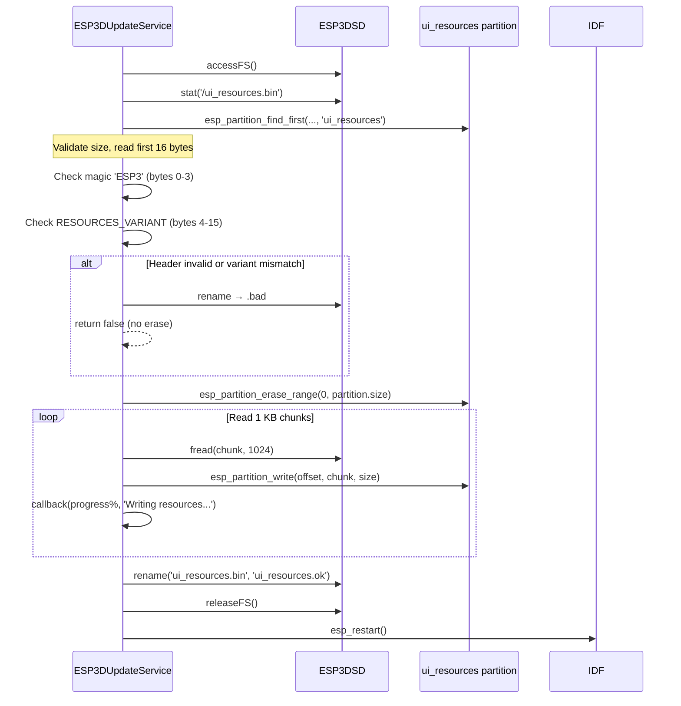
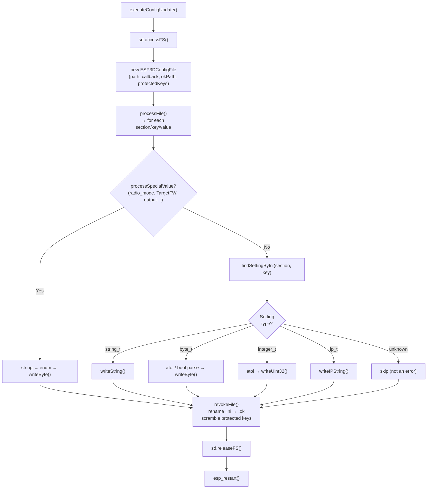
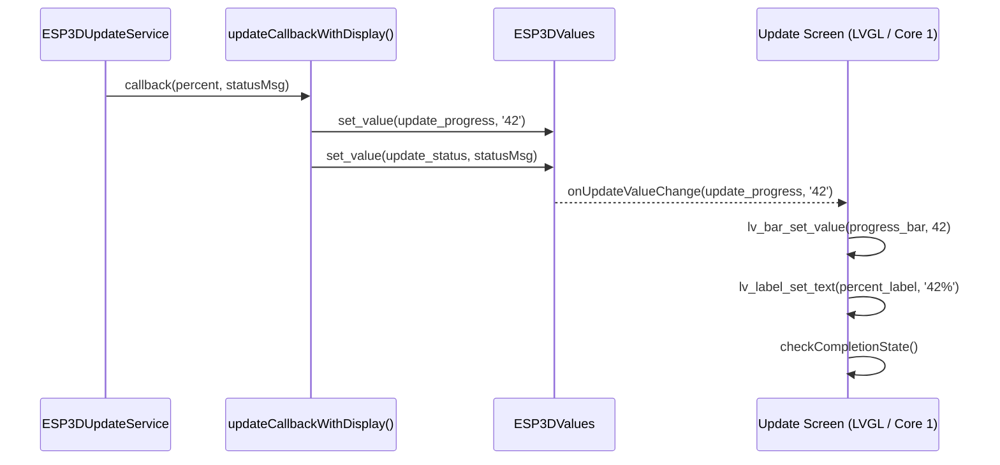
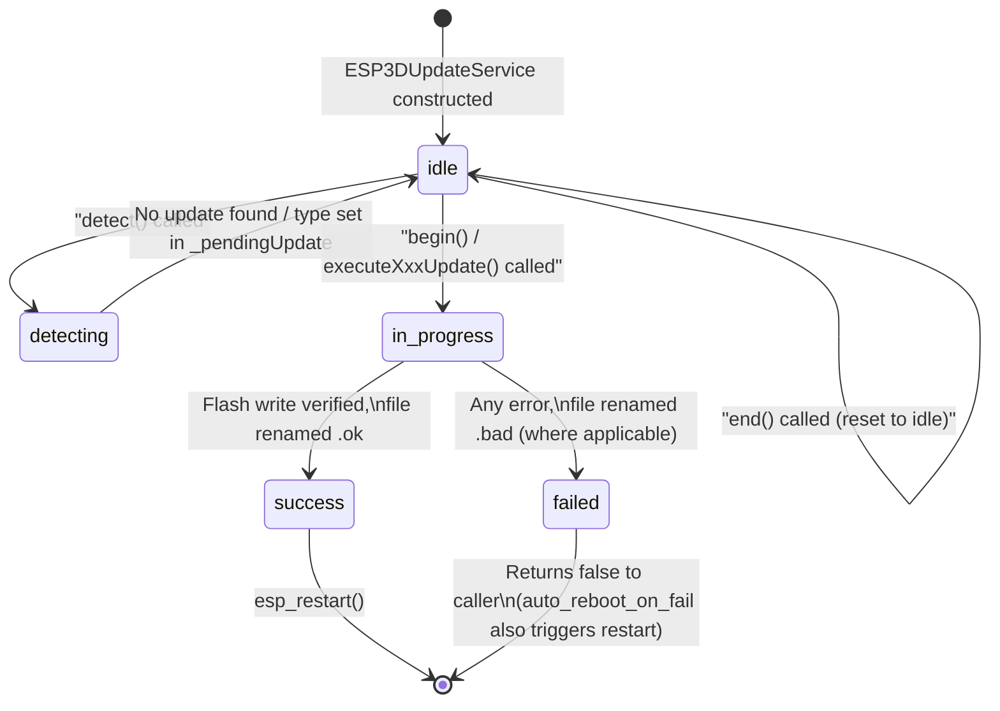

# Update Service

## Overview

The **Update Service** (`ESP3DUpdateService`) is the central orchestrator for all SD-card-based update operations on the pendant firmware. It handles six distinct update types — firmware (OTA), configuration settings (INI), UI resources (images + fonts partition), individual resource patches, theme colour palettes, and language packs — all sourced from the SD card.

The service runs as a synchronous, blocking operation during boot (before the LVGL UI task starts), and exposes a progress callback so the Update Screen can render live feedback via the `ESP3DValues` observable system.

A global singleton `esp3dUpdateService` is declared in the header and is the only instance used throughout the firmware.

---

## Architecture



---

## Module Location

| File | Role |
|---|---|
| `main/modules/update/esp3d_update_service.h` | Class declaration, enums, file path macros |
| `main/modules/update/esp3d_update_service.cpp` | All update logic implementation |

---

## Update Types

The `ESP3DUpdateType` enum defines the priority-ordered set of updates the service can detect and apply:



Only **one** update type is executed per boot cycle. Once a higher-priority update file is found, lower-priority files are ignored until the next boot.

| Enum Value | Priority | Source File(s) | Flash Target |
|---|---|---|---|
| `firmware` | 1 (highest) | `/esp3dfw.bin` | OTA partition (`ota_1`) |
| `config` | 2 | `/esp3dcnf.ini` | NVS (all settings) |
| `resources` | 3 | `/ui_resources.bin` | `ui_resources` data partition |
| `theme_colors` | 4 | `/esp3dtheme.ini` | `ui_resources` partition (palette slots) |
| `language_packs` | 5 | `/ui_*.lng` (any matching file) | `ui_resources` partition (language slots) |
| `resource_patches` | 6 (lowest) | `/esp3dres/*.bin`, `/esp3dres/*.fnt` | `ui_resources` partition (individual entries) |
| `none` | — | — | — |

> **Note:** `firmware` updates require a valid second OTA slot (`ota_1`). Boards with a single-app-slot layout cannot self-update firmware — the service detects this via `canUpdate()` and skips the firmware check entirely, but still applies resource/config/theme/language updates.

---

## File Naming Convention

After an update, the service renames the source file to signal the outcome. If a `.ok` or `.bad` file already exists from a previous run, the old file is first renamed with a numeric suffix (`*.ok1`, `*.ok2`, …) to preserve history.



| Source | On Success | On Failure |
|---|---|---|
| `/esp3dfw.bin` | `/esp3dfw.ok` | `/esp3dfw.bad` |
| `/esp3dcnf.ini` | `/esp3dcnf.ok` *(secrets scrambled)* | `/esp3dcnf.bad` |
| `/ui_resources.bin` | `/ui_resources.ok` | `/ui_resources.bad` |
| `/esp3dtheme.ini` | `/esp3dtheme.ok` | `/esp3dtheme.bad` |
| `/ui_*.lng` | `/ui_*.ok` *(renamed by translation service)* | `/ui_*.bad` |

---

## Dependency Graph



- **[Storage & Configuration — Filesystem](filesystem.md)** — SD card access is gated through `sd.accessFS()` / `sd.releaseFS()`. All file I/O goes via the `ESP3DSD` abstraction.
- **[Storage & Configuration — Config File](config_file.md)** — INI parsing and `.ok` file generation (with secret scrambling) are delegated entirely to `ESP3DConfigFile`.
- **[Core Platform — Settings](config_file.md)** — Setting validation and NVS writes go through `ESP3DSettings`.
- **[UI Framework — Screens](common_screens.md)** — The update screen subscribes to `ESP3DValuesIndex::update_progress` and `update_status` to render the progress bar and status text in real time.
- **[UI Framework — Resources](ui_core.md)** — `esp3d_resources_patch_sd()` applies individual binary/font patches to the `ui_resources` partition. See also [UI Resources — Development Reference](https://github.com/luc-github/Pibot-cnc-pendant-firmware/blob/main/docs/ui_resources/development.md).

---

## Detection Flow



---

## Firmware Update Flow

Firmware updates use the ESP-IDF OTA API. The service validates that a genuine second OTA slot exists (single-slot boards are rejected by `canUpdate()`) and that the binary fits within the partition before touching flash.



> **Memory note:** The 1 KB chunk buffer is heap-allocated (`malloc(CHUNK_BUFFER_SIZE)`) rather than stack-allocated, to avoid stack overflow. It is freed immediately after the write loop.

---

## UI Resources Update Flow

The `ui_resources` partition holds all images, fonts, theme data, and language slots used by LVGL. Before erasing the partition the binary is validated against an `ESP3` magic header and the board-specific `RESOURCES_VARIANT` key to prevent flashing a wrong-board image onto a healthy partition.



For details on the binary format validated by this header check, see [UI Resources — Development Reference](https://github.com/luc-github/Pibot-cnc-pendant-firmware/blob/main/docs/ui_resources/development.md).

---

## Configuration Update Flow

Config updates parse an INI-formatted file (`/esp3dcnf.ini`) and write each key/value pair into NVS via `ESP3DSettings`. After a successful parse, `revokeFile()` renames the INI to `.ok` and scrambles the values of protected security keys so credentials are not left in plain text on the SD card.



### Protected Keys (Scrambled in `.ok` File)

The following settings are automatically obfuscated when the `.ini` is renamed to `.ok`, so sensitive credentials are never stored in clear text on the SD card after a successful config update:

| Key | Setting |
|---|---|
| `NOTIF_TOKEN1` | Notification service token 1 |
| `NOTIF_TOKEN2` | Notification service token 2 |
| `AP_Password` | Wi-Fi access-point password |
| `STA_Password` | Wi-Fi station password |
| `ADMIN_PASSWORD` | HTTP admin password |
| `USER_PASSWORD` | HTTP user password |
| `BT_Pin` | Bluetooth PIN |
| `BLE_Passkey` | BLE passkey |

---

## INI Special Value Mapping

Certain settings require string-to-enum translation before being written to NVS. `processSpecialValue()` handles these before the generic `findSettingByIni()` lookup. Values equal to the scramble sentinel (`HIDDEN_SETTING_VALUE`) are silently skipped.

| Section | Key | Accepted String Values |
|---|---|---|
| `network` | `radio_mode` | `BT`, `STA`, `AP`, `SETUP`, `OFF` |
| `network` | `sta_fallback` | `BT`, `WIFI-SETUP`, `OFF` |
| `network` | `STA_IP_mode` | `DHCP`, `STATIC` |
| `system` | `TargetFW` | `GRBL`, `GRBLHAL`, `MARLIN`, `SMOOTHIEWARE`, `REPETIER`, `HP_GL`, `FLUIDNC`, `None` |
| `system` | `output` | `USB`, `SERIAL`, `UARTEXT` / `UART_EXT` / `EXTERNAL_MODULE` |
| `services` | `NOTIF_TYPE` | `None`, `PushOver`, `Email`, `Telegram`, `IFTTT` |

Boolean strings (`yes`/`no`, `on`/`off`, `true`/`false`, `1`/`0`) are accepted for all `byte_t` settings. Unknown section/key pairs are logged and silently skipped — they are not treated as errors.

---

## Progress Feedback and UI Integration

The service communicates update progress to the LVGL Update Screen through the `ESP3DValues` observable layer, keeping the update logic fully decoupled from the display stack.



> **Font safety during resources update:** The update screen uses only the built-in `lv_font_montserrat_14` (embedded in the firmware binary) for all labels. It never uses XIP fonts from the `ui_resources` partition because that partition may be partially erased during a resources update, making its flash-mapped data unsafe to read.

The `ESP3DUpdateWaitBeforeRebootFn` hook lets the update screen gate the reboot on its final render cycle completing, instead of the service performing a blind `esp3d_hal::wait()` sleep of fixed duration.

---

## Status State Machine



---

## Public API Reference

### `ESP3DUpdateService`

```cpp
// Lifecycle
bool begin(ESP3DUpdateProgressCallback callback = nullptr,
           bool detectType = true,
           bool auto_reboot_on_fail = true,
           uint16_t delay = 1000,
           ESP3DUpdateWaitBeforeRebootFn waitBeforeReboot = nullptr);
void handle();   // reserved for periodic tasks, currently no-op
void end();      // resets status and pendingUpdate to idle/none

// Detection (does NOT execute the update)
ESP3DUpdateType detect();

// Individual executors (called internally by begin())
bool executeFirmwareUpdate(ESP3DUpdateProgressCallback callback = nullptr);
bool executeConfigUpdate(ESP3DUpdateProgressCallback callback = nullptr);
bool executeResourcesUpdate(ESP3DUpdateProgressCallback callback = nullptr);
bool executeResourcePatches(ESP3DUpdateProgressCallback callback = nullptr);
bool executeThemeColorsUpdate(ESP3DUpdateProgressCallback callback = nullptr);
bool executeLangPacksUpdate(ESP3DUpdateProgressCallback callback = nullptr);

// Status queries
ESP3DUpdateType   getPendingUpdate()    const;  // set after detect()
ESP3DUpdateStatus getStatus()           const;
size_t            getFirmwareSize()     const;  // valid after detect() if firmware pending
size_t            getResourcesSize()    const;  // valid after detect() if resources pending
const char*       getErrorMessage()     const;  // last error string

// Partition capability checks
bool   canUpdate();              // safe OTA slot available and distinct from running
bool   canUpdateResources();     // ui_resources partition present in partition table
size_t maxUpdateSize();          // OTA partition size in bytes (0 if none)
size_t maxResourcesUpdateSize(); // ui_resources partition size in bytes (0 if absent)

// INI file processing callback (static; passed to ESP3DConfigFile)
static bool processingFileFunction(const char* section,
                                   const char* key,
                                   const char* value);
```

### Callback Types

```cpp
// Progress notification: percent 0–100, human-readable status string
using ESP3DUpdateProgressCallback = std::function<void(uint8_t percent, const char* status)>;

// Optional hook to delay/gate reboot after a successful update
// (e.g. wait for LVGL to render the final completion screen)
using ESP3DUpdateWaitBeforeRebootFn = std::function<void(uint16_t delay_ms)>;
```

### File Path Macros

| Macro | Value |
|---|---|
| `ESP3D_FW_FILE` | `/esp3dfw.bin` |
| `ESP3D_FW_FILE_OK` | `/esp3dfw.ok` |
| `ESP3D_FW_FILE_BAD` | `/esp3dfw.bad` |
| `ESP3D_CONFIG_FILE` | `/esp3dcnf.ini` |
| `ESP3D_CONFIG_FILE_OK` | `/esp3dcnf.ok` |
| `ESP3D_CONFIG_FILE_BAD` | `/esp3dcnf.bad` |
| `ESP3D_RESOURCES_FILE` | `/ui_resources.bin` |
| `ESP3D_RESOURCES_FILE_OK` | `/ui_resources.ok` |
| `ESP3D_RESOURCES_FILE_BAD` | `/ui_resources.bad` |
| `ESP3D_THEME_FILE` | `/esp3dtheme.ini` |
| `ESP3D_THEME_FILE_OK` | `/esp3dtheme.ok` |
| `ESP3D_THEME_FILE_BAD` | `/esp3dtheme.bad` |

---

## Build-Time Feature Guards

The update service is conditionally compiled based on `CMakeLists.txt` feature options:

| Guard | Controlled Behaviour |
|---|---|
| `ESP3D_SD_CARD_FEATURE` | All SD-sourced update paths (firmware, config, resources, theme, language, patches) |
| `ESP3D_DISPLAY_FEATURE` | Resource patches, theme colours, language packs (require `esp3d_resources` and `UIManager`) |
| `ESP3D_WIFI_FEATURE` | Wi-Fi-specific INI keys (`STA_IP_mode`, `sta_fallback`, `STA`/`AP`/`SETUP` radio modes) |
| `ESP3D_NOTIFICATIONS_FEATURE` | `NOTIF_TYPE` INI key mapping |
| `ESP3D_USB_SERIAL_FEATURE` | `USB` output client INI value |
| `ESP3D_UART_EXT_FEATURE` | `UARTEXT` / `UART_EXT` / `EXTERNAL_MODULE` output client INI values |

---

## Memory Constraints

- The chunk buffer (`CHUNK_BUFFER_SIZE` = 1024 bytes) is heap-allocated and freed immediately after the write loop.  
- No large stack allocations exist in any update path.  
- `std::string` is used only for file-suffix collision avoidance in `renameToOk()` / `renameToBad()`, which run after the main flash write — not in the hot path.  
- All `malloc()` calls are guarded; a `nullptr` result produces a logged error and returns `false` immediately.  

For general memory budget guidance see [ESP32 Memory Constraints](https://github.com/luc-github/Pibot-cnc-pendant-firmware/blob/main/docs/guides/esp32_memory_constraints.md).

---

## Related Documentation

- [Storage & Configuration — Filesystem](filesystem.md)
- [Storage & Configuration — Config File](config_file.md)
- [Core Platform — Settings](config_file.md)
- [UI Framework — Core](ui_core.md)
- [UI Framework — Common Screens](common_screens.md)
- [Features — OTA Update](https://github.com/luc-github/Pibot-cnc-pendant-firmware/blob/main/docs/features/update_ota.md)
- [UI Resources — Development Reference](https://github.com/luc-github/Pibot-cnc-pendant-firmware/blob/main/docs/ui_resources/development.md)
- [UI Resources Guide](https://github.com/luc-github/Pibot-cnc-pendant-firmware/blob/main/docs/guides/ui_resources_guide.md)
- [Board Build Guidelines](https://github.com/luc-github/Pibot-cnc-pendant-firmware/blob/main/docs/guides/board_build_guidelines.md)
- [ESP32 Memory Constraints](https://github.com/luc-github/Pibot-cnc-pendant-firmware/blob/main/docs/guides/esp32_memory_constraints.md)
