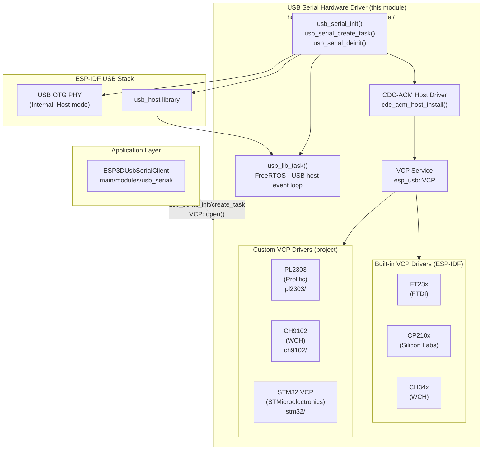
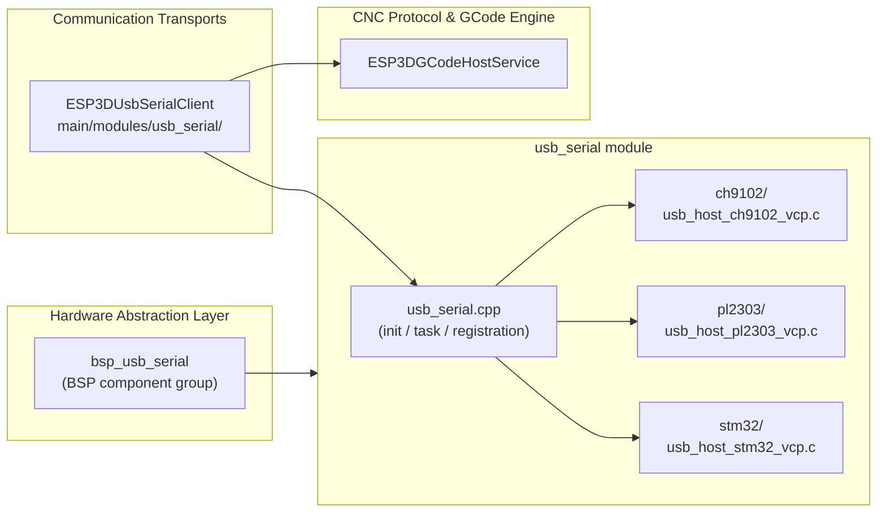
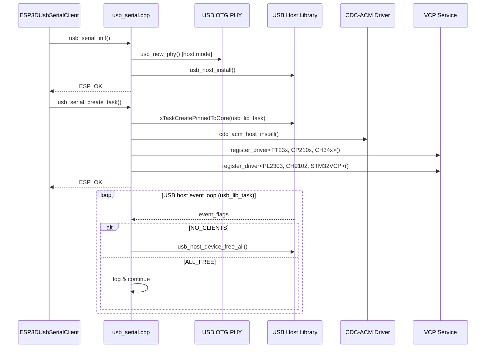
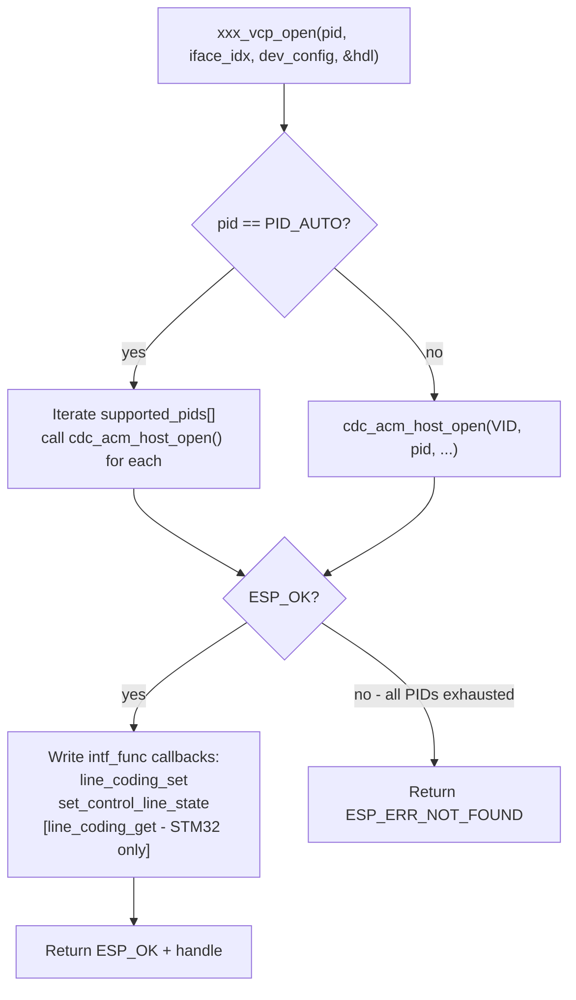
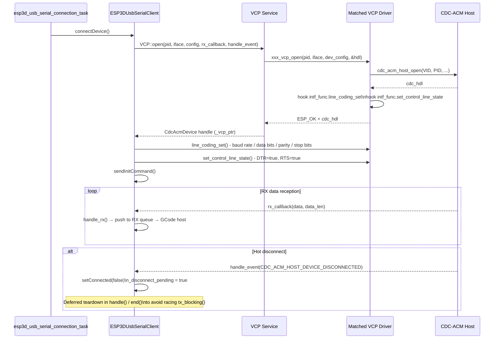
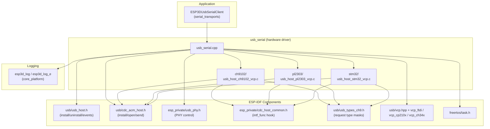

# USB Serial Module

The `usb_serial` module provides low-level USB OTG host-mode serial communication for the Pibot CNC Pendant firmware. It initializes the ESP32-S3's built-in USB OTG peripheral in host mode, installs the ESP-IDF USB Host library and CDC-ACM host driver, and registers a set of Virtual COM Port (VCP) chip drivers that collectively cover the most common USB-to-serial adapters found on CNC controller boards. It is implemented in `hardware/drivers_usb_otg/usb_serial/` and is consumed by the application-level [`ESP3DUsbSerialClient`](Communication_Transports.md), which handles buffering, reconnection, and GCode pipeline integration.

---

## Module Purpose and Scope

| Concern | Owner |
|---|---|
| USB PHY initialization (host mode) | This module |
| USB Host library lifecycle | This module |
| CDC-ACM host driver installation | This module |
| VCP driver registration (6 chipsets) | This module |
| USB host event loop (`usb_lib_task`) | This module |
| Device open / baud-rate / control-line negotiation | This module (VCP drivers) |
| Connection polling, RX buffering, GCode pipeline | [`ESP3DUsbSerialClient`](Communication_Transports.md) |
| Board-level pinning and BSP integration | [`bsp_usb_serial`](bsp_usb_serial.md) |

---

## Architecture Overview



---

## Directory Structure

```
hardware/drivers_usb_otg/usb_serial/
├── usb_serial.cpp          ← PHY init, host library install, task creation, VCP registration
├── usb_serial.h            ← Public C API declarations
├── usb_serial_def.h        ← Task stack / priority / core constants
├── ch9102/
│   ├── usb_host_ch9102_vcp.c   ← CH9102 VCP driver (baud algorithm, LCR, modem control)
│   ├── vcp_ch9102.hpp          ← C++ VCP wrapper (auto-detect + open)
│   └── vcp_ch9102.h            ← VID/PID constants
├── pl2303/
│   ├── usb_host_pl2303_vcp.c   ← PL2303 VCP driver
│   ├── vcp_pl2303.hpp
│   └── vcp_pl2303.h
└── stm32/
    ├── usb_host_stm32_vcp.c    ← STM32 native USB CDC driver
    ├── vcp_stm32.hpp
    └── vcp_stm32.h
```

> FT23x, CP210x, and CH34x are handled by the ESP-IDF `usb_host` component's built-in VCP drivers. No custom `.c` file is needed for those chipsets.

---

## Component Relationships



---

## Core Functions

### `usb_serial_init()`

Bootstraps the USB host stack. Must be called once before any VCP device can be opened.

```c
esp_err_t usb_serial_init();
```

Internal sequence:
```
usb_new_phy()         ← USB_PHY_CTRL_OTG / USB_PHY_TARGET_INT / USB_OTG_MODE_HOST / speed auto
usb_host_install()    ← skip_phy_setup=true, ESP_INTR_FLAG_LEVEL1, no enum filter
```

The PHY handle is stored in the module-private `phy_hdl` static variable; `skip_phy_setup = true` prevents the host library from reconfiguring the already-initialized PHY.

---

### `usb_serial_create_task()`

Creates the `usb_lib` FreeRTOS task and completes stack bringup.

```c
esp_err_t usb_serial_create_task();
```

Steps performed:
1. `xTaskCreatePinnedToCore(usb_lib_task, "usb_lib", ...)` — pinned to `ESP3D_USB_LIB_TASK_CORE`
2. `cdc_acm_host_install(NULL)`
3. Six `VCP::register_driver<T>()` calls (in order: FT23x, CP210x, CH34x, PL2303, CH9102, STM32VCP)

Returns `ESP_FAIL` if the task cannot be created or CDC-ACM installation fails.

---

### `usb_lib_task(void *arg)`

Permanent FreeRTOS task. Blocks on `usb_host_lib_handle_events(portMAX_DELAY, &event_flags)` and reacts to library events:

| Event flag | Action |
|---|---|
| `USB_HOST_LIB_EVENT_FLAGS_NO_CLIENTS` | Calls `usb_host_device_free_all()` to release device memory when no client holds an open handle |
| `USB_HOST_LIB_EVENT_FLAGS_ALL_FREE` | Logs the event; continues the loop to support hot-reconnection without a reboot |

The `usb_host_lib_handle_events()` call is wrapped in a `try/catch(...)` block to absorb spurious C++ exceptions produced by the IDF USB stack on certain hot-unplug race conditions. Catching the exception prevents the task from crashing and preserves reconnection capability.

---

### `usb_serial_deinit()`

Tears down the full USB stack in reverse order:

```c
esp_err_t usb_serial_deinit();
```

```
usb_serial_delete_task()    → cdc_acm_host_uninstall() then vTaskDelete
usb_host_device_free_all()
usb_host_uninstall()        ← may return ESP_ERR_INVALID_STATE if device still connected (logged, not fatal)
usb_del_phy(phy_hdl)
phy_hdl = NULL
```

### `usb_serial_delete_task()`

Attempts `cdc_acm_host_uninstall()` first. If that fails (e.g., device still active), it force-deletes the task handle and returns `ESP_OK` to allow the caller to continue teardown.

---

## Initialization Sequence



---

## VCP Driver Interface

Each VCP driver plugs into the CDC-ACM framework by overwriting three function pointers on the `cdc_acm_dev_hdl_t` handle after successfully calling `cdc_acm_host_open()`:

```c
cdc_hdl->intf_func.line_coding_set        = <driver>_line_coding_set;
cdc_hdl->intf_func.set_control_line_state = <driver>_set_control_line_state;
cdc_hdl->intf_func.line_coding_get        = <driver>_line_coding_get; // STM32 only
```

This hook pattern means the upper layer's calls to `cdc_acm_host_line_coding_set()` and `cdc_acm_host_set_control_line_state()` transparently dispatch to the correct chip-specific protocol with no changes required in `ESP3DUsbSerialClient`.

### VCP Open Flow (common pattern)



---

## Custom VCP Drivers

### CH9102 (WCH CH9102F / CH9102X)

**File:** `ch9102/usb_host_ch9102_vcp.c`  
**VID:** `0x1A86` | **Auto-probe PIDs:** `CH9102F_PID`, `CH9102X_PID`

Uses vendor-specific requests (`CMD_WRITE = 0x9A`) to a register interface — not standard CDC class requests.

#### Baud Rate Encoding

A clock pre-scaler `b` is selected by baud-rate band, then an 8-bit factor `a` is computed with nearest-integer rounding:

| Baud range | Clock source | Pre-scaler `b` |
|---|---|---|
| > 23 529 bps | 6 000 000 Hz | 3 |
| > 2 941 bps | 750 000 Hz | 2 |
| > 367 bps | 93 750 Hz | 1 |
| ≤ 367 bps | 11 719 Hz | 0 |

Two hard-coded special cases: `921 600 bps → (0xF3, 7)`, `307 200 bps → (0xD9, 7)`.

Result written to register `0x1312` as `(factor << 8) | divisor | 0x80` via a `CH9102_CMD_WRITE` vendor request.

#### Line Control Register (`0x2518`)

| Bit(s) | Meaning |
|---|---|
| `0x80` | Enable RX |
| `0x40` | Enable TX |
| `0x20` | Mark/space parity select |
| `0x10` | Even parity |
| `0x08` | Parity enable |
| `0x04` | 2 stop bits (1 stop bit when clear) |
| `0x03/02/01/00` | 8/7/6/5 data bits |

#### Modem Control

`CMD_MODEM_OUT (0xA4)` — DTR → bit 5 (`0x20`), RTS → bit 6 (`0x40`). Both written in a single vendor request.

---

### PL2303 (Prolific PL2303 family)

**File:** `pl2303/usb_host_pl2303_vcp.c`  
**VID:** `0x067B` | **Auto-probe PIDs:** `PL2303_PID`, `PL2303_PID_HXD`, `PL2303_PID_RSAQ2`, `PL2303_PID_DCU11`

Uses vendor-class requests (request type `0x40`) aligned with the Linux PL2303 HX driver protocol.

#### Baud Rate

The 32-bit baud rate is split across two fields of a vendor `SET_LINE_CTL (0x20)` request:
- `wValue` = upper 16 bits of baud rate
- `wIndex` = lower 16 bits of baud rate

#### Line Control Word

Data bits, parity, and stop bits are ORed into a 16-bit value and written via a second `SET_LINE_CTL` request:

| Parameter | Value encoding |
|---|---|
| Data bits | 5→`0x00`, 6→`0x01`, 7→`0x02`, 8→`0x03` |
| Parity | None/Odd/Even/Mark/Space → `0x00/0x08/0x18/0x28/0x38` |
| Stop bits | 1→`0x00`, 2→`0x04` |

#### Modem Control

DTR and RTS are set and cleared with four separate vendor write requests:

| Signal | Set | Clear |
|---|---|---|
| DTR | `0x12` | `0x11` |
| RTS | `0x14` | `0x13` |

---

### STM32 VCP (STMicroelectronics)

**File:** `stm32/usb_host_stm32_vcp.c`  
**VID:** `0x0483` | **Auto-probe PIDs:** F4 Discovery, F1 Bluepill, G0/H7/L4 Nucleo

STM32 firmware that enables the USB VCP peripheral presents a standard CDC device. All control uses `USB_BM_REQUEST_TYPE_TYPE_CLASS | USB_BM_REQUEST_TYPE_RECIP_INTERFACE` — no vendor commands.

| Function | CDC request | Direction |
|---|---|---|
| `stm32_line_coding_set` | `USB_CDC_REQ_SET_LINE_CODING` | Class, interface OUT |
| `stm32_line_coding_get` | `USB_CDC_REQ_GET_LINE_CODING` | Class, interface IN |
| `stm32_set_control_line_state` | `USB_CDC_REQ_SET_CONTROL_LINE_STATE` | Bitmap: DTR = bit 0, RTS = bit 1 |

> STM32VCP is the **only driver in this module that implements `line_coding_get`**, enabling the host to read back the device's live configuration.

---

## Supported Chipsets Summary

| Chipset | Vendor | VID | Driver source | Auto-probe PIDs |
|---|---|---|---|---|
| FT23x | FTDI | `0x0403` | ESP-IDF built-in | Yes |
| CP210x | Silicon Labs | `0x10C4` | ESP-IDF built-in | Yes |
| CH34x | WCH | `0x1A86` | ESP-IDF built-in | Yes |
| PL2303 | Prolific | `0x067B` | Project custom | PL2303, HXD, RSAQ2, DCU11 |
| CH9102F/X | WCH | `0x1A86` | Project custom | CH9102F, CH9102X |
| STM32 VCP | STMicroelectronics | `0x0483` | Project custom | F1/F4/G0/H7/L4 boards |

---

## Device Connection Data Flow



---

## FreeRTOS Task Summary

| Task name | Function | Stack constant | Priority constant | Core constant |
|---|---|---|---|---|
| `usb_lib` | `usb_lib_task` | `ESP3D_USB_LIB_TASK_SIZE` | `ESP3D_USB_LIB_TASK_PRIORITY` | `ESP3D_USB_LIB_TASK_CORE` |

All three constants are defined in `usb_serial_def.h`. The task runs for the entire lifetime of the USB serial service. It must not be starved — being blocked delays device enumeration, disconnection detection, and resource cleanup.

For a full view of the concurrent task topology see [Communication Transports](Communication_Transports.md).

---

## Dependency Graph



### Key External Dependencies

| Header | ESP-IDF component | Purpose |
|---|---|---|
| `usb/usb_host.h` | `usb_host` | Host library install, event dispatch, device free |
| `usb/cdc_acm_host.h` | `usb_host` | CDC-ACM class driver, custom request API |
| `esp_private/usb_phy.h` | `usb_host` | Internal OTG PHY lifecycle |
| `esp_private/cdc_host_common.h` | `usb_host` | `cdc_acm_dev_hdl_t` internals for `intf_func` hooking |
| `usb/vcp.hpp` + chip headers | `usb_host` | VCP service registry + FT23x / CP210x / CH34x drivers |
| `freertos/task.h` | FreeRTOS | Task creation, pinning, deletion |
| `esp3d_log` | `esp3d_log` component | Structured logging — see [logging](esp3d_log.md) |

---

## Design Notes

### Exception Handling in `usb_lib_task`

The `usb_host_lib_handle_events()` call is deliberately wrapped in `try/catch(...)`. A known ESP-IDF USB stack issue can emit spurious C++ exceptions during device hot-unplug. Absorbing them keeps the task alive for reconnection without requiring a firmware restart.

### Deferred Disconnect Destruction

When `CDC_ACM_HOST_DEVICE_DISCONNECTED` fires, the event arrives in the USB host task context — not the application task that owns the TX mutex. `handle_event()` therefore only sets `_connected = false` and `_disconnect_pending = true`. The `CdcAcmDevice` destructor is called later from `handle()` or `end()`, which hold `_tx_mutex`, preventing a race against an in-flight `tx_blocking()` call.

### PHY Ownership

`usb_serial_init()` takes exclusive ownership of the internal OTG PHY via `usb_new_phy()`. The handle is stored in the module-private `phy_hdl` static and is not released until `usb_serial_deinit()`. Passing `skip_phy_setup = true` to `usb_host_install()` ensures the host library does not re-configure the already-initialized PHY.

### Single-Instance Constraint

`usb_host_install()` is a global singleton in ESP-IDF. Calling `usb_serial_init()` a second time without first calling `usb_serial_deinit()` returns `ESP_ERR_INVALID_STATE`. The module has no guard against this; the caller is responsible for correct lifecycle management.

---

## Build-Time Enablement

The USB serial driver is conditionally compiled via the feature flag system (see [`Build Toolchain`](Build_and_Development_Tools.md)). The controlling option is typically `USB_SERIAL_SERVICE` in the board's `CMakeLists.txt`.

**Platform constraint:** USB OTG host mode requires the ESP32-S3's built-in OTG PHY. It is not available on the original ESP32. Enabling this feature on an unsupported board will cause a PHY initialization failure at boot.

**Mutual exclusion with Bluetooth:** On variants without PSRAM, the USB host stack and the Bluetooth stack cannot coexist due to RAM pressure. The `cmake/sanity_check.cmake` enforces this exclusion at build time (see [`Hardware Abstraction Layer`](bsp.md) for the full constraint matrix).

---

## Related Documentation

- [bsp_usb_serial.md](bsp_usb_serial.md) — BSP-level component group view of this module (sibling drivers, board init hooks)
- [serial_transports.md](Communication_Transports.md) — `ESP3DUsbSerialClient`: application layer that consumes this driver; covers connection task, RX/TX buffering, init-command sequence, and ping keep-alive
- [bsp.md](bsp.md) — Full Hardware Abstraction Layer overview and sibling driver groups
- [bsp_bsp_board_initialization.md](bsp_bsp_board_initialization.md) — Board initialization sequence and transport selection
- [logging.md](esp3d_log.md) — `esp3d_log` / `esp3d_log_e` macro conventions used throughout this module


## Documents de conception (depot)

- [connection_management.md](https://github.com/luc-github/Pibot-cnc-pendant-firmware/blob/main/docs/architecture/connection_management.md)
