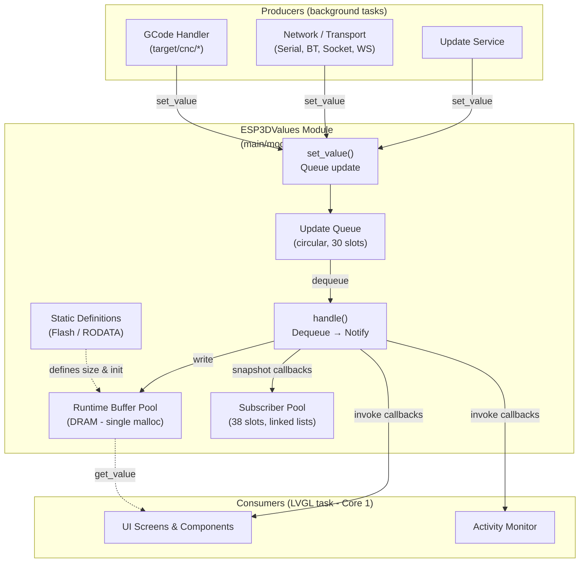
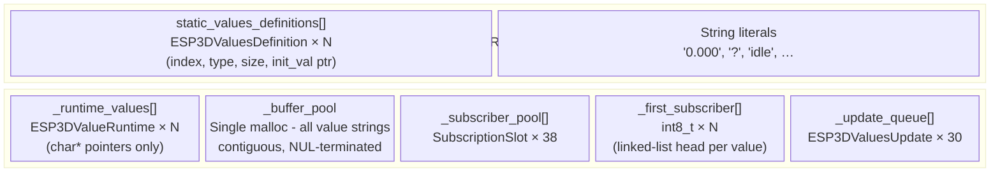
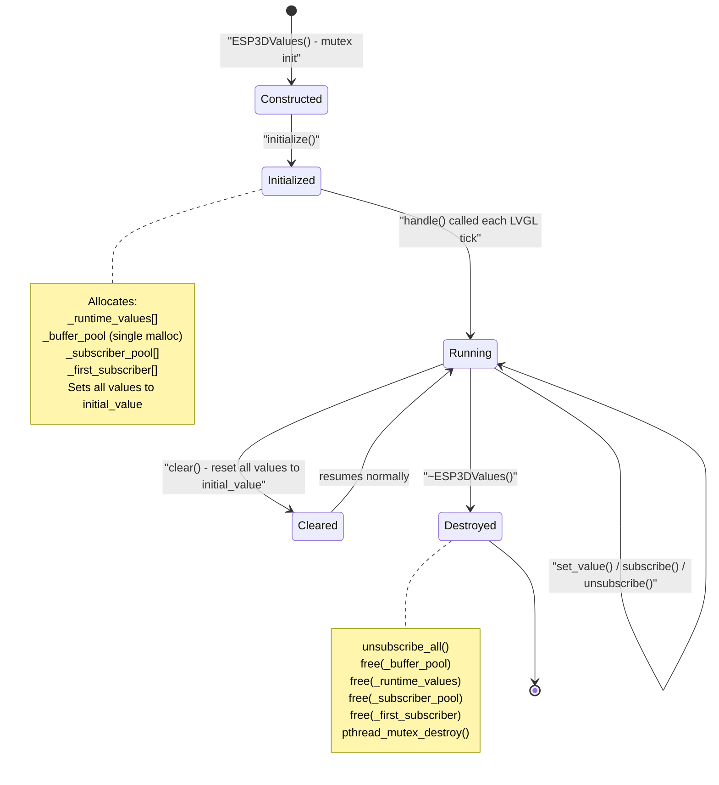
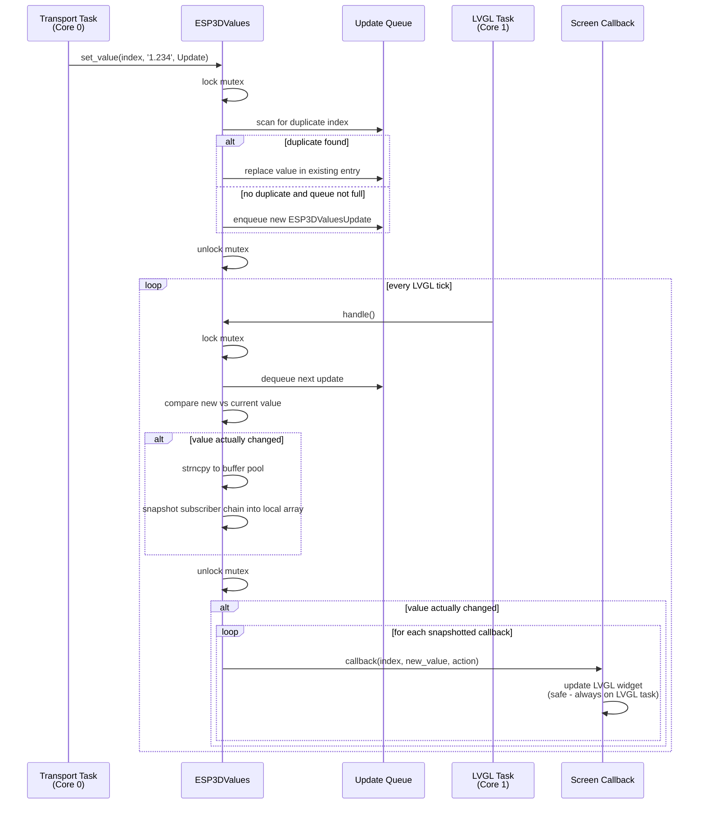
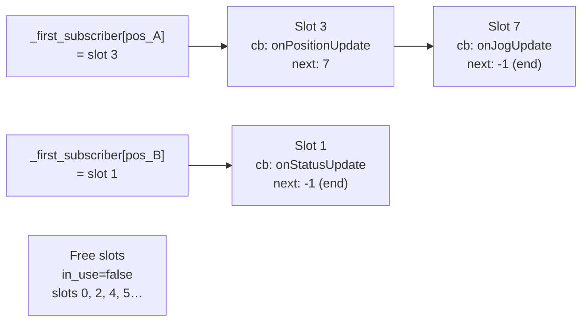
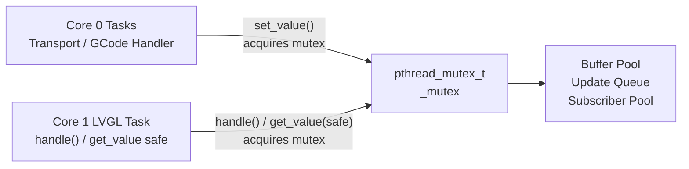

# ESP3DValues — Observable State Bus

`ESP3DValues` is the central reactive state system for the ESP3D-TFT firmware.  
It implements a **publish-subscribe (pub/sub) pattern** that decouples CNC firmware data producers (transports, GCode handlers) from UI consumers (screens, components) — with no polling, full thread safety, and a memory footprint designed for the ESP32's constrained heap.

---

## Table of Contents

1. [Purpose](#1-purpose)
2. [Architecture Overview](#2-architecture-overview)
3. [Data Structures](#3-data-structures)
4. [Memory Layout](#4-memory-layout)
5. [Value Catalog](#5-value-catalog)
6. [Lifecycle](#6-lifecycle)
7. [Core Operations](#7-core-operations)
8. [Update Flow](#8-update-flow)
9. [Subscription Model](#9-subscription-model)
10. [Thread-Safety Model](#10-thread-safety-model)
11. [Component Integration Map](#11-component-integration-map)
12. [Configuration Constants](#12-configuration-constants)
13. [Related Documentation](#13-related-documentation)

---

## 1. Purpose

`ESP3DValues` solves a specific problem: **how to propagate rapidly-changing CNC machine state (positions, speeds, status) from background transport tasks to the LVGL UI task without polling, without races, and without exhausting the ESP32's heap.**

Key design commitments:

- **Event-driven** — no task polls any value; all updates flow through `set_value()` → `handle()` → callback
- **LVGL-safe** — all subscriber callbacks fire exclusively from the LVGL task (Core 1), so widgets can be updated directly without additional synchronisation
- **Memory-frugal** — definitions live in Flash (RODATA), runtime buffers are one contiguous heap block, subscribers use a flat pool with function pointers rather than `std::function`
- **Deadlock-proof** — callbacks are always invoked _after_ the internal mutex is released, so re-entrant `set_value()` or `unsubscribe()` calls from within a callback cannot deadlock

---

## 2. Architecture Overview



---

## 3. Data Structures

### `ESP3DValuesDefinition` (Flash / RODATA)

Compile-time description of each value. Stored as a `const` array in Flash — never copied to DRAM.

| Field | Type | Description |
|-------|------|-------------|
| `index` | `ESP3DValuesIndex` | Unique identifier for this value |
| `type` | `ESP3DValuesType` | Data type (`byte_t`, `integer_t`, `string_t`, `float_t`) |
| `size` | `size_t` | Maximum byte length of the value string (excluding null terminator) |
| `initial_value` | `const char*` | Pointer to a string literal in Flash used at initialisation and `clear()` |

### `ESP3DValueRuntime` (DRAM)

Per-value runtime state. The `value` pointer points into the single `_buffer_pool` allocation — no per-value `malloc`.

| Field | Type | Description |
|-------|------|-------------|
| `value` | `char*` | Pointer into buffer pool; always NUL-terminated |

### `ESP3DValuesUpdate` (DRAM — queue)

One slot in the circular update queue. At most 30 entries exist at once.

| Field | Type | Description |
|-------|------|-------------|
| `index` | `ESP3DValuesIndex` | Which value is being updated |
| `value[128]` | `char[]` | The new value string (max `MAX_VALUE_LENGTH`) |
| `action` | `ESP3DValuesCbAction` | `Add`, `Delete`, `Clear`, or `Update` |

### `SubscriptionSlot` (DRAM — pool)

One entry in the flat subscriber pool. Forms an intrusive singly-linked list per value.

| Field | Type | Size | Description |
|-------|------|------|-------------|
| `callback` | `callbackFunctionPtr_t` | 4 B | Raw function pointer — avoids `std::function` overhead |
| `next_slot` | `int8_t` | 1 B | Next slot in the chain for this value (`-1` = end) |
| `in_use` | `bool` | 1 B | Pool allocation flag |
| _(padding)_ | — | 2 B | Alignment to 8 B total |

### Callback Signature

```c
typedef bool (*callbackFunctionPtr_t)(
    ESP3DValuesIndex    index,   // Which value changed
    const char*         value,   // New value string
    ESP3DValuesCbAction action   // What happened (Update / Add / Delete / Clear)
);
```

---

## 4. Memory Layout



**Single-block pool allocation** is the critical design choice: instead of calling `malloc` once per value, `initialize()` calculates the total buffer size needed (sum of all `definition.size + 1`), allocates it in one shot, then distributes internal pointers within it. This minimises heap fragmentation on an already-tight ESP32 heap.

---

## 5. Value Catalog

Values are declared across three files using the **X-macro pattern**. The `ESP3D_VAL_DEF(name, type, size, init)` macro is redefined before each include — as an enum entry in `esp3d_values_list.h`, and as a definition-table row in `esp3d_values.cpp` — so the same `.inc` files serve both purposes without duplication.

### 5.1 Core Values (`esp3d_values.cpp` — always present)

| Index | Type | Size | Init | Description |
|-------|------|------|------|-------------|
| `connection_status` | string | 16 | `"?"` | Transport connection state (`U`/`T`/`C`/`?`/`A`) |
| `server_status` | string | 16 | `"?"` | CNC server reachability |
| `firmware_status` | string | 128 | `"?"` | Raw machine state string from firmware |
| `orientation` | string | 1 | `"0"` | Screen rotation / orientation |
| `target_fw_info` | string | 32 | `"?"` | Target firmware version summary |
| `local_message_history` | string | 128 | `""` | Pendant-local system messages (resource/theme warnings) |

#### Conditional Core Values

| Index | Build Condition | Description |
|-------|-----------------|-------------|
| `status_bar_label` | `ESP3D_HAS_STATUS_BAR` | Label shown in the status bar |
| `current_ip` | `ESP3D_WIFI_FEATURE` | Current WiFi IP address |
| `socket_server_status` | `ESP3D_SOCKET_SERVER_FEATURE` | Socket server state |
| `update_progress` | `ESP3D_UPDATE_FEATURE` | OTA/SD update progress `0`–`100` |
| `update_status` | `ESP3D_UPDATE_FEATURE` | Human-readable update status message |

### 5.2 CNC System Values (`esp3d_system_values_defs.inc`)

Shared across **all** CNC firmware targets (grbl, grblHAL, FluidNC).

| Group | Indices | Notes |
|-------|---------|-------|
| Machine Position (MPos) | `position_mx/my/mz/ma/mb/mc` | From status report |
| Work Position (WPos) | `position_wx/wy/wz/wa/wb/wc` | From status report |
| Work Coord Offset (WCO) | `wco_x/y/z/a/b/c` | From status report |
| Speeds | `feed_rate`, `spindle_speed`, `rapid_rate` | Real-time rates |
| Overrides | `feed_override`, `rapid_override`, `spindle_override` | Percentage values |
| Machine State | `pin_states`, `accessory_states`, `homed_state`, `tool_length_ref` | Real-time pin/accessory states |
| Planner Buffer | `buffer_blocks`, `buffer_bytes` | Available planning capacity |
| Parser State | `parser_state`, `current_unit` | Modal state from `$G`; `current_unit`: `"0"`=mm, `"1"`=in |
| Job | `job_status`, `job_progress`, `job_duration`, `job_filename`, `job_total_lines`, `job_current_line` | GCode streaming progress |
| Misc | `axis_count`, `axis_names`, `probe_status`, `last_error_status`, `message_history` | Axis config, probe result, error history |
| Firmware Info | `fw_version`, `board_name`, `fw_has_sd`, `fw_has_mpg` | Populated from `$I` / welcome sequence at startup |

### 5.3 Target-Specific Values (`esp3d_target_values_defs.inc`)

Each firmware target provides its own `.inc` file in `main/target/cnc/<fw>/`.

#### grbl / grblHAL

| Index | Description |
|-------|-------------|
| `firmware_file_entry` | Current file entry during firmware file listing |
| `planner_blocks` | Planner buffer depth (format differs between grbl and grblHAL) |
| `homing_cycle_x/y/z/a/b/c` | Per-axis homing cycle capability flag |
| `homing_single_x/y/z/a/b/c` | Per-axis single-axis homing support flag |

#### FluidNC / none

`main/target/cnc/fluidnc/` and `main/target/none/` provide their own target-specific values via the same `.inc` mechanism.

---

## 6. Lifecycle



---

## 7. Core Operations

### `initialize()`

Must be called once before any other method. Allocates the four heap blocks (runtime values array, buffer pool, subscriber pool, first-subscriber index array), initialises all values from Flash definitions, and resets the update queue.

### `handle()`

Called from the LVGL task on every tick (via `UIManager` / `tft_ui_task`). Drains the circular update queue one entry at a time. For each entry:

1. Acquires mutex
2. Dequeues one `ESP3DValuesUpdate`
3. Writes the new value into the buffer pool (only if it differs from the current value — **change detection**)
4. Snapshots the subscriber linked list into a local stack array
5. Releases mutex
6. Invokes all snapshotted callbacks outside the mutex

### `set_value(index, value, action)`

Thread-safe; can be called from any FreeRTOS task. Acquires mutex, checks whether the same index already has a pending entry in the queue (if so, **replaces** it in place instead of appending), then enqueues. Returns `false` if the queue is full (30 entries).

### `get_value(index)` _(legacy — unsafe pointer)_

Returns a direct pointer to the live internal buffer. Fast, but the pointed content may change concurrently. Safe only when called from the LVGL task (the same task that runs `handle()`).

### `get_value(index, out_buffer, out_size)` _(safe copy)_

Acquires the mutex, copies the current value into the caller's buffer, then releases. Prefer this from any task other than the LVGL task.

### `subscribe(index, callback)` / `unsubscribe(index, callback)`

Both thread-safe. `subscribe` deduplicates (silently returns `true` if the callback is already registered). `unsubscribe` walks the linked list for the given index and frees the pool slot. `unsubscribe_all()` resets the entire pool atomically.

---

## 8. Update Flow



---

## 9. Subscription Model

Each value index has its own **intrusive singly-linked list** of `SubscriptionSlot` entries, all drawn from a shared flat pool of 38 slots total.



**Subscribe:**

1. Look up `pos = get_index_position(index)`
2. Walk the chain at `_first_subscriber[pos]` to detect duplicates
3. `allocate_slot()` — find first `in_use == false` slot in the pool
4. Set `callback`, insert at head of linked list

**Unsubscribe:**

1. Walk the chain for the given index
2. Patch `prev.next_slot` around the found slot
3. `free_slot()` — mark as unused, clear callback

**Snapshot-before-invoke pattern** (in `handle()`):
The subscriber chain is snapshotted into a local stack array while the mutex is held. Callbacks are then invoked after the mutex is released. This prevents two classes of bugs:

- **Deadlock**: a callback calling `set_value()` back into `ESP3DValues` would re-acquire the same non-recursive mutex
- **ABA / walk invalidation**: a callback calling `unsubscribe()` while the chain is being walked

---

## 10. Thread-Safety Model



| Concern | Mechanism |
|---------|-----------|
| Queue write/read races | `pthread_mutex_t` guards all queue read/write operations |
| Buffer write/read races | Mutex held during `strncpy` in `handle()` and safe `get_value()` |
| Callback re-entrancy / deadlock | Subscriber list snapshotted **under** mutex; callbacks fired **outside** it |
| Subscriber list ABA during notify | Snapshot taken before callbacks fire; no live traversal during invocation |
| LVGL thread safety | `handle()` is only called from the LVGL task; all callbacks therefore run on Core 1 |

> ⚠️ **Critical rule**: Call `handle()` exclusively from the LVGL task. UI widget updates from subscriber callbacks are safe precisely because this invariant is maintained. Violating it will cause LVGL corruption.

---

## 11. Component Integration Map

### Producers — write values via `set_value()`

| Component | Source Module | Values Written |
|-----------|---------------|----------------|
| `ESP3DGCodeHandlerService` | [CNC Firmware Integration](https://github.com/luc-github/Pibot-cnc-pendant-firmware/blob/main/docs/architecture/gcode_host_architecture.md) | All CNC system + target values (positions, status, overrides, job progress…) |
| `ESP3DSerialClient`, `ESP3DBTSerialClient`, `ESP3DBTBleClient`, `ESP3DSocketClient`, `ESP3DUsbSerialClient` | [Communication Transports](https://github.com/luc-github/Pibot-cnc-pendant-firmware/blob/main/docs/architecture/connection_management.md) | `connection_status`, `server_status` |
| `ESP3DNetwork` | [Network & Web Services](https://github.com/luc-github/Pibot-cnc-pendant-firmware/blob/main/docs/architecture/connection_management.md) | `current_ip`, `connection_status` |
| `ESP3DUpdateService` | Storage & Configuration | `update_progress`, `update_status` |
| `UIManager` | [UI Framework](https://github.com/luc-github/Pibot-cnc-pendant-firmware/blob/main/docs/architecture/screens_architecture.md) | `orientation`, `firmware_status`, `local_message_history` |

### Consumers — register via `subscribe()`, react in callbacks

| Screen / Component | Values Subscribed | Purpose |
|--------------------|------------------|---------|
| `status_screen` | positions, overrides, job status, feed/spindle, planner buffer, pins, connection | Main CNC status display |
| `jog_screen` | positions, connection, pins, planner buffer, axis count | Jogging display and safety interlock |
| `probe_screen` | positions, connection, firmware status, pins, probe status, axis count | Probing workflow |
| `firmware_status_screen` | `firmware_status`, `message_history` | Raw firmware message log |
| `connection_status_screen` | `connection_status`, `socket_server_status` | Transport/server indicator overlay |
| `files_screen` | `firmware_status`, `firmware_file_entry` | File listing from firmware |
| `update_screen` | `update_progress`, `update_status` | OTA/SD update progress bar |
| `main_screen` | `connection_status` | Navigation lock indicator |
| `information_screen` | `fw_version`, `board_name`, `axis_count`, `axis_names`, all system info | Firmware and machine info display |
| `change_tool_screen` | `connection_status`, `firmware_status`, `parser_state` | Tool change workflow state |
| `activity_monitoring` | `server_status` | Activity timeout tracking |

### Called by `handle()`

`handle()` is invoked by `tft_ui_task` → `UIManager::handle()` on every LVGL timer tick.  
See [`esp3d_core.md`](esp3d_core.md) for the full UI task loop and system initialisation.


---

## 12. Configuration Constants

Defined in `main/modules/values/esp3d_values.h`:

| Constant | Value | Purpose |
|----------|-------|---------|
| `MAX_TOTAL_SUBSCRIBERS` | `38` | Total subscription slots shared across **all** values |
| `MAX_VALUE_LENGTH` | `128` | Maximum string length buffered in the update queue |
| `MAX_UPDATE_QUEUE_SIZE` | `30` | Circular queue capacity for pending updates |
| `INVALID_SLOT_INDEX` | `-1` | Sentinel: end of linked list / no subscriber |

> **Sizing guidance:**
>
> - If `subscribe()` returns `false`, increase `MAX_TOTAL_SUBSCRIBERS`.
> - If logs show "Update queue full", increase `MAX_UPDATE_QUEUE_SIZE`.
> - Both constants are within `uint8_t` / `int8_t` range; keep them small to stay within ESP32 heap and struct-size constraints.
> - `MAX_VALUE_LENGTH` (queue buffer) is independent of per-value `size` in the definition table; values longer than 128 bytes will be truncated in the queue even if their definition allows more.

---

## 13. Related Documentation

| Document | Relevance |
|----------|-----------|
| [`esp3d_core.md`](esp3d_core.md) | Core platform, `ESP3DX::begin()`, system initialisation and LVGL task |
| [`connection_management.md`](https://github.com/luc-github/Pibot-cnc-pendant-firmware/blob/main/docs/architecture/connection_management.md) | How transports set `connection_status` and `server_status` |
| [`gcode_host_architecture.md`](https://github.com/luc-github/Pibot-cnc-pendant-firmware/blob/main/docs/architecture/gcode_host_architecture.md) | How GCode handlers parse firmware responses and write CNC values |
| [`gcode_host_streaming_flow.md`](https://github.com/luc-github/Pibot-cnc-pendant-firmware/blob/main/docs/architecture/gcode_host_streaming_flow.md) | State machine that drives value updates during job streaming |
| [`screens_architecture.md`](https://github.com/luc-github/Pibot-cnc-pendant-firmware/blob/main/docs/architecture/screens_architecture.md) | How screens subscribe to values and respond to callbacks |
| [`screen_transitions_flow.md`](https://github.com/luc-github/Pibot-cnc-pendant-firmware/blob/main/docs/architecture/screen_transitions_flow.md) | Subscribe/unsubscribe lifecycle tied to screen creation/destruction |
| [`esp3d_log.md`](esp3d_log.md) | Logging macros (`esp3d_log`, `esp3d_log_e`) used throughout the values module |
