# WiFi Module

The WiFi module (`main/modules/wifi/`) provides the low-level WiFi driver lifecycle for the Pibot CNC pendant firmware. It encapsulates both **Station (STA)** mode — where the pendant joins an existing access point — and **Access Point (AP)** mode — where the pendant itself becomes an AP for direct client connections. All higher-level network services (HTTP, mDNS, SSDP, WebSocket) are started and stopped by this module as a consequence of connection events.

> **See also:**
> - [Network module](network.md) — orchestrates which radio mode is active and calls into this module
> - [Connection Management](https://github.com/luc-github/Pibot-cnc-pendant-firmware/blob/main/docs/architecture/connection_management.md) — overall connection lifecycle across all transports
> - [Feature / Resource Matrix](https://github.com/luc-github/Pibot-cnc-pendant-firmware/blob/main/docs/features/feature_resource_matrix.md) — WiFi vs CNC transport usage model and build constraints
> - [ESP32 Memory Constraints](https://github.com/luc-github/Pibot-cnc-pendant-firmware/blob/main/docs/guides/esp32_memory_constraints.md) — heap impact of running WiFi

---

## Architecture Overview

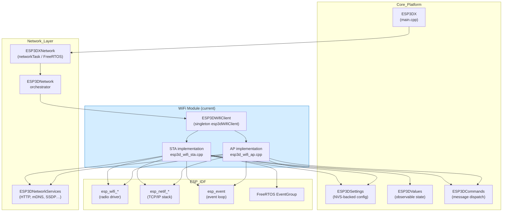

---

## Key Files

| File | Purpose |
|------|---------|
| `main/modules/wifi/esp3d_wifi_client.h` | Class declaration: `ESP3DWifiClient`, `ESP3DIpInfos`, `ESP3DIpMode` |
| `main/modules/wifi/esp3d_wifi_sta.cpp` | STA event handler, `connect()`, `disconnect()`, `deinit()` |
| `main/modules/wifi/esp3d_wifi_ap.cpp` | AP event handler, `startAP()`, `stopAP()` |

All three files compile only when `ESP3D_WIFI_FEATURE` is enabled in the build configuration.

---

## Class Reference: `ESP3DWifiClient`

A `final` singleton class exposed as `extern ESP3DWifiClient esp3dWifiClient`. It manages both the STA and AP netifs and the underlying ESP-IDF WiFi driver.

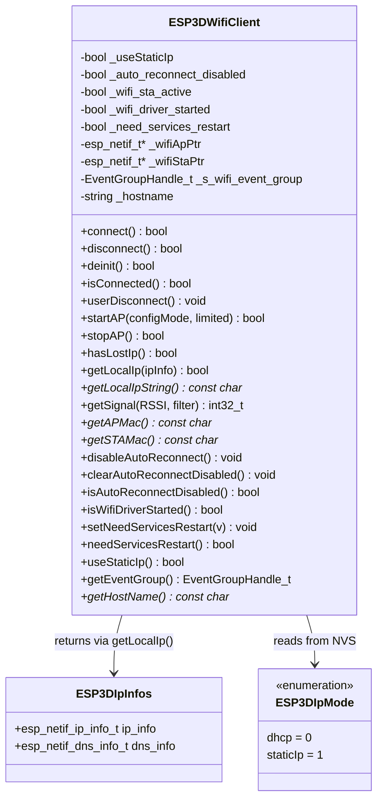

### State Flags

| Flag | Meaning |
|------|---------|
| `_wifi_sta_active` | STA is fully connected and network services are running |
| `_wifi_driver_started` | `esp_wifi_start()` was called and not yet followed by `esp_wifi_stop()` |
| `_auto_reconnect_disabled` | User explicitly disconnected; auto-reconnect is suppressed |
| `_need_services_restart` | IP re-acquired during auto-reconnect; network services must be restarted by the next `handle()` cycle |

---

## STA Mode: Connection Lifecycle

### `connect()` Flow

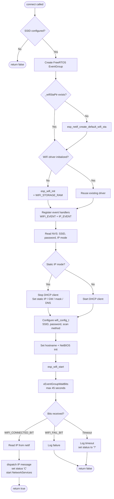

### Retry and Reconnect State Machine

The STA event handler (`wifi_sta_event_handler`) implements a layered retry strategy coordinated through a FreeRTOS `EventGroupHandle_t`.

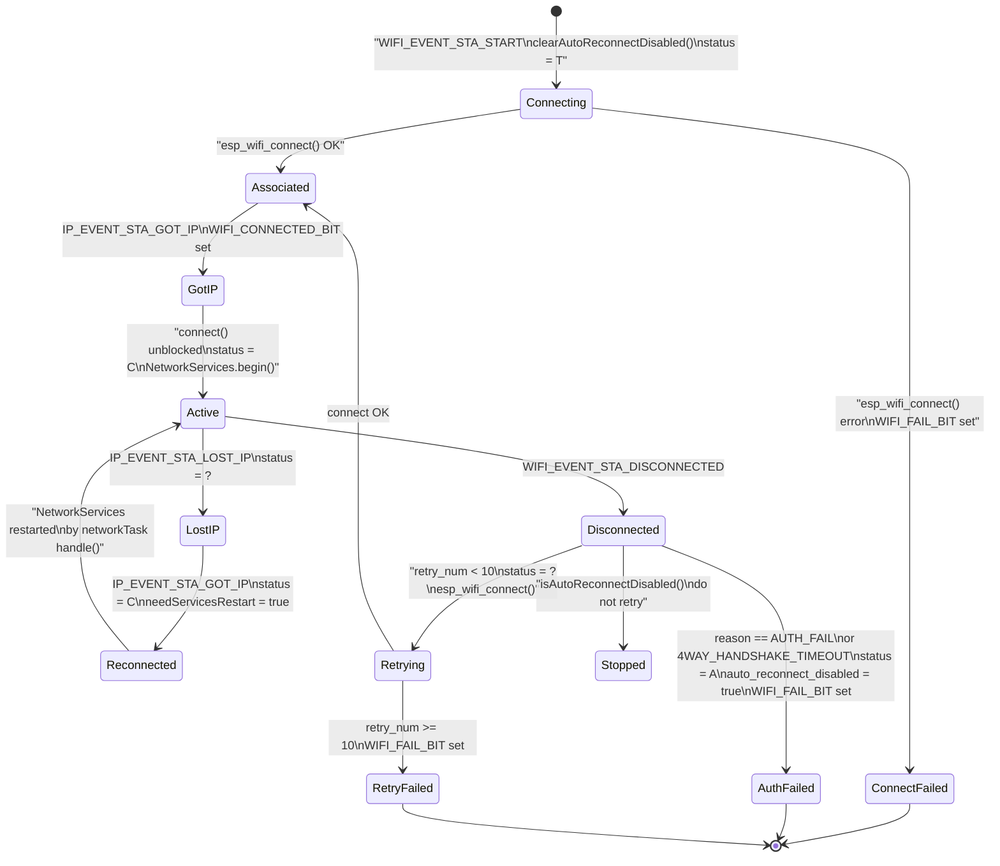

**Disconnect reason codes handled explicitly:**

| Reason | Code | Behaviour |
|--------|------|-----------|
| `WIFI_REASON_AUTH_FAIL` | 202 | Stop retrying immediately; status → `"A"` |
| `WIFI_REASON_4WAY_HANDSHAKE_TIMEOUT` | 204 | Same as AUTH_FAIL (typical wrong-password indicator) |
| Any other reason | — | Retry up to `ESP3D_STA_MAXIMUM_RETRY` (10) times |

**Timeout:** `connect()` waits at most `ESP3D_WIFI_CONNECT_TIMEOUT_MS` (45 000 ms) for `WIFI_CONNECTED_BIT` or `WIFI_FAIL_BIT`. This prevents the network task from blocking forever when an AP associates but never answers DHCP.

---

## AP Mode: Startup and Teardown

### `startAP()` Flow

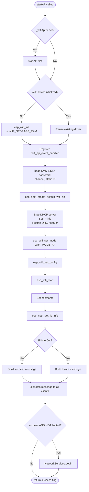

**`configMode` vs normal AP:**

| Flag | Gateway in netif | Use case |
|------|-----------------|---------|
| `configMode = true` | Same as AP IP | Configuration portal — AP acts as default gateway |
| `configMode = false` | `0` (none) | Standard AP — clients get IP but no routing |

**`limited = true`:** AP starts but `NetworkServices.begin()` is suppressed. Used when only the WiFi PHY is required without starting the full HTTP/mDNS/SSDP stack.

**Open vs secured AP:**

| Password | Auth mode |
|----------|-----------|
| Empty string | `WIFI_AUTH_OPEN` |
| Non-empty | `WIFI_AUTH_WPA_WPA2_PSK` |

---

## Driver Lifecycle: Soft vs Full Teardown

The WiFi driver (`esp_wifi_init` / `esp_wifi_deinit`) is **not** called on every `disconnect()` or `stopAP()`. Reusing the initialized driver avoids repeated heap fragmentation and startup latency across reconnect cycles.

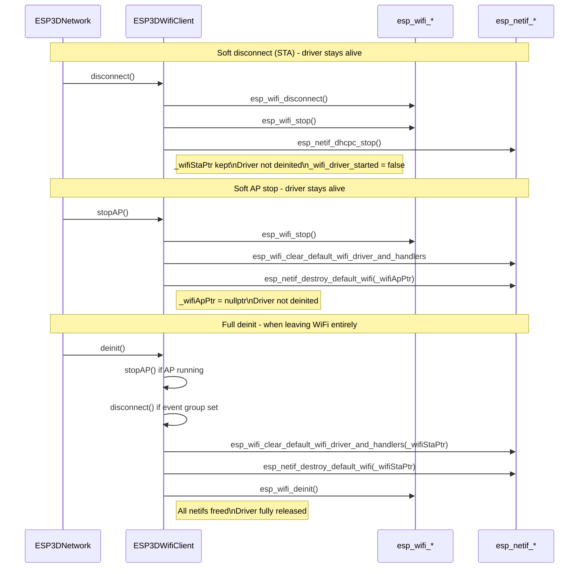

| Method | Driver after | STA netif after | AP netif after |
|--------|-------------|-----------------|----------------|
| `disconnect()` | Stopped (not deinited) | Kept | Unchanged |
| `stopAP()` | Not deinited | Unchanged | Destroyed |
| `deinit()` | Fully deinited | Destroyed | Destroyed |

---

## NVS Settings Used

The module reads the following settings from `ESP3DSettings` (NVS-backed).

### STA Settings

| Setting Index | Type | Description |
|---------------|------|-------------|
| `esp3d_sta_ssid` | string (32) | Target AP SSID |
| `esp3d_sta_password` | string (64) | WPA2 passphrase |
| `esp3d_sta_ip_mode` | byte | `0` = DHCP, `1` = static |
| `esp3d_sta_ip_static` | uint32 | Static IP (packed IPv4) |
| `esp3d_sta_gw_static` | uint32 | Static gateway |
| `esp3d_sta_mask_static` | uint32 | Static netmask |
| `esp3d_sta_dns_static` | uint32 | Static primary DNS |

### AP Settings

| Setting Index | Type | Description |
|---------------|------|-------------|
| `esp3d_ap_ssid` | string (32) | AP SSID to broadcast |
| `esp3d_ap_password` | string (64) | WPA2 passphrase (empty = open network) |
| `esp3d_ap_channel` | byte | WiFi channel (1–13) |
| `esp3d_ap_ip_static` | uint32 | AP IP address (DHCP pool base) |

### Common

| Setting Index | Type | Description |
|---------------|------|-------------|
| `esp3d_hostname` | string (32) | mDNS / NetBIOS hostname (NetBIOS truncated to 15 chars) |

---

## Connection Status Observable Values

The WiFi module writes to `ESP3DValuesIndex::connection_status` (and conditionally `server_status`). These drive the UI via the `ESP3DValues` observable/subscription system.

| Value | Meaning | Written when |
|-------|---------|-------------|
| `"U"` | Uninitialized | System startup |
| `"T"` | Trying to connect | `WIFI_EVENT_STA_START` fires |
| `"C"` | Connected (IP obtained) | `IP_EVENT_STA_GOT_IP` / `connect()` success path |
| `"?"` | Disconnected / IP lost | `STA_DISCONNECTED`, `STA_LOST_IP`, connect timeout |
| `"A"` | Authentication failure | `AUTH_FAIL` / `4WAY_HANDSHAKE_TIMEOUT` reason |

**`server_status` guard:** `server_status` is only written to `"?"` when the configured output client is `socket_client` (TCP-over-WiFi CNC). For serial, BT, or USB CNC configurations, WiFi is the remote-access transport only; writing `server_status` here would incorrectly flap the CNC connection indicator on every WiFi event.

---

## Data Flow: STA Connect

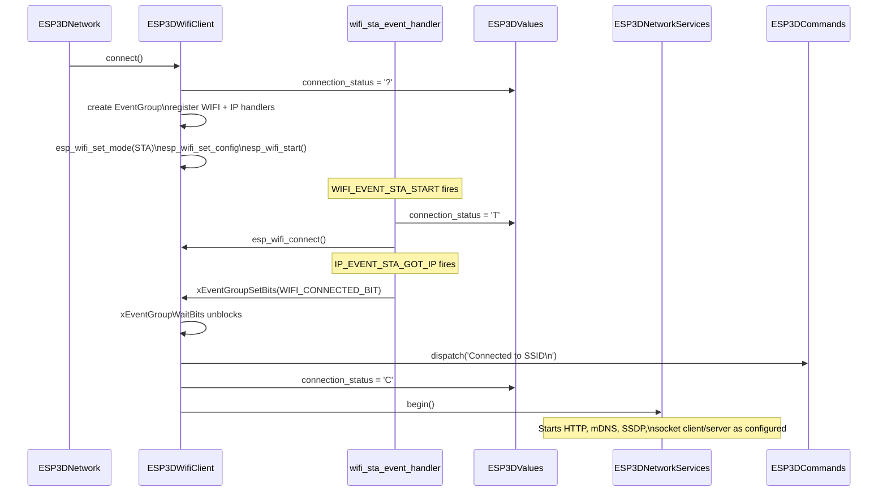

## Data Flow: AP Start

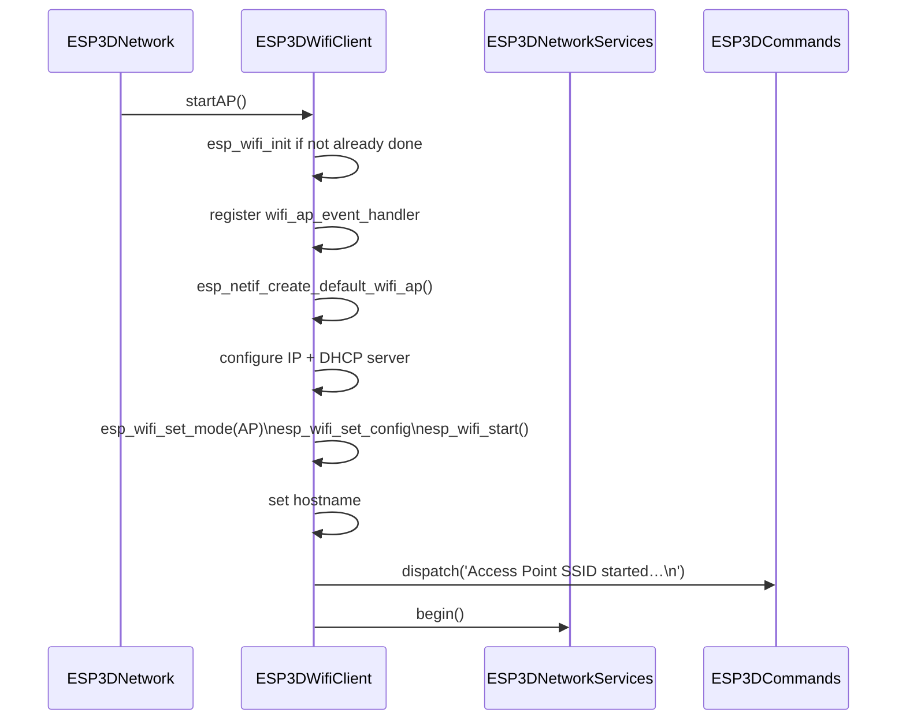

---

## Interaction with ESP3DNetwork

`ESP3DWifiClient` is not called directly by application screens or CNC logic. All mode transitions are requested through `ESP3DNetwork::setMode()` or `ESP3DNetwork::setModeAsync()`. The `networkTask` (Core 0, `ESP3DXNetwork`) polls the module every 10 ms via `ESP3DXNetwork::handle()`.

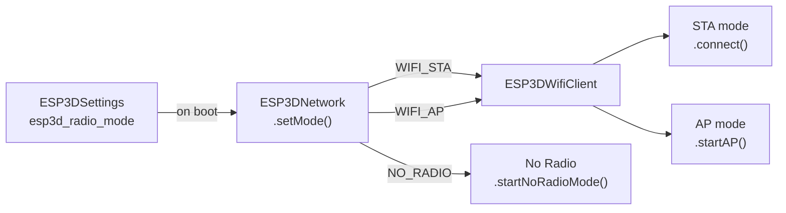

`ESP3DXNetwork::handle()` also monitors:
- `ESP3DWifiClient::hasLostIp()` — triggers AP fallback when configured
- `ESP3DWifiClient::needServicesRestart()` — restarts network services after IP re-acquired during auto-reconnect

---

## ESP Command Integration

WiFi settings are exposed through the `[ESP...]` command system dispatched via `ESP3DCommands`.

| Command | Action |
|---------|--------|
| `ESP100` | Get/set STA SSID |
| `ESP101` | Get/set STA password |
| `ESP102` | Get/set STA IP mode (DHCP / static) |
| `ESP103` | Get/set STA static IP |
| `ESP104` | Get/set STA static gateway |
| `ESP105` | Get/set STA static netmask |
| `ESP106` | Get/set STA static DNS |
| `ESP107` | Get/set AP SSID |
| `ESP108` | Get/set AP password |
| `ESP111` | Get current local IP address |
| `ESP410` | Scan available WiFi networks (used by WiFi scan screen) |

---

## Build Constraints

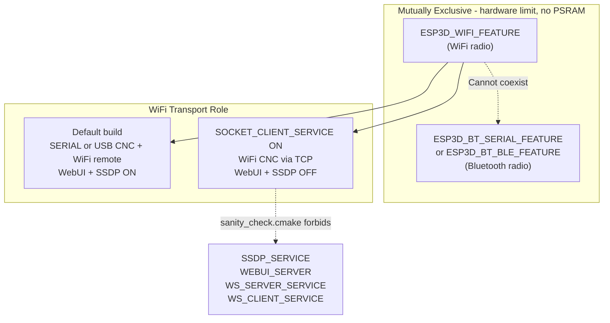

**Key rules (enforced by `cmake/sanity_check.cmake`):**

- `ESP3D_WIFI_FEATURE` and any Bluetooth feature are **mutually exclusive** — no PSRAM means both radio stacks cannot coexist.
- When `SOCKET_CLIENT_SERVICE` is ON (WiFi as CNC transport), `SSDP_SERVICE`, `WEBUI_SERVER`, `WS_SERVER_SERVICE`, and `WS_CLIENT_SERVICE` are **forbidden**.
- The **default `CMakeLists.txt`** has `SOCKET_CLIENT_SERVICE` OFF, WebUI and SSDP ON — WiFi is the remote access transport while CNC runs over serial or USB serial.

See [`docs/features/feature_resource_matrix.md`](https://github.com/luc-github/Pibot-cnc-pendant-firmware/blob/main/docs/features/feature_resource_matrix.md) §2–§4 for the full compatibility matrix.

---

## Memory Considerations

The WiFi stack is the largest consumer of DRAM on this platform.

| Configuration | Available heap (approx.) |
|---------------|--------------------------|
| WiFi active | ~75 KB |
| Bluetooth mode | ~10 KB (WiFi must be OFF) |
| WiFi + heavy services under load | Can drop below 1 KB contiguous block |

Design decisions made to minimise allocation pressure:

- `esp_wifi_init()` is called **once** on first use and the driver is **reused** across soft-disconnect cycles. `esp_wifi_deinit()` is only invoked from `deinit()` when fully leaving WiFi mode.
- AP and STA `esp_netif_t` pointers are created once and reused; only `_wifiApPtr` is destroyed on `stopAP()`. `_wifiStaPtr` persists until `deinit()`.
- WiFi settings are read into **stack-allocated** fixed-size char buffers (max 65 bytes), never into heap-allocated `std::string` in hot paths.
- `WIFI_STORAGE_RAM` is set immediately after `esp_wifi_init()` to prevent the WiFi driver from persisting configuration to flash (reduces write wear and init latency).

See [`docs/guides/esp32_memory_constraints.md`](https://github.com/luc-github/Pibot-cnc-pendant-firmware/blob/main/docs/guides/esp32_memory_constraints.md) — subsection *Serial CNC + WiFi remote — fragmentation playbook* — for fragmentation analysis under mixed workloads.

---

## Summary

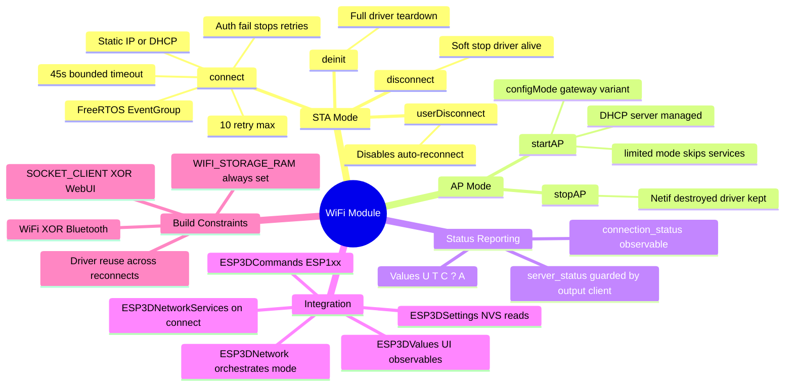
