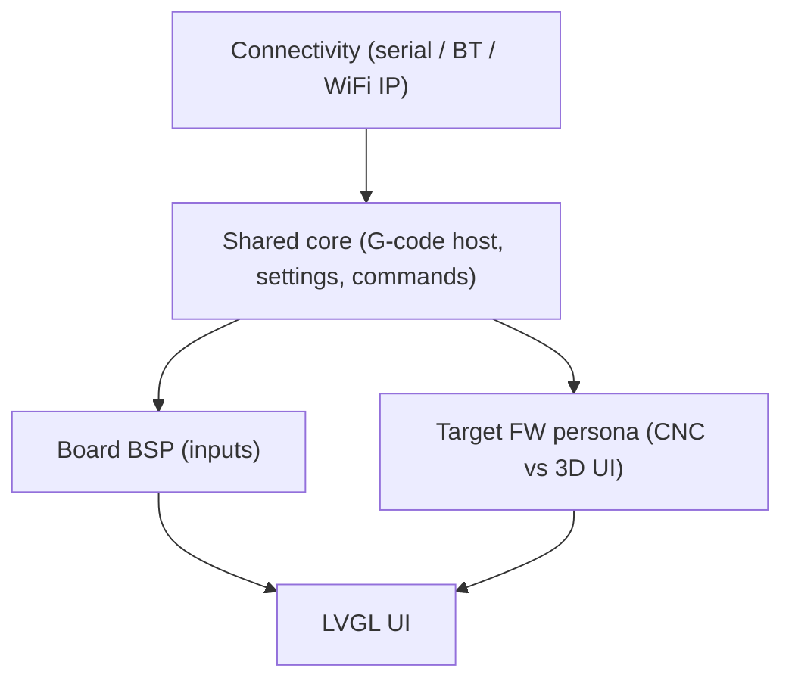

This version is the development version, features can change anytime, feedback, PR and suggestions are welcome.

## Supported firmwares

* [FluidNC](https://github.com/bdring/FluidNC)
* [grblHAL](https://github.com/grblHAL)
* [grbl 1.x](https://github.com/gnea/grbl)
* [Marlin](https://marlinfw.org/)
* [Smoothieware](https://smoothieware.org/)
* [Repetier](https://www.repetier.com/)

## Architecture

ESP3D-X is designed around three axes:

1. **Connectivity** — How the pendant talks to the machine: UART, Bluetooth (BLE / BTSerial), or IP (TCP / WebSocket)
2. **Board / Inputs** — Physical peripherals: TFT, touch, rotary encoder, buttons, buzzer, SD card, etc.
3. **Machine persona** — The UI adapts to the target controller (CNC vs 3D printer)

## Build system

The repository uses a central launcher `build_all.py` that discovers board-specific build scripts under `boards/<board>/build_scripts/`.

### Available commands

- `python build_all.py --list` : list all available build targets.
- `python build_all.py --validate` : validate that build scripts only use supported CMake options.

### Example usage

- `python build_all.py` : build every discovered variant.
- `python build_all.py 8mb_wifi_fluidnc` : build only the 8MB WiFi FluidNC variant.
- `python build_all.py --clean 4mb_bt_fluidnc` : clean and rebuild the 4MB BT FluidNC variant.
- `python build_all.py --clean-all` : clean all build directories before building every discovered variant.

## CMake configuration

The configuration options are defined in `CMakeLists.txt`.
They are separated into two categories:
- **Features** : software and service options that can be enabled or disabled.
- **Capabilities** : hardware capabilities inherent to the board, declared in `boards/<board>/board_config.cmake`.

> Note: when adding a new CMake option, update the option list in `boards/<board>/build_scripts/variants.py` and run `python validate_build_scripts.py` to verify consistency.

### Capabilities (hardware)

| Option | Description |
|---|---|
| `TFT_UI_SERVICE` | enables the TFT display interface on boards that include it |
| `SD_CARD_SERVICE` | enables SD card support on boards that include it |
| `BUZZER_SERVICE` | enables the hardware buzzer |
| `TFT_TOUCH_SERVICE` | enables the touch panel on the TFT display |

### Features

| Option | Description |
|---|---|
| `ESP32_PIBOT_CNC_PENDANT_V1` | selects the PiBot CNC Pendant V1.0 hardware target |
| `MEMORY_4_MB` / `MEMORY_8_MB` | chooses the flash size variant |
| `TARGET_FW_MARLIN` | selects the Marlin firmware target |
| `TARGET_FW_REPETIER` | selects the Repetier firmware target |
| `TARGET_FW_SMOOTHIEWARE` | selects the Smoothieware firmware target |
| `TARGET_FW_GRBL` | selects the GRBL firmware target |
| `TARGET_FW_GRBLHAL` | selects the grblHAL firmware target |
| `TARGET_FW_FLUIDNC` | selects the FluidNC firmware target |
| `SERIAL_SERVICE` | enables serial transport |
| `USB_SERIAL_SERVICE` | enables USB serial transport |
| `WIFI_SERVICE` | enables WiFi network services |
| `BT_SERVICE` | enables Bluetooth services |
| `ESP3D_AUTHENTICATION` | enables client authentication |
| `MDNS_SERVICE` | enables mDNS service |
| `SSDP_SERVICE` | enables SSDP discovery |
| `TIME_SERVICE` | enables time/NTP service |
| `WEB_SERVICES` | enables HTTP/WebSocket/WebDAV services |
| `SOCKET_SERVER_SERVICE` | enables incoming TCP socket server |
| `SOCKET_CLIENT_SERVICE` | enables outgoing TCP socket client |
| `NOTIFICATIONS_SERVICE` | enables the notification system |
| `WEBUI_SERVER` | enables the WebUI server |
| `WEBDAV_SERVICES` | enables WebDAV services |
| `WS_SERVER_SERVICE` | enables incoming WebSocket server |
| `WS_CLIENT_SERVICE` | enables outgoing WebSocket client |
| `USE_FAT_INSTEAD_OF_LITTLEFS` | uses FAT filesystem instead of LittleFS |
| `UPDATE_SERVICE` | enables OTA / SD card update support |
