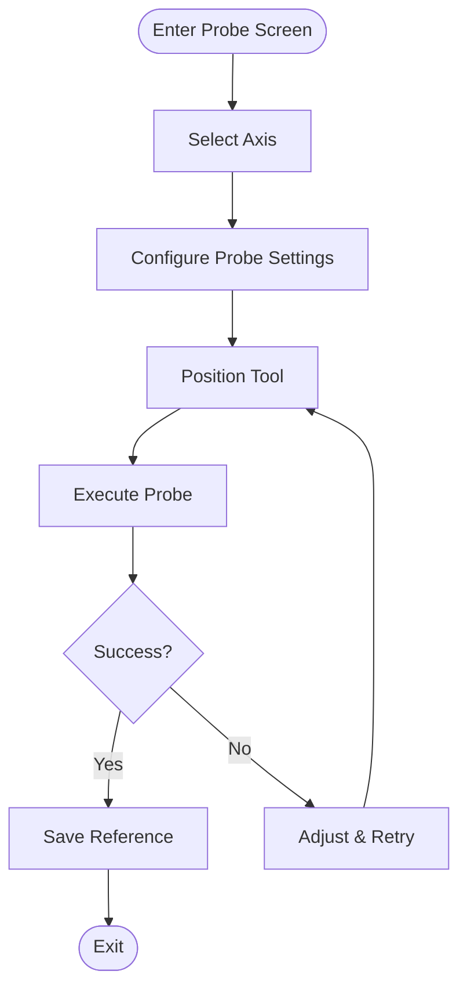
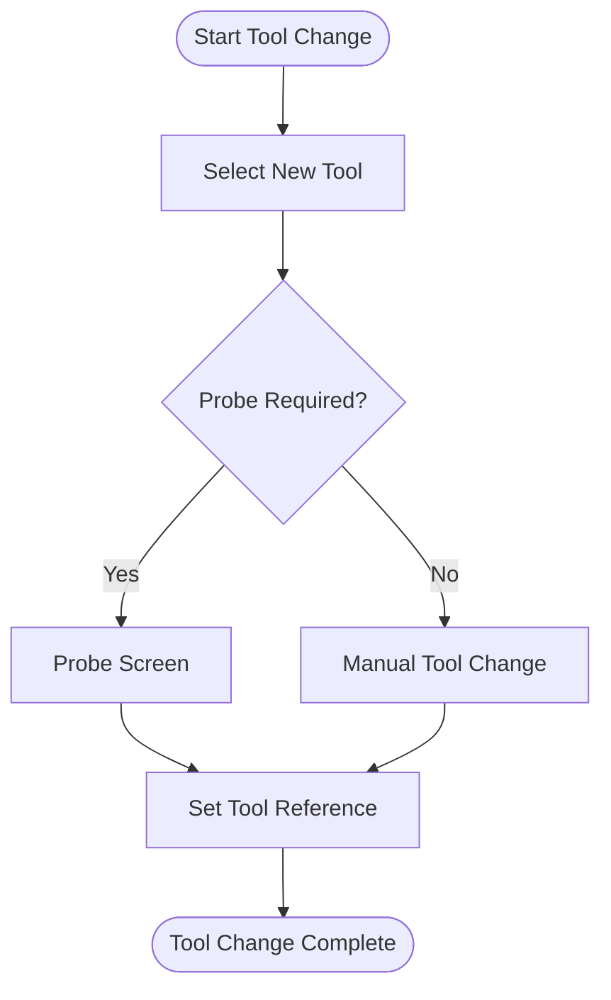

# ESP3D-X Firmware for PiBot Pendant - User Documentation

This document provides a comprehensive guide to all screens available in the ESP3D-X Firmware for PIBot Pendant for FluidNC/GRBL CNC machines.

> **Version 2.0.0a13+ — May 2026**


---

## Table of Contents

- [Overview](#overview)
- [User Interface](#user-interface)
  - [Screen Layout](#screen-layout)
  - [Input Methods](#input-methods)
  - [Audio Feedback](#audio-feedback)
  - [Power Management](#power-management)
  - [Communication Methods](#communication-methods)
  - [SD Card Updates](#sd-card-updates)
- [Navigation Flow](#navigation-flow)
- [Screen Descriptions](#screen-descriptions)
  - [Update Screen](#update-screen)
  - [Splash Screen](#splash-screen)
  - [Main Screen](#main-screen)
  - [Connection Status icon/Screen](#connection-status-iconscreen)
  - [Firmware Status icon/Screen](#firmware-status-iconscreen)
  - [Information Screen](#information-screen)
  - [Status Screen](#status-screen)
  - [Jog Screen](#jog-screen)
  - [SD Screen](#sd-screen)
  - [Macros Screen](#macros-screen)
  - [Probe Screen](#probe-screen)
  - [Change Tool Screen](#change-tool-screen)
  - [Settings Screen](#settings-screen)
  - [Reset Settings](#reset-settings)
  - [Theme Selection](#theme-selection)
  - [Languages Screen](#languages-screen)
  - [Backlight level](#backlight-level)
  - [Orientation selection](#orientation-selection)
  - [Sound control](#sound-control)
  - [Lock button display](#lock-button-display)

  - [Output Selector Screen](#output-selector-screen)
  - [Output mode configuration](#output-mode-configuration)
    - [Baudrate Screen](#baudrate-screen)
    - [Scan Bluetooth Screen](#scan-bluetooth-screen)
    - [WiFi Scan Screen](#wifi-scan-screen)
    - [Server Scan Screen](#wifi-scan-server)
  - [WiFi SSID](#wifi-ssid)
  - [WiFi Password](#wifi-password)
  - [Forget Connection](#forget-connection)
  - [TCP Server Address](#tcp-server-address)
  - [TCP Server Port](#tcp-server-port)
  - [Settings List Screen](#settings-list-screen)
  - [Polling Screen](#polling-screen)
  - [Timeout Screen](#timeout-screen)
  - [Extensions Screen](#files-extensions-screen)
  - [Show / Hide Macros menu](#show-hide-macros-menu)
  - [Show / Hide Probe menu](#show-hide-probe-menu)
  - [Show / Hide Change Tool menu](#show-hide-change-tool-menu)
  - [Enable / Disable the bypass safety](#enable-disable-the-bypass-safety)
  - [Edit Axis Steps List used for Jog](#edit-axis-steps-list-used-for-jog)
  - [Edit Axis Feedrates List used for Jog](#edit-axis-feedrates-list-used-for-jog)
  - [Enable / Disable the Rx / Tx pins](#enable-disable-the-rx-tx-pins)
- [Settings Reference](#settings-reference)
- [Appendix](#appendix)
  - [Hardware Controls Summary](#hardware-controls-summary)
  - [Screen Hierarchy Reference](#screen-hierarchy-reference)
  - [Configuration File Reference](#configuration-file-reference)

---


## Overview

The ESP3D-X Pendant provides a touchscreen interface for controlling CNC machines running FluidNC or GRBL firmware. It combines multiple input methods to offer a versatile and efficient control experience, whether you prefer touch interaction or physical controls.


<div align="center">

<div align="center">


**Pendant Overview**

</div>

</div>

**Key Features:**

- Touchscreen display with rotatable interface
- Multiple physical input controls (buttons, encoder, switch, potentiometer)
- Bluetooth and Serial connectivity to CNC firmware
- SD card support for firmware updates and configuration
- Battery-friendly power management

---

## User Interface

### Screen Layout

The pendant display is divided into two main areas:
|  | \| Zone \| Size \| Description \|
\|:-----\|:-----\|:------------\|
\| **Main Area** (1) \| 240 × 240 px \| Primary content area displaying screens, menus, and controls \|
\| **Button Area** (2) \| 80 × 240 px \| Virtual buttons mirroring the physical buttons below the screen \| |
|---|---|


**Screen Rotation:**

The entire display (both zones) can be rotated by 90°, 180°, or 270° in the Settings to accommodate different mounting orientations. The rotation applies to the complete 320 × 240 display area.

|  Rotation 0° |  Rotation 90° |  Rotation 180° |  Rotation 270° |
|---|---|---|---|


**Virtual Buttons:**

The button area displays 0 to 3 virtual buttons depending on the current context. These buttons mirror the physical buttons and provide visual feedback when pressed.
Common ones are:
|  Ok / Set button, to validate action or activate active control |  Cancel / Back button, to cancel current action or move to previous screen |
|---|---|


When the middle button displaying:

<div align="center">


**Switch button**

</div>

User when pressing it, to change the side buttons, allowing more actions than the number of physical available buttons .
These additional actions can be assigned depending on screen and context. 
The buttons can also be disabled according context / firmware state.

---

### Input Methods

The pendant offers five input methods that work together to provide efficient control:
|  | \| # \| Control \| Location \| Description \|
\|:-:\|:--------\|:---------\|:------------\|
\| 1 \| **Touchscreen** \| Display surface \| Direct interaction with UI elements. Tap buttons, scroll lists, and select items \|
\| 2 \| **Physical Buttons** \| Between screen and encoder \| 3 buttons for navigation, selection, and quick actions. Mirrored on screen as virtual buttons \|
\| 3 \| **Rotary Encoder** \| Below the buttons \| Rotate for navigation in lists, value adjustment, or sending successive commands. Press for selection \|
\| 4 \| **4-State Switch** \| Right side, below power button \| Rotary switch for context-sensitive selection: view modes, active axis, or operation modes \|
\| 5 \| **Potentiometer** \| Top right, near USB and RJ11 ports \| Analog control that enables different action modes based on its position \| |
|---|---|


**Control Usage by Context:**

| Control | Main/Settings | Jog | Status | SD/Macros |
|:--------|:--------------|:----|:-------|:----------|
| Touchscreen | Menu selection | Tap axis buttons | Tap overrides | File selection |
| Buttons | Navigate/Select | Jog +/- | Navigate views | Navigate/Select |
| Encoder | Scroll menus | Jog by steps | Scroll views | Scroll file list |
| Switch | - | Select axis | Select position display | Select mode |
| Potentiometer | - | - | Select detail view | - |

---

### Audio Feedback

The pendant provides audio feedback for user interactions:

- **Button press** - Confirmation beep
- **Selection** - Distinct tone for selections
- **Errors/Warnings** - Alert sounds for important notifications
- **Navigation** - Subtle feedback when scrolling

Audio feedback can be enabled or disabled in the [Settings Screen](#settings-screen).

---

### Power Management

To preserve battery life and extend screen longevity, the pendant includes an automatic screen timeout feature:

- After a configurable period of user inactivity, the screen backlight turns off automatically
- Any user interaction (touch, button press, encoder rotation, change switch state, use potentiometer) wakes up the screen
- The timeout duration can be configured or disabled entirely in the [Time Out Screen](#time-out-screen)

---

### Communication Methods

The pendant can communicate with CNC firmware through several methods:

**Built-in Communication:**

| Method | Description |
|:-------|:------------|
| **Serial** | Wired connection via RJ11 port to the CNC controller |
| **Bluetooth Serial** | Classic Bluetooth wireless connection (SPP profile) |
| **Bluetooth BLE** | Bluetooth Low Energy wireless connection |
| **WiFi and Socket TCP** | Wireless TCP connection to a CNC controller running a Telnet/socket server |

**External Module (via Serial input):**

| Method | Description |
|:-------|:------------|
| **External Module** | External BT/BLE or other module connected via the UART extension port |

> **WiFi limitations:** Only the **Socket TCP** mode is supported. WebSocket client, WebUI (HTTP server), WebDAV, etc... are **not supported** in the pendant build — they are unnecessary for a CNC pendant and would consume too much RAM and MCU cycles on the ESP32.

> **Note:** The communication method can be changed in the [Output Selector Screen](#output-selector-screen). A restart is required after changing the output method.

---


### SD Card Updates

The SD card can be used to update the pendant firmware or restore user settings:

| File | Purpose |
|:-----|:--------|
| `esp3dfw.bin` | Firmware update file |
| `esp3dcnf.ini` | Settings configuration file |

**Update Process:**

1. Copy the update file(s) to the SD card root directory
2. Insert the SD card and power on the pendant
3. The [Update Screen](#update-screen) appears automatically
4. Follow the on-screen instructions

> ⚠️ **Firmware Update Limitations:**
> 
> The SD card update only flashes the firmware partition. It does **not** update:
> - The bootloader
> - The partition table
> 
> This means the `esp3dfw.bin` file must be compatible with the current ESP-IDF version and partition layout already installed on the device.
> 
> For a complete update (including bootloader and partition table), use the [Web Installer](https://esp3d.io/esp3d-x/installation/) or perform a manual flash via USB.

See the [Update Screen](#update-screen) section for detailed behavior and status indicators.

For the configuration file format, see [Configuration File Reference](#configuration-file-reference) in the Appendix.

---

## Navigation Flow

### Global Navigation Diagram

```mermaid
flowchart TD
    subgraph Startup
        UPDATE[Update Screen]
        SPLASH[Splash Screen]
    end

    subgraph Main Navigation
        MAIN[Main Screen]
        SETTINGS[Settings Screen]
        INFO[Information Screen]
        STATUS[Status Screen]
        JOG[Jog Screen]
        SD[SD Screen]
        MACROS[Macros Screen]
        PROBE[Probe Screen]
        TOOL[Change Tool Screen]
    end

    subgraph Settings Submenu
        LANG[Languages]
        OUTPUT[Output Selector]
        BLUETOOTH[Scan Bluetooth]
        BAUD[Baudrate]
        WIFISCAN[WiFi Scan]
        SERVERSCAN[Server Scan]
        SETLIST[Settings List]
        CONNSTATUS[Connection Status]
    end

    subgraph Settings List Submenu
        POLLING[Polling]
        TIMEOUT[Time Out]
    end

    subgraph Shared Screens
        MSGBOX[Message Box]
        INPUT[Input Screen]
        FWSTATUS[Firmware Status]
    end

    UPDATE -->|Success/Fail| SPLASH
    SPLASH -->|Auto| MAIN

    MAIN --> SETTINGS
    MAIN --> INFO
    MAIN --> STATUS
    MAIN --> JOG
    MAIN --> SD
    MAIN --> MACROS
    MAIN --> PROBE
    MAIN --> TOOL
    MAIN -.->|Tap Status Icon| FWSTATUS
    MAIN -.->|Tap Connection Icon| CONNSTATUS

    SETTINGS --> LANG
    SETTINGS --> OUTPUT
    SETTINGS --> BLUETOOTH
    SETTINGS --> BAUD
    SETTINGS --> WIFISCAN
    SETTINGS --> SERVERSCAN
    SETTINGS --> SETLIST
    SETTINGS --> CONNSTATUS

    SETLIST --> POLLING
    SETLIST --> TIMEOUT
    SETLIST --> INPUT

    OUTPUT --> MSGBOX

    CONNSTATUS -->|Auth Fail WiFi| WIFISCAN
    WIFISCAN --> INPUT
    WIFISCAN --> CONNSTATUS
    SERVERSCAN --> CONNSTATUS

    STATUS -.->|Tap Status Icon| FWSTATUS
    JOG -.->|Tap Status Icon| FWSTATUS
    PROBE -.->|Tap Status Icon| FWSTATUS
    TOOL -.->|Tap Status Icon| FWSTATUS

    STATUS -.->|Tap Connection Icon| CONNSTATUS
    JOG -.->|Tap Connection Icon| CONNSTATUS
    PROBE -.->|Tap Connection Icon| CONNSTATUS
    TOOL -.->|Tap Connection Icon| CONNSTATUS

    STATUS --> INPUT
    JOG --> INPUT
    SD --> INPUT
    MACROS --> INPUT
    TOOL --> INPUT

    TOOL <-->|Optional| PROBE
```



---

## Screen Descriptions

### Update Screen

The Update screen appears automatically when firmware update files are detected on the SD card at startup.

**Hardware Controls:** Touch, Buttons

**Supported Files:**

- `esp3dfw.bin` - Firmware update
- `esp3dcnf.ini` - Settings configuration

**Behavior:**

- On success: File renamed to `.ok` extension, automatic restart
- On failure: File renamed to `.bad` extension, user confirmation required before restart
- When both files are present: Firmware update applies first, then settings update after restart

|  |  |  |
|---|---|---|
| Firmware update in progress | Settings update in progress | Update failed |


---

### Splash Screen

A brief information screen displaying firmware details. Automatically transitions to the Main screen after a few seconds while core features initialize in the background.

**Hardware Controls:** None (automatic transition)

|  Splash Screen |  Splash Screen |
|---|---|


---

### Main Screen

The central hub of the pendant featuring a circular menu for task selection.

**Hardware Controls:** Touch, Buttons, Encoder

**Features:**

- Circular navigation menu for screen selection

<div align="center">


**Main Screen**

</div>


- Clickable firmware status indicator (open Firmware Status screen)
- Clickable connection indicator (open Connection Status detailed informations)
- UI lock/unlock toggle to prevent accidental inputs

When locked (user choice or no connection), only the following screens are accessible:

- Information
- Status
- Settings


<div align="center">


**Main Screen**

</div>


When unlocked, all screens are accessible:


<div align="center">


**Main Screen Unlocked**

</div>


Note: Some screens are optionally displayed - user can show/hide: Tool Change, Macros, and Probe screens.

---

### Connection Status icon/Screen

The connection status icon is displayed on the Main screen and other screens. Tapping it opens the Connection Status screen.

**Status icons:**

|  Not Connected |  Connecting |  Connected |
|---|---|---|


**Hardware Controls:** Touch, Buttons

**Display:**

The Connection Status screen shows a color-coded title bar and detailed transport information:

| Title Bar Color | State | Meaning |
|:--------------|:------|:--------|
| Green | Connected | Transport and CNC server both connected |
| Blue | Connecting | Connection in progress (spinner shown) |
| Orange | Auth Failed / Read-only | Wrong credentials, or connected read-only |
| Red | Not Connected | Transport disconnected |
| Grey | Radio Off | Radio disabled |

The screen always shows:
- **Transport protocol** (Serial, Socket-TCP, Bluetooth, External Module)
- **Network layer** (WiFi: SSID) — WiFi mode only, orange when WiFi is down
- **Device info** (CNC host:port, BT device name + MAC, or serial baud rate)
- **Animated spinner** — visible only while connecting


<div align="center">


**Connection Status Screen**

</div>


**Button 0 (LEFT) — Transport action:**

Depends on transport type and current state:

| Transport | State | Icon | Action |
|:----------|:------|:----:|:-------|
| WiFi | WiFi down| (disabled) |
| WiFi | Not connected / disconnected |  | Reconnect WiFi |
| WiFi | Connected |  | Disconnect WiFi |
| WiFi | Auth failed |  | Open password input to correct credentials |
| Serial | Not connected |  | Reconnect serial |
| Serial | Connected |  | Disconnect serial |
| Ext. Module | Not connected |  | Reconnect external module |
| Ext. Module | Connected |  | Disconnect external module |
| Bluetooth | Not connected | | Connect Bluetooth |
| Bluetooth | Connected |  | Disconnect Bluetooth |
| Bluetooth | Auth failed |  | Open PIN input to correct Bluetooth PIN/passkey |

**Button 1 (CENTER) — IP CNC action** *(WiFi + Socket TCP builds only):*

| State | Icon | Action |
|:------|:----:|:-------|
| Not connected |  | Connect to CNC socket server |
| Connected / Connecting |  | Disconnect from CNC server |
| Auth failed |  | Correct server credentials |
| WiFi down | *(disabled)* | — |

> For Serial and External Module outputs, Button 1 shows a Refresh icon () when connected — tapping it resends initialisation commands to the CNC.

**Button 2 (RIGHT) — Back:** Returns to calling screen.

**WiFi auth-fail unlock flow:**

When the WiFi status is **Auth Failed** (wrong password):
1. The title bar turns orange and Button 0 shows the  icon
2. Tap Button 0 → a password input screen opens, pre-filled with the saved password
3. Edit the password and press OK → new password is saved, connection is retried
4. Press Cancel → return to the WiFi scan screen without retrying

**Bluetooth auth-fail / PIN change:**

When Bluetooth connection shows **Auth Failed**:
1. Button 0 shows the  icon
2. Tap Button 0 → a PIN input screen opens (4 digits for BT Classic, 6 for BLE)
3. Enter the correct PIN → bonded devices are cleared and connection is retried

**Serial/WiFi retry behaviour:**

When WiFi fails after 10 retries or when the SSID is not found, the state changes to Not Connected. Press Button 0 to start a new connection cycle.

---

### Firmware Status icon/Screen


<div align="center">


**Firmware Status Icon with unknown status**

</div>


**Status Icons:**

| Status | Icon | Description |
|:-------|:----:|:------------|
| Unknown|  | Waiting for system report |
| IDLE |  | Machine ready |
| RUN |  | Program executing |
| ALARM |  | Alarm condition active |
| CHECK |  | Check mode |
| DOOR |  | Door open |
| HOLD |  | Feed hold active |
| HOME |  | Homing in progress |
| SLEEP |  | Sleep mode |
| JOG |  | Jogging in progress |
| TOOL |  | Tool change in progress |
| ERROR |  | Error condition |

Real-time firmware state monitoring and control, accessible by tapping the status indicator on compatible screens.

**Hardware Controls:** Touch, Buttons, Encoder (scrolls message history)

**Display:**

- Current firmware state
- Scrollable list of the last 20 messages
- Message color coding: Red = Error, Blue = Info


<div align="center">


**Firmware Status Screen**

</div>


**Available Commands by State:**

| State | Primary Action | Icon | Secondary Action | Icon |
|:------|:---------------|:----:|:-----------------|:----:|
| **ALARM** | Unlock (`$X` + `?`) |  | Soft Reset (`0x18` + `?`) |  |
| **HOLD** | Resume (`~`) |  | Refresh (`?`) |  |
| **RUN** | Feed Hold (`!`) |  | Refresh (`?`) |  |
| **JOG** | Stop Jog (`0x85`) |  | Refresh (`?`) |  |
| **IDLE** | Soft Reset (`0x18` + `?`) |  | Refresh (`?`) |  |
| **ERROR** | Soft Reset (`0x18` + `?`) |  | Refresh (`?`) |  |
| **Others** | Soft Reset (`0x18` + `?`) |  | Refresh (`?`) |  |


---

### Information Screen


<div align="center">


**Information Icon**

</div>


Displays firmware and system details.

**Hardware Controls:** Touch, Buttons

**Content displayed:**

| Field | Description |
|:------|:------------|
| Version | ESP3D-X firmware version |
| Target Firmware | CNC firmware name and version (FluidNC / grblHAL) |
| Communication | Active output (Serial, WiFi Socket-TCP, Bluetooth, External Module…) |
| Board / Machine | Target board name |
| UI Language | Active language pack |
| Lock State | Locked / Unlocked |
| Axis Count | Number of configured CNC axes |


<div align="center">


**Information Screen**

</div>


---

### Status Screen


<div align="center">


**Status Icon**

</div>


Provides a global overview of the CNC machine state.

**Hardware Controls:** Touch, Buttons, Switch, Encoder, Potentiometer

**Position Display Modes** (selected via 4-state switch):
1. Machine Position (MPos)

<div align="center">


**Status Screen MPos Mode**

</div>


2. Work Position (WPos)

<div align="center">


**Status Screen WPos Mode**

</div>


3. Both MPos & WPos

<div align="center">


**Status Screen MPos & WPos Mode**

</div>


4. UI Lock Mode

<div align="center">


**Status Screen Locked Mode**

</div>


**Detail Views** (selected via potentiometer):

- Feed rate and spindle override controls

<div align="center">


**Override view**

</div>

- Rapid override controls

<div align="center">


**Rapid override view**

</div>

- Control Spindle state / Coolant Actions

<div align="center">


**Control view**

</div>

- Workspace selector, G-code status, feed/spindle controls

|  Workspace view |  GC Status |
|---|---|


- SD card job progress

<div align="center">


**Job view**

</div>


- Fast access to Stop / Pause / Resume buttons

To have better control on job progression, the buttons mode can be switched to stop/pause  or stop/resume according firmware state context anytime by using the middle button.

|  Stop button |  Pause button |  Resume button |
|---|---|---|


**Additional Features:**

- Real-time endstop state display
- Clickable firmware status indicator (open Firmware Status screen)
- Clickable connection indicator (open Connection Status detailed informations)

---


### Jog Screen

|  Jog Screen |  Jog Screen Locked |
|---|---|


Manual machine movement control with multiple input options.

**Hardware Controls:** Touch, Buttons, Switch, Encoder

**Axis Selection** (via 4-state switch):

- 3-axis machines: X, Y, Z, + Lock mode
- 4-6 axis machines: X, Y, Z, + Button axis selector

**Jog Modes:**
- **Step mode** - Discrete movements via encoder or buttons

<div align="center">


**Discrete Jog screen**

</div>


- **Continuous mode** - Sustained movement while button held

<div align="center">


**Continuous Jog screen**

</div>


**Features:**

- Configurable step sizes and feed rates
- Endstop state display (when enabled)
- Zero axis function
- Home per axis or all axes (depending on firmware configuration)
- Real-time position display

**Additional Features:**

- Real-time endstop state display
- Clickable firmware status indicator (open Firmware Status screen)
- Clickable connection indicator (open Connection Status detailed informations)

---


### SD Screen


<div align="center">


**SD Icon**

</div>


File browser for the CNC firmware's SD card.

**Hardware Controls:** Touch, Buttons, Switch, Encoder

**Operation Modes** (selected via 4-state switch):


**Features:**

- Manual refresh of file list
- File extension filtering (configurable in settings)

| Mode | Icon | Description | 
|:-----|:----:|:------------|
| **Process** |  | Process selected file as a job |
| **Informations / Add Macro** (if macros enabled in settings) |  | Display file informations and Assign/Remove file as a macro for quick access |
| **Informations** (if macros not enabled in settings) |  |  Display file informations |
| **Rename** |  | Rename the selected file |
| **Delete** |  | Remove file from SD card |

**Process mode**

<div align="center">


**SD Screen Process Mode**

</div>


Using set button start processing file if user confirm action

<div align="center">


**Processing Confirmation**

</div>


**Informations / Add Macro Mode** (if macros enabled in settings)

<div align="center">


**Assign / Remove macro Mode**

</div>


Using set button display informations screen where user can assign/remove file as a macro 

|  Add File to macros list |  Remove File from macros list |
|---|---|


**Informations Mode** (if macros not enabled in settings) 

<div align="center">


**Informations Mode**

</div>


Using set button display file informations screen 


<div align="center">


**File Informations**

</div>


**Rename Mode**

<div align="center">


**Rename Mode**

</div>


Using set button display input editor screen to rename file or cancel action 

<div align="center">


**Input Editor for renaming**

</div>


**Delete Mode**

<div align="center">


**Delete Mode**

</div>


Using set button delete file if user confirm action 

<div align="center">


**Delete Confirmation**

</div>


---

### Macros Screen


<div align="center">


**Macros Icon**

</div>


Quick access to assigned macro files for frequently used operations.

**Hardware Controls:** Touch, Buttons, Switch, Encoder

**Operation Modes** (selected via 4-state switch):

| Mode | Icon | Description |
|:-----|:----:|:------------|
| **Process** |  | Execute the macro |
| **Rename** |  | Change macro display name (does not affect actual file name) |
| **Reorder** |  | Change macro position in list |
| **Remove** |  | Remove from macro list (includes clear all option) |

**Process Mode**
|  Macros Screen no description edited |  Macros Screen with descriptions |
|---|---|


Using set button start processing macro file if user confirm action

<div align="center">


**Confirm Processing**

</div>


**Rename Mode**

<div align="center">


**Rename Mode**

</div>


Using set button display input editor screen change file description or cancel action 

<div align="center">


**Change Description**

</div>


**Reorder Mode**

<div align="center">


**Reorder Mode**

</div>


**Delete Mode**

<div align="center">


**Delete Mode**

</div>


Using set button remove selected file from macros list if user confirm

<div align="center">


**Delete Mode**

</div>


Using clear button clear the full macros list if user confirm
 
<div align="center">


**Delete Mode**

</div>


---

### Probe Screen


<div align="center">


**Probe Icon**

</div>


Axis probing interface for tool measurement and workpiece setup. 

**Hardware Controls:** Touch, Buttons, Switch, Encoder

**Features:**

- Per-axis probe configuration
- Automatic saving of probe settings per axis
- Integration with Change Tool workflow
- Clickable firmware status indicator (opens Firmware Status screen)
- Clickable connection indicator (open Connection Status detailed informations)

**Axis Selection** (via 4-state switch):

- 3-axis machines: X, Y, Z, + Lock mode
- 4-6 axis machines: X, Y, Z, + Button axis selector

|  Probe Screen |  Locked State |
|---|---|


#### Probe Operation Flow



---

### Change Tool Screen


<div align="center">


**Change Tool Icon**

</div>


Guided tool change procedure compatible with FluidNC and grblHAL settings.

**Hardware Controls:** Touch, Buttons, Encoder

**Features:**

- Current tool display and selection
- Manual tool change guidance
- Optional integrated probe workflow
- Clickable firmware status indicator (open Firmware Status screen)
- Clickable connection indicator (open Connection Status detailed informations)

#### Tool Change Flow with Optional Probe



1. Set current tool if not done and apply by pressing play, or go to 3 directly 

<div align="center">


**Set current Tool**

</div>


2. Press Play and process probing if necessary or ignore it

<div align="center">


**Probe Current tool**

</div>


3. Switch to Change tool mode

<div align="center">


**Set Current Tool**

</div>


4. Select new tool using input editor

<div align="center">


**Set New Tool Index**

</div>


5. Press Play and Follow manual change procedure
6. (Optional) Probe new tool length
7. Confirm tool change

---

### Settings Screen


<div align="center">


**Settings Icon**

</div>


Comprehensive configuration interface for customizing the pendant behavior.

**Hardware Controls:** Touch, Buttons, Encoder, Virtual Hardware

**Access to:**
- Reset Settings
- Theme selection
- Language selection
- Backlight level
- Orientation selection
- Sound control
- Lock button display
- Output selector (communication method)
    - Bluetooth Serial
    - Bluetooth Ble
    - Serial
- Output mode configuration:
    - Bluetooth scanning 
    - Baudrate configuration
- Additional settings list

See [Settings Reference](#settings-reference) for the complete list of available settings.


<div align="center">


**Settings Screen**

</div>


---

### Reset Settings


<div align="center">


**Reset Settings Icon**

</div>


**Hardware Controls:** Touch, Buttons

This will reset all setting to their default state, a restart is mandatory to be properly applied.


<div align="center">


**Reset Settings menu**

</div>


<div align="center">


**Apply Reset Confirmation**

</div>


---

### Theme Selection


<div align="center">


**Theme Icon**

</div>


**Hardware Controls:** Touch, Buttons, Encoder

This allow to change the color scheme of the UI.

1 - Go tho theme menu

<div align="center">


**Theme Menu**

</div>


2 - Activate the setting selection pressing menu or set button

<div align="center">


**Activate Theme Selector**

</div>


3 - Change theme using encoder

<div align="center">


**Change Theme**

</div>


4 - Choose theme by pressing menu or set button

<div align="center">


**Apply Theme**

</div>


Setting is saved automaticaly when you press menu or set button, if you press cancel button instead of set button, operation is canceled.

---

### Languages Screen


<div align="center">


**Languages Icon**

</div>


Language pack selection for the UI.

**Hardware Controls:** Touch, Buttons, Encoder


<div align="center">


**Languages Menu**

</div>


**Features:**

- Lists all available language packs from SD card
- Immediate language switching

> **Note:** The language pack file must be present on the SD card at startup to be loaded.


<div align="center">


**Languages Screen**

</div>


---

### Backlight level

<div align="center">


**Backlight Icon**

</div>


Change the level of screen backlight.

**Hardware Controls:** Touch, Buttons, Encoder


<div align="center">


**Backlight Menu**

</div>


Once menu activated, the backlight level can be changed using encoder from 0% to 100% 


<div align="center">


**Backlight Level Modification**

</div>


Setting is saved automaticaly when you press menu or set button, if you press cancel button instead of set button, operation is canceled.

---

### Orientation selection


<div align="center">


**Orientation Icon**

</div>


Change the screen orientation by 0, 90 , 180 and 270 angular degres.

**Hardware Controls:** Touch, Buttons, Encoder


<div align="center">


**Orientation Menu**

</div>


Once menu activated, the orientation can be changed using encoder.
|  0 degrees |  90 degrees |
|---|---|


Setting is saved automaticaly when you press menu or set button, if you press cancel button instead of set button, operation is canceled.

---

### Sound control

|  Sound Icon |  No Sound Icon |
|---|---|


Enable or Mute Sound by toggle, the displayed icon represent the current state.

**Hardware Controls:** Touch, Buttons

|  Mute Menu |  Enable Menu |
|---|---|


Setting is saved automaticaly when you press menu or set button.

---

### Lock button display

|  Lock Icon |  Unlock Icon |
|---|---|


Allow to show / hide the lock control, the icon displayed represent the current state

**Hardware Controls:** Touch, Buttons

|  Hide Lock UI Control |  Show Lock UI Control |
|---|---|


Setting is saved automaticaly when you press menu or set button.

---


### Output Selector Screen

|  Serial |  BTSerial |  BTBLE |  WiFi |  ExternalModule |
|---|---|---|---|---|


Communication method selection. The menu icon shows the currently active mode.

**Hardware Controls:** Touch, Buttons, Encoder

**Available Options:**

| Option | Description |
|:-------|:------------|
| **Serial** | Wired connection via RJ11 port |
| **Bluetooth Serial** | Classic Bluetooth SPP |
| **Bluetooth BLE** | Bluetooth Low Energy |
| **WiFi Socket TCP** | Wireless TCP/telnet connection to a CNC controller *(if WiFi build)* |
| **External Module** | External BT/BLE or other UART module *(if Ext Module build)* |


|  Serial selected |  BT Serial selected |
|---|---|
|  WiFi selected |  Ext Module selected |

|  Output Selection Screen(BT Firmware) |  Output Selection Screen(WiFi Firmware) |
|---|---|


> **Note:** A restart is required after changing the output method. A confirmation message will be displayed.


<div align="center">


**Restart Confirmation**

</div>


---


### Output mode configuration

The configuration icon in the Settings screen adapts to the active output mode:

| Active Output | Configuration Icon | Opens |
|:-------------|:-----------------:|:------|
| Serial |  | [Baudrate Screen](#baudrate-screen) |
| BT Serial / BT BLE |  | [Scan Bluetooth Screen](#scan-bluetooth-screen) |
| WiFi (WiFi Part 1)  | | [WiFi Scan Screen](#wifi-scan-screen) |
| Socket TCP (WiFi Part 2)| | [Scan Server](#wifi-scan-server) |
| External Module |  | [Baudrate Screen](#baudrate-screen) (Ext module baud) |

> **WiFi — Two-step connection model:**
>
> WiFi mode requires **two separate connection steps**, unlike Serial or Bluetooth where a single connection reaches the CNC controller directly.
>
> | Step | Action | Screen |
> |:----:|:-------|:-------|
> | **1** | Connect the pendant to a WiFi access point (the network transport) | [WiFi Scan Screen](#wifi-scan-screen) → selects the AP and saves credentials |
> | **2** | Connect to the CNC controller's TCP socket server (the CNC link) | [Server Scan Screen](#wifi-scan-server) → selects the host:port; or use Button 1 in [Connection Status](#connection-status-iconscreen) |
>
> WiFi is only the **remote communication layer** — it replaces the cable. The actual CNC link is the TCP socket connection in step 2. Both steps must succeed for the pendant to communicate with the CNC.

**Hardware Controls:** Touch, Buttons, Encoder

|  Baudrate (Serial) |  Scan BT (BT BLE) |
|---|---|
|  Scan BT (BT Serial) |  WiFi Scan |
|  Scan Server (WiFi) |  Baudrate (External Module) |


---

#### Baudrate Screen


<div align="center">


**Baudrate Icon**

</div>


Serial communication speed configuration.

**Hardware Controls:** Touch, Buttons, Encoder

> **Visibility:** Available when current output is **Serial** or **External Module**

**Features:**

- Select from available baud rates
- Changes apply immediately


<div align="center">


**Baudrate Screen**

</div>


---

#### Scan Bluetooth Screen


<div align="center">


**Scan Bluetooth Icon**

</div>


Bluetooth device discovery and pairing.

**Hardware Controls:** Touch, Buttons, Encoder

> **Visibility:** Only available when current output is **Bluetooth Serial** or **Bluetooth BLE**

**Features:**

- Scan for available Bluetooth devices (up to 30 s)
- Select and pair with a device
- Save target BT host for automatic connection on subsequent startups


<div align="center">


**Scan Bluetooth Screen**

</div>


**Bluetooth PIN / Passkey:**

If the CNC controller requires a PIN (BT Classic) or passkey (BLE), you will be prompted on the [Connection Status Screen](#connection-status-iconscreen) when connection fails with **Auth Failed**. Tap the  button to enter or correct the PIN.

- BT Classic: 4-digit PIN
- BLE: 6-digit passkey
- Empty = no authentication (SEC_NONE)

---

#### WiFi Scan Screen

WiFi access point discovery and credential configuration.

> **Step 1 of 2 — Network transport only.** This screen connects the pendant to a WiFi network. After this step the pendant has network access, but it is **not yet connected to the CNC controller**. Proceed to the [Server Scan Screen](#wifi-scan-server) (step 2) to establish the CNC socket link.

**Hardware Controls:** Touch, Buttons, Encoder

> **Visibility:** Only available when current output is **WiFi**

**Features:**

- Asynchronous scan (UI stays responsive during scan)
- APs sorted by signal strength (strongest first)
- Signal percentage displayed for each AP
- Lock icon  for password-protected networks
- Checkmark for currently configured SSID
- Scan results reused when returning from password input (no re-scan needed)

**Buttons:**

| Button | Icon | Action |
|:-------|:----:|:-------|
| Select / OK |  | Connect to selected AP |
| Refresh |  | Restart scan |
| Back |  | Return to Settings |

|  Scan results |  AP List |  Password entry |
|---|---|---|


**Selection flow:**

1. Select an AP from the list and press OK (or tap the item)
2. **Open network:** SSID saved, connection starts immediately → navigates to Connection Status
3. **Protected network:** Password input opens (pre-filled with saved password)
   - Press OK → saves password, starts connection → navigates to Connection Status
   - Press Cancel → returns to scan results (no reconnect attempt)

---

#### Server Scan Screen

TCP server discovery and selection.

> **Step 2 of 2 — CNC socket link.** This screen connects the pendant to the CNC controller's TCP socket server (telnet/Telnet port). The pendant must already be connected to a WiFi network ([WiFi Scan Screen](#wifi-scan-screen), step 1) before using this screen. Once a server is selected the pendant establishes the actual CNC communication link.

**Hardware Controls:** Touch, Buttons, Encoder

> **Visibility:** Only available when current output is **WiFi**

**Features:**

- Asynchronous scan (UI stays responsive during scan)
- Search using mDNS telnet service availability
- Checkmark for currently selectected server


**Buttons:**

| Button | Icon | Action |
|:-------|:----:|:-------|
| Select / OK |  | Connect to selected AP |
| Refresh |  | Restart scan |
| Back |  | Return to Settings |

|  Scan Server |  Servers List |
|---|---|


**Selection flow:**

1. Select an AP from the list and press OK (or tap the item)
2. **Open network:** SSID saved, connection starts immediately → navigates to Connection Status
3. **Protected network:** Password input opens (pre-filled with saved password)
   - Press OK → saves password, starts connection → navigates to Connection Status
   - Press Cancel → returns to scan results (no reconnect attempt)

---

### Settings List Screen


<div align="center">


**Settings List Icon**

</div>


Additional UI and hardware configuration options menu.

**Hardware Controls:** Touch, Buttons, Encoder

**Provides Access to:**

- Polling interval configuration
- Screen timeout settings
- Files extensions list
- Show/Hide Macro menu
- Show/Hide Probe menu
- Show/Hide Change Tool menu
- Enable/Disable the bypass of safety focus
- X~C axis list of usable steps for jog
- X~C axis list of usable feedrate for jog
- Enable/Disable the Rx/Tx swap


<div align="center">


**Settings Editor menu**

</div>


<div align="center">


**Settings Editor List**

</div>


---

### Polling Screen


<div align="center">


**Polling Interval**

</div>


Configure the automatic status reporting interval.

**Hardware Controls:** Touch, Buttons, Encoder

**Usage:**

- FluidNC: Auto-report time
- grblHAL: Polling period


For FluidNC it configure the Autoreporting interval which is set when the firmware confirm communication with FluidNC. 
Set 0 disable the autoreporting request and use existing one if setup.


<div align="center">


**Polling Interval Screen**

</div>


> **Note:** The pendant need periodical report to display up to date informations, if you disable it in pendant, please ensure there are frequent update from firmware to maintain UI consistency.

---

### Timeout Screen

<div align="center">


**Timeout Screen**

</div>


Screen backlight auto-power-off configuration.

**Hardware Controls:** Touch, Buttons, Encoder

**Features:**

- Select inactivity timeout duration from predefined list
- Option to disable auto-power-off entirely


<div align="center">


**Timeout Screen**

</div>


---

### Files Extensions Screen


<div align="center">


**Files Extentions Menu**

</div>


Edit the files extensions list used to filter usables files.

**Hardware Controls:** Touch, Buttons


<div align="center">


**Files Extensions Editor Screen**

</div>


the extensions are separated by `;` and are not case sensitive.

---

### WiFi SSID 

<div align="center">


**Manualy change SSID Access point**

</div>


This allow to edit the WiFi Access Point SSID

**Hardware Controls:** Touch, Buttonson est 


<div align="center">


**SSID Editor Screen**

</div>


---

### WiFi Password 

<div align="center">


**Manualy change WiFi password**

</div>


This allow to edit the WiFi password

**Hardware Controls:** Touch, Buttons


<div align="center">


**WiFi Password Editor Screen**

</div>


---

### Forget Connection 

<div align="center">


**Delete all connections parameters**

</div>


This allow to delete all current connection parameters: Bluetooth host, password, WiFi SSID, password, connecting server ip and port/

**Hardware Controls:** Touch, Buttons

The action is destructive so it request a user's confirmation.


<div align="center">


**Confirmation Dialog**

</div>


---

### TCP Server Address 

<div align="center">


**Manualy change the TCP server address**

</div>


This allow to edit the WiFi TCP Socket address

**Hardware Controls:** Touch, Buttons


<div align="center">


**TCP Socket Server Address Editor Screen**

</div>


---

### TCP Server Port 

<div align="center">


**Manualy change the TCP server port**

</div>


This allow to edit the WiFi TCP Socket port

**Hardware Controls:** Touch, Buttons


<div align="center">


**TCP Socket Server Port Editor Screen**

</div>


---

### Show / Hide Macros menu


<div align="center">


**Show / Hide Macros Menu**

</div>


Toggle the display of macros menu.

**Hardware Controls:** Touch, Buttons

---

### Show / Hide Probe menu


<div align="center">


**Show / Hide Probe Menu**

</div>


Toggle the display of probe menu.

**Hardware Controls:** Touch, Buttons

---

### Show / Hide Change Tool menu


<div align="center">


**Show / Hide Change Tool Menu**

</div>


Toggle the display of change tool menu.

**Hardware Controls:** Touch, Buttons

---

### Enable / Disable the bypass safety


<div align="center">


**Enable / Disable The Bypass of Safety Focus Control**

</div>


Toggle the Safety Focus Control. If bypass is disabled, the user need to manually enable focus on control to use (e.g: Jog).
If enabled the working control got auto focus and is activated when entering screen (e.g: Jog control, user can directly use buttons / encoder to jog when entering in Jog screen).

>**Note:** The recommendation is to keep this setting disabled.

**Hardware Controls:** Touch, Buttons

---

### Edit Axis Steps List used for Jog


<div align="center">


**Steps List Editor Menu**

</div>


Edit the steps list used by jog screen. Each axis has its own list.

**Hardware Controls:** Touch, Buttons


<div align="center">


**Steps List Editor Screen**

</div>


the values are separated by `;`


---

### Edit Axis Feedrates List used for Jog


<div align="center">


**Feedrates List Editor Menu**

</div>


Edit the steps list used by jog screen. Each axis has its own list.

**Hardware Controls:** Touch, Buttons


<div align="center">


**Feedrates List Editor Screen**

</div>


the values are separated by `;`

---

### Enable / Disable the Rx / Tx pins


<div align="center">


**Enable / Disable Rx/Tx swap**

</div>


Toggle the pins definitions used for Rx and TX in serial communications.

**Hardware Controls:** Touch, Buttons

---

## Settings Reference

Complete list of available settings:

### Display & UI

| Icon | Setting | Description |
|:----:|:--------|:------------|
|  | Language Pack Selection | UI language |
|  | Theme Selection | Visual theme |
|  | Screen Orientation | Display rotation (0°, 90°, 180°, 270°) |
|  | Backlight % | Screen brightness |
|  | Screen Time Out | Auto-off delay |

### Audio

| Icon | Setting | Description |
|:----:|:--------|:------------|
|  | Sound On/Off | Enable/disable audio feedback |

### Communication

| Icon | Setting | Description |
|:----:|:--------|:------------|
|      | Output Selector | Serial / BT Serial / BT BLE / WiFi Socket TCP / External Module |
|  | Baudrate Configuration | Serial or External Module communication speed |
|  | Scan Bluetooth Devices | BT device discovery and pairing |
| | WiFi Scan | WiFi AP discovery and credential setup |
| | Server Scan | TCP Socket Server discovery  using mDNS (telnet) |
| — | WiFi SSID | Stored WiFi network name (set via WiFi scan) |
| — | WiFi Password | Stored WiFi password (set via WiFi scan or unlock flow) |
| — | Hostname | Device network name (used for WiFi, mDNS) |
|   | Swap Rx/Tx Pins | Hardware pin configuration |
|  | Polling Interval | Status update frequency |

### Features Visibility

| Icon | Setting | Description |
|:----:|:--------|:------------|
|   | Show/Hide Lock Screen Control | UI lock feature |
|   | Show/Hide Macros Feature | Macros screen access |
|   | Show/Hide Probe Feature | Probe screen access |
|   | Show/Hide Change Tool Feature | Tool change screen access |


### File Management

| Icon | Setting | Description |
|:----:|:--------|:------------|
|  | Files Extensions Filter | Visible file types in SD browser |

### Safety

| Icon | Setting | Description |
|:----:|:--------|:------------|
|   | Bypass Safety Focus | Skip safety confirmations |

### Axis Configuration

Each axis (X, Y, Z, A, B, C) has:

| Icon | Setting | Description |
|:----:|:--------|:------------|
|  | Steps Supported List | Available step increments |
|  | Feedrate Supported List | Available feed rates |

### System

| Icon | Setting | Description |
|:----:|:--------|:------------|
|  | Reset Settings | Restore default configuration |


---

## Appendix

### Hardware Controls Summary

| Screen | Touch | Buttons | Switch | Encoder | Potentiometer | Virtual HW |
|:-------|:-----:|:-------:|:------:|:-------:|:-------------:|:----------:|
| Update | ✓ | ✓ | | | | |
| Splash | | | | | | |
| Main | ✓ | ✓ | | ✓ | | |
| Settings | ✓ | ✓ | | ✓ | | ✓ |
| Information | ✓ | ✓ | | | | |
| Status | ✓ | ✓ | ✓ | ✓ | ✓ | |
| Jog | ✓ | ✓ | ✓ | ✓ | | |
| SD | ✓ | ✓ | ✓ | ✓ | | |
| Macros | ✓ | ✓ | ✓ | ✓ | | |
| Probe | ✓ | ✓ | ✓ | ✓ | | |
| Change Tool | ✓ | ✓ | | ✓ | | |
| Firmware Status | ✓ | ✓ | | ✓ | | |
| Connection Status | ✓ | ✓ | | | | |
| Message Box | ✓ | ✓ | | | | |
| Input Screen | ✓ | ✓ | | | | |
| Languages | ✓ | ✓ | | ✓ | | |
| WiFi Scan | ✓ | ✓ | | ✓ | | |
| Server Scan | ✓ | ✓ | | ✓ | | |
| Scan Bluetooth | ✓ | ✓ | | ✓ | | |
| Baudrate | ✓ | ✓ | | ✓ | | |
| Output Selector | ✓ | ✓ | | ✓ | | |
| Settings List | ✓ | ✓ | | ✓ | | |
| Polling | ✓ | ✓ | | ✓ | | |
| Time Out | ✓ | ✓ | | ✓ | | |

**Legend:**

- **Touch** - Touchscreen interaction enabled
- **Buttons** - Physical buttons active
- **Switch** - 4-state switch used for mode selection
- **Encoder** - Rotary encoder for navigation/adjustment
- **Potentiometer** - Analog input active
- **Virtual HW** - On-screen virtual hardware controls available

---

### Screen Hierarchy Reference

| Screen | Parent(s) | Child Screen(s) |
|:-------|:----------|:----------------|
| Update | - | - |
| Splash | - | Main |
| Main | Splash | Settings, Information, Status, Jog, SD, Macros, Probe, Change Tool, Message Box, Firmware Status, Connection Status |
| Settings | Main | Message Box, Languages, Settings List, Scan Bluetooth, WiFi Scan, Server Scan, Baudrate, Output Selector, Connection Status |
| Information | Main | - |
| Status | Main | Message Box, Input Screen, Firmware Status, Connection Status |
| Jog | Main | Message Box, Input Screen, Firmware Status, Connection Status |
| SD | Main | Message Box, Input Screen |
| Macros | Main | Message Box, Input Screen |
| Probe | Main, Change Tool | Message Box, Input Screen, Firmware Status, Connection Status |
| Change Tool | Main | Probe, Message Box, Input Screen, Firmware Status, Connection Status |
| Firmware Status | Main, Probe, Status, Change Tool, Jog | - |
| Connection Status | Multiple (tap icon) | Input Screen (WiFi pwd), WiFi Scan (auth-fail) |
| Message Box | Multiple | - |
| Input Screen | Multiple | - |
| Languages | Settings | - |
| WiFi Scan | Settings, Connection Status | Input Screen (password), Connection Status |
| Server Scan | Settings | Connection Status |
| Scan Bluetooth | Settings | - |
| Baudrate | Settings | - |
| Output Selector | Settings | Message Box |
| Settings List | Settings | Polling, Time Out, Input Screen |
| Polling | Settings List | - |
| Time Out | Settings List | - |

---


### Configuration File Reference

The `esp3dcnf.ini` file allows you to configure pendant settings via SD card. Place this file on the SD card root directory, and it will be processed on boot.

**File Format:**

- INI format with sections in brackets `[section]`
- Comments start with semicolon `;`
- Boolean values: `yes/no`, `on/off`, `true/false`, `1/0`
- Protected values (passwords/tokens) are replaced with `********` in the `.ok` file after processing

**Example Configuration File:**

```ini
; =============================================================================
; ESP3D-X Configuration File
; =============================================================================
; 
; Place this file on the SD card root as: esp3dcnf.ini
; The firmware will process it on boot and rename it to esp3dcnf.ok
;
; Boolean values: yes/no, on/off, true/false, 1/0
; Protected values (passwords/tokens) will be replaced with ******** in .ok file
;
; =============================================================================

; =============================================================================
; [system] - Core system settings
; =============================================================================
[system]

; Serial baud rate (9600, 19200, 38400, 57600, 74880, 115200, 230400, 250000, 500000, 921600, 1000000)
Baud_rate = 115200

; Target firmware: None, GRBL, GRBLHAL, MARLIN, SMOOTHIEWARE, REPETIER, HP_GL, FLUIDNC
TargetFW = FLUIDNC

; Output client: SERIAL or USB
output = SERIAL

; USB serial baud rate (if USB_SERIAL feature enabled)
; USB_Serial_Baud_rate = 115200

; Swap RX/TX pins (hardware configuration)
Swap_RX_TX = no

; =============================================================================
; [network] - Network and connectivity settings
; =============================================================================
[network]

; Device hostname (max 32 characters)
hostname = ESP3D-X

; Radio mode: OFF, BT, STA, AP, SETUP
radio_mode = BT

; WiFi Station settings (if WIFI feature enabled)
; sta_fallback = WIFI-SETUP
; STA_SSID = MyNetwork
; STA_Password = MyPassword
; STA_IP_mode = DHCP
; STA_IP = 192.168.1.100
; STA_MSK = 255.255.255.0
; STA_GW = 192.168.1.1
; STA_DNS = 192.168.1.1

; WiFi Access Point settings (if WIFI feature enabled)
; AP_SSID = ESP3D-X
; AP_Password = 12345678
; AP_IP = 192.168.0.1
; AP_channel = 2

; Bluetooth settings (if BT feature enabled)
BT_Address = 00:00:00:00:00:00
BT_Pin = 1234
BT_Name = ESP3D-Pendant
BLE_Address = 00:00:00:00:00:00
BLE_Passkey = 123456
BLE_Name = ESP3D-BLE

; =============================================================================
; [services] - Services configuration
; =============================================================================
[services]

; Enable radio at boot
Radio_enabled = yes

; Check for update files on SD card at boot
CHECK_FOR_UPDATE = yes

; HTTP server (if WIFI feature enabled)
; HTTP_Port = 80
; HTTP_active = yes

; Telnet server (if TELNET feature enabled)
; TELNET_Port = 23
; TELNET_active = yes

; WebSocket (if WEBSOCKET feature enabled)
; WebSocket_active = yes

; WebDAV (if WEBDAV feature enabled)
; WebDav_active = yes

; Authentication (if AUTHENTICATION feature enabled)
; ADMIN_PASSWORD = admin
; USER_PASSWORD = user
; Session_timeout = 3

; Notifications (if NOTIFICATIONS feature enabled)
; NOTIF_TYPE = None
; AUTONOTIFICATION = no
; NOTIF_TOKEN1 = 
; NOTIF_TOKEN2 = 
; NOTIF_TOKEN_Settings = 

; Time settings (if TIMESTAMP feature enabled)
; Active_Internet_time = yes
; Time_server1 = 0.pool.ntp.org
; Time_server2 = 1.pool.ntp.org
; Time_server3 = 2.pool.ntp.org
; Time_zone = +00:00

; =============================================================================
; [screen] - Display and UI settings
; =============================================================================
[screen]

; UI language (default, en, fr, de, es, it, etc.)
UI_language = default

; Status polling interval in milliseconds (0, 50, 75, 100, 200, 300, 500, 1000, 3000, 10000, 30000)
Polling_interval = 200

; Buzzer enabled
Buzzer_on = yes

; Brightness level (0-100)
Brightness = 100

; Screen timeout in seconds (0 = disabled)
Screen_timeout = 0

; Display orientation (0=portrait, 1=landscape, 2=portrait_inverted, 3=landscape_inverted)
Orientation = 1

; UI lock enabled
UI_lock = no

; Hide lock icon when unlocked
Hide_lock_icon = no

; Theme color index (0-n depending on available themes)
Theme = 0

; File extensions filter (semicolon-separated, uppercase)
Files_extensions = GCODE;GCO;NC;TAP;TXT

; =============================================================================
; [scripts] - GCode scripts
; =============================================================================
[scripts]

; Script to run on pause (semicolon-separated GCode commands)
Pause_script = 

; Script to run on stop
Stop_script = 

; Script to run on resume
Resume_script = 

; =============================================================================
; [pendant] - CNC Pendant specific settings
; =============================================================================
[pendant]

; Enable probe feature in UI
Probe_enabled = yes

; Enable macros feature in UI
Macros_enabled = yes

; Enable tool change feature in UI
Tool_change_enabled = yes

; Bypass safety focus check (advanced users only)
Bypass_safety_focus = no

; Jog step values (semicolon-separated, in mm or degrees for rotary)
X_jog_steps = 0.01;0.1;1;10;50;100
Y_jog_steps = 0.01;0.1;1;10;50;100
Z_jog_steps = 0.01;0.1;1;10;50
A_jog_steps = 0.1;1;5;15;45;90
B_jog_steps = 0.1;1;5;15;45;90
C_jog_steps = 0.1;1;5;15;45;90

; Jog feedrate values (semicolon-separated, mm/min or deg/min for rotary)
X_jog_feedrates = 100;500;1000;2000;5000
Y_jog_feedrates = 100;500;1000;2000;5000
Z_jog_feedrates = 100;500;1000;2000;5000
A_jog_feedrates = 60;180;360;720;1440
B_jog_feedrates = 60;180;360;720;1440
C_jog_feedrates = 60;180;360;720;1440
```

> **Note:** Settings marked with comments (`;`) are optional or depend on features enabled in your firmware build. Uncomment and modify only the settings you need.

