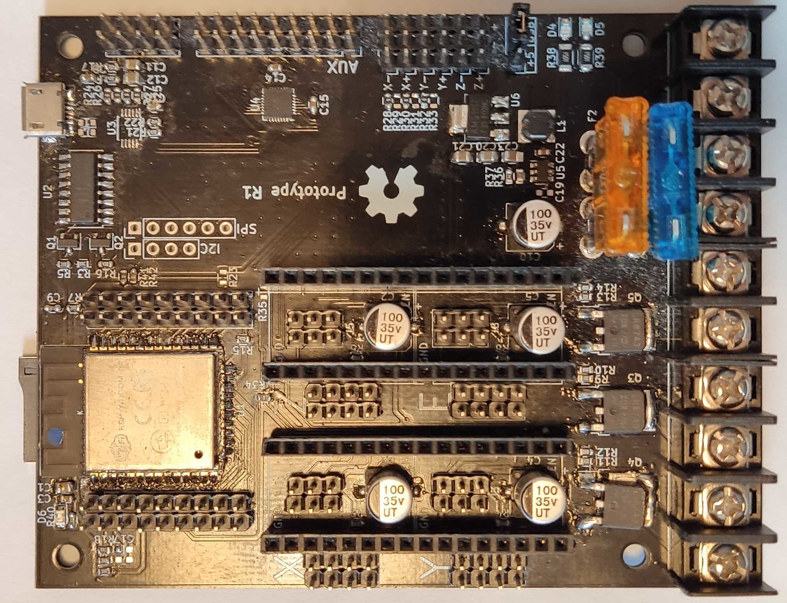

From [Simon Jouet](https://github.com/simon-jouet), a generic ESP32 controller with 4MB flash memory, no IO expander.   

* [github](https://github.com/simon-jouet/ESP32Controller)

## Specs   

* ESP32 with 4MB flash memory, sd card reader

