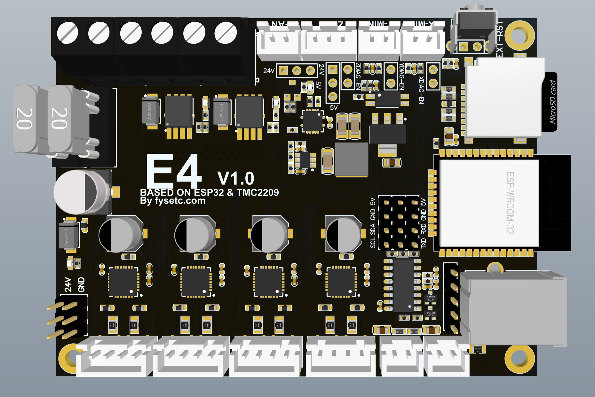

From [FYSETC](https://github.com/FYSETC), an ESP32 controller with 16MB flash memory, no IO expander.

* [github](https://github.com/FYSETC/FYSETC-E4)

## Specs
* ESP32 with 16MB flash memory, sd card reader

