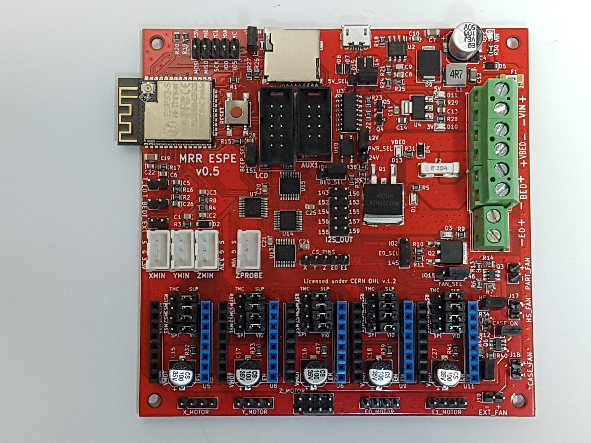

From [Maple Rain](http://www.maplerain.com/en), an ESP32 controller with 4MB flash memory, with IO expander.

* [github](https://github.com/maplerainresearch/MRR_ESPE)

## Specs
* ESP32 with 4MB flash memory, sd card reader

