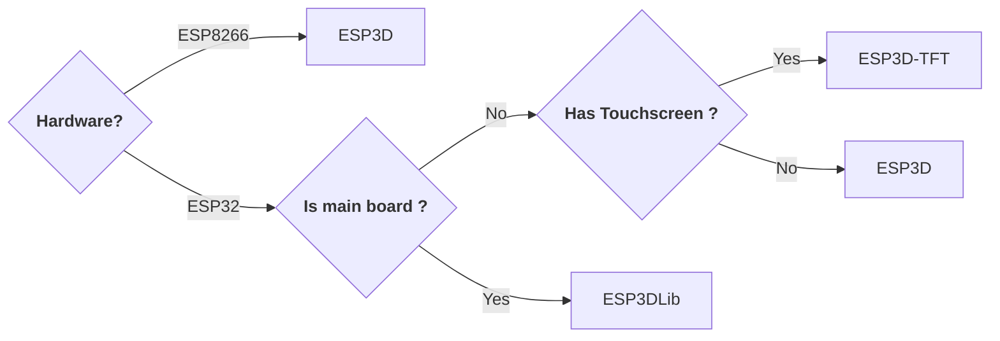
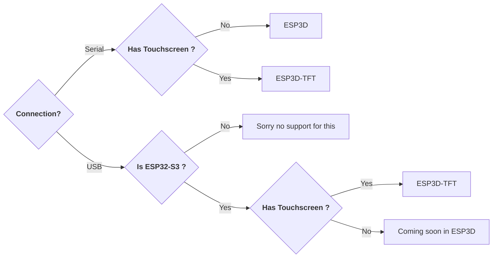
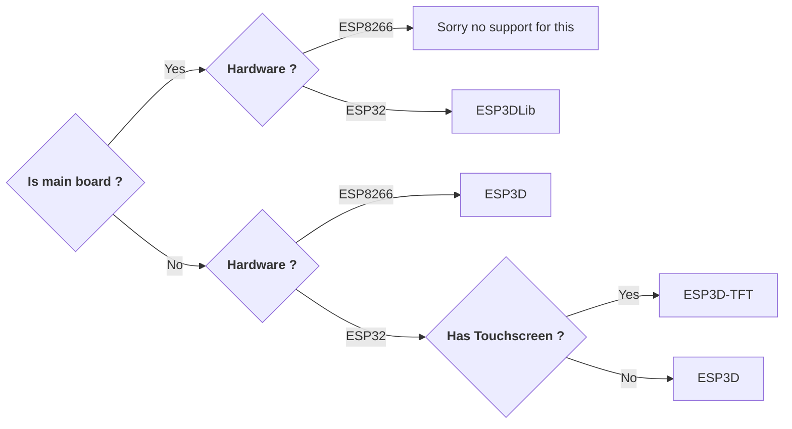

import Mermaid from '../../components/Mermaid.astro';

<Mermaid />

# What is ESP3D Ecosystem?

ESP3D Ecosystem is a collection of projects based on Espressif boards like ESP8266 and ESP32. The purpose is to provide WiFi features to users of 3D printers, CNC, sand tables, and plotters.

Depending on the configuration and the hardware, the solution can be different, but the goal is to provide a set of features that work across devices.

Check the menu for the current projects: each one has a different implementation for the same purpose.

## What project should I use?

### Based on hardware

### Based on connection

### Based on feature

> **Note:** The current project selection is a migration preview. Explore the sidebar for ESP3D, ESP3DLib, ESP3D-TFT, and other sections.
