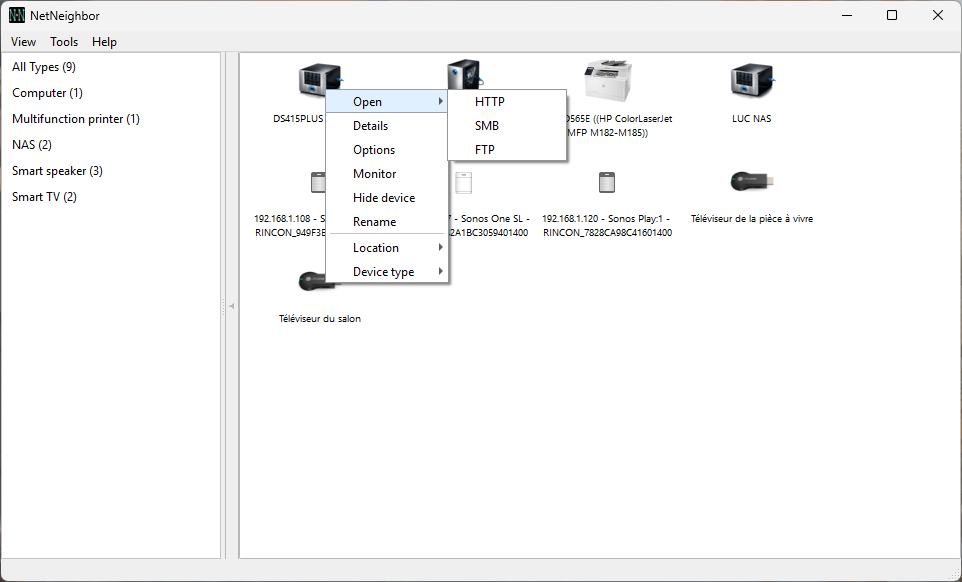
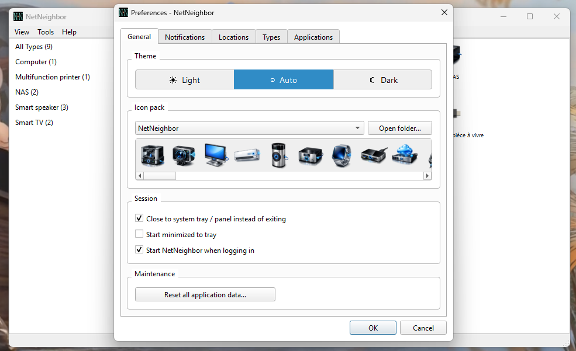
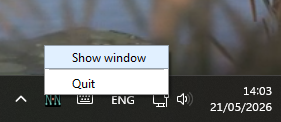

import { Card, CardGrid, LinkButton, Badge } from '@astrojs/starlight/components';

**Discover and monitor devices on your local network.**

NetNeighbor is a free desktop application that automatically finds all devices
on your network and displays them with icons or in a list — printers, NAS drives,
cameras, routers, 3D printers, and more.


---

## Features

<CardGrid>
  <Card title="Instant display" icon="rocket">
    Previously-seen devices appear immediately at startup from the local cache — no
    waiting for discovery to complete.
  </Card>
  <Card title="Automatic discovery" icon="magnifier">
    Finds devices without any configuration or active port scan (SSDP, mDNS,
    WS-Discovery, NetBIOS).
  </Card>
  <Card title="One-click connection" icon="external">
    Opens HTTP, HTTPS, SMB, SSH, FTP, SFTP and Telnet with a double-click.
    Configurable per device and per scheme.
  </Card>
  <Card title="Icon packs" icon="seti:image">
    Switch between icon themes. Install community packs or create your own.
    Per-device icon override with a visual picker.
  </Card>
  <Card title="Device management" icon="setting">
    Rename devices, tag by location, assign a custom icon or type. Settings are
    stored locally and survive reboots.
  </Card>
  <Card title="System tray" icon="laptop">
    Runs quietly in the background. Optional autostart at login and minimize to tray.
  </Card>
  <Card title="Cross-platform" icon="puzzle">
    Runs on Windows, Linux and macOS. Native SMB credential dialog on Windows.
  </Card>
  <Card title="Localised" icon="translate">
    French, Spanish, German, Italian, Dutch, Japanese, Simplified and Traditional
    Chinese.
  </Card>
</CardGrid>

---

## Screenshots

### Main window — icon grid


Icon grid with devices grouped by type. Switch to unsorted or list view from the **View** menu.

### Device list with sidebar


The sidebar groups devices by type or location. Sort by any column in list view.

### Right-click menu



Right-click any device to open it, view its details, rename it, change its type,
assign a location, or run a custom command.

### Preferences — General



Switch icon packs, choose a light/dark/auto theme, and manage session autostart.

### System tray



NetNeighbor can minimise to the system tray and start silently at login.

---

## Download

<Badge text="Latest release: 2.0.0" variant="success" />

<CardGrid>
  <Card title="Windows installer" icon="seti:windows">
    **Recommended** for Windows 10/11. Installs as a standard application.

    ```
    NetNeighbor-2.0.0-win64-setup.exe
    ```

    > Not code-signed — SmartScreen may warn: click **More info** → **Run anyway**.
  </Card>
  <Card title="macOS DMG" icon="apple">
    Drag NetNeighbor to Applications and launch.

    - `NetNeighbor-2.0.0-macos-arm64.dmg` — Apple Silicon (macOS 12+)
    - `NetNeighbor-2.0.0-macos-intel.dmg` — Intel (macOS 11+)

    > Not notarized — if Gatekeeper blocks it: right-click → **Open** → **Open**, or run `xattr -cr /Applications/NetNeighbor.app` in Terminal.
  </Card>
  <Card title=".deb package" icon="linux">
    **Recommended** for Ubuntu, Linux Mint, and Debian.
    Dependencies installed automatically.

    ```bash
    sudo dpkg -i netneighbor_2.0.0_amd64.deb
    ```
  </Card>
  <Card title="AppImage" icon="puzzle">
    Runs on any Linux distribution.

    ```bash
    chmod +x NetNeighbor-2.0.0-x86_64.AppImage
    ./NetNeighbor-2.0.0-x86_64.AppImage
    ```
  </Card>
  <Card title="Run from source" icon="github">
    Windows, Linux and macOS.

    ```bash
    pip install -r requirements.txt
    python main.py
    ```
  </Card>
</CardGrid>

<LinkButton href="https://github.com/luc-github/NetNeighbor/releases/latest" icon="github" variant="primary">
  Download from GitHub Releases
</LinkButton>
<LinkButton href="https://github.com/luc-github/NetNeighbor/releases" icon="list-format" variant="minimal">
  All releases and checksums
</LinkButton>

---

## Requirements

| Platform | Requirement |
|----------|-------------|
| **Windows** | Windows 10 or later |
| **Linux** | Ubuntu 22.04+, Linux Mint 21+, Debian 12+, or equivalent |
| **macOS (Apple Silicon)** | macOS 12 (Monterey) or later |
| **macOS (Intel)** | macOS 11 (Big Sur) or later |
| **From source** | Python 3.10+ · PySide6 6.5+ |

For **NetBIOS name resolution** on Linux (Windows device names):
```bash
sudo apt install samba-common-bin
```

---

## Documentation

<CardGrid>
  <Card title="User documentation" icon="open-book">
    Detailed guide covering all features, dialogs, preferences, and troubleshooting.

    [Read USER_DOCUMENTATION →](https://github.com/luc-github/NetNeighbor/blob/2.0/docs/USER_DOCUMENTATION.md)
  </Card>
  <Card title="Icon packs" icon="seti:image">
    How to install community icon packs or create your own.

    [Read CONTRIBUTING_ICONS →](https://github.com/luc-github/NetNeighbor/blob/2.0/docs/contributing/CONTRIBUTING_ICONS.md)
  </Card>
  <Card title="Source code" icon="github">
    LGPL-3.0, contributions welcome.

    [github.com/luc-github/NetNeighbor →](https://github.com/luc-github/NetNeighbor)
  </Card>
</CardGrid>
