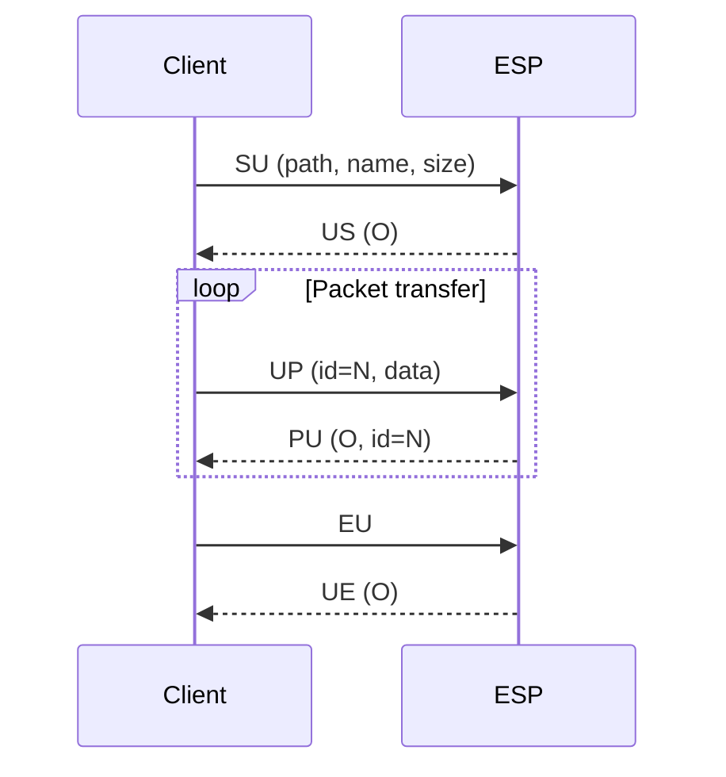
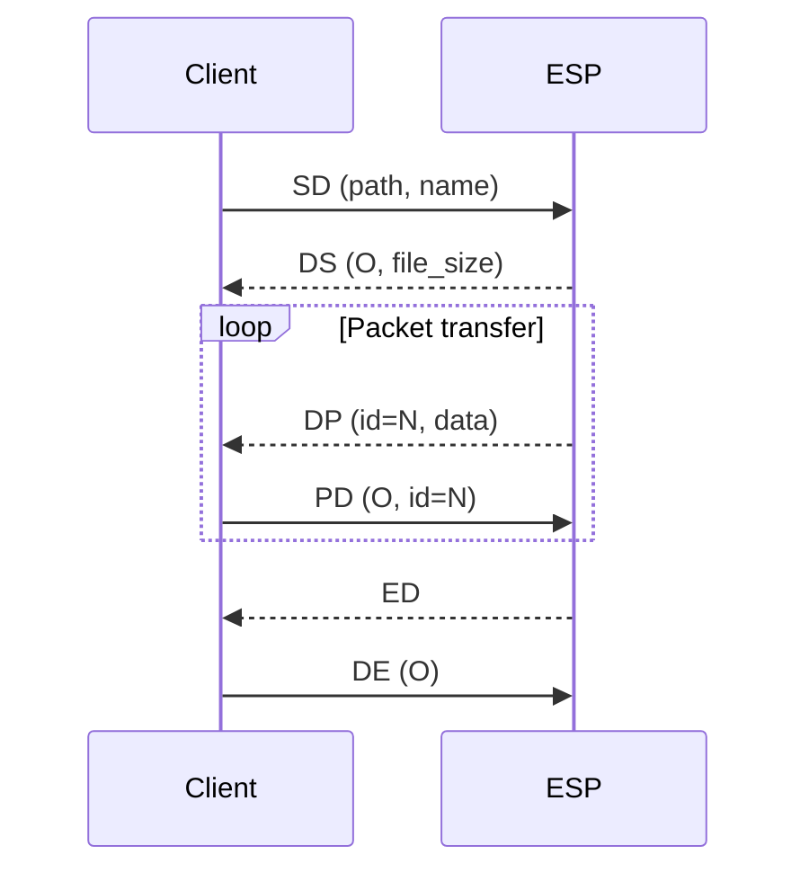
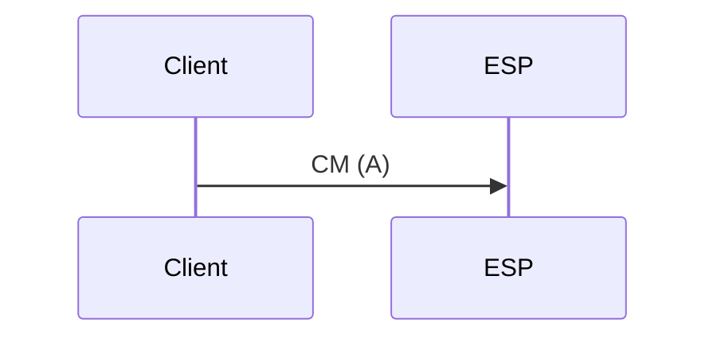

import Mermaid from '../../../../../../components/Mermaid.astro';

<Mermaid />

## On this page

- [Implementation differences: ESP-IDF vs Arduino](#implementation-differences-esp-idf-vs-arduino)
- [1. Terminal WebSocket — `/ws`, subprotocol `webui-v3`](#1-terminal-websocket--ws-subprotocol-webui-v3)
- [2. Data WebSocket — `/wsdata`, subprotocol `esp3d-v1`](#2-data-websocket--wsdata-subprotocol-esp3d-v1)
- [Frame types](#frame-types)
- [Capability probe](#capability-probe)
- [Transfer flow summary](#transfer-flow-summary)
- [Server implementation guide](#server-implementation-guide)
- [Testing](#testing)
- [Reference implementation](#reference-implementation)

---

There are **two separate WebSocket endpoints**. They use **different URI paths and subprotocols**; a client **must** use the correct pair. Negotiating the wrong subprotocol or path means the connection is handled by the **wrong** service — file transfer will **not** work.

<div class="rounded-table">
<table class="table-compact">
  <thead>
    <tr>
      <th>Endpoint</th>
      <th>Typical URI (ESP-IDF)</th>
      <th>Subprotocol (<code>Sec-WebSocket-Protocol</code>)</th>
      <th>Role</th>
    </tr>
  </thead>
  <tbody>
    <tr>
      <td><strong>Terminal / WebUI</strong></td>
      <td><strong><code>/ws</code></strong></td>
      <td><strong><code>webui-v3</code></strong></td>
      <td><strong>BINARY</strong> = raw machine/serial bytes (no V1 header). <strong>TEXT</strong> = <code>PING</code>, <code>NOTIFICATION:</code>, <code>currentID:</code>, etc.</td>
    </tr>
    <tr>
      <td><strong>Data (external tools)</strong></td>
      <td><strong><code>/wsdata</code></strong></td>
      <td><strong><code>esp3d-v1</code></strong></td>
      <td>ESP commands + G-code in <strong>TEXT</strong>; <strong>BINARY</strong> = V1 status and file upload/download (<code>SR</code>, <code>SU</code>, …).</td>
    </tr>
  </tbody>
  <tfoot>
    <tr>
      <td>&nbsp;</td>
      <td>&nbsp;</td>
      <td>&nbsp;</td>
      <td>&nbsp;</td>
    </tr>
  </tfoot>
</table>
</div>

**Common mistake:** sending V1 binary opcodes on `/ws`. The server treats binary as stream data, not file-transfer frames — **transfers are impossible on that socket by design**.

---

## Implementation differences: ESP-IDF vs Arduino

Depending on the underlying HTTP server framework, the deployment of these two endpoints differs:

- **ESP-IDF (`httpd_ws`)**: Both `/ws` and `/wsdata` operate on the **same HTTP port** (port 80). The server routes connections to the correct handler strictly based on the requested URI path.
- **Arduino (`WebSocketsServer`)**: The server cannot natively multiplex WebSockets on the main HTTP port 80. Instead, ESP3D creates **two separate TCP listeners on different ports**. Typically, the Terminal WebSocket uses `HTTP_PORT + 1` (e.g., 81), and the Data WebSocket uses the port configured in settings (`ESP_WEBSOCKET_PORT`, typically 82). The URI path (`/ws` vs `/wsdata`) is ignored; the client must connect to the correct **port** directly.

---

## 1. Terminal WebSocket — `/ws`, subprotocol `webui-v3`

### Text mode

Reserved messages between WebUI and ESP.  
Format: `<label>:<message>`

**ESP → WebUI:**

-   `currentID:<id>`  
    Sent when client connects. It is the last used ID and becomes the active ID.

-   `activeID:<id>`  
    Broadcast when a new client connects. Clients without this ID should close.  
    The ESP WS server closes all open WS connections except this one.

-   `PING:<time left>:<time out>`  
    **When authentication is enabled**: response to a `PING:<sessionId>` from the client, informing the time remaining before inactivity timeout.

-   `PONG:<server_millis>`  
    **When authentication is disabled** (or client sends bare `PING` without sessionId): firmware answers with a monotonic millisecond value. Used as keepalive reply.

-   `ERROR:<code>:<message>`  
    Raised during upload when the HTTP answer cannot cancel it.  
    This is a workaround: there is no API in the current webserver to cancel an active upload.

-   `NOTIFICATION:<message>`  
    Forwards the message sent by `[ESP600]` to the WebUI toast system.

-   `SENSOR: <value>[<unit>] <value2>[<unit2>] …`  
    Sensor data (e.g. DHT22 temperature/humidity).

**WebUI → ESP:**

-   `PING:<sessionId>`  
    **When authentication is enabled**: keepalive ping sending the current session cookie ID.

-   `PING:0`  
    Optional keepalive **without authentication**; ESP answers `PONG:<server_millis>`.

### Keepalive / heartbeat

-   Clients should read TEXT frames from the server (`PONG:…`, `currentID`, stream lines, etc.).
-   On **ESP-IDF 5.4.x**, WebSocket `DATA` handlers may see `req->content_len == 0` while a TEXT frame is still pending; the firmware must use `httpd_ws_recv_frame()` to read it, otherwise client `PING` is never handled and heartbeats fail.

### Binary mode — machine stream (not V1)

**ESP → client:** payloads are **raw bytes** from the CNC/serial stream forwarded to the WebUI. There is **no** application header — not the 4-byte `opcode + u16 length` layout used on `/wsdata`.

**How the embedded WebUI decodes binary** (`embedded/src/index.js`): each byte is mapped with `String.fromCharCode(byte)` (ISO-8859-1 style). Buffered until `\n` (0x0A) or `\r` (0x0D), then flushed as a line to the console.

**Client → ESP:** inbound binary on `/ws` is **not interpreted** (stub). User commands and G-code are sent as TEXT frames with `\n`/`\r` line discipline.

---

## 2. Data WebSocket — `/wsdata`, subprotocol `esp3d-v1`

This endpoint carries the **ESP3D WebSocket Protocol V1**: binary file-transfer and status frames, plus a text channel for ESP commands.

### Scope

<div class="rounded-table">
<table class="table-compact">
  <thead>
    <tr>
      <th>In scope</th>
      <th>Out of scope</th>
    </tr>
  </thead>
  <tbody>
    <tr>
      <td>Binary frames: status, upload, download, abort</td>
      <td>Terminal WebSocket (<code>webui-v3</code>)</td>
    </tr>
    <tr>
      <td>Text channel on the same socket (ESP commands, listings)</td>
      <td>HTTP upload / WebDAV</td>
    </tr>
    <tr>
      <td>Ordering, timeouts, capability probe</td>
      <td>WebSocket session / cookie auth (future)</td>
    </tr>
  </tbody>
  <tfoot>
    <tr>
      <td>&nbsp;</td>
      <td>&nbsp;</td>
    </tr>
  </tfoot>
</table>
</div>

### Authentication

**V1 is specified for the no-WebSocket-auth case:** after connect, the client reads the welcome TEXT frame, then may send binary **SR** or text commands without tokens.

Builds with `ESP3D_AUTHENTICATION_FEATURE` may expose `/wsdata` without the same checks as HTTP until a future revision documents the handshake. Simplest interop: **open socket → welcome → SR / SU / …** with no extra steps.

### Protocol version

V1 is identified explicitly when the server answers **SR** while idle: see [Capability probe](#capability-probe) below. Future revisions may increment the version byte or add opcodes; clients must ignore unknown opcodes if they only need a subset.

### Two client checks

<div class="rounded-table">
<table class="table-compact">
  <thead>
    <tr>
      <th>Step</th>
      <th>What it validates</th>
      <th>Failure means</th>
    </tr>
  </thead>
  <tbody>
    <tr>
      <td><strong>(1) WebSocket handshake</strong></td>
      <td>TCP + HTTP upgrade to <code>/wsdata</code> with <code>esp3d-v1</code> negotiated</td>
      <td>Wrong host/port, 404, subprotocol rejected — no data channel</td>
    </tr>
    <tr>
      <td><strong>(2) Status command SR → RS</strong></td>
      <td>After socket open, send binary <strong>SR</strong> and receive <strong>RS</strong> within timeout</td>
      <td>Endpoint open but no V1 binary handler — <strong>do not infer V1 from handshake alone</strong></td>
    </tr>
  </tbody>
  <tfoot>
    <tr>
      <td>&nbsp;</td>
      <td>&nbsp;</td>
      <td>&nbsp;</td>
    </tr>
  </tfoot>
</table>
</div>

### On connect

The server sends **one TEXT frame** first: a welcome line (`Welcome to ESP3D-X V…`). Clients must **read** it before assuming the next message is a command reply.

### Text mode

Used for ESP commands and G-code relay (e.g. `[ESP720]` list flash, `[ESP740]` list SD). Use **`json=yes`** for directory listings — one JSON object, faster and unambiguous. Plain-text listings end with `Total:…` / `Available:…` lines without a final `ok`.

**Line termination:** client TEXT is accumulated until `\n` or `\r`. A frame without a line ending is received but does not run the command. Tools should send `[ESP720]…\n`.

**Flash paths:** `[ESP720]` takes paths relative to the flash logical root; use `/` for root.

### Binary mode — V1 frame format

Packet data size defaults to **1024 bytes** (`ESP3D_WS_TRANSFER_PACKET_SIZE`).

All frames share the same header:

| Byte 0 | Byte 1 | Byte 2–3 | Byte 4+ |
|--------|--------|----------|---------|
| Opcode MSB | Opcode LSB | Payload length (uint16_t LE) | Payload |

- **Opcode**: 2 ASCII bytes identifying the frame type (e.g. `SR`, `UP`).
- **Payload length**: number of bytes that follow the header, little-endian uint16_t.
- All multi-byte integer fields in the payload are **little-endian**.

**Start / ACK status byte** (first byte of **US**, **DS**, **PU**, **UE** where applicable):

<div class="rounded-table">
<table class="table-compact">
  <thead>
    <tr>
      <th>Byte</th>
      <th>Hex</th>
      <th>Meaning</th>
    </tr>
  </thead>
  <tbody>
    <tr>
      <td><code>O</code></td>
      <td>0x4F</td>
      <td>ok / idle</td>
    </tr>
    <tr>
      <td><code>E</code></td>
      <td>0x45</td>
      <td>error</td>
    </tr>
    <tr>
      <td><code>B</code></td>
      <td>0x42</td>
      <td>busy</td>
    </tr>
    <tr>
      <td><code>A</code></td>
      <td>0x41</td>
      <td>abort</td>
    </tr>
  </tbody>
  <tfoot>
    <tr>
      <td>&nbsp;</td>
      <td>&nbsp;</td>
      <td>&nbsp;</td>
    </tr>
  </tfoot>
</table>
</div>

---

## Frame types

### Query status — `SR` / `RS`

**Client → ESP** (no payload):


| S | R | 0x00 | 0x00 |
| --- | --- | --- | --- |
| S | R | 0x00 | 0x00 |


**ESP → Client**:

Response to **SR**. First payload byte = transfer state:

<div class="rounded-table">
<table class="table-compact">
  <thead>
    <tr>
      <th>Byte</th>
      <th>Hex</th>
      <th>Meaning</th>
    </tr>
  </thead>
  <tbody>
    <tr>
      <td><code>O</code></td>
      <td>0x4F</td>
      <td>idle / ok</td>
    </tr>
    <tr>
      <td><code>B</code></td>
      <td>0x42</td>
      <td>busy</td>
    </tr>
    <tr>
      <td><code>E</code></td>
      <td>0x45</td>
      <td>error</td>
    </tr>
    <tr>
      <td><code>A</code></td>
      <td>0x41</td>
      <td>abort</td>
    </tr>
    <tr>
      <td><code>D</code></td>
      <td>0x44</td>
      <td>download ongoing</td>
    </tr>
    <tr>
      <td><code>U</code></td>
      <td>0x55</td>
      <td>upload ongoing</td>
    </tr>
  </tbody>
  <tfoot>
    <tr>
      <td>&nbsp;</td>
      <td>&nbsp;</td>
      <td>&nbsp;</td>
    </tr>
  </tfoot>
</table>
</div>

**Idle (V1):** payload = `O` (0x4F) + `1` (0x01) — protocol version byte.


| R | S | 0x02 | 0x00 | O | 1 |
| --- | --- | --- | --- | --- | --- |
| R | S | 0x02 | 0x00 | O | 1 |


*Note:* legacy servers may send only `O` (1-byte payload, no version).

**Error:**

After the status byte: 1 byte error code, 1 byte string length, then the string.


| R | S | PL_LO | PL_HI | E | ERR_CODE | STR_LEN | STR… |
| --- | --- | --- | --- | --- | --- | --- | --- |
| R | S | PL_LO | PL_HI | E | ERR_CODE | STR_LEN | STR… |


**Upload in progress:**

After the status byte: path size (1 byte), path, filename size (1 byte), filename,  
total file size (uint32_t LE), processed bytes (uint32_t LE), last packet ID (uint32_t LE).


| R | S | PL_LO | PL_HI | U | PATH_SZ | PATH… | NAME_SZ | NAME… | TOTAL(4) | DONE(4) | LAST_ID(4) |
| --- | --- | --- | --- | --- | --- | --- | --- | --- | --- | --- | --- |
| R | S | PL_LO | PL_HI | U | PATH_SZ | PATH… | NAME_SZ | NAME… | TOTAL(4) | DONE(4) | LAST_ID(4) |


**Download in progress:**

Same layout as Upload ongoing, with `D` status byte.


| R | S | PL_LO | PL_HI | D | PATH_SZ | PATH… | NAME_SZ | NAME… | TOTAL(4) | DONE(4) | LAST_ID(4) |
| --- | --- | --- | --- | --- | --- | --- | --- | --- | --- | --- | --- |
| R | S | PL_LO | PL_HI | D | PATH_SZ | PATH… | NAME_SZ | NAME… | TOTAL(4) | DONE(4) | LAST_ID(4) |


---

### Start upload — `SU` / `US`

**Client → ESP:**

Payload: path size (1 byte), path, filename size (1 byte), filename, total file size (uint32_t LE).


| S | U | PL_LO | PL_HI | PATH_SZ | PATH… | NAME_SZ | NAME… | FILE_SIZE(4) |
| --- | --- | --- | --- | --- | --- | --- | --- | --- |
| S | U | PL_LO | PL_HI | PATH_SZ | PATH… | NAME_SZ | NAME… | FILE_SIZE(4) |


**ESP → Client (OK — transfer can start):**


| U | S | 0x01 | 0x00 | O |
| --- | --- | --- | --- | --- |
| U | S | 0x01 | 0x00 | O |


**ESP → Client (Error — transfer rejected):**


| U | S | 0x01 | 0x00 | E |
| --- | --- | --- | --- | --- |
| U | S | 0x01 | 0x00 | E |


---

### Upload packet — `UP` / `PU`

**Client → ESP:**

Payload: packet ID (uint32_t LE), then data bytes.


| U | P | PL_LO | PL_HI | ID(4) | DATA… |
| --- | --- | --- | --- | --- | --- |
| U | P | PL_LO | PL_HI | ID(4) | DATA… |


**ESP → Client (ACK):**

Success (5 bytes): `O` + packet_id (uint32_t LE).


| P | U | 0x05 | 0x00 | O | ID(4) |
| --- | --- | --- | --- | --- | --- |
| P | U | 0x05 | 0x00 | O | ID(4) |


Error (5 bytes): `E` + packet_id (uint32_t LE). If **UP** payload was too short to contain an id, id = `0xFFFFFFFF`.


| P | U | 0x05 | 0x00 | E | ID(4) |
| --- | --- | --- | --- | --- | --- |
| P | U | 0x05 | 0x00 | E | ID(4) |


*Note:* clients may treat **PU** with length 1 and `E` only as a legacy pre-correlation response.

---

### End upload — `EU` / `UE`

Sent by the client after the last upload packet.

**Client → ESP** (no payload):


| E | U | 0x00 | 0x00 |
| --- | --- | --- | --- |
| E | U | 0x00 | 0x00 |


**ESP → Client (OK):**


| U | E | 0x01 | 0x00 | O |
| --- | --- | --- | --- | --- |
| U | E | 0x01 | 0x00 | O |


**ESP → Client (Error):**


| U | E | 0x01 | 0x00 | E |
| --- | --- | --- | --- | --- |
| U | E | 0x01 | 0x00 | E |


---

### Start download — `SD` / `DS`

**Client → ESP:**

Payload: path size (1 byte), path, filename size (1 byte), filename.


| S | D | PL_LO | PL_HI | PATH_SZ | PATH… | NAME_SZ | NAME… |
| --- | --- | --- | --- | --- | --- | --- | --- |
| S | D | PL_LO | PL_HI | PATH_SZ | PATH… | NAME_SZ | NAME… |


**ESP → Client (OK — transfer can start):**

Payload: status `O`, then total file size (uint32_t LE).


| D | S | 0x05 | 0x00 | O | FILE_SIZE(4) |
| --- | --- | --- | --- | --- | --- |
| D | S | 0x05 | 0x00 | O | FILE_SIZE(4) |


**ESP → Client (Error):**


| D | S | 0x01 | 0x00 | E |
| --- | --- | --- | --- | --- |
| D | S | 0x01 | 0x00 | E |


---

### Download packet — `DP` / `PD`

**ESP → Client:**

Payload: packet ID (uint32_t LE), then data bytes.


| D | P | PL_LO | PL_HI | ID(4) | DATA… |
| --- | --- | --- | --- | --- | --- |
| D | P | PL_LO | PL_HI | ID(4) | DATA… |


**Client → ESP (ACK):**


| P | D | 0x05 | 0x00 | O | ID(4) |
| --- | --- | --- | --- | --- | --- |
| P | D | 0x05 | 0x00 | O | ID(4) |


---

### End download — `ED` / `DE`

Sent by the ESP after the last download packet.

**ESP → Client** (no payload):


| E | D | 0x00 | 0x00 |
| --- | --- | --- | --- |
| E | D | 0x00 | 0x00 |


**Client → ESP (ACK):**


| D | E | 0x01 | 0x00 | O |
| --- | --- | --- | --- | --- |
| D | E | 0x01 | 0x00 | O |


---

### Command — `CM`

**Client → ESP** (1-byte payload: command code):


| C | M | 0x01 | 0x00 | CMD |
| --- | --- | --- | --- | --- |
| C | M | 0x01 | 0x00 | CMD |


Command codes:

| Code | Hex | Meaning |
|------|-----|---------|
| <code>A</code> | 0x41 | Abort current transfer |

**Abort frame:**


| C | M | 0x01 | 0x00 | A |
| --- | --- | --- | --- | --- |
| C | M | 0x01 | 0x00 | A |


---

## Capability probe

Clients **must** assume no binary file-transfer support until check **(2)** succeeds, even if **(1)** succeeded.

1.  After WebSocket is open, consume the **mandatory welcome TEXT** frame.
2.  Send binary **SR** with empty payload (header only: `S`, `R`, length `0` LE).
3.  Wait for a binary response (recommended timeout: **2–5 s**).
4.  Interpretation:
    -   No binary **RS** before timeout → **no binary support** (wrong endpoint/subprotocol or old firmware).
    -   Binary **RS** with non-empty payload → binary status channel present; first payload byte = transfer state.
    -   Idle (`O`), payload ≥ 2 bytes: byte 1 = protocol version; value `1` = V1 as defined here.
    -   Idle (`O`), payload 1 byte: legacy server — clients may still attempt V1 but explicit version byte is preferred.

---

## Transfer flow summary

### Upload



### Download



### Abort (at any point during transfer)



---

## Server implementation guide

**Connection:**

-   Path: `/wsdata` (distinct from `/ws`).
-   Subprotocol: negotiate `esp3d-v1`. Reject clients offering only `webui-v3` for this URI.
-   Send one TEXT welcome frame immediately after accept.

**Minimum V1 behavior:**

1.  **SR → RS** — idle: `O` + version `1` (2-byte payload). Upload/download in progress: state byte + path + filename + sizes.
2.  **Upload sequence** — accept **SU**, **UP**, **EU**; reply **US**, **PU** (5-byte payload), **UE**.
3.  **Download sequence** — accept **SD**; reply **DS** with file size, then **DP** / **ED**; client sends **PD** / **DE**.
4.  **Concurrency** — one active transfer per connection; return `B` on **US**/**DS** if busy.
5.  **Text channel** — same socket carries TEXT frames for `[ESP720]`/`[ESP740]` and G-code.

**Error handling:**

-   Invalid opcode: log/drop; optional TEXT error is product-specific.
-   Payload too short: respond with `E` on the relevant ACK if the protocol defines one for that step.

---

## Testing

```bash
python tools/websocket/ws_transfer_test.py --host <ip> --port <port> status
python tools/websocket/ws_transfer_test.py --host <ip> --port <port> roundtrip <file> /fs
```

Testing tools are located in the [`tools/websocket`](https://github.com/luc-github/ESP3D/tree/3.0/tools/websocket) directory of the ESP3D repository.


*wsterm.html , websocket client test*

---

## Reference implementation

-   Server: `main/modules/websocket_server/esp3d_ws_data_service.cpp` / `.h`
-   Constants: `WS_OP_*`, `WS_STATUS_*`, `WS_BINARY_PROTOCOL_V1`
-   Packet size: `ESP3D_WS_TRANSFER_PACKET_SIZE`

### Client note

The pendant's WebSocket **client** build targets text streaming to the CNC; it does **not** implement the V1 binary file-transfer client. Third-party servers on the machine tool can implement this document so PC or phone clients perform file transfer over `ws://`.
