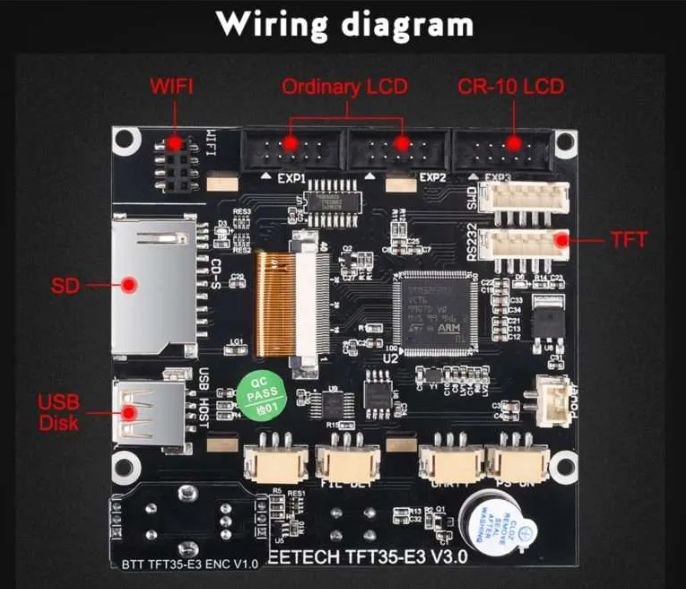
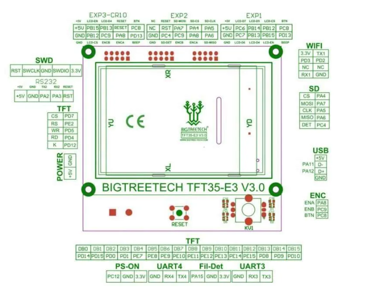

+++
archetype = "section"
title = "TFT 35 E3"
description = "Socket available"
weight = 1
+++
The board has footprint for an ESP01 connector

| <!-- -->  | <!-- --> |
|-|-|
| Board pins socket | ESP01 |
| Board firmware | BTT | 
| Board configuration note |Need to enable wifi port using config.ini file|
| ESP3D configuration note | Raw serial, no SD |