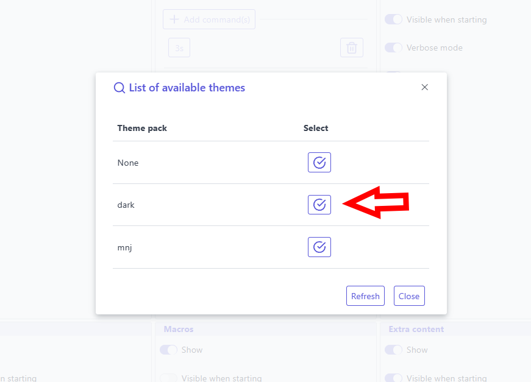

+++
description = "Themes description"
archetype = "section"
title = "Themes"
menuPre = "<i class='fas fa-palette'></i> "
weight = 9
+++
Themes are actually just gzipped css file that overload current css, their name must start by `theme-` to be recognized and have proper `.gz` extension if they are compressed.
You only need to put inside the properties you want to customize.

### Example of small changes
```css
.feather-icon-container svg,
span.input-group-addon,
span.form-input,
input,
select,
span.text-dark,
label.text-dark,
label.hide-low,
section,
button,
.navbar,
.modal-container,
body,
.empty,
html{
background-color:rgb(200, 200, 233)!important;
color:white!important;

}

a svg.esp3dlogo{
color:#c0c0c0!important;
}

.form-switch input:checked + .form-icon {
    background-color:white!important;
}

a.active svg,
a.active label.hide-low{
color:blue!important;
}

.navbar{
border-bottom:white solid 0.5px;
}

span.navbar-section{
background-color:#0e0e6d!important;
color:white!important;
}
```
### How to set  a new theme
#### Upload theme
Upload gzipped (or not) theme using the flash file system panel in dashboard


#### Select theme
Select theme in interface settings



Once change are applied the webui will automatically restart


### Here some themes as examples:   
{}
