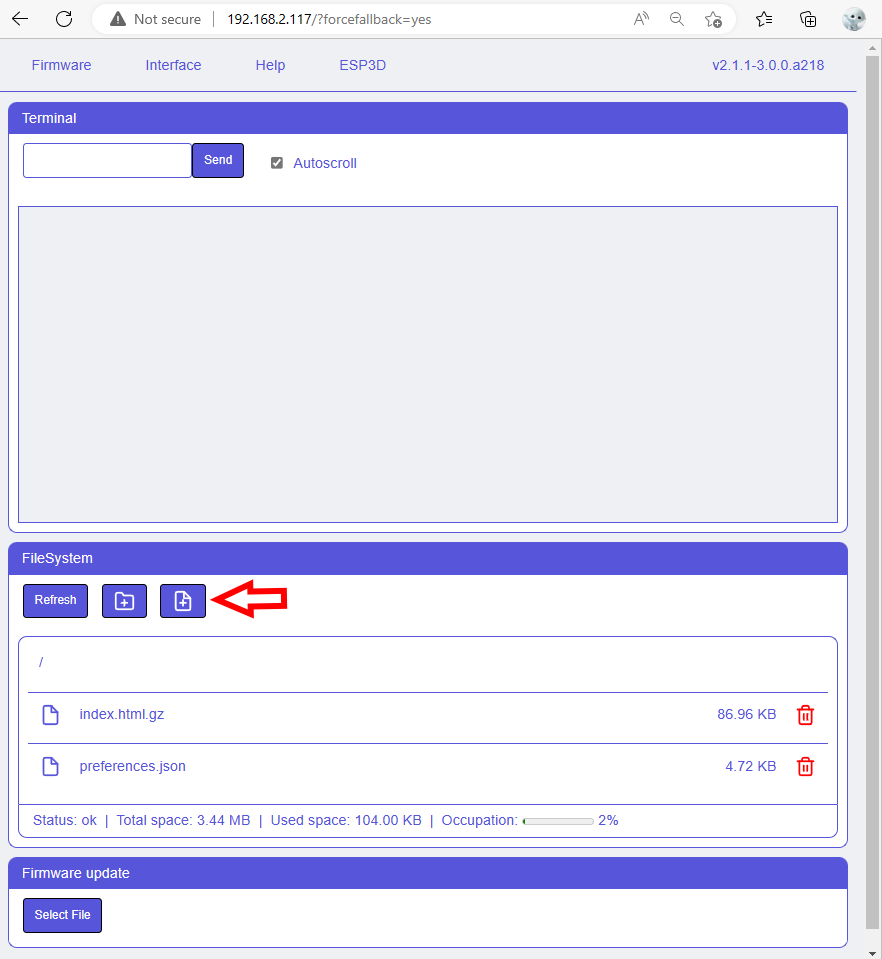

+++
archetype = "section"
title = "Installation"
menuPre = "<i class='fas fa-hammer'></i> "
weight = 2
+++

The Web UI is represented by one file : index.hml.gz
The full package with all languages is available [here](https://github.com/luc-github/ESP3D-WEBUI/blob/2.1/languages/multi/index.html.gz) 
But it may not fit your available size on flash, so you can select a single language package [here](https://github.com/luc-github/ESP3D-WEBUI/tree/2.1/languages) which is lighter and will fit smallest boards.

### Upload index.html.gz

#### Using embedded uploader

If the embedded is not visible you can access to it using:
`http://your_IP_address?forcefallback=yes` anytime

#### Using Web UI
You can upload file using Web UI

### Finalize update

Refresh the page to `http://your_IP` to display updated Web interface.

Note: you can also upload a customized `favicon.ico`
