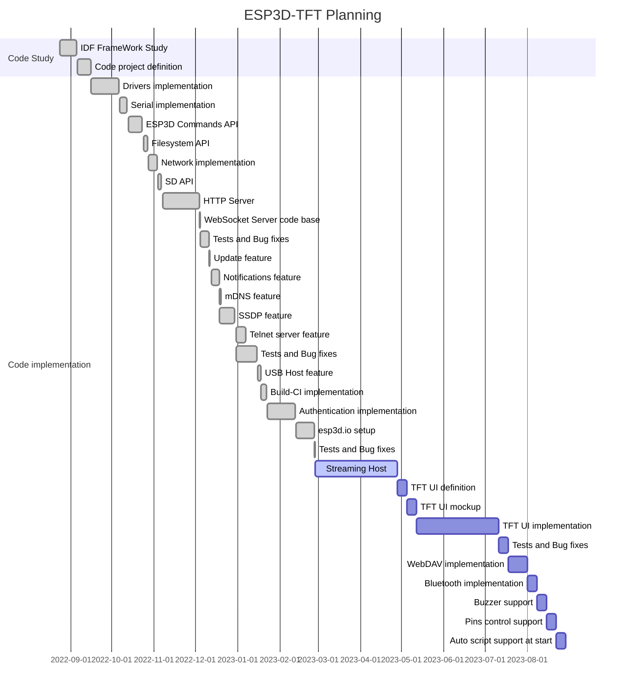

This version is the development version, features can change anytime, feedback, PR and suggestions are welcome.

Firmware should work with the following firmwares:   

* [Repetier 1.0](https://www.repetier.com/documentation/repetier-firmware/)
* [Marlin 1.X/2.X](https://marlinfw.org/)
* [Smoothieware 1.x](https://smoothieware.org/)
* [grbl 1.x](https://github.com/gnea/grbl) 
* [grblHAL](https://github.com/grblHAL)

The communication between ESP board and target board is done by serial or by USB depending of ESP32 board. 

The firmware must be used with [ESP3D-WEBUI 3.X](/esp3d-webui/v3.x/)

### Estimated planning

