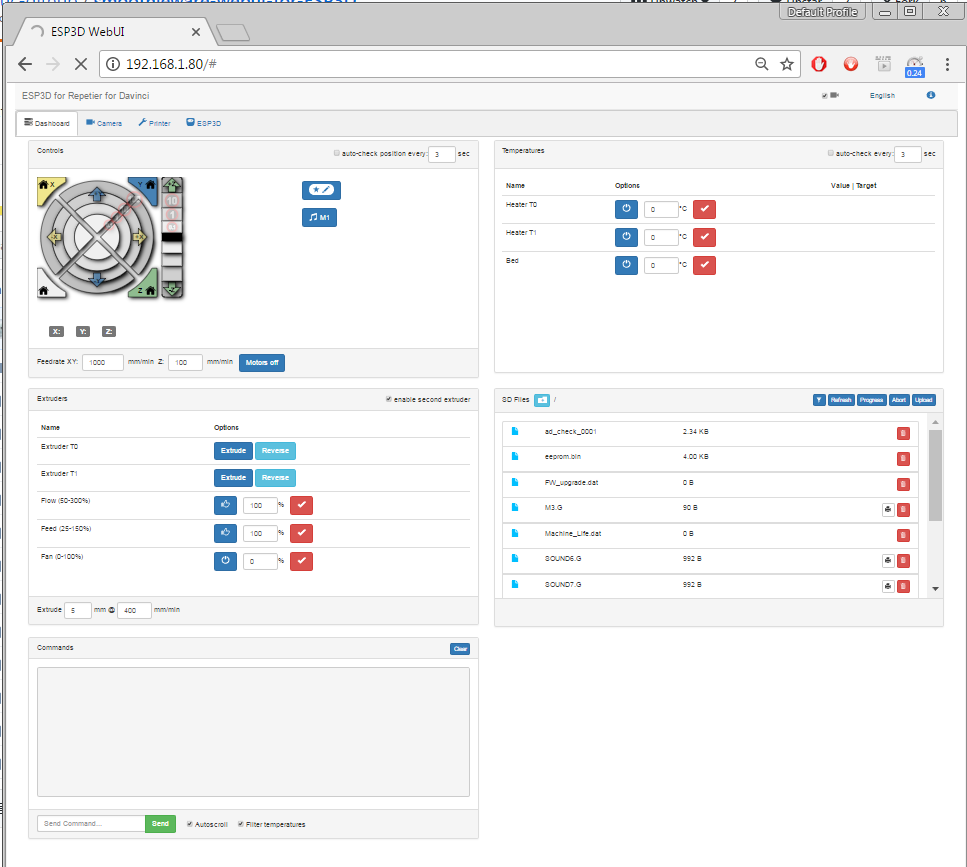

This version is the production version, features are frozen, only bugfixes are accepted.

WebUI should support features of the following firmwares:   

* [Repetier 1.0/2.0](https://www.repetier.com/documentation/repetier-firmware/)
* [Marlin 1.X/2.X](https://marlinfw.org/)
* [Smoothieware 1.x](https://smoothieware.org/)
* [grbl 1.x](https://github.com/gnea/grbl) 

The ESP3D-WEBUI 2.X must be used with [ESP3D 2.X](/esp3d/v2.x/), [ESP3DLib 1.X](/esp3dlib/v1.x/).
