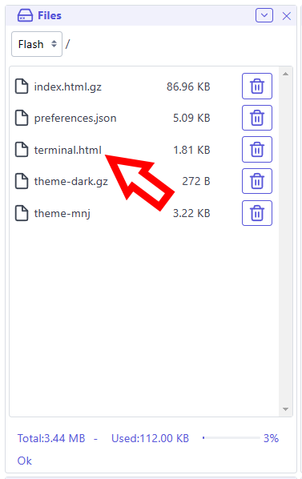
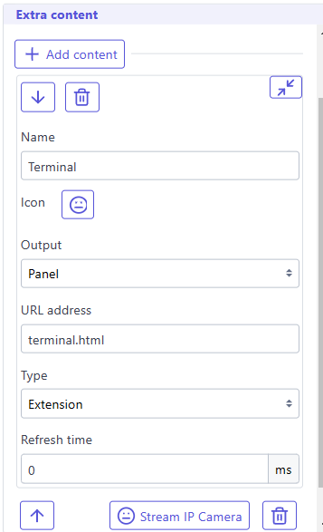
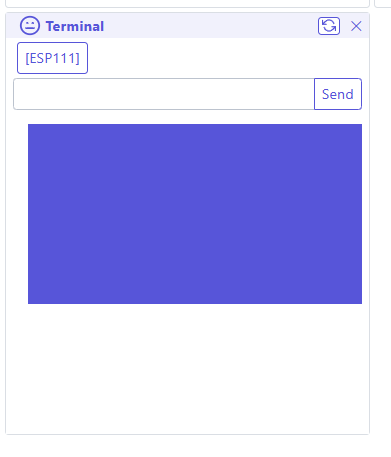

## What is an extension ?
An extension is a small piece of code that can be added to the Web UI to add new functionality. It can be used to add new tabs, new panels in web UI.
Extensions are dynamic, modular components that enhance the functionality of our main application. They are designed to be flexible and easily integrated, allowing for customization and expansion of features without modifying the core application.
Key characteristics of extensions include:

* Isolated Execution: Extensions run within their own iframe, ensuring a level of separation from the main application.
* Dynamic Loading: They can be loaded on-demand, improving the application's overall performance and flexibility.
* Consistent Styling: Extensions adopt styles from the main application, maintaining a cohesive look and feel.
* Diverse Functionality: Extensions can serve various purposes, from adding new features to integrating external services.
* Managed Lifecycle: The system handles the loading, display, and unloading of extensions, simplifying their management.

By leveraging extensions, our application becomes more adaptable and can cater to a wide range of user needs while maintaining a stable core structure.   

## Install an extension in Web UI

### Upload it to local filesystem or any path available to web server

!!! info "Note"
    To decrease the size of of the extension you can minify and gzip it, it will reduce its size, and will  be faster to load.

### Add extra panel or page using this extension

It will be displayed according your settings
