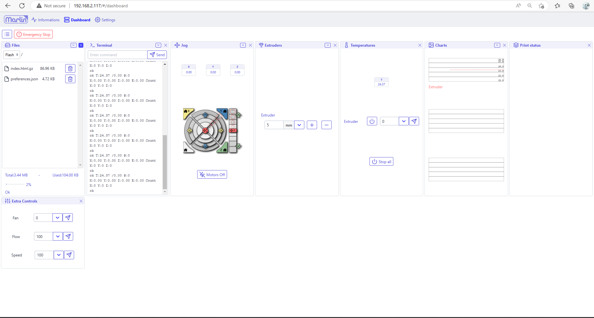

This version is the development version.

WebUI should support features of the following firmwares:    

* [Repetier 1.0/2.0](https://www.repetier.com/documentation/repetier-firmware/)
* [Marlin 1.X/2.X](https://marlinfw.org/)
* [Smoothieware 1.x](https://smoothieware.org/)
* [grbl 1.x](https://github.com/gnea/grbl) 
* [grblHAL](https://github.com/grblHAL)

The ESP3D-WEBUI 3.X must be used with [ESP3D 3.X](/ESP3D/Version_3.X/), [ESP3DLib 3.X](/ESP3Lib/Version_3.X/) and [grblHAL](https://github.com/grblHAL)
It won't work with older versions.
