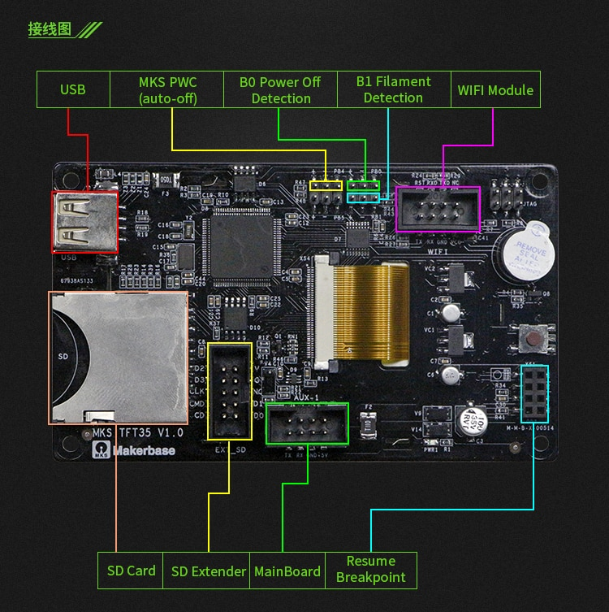

The board has a MKS WiFi Module connector 8 pins

| <!-- -->  | <!-- --> |
|-|-|
| Board pins socket | MKS WiFi Module 8 pins |
| Board firmware | MKS | 
| Board configuration note |
| ESP3D configuration note | MKS serial, no SD |