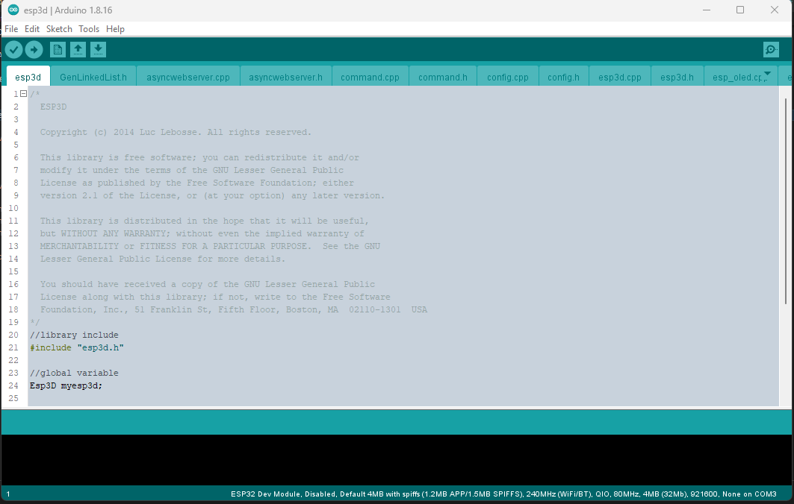

## Prepare the development environment
* Please download ide from https://www.arduino.cc/en/software
 
!!! warning "Note"
      Please use the Legacy IDE (1.8.X), the Arduino IDE 2.X  was not tested and won't be supported 

* Install the esp core according your target:  
 
&#9755;&nbsp;If [ESP8266](https://github.com/esp8266/arduino#contents)

!!! warning "Note"
      Please use the version 2.5.2 or 2.7.4 only! Do not use any version upper than 2.7.4 
 
&nbsp;&nbsp;&nbsp;&nbsp;&#9755;&nbsp;If  [ESP32](https://docs.espressif.com/projects/arduino-esp32/en/latest/installing.html)

!!! warning "Note"
      Please use the version 1.0.4 only! Do not use any version upper than 1.0.4, and only use ESP32 board, other ESP32 flavors(C2, S2, S3, etc)  are not supported in this version.
 

* Copy the content of the [libraries directory](https://github.com/luc-github/ESP3D/tree/2.1.x/libraries) to your arduino library directory.

!!! warning "Note"
      Do not try any version different than the ones provided, they may not work properly. 

## Open esp3d/esp3d.ino file in Arduino IDE

{ width="400" }



## Configure Flash settings

### For ESP8266 with 4MB of flash

* Board: Generic ESP8266 Module
* Upload Speed:  115200
* CPU frequency: 160 MHz
* Flash Size:  4M (2M SPIFFS)
* Flash Mode: DIO
* Flash Frequency: 40Mhz
* Reset Method: CK
* Debug Port: Disabled
* Debug Level: None

### For ESP8266 with 1MB of flash (this one may not support Web Update due to limited flash size)

* Board: Generic ESP8266 Module
* Upload Speed:  115200
* CPU frequency: 160 MHz
* Flash Size:  1M (128K SPIFFS)
* Flash Mode: DIO
* Flash Frequency: 40Mhz
* Reset Method: CK
* Debug Port: Disabled
* Debug Level: None

### For ESP32 with 4MB of flash

* Board: ESP32 Dev Module
* Upload Speed:  115200
* CPU frequency: 240 MHz 
* Flash Frequency: 80Mhz
* Flash Mode: QIO
* Flash Size:  4MB
* Partition Scheme: Default 4MB with SPIFFS
* Core Debug Level: None
* PSRAM: Disabled

## [Connect your board](/esp3d/v2.x/installation/#connect-your-board)

## Compile and flash your module

Select the port you device is connected to and select `Upload` from sketch menu to compile and flash.

