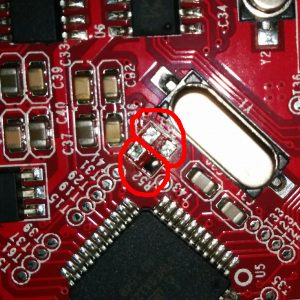
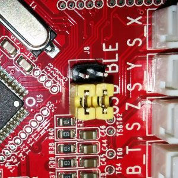
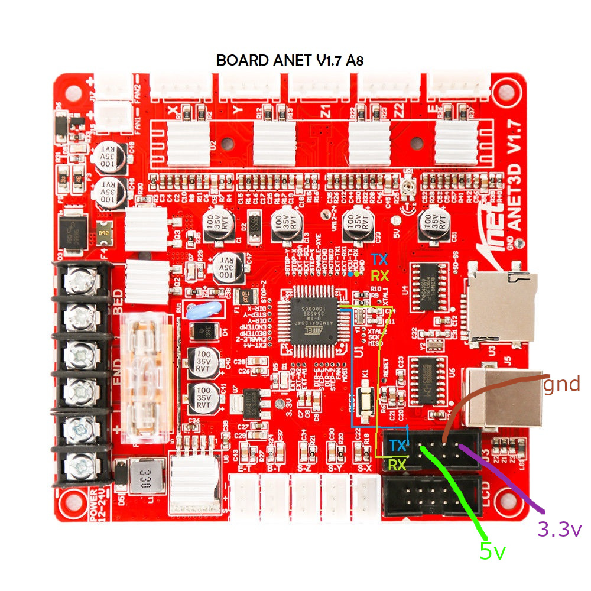

#### Anet boards up to v1.5

* Step 1

You will have to unsolder the resistors R52 and R53 – they are zero ohm resistors, and serve no other purpose than connecting the atmega chip directly to the onboard USB to UART converter (the CH340 chip). Do it VERY careful – you don’t want to damage your board. If you don’t feel confident – don’t do it.

* Step 2

Prepare the printer’s motherboard. It requires a simple modification, that does not interfere with it’s operation afterwards – just solder 3 pin x 2 row male header on J8, and add 2 jumpers (or jumper wires) as shown on the picture:

* Step 3

Connect the ESP to J3 repsecting pinout

##### Pinout

|ESP|J3|
|:---:|:---:|
|Tx|Rx|
|Rx|Tx|
|GND|GND|
|VCC|3.3V|
|CH_PD|3.3V|

####  Anet boards v1.7

Unlike older boards this board does not require you to remove any resistors.  
You will have to solder two wires from number 9 and number 10 its recommender to connect these to pin 1 and 2 of J3 connector.  

| <!-- -->  | <!-- --> |
|-|-|
| Board pins voltage | 5V |
| Board firmware | Marlin | 
| Board configuration note | None, it use same serial as USB port so don't use both together|
| ESP3D configuration note | Raw serial, no SD |