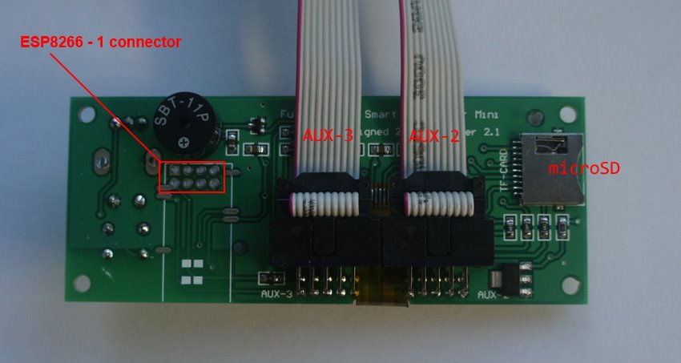

The board has footprint for an ESP01 connector

| <!-- -->  | <!-- --> |
|-|-|
| Board pins voltage | 3.3v |
| Board firmware | Smoothieware | 
| Board configuration note | Enable second serial port in the config.txt |
| ESP3D configuration note | Raw serial, no SD |
